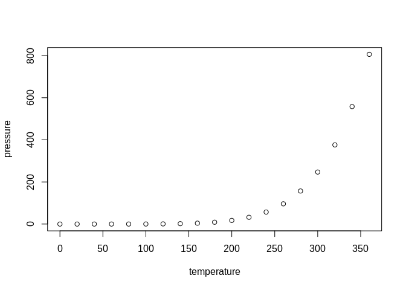

<!-- README.md is generated from README.Rmd. Please edit that file -->

# Covid19

<!-- badges: start -->

[](https://travis-ci.com/kian79/Covid19)
[](https://CRAN.R-project.org/package=Covid19)
[](https://www.tidyverse.org/lifecycle/#stable)
<!-- badges: end -->

The goal of Covid19 is to …

## Installation

You can install the released version of Covid19 from
[CRAN](https://CRAN.R-project.org) with:

``` r
install.packages("Covid19")
```

And the development version from [GitHub](https://github.com/) with:

``` r
# install.packages("devtools")
devtools::install_github("kian79/Covid19")
```

## Example

This is a basic example which shows you how to solve a common problem:

``` r
library(Covid19)
## basic example code
fetch_data()
#> 
#> Attaching package: 'dplyr'
#> The following objects are masked from 'package:stats':
#> 
#>     filter, lag
#> The following objects are masked from 'package:base':
#> 
#>     intersect, setdiff, setequal, union
#> [1] "X1.22.20"
#> [1] "X1.23.20"
#> [1] "X1.24.20"
#> [1] "X1.25.20"
#> [1] "X1.26.20"
#> [1] "X1.27.20"
#> [1] "X1.28.20"
#> [1] "X1.29.20"
#> [1] "X1.30.20"
#> [1] "X1.31.20"
#> [1] "X2.1.20"
#> [1] "X2.2.20"
#> [1] "X2.3.20"
#> [1] "X2.4.20"
#> [1] "X2.5.20"
#> [1] "X2.6.20"
#> [1] "X2.7.20"
#> [1] "X2.8.20"
#> [1] "X2.9.20"
#> [1] "X2.10.20"
#> [1] "X2.11.20"
#> [1] "X2.12.20"
#> [1] "X2.13.20"
#> [1] "X2.14.20"
#> [1] "X2.15.20"
#> [1] "X2.16.20"
#> [1] "X2.17.20"
#> [1] "X2.18.20"
#> [1] "X2.19.20"
#> [1] "X2.20.20"
#> [1] "X2.21.20"
#> [1] "X2.22.20"
#> [1] "X2.23.20"
#> [1] "X2.24.20"
#> [1] "X2.25.20"
#> [1] "X2.26.20"
#> [1] "X2.27.20"
#> [1] "X2.28.20"
#> [1] "X2.29.20"
#> [1] "X3.1.20"
#> [1] "X3.2.20"
#> [1] "X3.3.20"
#> [1] "X3.4.20"
#> [1] "X3.5.20"
#> [1] "X3.6.20"
#> [1] "X3.7.20"
#> [1] "X3.8.20"
#> [1] "X3.9.20"
#> [1] "X3.10.20"
#> [1] "X3.11.20"
#> [1] "X3.12.20"
#> [1] "X3.13.20"
#> [1] "X3.14.20"
#> [1] "X3.15.20"
#> [1] "X3.16.20"
#> [1] "X3.17.20"
#> [1] "X3.18.20"
#> [1] "X3.19.20"
#> [1] "X3.20.20"
#> [1] "X3.21.20"
#> [1] "X3.22.20"
#> [1] "X3.23.20"
#> [1] "X3.24.20"
#> [1] "X3.25.20"
#> [1] "X3.26.20"
#> [1] "X3.27.20"
#> [1] "X3.28.20"
#> [1] "X3.29.20"
#> [1] "X3.30.20"
#> [1] "X3.31.20"
#> [1] "X4.1.20"
#> [1] "X4.2.20"
#> [1] "X4.3.20"
#> [1] "X4.4.20"
#> [1] "X4.5.20"
#> [1] "X4.6.20"
#> [1] "X4.7.20"
#> [1] "X4.8.20"
#> [1] "X4.9.20"
#> [1] "X4.10.20"
#> [1] "X4.11.20"
#> [1] "X4.12.20"
#> [1] "X4.13.20"
#> [1] "X4.14.20"
#> [1] "X4.15.20"
#> [1] "X4.16.20"
#> [1] "X4.17.20"
#> [1] "X4.18.20"
#> [1] "X4.19.20"
#> [1] "X4.20.20"
#> [1] "X4.21.20"
#> [1] "X4.22.20"
#> [1] "X4.23.20"
#> [1] "X4.24.20"
#> [1] "X4.25.20"
#> [1] "X4.26.20"
#> [1] "X4.27.20"
#> [1] "X4.28.20"
#> [1] "X4.29.20"
#> [1] "X4.30.20"
#> [1] "X5.1.20"
#> [1] "X5.2.20"
#> [1] "X5.3.20"
#> [1] "X5.4.20"
#> [1] "X5.5.20"
#> [1] "X5.6.20"
#> [1] "X5.7.20"
#> [1] "X5.8.20"
#> [1] "X5.9.20"
#> [1] "X5.10.20"
#> [1] "X5.11.20"
#> [1] "X5.12.20"
#> [1] "X5.13.20"
#> [1] "X5.14.20"
#> [1] "X5.15.20"
#> [1] "X5.16.20"
#> [1] "X5.17.20"
#> [1] "X5.18.20"
#> [1] "X5.19.20"
#> [1] "X5.20.20"
#> [1] "X5.21.20"
#> [1] "X5.22.20"
#> [1] "X5.23.20"
#> [1] "X5.24.20"
#> [1] "X5.25.20"
#> [1] "X5.26.20"
#> [1] "X5.27.20"
#> [1] "X5.28.20"
#> [1] "X5.29.20"
#> [1] "X5.30.20"
#> [1] "X5.31.20"
#> [1] "X6.1.20"
#> [1] "X6.2.20"
#> [1] "X6.3.20"
#> [1] "X6.4.20"
#> [1] "X6.5.20"
#> [1] "X6.6.20"
#> [1] "X6.7.20"
#> [1] "X6.8.20"
#> [1] "X6.9.20"
#> [1] "X6.10.20"
#> [1] "X6.11.20"
#> [1] "X6.12.20"
#> [1] "X6.13.20"
#> [1] "X6.14.20"
#> [1] "X6.15.20"
#> [1] "X6.16.20"
#> [1] "X6.17.20"
#> [1] "X6.18.20"
#> [1] "X6.19.20"
#> [1] "X6.20.20"
#> [1] "X6.21.20"
#> [1] "X6.22.20"
#> [1] "X6.23.20"
#> [1] "X6.24.20"
#> [1] "X6.25.20"
#> [1] "X6.26.20"
#> [1] "X6.27.20"
#> [1] "X6.28.20"
#> [1] "X6.29.20"
#> [1] "X6.30.20"
#> [1] "X7.1.20"
#> [1] "X7.2.20"
#> [1] "X7.3.20"
#> [1] "X7.4.20"
#> [1] "X7.5.20"
#> [1] "X7.6.20"
#> [1] "X7.7.20"
#> [1] "X7.8.20"
#> [1] "X7.9.20"
#> [1] "X7.10.20"
#> [1] "X7.11.20"
#> [1] "X7.12.20"
#> [1] "X7.13.20"
#> [1] "X7.14.20"
#> [1] "X7.15.20"
#> [1] "X7.16.20"
#> [1] "X7.17.20"
#> [1] "X7.18.20"
#> [1] "X7.19.20"
#> [1] "X7.20.20"
#> [1] "X7.21.20"
#> [1] "X7.22.20"
#> [1] "X7.23.20"
#> [1] "X7.24.20"
#> [1] "X7.25.20"
#> [1] "X7.26.20"
#> [1] "X7.27.20"
#> [1] "X7.28.20"
#> [1] "X7.29.20"
#> [1] "X7.30.20"
#> [1] "X7.31.20"
#> [1] "X8.1.20"
#> [1] "X8.2.20"
#> [1] "X8.3.20"
#> [1] "X8.4.20"
#> [1] "X8.5.20"
#> [1] "X8.6.20"
#> [1] "X8.7.20"
#> [1] "X8.8.20"
#> [1] "X8.9.20"
#> [1] "X8.10.20"
#> [1] "X8.11.20"
#> [1] "X8.12.20"
#> [1] "X8.13.20"
#> [1] "X8.14.20"
#> [1] "X8.15.20"
#> [1] "X8.16.20"
#> [1] "X8.17.20"
#> [1] "X8.18.20"
#> [1] "X8.19.20"
#> [1] "X8.20.20"
#> [1] "X8.21.20"
#> [1] "X8.22.20"
#> [1] "X8.23.20"
#> [1] "X8.24.20"
#> [1] "X8.25.20"
#> [1] "X8.26.20"
#> [1] "X8.27.20"
#> [1] "X8.28.20"
#> [1] "X8.29.20"
#> [1] "X8.30.20"
#> [1] "X8.31.20"
#> [1] "X9.1.20"
#> [1] "X9.2.20"
#> [1] "X9.3.20"
#> [1] "X9.4.20"
#> [1] "X9.5.20"
#> [1] "X9.6.20"
#> [1] "X9.7.20"
#> [1] "X9.8.20"
#> [1] "X9.9.20"
#> [1] "X9.10.20"
#> [1] "X9.11.20"
#> [1] "X9.12.20"
#> [1] "X9.13.20"
#> [1] "X9.14.20"
#> [1] "X9.15.20"
#> [1] "X9.16.20"
#> [1] "X9.17.20"
#> [1] "X9.18.20"
#> [1] "X9.19.20"
#> [1] "X9.20.20"
#> [1] "X9.21.20"
#> [1] "X9.22.20"
#> [1] "X9.23.20"
#> [1] "X9.24.20"
#> [1] "X9.25.20"
#> [1] "X9.26.20"
#> [1] "X9.27.20"
#> [1] "X9.28.20"
#> [1] "X9.29.20"
#> [1] "X9.30.20"
#> [1] "X10.1.20"
#> [1] "X10.2.20"
#> [1] "X10.3.20"
#> [1] "X10.4.20"
#> [1] "X10.5.20"
#> [1] "X10.6.20"
#> [1] "X10.7.20"
#> [1] "X10.8.20"
#> [1] "X10.9.20"
#> [1] "X10.10.20"
#> [1] "X10.11.20"
#> [1] "X10.12.20"
#> [1] "X10.13.20"
#> [1] "X10.14.20"
#> [1] "X10.15.20"
#> [1] "X10.16.20"
#> [1] "X10.17.20"
#> [1] "X10.18.20"
#> [1] "X10.19.20"
#> [1] "X10.20.20"
#> [1] "X10.21.20"
#> [1] "X10.22.20"
#> [1] "X10.23.20"
#> [1] "X10.24.20"
#> [1] "X10.25.20"
#> [1] "X10.26.20"
#> [1] "X10.27.20"
#>                         Province.State                   Country.Region
#> 1                                                           Afghanistan
#> 2                                                               Albania
#> 3                                                               Algeria
#> 4                                                               Andorra
#> 5                                                                Angola
#> 6                                                   Antigua and Barbuda
#> 7                                                             Argentina
#> 8                                                               Armenia
#> 9         Australian Capital Territory                        Australia
#> 10                     New South Wales                        Australia
#> 11                  Northern Territory                        Australia
#> 12                          Queensland                        Australia
#> 13                     South Australia                        Australia
#> 14                            Tasmania                        Australia
#> 15                            Victoria                        Australia
#> 16                   Western Australia                        Australia
#> 17                                                              Austria
#> 18                                                           Azerbaijan
#> 19                                                              Bahamas
#> 20                                                              Bahrain
#> 21                                                           Bangladesh
#> 22                                                             Barbados
#> 23                                                              Belarus
#> 24                                                              Belgium
#> 25                                                               Belize
#> 26                                                                Benin
#> 27                                                               Bhutan
#> 28                                                              Bolivia
#> 29                                               Bosnia and Herzegovina
#> 30                                                             Botswana
#> 31                                                               Brazil
#> 32                                                               Brunei
#> 33                                                             Bulgaria
#> 34                                                         Burkina Faso
#> 35                                                                Burma
#> 36                                                              Burundi
#> 37                                                           Cabo Verde
#> 38                                                             Cambodia
#> 39                                                             Cameroon
#> 40                                                               Canada
#> 41                                             Central African Republic
#> 42                                                                 Chad
#> 43                                                                Chile
#> 44                               Anhui                            China
#> 45                             Beijing                            China
#> 46                           Chongqing                            China
#> 47                              Fujian                            China
#> 48                               Gansu                            China
#> 49                           Guangdong                            China
#> 50                             Guangxi                            China
#> 51                             Guizhou                            China
#> 52                              Hainan                            China
#> 53                               Hebei                            China
#> 54                        Heilongjiang                            China
#> 55                               Henan                            China
#> 56                           Hong Kong                            China
#> 57                               Hubei                            China
#> 58                               Hunan                            China
#> 59                      Inner Mongolia                            China
#> 60                             Jiangsu                            China
#> 61                             Jiangxi                            China
#> 62                               Jilin                            China
#> 63                            Liaoning                            China
#> 64                               Macau                            China
#> 65                             Ningxia                            China
#> 66                             Qinghai                            China
#> 67                             Shaanxi                            China
#> 68                            Shandong                            China
#> 69                            Shanghai                            China
#> 70                              Shanxi                            China
#> 71                             Sichuan                            China
#> 72                             Tianjin                            China
#> 73                               Tibet                            China
#> 74                            Xinjiang                            China
#> 75                              Yunnan                            China
#> 76                            Zhejiang                            China
#> 77                                                             Colombia
#> 78                                                              Comoros
#> 79                                                  Congo (Brazzaville)
#> 80                                                     Congo (Kinshasa)
#> 81                                                           Costa Rica
#> 82                                                        Cote d'Ivoire
#> 83                                                              Croatia
#> 84                                                                 Cuba
#> 85                                                               Cyprus
#> 86                                                              Czechia
#> 87                       Faroe Islands                          Denmark
#> 88                           Greenland                          Denmark
#> 89                                                              Denmark
#> 90                                                     Diamond Princess
#> 91                                                             Djibouti
#> 92                                                             Dominica
#> 93                                                   Dominican Republic
#> 94                                                              Ecuador
#> 95                                                                Egypt
#> 96                                                          El Salvador
#> 97                                                    Equatorial Guinea
#> 98                                                              Eritrea
#> 99                                                              Estonia
#> 100                                                            Eswatini
#> 101                                                            Ethiopia
#> 102                                                                Fiji
#> 103                                                             Finland
#> 104                      French Guiana                           France
#> 105                   French Polynesia                           France
#> 106                         Guadeloupe                           France
#> 107                         Martinique                           France
#> 108                            Mayotte                           France
#> 109                      New Caledonia                           France
#> 110                            Reunion                           France
#> 111                   Saint Barthelemy                           France
#> 112          Saint Pierre and Miquelon                           France
#> 113                          St Martin                           France
#> 114                                                              France
#> 115                                                               Gabon
#> 116                                                              Gambia
#> 117                                                             Georgia
#> 118                                                             Germany
#> 119                                                               Ghana
#> 120                                                              Greece
#> 121                                                             Grenada
#> 122                                                           Guatemala
#> 123                                                              Guinea
#> 124                                                       Guinea-Bissau
#> 125                                                              Guyana
#> 126                                                               Haiti
#> 127                                                            Holy See
#> 128                                                            Honduras
#> 129                                                             Hungary
#> 130                                                             Iceland
#> 131                                                               India
#> 132                                                           Indonesia
#> 133                                                                Iran
#> 134                                                                Iraq
#> 135                                                             Ireland
#> 136                                                              Israel
#> 137                                                               Italy
#> 138                                                             Jamaica
#> 139                                                               Japan
#> 140                                                              Jordan
#> 141                                                          Kazakhstan
#> 142                                                               Kenya
#> 143                                                        Korea, South
#> 144                                                              Kosovo
#> 145                                                              Kuwait
#> 146                                                          Kyrgyzstan
#> 147                                                                Laos
#> 148                                                              Latvia
#> 149                                                             Lebanon
#> 150                                                             Lesotho
#> 151                                                             Liberia
#> 152                                                               Libya
#> 153                                                       Liechtenstein
#> 154                                                           Lithuania
#> 155                                                          Luxembourg
#> 156                                                          MS Zaandam
#> 157                                                          Madagascar
#> 158                                                              Malawi
#> 159                                                            Malaysia
#> 160                                                            Maldives
#> 161                                                                Mali
#> 162                                                               Malta
#> 163                                                          Mauritania
#> 164                                                           Mauritius
#> 165                                                              Mexico
#> 166                                                             Moldova
#> 167                                                              Monaco
#> 168                                                            Mongolia
#> 169                                                          Montenegro
#> 170                                                             Morocco
#> 171                                                          Mozambique
#> 172                                                             Namibia
#> 173                                                               Nepal
#> 174                              Aruba                      Netherlands
#> 175   Bonaire, Sint Eustatius and Saba                      Netherlands
#> 176                            Curacao                      Netherlands
#> 177                       Sint Maarten                      Netherlands
#> 178                                                         Netherlands
#> 179                                                         New Zealand
#> 180                                                           Nicaragua
#> 181                                                               Niger
#> 182                                                             Nigeria
#> 183                                                     North Macedonia
#> 184                                                              Norway
#> 185                                                                Oman
#> 186                                                            Pakistan
#> 187                                                              Panama
#> 188                                                    Papua New Guinea
#> 189                                                            Paraguay
#> 190                                                                Peru
#> 191                                                         Philippines
#> 192                                                              Poland
#> 193                                                            Portugal
#> 194                                                               Qatar
#> 195                                                             Romania
#> 196                                                              Russia
#> 197                                                              Rwanda
#> 198                                               Saint Kitts and Nevis
#> 199                                                         Saint Lucia
#> 200                                    Saint Vincent and the Grenadines
#> 201                                                          San Marino
#> 202                                               Sao Tome and Principe
#> 203                                                        Saudi Arabia
#> 204                                                             Senegal
#> 205                                                              Serbia
#> 206                                                          Seychelles
#> 207                                                        Sierra Leone
#> 208                                                           Singapore
#> 209                                                            Slovakia
#> 210                                                            Slovenia
#> 211                                                     Solomon Islands
#> 212                                                             Somalia
#> 213                                                        South Africa
#> 214                                                         South Sudan
#> 215                                                               Spain
#> 216                                                           Sri Lanka
#> 217                                                               Sudan
#> 218                                                            Suriname
#> 219                                                              Sweden
#> 220                                                         Switzerland
#> 221                                                               Syria
#> 222                                                             Taiwan*
#> 223                                                          Tajikistan
#> 224                                                            Tanzania
#> 225                                                            Thailand
#> 226                                                         Timor-Leste
#> 227                                                                Togo
#> 228                                                 Trinidad and Tobago
#> 229                                                             Tunisia
#> 230                                                              Turkey
#> 231                                                                  US
#> 232                                                              Uganda
#> 233                                                             Ukraine
#> 234                                                United Arab Emirates
#> 235                           Anguilla                   United Kingdom
#> 236                            Bermuda                   United Kingdom
#> 237             British Virgin Islands                   United Kingdom
#> 238                     Cayman Islands                   United Kingdom
#> 239                    Channel Islands                   United Kingdom
#> 240        Falkland Islands (Malvinas)                   United Kingdom
#> 241                          Gibraltar                   United Kingdom
#> 242                        Isle of Man                   United Kingdom
#> 243                         Montserrat                   United Kingdom
#> 244           Turks and Caicos Islands                   United Kingdom
#> 245                                                      United Kingdom
#> 246                                                             Uruguay
#> 247                                                          Uzbekistan
#> 248                                                           Venezuela
#> 249                                                             Vietnam
#> 250                                                  West Bank and Gaza
#> 251                                                      Western Sahara
#> 252                                                               Yemen
#> 253                                                              Zambia
#> 254                                                            Zimbabwe
#> 255                                                         Afghanistan
#> 256                                                             Albania
#> 257                                                             Algeria
#> 258                                                             Andorra
#> 259                                                              Angola
#> 260                                                 Antigua and Barbuda
#> 261                                                           Argentina
#> 262                                                             Armenia
#> 263       Australian Capital Territory                        Australia
#> 264                    New South Wales                        Australia
#> 265                 Northern Territory                        Australia
#> 266                         Queensland                        Australia
#> 267                    South Australia                        Australia
#> 268                           Tasmania                        Australia
#> 269                           Victoria                        Australia
#> 270                  Western Australia                        Australia
#> 271                                                             Austria
#> 272                                                          Azerbaijan
#> 273                                                             Bahamas
#> 274                                                             Bahrain
#> 275                                                          Bangladesh
#> 276                                                            Barbados
#> 277                                                             Belarus
#> 278                                                             Belgium
#> 279                                                              Belize
#> 280                                                               Benin
#> 281                                                              Bhutan
#> 282                                                             Bolivia
#> 283                                              Bosnia and Herzegovina
#> 284                                                            Botswana
#> 285                                                              Brazil
#> 286                                                              Brunei
#> 287                                                            Bulgaria
#> 288                                                        Burkina Faso
#> 289                                                               Burma
#> 290                                                             Burundi
#> 291                                                          Cabo Verde
#> 292                                                            Cambodia
#> 293                                                            Cameroon
#> 294                                                              Canada
#> 295                                            Central African Republic
#> 296                                                                Chad
#> 297                                                               Chile
#> 298                              Anhui                            China
#> 299                            Beijing                            China
#> 300                          Chongqing                            China
#> 301                             Fujian                            China
#> 302                              Gansu                            China
#> 303                          Guangdong                            China
#> 304                            Guangxi                            China
#> 305                            Guizhou                            China
#> 306                             Hainan                            China
#> 307                              Hebei                            China
#> 308                       Heilongjiang                            China
#> 309                              Henan                            China
#> 310                          Hong Kong                            China
#> 311                              Hubei                            China
#> 312                              Hunan                            China
#> 313                     Inner Mongolia                            China
#> 314                            Jiangsu                            China
#> 315                            Jiangxi                            China
#> 316                              Jilin                            China
#> 317                           Liaoning                            China
#> 318                              Macau                            China
#> 319                            Ningxia                            China
#> 320                            Qinghai                            China
#> 321                            Shaanxi                            China
#> 322                           Shandong                            China
#> 323                           Shanghai                            China
#> 324                             Shanxi                            China
#> 325                            Sichuan                            China
#> 326                            Tianjin                            China
#> 327                              Tibet                            China
#> 328                           Xinjiang                            China
#> 329                             Yunnan                            China
#> 330                           Zhejiang                            China
#> 331                                                            Colombia
#> 332                                                             Comoros
#> 333                                                 Congo (Brazzaville)
#> 334                                                    Congo (Kinshasa)
#> 335                                                          Costa Rica
#> 336                                                       Cote d'Ivoire
#> 337                                                             Croatia
#> 338                                                                Cuba
#> 339                                                              Cyprus
#> 340                                                             Czechia
#> 341                      Faroe Islands                          Denmark
#> 342                          Greenland                          Denmark
#> 343                                                             Denmark
#> 344                                                    Diamond Princess
#> 345                                                            Djibouti
#> 346                                                            Dominica
#> 347                                                  Dominican Republic
#> 348                                                             Ecuador
#> 349                                                               Egypt
#> 350                                                         El Salvador
#> 351                                                   Equatorial Guinea
#> 352                                                             Eritrea
#> 353                                                             Estonia
#> 354                                                            Eswatini
#> 355                                                            Ethiopia
#> 356                                                                Fiji
#> 357                                                             Finland
#> 358                      French Guiana                           France
#> 359                   French Polynesia                           France
#> 360                         Guadeloupe                           France
#> 361                         Martinique                           France
#> 362                            Mayotte                           France
#> 363                      New Caledonia                           France
#> 364                            Reunion                           France
#> 365                   Saint Barthelemy                           France
#> 366          Saint Pierre and Miquelon                           France
#> 367                          St Martin                           France
#> 368                                                              France
#> 369                                                               Gabon
#> 370                                                              Gambia
#> 371                                                             Georgia
#> 372                                                             Germany
#> 373                                                               Ghana
#> 374                                                              Greece
#> 375                                                             Grenada
#> 376                                                           Guatemala
#> 377                                                              Guinea
#> 378                                                       Guinea-Bissau
#> 379                                                              Guyana
#> 380                                                               Haiti
#> 381                                                            Holy See
#> 382                                                            Honduras
#> 383                                                             Hungary
#> 384                                                             Iceland
#> 385                                                               India
#> 386                                                           Indonesia
#> 387                                                                Iran
#> 388                                                                Iraq
#> 389                                                             Ireland
#> 390                                                              Israel
#> 391                                                               Italy
#> 392                                                             Jamaica
#> 393                                                               Japan
#> 394                                                              Jordan
#> 395                                                          Kazakhstan
#> 396                                                               Kenya
#> 397                                                        Korea, South
#> 398                                                              Kosovo
#> 399                                                              Kuwait
#> 400                                                          Kyrgyzstan
#> 401                                                                Laos
#> 402                                                              Latvia
#> 403                                                             Lebanon
#> 404                                                             Lesotho
#> 405                                                             Liberia
#> 406                                                               Libya
#> 407                                                       Liechtenstein
#> 408                                                           Lithuania
#> 409                                                          Luxembourg
#> 410                                                          MS Zaandam
#> 411                                                          Madagascar
#> 412                                                              Malawi
#> 413                                                            Malaysia
#> 414                                                            Maldives
#> 415                                                                Mali
#> 416                                                               Malta
#> 417                                                          Mauritania
#> 418                                                           Mauritius
#> 419                                                              Mexico
#> 420                                                             Moldova
#> 421                                                              Monaco
#> 422                                                            Mongolia
#> 423                                                          Montenegro
#> 424                                                             Morocco
#> 425                                                          Mozambique
#> 426                                                             Namibia
#> 427                                                               Nepal
#> 428                              Aruba                      Netherlands
#> 429   Bonaire, Sint Eustatius and Saba                      Netherlands
#> 430                            Curacao                      Netherlands
#> 431                       Sint Maarten                      Netherlands
#> 432                                                         Netherlands
#> 433                                                         New Zealand
#> 434                                                           Nicaragua
#> 435                                                               Niger
#> 436                                                             Nigeria
#> 437                                                     North Macedonia
#> 438                                                              Norway
#> 439                                                                Oman
#> 440                                                            Pakistan
#> 441                                                              Panama
#> 442                                                    Papua New Guinea
#> 443                                                            Paraguay
#> 444                                                                Peru
#> 445                                                         Philippines
#> 446                                                              Poland
#> 447                                                            Portugal
#> 448                                                               Qatar
#> 449                                                             Romania
#> 450                                                              Russia
#> 451                                                              Rwanda
#> 452                                               Saint Kitts and Nevis
#> 453                                                         Saint Lucia
#> 454                                    Saint Vincent and the Grenadines
#> 455                                                          San Marino
#> 456                                               Sao Tome and Principe
#> 457                                                        Saudi Arabia
#> 458                                                             Senegal
#> 459                                                              Serbia
#> 460                                                          Seychelles
#> 461                                                        Sierra Leone
#> 462                                                           Singapore
#> 463                                                            Slovakia
#> 464                                                            Slovenia
#> 465                                                     Solomon Islands
#> 466                                                             Somalia
#> 467                                                        South Africa
#> 468                                                         South Sudan
#> 469                                                               Spain
#> 470                                                           Sri Lanka
#> 471                                                               Sudan
#> 472                                                            Suriname
#> 473                                                              Sweden
#> 474                                                         Switzerland
#> 475                                                               Syria
#> 476                                                             Taiwan*
#> 477                                                          Tajikistan
#> 478                                                            Tanzania
#> 479                                                            Thailand
#> 480                                                         Timor-Leste
#> 481                                                                Togo
#> 482                                                 Trinidad and Tobago
#> 483                                                             Tunisia
#> 484                                                              Turkey
#> 485                                                                  US
#> 486                                                              Uganda
#> 487                                                             Ukraine
#> 488                                                United Arab Emirates
#> 489                           Anguilla                   United Kingdom
#> 490                            Bermuda                   United Kingdom
#> 491             British Virgin Islands                   United Kingdom
#> 492                     Cayman Islands                   United Kingdom
#> 493                    Channel Islands                   United Kingdom
#> 494        Falkland Islands (Malvinas)                   United Kingdom
#> 495                          Gibraltar                   United Kingdom
#> 496                        Isle of Man                   United Kingdom
#> 497                         Montserrat                   United Kingdom
#> 498           Turks and Caicos Islands                   United Kingdom
#> 499                                                      United Kingdom
#> 500                                                             Uruguay
#> 501                                                          Uzbekistan
#> 502                                                           Venezuela
#> 503                                                             Vietnam
#> 504                                                  West Bank and Gaza
#> 505                                                      Western Sahara
#> 506                                                               Yemen
#> 507                                                              Zambia
#> 508                                                            Zimbabwe
#> 509                                                         Afghanistan
#> 510                                                             Albania
#> 511                                                             Algeria
#> 512                                                             Andorra
#> 513                                                              Angola
#> 514                                                 Antigua and Barbuda
#> 515                                                           Argentina
#> 516                                                             Armenia
#> 517       Australian Capital Territory                        Australia
#> 518                    New South Wales                        Australia
#> 519                 Northern Territory                        Australia
#> 520                         Queensland                        Australia
#> 521                    South Australia                        Australia
#> 522                           Tasmania                        Australia
#> 523                           Victoria                        Australia
#> 524                  Western Australia                        Australia
#> 525                                                             Austria
#> 526                                                          Azerbaijan
#> 527                                                             Bahamas
#> 528                                                             Bahrain
#> 529                                                          Bangladesh
#> 530                                                            Barbados
#> 531                                                             Belarus
#> 532                                                             Belgium
#> 533                                                              Belize
#> 534                                                               Benin
#> 535                                                              Bhutan
#> 536                                                             Bolivia
#> 537                                              Bosnia and Herzegovina
#> 538                                                            Botswana
#> 539                                                              Brazil
#> 540                                                              Brunei
#> 541                                                            Bulgaria
#> 542                                                        Burkina Faso
#> 543                                                               Burma
#> 544                                                             Burundi
#> 545                                                          Cabo Verde
#> 546                                                            Cambodia
#> 547                                                            Cameroon
#> 548                                                              Canada
#> 549                                            Central African Republic
#> 550                                                                Chad
#> 551                                                               Chile
#> 552                              Anhui                            China
#> 553                            Beijing                            China
#> 554                          Chongqing                            China
#> 555                             Fujian                            China
#> 556                              Gansu                            China
#> 557                          Guangdong                            China
#> 558                            Guangxi                            China
#> 559                            Guizhou                            China
#> 560                             Hainan                            China
#> 561                              Hebei                            China
#> 562                       Heilongjiang                            China
#> 563                              Henan                            China
#> 564                          Hong Kong                            China
#> 565                              Hubei                            China
#> 566                              Hunan                            China
#> 567                     Inner Mongolia                            China
#> 568                            Jiangsu                            China
#> 569                            Jiangxi                            China
#> 570                              Jilin                            China
#> 571                           Liaoning                            China
#> 572                              Macau                            China
#> 573                            Ningxia                            China
#> 574                            Qinghai                            China
#> 575                            Shaanxi                            China
#> 576                           Shandong                            China
#> 577                           Shanghai                            China
#> 578                             Shanxi                            China
#> 579                            Sichuan                            China
#> 580                            Tianjin                            China
#> 581                              Tibet                            China
#> 582                           Xinjiang                            China
#> 583                             Yunnan                            China
#> 584                           Zhejiang                            China
#> 585                                                            Colombia
#> 586                                                             Comoros
#> 587                                                 Congo (Brazzaville)
#> 588                                                    Congo (Kinshasa)
#> 589                                                          Costa Rica
#> 590                                                       Cote d'Ivoire
#> 591                                                             Croatia
#> 592                                                                Cuba
#> 593                                                              Cyprus
#> 594                                                             Czechia
#> 595                      Faroe Islands                          Denmark
#> 596                          Greenland                          Denmark
#> 597                                                             Denmark
#> 598                                                    Diamond Princess
#> 599                                                            Djibouti
#> 600                                                            Dominica
#> 601                                                  Dominican Republic
#> 602                                                             Ecuador
#> 603                                                               Egypt
#> 604                                                         El Salvador
#> 605                                                   Equatorial Guinea
#> 606                                                             Eritrea
#> 607                                                             Estonia
#> 608                                                            Eswatini
#> 609                                                            Ethiopia
#> 610                                                                Fiji
#> 611                                                             Finland
#> 612                      French Guiana                           France
#> 613                   French Polynesia                           France
#> 614                         Guadeloupe                           France
#> 615                         Martinique                           France
#> 616                            Mayotte                           France
#> 617                      New Caledonia                           France
#> 618                            Reunion                           France
#> 619                   Saint Barthelemy                           France
#> 620          Saint Pierre and Miquelon                           France
#> 621                          St Martin                           France
#> 622                                                              France
#> 623                                                               Gabon
#> 624                                                              Gambia
#> 625                                                             Georgia
#> 626                                                             Germany
#> 627                                                               Ghana
#> 628                                                              Greece
#> 629                                                             Grenada
#> 630                                                           Guatemala
#> 631                                                              Guinea
#> 632                                                       Guinea-Bissau
#> 633                                                              Guyana
#> 634                                                               Haiti
#> 635                                                            Holy See
#> 636                                                            Honduras
#> 637                                                             Hungary
#> 638                                                             Iceland
#> 639                                                               India
#> 640                                                           Indonesia
#> 641                                                                Iran
#> 642                                                                Iraq
#> 643                                                             Ireland
#> 644                                                              Israel
#> 645                                                               Italy
#> 646                                                             Jamaica
#> 647                                                               Japan
#> 648                                                              Jordan
#> 649                                                          Kazakhstan
#> 650                                                               Kenya
#> 651                                                        Korea, South
#> 652                                                              Kosovo
#> 653                                                              Kuwait
#> 654                                                          Kyrgyzstan
#> 655                                                                Laos
#> 656                                                              Latvia
#> 657                                                             Lebanon
#> 658                                                             Lesotho
#> 659                                                             Liberia
#> 660                                                               Libya
#> 661                                                       Liechtenstein
#> 662                                                           Lithuania
#> 663                                                          Luxembourg
#> 664                                                          MS Zaandam
#> 665                                                          Madagascar
#> 666                                                              Malawi
#> 667                                                            Malaysia
#> 668                                                            Maldives
#> 669                                                                Mali
#> 670                                                               Malta
#> 671                                                          Mauritania
#> 672                                                           Mauritius
#> 673                                                              Mexico
#> 674                                                             Moldova
#> 675                                                              Monaco
#> 676                                                            Mongolia
#> 677                                                          Montenegro
#> 678                                                             Morocco
#> 679                                                          Mozambique
#> 680                                                             Namibia
#> 681                                                               Nepal
#> 682                              Aruba                      Netherlands
#> 683   Bonaire, Sint Eustatius and Saba                      Netherlands
#> 684                            Curacao                      Netherlands
#> 685                       Sint Maarten                      Netherlands
#> 686                                                         Netherlands
#> 687                                                         New Zealand
#> 688                                                           Nicaragua
#> 689                                                               Niger
#> 690                                                             Nigeria
#> 691                                                     North Macedonia
#> 692                                                              Norway
#> 693                                                                Oman
#> 694                                                            Pakistan
#> 695                                                              Panama
#> 696                                                    Papua New Guinea
#> 697                                                            Paraguay
#> 698                                                                Peru
#> 699                                                         Philippines
#> 700                                                              Poland
#> 701                                                            Portugal
#> 702                                                               Qatar
#> 703                                                             Romania
#> 704                                                              Russia
#> 705                                                              Rwanda
#> 706                                               Saint Kitts and Nevis
#> 707                                                         Saint Lucia
#> 708                                    Saint Vincent and the Grenadines
#> 709                                                          San Marino
#> 710                                               Sao Tome and Principe
#> 711                                                        Saudi Arabia
#> 712                                                             Senegal
#> 713                                                              Serbia
#> 714                                                          Seychelles
#> 715                                                        Sierra Leone
#> 716                                                           Singapore
#> 717                                                            Slovakia
#> 718                                                            Slovenia
#> 719                                                     Solomon Islands
#> 720                                                             Somalia
#> 721                                                        South Africa
#> 722                                                         South Sudan
#> 723                                                               Spain
#> 724                                                           Sri Lanka
#> 725                                                               Sudan
#> 726                                                            Suriname
#> 727                                                              Sweden
#> 728                                                         Switzerland
#> 729                                                               Syria
#> 730                                                             Taiwan*
#> 731                                                          Tajikistan
#> 732                                                            Tanzania
#> 733                                                            Thailand
#> 734                                                         Timor-Leste
#> 735                                                                Togo
#> 736                                                 Trinidad and Tobago
#> 737                                                             Tunisia
#> 738                                                              Turkey
#> 739                                                                  US
#> 740                                                              Uganda
#> 741                                                             Ukraine
#> 742                                                United Arab Emirates
#> 743                           Anguilla                   United Kingdom
#> 744                            Bermuda                   United Kingdom
#> 745             British Virgin Islands                   United Kingdom
#> 746                     Cayman Islands                   United Kingdom
#> 747                    Channel Islands                   United Kingdom
#> 748        Falkland Islands (Malvinas)                   United Kingdom
#> 749                          Gibraltar                   United Kingdom
#> 750                        Isle of Man                   United Kingdom
#> 751                         Montserrat                   United Kingdom
#> 752           Turks and Caicos Islands                   United Kingdom
#> 753                                                      United Kingdom
#> 754                                                             Uruguay
#> 755                                                          Uzbekistan
#> 756                                                           Venezuela
#> 757                                                             Vietnam
#> 758                                                  West Bank and Gaza
#> 759                                                      Western Sahara
#> 760                                                               Yemen
#> 761                                                              Zambia
#> 762                                                            Zimbabwe
#> 763                                                         Afghanistan
#> 764                                                             Albania
#> 765                                                             Algeria
#> 766                                                             Andorra
#> 767                                                              Angola
#> 768                                                 Antigua and Barbuda
#> 769                                                           Argentina
#> 770                                                             Armenia
#> 771       Australian Capital Territory                        Australia
#> 772                    New South Wales                        Australia
#> 773                 Northern Territory                        Australia
#> 774                         Queensland                        Australia
#> 775                    South Australia                        Australia
#> 776                           Tasmania                        Australia
#> 777                           Victoria                        Australia
#> 778                  Western Australia                        Australia
#> 779                                                             Austria
#> 780                                                          Azerbaijan
#> 781                                                             Bahamas
#> 782                                                             Bahrain
#> 783                                                          Bangladesh
#> 784                                                            Barbados
#> 785                                                             Belarus
#> 786                                                             Belgium
#> 787                                                              Belize
#> 788                                                               Benin
#> 789                                                              Bhutan
#> 790                                                             Bolivia
#> 791                                              Bosnia and Herzegovina
#> 792                                                            Botswana
#> 793                                                              Brazil
#> 794                                                              Brunei
#> 795                                                            Bulgaria
#> 796                                                        Burkina Faso
#> 797                                                               Burma
#> 798                                                             Burundi
#> 799                                                          Cabo Verde
#> 800                                                            Cambodia
#> 801                                                            Cameroon
#> 802                                                              Canada
#> 803                                            Central African Republic
#> 804                                                                Chad
#> 805                                                               Chile
#> 806                              Anhui                            China
#> 807                            Beijing                            China
#> 808                          Chongqing                            China
#> 809                             Fujian                            China
#> 810                              Gansu                            China
#> 811                          Guangdong                            China
#> 812                            Guangxi                            China
#> 813                            Guizhou                            China
#> 814                             Hainan                            China
#> 815                              Hebei                            China
#> 816                       Heilongjiang                            China
#> 817                              Henan                            China
#> 818                          Hong Kong                            China
#> 819                              Hubei                            China
#> 820                              Hunan                            China
#> 821                     Inner Mongolia                            China
#> 822                            Jiangsu                            China
#> 823                            Jiangxi                            China
#> 824                              Jilin                            China
#> 825                           Liaoning                            China
#> 826                              Macau                            China
#> 827                            Ningxia                            China
#> 828                            Qinghai                            China
#> 829                            Shaanxi                            China
#> 830                           Shandong                            China
#> 831                           Shanghai                            China
#> 832                             Shanxi                            China
#> 833                            Sichuan                            China
#> 834                            Tianjin                            China
#> 835                              Tibet                            China
#> 836                           Xinjiang                            China
#> 837                             Yunnan                            China
#> 838                           Zhejiang                            China
#> 839                                                            Colombia
#> 840                                                             Comoros
#> 841                                                 Congo (Brazzaville)
#> 842                                                    Congo (Kinshasa)
#> 843                                                          Costa Rica
#> 844                                                       Cote d'Ivoire
#> 845                                                             Croatia
#> 846                                                                Cuba
#> 847                                                              Cyprus
#> 848                                                             Czechia
#> 849                      Faroe Islands                          Denmark
#> 850                          Greenland                          Denmark
#> 851                                                             Denmark
#> 852                                                    Diamond Princess
#> 853                                                            Djibouti
#> 854                                                            Dominica
#> 855                                                  Dominican Republic
#> 856                                                             Ecuador
#> 857                                                               Egypt
#> 858                                                         El Salvador
#> 859                                                   Equatorial Guinea
#> 860                                                             Eritrea
#> 861                                                             Estonia
#> 862                                                            Eswatini
#> 863                                                            Ethiopia
#> 864                                                                Fiji
#> 865                                                             Finland
#> 866                      French Guiana                           France
#> 867                   French Polynesia                           France
#> 868                         Guadeloupe                           France
#> 869                         Martinique                           France
#> 870                            Mayotte                           France
#> 871                      New Caledonia                           France
#> 872                            Reunion                           France
#> 873                   Saint Barthelemy                           France
#> 874          Saint Pierre and Miquelon                           France
#> 875                          St Martin                           France
#> 876                                                              France
#> 877                                                               Gabon
#> 878                                                              Gambia
#> 879                                                             Georgia
#> 880                                                             Germany
#> 881                                                               Ghana
#> 882                                                              Greece
#> 883                                                             Grenada
#> 884                                                           Guatemala
#> 885                                                              Guinea
#> 886                                                       Guinea-Bissau
#> 887                                                              Guyana
#> 888                                                               Haiti
#> 889                                                            Holy See
#> 890                                                            Honduras
#> 891                                                             Hungary
#> 892                                                             Iceland
#> 893                                                               India
#> 894                                                           Indonesia
#> 895                                                                Iran
#> 896                                                                Iraq
#> 897                                                             Ireland
#> 898                                                              Israel
#> 899                                                               Italy
#> 900                                                             Jamaica
#> 901                                                               Japan
#> 902                                                              Jordan
#> 903                                                          Kazakhstan
#> 904                                                               Kenya
#> 905                                                        Korea, South
#> 906                                                              Kosovo
#> 907                                                              Kuwait
#> 908                                                          Kyrgyzstan
#> 909                                                                Laos
#> 910                                                              Latvia
#> 911                                                             Lebanon
#> 912                                                             Lesotho
#> 913                                                             Liberia
#> 914                                                               Libya
#> 915                                                       Liechtenstein
#> 916                                                           Lithuania
#> 917                                                          Luxembourg
#> 918                                                          MS Zaandam
#> 919                                                          Madagascar
#> 920                                                              Malawi
#> 921                                                            Malaysia
#> 922                                                            Maldives
#> 923                                                                Mali
#> 924                                                               Malta
#> 925                                                          Mauritania
#> 926                                                           Mauritius
#> 927                                                              Mexico
#> 928                                                             Moldova
#> 929                                                              Monaco
#> 930                                                            Mongolia
#> 931                                                          Montenegro
#> 932                                                             Morocco
#> 933                                                          Mozambique
#> 934                                                             Namibia
#> 935                                                               Nepal
#> 936                              Aruba                      Netherlands
#> 937   Bonaire, Sint Eustatius and Saba                      Netherlands
#> 938                            Curacao                      Netherlands
#> 939                       Sint Maarten                      Netherlands
#> 940                                                         Netherlands
#> 941                                                         New Zealand
#> 942                                                           Nicaragua
#> 943                                                               Niger
#> 944                                                             Nigeria
#> 945                                                     North Macedonia
#> 946                                                              Norway
#> 947                                                                Oman
#> 948                                                            Pakistan
#> 949                                                              Panama
#> 950                                                    Papua New Guinea
#> 951                                                            Paraguay
#> 952                                                                Peru
#> 953                                                         Philippines
#> 954                                                              Poland
#> 955                                                            Portugal
#> 956                                                               Qatar
#> 957                                                             Romania
#> 958                                                              Russia
#> 959                                                              Rwanda
#> 960                                               Saint Kitts and Nevis
#> 961                                                         Saint Lucia
#> 962                                    Saint Vincent and the Grenadines
#> 963                                                          San Marino
#> 964                                               Sao Tome and Principe
#> 965                                                        Saudi Arabia
#> 966                                                             Senegal
#> 967                                                              Serbia
#> 968                                                          Seychelles
#> 969                                                        Sierra Leone
#> 970                                                           Singapore
#> 971                                                            Slovakia
#> 972                                                            Slovenia
#> 973                                                     Solomon Islands
#> 974                                                             Somalia
#> 975                                                        South Africa
#> 976                                                         South Sudan
#> 977                                                               Spain
#> 978                                                           Sri Lanka
#> 979                                                               Sudan
#> 980                                                            Suriname
#> 981                                                              Sweden
#> 982                                                         Switzerland
#> 983                                                               Syria
#> 984                                                             Taiwan*
#> 985                                                          Tajikistan
#> 986                                                            Tanzania
#> 987                                                            Thailand
#> 988                                                         Timor-Leste
#> 989                                                                Togo
#> 990                                                 Trinidad and Tobago
#> 991                                                             Tunisia
#> 992                                                              Turkey
#> 993                                                                  US
#> 994                                                              Uganda
#> 995                                                             Ukraine
#> 996                                                United Arab Emirates
#> 997                           Anguilla                   United Kingdom
#> 998                            Bermuda                   United Kingdom
#> 999             British Virgin Islands                   United Kingdom
#> 1000                    Cayman Islands                   United Kingdom
#> 1001                   Channel Islands                   United Kingdom
#> 1002       Falkland Islands (Malvinas)                   United Kingdom
#> 1003                         Gibraltar                   United Kingdom
#> 1004                       Isle of Man                   United Kingdom
#> 1005                        Montserrat                   United Kingdom
#> 1006          Turks and Caicos Islands                   United Kingdom
#> 1007                                                     United Kingdom
#> 1008                                                            Uruguay
#> 1009                                                         Uzbekistan
#> 1010                                                          Venezuela
#> 1011                                                            Vietnam
#> 1012                                                 West Bank and Gaza
#> 1013                                                     Western Sahara
#> 1014                                                              Yemen
#> 1015                                                             Zambia
#> 1016                                                           Zimbabwe
#> 1017                                                        Afghanistan
#> 1018                                                            Albania
#> 1019                                                            Algeria
#> 1020                                                            Andorra
#> 1021                                                             Angola
#> 1022                                                Antigua and Barbuda
#> 1023                                                          Argentina
#> 1024                                                            Armenia
#> 1025      Australian Capital Territory                        Australia
#> 1026                   New South Wales                        Australia
#> 1027                Northern Territory                        Australia
#> 1028                        Queensland                        Australia
#> 1029                   South Australia                        Australia
#> 1030                          Tasmania                        Australia
#> 1031                          Victoria                        Australia
#> 1032                 Western Australia                        Australia
#> 1033                                                            Austria
#> 1034                                                         Azerbaijan
#> 1035                                                            Bahamas
#> 1036                                                            Bahrain
#> 1037                                                         Bangladesh
#> 1038                                                           Barbados
#> 1039                                                            Belarus
#> 1040                                                            Belgium
#> 1041                                                             Belize
#> 1042                                                              Benin
#> 1043                                                             Bhutan
#> 1044                                                            Bolivia
#> 1045                                             Bosnia and Herzegovina
#> 1046                                                           Botswana
#> 1047                                                             Brazil
#> 1048                                                             Brunei
#> 1049                                                           Bulgaria
#> 1050                                                       Burkina Faso
#> 1051                                                              Burma
#> 1052                                                            Burundi
#> 1053                                                         Cabo Verde
#> 1054                                                           Cambodia
#> 1055                                                           Cameroon
#> 1056                                                             Canada
#> 1057                                           Central African Republic
#> 1058                                                               Chad
#> 1059                                                              Chile
#> 1060                             Anhui                            China
#> 1061                           Beijing                            China
#> 1062                         Chongqing                            China
#> 1063                            Fujian                            China
#> 1064                             Gansu                            China
#> 1065                         Guangdong                            China
#> 1066                           Guangxi                            China
#> 1067                           Guizhou                            China
#> 1068                            Hainan                            China
#> 1069                             Hebei                            China
#> 1070                      Heilongjiang                            China
#> 1071                             Henan                            China
#> 1072                         Hong Kong                            China
#> 1073                             Hubei                            China
#> 1074                             Hunan                            China
#> 1075                    Inner Mongolia                            China
#> 1076                           Jiangsu                            China
#> 1077                           Jiangxi                            China
#> 1078                             Jilin                            China
#> 1079                          Liaoning                            China
#> 1080                             Macau                            China
#> 1081                           Ningxia                            China
#> 1082                           Qinghai                            China
#> 1083                           Shaanxi                            China
#> 1084                          Shandong                            China
#> 1085                          Shanghai                            China
#> 1086                            Shanxi                            China
#> 1087                           Sichuan                            China
#> 1088                           Tianjin                            China
#> 1089                             Tibet                            China
#> 1090                          Xinjiang                            China
#> 1091                            Yunnan                            China
#> 1092                          Zhejiang                            China
#> 1093                                                           Colombia
#> 1094                                                            Comoros
#> 1095                                                Congo (Brazzaville)
#> 1096                                                   Congo (Kinshasa)
#> 1097                                                         Costa Rica
#> 1098                                                      Cote d'Ivoire
#> 1099                                                            Croatia
#> 1100                                                               Cuba
#> 1101                                                             Cyprus
#> 1102                                                            Czechia
#> 1103                     Faroe Islands                          Denmark
#> 1104                         Greenland                          Denmark
#> 1105                                                            Denmark
#> 1106                                                   Diamond Princess
#> 1107                                                           Djibouti
#> 1108                                                           Dominica
#> 1109                                                 Dominican Republic
#> 1110                                                            Ecuador
#> 1111                                                              Egypt
#> 1112                                                        El Salvador
#> 1113                                                  Equatorial Guinea
#> 1114                                                            Eritrea
#> 1115                                                            Estonia
#> 1116                                                           Eswatini
#> 1117                                                           Ethiopia
#> 1118                                                               Fiji
#> 1119                                                            Finland
#> 1120                     French Guiana                           France
#> 1121                  French Polynesia                           France
#> 1122                        Guadeloupe                           France
#> 1123                        Martinique                           France
#> 1124                           Mayotte                           France
#> 1125                     New Caledonia                           France
#> 1126                           Reunion                           France
#> 1127                  Saint Barthelemy                           France
#> 1128         Saint Pierre and Miquelon                           France
#> 1129                         St Martin                           France
#> 1130                                                             France
#> 1131                                                              Gabon
#> 1132                                                             Gambia
#> 1133                                                            Georgia
#> 1134                                                            Germany
#> 1135                                                              Ghana
#> 1136                                                             Greece
#> 1137                                                            Grenada
#> 1138                                                          Guatemala
#> 1139                                                             Guinea
#> 1140                                                      Guinea-Bissau
#> 1141                                                             Guyana
#> 1142                                                              Haiti
#> 1143                                                           Holy See
#> 1144                                                           Honduras
#> 1145                                                            Hungary
#> 1146                                                            Iceland
#> 1147                                                              India
#> 1148                                                          Indonesia
#> 1149                                                               Iran
#> 1150                                                               Iraq
#> 1151                                                            Ireland
#> 1152                                                             Israel
#> 1153                                                              Italy
#> 1154                                                            Jamaica
#> 1155                                                              Japan
#> 1156                                                             Jordan
#> 1157                                                         Kazakhstan
#> 1158                                                              Kenya
#> 1159                                                       Korea, South
#> 1160                                                             Kosovo
#> 1161                                                             Kuwait
#> 1162                                                         Kyrgyzstan
#> 1163                                                               Laos
#> 1164                                                             Latvia
#> 1165                                                            Lebanon
#> 1166                                                            Lesotho
#> 1167                                                            Liberia
#> 1168                                                              Libya
#> 1169                                                      Liechtenstein
#> 1170                                                          Lithuania
#> 1171                                                         Luxembourg
#> 1172                                                         MS Zaandam
#> 1173                                                         Madagascar
#> 1174                                                             Malawi
#> 1175                                                           Malaysia
#> 1176                                                           Maldives
#> 1177                                                               Mali
#> 1178                                                              Malta
#> 1179                                                         Mauritania
#> 1180                                                          Mauritius
#> 1181                                                             Mexico
#> 1182                                                            Moldova
#> 1183                                                             Monaco
#> 1184                                                           Mongolia
#> 1185                                                         Montenegro
#> 1186                                                            Morocco
#> 1187                                                         Mozambique
#> 1188                                                            Namibia
#> 1189                                                              Nepal
#> 1190                             Aruba                      Netherlands
#> 1191  Bonaire, Sint Eustatius and Saba                      Netherlands
#> 1192                           Curacao                      Netherlands
#> 1193                      Sint Maarten                      Netherlands
#> 1194                                                        Netherlands
#> 1195                                                        New Zealand
#> 1196                                                          Nicaragua
#> 1197                                                              Niger
#> 1198                                                            Nigeria
#> 1199                                                    North Macedonia
#> 1200                                                             Norway
#> 1201                                                               Oman
#> 1202                                                           Pakistan
#> 1203                                                             Panama
#> 1204                                                   Papua New Guinea
#> 1205                                                           Paraguay
#> 1206                                                               Peru
#> 1207                                                        Philippines
#> 1208                                                             Poland
#> 1209                                                           Portugal
#> 1210                                                              Qatar
#> 1211                                                            Romania
#> 1212                                                             Russia
#> 1213                                                             Rwanda
#> 1214                                              Saint Kitts and Nevis
#> 1215                                                        Saint Lucia
#> 1216                                   Saint Vincent and the Grenadines
#> 1217                                                         San Marino
#> 1218                                              Sao Tome and Principe
#> 1219                                                       Saudi Arabia
#> 1220                                                            Senegal
#> 1221                                                             Serbia
#> 1222                                                         Seychelles
#> 1223                                                       Sierra Leone
#> 1224                                                          Singapore
#> 1225                                                           Slovakia
#> 1226                                                           Slovenia
#> 1227                                                    Solomon Islands
#> 1228                                                            Somalia
#> 1229                                                       South Africa
#> 1230                                                        South Sudan
#> 1231                                                              Spain
#> 1232                                                          Sri Lanka
#> 1233                                                              Sudan
#> 1234                                                           Suriname
#> 1235                                                             Sweden
#> 1236                                                        Switzerland
#> 1237                                                              Syria
#> 1238                                                            Taiwan*
#> 1239                                                         Tajikistan
#> 1240                                                           Tanzania
#> 1241                                                           Thailand
#> 1242                                                        Timor-Leste
#> 1243                                                               Togo
#> 1244                                                Trinidad and Tobago
#> 1245                                                            Tunisia
#> 1246                                                             Turkey
#> 1247                                                                 US
#> 1248                                                             Uganda
#> 1249                                                            Ukraine
#> 1250                                               United Arab Emirates
#> 1251                          Anguilla                   United Kingdom
#> 1252                           Bermuda                   United Kingdom
#> 1253            British Virgin Islands                   United Kingdom
#> 1254                    Cayman Islands                   United Kingdom
#> 1255                   Channel Islands                   United Kingdom
#> 1256       Falkland Islands (Malvinas)                   United Kingdom
#> 1257                         Gibraltar                   United Kingdom
#> 1258                       Isle of Man                   United Kingdom
#> 1259                        Montserrat                   United Kingdom
#> 1260          Turks and Caicos Islands                   United Kingdom
#> 1261                                                     United Kingdom
#> 1262                                                            Uruguay
#> 1263                                                         Uzbekistan
#> 1264                                                          Venezuela
#> 1265                                                            Vietnam
#> 1266                                                 West Bank and Gaza
#> 1267                                                     Western Sahara
#> 1268                                                              Yemen
#> 1269                                                             Zambia
#> 1270                                                           Zimbabwe
#> 1271                                                        Afghanistan
#> 1272                                                            Albania
#> 1273                                                            Algeria
#> 1274                                                            Andorra
#> 1275                                                             Angola
#> 1276                                                Antigua and Barbuda
#> 1277                                                          Argentina
#> 1278                                                            Armenia
#> 1279      Australian Capital Territory                        Australia
#> 1280                   New South Wales                        Australia
#> 1281                Northern Territory                        Australia
#> 1282                        Queensland                        Australia
#> 1283                   South Australia                        Australia
#> 1284                          Tasmania                        Australia
#> 1285                          Victoria                        Australia
#> 1286                 Western Australia                        Australia
#> 1287                                                            Austria
#> 1288                                                         Azerbaijan
#> 1289                                                            Bahamas
#> 1290                                                            Bahrain
#> 1291                                                         Bangladesh
#> 1292                                                           Barbados
#> 1293                                                            Belarus
#> 1294                                                            Belgium
#> 1295                                                             Belize
#> 1296                                                              Benin
#> 1297                                                             Bhutan
#> 1298                                                            Bolivia
#> 1299                                             Bosnia and Herzegovina
#> 1300                                                           Botswana
#> 1301                                                             Brazil
#> 1302                                                             Brunei
#> 1303                                                           Bulgaria
#> 1304                                                       Burkina Faso
#> 1305                                                              Burma
#> 1306                                                            Burundi
#> 1307                                                         Cabo Verde
#> 1308                                                           Cambodia
#> 1309                                                           Cameroon
#> 1310                                                             Canada
#> 1311                                           Central African Republic
#> 1312                                                               Chad
#> 1313                                                              Chile
#> 1314                             Anhui                            China
#> 1315                           Beijing                            China
#> 1316                         Chongqing                            China
#> 1317                            Fujian                            China
#> 1318                             Gansu                            China
#> 1319                         Guangdong                            China
#> 1320                           Guangxi                            China
#> 1321                           Guizhou                            China
#> 1322                            Hainan                            China
#> 1323                             Hebei                            China
#> 1324                      Heilongjiang                            China
#> 1325                             Henan                            China
#> 1326                         Hong Kong                            China
#> 1327                             Hubei                            China
#> 1328                             Hunan                            China
#> 1329                    Inner Mongolia                            China
#> 1330                           Jiangsu                            China
#> 1331                           Jiangxi                            China
#> 1332                             Jilin                            China
#> 1333                          Liaoning                            China
#> 1334                             Macau                            China
#> 1335                           Ningxia                            China
#> 1336                           Qinghai                            China
#> 1337                           Shaanxi                            China
#> 1338                          Shandong                            China
#> 1339                          Shanghai                            China
#> 1340                            Shanxi                            China
#> 1341                           Sichuan                            China
#> 1342                           Tianjin                            China
#> 1343                             Tibet                            China
#> 1344                          Xinjiang                            China
#> 1345                            Yunnan                            China
#> 1346                          Zhejiang                            China
#> 1347                                                           Colombia
#> 1348                                                            Comoros
#> 1349                                                Congo (Brazzaville)
#> 1350                                                   Congo (Kinshasa)
#> 1351                                                         Costa Rica
#> 1352                                                      Cote d'Ivoire
#> 1353                                                            Croatia
#> 1354                                                               Cuba
#> 1355                                                             Cyprus
#> 1356                                                            Czechia
#> 1357                     Faroe Islands                          Denmark
#> 1358                         Greenland                          Denmark
#> 1359                                                            Denmark
#> 1360                                                   Diamond Princess
#> 1361                                                           Djibouti
#> 1362                                                           Dominica
#> 1363                                                 Dominican Republic
#> 1364                                                            Ecuador
#> 1365                                                              Egypt
#> 1366                                                        El Salvador
#> 1367                                                  Equatorial Guinea
#> 1368                                                            Eritrea
#> 1369                                                            Estonia
#> 1370                                                           Eswatini
#> 1371                                                           Ethiopia
#> 1372                                                               Fiji
#> 1373                                                            Finland
#> 1374                     French Guiana                           France
#> 1375                  French Polynesia                           France
#> 1376                        Guadeloupe                           France
#> 1377                        Martinique                           France
#> 1378                           Mayotte                           France
#> 1379                     New Caledonia                           France
#> 1380                           Reunion                           France
#> 1381                  Saint Barthelemy                           France
#> 1382         Saint Pierre and Miquelon                           France
#> 1383                         St Martin                           France
#> 1384                                                             France
#> 1385                                                              Gabon
#> 1386                                                             Gambia
#> 1387                                                            Georgia
#> 1388                                                            Germany
#> 1389                                                              Ghana
#> 1390                                                             Greece
#> 1391                                                            Grenada
#> 1392                                                          Guatemala
#> 1393                                                             Guinea
#> 1394                                                      Guinea-Bissau
#> 1395                                                             Guyana
#> 1396                                                              Haiti
#> 1397                                                           Holy See
#> 1398                                                           Honduras
#> 1399                                                            Hungary
#> 1400                                                            Iceland
#> 1401                                                              India
#> 1402                                                          Indonesia
#> 1403                                                               Iran
#> 1404                                                               Iraq
#> 1405                                                            Ireland
#> 1406                                                             Israel
#> 1407                                                              Italy
#> 1408                                                            Jamaica
#> 1409                                                              Japan
#> 1410                                                             Jordan
#> 1411                                                         Kazakhstan
#> 1412                                                              Kenya
#> 1413                                                       Korea, South
#> 1414                                                             Kosovo
#> 1415                                                             Kuwait
#> 1416                                                         Kyrgyzstan
#> 1417                                                               Laos
#> 1418                                                             Latvia
#> 1419                                                            Lebanon
#> 1420                                                            Lesotho
#> 1421                                                            Liberia
#> 1422                                                              Libya
#> 1423                                                      Liechtenstein
#> 1424                                                          Lithuania
#> 1425                                                         Luxembourg
#> 1426                                                         MS Zaandam
#> 1427                                                         Madagascar
#> 1428                                                             Malawi
#> 1429                                                           Malaysia
#> 1430                                                           Maldives
#> 1431                                                               Mali
#> 1432                                                              Malta
#> 1433                                                         Mauritania
#> 1434                                                          Mauritius
#> 1435                                                             Mexico
#> 1436                                                            Moldova
#> 1437                                                             Monaco
#> 1438                                                           Mongolia
#> 1439                                                         Montenegro
#> 1440                                                            Morocco
#> 1441                                                         Mozambique
#> 1442                                                            Namibia
#> 1443                                                              Nepal
#> 1444                             Aruba                      Netherlands
#> 1445  Bonaire, Sint Eustatius and Saba                      Netherlands
#> 1446                           Curacao                      Netherlands
#> 1447                      Sint Maarten                      Netherlands
#> 1448                                                        Netherlands
#> 1449                                                        New Zealand
#> 1450                                                          Nicaragua
#> 1451                                                              Niger
#> 1452                                                            Nigeria
#> 1453                                                    North Macedonia
#> 1454                                                             Norway
#> 1455                                                               Oman
#> 1456                                                           Pakistan
#> 1457                                                             Panama
#> 1458                                                   Papua New Guinea
#> 1459                                                           Paraguay
#> 1460                                                               Peru
#> 1461                                                        Philippines
#> 1462                                                             Poland
#> 1463                                                           Portugal
#> 1464                                                              Qatar
#> 1465                                                            Romania
#> 1466                                                             Russia
#> 1467                                                             Rwanda
#> 1468                                              Saint Kitts and Nevis
#> 1469                                                        Saint Lucia
#> 1470                                   Saint Vincent and the Grenadines
#> 1471                                                         San Marino
#> 1472                                              Sao Tome and Principe
#> 1473                                                       Saudi Arabia
#> 1474                                                            Senegal
#> 1475                                                             Serbia
#> 1476                                                         Seychelles
#> 1477                                                       Sierra Leone
#> 1478                                                          Singapore
#> 1479                                                           Slovakia
#> 1480                                                           Slovenia
#> 1481                                                    Solomon Islands
#> 1482                                                            Somalia
#> 1483                                                       South Africa
#> 1484                                                        South Sudan
#> 1485                                                              Spain
#> 1486                                                          Sri Lanka
#> 1487                                                              Sudan
#> 1488                                                           Suriname
#> 1489                                                             Sweden
#> 1490                                                        Switzerland
#> 1491                                                              Syria
#> 1492                                                            Taiwan*
#> 1493                                                         Tajikistan
#> 1494                                                           Tanzania
#> 1495                                                           Thailand
#> 1496                                                        Timor-Leste
#> 1497                                                               Togo
#> 1498                                                Trinidad and Tobago
#> 1499                                                            Tunisia
#> 1500                                                             Turkey
#> 1501                                                                 US
#> 1502                                                             Uganda
#> 1503                                                            Ukraine
#> 1504                                               United Arab Emirates
#> 1505                          Anguilla                   United Kingdom
#> 1506                           Bermuda                   United Kingdom
#> 1507            British Virgin Islands                   United Kingdom
#> 1508                    Cayman Islands                   United Kingdom
#> 1509                   Channel Islands                   United Kingdom
#> 1510       Falkland Islands (Malvinas)                   United Kingdom
#> 1511                         Gibraltar                   United Kingdom
#> 1512                       Isle of Man                   United Kingdom
#> 1513                        Montserrat                   United Kingdom
#> 1514          Turks and Caicos Islands                   United Kingdom
#> 1515                                                     United Kingdom
#> 1516                                                            Uruguay
#> 1517                                                         Uzbekistan
#> 1518                                                          Venezuela
#> 1519                                                            Vietnam
#> 1520                                                 West Bank and Gaza
#> 1521                                                     Western Sahara
#> 1522                                                              Yemen
#> 1523                                                             Zambia
#> 1524                                                           Zimbabwe
#> 1525                                                        Afghanistan
#> 1526                                                            Albania
#> 1527                                                            Algeria
#> 1528                                                            Andorra
#> 1529                                                             Angola
#> 1530                                                Antigua and Barbuda
#> 1531                                                          Argentina
#> 1532                                                            Armenia
#> 1533      Australian Capital Territory                        Australia
#> 1534                   New South Wales                        Australia
#> 1535                Northern Territory                        Australia
#> 1536                        Queensland                        Australia
#> 1537                   South Australia                        Australia
#> 1538                          Tasmania                        Australia
#> 1539                          Victoria                        Australia
#> 1540                 Western Australia                        Australia
#> 1541                                                            Austria
#> 1542                                                         Azerbaijan
#> 1543                                                            Bahamas
#> 1544                                                            Bahrain
#> 1545                                                         Bangladesh
#> 1546                                                           Barbados
#> 1547                                                            Belarus
#> 1548                                                            Belgium
#> 1549                                                             Belize
#> 1550                                                              Benin
#> 1551                                                             Bhutan
#> 1552                                                            Bolivia
#> 1553                                             Bosnia and Herzegovina
#> 1554                                                           Botswana
#> 1555                                                             Brazil
#> 1556                                                             Brunei
#> 1557                                                           Bulgaria
#> 1558                                                       Burkina Faso
#> 1559                                                              Burma
#> 1560                                                            Burundi
#> 1561                                                         Cabo Verde
#> 1562                                                           Cambodia
#> 1563                                                           Cameroon
#> 1564                                                             Canada
#> 1565                                           Central African Republic
#> 1566                                                               Chad
#> 1567                                                              Chile
#> 1568                             Anhui                            China
#> 1569                           Beijing                            China
#> 1570                         Chongqing                            China
#> 1571                            Fujian                            China
#> 1572                             Gansu                            China
#> 1573                         Guangdong                            China
#> 1574                           Guangxi                            China
#> 1575                           Guizhou                            China
#> 1576                            Hainan                            China
#> 1577                             Hebei                            China
#> 1578                      Heilongjiang                            China
#> 1579                             Henan                            China
#> 1580                         Hong Kong                            China
#> 1581                             Hubei                            China
#> 1582                             Hunan                            China
#> 1583                    Inner Mongolia                            China
#> 1584                           Jiangsu                            China
#> 1585                           Jiangxi                            China
#> 1586                             Jilin                            China
#> 1587                          Liaoning                            China
#> 1588                             Macau                            China
#> 1589                           Ningxia                            China
#> 1590                           Qinghai                            China
#> 1591                           Shaanxi                            China
#> 1592                          Shandong                            China
#> 1593                          Shanghai                            China
#> 1594                            Shanxi                            China
#> 1595                           Sichuan                            China
#> 1596                           Tianjin                            China
#> 1597                             Tibet                            China
#> 1598                          Xinjiang                            China
#> 1599                            Yunnan                            China
#> 1600                          Zhejiang                            China
#> 1601                                                           Colombia
#> 1602                                                            Comoros
#> 1603                                                Congo (Brazzaville)
#> 1604                                                   Congo (Kinshasa)
#> 1605                                                         Costa Rica
#> 1606                                                      Cote d'Ivoire
#> 1607                                                            Croatia
#> 1608                                                               Cuba
#> 1609                                                             Cyprus
#> 1610                                                            Czechia
#> 1611                     Faroe Islands                          Denmark
#> 1612                         Greenland                          Denmark
#> 1613                                                            Denmark
#> 1614                                                   Diamond Princess
#> 1615                                                           Djibouti
#> 1616                                                           Dominica
#> 1617                                                 Dominican Republic
#> 1618                                                            Ecuador
#> 1619                                                              Egypt
#> 1620                                                        El Salvador
#> 1621                                                  Equatorial Guinea
#> 1622                                                            Eritrea
#> 1623                                                            Estonia
#> 1624                                                           Eswatini
#> 1625                                                           Ethiopia
#> 1626                                                               Fiji
#> 1627                                                            Finland
#> 1628                     French Guiana                           France
#> 1629                  French Polynesia                           France
#> 1630                        Guadeloupe                           France
#> 1631                        Martinique                           France
#> 1632                           Mayotte                           France
#> 1633                     New Caledonia                           France
#> 1634                           Reunion                           France
#> 1635                  Saint Barthelemy                           France
#> 1636         Saint Pierre and Miquelon                           France
#> 1637                         St Martin                           France
#> 1638                                                             France
#> 1639                                                              Gabon
#> 1640                                                             Gambia
#> 1641                                                            Georgia
#> 1642                                                            Germany
#> 1643                                                              Ghana
#> 1644                                                             Greece
#> 1645                                                            Grenada
#> 1646                                                          Guatemala
#> 1647                                                             Guinea
#> 1648                                                      Guinea-Bissau
#> 1649                                                             Guyana
#> 1650                                                              Haiti
#> 1651                                                           Holy See
#> 1652                                                           Honduras
#> 1653                                                            Hungary
#> 1654                                                            Iceland
#> 1655                                                              India
#> 1656                                                          Indonesia
#> 1657                                                               Iran
#> 1658                                                               Iraq
#> 1659                                                            Ireland
#> 1660                                                             Israel
#> 1661                                                              Italy
#> 1662                                                            Jamaica
#> 1663                                                              Japan
#> 1664                                                             Jordan
#> 1665                                                         Kazakhstan
#> 1666                                                              Kenya
#> 1667                                                       Korea, South
#> 1668                                                             Kosovo
#> 1669                                                             Kuwait
#> 1670                                                         Kyrgyzstan
#> 1671                                                               Laos
#> 1672                                                             Latvia
#> 1673                                                            Lebanon
#> 1674                                                            Lesotho
#> 1675                                                            Liberia
#> 1676                                                              Libya
#> 1677                                                      Liechtenstein
#> 1678                                                          Lithuania
#> 1679                                                         Luxembourg
#> 1680                                                         MS Zaandam
#> 1681                                                         Madagascar
#> 1682                                                             Malawi
#> 1683                                                           Malaysia
#> 1684                                                           Maldives
#> 1685                                                               Mali
#> 1686                                                              Malta
#> 1687                                                         Mauritania
#> 1688                                                          Mauritius
#> 1689                                                             Mexico
#> 1690                                                            Moldova
#> 1691                                                             Monaco
#> 1692                                                           Mongolia
#> 1693                                                         Montenegro
#> 1694                                                            Morocco
#> 1695                                                         Mozambique
#> 1696                                                            Namibia
#> 1697                                                              Nepal
#> 1698                             Aruba                      Netherlands
#> 1699  Bonaire, Sint Eustatius and Saba                      Netherlands
#> 1700                           Curacao                      Netherlands
#> 1701                      Sint Maarten                      Netherlands
#> 1702                                                        Netherlands
#> 1703                                                        New Zealand
#> 1704                                                          Nicaragua
#> 1705                                                              Niger
#> 1706                                                            Nigeria
#> 1707                                                    North Macedonia
#> 1708                                                             Norway
#> 1709                                                               Oman
#> 1710                                                           Pakistan
#> 1711                                                             Panama
#> 1712                                                   Papua New Guinea
#> 1713                                                           Paraguay
#> 1714                                                               Peru
#> 1715                                                        Philippines
#> 1716                                                             Poland
#> 1717                                                           Portugal
#> 1718                                                              Qatar
#> 1719                                                            Romania
#> 1720                                                             Russia
#> 1721                                                             Rwanda
#> 1722                                              Saint Kitts and Nevis
#> 1723                                                        Saint Lucia
#> 1724                                   Saint Vincent and the Grenadines
#> 1725                                                         San Marino
#> 1726                                              Sao Tome and Principe
#> 1727                                                       Saudi Arabia
#> 1728                                                            Senegal
#> 1729                                                             Serbia
#> 1730                                                         Seychelles
#> 1731                                                       Sierra Leone
#> 1732                                                          Singapore
#> 1733                                                           Slovakia
#> 1734                                                           Slovenia
#> 1735                                                    Solomon Islands
#> 1736                                                            Somalia
#> 1737                                                       South Africa
#> 1738                                                        South Sudan
#> 1739                                                              Spain
#> 1740                                                          Sri Lanka
#> 1741                                                              Sudan
#> 1742                                                           Suriname
#> 1743                                                             Sweden
#> 1744                                                        Switzerland
#> 1745                                                              Syria
#> 1746                                                            Taiwan*
#> 1747                                                         Tajikistan
#> 1748                                                           Tanzania
#> 1749                                                           Thailand
#> 1750                                                        Timor-Leste
#> 1751                                                               Togo
#> 1752                                                Trinidad and Tobago
#> 1753                                                            Tunisia
#> 1754                                                             Turkey
#> 1755                                                                 US
#> 1756                                                             Uganda
#> 1757                                                            Ukraine
#> 1758                                               United Arab Emirates
#> 1759                          Anguilla                   United Kingdom
#> 1760                           Bermuda                   United Kingdom
#> 1761            British Virgin Islands                   United Kingdom
#> 1762                    Cayman Islands                   United Kingdom
#> 1763                   Channel Islands                   United Kingdom
#> 1764       Falkland Islands (Malvinas)                   United Kingdom
#> 1765                         Gibraltar                   United Kingdom
#> 1766                       Isle of Man                   United Kingdom
#> 1767                        Montserrat                   United Kingdom
#> 1768          Turks and Caicos Islands                   United Kingdom
#> 1769                                                     United Kingdom
#> 1770                                                            Uruguay
#> 1771                                                         Uzbekistan
#> 1772                                                          Venezuela
#> 1773                                                            Vietnam
#> 1774                                                 West Bank and Gaza
#> 1775                                                     Western Sahara
#> 1776                                                              Yemen
#> 1777                                                             Zambia
#> 1778                                                           Zimbabwe
#> 1779                                                        Afghanistan
#> 1780                                                            Albania
#> 1781                                                            Algeria
#> 1782                                                            Andorra
#> 1783                                                             Angola
#> 1784                                                Antigua and Barbuda
#> 1785                                                          Argentina
#> 1786                                                            Armenia
#> 1787      Australian Capital Territory                        Australia
#> 1788                   New South Wales                        Australia
#> 1789                Northern Territory                        Australia
#> 1790                        Queensland                        Australia
#> 1791                   South Australia                        Australia
#> 1792                          Tasmania                        Australia
#> 1793                          Victoria                        Australia
#> 1794                 Western Australia                        Australia
#> 1795                                                            Austria
#> 1796                                                         Azerbaijan
#> 1797                                                            Bahamas
#> 1798                                                            Bahrain
#> 1799                                                         Bangladesh
#> 1800                                                           Barbados
#> 1801                                                            Belarus
#> 1802                                                            Belgium
#> 1803                                                             Belize
#> 1804                                                              Benin
#> 1805                                                             Bhutan
#> 1806                                                            Bolivia
#> 1807                                             Bosnia and Herzegovina
#> 1808                                                           Botswana
#> 1809                                                             Brazil
#> 1810                                                             Brunei
#> 1811                                                           Bulgaria
#> 1812                                                       Burkina Faso
#> 1813                                                              Burma
#> 1814                                                            Burundi
#> 1815                                                         Cabo Verde
#> 1816                                                           Cambodia
#> 1817                                                           Cameroon
#> 1818                                                             Canada
#> 1819                                           Central African Republic
#> 1820                                                               Chad
#> 1821                                                              Chile
#> 1822                             Anhui                            China
#> 1823                           Beijing                            China
#> 1824                         Chongqing                            China
#> 1825                            Fujian                            China
#> 1826                             Gansu                            China
#> 1827                         Guangdong                            China
#> 1828                           Guangxi                            China
#> 1829                           Guizhou                            China
#> 1830                            Hainan                            China
#> 1831                             Hebei                            China
#> 1832                      Heilongjiang                            China
#> 1833                             Henan                            China
#> 1834                         Hong Kong                            China
#> 1835                             Hubei                            China
#> 1836                             Hunan                            China
#> 1837                    Inner Mongolia                            China
#> 1838                           Jiangsu                            China
#> 1839                           Jiangxi                            China
#> 1840                             Jilin                            China
#> 1841                          Liaoning                            China
#> 1842                             Macau                            China
#> 1843                           Ningxia                            China
#> 1844                           Qinghai                            China
#> 1845                           Shaanxi                            China
#> 1846                          Shandong                            China
#> 1847                          Shanghai                            China
#> 1848                            Shanxi                            China
#> 1849                           Sichuan                            China
#> 1850                           Tianjin                            China
#> 1851                             Tibet                            China
#> 1852                          Xinjiang                            China
#> 1853                            Yunnan                            China
#> 1854                          Zhejiang                            China
#> 1855                                                           Colombia
#> 1856                                                            Comoros
#> 1857                                                Congo (Brazzaville)
#> 1858                                                   Congo (Kinshasa)
#> 1859                                                         Costa Rica
#> 1860                                                      Cote d'Ivoire
#> 1861                                                            Croatia
#> 1862                                                               Cuba
#> 1863                                                             Cyprus
#> 1864                                                            Czechia
#> 1865                     Faroe Islands                          Denmark
#> 1866                         Greenland                          Denmark
#> 1867                                                            Denmark
#> 1868                                                   Diamond Princess
#> 1869                                                           Djibouti
#> 1870                                                           Dominica
#> 1871                                                 Dominican Republic
#> 1872                                                            Ecuador
#> 1873                                                              Egypt
#> 1874                                                        El Salvador
#> 1875                                                  Equatorial Guinea
#> 1876                                                            Eritrea
#> 1877                                                            Estonia
#> 1878                                                           Eswatini
#> 1879                                                           Ethiopia
#> 1880                                                               Fiji
#> 1881                                                            Finland
#> 1882                     French Guiana                           France
#> 1883                  French Polynesia                           France
#> 1884                        Guadeloupe                           France
#> 1885                        Martinique                           France
#> 1886                           Mayotte                           France
#> 1887                     New Caledonia                           France
#> 1888                           Reunion                           France
#> 1889                  Saint Barthelemy                           France
#> 1890         Saint Pierre and Miquelon                           France
#> 1891                         St Martin                           France
#> 1892                                                             France
#> 1893                                                              Gabon
#> 1894                                                             Gambia
#> 1895                                                            Georgia
#> 1896                                                            Germany
#> 1897                                                              Ghana
#> 1898                                                             Greece
#> 1899                                                            Grenada
#> 1900                                                          Guatemala
#> 1901                                                             Guinea
#> 1902                                                      Guinea-Bissau
#> 1903                                                             Guyana
#> 1904                                                              Haiti
#> 1905                                                           Holy See
#> 1906                                                           Honduras
#> 1907                                                            Hungary
#> 1908                                                            Iceland
#> 1909                                                              India
#> 1910                                                          Indonesia
#> 1911                                                               Iran
#> 1912                                                               Iraq
#> 1913                                                            Ireland
#> 1914                                                             Israel
#> 1915                                                              Italy
#> 1916                                                            Jamaica
#> 1917                                                              Japan
#> 1918                                                             Jordan
#> 1919                                                         Kazakhstan
#> 1920                                                              Kenya
#> 1921                                                       Korea, South
#> 1922                                                             Kosovo
#> 1923                                                             Kuwait
#> 1924                                                         Kyrgyzstan
#> 1925                                                               Laos
#> 1926                                                             Latvia
#> 1927                                                            Lebanon
#> 1928                                                            Lesotho
#> 1929                                                            Liberia
#> 1930                                                              Libya
#> 1931                                                      Liechtenstein
#> 1932                                                          Lithuania
#> 1933                                                         Luxembourg
#> 1934                                                         MS Zaandam
#> 1935                                                         Madagascar
#> 1936                                                             Malawi
#> 1937                                                           Malaysia
#> 1938                                                           Maldives
#> 1939                                                               Mali
#> 1940                                                              Malta
#> 1941                                                         Mauritania
#> 1942                                                          Mauritius
#> 1943                                                             Mexico
#> 1944                                                            Moldova
#> 1945                                                             Monaco
#> 1946                                                           Mongolia
#> 1947                                                         Montenegro
#> 1948                                                            Morocco
#> 1949                                                         Mozambique
#> 1950                                                            Namibia
#> 1951                                                              Nepal
#> 1952                             Aruba                      Netherlands
#> 1953  Bonaire, Sint Eustatius and Saba                      Netherlands
#> 1954                           Curacao                      Netherlands
#> 1955                      Sint Maarten                      Netherlands
#> 1956                                                        Netherlands
#> 1957                                                        New Zealand
#> 1958                                                          Nicaragua
#> 1959                                                              Niger
#> 1960                                                            Nigeria
#> 1961                                                    North Macedonia
#> 1962                                                             Norway
#> 1963                                                               Oman
#> 1964                                                           Pakistan
#> 1965                                                             Panama
#> 1966                                                   Papua New Guinea
#> 1967                                                           Paraguay
#> 1968                                                               Peru
#> 1969                                                        Philippines
#> 1970                                                             Poland
#> 1971                                                           Portugal
#> 1972                                                              Qatar
#> 1973                                                            Romania
#> 1974                                                             Russia
#> 1975                                                             Rwanda
#> 1976                                              Saint Kitts and Nevis
#> 1977                                                        Saint Lucia
#> 1978                                   Saint Vincent and the Grenadines
#> 1979                                                         San Marino
#> 1980                                              Sao Tome and Principe
#> 1981                                                       Saudi Arabia
#> 1982                                                            Senegal
#> 1983                                                             Serbia
#> 1984                                                         Seychelles
#> 1985                                                       Sierra Leone
#> 1986                                                          Singapore
#> 1987                                                           Slovakia
#> 1988                                                           Slovenia
#> 1989                                                    Solomon Islands
#> 1990                                                            Somalia
#> 1991                                                       South Africa
#> 1992                                                        South Sudan
#> 1993                                                              Spain
#> 1994                                                          Sri Lanka
#> 1995                                                              Sudan
#> 1996                                                           Suriname
#> 1997                                                             Sweden
#> 1998                                                        Switzerland
#> 1999                                                              Syria
#> 2000                                                            Taiwan*
#> 2001                                                         Tajikistan
#> 2002                                                           Tanzania
#> 2003                                                           Thailand
#> 2004                                                        Timor-Leste
#> 2005                                                               Togo
#> 2006                                                Trinidad and Tobago
#> 2007                                                            Tunisia
#> 2008                                                             Turkey
#> 2009                                                                 US
#> 2010                                                             Uganda
#> 2011                                                            Ukraine
#> 2012                                               United Arab Emirates
#> 2013                          Anguilla                   United Kingdom
#> 2014                           Bermuda                   United Kingdom
#> 2015            British Virgin Islands                   United Kingdom
#> 2016                    Cayman Islands                   United Kingdom
#> 2017                   Channel Islands                   United Kingdom
#> 2018       Falkland Islands (Malvinas)                   United Kingdom
#> 2019                         Gibraltar                   United Kingdom
#> 2020                       Isle of Man                   United Kingdom
#> 2021                        Montserrat                   United Kingdom
#> 2022          Turks and Caicos Islands                   United Kingdom
#> 2023                                                     United Kingdom
#> 2024                                                            Uruguay
#> 2025                                                         Uzbekistan
#> 2026                                                          Venezuela
#> 2027                                                            Vietnam
#> 2028                                                 West Bank and Gaza
#> 2029                                                     Western Sahara
#> 2030                                                              Yemen
#> 2031                                                             Zambia
#> 2032                                                           Zimbabwe
#> 2033                                                        Afghanistan
#> 2034                                                            Albania
#> 2035                                                            Algeria
#> 2036                                                            Andorra
#> 2037                                                             Angola
#> 2038                                                Antigua and Barbuda
#> 2039                                                          Argentina
#> 2040                                                            Armenia
#> 2041      Australian Capital Territory                        Australia
#> 2042                   New South Wales                        Australia
#> 2043                Northern Territory                        Australia
#> 2044                        Queensland                        Australia
#> 2045                   South Australia                        Australia
#> 2046                          Tasmania                        Australia
#> 2047                          Victoria                        Australia
#> 2048                 Western Australia                        Australia
#> 2049                                                            Austria
#> 2050                                                         Azerbaijan
#> 2051                                                            Bahamas
#> 2052                                                            Bahrain
#> 2053                                                         Bangladesh
#> 2054                                                           Barbados
#> 2055                                                            Belarus
#> 2056                                                            Belgium
#> 2057                                                             Belize
#> 2058                                                              Benin
#> 2059                                                             Bhutan
#> 2060                                                            Bolivia
#> 2061                                             Bosnia and Herzegovina
#> 2062                                                           Botswana
#> 2063                                                             Brazil
#> 2064                                                             Brunei
#> 2065                                                           Bulgaria
#> 2066                                                       Burkina Faso
#> 2067                                                              Burma
#> 2068                                                            Burundi
#> 2069                                                         Cabo Verde
#> 2070                                                           Cambodia
#> 2071                                                           Cameroon
#> 2072                                                             Canada
#> 2073                                           Central African Republic
#> 2074                                                               Chad
#> 2075                                                              Chile
#> 2076                             Anhui                            China
#> 2077                           Beijing                            China
#> 2078                         Chongqing                            China
#> 2079                            Fujian                            China
#> 2080                             Gansu                            China
#> 2081                         Guangdong                            China
#> 2082                           Guangxi                            China
#> 2083                           Guizhou                            China
#> 2084                            Hainan                            China
#> 2085                             Hebei                            China
#> 2086                      Heilongjiang                            China
#> 2087                             Henan                            China
#> 2088                         Hong Kong                            China
#> 2089                             Hubei                            China
#> 2090                             Hunan                            China
#> 2091                    Inner Mongolia                            China
#> 2092                           Jiangsu                            China
#> 2093                           Jiangxi                            China
#> 2094                             Jilin                            China
#> 2095                          Liaoning                            China
#> 2096                             Macau                            China
#> 2097                           Ningxia                            China
#> 2098                           Qinghai                            China
#> 2099                           Shaanxi                            China
#> 2100                          Shandong                            China
#> 2101                          Shanghai                            China
#> 2102                            Shanxi                            China
#> 2103                           Sichuan                            China
#> 2104                           Tianjin                            China
#> 2105                             Tibet                            China
#> 2106                          Xinjiang                            China
#> 2107                            Yunnan                            China
#> 2108                          Zhejiang                            China
#> 2109                                                           Colombia
#> 2110                                                            Comoros
#> 2111                                                Congo (Brazzaville)
#> 2112                                                   Congo (Kinshasa)
#> 2113                                                         Costa Rica
#> 2114                                                      Cote d'Ivoire
#> 2115                                                            Croatia
#> 2116                                                               Cuba
#> 2117                                                             Cyprus
#> 2118                                                            Czechia
#> 2119                     Faroe Islands                          Denmark
#> 2120                         Greenland                          Denmark
#> 2121                                                            Denmark
#> 2122                                                   Diamond Princess
#> 2123                                                           Djibouti
#> 2124                                                           Dominica
#> 2125                                                 Dominican Republic
#> 2126                                                            Ecuador
#> 2127                                                              Egypt
#> 2128                                                        El Salvador
#> 2129                                                  Equatorial Guinea
#> 2130                                                            Eritrea
#> 2131                                                            Estonia
#> 2132                                                           Eswatini
#> 2133                                                           Ethiopia
#> 2134                                                               Fiji
#> 2135                                                            Finland
#> 2136                     French Guiana                           France
#> 2137                  French Polynesia                           France
#> 2138                        Guadeloupe                           France
#> 2139                        Martinique                           France
#> 2140                           Mayotte                           France
#> 2141                     New Caledonia                           France
#> 2142                           Reunion                           France
#> 2143                  Saint Barthelemy                           France
#> 2144         Saint Pierre and Miquelon                           France
#> 2145                         St Martin                           France
#> 2146                                                             France
#> 2147                                                              Gabon
#> 2148                                                             Gambia
#> 2149                                                            Georgia
#> 2150                                                            Germany
#> 2151                                                              Ghana
#> 2152                                                             Greece
#> 2153                                                            Grenada
#> 2154                                                          Guatemala
#> 2155                                                             Guinea
#> 2156                                                      Guinea-Bissau
#> 2157                                                             Guyana
#> 2158                                                              Haiti
#> 2159                                                           Holy See
#> 2160                                                           Honduras
#> 2161                                                            Hungary
#> 2162                                                            Iceland
#> 2163                                                              India
#> 2164                                                          Indonesia
#> 2165                                                               Iran
#> 2166                                                               Iraq
#> 2167                                                            Ireland
#> 2168                                                             Israel
#> 2169                                                              Italy
#> 2170                                                            Jamaica
#> 2171                                                              Japan
#> 2172                                                             Jordan
#> 2173                                                         Kazakhstan
#> 2174                                                              Kenya
#> 2175                                                       Korea, South
#> 2176                                                             Kosovo
#> 2177                                                             Kuwait
#> 2178                                                         Kyrgyzstan
#> 2179                                                               Laos
#> 2180                                                             Latvia
#> 2181                                                            Lebanon
#> 2182                                                            Lesotho
#> 2183                                                            Liberia
#> 2184                                                              Libya
#> 2185                                                      Liechtenstein
#> 2186                                                          Lithuania
#> 2187                                                         Luxembourg
#> 2188                                                         MS Zaandam
#> 2189                                                         Madagascar
#> 2190                                                             Malawi
#> 2191                                                           Malaysia
#> 2192                                                           Maldives
#> 2193                                                               Mali
#> 2194                                                              Malta
#> 2195                                                         Mauritania
#> 2196                                                          Mauritius
#> 2197                                                             Mexico
#> 2198                                                            Moldova
#> 2199                                                             Monaco
#> 2200                                                           Mongolia
#> 2201                                                         Montenegro
#> 2202                                                            Morocco
#> 2203                                                         Mozambique
#> 2204                                                            Namibia
#> 2205                                                              Nepal
#> 2206                             Aruba                      Netherlands
#> 2207  Bonaire, Sint Eustatius and Saba                      Netherlands
#> 2208                           Curacao                      Netherlands
#> 2209                      Sint Maarten                      Netherlands
#> 2210                                                        Netherlands
#> 2211                                                        New Zealand
#> 2212                                                          Nicaragua
#> 2213                                                              Niger
#> 2214                                                            Nigeria
#> 2215                                                    North Macedonia
#> 2216                                                             Norway
#> 2217                                                               Oman
#> 2218                                                           Pakistan
#> 2219                                                             Panama
#> 2220                                                   Papua New Guinea
#> 2221                                                           Paraguay
#> 2222                                                               Peru
#> 2223                                                        Philippines
#> 2224                                                             Poland
#> 2225                                                           Portugal
#> 2226                                                              Qatar
#> 2227                                                            Romania
#> 2228                                                             Russia
#> 2229                                                             Rwanda
#> 2230                                              Saint Kitts and Nevis
#> 2231                                                        Saint Lucia
#> 2232                                   Saint Vincent and the Grenadines
#> 2233                                                         San Marino
#> 2234                                              Sao Tome and Principe
#> 2235                                                       Saudi Arabia
#> 2236                                                            Senegal
#> 2237                                                             Serbia
#> 2238                                                         Seychelles
#> 2239                                                       Sierra Leone
#> 2240                                                          Singapore
#> 2241                                                           Slovakia
#> 2242                                                           Slovenia
#> 2243                                                    Solomon Islands
#> 2244                                                            Somalia
#> 2245                                                       South Africa
#> 2246                                                        South Sudan
#> 2247                                                              Spain
#> 2248                                                          Sri Lanka
#> 2249                                                              Sudan
#> 2250                                                           Suriname
#> 2251                                                             Sweden
#> 2252                                                        Switzerland
#> 2253                                                              Syria
#> 2254                                                            Taiwan*
#> 2255                                                         Tajikistan
#> 2256                                                           Tanzania
#> 2257                                                           Thailand
#> 2258                                                        Timor-Leste
#> 2259                                                               Togo
#> 2260                                                Trinidad and Tobago
#> 2261                                                            Tunisia
#> 2262                                                             Turkey
#> 2263                                                                 US
#> 2264                                                             Uganda
#> 2265                                                            Ukraine
#> 2266                                               United Arab Emirates
#> 2267                          Anguilla                   United Kingdom
#> 2268                           Bermuda                   United Kingdom
#> 2269            British Virgin Islands                   United Kingdom
#> 2270                    Cayman Islands                   United Kingdom
#> 2271                   Channel Islands                   United Kingdom
#> 2272       Falkland Islands (Malvinas)                   United Kingdom
#> 2273                         Gibraltar                   United Kingdom
#> 2274                       Isle of Man                   United Kingdom
#> 2275                        Montserrat                   United Kingdom
#> 2276          Turks and Caicos Islands                   United Kingdom
#> 2277                                                     United Kingdom
#> 2278                                                            Uruguay
#> 2279                                                         Uzbekistan
#> 2280                                                          Venezuela
#> 2281                                                            Vietnam
#> 2282                                                 West Bank and Gaza
#> 2283                                                     Western Sahara
#> 2284                                                              Yemen
#> 2285                                                             Zambia
#> 2286                                                           Zimbabwe
#> 2287                                                        Afghanistan
#> 2288                                                            Albania
#> 2289                                                            Algeria
#> 2290                                                            Andorra
#> 2291                                                             Angola
#> 2292                                                Antigua and Barbuda
#> 2293                                                          Argentina
#> 2294                                                            Armenia
#> 2295      Australian Capital Territory                        Australia
#> 2296                   New South Wales                        Australia
#> 2297                Northern Territory                        Australia
#> 2298                        Queensland                        Australia
#> 2299                   South Australia                        Australia
#> 2300                          Tasmania                        Australia
#> 2301                          Victoria                        Australia
#> 2302                 Western Australia                        Australia
#> 2303                                                            Austria
#> 2304                                                         Azerbaijan
#> 2305                                                            Bahamas
#> 2306                                                            Bahrain
#> 2307                                                         Bangladesh
#> 2308                                                           Barbados
#> 2309                                                            Belarus
#> 2310                                                            Belgium
#> 2311                                                             Belize
#> 2312                                                              Benin
#> 2313                                                             Bhutan
#> 2314                                                            Bolivia
#> 2315                                             Bosnia and Herzegovina
#> 2316                                                           Botswana
#> 2317                                                             Brazil
#> 2318                                                             Brunei
#> 2319                                                           Bulgaria
#> 2320                                                       Burkina Faso
#> 2321                                                              Burma
#> 2322                                                            Burundi
#> 2323                                                         Cabo Verde
#> 2324                                                           Cambodia
#> 2325                                                           Cameroon
#> 2326                                                             Canada
#> 2327                                           Central African Republic
#> 2328                                                               Chad
#> 2329                                                              Chile
#> 2330                             Anhui                            China
#> 2331                           Beijing                            China
#> 2332                         Chongqing                            China
#> 2333                            Fujian                            China
#> 2334                             Gansu                            China
#> 2335                         Guangdong                            China
#> 2336                           Guangxi                            China
#> 2337                           Guizhou                            China
#> 2338                            Hainan                            China
#> 2339                             Hebei                            China
#> 2340                      Heilongjiang                            China
#> 2341                             Henan                            China
#> 2342                         Hong Kong                            China
#> 2343                             Hubei                            China
#> 2344                             Hunan                            China
#> 2345                    Inner Mongolia                            China
#> 2346                           Jiangsu                            China
#> 2347                           Jiangxi                            China
#> 2348                             Jilin                            China
#> 2349                          Liaoning                            China
#> 2350                             Macau                            China
#> 2351                           Ningxia                            China
#> 2352                           Qinghai                            China
#> 2353                           Shaanxi                            China
#> 2354                          Shandong                            China
#> 2355                          Shanghai                            China
#> 2356                            Shanxi                            China
#> 2357                           Sichuan                            China
#> 2358                           Tianjin                            China
#> 2359                             Tibet                            China
#> 2360                          Xinjiang                            China
#> 2361                            Yunnan                            China
#> 2362                          Zhejiang                            China
#> 2363                                                           Colombia
#> 2364                                                            Comoros
#> 2365                                                Congo (Brazzaville)
#> 2366                                                   Congo (Kinshasa)
#> 2367                                                         Costa Rica
#> 2368                                                      Cote d'Ivoire
#> 2369                                                            Croatia
#> 2370                                                               Cuba
#> 2371                                                             Cyprus
#> 2372                                                            Czechia
#> 2373                     Faroe Islands                          Denmark
#> 2374                         Greenland                          Denmark
#> 2375                                                            Denmark
#> 2376                                                   Diamond Princess
#> 2377                                                           Djibouti
#> 2378                                                           Dominica
#> 2379                                                 Dominican Republic
#> 2380                                                            Ecuador
#> 2381                                                              Egypt
#> 2382                                                        El Salvador
#> 2383                                                  Equatorial Guinea
#> 2384                                                            Eritrea
#> 2385                                                            Estonia
#> 2386                                                           Eswatini
#> 2387                                                           Ethiopia
#> 2388                                                               Fiji
#> 2389                                                            Finland
#> 2390                     French Guiana                           France
#> 2391                  French Polynesia                           France
#> 2392                        Guadeloupe                           France
#> 2393                        Martinique                           France
#> 2394                           Mayotte                           France
#> 2395                     New Caledonia                           France
#> 2396                           Reunion                           France
#> 2397                  Saint Barthelemy                           France
#> 2398         Saint Pierre and Miquelon                           France
#> 2399                         St Martin                           France
#> 2400                                                             France
#> 2401                                                              Gabon
#> 2402                                                             Gambia
#> 2403                                                            Georgia
#> 2404                                                            Germany
#> 2405                                                              Ghana
#> 2406                                                             Greece
#> 2407                                                            Grenada
#> 2408                                                          Guatemala
#> 2409                                                             Guinea
#> 2410                                                      Guinea-Bissau
#> 2411                                                             Guyana
#> 2412                                                              Haiti
#> 2413                                                           Holy See
#> 2414                                                           Honduras
#> 2415                                                            Hungary
#> 2416                                                            Iceland
#> 2417                                                              India
#> 2418                                                          Indonesia
#> 2419                                                               Iran
#> 2420                                                               Iraq
#> 2421                                                            Ireland
#> 2422                                                             Israel
#> 2423                                                              Italy
#> 2424                                                            Jamaica
#> 2425                                                              Japan
#> 2426                                                             Jordan
#> 2427                                                         Kazakhstan
#> 2428                                                              Kenya
#> 2429                                                       Korea, South
#> 2430                                                             Kosovo
#> 2431                                                             Kuwait
#> 2432                                                         Kyrgyzstan
#> 2433                                                               Laos
#> 2434                                                             Latvia
#> 2435                                                            Lebanon
#> 2436                                                            Lesotho
#> 2437                                                            Liberia
#> 2438                                                              Libya
#> 2439                                                      Liechtenstein
#> 2440                                                          Lithuania
#> 2441                                                         Luxembourg
#> 2442                                                         MS Zaandam
#> 2443                                                         Madagascar
#> 2444                                                             Malawi
#> 2445                                                           Malaysia
#> 2446                                                           Maldives
#> 2447                                                               Mali
#> 2448                                                              Malta
#> 2449                                                         Mauritania
#> 2450                                                          Mauritius
#> 2451                                                             Mexico
#> 2452                                                            Moldova
#> 2453                                                             Monaco
#> 2454                                                           Mongolia
#> 2455                                                         Montenegro
#> 2456                                                            Morocco
#> 2457                                                         Mozambique
#> 2458                                                            Namibia
#> 2459                                                              Nepal
#> 2460                             Aruba                      Netherlands
#> 2461  Bonaire, Sint Eustatius and Saba                      Netherlands
#> 2462                           Curacao                      Netherlands
#> 2463                      Sint Maarten                      Netherlands
#> 2464                                                        Netherlands
#> 2465                                                        New Zealand
#> 2466                                                          Nicaragua
#> 2467                                                              Niger
#> 2468                                                            Nigeria
#> 2469                                                    North Macedonia
#> 2470                                                             Norway
#> 2471                                                               Oman
#> 2472                                                           Pakistan
#> 2473                                                             Panama
#> 2474                                                   Papua New Guinea
#> 2475                                                           Paraguay
#> 2476                                                               Peru
#> 2477                                                        Philippines
#> 2478                                                             Poland
#> 2479                                                           Portugal
#> 2480                                                              Qatar
#> 2481                                                            Romania
#> 2482                                                             Russia
#> 2483                                                             Rwanda
#> 2484                                              Saint Kitts and Nevis
#> 2485                                                        Saint Lucia
#> 2486                                   Saint Vincent and the Grenadines
#> 2487                                                         San Marino
#> 2488                                              Sao Tome and Principe
#> 2489                                                       Saudi Arabia
#> 2490                                                            Senegal
#> 2491                                                             Serbia
#> 2492                                                         Seychelles
#> 2493                                                       Sierra Leone
#> 2494                                                          Singapore
#> 2495                                                           Slovakia
#> 2496                                                           Slovenia
#> 2497                                                    Solomon Islands
#> 2498                                                            Somalia
#> 2499                                                       South Africa
#> 2500                                                        South Sudan
#> 2501                                                              Spain
#> 2502                                                          Sri Lanka
#> 2503                                                              Sudan
#> 2504                                                           Suriname
#> 2505                                                             Sweden
#> 2506                                                        Switzerland
#> 2507                                                              Syria
#> 2508                                                            Taiwan*
#> 2509                                                         Tajikistan
#> 2510                                                           Tanzania
#> 2511                                                           Thailand
#> 2512                                                        Timor-Leste
#> 2513                                                               Togo
#> 2514                                                Trinidad and Tobago
#> 2515                                                            Tunisia
#> 2516                                                             Turkey
#> 2517                                                                 US
#> 2518                                                             Uganda
#> 2519                                                            Ukraine
#> 2520                                               United Arab Emirates
#> 2521                          Anguilla                   United Kingdom
#> 2522                           Bermuda                   United Kingdom
#> 2523            British Virgin Islands                   United Kingdom
#> 2524                    Cayman Islands                   United Kingdom
#> 2525                   Channel Islands                   United Kingdom
#> 2526       Falkland Islands (Malvinas)                   United Kingdom
#> 2527                         Gibraltar                   United Kingdom
#> 2528                       Isle of Man                   United Kingdom
#> 2529                        Montserrat                   United Kingdom
#> 2530          Turks and Caicos Islands                   United Kingdom
#> 2531                                                     United Kingdom
#> 2532                                                            Uruguay
#> 2533                                                         Uzbekistan
#> 2534                                                          Venezuela
#> 2535                                                            Vietnam
#> 2536                                                 West Bank and Gaza
#> 2537                                                     Western Sahara
#> 2538                                                              Yemen
#> 2539                                                             Zambia
#> 2540                                                           Zimbabwe
#> 2541                                                        Afghanistan
#> 2542                                                            Albania
#> 2543                                                            Algeria
#> 2544                                                            Andorra
#> 2545                                                             Angola
#> 2546                                                Antigua and Barbuda
#> 2547                                                          Argentina
#> 2548                                                            Armenia
#> 2549      Australian Capital Territory                        Australia
#> 2550                   New South Wales                        Australia
#> 2551                Northern Territory                        Australia
#> 2552                        Queensland                        Australia
#> 2553                   South Australia                        Australia
#> 2554                          Tasmania                        Australia
#> 2555                          Victoria                        Australia
#> 2556                 Western Australia                        Australia
#> 2557                                                            Austria
#> 2558                                                         Azerbaijan
#> 2559                                                            Bahamas
#> 2560                                                            Bahrain
#> 2561                                                         Bangladesh
#> 2562                                                           Barbados
#> 2563                                                            Belarus
#> 2564                                                            Belgium
#> 2565                                                             Belize
#> 2566                                                              Benin
#> 2567                                                             Bhutan
#> 2568                                                            Bolivia
#> 2569                                             Bosnia and Herzegovina
#> 2570                                                           Botswana
#> 2571                                                             Brazil
#> 2572                                                             Brunei
#> 2573                                                           Bulgaria
#> 2574                                                       Burkina Faso
#> 2575                                                              Burma
#> 2576                                                            Burundi
#> 2577                                                         Cabo Verde
#> 2578                                                           Cambodia
#> 2579                                                           Cameroon
#> 2580                                                             Canada
#> 2581                                           Central African Republic
#> 2582                                                               Chad
#> 2583                                                              Chile
#> 2584                             Anhui                            China
#> 2585                           Beijing                            China
#> 2586                         Chongqing                            China
#> 2587                            Fujian                            China
#> 2588                             Gansu                            China
#> 2589                         Guangdong                            China
#> 2590                           Guangxi                            China
#> 2591                           Guizhou                            China
#> 2592                            Hainan                            China
#> 2593                             Hebei                            China
#> 2594                      Heilongjiang                            China
#> 2595                             Henan                            China
#> 2596                         Hong Kong                            China
#> 2597                             Hubei                            China
#> 2598                             Hunan                            China
#> 2599                    Inner Mongolia                            China
#> 2600                           Jiangsu                            China
#> 2601                           Jiangxi                            China
#> 2602                             Jilin                            China
#> 2603                          Liaoning                            China
#> 2604                             Macau                            China
#> 2605                           Ningxia                            China
#> 2606                           Qinghai                            China
#> 2607                           Shaanxi                            China
#> 2608                          Shandong                            China
#> 2609                          Shanghai                            China
#> 2610                            Shanxi                            China
#> 2611                           Sichuan                            China
#> 2612                           Tianjin                            China
#> 2613                             Tibet                            China
#> 2614                          Xinjiang                            China
#> 2615                            Yunnan                            China
#> 2616                          Zhejiang                            China
#> 2617                                                           Colombia
#> 2618                                                            Comoros
#> 2619                                                Congo (Brazzaville)
#> 2620                                                   Congo (Kinshasa)
#> 2621                                                         Costa Rica
#> 2622                                                      Cote d'Ivoire
#> 2623                                                            Croatia
#> 2624                                                               Cuba
#> 2625                                                             Cyprus
#> 2626                                                            Czechia
#> 2627                     Faroe Islands                          Denmark
#> 2628                         Greenland                          Denmark
#> 2629                                                            Denmark
#> 2630                                                   Diamond Princess
#> 2631                                                           Djibouti
#> 2632                                                           Dominica
#> 2633                                                 Dominican Republic
#> 2634                                                            Ecuador
#> 2635                                                              Egypt
#> 2636                                                        El Salvador
#> 2637                                                  Equatorial Guinea
#> 2638                                                            Eritrea
#> 2639                                                            Estonia
#> 2640                                                           Eswatini
#> 2641                                                           Ethiopia
#> 2642                                                               Fiji
#> 2643                                                            Finland
#> 2644                     French Guiana                           France
#> 2645                  French Polynesia                           France
#> 2646                        Guadeloupe                           France
#> 2647                        Martinique                           France
#> 2648                           Mayotte                           France
#> 2649                     New Caledonia                           France
#> 2650                           Reunion                           France
#> 2651                  Saint Barthelemy                           France
#> 2652         Saint Pierre and Miquelon                           France
#> 2653                         St Martin                           France
#> 2654                                                             France
#> 2655                                                              Gabon
#> 2656                                                             Gambia
#> 2657                                                            Georgia
#> 2658                                                            Germany
#> 2659                                                              Ghana
#> 2660                                                             Greece
#> 2661                                                            Grenada
#> 2662                                                          Guatemala
#> 2663                                                             Guinea
#> 2664                                                      Guinea-Bissau
#> 2665                                                             Guyana
#> 2666                                                              Haiti
#> 2667                                                           Holy See
#> 2668                                                           Honduras
#> 2669                                                            Hungary
#> 2670                                                            Iceland
#> 2671                                                              India
#> 2672                                                          Indonesia
#> 2673                                                               Iran
#> 2674                                                               Iraq
#> 2675                                                            Ireland
#> 2676                                                             Israel
#> 2677                                                              Italy
#> 2678                                                            Jamaica
#> 2679                                                              Japan
#> 2680                                                             Jordan
#> 2681                                                         Kazakhstan
#> 2682                                                              Kenya
#> 2683                                                       Korea, South
#> 2684                                                             Kosovo
#> 2685                                                             Kuwait
#> 2686                                                         Kyrgyzstan
#> 2687                                                               Laos
#> 2688                                                             Latvia
#> 2689                                                            Lebanon
#> 2690                                                            Lesotho
#> 2691                                                            Liberia
#> 2692                                                              Libya
#> 2693                                                      Liechtenstein
#> 2694                                                          Lithuania
#> 2695                                                         Luxembourg
#> 2696                                                         MS Zaandam
#> 2697                                                         Madagascar
#> 2698                                                             Malawi
#> 2699                                                           Malaysia
#> 2700                                                           Maldives
#> 2701                                                               Mali
#> 2702                                                              Malta
#> 2703                                                         Mauritania
#> 2704                                                          Mauritius
#> 2705                                                             Mexico
#> 2706                                                            Moldova
#> 2707                                                             Monaco
#> 2708                                                           Mongolia
#> 2709                                                         Montenegro
#> 2710                                                            Morocco
#> 2711                                                         Mozambique
#> 2712                                                            Namibia
#> 2713                                                              Nepal
#> 2714                             Aruba                      Netherlands
#> 2715  Bonaire, Sint Eustatius and Saba                      Netherlands
#> 2716                           Curacao                      Netherlands
#> 2717                      Sint Maarten                      Netherlands
#> 2718                                                        Netherlands
#> 2719                                                        New Zealand
#> 2720                                                          Nicaragua
#> 2721                                                              Niger
#> 2722                                                            Nigeria
#> 2723                                                    North Macedonia
#> 2724                                                             Norway
#> 2725                                                               Oman
#> 2726                                                           Pakistan
#> 2727                                                             Panama
#> 2728                                                   Papua New Guinea
#> 2729                                                           Paraguay
#> 2730                                                               Peru
#> 2731                                                        Philippines
#> 2732                                                             Poland
#> 2733                                                           Portugal
#> 2734                                                              Qatar
#> 2735                                                            Romania
#> 2736                                                             Russia
#> 2737                                                             Rwanda
#> 2738                                              Saint Kitts and Nevis
#> 2739                                                        Saint Lucia
#> 2740                                   Saint Vincent and the Grenadines
#> 2741                                                         San Marino
#> 2742                                              Sao Tome and Principe
#> 2743                                                       Saudi Arabia
#> 2744                                                            Senegal
#> 2745                                                             Serbia
#> 2746                                                         Seychelles
#> 2747                                                       Sierra Leone
#> 2748                                                          Singapore
#> 2749                                                           Slovakia
#> 2750                                                           Slovenia
#> 2751                                                    Solomon Islands
#> 2752                                                            Somalia
#> 2753                                                       South Africa
#> 2754                                                        South Sudan
#> 2755                                                              Spain
#> 2756                                                          Sri Lanka
#> 2757                                                              Sudan
#> 2758                                                           Suriname
#> 2759                                                             Sweden
#> 2760                                                        Switzerland
#> 2761                                                              Syria
#> 2762                                                            Taiwan*
#> 2763                                                         Tajikistan
#> 2764                                                           Tanzania
#> 2765                                                           Thailand
#> 2766                                                        Timor-Leste
#> 2767                                                               Togo
#> 2768                                                Trinidad and Tobago
#> 2769                                                            Tunisia
#> 2770                                                             Turkey
#> 2771                                                                 US
#> 2772                                                             Uganda
#> 2773                                                            Ukraine
#> 2774                                               United Arab Emirates
#> 2775                          Anguilla                   United Kingdom
#> 2776                           Bermuda                   United Kingdom
#> 2777            British Virgin Islands                   United Kingdom
#> 2778                    Cayman Islands                   United Kingdom
#> 2779                   Channel Islands                   United Kingdom
#> 2780       Falkland Islands (Malvinas)                   United Kingdom
#> 2781                         Gibraltar                   United Kingdom
#> 2782                       Isle of Man                   United Kingdom
#> 2783                        Montserrat                   United Kingdom
#> 2784          Turks and Caicos Islands                   United Kingdom
#> 2785                                                     United Kingdom
#> 2786                                                            Uruguay
#> 2787                                                         Uzbekistan
#> 2788                                                          Venezuela
#> 2789                                                            Vietnam
#> 2790                                                 West Bank and Gaza
#> 2791                                                     Western Sahara
#> 2792                                                              Yemen
#> 2793                                                             Zambia
#> 2794                                                           Zimbabwe
#> 2795                                                        Afghanistan
#> 2796                                                            Albania
#> 2797                                                            Algeria
#> 2798                                                            Andorra
#> 2799                                                             Angola
#> 2800                                                Antigua and Barbuda
#> 2801                                                          Argentina
#> 2802                                                            Armenia
#> 2803      Australian Capital Territory                        Australia
#> 2804                   New South Wales                        Australia
#> 2805                Northern Territory                        Australia
#> 2806                        Queensland                        Australia
#> 2807                   South Australia                        Australia
#> 2808                          Tasmania                        Australia
#> 2809                          Victoria                        Australia
#> 2810                 Western Australia                        Australia
#> 2811                                                            Austria
#> 2812                                                         Azerbaijan
#> 2813                                                            Bahamas
#> 2814                                                            Bahrain
#> 2815                                                         Bangladesh
#> 2816                                                           Barbados
#> 2817                                                            Belarus
#> 2818                                                            Belgium
#> 2819                                                             Belize
#> 2820                                                              Benin
#> 2821                                                             Bhutan
#> 2822                                                            Bolivia
#> 2823                                             Bosnia and Herzegovina
#> 2824                                                           Botswana
#> 2825                                                             Brazil
#> 2826                                                             Brunei
#> 2827                                                           Bulgaria
#> 2828                                                       Burkina Faso
#> 2829                                                              Burma
#> 2830                                                            Burundi
#> 2831                                                         Cabo Verde
#> 2832                                                           Cambodia
#> 2833                                                           Cameroon
#> 2834                                                             Canada
#> 2835                                           Central African Republic
#> 2836                                                               Chad
#> 2837                                                              Chile
#> 2838                             Anhui                            China
#> 2839                           Beijing                            China
#> 2840                         Chongqing                            China
#> 2841                            Fujian                            China
#> 2842                             Gansu                            China
#> 2843                         Guangdong                            China
#> 2844                           Guangxi                            China
#> 2845                           Guizhou                            China
#> 2846                            Hainan                            China
#> 2847                             Hebei                            China
#> 2848                      Heilongjiang                            China
#> 2849                             Henan                            China
#> 2850                         Hong Kong                            China
#> 2851                             Hubei                            China
#> 2852                             Hunan                            China
#> 2853                    Inner Mongolia                            China
#> 2854                           Jiangsu                            China
#> 2855                           Jiangxi                            China
#> 2856                             Jilin                            China
#> 2857                          Liaoning                            China
#> 2858                             Macau                            China
#> 2859                           Ningxia                            China
#> 2860                           Qinghai                            China
#> 2861                           Shaanxi                            China
#> 2862                          Shandong                            China
#> 2863                          Shanghai                            China
#> 2864                            Shanxi                            China
#> 2865                           Sichuan                            China
#> 2866                           Tianjin                            China
#> 2867                             Tibet                            China
#> 2868                          Xinjiang                            China
#> 2869                            Yunnan                            China
#> 2870                          Zhejiang                            China
#> 2871                                                           Colombia
#> 2872                                                            Comoros
#> 2873                                                Congo (Brazzaville)
#> 2874                                                   Congo (Kinshasa)
#> 2875                                                         Costa Rica
#> 2876                                                      Cote d'Ivoire
#> 2877                                                            Croatia
#> 2878                                                               Cuba
#> 2879                                                             Cyprus
#> 2880                                                            Czechia
#> 2881                     Faroe Islands                          Denmark
#> 2882                         Greenland                          Denmark
#> 2883                                                            Denmark
#> 2884                                                   Diamond Princess
#> 2885                                                           Djibouti
#> 2886                                                           Dominica
#> 2887                                                 Dominican Republic
#> 2888                                                            Ecuador
#> 2889                                                              Egypt
#> 2890                                                        El Salvador
#> 2891                                                  Equatorial Guinea
#> 2892                                                            Eritrea
#> 2893                                                            Estonia
#> 2894                                                           Eswatini
#> 2895                                                           Ethiopia
#> 2896                                                               Fiji
#> 2897                                                            Finland
#> 2898                     French Guiana                           France
#> 2899                  French Polynesia                           France
#> 2900                        Guadeloupe                           France
#> 2901                        Martinique                           France
#> 2902                           Mayotte                           France
#> 2903                     New Caledonia                           France
#> 2904                           Reunion                           France
#> 2905                  Saint Barthelemy                           France
#> 2906         Saint Pierre and Miquelon                           France
#> 2907                         St Martin                           France
#> 2908                                                             France
#> 2909                                                              Gabon
#> 2910                                                             Gambia
#> 2911                                                            Georgia
#> 2912                                                            Germany
#> 2913                                                              Ghana
#> 2914                                                             Greece
#> 2915                                                            Grenada
#> 2916                                                          Guatemala
#> 2917                                                             Guinea
#> 2918                                                      Guinea-Bissau
#> 2919                                                             Guyana
#> 2920                                                              Haiti
#> 2921                                                           Holy See
#> 2922                                                           Honduras
#> 2923                                                            Hungary
#> 2924                                                            Iceland
#> 2925                                                              India
#> 2926                                                          Indonesia
#> 2927                                                               Iran
#> 2928                                                               Iraq
#> 2929                                                            Ireland
#> 2930                                                             Israel
#> 2931                                                              Italy
#> 2932                                                            Jamaica
#> 2933                                                              Japan
#> 2934                                                             Jordan
#> 2935                                                         Kazakhstan
#> 2936                                                              Kenya
#> 2937                                                       Korea, South
#> 2938                                                             Kosovo
#> 2939                                                             Kuwait
#> 2940                                                         Kyrgyzstan
#> 2941                                                               Laos
#> 2942                                                             Latvia
#> 2943                                                            Lebanon
#> 2944                                                            Lesotho
#> 2945                                                            Liberia
#> 2946                                                              Libya
#> 2947                                                      Liechtenstein
#> 2948                                                          Lithuania
#> 2949                                                         Luxembourg
#> 2950                                                         MS Zaandam
#> 2951                                                         Madagascar
#> 2952                                                             Malawi
#> 2953                                                           Malaysia
#> 2954                                                           Maldives
#> 2955                                                               Mali
#> 2956                                                              Malta
#> 2957                                                         Mauritania
#> 2958                                                          Mauritius
#> 2959                                                             Mexico
#> 2960                                                            Moldova
#> 2961                                                             Monaco
#> 2962                                                           Mongolia
#> 2963                                                         Montenegro
#> 2964                                                            Morocco
#> 2965                                                         Mozambique
#> 2966                                                            Namibia
#> 2967                                                              Nepal
#> 2968                             Aruba                      Netherlands
#> 2969  Bonaire, Sint Eustatius and Saba                      Netherlands
#> 2970                           Curacao                      Netherlands
#> 2971                      Sint Maarten                      Netherlands
#> 2972                                                        Netherlands
#> 2973                                                        New Zealand
#> 2974                                                          Nicaragua
#> 2975                                                              Niger
#> 2976                                                            Nigeria
#> 2977                                                    North Macedonia
#> 2978                                                             Norway
#> 2979                                                               Oman
#> 2980                                                           Pakistan
#> 2981                                                             Panama
#> 2982                                                   Papua New Guinea
#> 2983                                                           Paraguay
#> 2984                                                               Peru
#> 2985                                                        Philippines
#> 2986                                                             Poland
#> 2987                                                           Portugal
#> 2988                                                              Qatar
#> 2989                                                            Romania
#> 2990                                                             Russia
#> 2991                                                             Rwanda
#> 2992                                              Saint Kitts and Nevis
#> 2993                                                        Saint Lucia
#> 2994                                   Saint Vincent and the Grenadines
#> 2995                                                         San Marino
#> 2996                                              Sao Tome and Principe
#> 2997                                                       Saudi Arabia
#> 2998                                                            Senegal
#> 2999                                                             Serbia
#> 3000                                                         Seychelles
#> 3001                                                       Sierra Leone
#> 3002                                                          Singapore
#> 3003                                                           Slovakia
#> 3004                                                           Slovenia
#> 3005                                                    Solomon Islands
#> 3006                                                            Somalia
#> 3007                                                       South Africa
#> 3008                                                        South Sudan
#> 3009                                                              Spain
#> 3010                                                          Sri Lanka
#> 3011                                                              Sudan
#> 3012                                                           Suriname
#> 3013                                                             Sweden
#> 3014                                                        Switzerland
#> 3015                                                              Syria
#> 3016                                                            Taiwan*
#> 3017                                                         Tajikistan
#> 3018                                                           Tanzania
#> 3019                                                           Thailand
#> 3020                                                        Timor-Leste
#> 3021                                                               Togo
#> 3022                                                Trinidad and Tobago
#> 3023                                                            Tunisia
#> 3024                                                             Turkey
#> 3025                                                                 US
#> 3026                                                             Uganda
#> 3027                                                            Ukraine
#> 3028                                               United Arab Emirates
#> 3029                          Anguilla                   United Kingdom
#> 3030                           Bermuda                   United Kingdom
#> 3031            British Virgin Islands                   United Kingdom
#> 3032                    Cayman Islands                   United Kingdom
#> 3033                   Channel Islands                   United Kingdom
#> 3034       Falkland Islands (Malvinas)                   United Kingdom
#> 3035                         Gibraltar                   United Kingdom
#> 3036                       Isle of Man                   United Kingdom
#> 3037                        Montserrat                   United Kingdom
#> 3038          Turks and Caicos Islands                   United Kingdom
#> 3039                                                     United Kingdom
#> 3040                                                            Uruguay
#> 3041                                                         Uzbekistan
#> 3042                                                          Venezuela
#> 3043                                                            Vietnam
#> 3044                                                 West Bank and Gaza
#> 3045                                                     Western Sahara
#> 3046                                                              Yemen
#> 3047                                                             Zambia
#> 3048                                                           Zimbabwe
#> 3049                                                        Afghanistan
#> 3050                                                            Albania
#> 3051                                                            Algeria
#> 3052                                                            Andorra
#> 3053                                                             Angola
#> 3054                                                Antigua and Barbuda
#> 3055                                                          Argentina
#> 3056                                                            Armenia
#> 3057      Australian Capital Territory                        Australia
#> 3058                   New South Wales                        Australia
#> 3059                Northern Territory                        Australia
#> 3060                        Queensland                        Australia
#> 3061                   South Australia                        Australia
#> 3062                          Tasmania                        Australia
#> 3063                          Victoria                        Australia
#> 3064                 Western Australia                        Australia
#> 3065                                                            Austria
#> 3066                                                         Azerbaijan
#> 3067                                                            Bahamas
#> 3068                                                            Bahrain
#> 3069                                                         Bangladesh
#> 3070                                                           Barbados
#> 3071                                                            Belarus
#> 3072                                                            Belgium
#> 3073                                                             Belize
#> 3074                                                              Benin
#> 3075                                                             Bhutan
#> 3076                                                            Bolivia
#> 3077                                             Bosnia and Herzegovina
#> 3078                                                           Botswana
#> 3079                                                             Brazil
#> 3080                                                             Brunei
#> 3081                                                           Bulgaria
#> 3082                                                       Burkina Faso
#> 3083                                                              Burma
#> 3084                                                            Burundi
#> 3085                                                         Cabo Verde
#> 3086                                                           Cambodia
#> 3087                                                           Cameroon
#> 3088                                                             Canada
#> 3089                                           Central African Republic
#> 3090                                                               Chad
#> 3091                                                              Chile
#> 3092                             Anhui                            China
#> 3093                           Beijing                            China
#> 3094                         Chongqing                            China
#> 3095                            Fujian                            China
#> 3096                             Gansu                            China
#> 3097                         Guangdong                            China
#> 3098                           Guangxi                            China
#> 3099                           Guizhou                            China
#> 3100                            Hainan                            China
#> 3101                             Hebei                            China
#> 3102                      Heilongjiang                            China
#> 3103                             Henan                            China
#> 3104                         Hong Kong                            China
#> 3105                             Hubei                            China
#> 3106                             Hunan                            China
#> 3107                    Inner Mongolia                            China
#> 3108                           Jiangsu                            China
#> 3109                           Jiangxi                            China
#> 3110                             Jilin                            China
#> 3111                          Liaoning                            China
#> 3112                             Macau                            China
#> 3113                           Ningxia                            China
#> 3114                           Qinghai                            China
#> 3115                           Shaanxi                            China
#> 3116                          Shandong                            China
#> 3117                          Shanghai                            China
#> 3118                            Shanxi                            China
#> 3119                           Sichuan                            China
#> 3120                           Tianjin                            China
#> 3121                             Tibet                            China
#> 3122                          Xinjiang                            China
#> 3123                            Yunnan                            China
#> 3124                          Zhejiang                            China
#> 3125                                                           Colombia
#> 3126                                                            Comoros
#> 3127                                                Congo (Brazzaville)
#> 3128                                                   Congo (Kinshasa)
#> 3129                                                         Costa Rica
#> 3130                                                      Cote d'Ivoire
#> 3131                                                            Croatia
#> 3132                                                               Cuba
#> 3133                                                             Cyprus
#> 3134                                                            Czechia
#> 3135                     Faroe Islands                          Denmark
#> 3136                         Greenland                          Denmark
#> 3137                                                            Denmark
#> 3138                                                   Diamond Princess
#> 3139                                                           Djibouti
#> 3140                                                           Dominica
#> 3141                                                 Dominican Republic
#> 3142                                                            Ecuador
#> 3143                                                              Egypt
#> 3144                                                        El Salvador
#> 3145                                                  Equatorial Guinea
#> 3146                                                            Eritrea
#> 3147                                                            Estonia
#> 3148                                                           Eswatini
#> 3149                                                           Ethiopia
#> 3150                                                               Fiji
#> 3151                                                            Finland
#> 3152                     French Guiana                           France
#> 3153                  French Polynesia                           France
#> 3154                        Guadeloupe                           France
#> 3155                        Martinique                           France
#> 3156                           Mayotte                           France
#> 3157                     New Caledonia                           France
#> 3158                           Reunion                           France
#> 3159                  Saint Barthelemy                           France
#> 3160         Saint Pierre and Miquelon                           France
#> 3161                         St Martin                           France
#> 3162                                                             France
#> 3163                                                              Gabon
#> 3164                                                             Gambia
#> 3165                                                            Georgia
#> 3166                                                            Germany
#> 3167                                                              Ghana
#> 3168                                                             Greece
#> 3169                                                            Grenada
#> 3170                                                          Guatemala
#> 3171                                                             Guinea
#> 3172                                                      Guinea-Bissau
#> 3173                                                             Guyana
#> 3174                                                              Haiti
#> 3175                                                           Holy See
#> 3176                                                           Honduras
#> 3177                                                            Hungary
#> 3178                                                            Iceland
#> 3179                                                              India
#> 3180                                                          Indonesia
#> 3181                                                               Iran
#> 3182                                                               Iraq
#> 3183                                                            Ireland
#> 3184                                                             Israel
#> 3185                                                              Italy
#> 3186                                                            Jamaica
#> 3187                                                              Japan
#> 3188                                                             Jordan
#> 3189                                                         Kazakhstan
#> 3190                                                              Kenya
#> 3191                                                       Korea, South
#> 3192                                                             Kosovo
#> 3193                                                             Kuwait
#> 3194                                                         Kyrgyzstan
#> 3195                                                               Laos
#> 3196                                                             Latvia
#> 3197                                                            Lebanon
#> 3198                                                            Lesotho
#> 3199                                                            Liberia
#> 3200                                                              Libya
#> 3201                                                      Liechtenstein
#> 3202                                                          Lithuania
#> 3203                                                         Luxembourg
#> 3204                                                         MS Zaandam
#> 3205                                                         Madagascar
#> 3206                                                             Malawi
#> 3207                                                           Malaysia
#> 3208                                                           Maldives
#> 3209                                                               Mali
#> 3210                                                              Malta
#> 3211                                                         Mauritania
#> 3212                                                          Mauritius
#> 3213                                                             Mexico
#> 3214                                                            Moldova
#> 3215                                                             Monaco
#> 3216                                                           Mongolia
#> 3217                                                         Montenegro
#> 3218                                                            Morocco
#> 3219                                                         Mozambique
#> 3220                                                            Namibia
#> 3221                                                              Nepal
#> 3222                             Aruba                      Netherlands
#> 3223  Bonaire, Sint Eustatius and Saba                      Netherlands
#> 3224                           Curacao                      Netherlands
#> 3225                      Sint Maarten                      Netherlands
#> 3226                                                        Netherlands
#> 3227                                                        New Zealand
#> 3228                                                          Nicaragua
#> 3229                                                              Niger
#> 3230                                                            Nigeria
#> 3231                                                    North Macedonia
#> 3232                                                             Norway
#> 3233                                                               Oman
#> 3234                                                           Pakistan
#> 3235                                                             Panama
#> 3236                                                   Papua New Guinea
#> 3237                                                           Paraguay
#> 3238                                                               Peru
#> 3239                                                        Philippines
#> 3240                                                             Poland
#> 3241                                                           Portugal
#> 3242                                                              Qatar
#> 3243                                                            Romania
#> 3244                                                             Russia
#> 3245                                                             Rwanda
#> 3246                                              Saint Kitts and Nevis
#> 3247                                                        Saint Lucia
#> 3248                                   Saint Vincent and the Grenadines
#> 3249                                                         San Marino
#> 3250                                              Sao Tome and Principe
#> 3251                                                       Saudi Arabia
#> 3252                                                            Senegal
#> 3253                                                             Serbia
#> 3254                                                         Seychelles
#> 3255                                                       Sierra Leone
#> 3256                                                          Singapore
#> 3257                                                           Slovakia
#> 3258                                                           Slovenia
#> 3259                                                    Solomon Islands
#> 3260                                                            Somalia
#> 3261                                                       South Africa
#> 3262                                                        South Sudan
#> 3263                                                              Spain
#> 3264                                                          Sri Lanka
#> 3265                                                              Sudan
#> 3266                                                           Suriname
#> 3267                                                             Sweden
#> 3268                                                        Switzerland
#> 3269                                                              Syria
#> 3270                                                            Taiwan*
#> 3271                                                         Tajikistan
#> 3272                                                           Tanzania
#> 3273                                                           Thailand
#> 3274                                                        Timor-Leste
#> 3275                                                               Togo
#> 3276                                                Trinidad and Tobago
#> 3277                                                            Tunisia
#> 3278                                                             Turkey
#> 3279                                                                 US
#> 3280                                                             Uganda
#> 3281                                                            Ukraine
#> 3282                                               United Arab Emirates
#> 3283                          Anguilla                   United Kingdom
#> 3284                           Bermuda                   United Kingdom
#> 3285            British Virgin Islands                   United Kingdom
#> 3286                    Cayman Islands                   United Kingdom
#> 3287                   Channel Islands                   United Kingdom
#> 3288       Falkland Islands (Malvinas)                   United Kingdom
#> 3289                         Gibraltar                   United Kingdom
#> 3290                       Isle of Man                   United Kingdom
#> 3291                        Montserrat                   United Kingdom
#> 3292          Turks and Caicos Islands                   United Kingdom
#> 3293                                                     United Kingdom
#> 3294                                                            Uruguay
#> 3295                                                         Uzbekistan
#> 3296                                                          Venezuela
#> 3297                                                            Vietnam
#> 3298                                                 West Bank and Gaza
#> 3299                                                     Western Sahara
#> 3300                                                              Yemen
#> 3301                                                             Zambia
#> 3302                                                           Zimbabwe
#> 3303                                                        Afghanistan
#> 3304                                                            Albania
#> 3305                                                            Algeria
#> 3306                                                            Andorra
#> 3307                                                             Angola
#> 3308                                                Antigua and Barbuda
#> 3309                                                          Argentina
#> 3310                                                            Armenia
#> 3311      Australian Capital Territory                        Australia
#> 3312                   New South Wales                        Australia
#> 3313                Northern Territory                        Australia
#> 3314                        Queensland                        Australia
#> 3315                   South Australia                        Australia
#> 3316                          Tasmania                        Australia
#> 3317                          Victoria                        Australia
#> 3318                 Western Australia                        Australia
#> 3319                                                            Austria
#> 3320                                                         Azerbaijan
#> 3321                                                            Bahamas
#> 3322                                                            Bahrain
#> 3323                                                         Bangladesh
#> 3324                                                           Barbados
#> 3325                                                            Belarus
#> 3326                                                            Belgium
#> 3327                                                             Belize
#> 3328                                                              Benin
#> 3329                                                             Bhutan
#> 3330                                                            Bolivia
#> 3331                                             Bosnia and Herzegovina
#> 3332                                                           Botswana
#> 3333                                                             Brazil
#> 3334                                                             Brunei
#> 3335                                                           Bulgaria
#> 3336                                                       Burkina Faso
#> 3337                                                              Burma
#> 3338                                                            Burundi
#> 3339                                                         Cabo Verde
#> 3340                                                           Cambodia
#> 3341                                                           Cameroon
#> 3342                                                             Canada
#> 3343                                           Central African Republic
#> 3344                                                               Chad
#> 3345                                                              Chile
#> 3346                             Anhui                            China
#> 3347                           Beijing                            China
#> 3348                         Chongqing                            China
#> 3349                            Fujian                            China
#> 3350                             Gansu                            China
#> 3351                         Guangdong                            China
#> 3352                           Guangxi                            China
#> 3353                           Guizhou                            China
#> 3354                            Hainan                            China
#> 3355                             Hebei                            China
#> 3356                      Heilongjiang                            China
#> 3357                             Henan                            China
#> 3358                         Hong Kong                            China
#> 3359                             Hubei                            China
#> 3360                             Hunan                            China
#> 3361                    Inner Mongolia                            China
#> 3362                           Jiangsu                            China
#> 3363                           Jiangxi                            China
#> 3364                             Jilin                            China
#> 3365                          Liaoning                            China
#> 3366                             Macau                            China
#> 3367                           Ningxia                            China
#> 3368                           Qinghai                            China
#> 3369                           Shaanxi                            China
#> 3370                          Shandong                            China
#> 3371                          Shanghai                            China
#> 3372                            Shanxi                            China
#> 3373                           Sichuan                            China
#> 3374                           Tianjin                            China
#> 3375                             Tibet                            China
#> 3376                          Xinjiang                            China
#> 3377                            Yunnan                            China
#> 3378                          Zhejiang                            China
#> 3379                                                           Colombia
#> 3380                                                            Comoros
#> 3381                                                Congo (Brazzaville)
#> 3382                                                   Congo (Kinshasa)
#> 3383                                                         Costa Rica
#> 3384                                                      Cote d'Ivoire
#> 3385                                                            Croatia
#> 3386                                                               Cuba
#> 3387                                                             Cyprus
#> 3388                                                            Czechia
#> 3389                     Faroe Islands                          Denmark
#> 3390                         Greenland                          Denmark
#> 3391                                                            Denmark
#> 3392                                                   Diamond Princess
#> 3393                                                           Djibouti
#> 3394                                                           Dominica
#> 3395                                                 Dominican Republic
#> 3396                                                            Ecuador
#> 3397                                                              Egypt
#> 3398                                                        El Salvador
#> 3399                                                  Equatorial Guinea
#> 3400                                                            Eritrea
#> 3401                                                            Estonia
#> 3402                                                           Eswatini
#> 3403                                                           Ethiopia
#> 3404                                                               Fiji
#> 3405                                                            Finland
#> 3406                     French Guiana                           France
#> 3407                  French Polynesia                           France
#> 3408                        Guadeloupe                           France
#> 3409                        Martinique                           France
#> 3410                           Mayotte                           France
#> 3411                     New Caledonia                           France
#> 3412                           Reunion                           France
#> 3413                  Saint Barthelemy                           France
#> 3414         Saint Pierre and Miquelon                           France
#> 3415                         St Martin                           France
#> 3416                                                             France
#> 3417                                                              Gabon
#> 3418                                                             Gambia
#> 3419                                                            Georgia
#> 3420                                                            Germany
#> 3421                                                              Ghana
#> 3422                                                             Greece
#> 3423                                                            Grenada
#> 3424                                                          Guatemala
#> 3425                                                             Guinea
#> 3426                                                      Guinea-Bissau
#> 3427                                                             Guyana
#> 3428                                                              Haiti
#> 3429                                                           Holy See
#> 3430                                                           Honduras
#> 3431                                                            Hungary
#> 3432                                                            Iceland
#> 3433                                                              India
#> 3434                                                          Indonesia
#> 3435                                                               Iran
#> 3436                                                               Iraq
#> 3437                                                            Ireland
#> 3438                                                             Israel
#> 3439                                                              Italy
#> 3440                                                            Jamaica
#> 3441                                                              Japan
#> 3442                                                             Jordan
#> 3443                                                         Kazakhstan
#> 3444                                                              Kenya
#> 3445                                                       Korea, South
#> 3446                                                             Kosovo
#> 3447                                                             Kuwait
#> 3448                                                         Kyrgyzstan
#> 3449                                                               Laos
#> 3450                                                             Latvia
#> 3451                                                            Lebanon
#> 3452                                                            Lesotho
#> 3453                                                            Liberia
#> 3454                                                              Libya
#> 3455                                                      Liechtenstein
#> 3456                                                          Lithuania
#> 3457                                                         Luxembourg
#> 3458                                                         MS Zaandam
#> 3459                                                         Madagascar
#> 3460                                                             Malawi
#> 3461                                                           Malaysia
#> 3462                                                           Maldives
#> 3463                                                               Mali
#> 3464                                                              Malta
#> 3465                                                         Mauritania
#> 3466                                                          Mauritius
#> 3467                                                             Mexico
#> 3468                                                            Moldova
#> 3469                                                             Monaco
#> 3470                                                           Mongolia
#> 3471                                                         Montenegro
#> 3472                                                            Morocco
#> 3473                                                         Mozambique
#> 3474                                                            Namibia
#> 3475                                                              Nepal
#> 3476                             Aruba                      Netherlands
#> 3477  Bonaire, Sint Eustatius and Saba                      Netherlands
#> 3478                           Curacao                      Netherlands
#> 3479                      Sint Maarten                      Netherlands
#> 3480                                                        Netherlands
#> 3481                                                        New Zealand
#> 3482                                                          Nicaragua
#> 3483                                                              Niger
#> 3484                                                            Nigeria
#> 3485                                                    North Macedonia
#> 3486                                                             Norway
#> 3487                                                               Oman
#> 3488                                                           Pakistan
#> 3489                                                             Panama
#> 3490                                                   Papua New Guinea
#> 3491                                                           Paraguay
#> 3492                                                               Peru
#> 3493                                                        Philippines
#> 3494                                                             Poland
#> 3495                                                           Portugal
#> 3496                                                              Qatar
#> 3497                                                            Romania
#> 3498                                                             Russia
#> 3499                                                             Rwanda
#> 3500                                              Saint Kitts and Nevis
#> 3501                                                        Saint Lucia
#> 3502                                   Saint Vincent and the Grenadines
#> 3503                                                         San Marino
#> 3504                                              Sao Tome and Principe
#> 3505                                                       Saudi Arabia
#> 3506                                                            Senegal
#> 3507                                                             Serbia
#> 3508                                                         Seychelles
#> 3509                                                       Sierra Leone
#> 3510                                                          Singapore
#> 3511                                                           Slovakia
#> 3512                                                           Slovenia
#> 3513                                                    Solomon Islands
#> 3514                                                            Somalia
#> 3515                                                       South Africa
#> 3516                                                        South Sudan
#> 3517                                                              Spain
#> 3518                                                          Sri Lanka
#> 3519                                                              Sudan
#> 3520                                                           Suriname
#> 3521                                                             Sweden
#> 3522                                                        Switzerland
#> 3523                                                              Syria
#> 3524                                                            Taiwan*
#> 3525                                                         Tajikistan
#> 3526                                                           Tanzania
#> 3527                                                           Thailand
#> 3528                                                        Timor-Leste
#> 3529                                                               Togo
#> 3530                                                Trinidad and Tobago
#> 3531                                                            Tunisia
#> 3532                                                             Turkey
#> 3533                                                                 US
#> 3534                                                             Uganda
#> 3535                                                            Ukraine
#> 3536                                               United Arab Emirates
#> 3537                          Anguilla                   United Kingdom
#> 3538                           Bermuda                   United Kingdom
#> 3539            British Virgin Islands                   United Kingdom
#> 3540                    Cayman Islands                   United Kingdom
#> 3541                   Channel Islands                   United Kingdom
#> 3542       Falkland Islands (Malvinas)                   United Kingdom
#> 3543                         Gibraltar                   United Kingdom
#> 3544                       Isle of Man                   United Kingdom
#> 3545                        Montserrat                   United Kingdom
#> 3546          Turks and Caicos Islands                   United Kingdom
#> 3547                                                     United Kingdom
#> 3548                                                            Uruguay
#> 3549                                                         Uzbekistan
#> 3550                                                          Venezuela
#> 3551                                                            Vietnam
#> 3552                                                 West Bank and Gaza
#> 3553                                                     Western Sahara
#> 3554                                                              Yemen
#> 3555                                                             Zambia
#> 3556                                                           Zimbabwe
#> 3557                                                        Afghanistan
#> 3558                                                            Albania
#> 3559                                                            Algeria
#> 3560                                                            Andorra
#> 3561                                                             Angola
#> 3562                                                Antigua and Barbuda
#> 3563                                                          Argentina
#> 3564                                                            Armenia
#> 3565      Australian Capital Territory                        Australia
#> 3566                   New South Wales                        Australia
#> 3567                Northern Territory                        Australia
#> 3568                        Queensland                        Australia
#> 3569                   South Australia                        Australia
#> 3570                          Tasmania                        Australia
#> 3571                          Victoria                        Australia
#> 3572                 Western Australia                        Australia
#> 3573                                                            Austria
#> 3574                                                         Azerbaijan
#> 3575                                                            Bahamas
#> 3576                                                            Bahrain
#> 3577                                                         Bangladesh
#> 3578                                                           Barbados
#> 3579                                                            Belarus
#> 3580                                                            Belgium
#> 3581                                                             Belize
#> 3582                                                              Benin
#> 3583                                                             Bhutan
#> 3584                                                            Bolivia
#> 3585                                             Bosnia and Herzegovina
#> 3586                                                           Botswana
#> 3587                                                             Brazil
#> 3588                                                             Brunei
#> 3589                                                           Bulgaria
#> 3590                                                       Burkina Faso
#> 3591                                                              Burma
#> 3592                                                            Burundi
#> 3593                                                         Cabo Verde
#> 3594                                                           Cambodia
#> 3595                                                           Cameroon
#> 3596                                                             Canada
#> 3597                                           Central African Republic
#> 3598                                                               Chad
#> 3599                                                              Chile
#> 3600                             Anhui                            China
#> 3601                           Beijing                            China
#> 3602                         Chongqing                            China
#> 3603                            Fujian                            China
#> 3604                             Gansu                            China
#> 3605                         Guangdong                            China
#> 3606                           Guangxi                            China
#> 3607                           Guizhou                            China
#> 3608                            Hainan                            China
#> 3609                             Hebei                            China
#> 3610                      Heilongjiang                            China
#> 3611                             Henan                            China
#> 3612                         Hong Kong                            China
#> 3613                             Hubei                            China
#> 3614                             Hunan                            China
#> 3615                    Inner Mongolia                            China
#> 3616                           Jiangsu                            China
#> 3617                           Jiangxi                            China
#> 3618                             Jilin                            China
#> 3619                          Liaoning                            China
#> 3620                             Macau                            China
#> 3621                           Ningxia                            China
#> 3622                           Qinghai                            China
#> 3623                           Shaanxi                            China
#> 3624                          Shandong                            China
#> 3625                          Shanghai                            China
#> 3626                            Shanxi                            China
#> 3627                           Sichuan                            China
#> 3628                           Tianjin                            China
#> 3629                             Tibet                            China
#> 3630                          Xinjiang                            China
#> 3631                            Yunnan                            China
#> 3632                          Zhejiang                            China
#> 3633                                                           Colombia
#> 3634                                                            Comoros
#> 3635                                                Congo (Brazzaville)
#> 3636                                                   Congo (Kinshasa)
#> 3637                                                         Costa Rica
#> 3638                                                      Cote d'Ivoire
#> 3639                                                            Croatia
#> 3640                                                               Cuba
#> 3641                                                             Cyprus
#> 3642                                                            Czechia
#> 3643                     Faroe Islands                          Denmark
#> 3644                         Greenland                          Denmark
#> 3645                                                            Denmark
#> 3646                                                   Diamond Princess
#> 3647                                                           Djibouti
#> 3648                                                           Dominica
#> 3649                                                 Dominican Republic
#> 3650                                                            Ecuador
#> 3651                                                              Egypt
#> 3652                                                        El Salvador
#> 3653                                                  Equatorial Guinea
#> 3654                                                            Eritrea
#> 3655                                                            Estonia
#> 3656                                                           Eswatini
#> 3657                                                           Ethiopia
#> 3658                                                               Fiji
#> 3659                                                            Finland
#> 3660                     French Guiana                           France
#> 3661                  French Polynesia                           France
#> 3662                        Guadeloupe                           France
#> 3663                        Martinique                           France
#> 3664                           Mayotte                           France
#> 3665                     New Caledonia                           France
#> 3666                           Reunion                           France
#> 3667                  Saint Barthelemy                           France
#> 3668         Saint Pierre and Miquelon                           France
#> 3669                         St Martin                           France
#> 3670                                                             France
#> 3671                                                              Gabon
#> 3672                                                             Gambia
#> 3673                                                            Georgia
#> 3674                                                            Germany
#> 3675                                                              Ghana
#> 3676                                                             Greece
#> 3677                                                            Grenada
#> 3678                                                          Guatemala
#> 3679                                                             Guinea
#> 3680                                                      Guinea-Bissau
#> 3681                                                             Guyana
#> 3682                                                              Haiti
#> 3683                                                           Holy See
#> 3684                                                           Honduras
#> 3685                                                            Hungary
#> 3686                                                            Iceland
#> 3687                                                              India
#> 3688                                                          Indonesia
#> 3689                                                               Iran
#> 3690                                                               Iraq
#> 3691                                                            Ireland
#> 3692                                                             Israel
#> 3693                                                              Italy
#> 3694                                                            Jamaica
#> 3695                                                              Japan
#> 3696                                                             Jordan
#> 3697                                                         Kazakhstan
#> 3698                                                              Kenya
#> 3699                                                       Korea, South
#> 3700                                                             Kosovo
#> 3701                                                             Kuwait
#> 3702                                                         Kyrgyzstan
#> 3703                                                               Laos
#> 3704                                                             Latvia
#> 3705                                                            Lebanon
#> 3706                                                            Lesotho
#> 3707                                                            Liberia
#> 3708                                                              Libya
#> 3709                                                      Liechtenstein
#> 3710                                                          Lithuania
#> 3711                                                         Luxembourg
#> 3712                                                         MS Zaandam
#> 3713                                                         Madagascar
#> 3714                                                             Malawi
#> 3715                                                           Malaysia
#> 3716                                                           Maldives
#> 3717                                                               Mali
#> 3718                                                              Malta
#> 3719                                                         Mauritania
#> 3720                                                          Mauritius
#> 3721                                                             Mexico
#> 3722                                                            Moldova
#> 3723                                                             Monaco
#> 3724                                                           Mongolia
#> 3725                                                         Montenegro
#> 3726                                                            Morocco
#> 3727                                                         Mozambique
#> 3728                                                            Namibia
#> 3729                                                              Nepal
#> 3730                             Aruba                      Netherlands
#> 3731  Bonaire, Sint Eustatius and Saba                      Netherlands
#> 3732                           Curacao                      Netherlands
#> 3733                      Sint Maarten                      Netherlands
#> 3734                                                        Netherlands
#> 3735                                                        New Zealand
#> 3736                                                          Nicaragua
#> 3737                                                              Niger
#> 3738                                                            Nigeria
#> 3739                                                    North Macedonia
#> 3740                                                             Norway
#> 3741                                                               Oman
#> 3742                                                           Pakistan
#> 3743                                                             Panama
#> 3744                                                   Papua New Guinea
#> 3745                                                           Paraguay
#> 3746                                                               Peru
#> 3747                                                        Philippines
#> 3748                                                             Poland
#> 3749                                                           Portugal
#> 3750                                                              Qatar
#> 3751                                                            Romania
#> 3752                                                             Russia
#> 3753                                                             Rwanda
#> 3754                                              Saint Kitts and Nevis
#> 3755                                                        Saint Lucia
#> 3756                                   Saint Vincent and the Grenadines
#> 3757                                                         San Marino
#> 3758                                              Sao Tome and Principe
#> 3759                                                       Saudi Arabia
#> 3760                                                            Senegal
#> 3761                                                             Serbia
#> 3762                                                         Seychelles
#> 3763                                                       Sierra Leone
#> 3764                                                          Singapore
#> 3765                                                           Slovakia
#> 3766                                                           Slovenia
#> 3767                                                    Solomon Islands
#> 3768                                                            Somalia
#> 3769                                                       South Africa
#> 3770                                                        South Sudan
#> 3771                                                              Spain
#> 3772                                                          Sri Lanka
#> 3773                                                              Sudan
#> 3774                                                           Suriname
#> 3775                                                             Sweden
#> 3776                                                        Switzerland
#> 3777                                                              Syria
#> 3778                                                            Taiwan*
#> 3779                                                         Tajikistan
#> 3780                                                           Tanzania
#> 3781                                                           Thailand
#> 3782                                                        Timor-Leste
#> 3783                                                               Togo
#> 3784                                                Trinidad and Tobago
#> 3785                                                            Tunisia
#> 3786                                                             Turkey
#> 3787                                                                 US
#> 3788                                                             Uganda
#> 3789                                                            Ukraine
#> 3790                                               United Arab Emirates
#> 3791                          Anguilla                   United Kingdom
#> 3792                           Bermuda                   United Kingdom
#> 3793            British Virgin Islands                   United Kingdom
#> 3794                    Cayman Islands                   United Kingdom
#> 3795                   Channel Islands                   United Kingdom
#> 3796       Falkland Islands (Malvinas)                   United Kingdom
#> 3797                         Gibraltar                   United Kingdom
#> 3798                       Isle of Man                   United Kingdom
#> 3799                        Montserrat                   United Kingdom
#> 3800          Turks and Caicos Islands                   United Kingdom
#> 3801                                                     United Kingdom
#> 3802                                                            Uruguay
#> 3803                                                         Uzbekistan
#> 3804                                                          Venezuela
#> 3805                                                            Vietnam
#> 3806                                                 West Bank and Gaza
#> 3807                                                     Western Sahara
#> 3808                                                              Yemen
#> 3809                                                             Zambia
#> 3810                                                           Zimbabwe
#> 3811                                                        Afghanistan
#> 3812                                                            Albania
#> 3813                                                            Algeria
#> 3814                                                            Andorra
#> 3815                                                             Angola
#> 3816                                                Antigua and Barbuda
#> 3817                                                          Argentina
#> 3818                                                            Armenia
#> 3819      Australian Capital Territory                        Australia
#> 3820                   New South Wales                        Australia
#> 3821                Northern Territory                        Australia
#> 3822                        Queensland                        Australia
#> 3823                   South Australia                        Australia
#> 3824                          Tasmania                        Australia
#> 3825                          Victoria                        Australia
#> 3826                 Western Australia                        Australia
#> 3827                                                            Austria
#> 3828                                                         Azerbaijan
#> 3829                                                            Bahamas
#> 3830                                                            Bahrain
#> 3831                                                         Bangladesh
#> 3832                                                           Barbados
#> 3833                                                            Belarus
#> 3834                                                            Belgium
#> 3835                                                             Belize
#> 3836                                                              Benin
#> 3837                                                             Bhutan
#> 3838                                                            Bolivia
#> 3839                                             Bosnia and Herzegovina
#> 3840                                                           Botswana
#> 3841                                                             Brazil
#> 3842                                                             Brunei
#> 3843                                                           Bulgaria
#> 3844                                                       Burkina Faso
#> 3845                                                              Burma
#> 3846                                                            Burundi
#> 3847                                                         Cabo Verde
#> 3848                                                           Cambodia
#> 3849                                                           Cameroon
#> 3850                                                             Canada
#> 3851                                           Central African Republic
#> 3852                                                               Chad
#> 3853                                                              Chile
#> 3854                             Anhui                            China
#> 3855                           Beijing                            China
#> 3856                         Chongqing                            China
#> 3857                            Fujian                            China
#> 3858                             Gansu                            China
#> 3859                         Guangdong                            China
#> 3860                           Guangxi                            China
#> 3861                           Guizhou                            China
#> 3862                            Hainan                            China
#> 3863                             Hebei                            China
#> 3864                      Heilongjiang                            China
#> 3865                             Henan                            China
#> 3866                         Hong Kong                            China
#> 3867                             Hubei                            China
#> 3868                             Hunan                            China
#> 3869                    Inner Mongolia                            China
#> 3870                           Jiangsu                            China
#> 3871                           Jiangxi                            China
#> 3872                             Jilin                            China
#> 3873                          Liaoning                            China
#> 3874                             Macau                            China
#> 3875                           Ningxia                            China
#> 3876                           Qinghai                            China
#> 3877                           Shaanxi                            China
#> 3878                          Shandong                            China
#> 3879                          Shanghai                            China
#> 3880                            Shanxi                            China
#> 3881                           Sichuan                            China
#> 3882                           Tianjin                            China
#> 3883                             Tibet                            China
#> 3884                          Xinjiang                            China
#> 3885                            Yunnan                            China
#> 3886                          Zhejiang                            China
#> 3887                                                           Colombia
#> 3888                                                            Comoros
#> 3889                                                Congo (Brazzaville)
#> 3890                                                   Congo (Kinshasa)
#> 3891                                                         Costa Rica
#> 3892                                                      Cote d'Ivoire
#> 3893                                                            Croatia
#> 3894                                                               Cuba
#> 3895                                                             Cyprus
#> 3896                                                            Czechia
#> 3897                     Faroe Islands                          Denmark
#> 3898                         Greenland                          Denmark
#> 3899                                                            Denmark
#> 3900                                                   Diamond Princess
#> 3901                                                           Djibouti
#> 3902                                                           Dominica
#> 3903                                                 Dominican Republic
#> 3904                                                            Ecuador
#> 3905                                                              Egypt
#> 3906                                                        El Salvador
#> 3907                                                  Equatorial Guinea
#> 3908                                                            Eritrea
#> 3909                                                            Estonia
#> 3910                                                           Eswatini
#> 3911                                                           Ethiopia
#> 3912                                                               Fiji
#> 3913                                                            Finland
#> 3914                     French Guiana                           France
#> 3915                  French Polynesia                           France
#> 3916                        Guadeloupe                           France
#> 3917                        Martinique                           France
#> 3918                           Mayotte                           France
#> 3919                     New Caledonia                           France
#> 3920                           Reunion                           France
#> 3921                  Saint Barthelemy                           France
#> 3922         Saint Pierre and Miquelon                           France
#> 3923                         St Martin                           France
#> 3924                                                             France
#> 3925                                                              Gabon
#> 3926                                                             Gambia
#> 3927                                                            Georgia
#> 3928                                                            Germany
#> 3929                                                              Ghana
#> 3930                                                             Greece
#> 3931                                                            Grenada
#> 3932                                                          Guatemala
#> 3933                                                             Guinea
#> 3934                                                      Guinea-Bissau
#> 3935                                                             Guyana
#> 3936                                                              Haiti
#> 3937                                                           Holy See
#> 3938                                                           Honduras
#> 3939                                                            Hungary
#> 3940                                                            Iceland
#> 3941                                                              India
#> 3942                                                          Indonesia
#> 3943                                                               Iran
#> 3944                                                               Iraq
#> 3945                                                            Ireland
#> 3946                                                             Israel
#> 3947                                                              Italy
#> 3948                                                            Jamaica
#> 3949                                                              Japan
#> 3950                                                             Jordan
#> 3951                                                         Kazakhstan
#> 3952                                                              Kenya
#> 3953                                                       Korea, South
#> 3954                                                             Kosovo
#> 3955                                                             Kuwait
#> 3956                                                         Kyrgyzstan
#> 3957                                                               Laos
#> 3958                                                             Latvia
#> 3959                                                            Lebanon
#> 3960                                                            Lesotho
#> 3961                                                            Liberia
#> 3962                                                              Libya
#> 3963                                                      Liechtenstein
#> 3964                                                          Lithuania
#> 3965                                                         Luxembourg
#> 3966                                                         MS Zaandam
#> 3967                                                         Madagascar
#> 3968                                                             Malawi
#> 3969                                                           Malaysia
#> 3970                                                           Maldives
#> 3971                                                               Mali
#> 3972                                                              Malta
#> 3973                                                         Mauritania
#> 3974                                                          Mauritius
#> 3975                                                             Mexico
#> 3976                                                            Moldova
#> 3977                                                             Monaco
#> 3978                                                           Mongolia
#> 3979                                                         Montenegro
#> 3980                                                            Morocco
#> 3981                                                         Mozambique
#> 3982                                                            Namibia
#> 3983                                                              Nepal
#> 3984                             Aruba                      Netherlands
#> 3985  Bonaire, Sint Eustatius and Saba                      Netherlands
#> 3986                           Curacao                      Netherlands
#> 3987                      Sint Maarten                      Netherlands
#> 3988                                                        Netherlands
#> 3989                                                        New Zealand
#> 3990                                                          Nicaragua
#> 3991                                                              Niger
#> 3992                                                            Nigeria
#> 3993                                                    North Macedonia
#> 3994                                                             Norway
#> 3995                                                               Oman
#> 3996                                                           Pakistan
#> 3997                                                             Panama
#> 3998                                                   Papua New Guinea
#> 3999                                                           Paraguay
#> 4000                                                               Peru
#> 4001                                                        Philippines
#> 4002                                                             Poland
#> 4003                                                           Portugal
#> 4004                                                              Qatar
#> 4005                                                            Romania
#> 4006                                                             Russia
#> 4007                                                             Rwanda
#> 4008                                              Saint Kitts and Nevis
#> 4009                                                        Saint Lucia
#> 4010                                   Saint Vincent and the Grenadines
#> 4011                                                         San Marino
#> 4012                                              Sao Tome and Principe
#> 4013                                                       Saudi Arabia
#> 4014                                                            Senegal
#> 4015                                                             Serbia
#> 4016                                                         Seychelles
#> 4017                                                       Sierra Leone
#> 4018                                                          Singapore
#> 4019                                                           Slovakia
#> 4020                                                           Slovenia
#> 4021                                                    Solomon Islands
#> 4022                                                            Somalia
#> 4023                                                       South Africa
#> 4024                                                        South Sudan
#> 4025                                                              Spain
#> 4026                                                          Sri Lanka
#> 4027                                                              Sudan
#> 4028                                                           Suriname
#> 4029                                                             Sweden
#> 4030                                                        Switzerland
#> 4031                                                              Syria
#> 4032                                                            Taiwan*
#> 4033                                                         Tajikistan
#> 4034                                                           Tanzania
#> 4035                                                           Thailand
#> 4036                                                        Timor-Leste
#> 4037                                                               Togo
#> 4038                                                Trinidad and Tobago
#> 4039                                                            Tunisia
#> 4040                                                             Turkey
#> 4041                                                                 US
#> 4042                                                             Uganda
#> 4043                                                            Ukraine
#> 4044                                               United Arab Emirates
#> 4045                          Anguilla                   United Kingdom
#> 4046                           Bermuda                   United Kingdom
#> 4047            British Virgin Islands                   United Kingdom
#> 4048                    Cayman Islands                   United Kingdom
#> 4049                   Channel Islands                   United Kingdom
#> 4050       Falkland Islands (Malvinas)                   United Kingdom
#> 4051                         Gibraltar                   United Kingdom
#> 4052                       Isle of Man                   United Kingdom
#> 4053                        Montserrat                   United Kingdom
#> 4054          Turks and Caicos Islands                   United Kingdom
#> 4055                                                     United Kingdom
#> 4056                                                            Uruguay
#> 4057                                                         Uzbekistan
#> 4058                                                          Venezuela
#> 4059                                                            Vietnam
#> 4060                                                 West Bank and Gaza
#> 4061                                                     Western Sahara
#> 4062                                                              Yemen
#> 4063                                                             Zambia
#> 4064                                                           Zimbabwe
#> 4065                                                        Afghanistan
#> 4066                                                            Albania
#> 4067                                                            Algeria
#> 4068                                                            Andorra
#> 4069                                                             Angola
#> 4070                                                Antigua and Barbuda
#> 4071                                                          Argentina
#> 4072                                                            Armenia
#> 4073      Australian Capital Territory                        Australia
#> 4074                   New South Wales                        Australia
#> 4075                Northern Territory                        Australia
#> 4076                        Queensland                        Australia
#> 4077                   South Australia                        Australia
#> 4078                          Tasmania                        Australia
#> 4079                          Victoria                        Australia
#> 4080                 Western Australia                        Australia
#> 4081                                                            Austria
#> 4082                                                         Azerbaijan
#> 4083                                                            Bahamas
#> 4084                                                            Bahrain
#> 4085                                                         Bangladesh
#> 4086                                                           Barbados
#> 4087                                                            Belarus
#> 4088                                                            Belgium
#> 4089                                                             Belize
#> 4090                                                              Benin
#> 4091                                                             Bhutan
#> 4092                                                            Bolivia
#> 4093                                             Bosnia and Herzegovina
#> 4094                                                           Botswana
#> 4095                                                             Brazil
#> 4096                                                             Brunei
#> 4097                                                           Bulgaria
#> 4098                                                       Burkina Faso
#> 4099                                                              Burma
#> 4100                                                            Burundi
#> 4101                                                         Cabo Verde
#> 4102                                                           Cambodia
#> 4103                                                           Cameroon
#> 4104                                                             Canada
#> 4105                                           Central African Republic
#> 4106                                                               Chad
#> 4107                                                              Chile
#> 4108                             Anhui                            China
#> 4109                           Beijing                            China
#> 4110                         Chongqing                            China
#> 4111                            Fujian                            China
#> 4112                             Gansu                            China
#> 4113                         Guangdong                            China
#> 4114                           Guangxi                            China
#> 4115                           Guizhou                            China
#> 4116                            Hainan                            China
#> 4117                             Hebei                            China
#> 4118                      Heilongjiang                            China
#> 4119                             Henan                            China
#> 4120                         Hong Kong                            China
#> 4121                             Hubei                            China
#> 4122                             Hunan                            China
#> 4123                    Inner Mongolia                            China
#> 4124                           Jiangsu                            China
#> 4125                           Jiangxi                            China
#> 4126                             Jilin                            China
#> 4127                          Liaoning                            China
#> 4128                             Macau                            China
#> 4129                           Ningxia                            China
#> 4130                           Qinghai                            China
#> 4131                           Shaanxi                            China
#> 4132                          Shandong                            China
#> 4133                          Shanghai                            China
#> 4134                            Shanxi                            China
#> 4135                           Sichuan                            China
#> 4136                           Tianjin                            China
#> 4137                             Tibet                            China
#> 4138                          Xinjiang                            China
#> 4139                            Yunnan                            China
#> 4140                          Zhejiang                            China
#> 4141                                                           Colombia
#> 4142                                                            Comoros
#> 4143                                                Congo (Brazzaville)
#> 4144                                                   Congo (Kinshasa)
#> 4145                                                         Costa Rica
#> 4146                                                      Cote d'Ivoire
#> 4147                                                            Croatia
#> 4148                                                               Cuba
#> 4149                                                             Cyprus
#> 4150                                                            Czechia
#> 4151                     Faroe Islands                          Denmark
#> 4152                         Greenland                          Denmark
#> 4153                                                            Denmark
#> 4154                                                   Diamond Princess
#> 4155                                                           Djibouti
#> 4156                                                           Dominica
#> 4157                                                 Dominican Republic
#> 4158                                                            Ecuador
#> 4159                                                              Egypt
#> 4160                                                        El Salvador
#> 4161                                                  Equatorial Guinea
#> 4162                                                            Eritrea
#> 4163                                                            Estonia
#> 4164                                                           Eswatini
#> 4165                                                           Ethiopia
#> 4166                                                               Fiji
#> 4167                                                            Finland
#> 4168                     French Guiana                           France
#> 4169                  French Polynesia                           France
#> 4170                        Guadeloupe                           France
#> 4171                        Martinique                           France
#> 4172                           Mayotte                           France
#> 4173                     New Caledonia                           France
#> 4174                           Reunion                           France
#> 4175                  Saint Barthelemy                           France
#> 4176         Saint Pierre and Miquelon                           France
#> 4177                         St Martin                           France
#> 4178                                                             France
#> 4179                                                              Gabon
#> 4180                                                             Gambia
#> 4181                                                            Georgia
#> 4182                                                            Germany
#> 4183                                                              Ghana
#> 4184                                                             Greece
#> 4185                                                            Grenada
#> 4186                                                          Guatemala
#> 4187                                                             Guinea
#> 4188                                                      Guinea-Bissau
#> 4189                                                             Guyana
#> 4190                                                              Haiti
#> 4191                                                           Holy See
#> 4192                                                           Honduras
#> 4193                                                            Hungary
#> 4194                                                            Iceland
#> 4195                                                              India
#> 4196                                                          Indonesia
#> 4197                                                               Iran
#> 4198                                                               Iraq
#> 4199                                                            Ireland
#> 4200                                                             Israel
#> 4201                                                              Italy
#> 4202                                                            Jamaica
#> 4203                                                              Japan
#> 4204                                                             Jordan
#> 4205                                                         Kazakhstan
#> 4206                                                              Kenya
#> 4207                                                       Korea, South
#> 4208                                                             Kosovo
#> 4209                                                             Kuwait
#> 4210                                                         Kyrgyzstan
#> 4211                                                               Laos
#> 4212                                                             Latvia
#> 4213                                                            Lebanon
#> 4214                                                            Lesotho
#> 4215                                                            Liberia
#> 4216                                                              Libya
#> 4217                                                      Liechtenstein
#> 4218                                                          Lithuania
#> 4219                                                         Luxembourg
#> 4220                                                         MS Zaandam
#> 4221                                                         Madagascar
#> 4222                                                             Malawi
#> 4223                                                           Malaysia
#> 4224                                                           Maldives
#> 4225                                                               Mali
#> 4226                                                              Malta
#> 4227                                                         Mauritania
#> 4228                                                          Mauritius
#> 4229                                                             Mexico
#> 4230                                                            Moldova
#> 4231                                                             Monaco
#> 4232                                                           Mongolia
#> 4233                                                         Montenegro
#> 4234                                                            Morocco
#> 4235                                                         Mozambique
#> 4236                                                            Namibia
#> 4237                                                              Nepal
#> 4238                             Aruba                      Netherlands
#> 4239  Bonaire, Sint Eustatius and Saba                      Netherlands
#> 4240                           Curacao                      Netherlands
#> 4241                      Sint Maarten                      Netherlands
#> 4242                                                        Netherlands
#> 4243                                                        New Zealand
#> 4244                                                          Nicaragua
#> 4245                                                              Niger
#> 4246                                                            Nigeria
#> 4247                                                    North Macedonia
#> 4248                                                             Norway
#> 4249                                                               Oman
#> 4250                                                           Pakistan
#> 4251                                                             Panama
#> 4252                                                   Papua New Guinea
#> 4253                                                           Paraguay
#> 4254                                                               Peru
#> 4255                                                        Philippines
#> 4256                                                             Poland
#> 4257                                                           Portugal
#> 4258                                                              Qatar
#> 4259                                                            Romania
#> 4260                                                             Russia
#> 4261                                                             Rwanda
#> 4262                                              Saint Kitts and Nevis
#> 4263                                                        Saint Lucia
#> 4264                                   Saint Vincent and the Grenadines
#> 4265                                                         San Marino
#> 4266                                              Sao Tome and Principe
#> 4267                                                       Saudi Arabia
#> 4268                                                            Senegal
#> 4269                                                             Serbia
#> 4270                                                         Seychelles
#> 4271                                                       Sierra Leone
#> 4272                                                          Singapore
#> 4273                                                           Slovakia
#> 4274                                                           Slovenia
#> 4275                                                    Solomon Islands
#> 4276                                                            Somalia
#> 4277                                                       South Africa
#> 4278                                                        South Sudan
#> 4279                                                              Spain
#> 4280                                                          Sri Lanka
#> 4281                                                              Sudan
#> 4282                                                           Suriname
#> 4283                                                             Sweden
#> 4284                                                        Switzerland
#> 4285                                                              Syria
#> 4286                                                            Taiwan*
#> 4287                                                         Tajikistan
#> 4288                                                           Tanzania
#> 4289                                                           Thailand
#> 4290                                                        Timor-Leste
#> 4291                                                               Togo
#> 4292                                                Trinidad and Tobago
#> 4293                                                            Tunisia
#> 4294                                                             Turkey
#> 4295                                                                 US
#> 4296                                                             Uganda
#> 4297                                                            Ukraine
#> 4298                                               United Arab Emirates
#> 4299                          Anguilla                   United Kingdom
#> 4300                           Bermuda                   United Kingdom
#> 4301            British Virgin Islands                   United Kingdom
#> 4302                    Cayman Islands                   United Kingdom
#> 4303                   Channel Islands                   United Kingdom
#> 4304       Falkland Islands (Malvinas)                   United Kingdom
#> 4305                         Gibraltar                   United Kingdom
#> 4306                       Isle of Man                   United Kingdom
#> 4307                        Montserrat                   United Kingdom
#> 4308          Turks and Caicos Islands                   United Kingdom
#> 4309                                                     United Kingdom
#> 4310                                                            Uruguay
#> 4311                                                         Uzbekistan
#> 4312                                                          Venezuela
#> 4313                                                            Vietnam
#> 4314                                                 West Bank and Gaza
#> 4315                                                     Western Sahara
#> 4316                                                              Yemen
#> 4317                                                             Zambia
#> 4318                                                           Zimbabwe
#> 4319                                                        Afghanistan
#> 4320                                                            Albania
#> 4321                                                            Algeria
#> 4322                                                            Andorra
#> 4323                                                             Angola
#> 4324                                                Antigua and Barbuda
#> 4325                                                          Argentina
#> 4326                                                            Armenia
#> 4327      Australian Capital Territory                        Australia
#> 4328                   New South Wales                        Australia
#> 4329                Northern Territory                        Australia
#> 4330                        Queensland                        Australia
#> 4331                   South Australia                        Australia
#> 4332                          Tasmania                        Australia
#> 4333                          Victoria                        Australia
#> 4334                 Western Australia                        Australia
#> 4335                                                            Austria
#> 4336                                                         Azerbaijan
#> 4337                                                            Bahamas
#> 4338                                                            Bahrain
#> 4339                                                         Bangladesh
#> 4340                                                           Barbados
#> 4341                                                            Belarus
#> 4342                                                            Belgium
#> 4343                                                             Belize
#> 4344                                                              Benin
#> 4345                                                             Bhutan
#> 4346                                                            Bolivia
#> 4347                                             Bosnia and Herzegovina
#> 4348                                                           Botswana
#> 4349                                                             Brazil
#> 4350                                                             Brunei
#> 4351                                                           Bulgaria
#> 4352                                                       Burkina Faso
#> 4353                                                              Burma
#> 4354                                                            Burundi
#> 4355                                                         Cabo Verde
#> 4356                                                           Cambodia
#> 4357                                                           Cameroon
#> 4358                                                             Canada
#> 4359                                           Central African Republic
#> 4360                                                               Chad
#> 4361                                                              Chile
#> 4362                             Anhui                            China
#> 4363                           Beijing                            China
#> 4364                         Chongqing                            China
#> 4365                            Fujian                            China
#> 4366                             Gansu                            China
#> 4367                         Guangdong                            China
#> 4368                           Guangxi                            China
#> 4369                           Guizhou                            China
#> 4370                            Hainan                            China
#> 4371                             Hebei                            China
#> 4372                      Heilongjiang                            China
#> 4373                             Henan                            China
#> 4374                         Hong Kong                            China
#> 4375                             Hubei                            China
#> 4376                             Hunan                            China
#> 4377                    Inner Mongolia                            China
#> 4378                           Jiangsu                            China
#> 4379                           Jiangxi                            China
#> 4380                             Jilin                            China
#> 4381                          Liaoning                            China
#> 4382                             Macau                            China
#> 4383                           Ningxia                            China
#> 4384                           Qinghai                            China
#> 4385                           Shaanxi                            China
#> 4386                          Shandong                            China
#> 4387                          Shanghai                            China
#> 4388                            Shanxi                            China
#> 4389                           Sichuan                            China
#> 4390                           Tianjin                            China
#> 4391                             Tibet                            China
#> 4392                          Xinjiang                            China
#> 4393                            Yunnan                            China
#> 4394                          Zhejiang                            China
#> 4395                                                           Colombia
#> 4396                                                            Comoros
#> 4397                                                Congo (Brazzaville)
#> 4398                                                   Congo (Kinshasa)
#> 4399                                                         Costa Rica
#> 4400                                                      Cote d'Ivoire
#> 4401                                                            Croatia
#> 4402                                                               Cuba
#> 4403                                                             Cyprus
#> 4404                                                            Czechia
#> 4405                     Faroe Islands                          Denmark
#> 4406                         Greenland                          Denmark
#> 4407                                                            Denmark
#> 4408                                                   Diamond Princess
#> 4409                                                           Djibouti
#> 4410                                                           Dominica
#> 4411                                                 Dominican Republic
#> 4412                                                            Ecuador
#> 4413                                                              Egypt
#> 4414                                                        El Salvador
#> 4415                                                  Equatorial Guinea
#> 4416                                                            Eritrea
#> 4417                                                            Estonia
#> 4418                                                           Eswatini
#> 4419                                                           Ethiopia
#> 4420                                                               Fiji
#> 4421                                                            Finland
#> 4422                     French Guiana                           France
#> 4423                  French Polynesia                           France
#> 4424                        Guadeloupe                           France
#> 4425                        Martinique                           France
#> 4426                           Mayotte                           France
#> 4427                     New Caledonia                           France
#> 4428                           Reunion                           France
#> 4429                  Saint Barthelemy                           France
#> 4430         Saint Pierre and Miquelon                           France
#> 4431                         St Martin                           France
#> 4432                                                             France
#> 4433                                                              Gabon
#> 4434                                                             Gambia
#> 4435                                                            Georgia
#> 4436                                                            Germany
#> 4437                                                              Ghana
#> 4438                                                             Greece
#> 4439                                                            Grenada
#> 4440                                                          Guatemala
#> 4441                                                             Guinea
#> 4442                                                      Guinea-Bissau
#> 4443                                                             Guyana
#> 4444                                                              Haiti
#> 4445                                                           Holy See
#> 4446                                                           Honduras
#> 4447                                                            Hungary
#> 4448                                                            Iceland
#> 4449                                                              India
#> 4450                                                          Indonesia
#> 4451                                                               Iran
#> 4452                                                               Iraq
#> 4453                                                            Ireland
#> 4454                                                             Israel
#> 4455                                                              Italy
#> 4456                                                            Jamaica
#> 4457                                                              Japan
#> 4458                                                             Jordan
#> 4459                                                         Kazakhstan
#> 4460                                                              Kenya
#> 4461                                                       Korea, South
#> 4462                                                             Kosovo
#> 4463                                                             Kuwait
#> 4464                                                         Kyrgyzstan
#> 4465                                                               Laos
#> 4466                                                             Latvia
#> 4467                                                            Lebanon
#> 4468                                                            Lesotho
#> 4469                                                            Liberia
#> 4470                                                              Libya
#> 4471                                                      Liechtenstein
#> 4472                                                          Lithuania
#> 4473                                                         Luxembourg
#> 4474                                                         MS Zaandam
#> 4475                                                         Madagascar
#> 4476                                                             Malawi
#> 4477                                                           Malaysia
#> 4478                                                           Maldives
#> 4479                                                               Mali
#> 4480                                                              Malta
#> 4481                                                         Mauritania
#> 4482                                                          Mauritius
#> 4483                                                             Mexico
#> 4484                                                            Moldova
#> 4485                                                             Monaco
#> 4486                                                           Mongolia
#> 4487                                                         Montenegro
#> 4488                                                            Morocco
#> 4489                                                         Mozambique
#> 4490                                                            Namibia
#> 4491                                                              Nepal
#> 4492                             Aruba                      Netherlands
#> 4493  Bonaire, Sint Eustatius and Saba                      Netherlands
#> 4494                           Curacao                      Netherlands
#> 4495                      Sint Maarten                      Netherlands
#> 4496                                                        Netherlands
#> 4497                                                        New Zealand
#> 4498                                                          Nicaragua
#> 4499                                                              Niger
#> 4500                                                            Nigeria
#> 4501                                                    North Macedonia
#> 4502                                                             Norway
#> 4503                                                               Oman
#> 4504                                                           Pakistan
#> 4505                                                             Panama
#> 4506                                                   Papua New Guinea
#> 4507                                                           Paraguay
#> 4508                                                               Peru
#> 4509                                                        Philippines
#> 4510                                                             Poland
#> 4511                                                           Portugal
#> 4512                                                              Qatar
#> 4513                                                            Romania
#> 4514                                                             Russia
#> 4515                                                             Rwanda
#> 4516                                              Saint Kitts and Nevis
#> 4517                                                        Saint Lucia
#> 4518                                   Saint Vincent and the Grenadines
#> 4519                                                         San Marino
#> 4520                                              Sao Tome and Principe
#> 4521                                                       Saudi Arabia
#> 4522                                                            Senegal
#> 4523                                                             Serbia
#> 4524                                                         Seychelles
#> 4525                                                       Sierra Leone
#> 4526                                                          Singapore
#> 4527                                                           Slovakia
#> 4528                                                           Slovenia
#> 4529                                                    Solomon Islands
#> 4530                                                            Somalia
#> 4531                                                       South Africa
#> 4532                                                        South Sudan
#> 4533                                                              Spain
#> 4534                                                          Sri Lanka
#> 4535                                                              Sudan
#> 4536                                                           Suriname
#> 4537                                                             Sweden
#> 4538                                                        Switzerland
#> 4539                                                              Syria
#> 4540                                                            Taiwan*
#> 4541                                                         Tajikistan
#> 4542                                                           Tanzania
#> 4543                                                           Thailand
#> 4544                                                        Timor-Leste
#> 4545                                                               Togo
#> 4546                                                Trinidad and Tobago
#> 4547                                                            Tunisia
#> 4548                                                             Turkey
#> 4549                                                                 US
#> 4550                                                             Uganda
#> 4551                                                            Ukraine
#> 4552                                               United Arab Emirates
#> 4553                          Anguilla                   United Kingdom
#> 4554                           Bermuda                   United Kingdom
#> 4555            British Virgin Islands                   United Kingdom
#> 4556                    Cayman Islands                   United Kingdom
#> 4557                   Channel Islands                   United Kingdom
#> 4558       Falkland Islands (Malvinas)                   United Kingdom
#> 4559                         Gibraltar                   United Kingdom
#> 4560                       Isle of Man                   United Kingdom
#> 4561                        Montserrat                   United Kingdom
#> 4562          Turks and Caicos Islands                   United Kingdom
#> 4563                                                     United Kingdom
#> 4564                                                            Uruguay
#> 4565                                                         Uzbekistan
#> 4566                                                          Venezuela
#> 4567                                                            Vietnam
#> 4568                                                 West Bank and Gaza
#> 4569                                                     Western Sahara
#> 4570                                                              Yemen
#> 4571                                                             Zambia
#> 4572                                                           Zimbabwe
#> 4573                                                        Afghanistan
#> 4574                                                            Albania
#> 4575                                                            Algeria
#> 4576                                                            Andorra
#> 4577                                                             Angola
#> 4578                                                Antigua and Barbuda
#> 4579                                                          Argentina
#> 4580                                                            Armenia
#> 4581      Australian Capital Territory                        Australia
#> 4582                   New South Wales                        Australia
#> 4583                Northern Territory                        Australia
#> 4584                        Queensland                        Australia
#> 4585                   South Australia                        Australia
#> 4586                          Tasmania                        Australia
#> 4587                          Victoria                        Australia
#> 4588                 Western Australia                        Australia
#> 4589                                                            Austria
#> 4590                                                         Azerbaijan
#> 4591                                                            Bahamas
#> 4592                                                            Bahrain
#> 4593                                                         Bangladesh
#> 4594                                                           Barbados
#> 4595                                                            Belarus
#> 4596                                                            Belgium
#> 4597                                                             Belize
#> 4598                                                              Benin
#> 4599                                                             Bhutan
#> 4600                                                            Bolivia
#> 4601                                             Bosnia and Herzegovina
#> 4602                                                           Botswana
#> 4603                                                             Brazil
#> 4604                                                             Brunei
#> 4605                                                           Bulgaria
#> 4606                                                       Burkina Faso
#> 4607                                                              Burma
#> 4608                                                            Burundi
#> 4609                                                         Cabo Verde
#> 4610                                                           Cambodia
#> 4611                                                           Cameroon
#> 4612                                                             Canada
#> 4613                                           Central African Republic
#> 4614                                                               Chad
#> 4615                                                              Chile
#> 4616                             Anhui                            China
#> 4617                           Beijing                            China
#> 4618                         Chongqing                            China
#> 4619                            Fujian                            China
#> 4620                             Gansu                            China
#> 4621                         Guangdong                            China
#> 4622                           Guangxi                            China
#> 4623                           Guizhou                            China
#> 4624                            Hainan                            China
#> 4625                             Hebei                            China
#> 4626                      Heilongjiang                            China
#> 4627                             Henan                            China
#> 4628                         Hong Kong                            China
#> 4629                             Hubei                            China
#> 4630                             Hunan                            China
#> 4631                    Inner Mongolia                            China
#> 4632                           Jiangsu                            China
#> 4633                           Jiangxi                            China
#> 4634                             Jilin                            China
#> 4635                          Liaoning                            China
#> 4636                             Macau                            China
#> 4637                           Ningxia                            China
#> 4638                           Qinghai                            China
#> 4639                           Shaanxi                            China
#> 4640                          Shandong                            China
#> 4641                          Shanghai                            China
#> 4642                            Shanxi                            China
#> 4643                           Sichuan                            China
#> 4644                           Tianjin                            China
#> 4645                             Tibet                            China
#> 4646                          Xinjiang                            China
#> 4647                            Yunnan                            China
#> 4648                          Zhejiang                            China
#> 4649                                                           Colombia
#> 4650                                                            Comoros
#> 4651                                                Congo (Brazzaville)
#> 4652                                                   Congo (Kinshasa)
#> 4653                                                         Costa Rica
#> 4654                                                      Cote d'Ivoire
#> 4655                                                            Croatia
#> 4656                                                               Cuba
#> 4657                                                             Cyprus
#> 4658                                                            Czechia
#> 4659                     Faroe Islands                          Denmark
#> 4660                         Greenland                          Denmark
#> 4661                                                            Denmark
#> 4662                                                   Diamond Princess
#> 4663                                                           Djibouti
#> 4664                                                           Dominica
#> 4665                                                 Dominican Republic
#> 4666                                                            Ecuador
#> 4667                                                              Egypt
#> 4668                                                        El Salvador
#> 4669                                                  Equatorial Guinea
#> 4670                                                            Eritrea
#> 4671                                                            Estonia
#> 4672                                                           Eswatini
#> 4673                                                           Ethiopia
#> 4674                                                               Fiji
#> 4675                                                            Finland
#> 4676                     French Guiana                           France
#> 4677                  French Polynesia                           France
#> 4678                        Guadeloupe                           France
#> 4679                        Martinique                           France
#> 4680                           Mayotte                           France
#> 4681                     New Caledonia                           France
#> 4682                           Reunion                           France
#> 4683                  Saint Barthelemy                           France
#> 4684         Saint Pierre and Miquelon                           France
#> 4685                         St Martin                           France
#> 4686                                                             France
#> 4687                                                              Gabon
#> 4688                                                             Gambia
#> 4689                                                            Georgia
#> 4690                                                            Germany
#> 4691                                                              Ghana
#> 4692                                                             Greece
#> 4693                                                            Grenada
#> 4694                                                          Guatemala
#> 4695                                                             Guinea
#> 4696                                                      Guinea-Bissau
#> 4697                                                             Guyana
#> 4698                                                              Haiti
#> 4699                                                           Holy See
#> 4700                                                           Honduras
#> 4701                                                            Hungary
#> 4702                                                            Iceland
#> 4703                                                              India
#> 4704                                                          Indonesia
#> 4705                                                               Iran
#> 4706                                                               Iraq
#> 4707                                                            Ireland
#> 4708                                                             Israel
#> 4709                                                              Italy
#> 4710                                                            Jamaica
#> 4711                                                              Japan
#> 4712                                                             Jordan
#> 4713                                                         Kazakhstan
#> 4714                                                              Kenya
#> 4715                                                       Korea, South
#> 4716                                                             Kosovo
#> 4717                                                             Kuwait
#> 4718                                                         Kyrgyzstan
#> 4719                                                               Laos
#> 4720                                                             Latvia
#> 4721                                                            Lebanon
#> 4722                                                            Lesotho
#> 4723                                                            Liberia
#> 4724                                                              Libya
#> 4725                                                      Liechtenstein
#> 4726                                                          Lithuania
#> 4727                                                         Luxembourg
#> 4728                                                         MS Zaandam
#> 4729                                                         Madagascar
#> 4730                                                             Malawi
#> 4731                                                           Malaysia
#> 4732                                                           Maldives
#> 4733                                                               Mali
#> 4734                                                              Malta
#> 4735                                                         Mauritania
#> 4736                                                          Mauritius
#> 4737                                                             Mexico
#> 4738                                                            Moldova
#> 4739                                                             Monaco
#> 4740                                                           Mongolia
#> 4741                                                         Montenegro
#> 4742                                                            Morocco
#> 4743                                                         Mozambique
#> 4744                                                            Namibia
#> 4745                                                              Nepal
#> 4746                             Aruba                      Netherlands
#> 4747  Bonaire, Sint Eustatius and Saba                      Netherlands
#> 4748                           Curacao                      Netherlands
#> 4749                      Sint Maarten                      Netherlands
#> 4750                                                        Netherlands
#> 4751                                                        New Zealand
#> 4752                                                          Nicaragua
#> 4753                                                              Niger
#> 4754                                                            Nigeria
#> 4755                                                    North Macedonia
#> 4756                                                             Norway
#> 4757                                                               Oman
#> 4758                                                           Pakistan
#> 4759                                                             Panama
#> 4760                                                   Papua New Guinea
#> 4761                                                           Paraguay
#> 4762                                                               Peru
#> 4763                                                        Philippines
#> 4764                                                             Poland
#> 4765                                                           Portugal
#> 4766                                                              Qatar
#> 4767                                                            Romania
#> 4768                                                             Russia
#> 4769                                                             Rwanda
#> 4770                                              Saint Kitts and Nevis
#> 4771                                                        Saint Lucia
#> 4772                                   Saint Vincent and the Grenadines
#> 4773                                                         San Marino
#> 4774                                              Sao Tome and Principe
#> 4775                                                       Saudi Arabia
#> 4776                                                            Senegal
#> 4777                                                             Serbia
#> 4778                                                         Seychelles
#> 4779                                                       Sierra Leone
#> 4780                                                          Singapore
#> 4781                                                           Slovakia
#> 4782                                                           Slovenia
#> 4783                                                    Solomon Islands
#> 4784                                                            Somalia
#> 4785                                                       South Africa
#> 4786                                                        South Sudan
#> 4787                                                              Spain
#> 4788                                                          Sri Lanka
#> 4789                                                              Sudan
#> 4790                                                           Suriname
#> 4791                                                             Sweden
#> 4792                                                        Switzerland
#> 4793                                                              Syria
#> 4794                                                            Taiwan*
#> 4795                                                         Tajikistan
#> 4796                                                           Tanzania
#> 4797                                                           Thailand
#> 4798                                                        Timor-Leste
#> 4799                                                               Togo
#> 4800                                                Trinidad and Tobago
#> 4801                                                            Tunisia
#> 4802                                                             Turkey
#> 4803                                                                 US
#> 4804                                                             Uganda
#> 4805                                                            Ukraine
#> 4806                                               United Arab Emirates
#> 4807                          Anguilla                   United Kingdom
#> 4808                           Bermuda                   United Kingdom
#> 4809            British Virgin Islands                   United Kingdom
#> 4810                    Cayman Islands                   United Kingdom
#> 4811                   Channel Islands                   United Kingdom
#> 4812       Falkland Islands (Malvinas)                   United Kingdom
#> 4813                         Gibraltar                   United Kingdom
#> 4814                       Isle of Man                   United Kingdom
#> 4815                        Montserrat                   United Kingdom
#> 4816          Turks and Caicos Islands                   United Kingdom
#> 4817                                                     United Kingdom
#> 4818                                                            Uruguay
#> 4819                                                         Uzbekistan
#> 4820                                                          Venezuela
#> 4821                                                            Vietnam
#> 4822                                                 West Bank and Gaza
#> 4823                                                     Western Sahara
#> 4824                                                              Yemen
#> 4825                                                             Zambia
#> 4826                                                           Zimbabwe
#> 4827                                                        Afghanistan
#> 4828                                                            Albania
#> 4829                                                            Algeria
#> 4830                                                            Andorra
#> 4831                                                             Angola
#> 4832                                                Antigua and Barbuda
#> 4833                                                          Argentina
#> 4834                                                            Armenia
#> 4835      Australian Capital Territory                        Australia
#> 4836                   New South Wales                        Australia
#> 4837                Northern Territory                        Australia
#> 4838                        Queensland                        Australia
#> 4839                   South Australia                        Australia
#> 4840                          Tasmania                        Australia
#> 4841                          Victoria                        Australia
#> 4842                 Western Australia                        Australia
#> 4843                                                            Austria
#> 4844                                                         Azerbaijan
#> 4845                                                            Bahamas
#> 4846                                                            Bahrain
#> 4847                                                         Bangladesh
#> 4848                                                           Barbados
#> 4849                                                            Belarus
#> 4850                                                            Belgium
#> 4851                                                             Belize
#> 4852                                                              Benin
#> 4853                                                             Bhutan
#> 4854                                                            Bolivia
#> 4855                                             Bosnia and Herzegovina
#> 4856                                                           Botswana
#> 4857                                                             Brazil
#> 4858                                                             Brunei
#> 4859                                                           Bulgaria
#> 4860                                                       Burkina Faso
#> 4861                                                              Burma
#> 4862                                                            Burundi
#> 4863                                                         Cabo Verde
#> 4864                                                           Cambodia
#> 4865                                                           Cameroon
#> 4866                                                             Canada
#> 4867                                           Central African Republic
#> 4868                                                               Chad
#> 4869                                                              Chile
#> 4870                             Anhui                            China
#> 4871                           Beijing                            China
#> 4872                         Chongqing                            China
#> 4873                            Fujian                            China
#> 4874                             Gansu                            China
#> 4875                         Guangdong                            China
#> 4876                           Guangxi                            China
#> 4877                           Guizhou                            China
#> 4878                            Hainan                            China
#> 4879                             Hebei                            China
#> 4880                      Heilongjiang                            China
#> 4881                             Henan                            China
#> 4882                         Hong Kong                            China
#> 4883                             Hubei                            China
#> 4884                             Hunan                            China
#> 4885                    Inner Mongolia                            China
#> 4886                           Jiangsu                            China
#> 4887                           Jiangxi                            China
#> 4888                             Jilin                            China
#> 4889                          Liaoning                            China
#> 4890                             Macau                            China
#> 4891                           Ningxia                            China
#> 4892                           Qinghai                            China
#> 4893                           Shaanxi                            China
#> 4894                          Shandong                            China
#> 4895                          Shanghai                            China
#> 4896                            Shanxi                            China
#> 4897                           Sichuan                            China
#> 4898                           Tianjin                            China
#> 4899                             Tibet                            China
#> 4900                          Xinjiang                            China
#> 4901                            Yunnan                            China
#> 4902                          Zhejiang                            China
#> 4903                                                           Colombia
#> 4904                                                            Comoros
#> 4905                                                Congo (Brazzaville)
#> 4906                                                   Congo (Kinshasa)
#> 4907                                                         Costa Rica
#> 4908                                                      Cote d'Ivoire
#> 4909                                                            Croatia
#> 4910                                                               Cuba
#> 4911                                                             Cyprus
#> 4912                                                            Czechia
#> 4913                     Faroe Islands                          Denmark
#> 4914                         Greenland                          Denmark
#> 4915                                                            Denmark
#> 4916                                                   Diamond Princess
#> 4917                                                           Djibouti
#> 4918                                                           Dominica
#> 4919                                                 Dominican Republic
#> 4920                                                            Ecuador
#> 4921                                                              Egypt
#> 4922                                                        El Salvador
#> 4923                                                  Equatorial Guinea
#> 4924                                                            Eritrea
#> 4925                                                            Estonia
#> 4926                                                           Eswatini
#> 4927                                                           Ethiopia
#> 4928                                                               Fiji
#> 4929                                                            Finland
#> 4930                     French Guiana                           France
#> 4931                  French Polynesia                           France
#> 4932                        Guadeloupe                           France
#> 4933                        Martinique                           France
#> 4934                           Mayotte                           France
#> 4935                     New Caledonia                           France
#> 4936                           Reunion                           France
#> 4937                  Saint Barthelemy                           France
#> 4938         Saint Pierre and Miquelon                           France
#> 4939                         St Martin                           France
#> 4940                                                             France
#> 4941                                                              Gabon
#> 4942                                                             Gambia
#> 4943                                                            Georgia
#> 4944                                                            Germany
#> 4945                                                              Ghana
#> 4946                                                             Greece
#> 4947                                                            Grenada
#> 4948                                                          Guatemala
#> 4949                                                             Guinea
#> 4950                                                      Guinea-Bissau
#> 4951                                                             Guyana
#> 4952                                                              Haiti
#> 4953                                                           Holy See
#> 4954                                                           Honduras
#> 4955                                                            Hungary
#> 4956                                                            Iceland
#> 4957                                                              India
#> 4958                                                          Indonesia
#> 4959                                                               Iran
#> 4960                                                               Iraq
#> 4961                                                            Ireland
#> 4962                                                             Israel
#> 4963                                                              Italy
#> 4964                                                            Jamaica
#> 4965                                                              Japan
#> 4966                                                             Jordan
#> 4967                                                         Kazakhstan
#> 4968                                                              Kenya
#> 4969                                                       Korea, South
#> 4970                                                             Kosovo
#> 4971                                                             Kuwait
#> 4972                                                         Kyrgyzstan
#> 4973                                                               Laos
#> 4974                                                             Latvia
#> 4975                                                            Lebanon
#> 4976                                                            Lesotho
#> 4977                                                            Liberia
#> 4978                                                              Libya
#> 4979                                                      Liechtenstein
#> 4980                                                          Lithuania
#> 4981                                                         Luxembourg
#> 4982                                                         MS Zaandam
#> 4983                                                         Madagascar
#> 4984                                                             Malawi
#> 4985                                                           Malaysia
#> 4986                                                           Maldives
#> 4987                                                               Mali
#> 4988                                                              Malta
#> 4989                                                         Mauritania
#> 4990                                                          Mauritius
#> 4991                                                             Mexico
#> 4992                                                            Moldova
#> 4993                                                             Monaco
#> 4994                                                           Mongolia
#> 4995                                                         Montenegro
#> 4996                                                            Morocco
#> 4997                                                         Mozambique
#> 4998                                                            Namibia
#> 4999                                                              Nepal
#> 5000                             Aruba                      Netherlands
#> 5001  Bonaire, Sint Eustatius and Saba                      Netherlands
#> 5002                           Curacao                      Netherlands
#> 5003                      Sint Maarten                      Netherlands
#> 5004                                                        Netherlands
#> 5005                                                        New Zealand
#> 5006                                                          Nicaragua
#> 5007                                                              Niger
#> 5008                                                            Nigeria
#> 5009                                                    North Macedonia
#> 5010                                                             Norway
#> 5011                                                               Oman
#> 5012                                                           Pakistan
#> 5013                                                             Panama
#> 5014                                                   Papua New Guinea
#> 5015                                                           Paraguay
#> 5016                                                               Peru
#> 5017                                                        Philippines
#> 5018                                                             Poland
#> 5019                                                           Portugal
#> 5020                                                              Qatar
#> 5021                                                            Romania
#> 5022                                                             Russia
#> 5023                                                             Rwanda
#> 5024                                              Saint Kitts and Nevis
#> 5025                                                        Saint Lucia
#> 5026                                   Saint Vincent and the Grenadines
#> 5027                                                         San Marino
#> 5028                                              Sao Tome and Principe
#> 5029                                                       Saudi Arabia
#> 5030                                                            Senegal
#> 5031                                                             Serbia
#> 5032                                                         Seychelles
#> 5033                                                       Sierra Leone
#> 5034                                                          Singapore
#> 5035                                                           Slovakia
#> 5036                                                           Slovenia
#> 5037                                                    Solomon Islands
#> 5038                                                            Somalia
#> 5039                                                       South Africa
#> 5040                                                        South Sudan
#> 5041                                                              Spain
#> 5042                                                          Sri Lanka
#> 5043                                                              Sudan
#> 5044                                                           Suriname
#> 5045                                                             Sweden
#> 5046                                                        Switzerland
#> 5047                                                              Syria
#> 5048                                                            Taiwan*
#> 5049                                                         Tajikistan
#> 5050                                                           Tanzania
#> 5051                                                           Thailand
#> 5052                                                        Timor-Leste
#> 5053                                                               Togo
#> 5054                                                Trinidad and Tobago
#> 5055                                                            Tunisia
#> 5056                                                             Turkey
#> 5057                                                                 US
#> 5058                                                             Uganda
#> 5059                                                            Ukraine
#> 5060                                               United Arab Emirates
#> 5061                          Anguilla                   United Kingdom
#> 5062                           Bermuda                   United Kingdom
#> 5063            British Virgin Islands                   United Kingdom
#> 5064                    Cayman Islands                   United Kingdom
#> 5065                   Channel Islands                   United Kingdom
#> 5066       Falkland Islands (Malvinas)                   United Kingdom
#> 5067                         Gibraltar                   United Kingdom
#> 5068                       Isle of Man                   United Kingdom
#> 5069                        Montserrat                   United Kingdom
#> 5070          Turks and Caicos Islands                   United Kingdom
#> 5071                                                     United Kingdom
#> 5072                                                            Uruguay
#> 5073                                                         Uzbekistan
#> 5074                                                          Venezuela
#> 5075                                                            Vietnam
#> 5076                                                 West Bank and Gaza
#> 5077                                                     Western Sahara
#> 5078                                                              Yemen
#> 5079                                                             Zambia
#> 5080                                                           Zimbabwe
#> 5081                                                        Afghanistan
#> 5082                                                            Albania
#> 5083                                                            Algeria
#> 5084                                                            Andorra
#> 5085                                                             Angola
#> 5086                                                Antigua and Barbuda
#> 5087                                                          Argentina
#> 5088                                                            Armenia
#> 5089      Australian Capital Territory                        Australia
#> 5090                   New South Wales                        Australia
#> 5091                Northern Territory                        Australia
#> 5092                        Queensland                        Australia
#> 5093                   South Australia                        Australia
#> 5094                          Tasmania                        Australia
#> 5095                          Victoria                        Australia
#> 5096                 Western Australia                        Australia
#> 5097                                                            Austria
#> 5098                                                         Azerbaijan
#> 5099                                                            Bahamas
#> 5100                                                            Bahrain
#> 5101                                                         Bangladesh
#> 5102                                                           Barbados
#> 5103                                                            Belarus
#> 5104                                                            Belgium
#> 5105                                                             Belize
#> 5106                                                              Benin
#> 5107                                                             Bhutan
#> 5108                                                            Bolivia
#> 5109                                             Bosnia and Herzegovina
#> 5110                                                           Botswana
#> 5111                                                             Brazil
#> 5112                                                             Brunei
#> 5113                                                           Bulgaria
#> 5114                                                       Burkina Faso
#> 5115                                                              Burma
#> 5116                                                            Burundi
#> 5117                                                         Cabo Verde
#> 5118                                                           Cambodia
#> 5119                                                           Cameroon
#> 5120                                                             Canada
#> 5121                                           Central African Republic
#> 5122                                                               Chad
#> 5123                                                              Chile
#> 5124                             Anhui                            China
#> 5125                           Beijing                            China
#> 5126                         Chongqing                            China
#> 5127                            Fujian                            China
#> 5128                             Gansu                            China
#> 5129                         Guangdong                            China
#> 5130                           Guangxi                            China
#> 5131                           Guizhou                            China
#> 5132                            Hainan                            China
#> 5133                             Hebei                            China
#> 5134                      Heilongjiang                            China
#> 5135                             Henan                            China
#> 5136                         Hong Kong                            China
#> 5137                             Hubei                            China
#> 5138                             Hunan                            China
#> 5139                    Inner Mongolia                            China
#> 5140                           Jiangsu                            China
#> 5141                           Jiangxi                            China
#> 5142                             Jilin                            China
#> 5143                          Liaoning                            China
#> 5144                             Macau                            China
#> 5145                           Ningxia                            China
#> 5146                           Qinghai                            China
#> 5147                           Shaanxi                            China
#> 5148                          Shandong                            China
#> 5149                          Shanghai                            China
#> 5150                            Shanxi                            China
#> 5151                           Sichuan                            China
#> 5152                           Tianjin                            China
#> 5153                             Tibet                            China
#> 5154                          Xinjiang                            China
#> 5155                            Yunnan                            China
#> 5156                          Zhejiang                            China
#> 5157                                                           Colombia
#> 5158                                                            Comoros
#> 5159                                                Congo (Brazzaville)
#> 5160                                                   Congo (Kinshasa)
#> 5161                                                         Costa Rica
#> 5162                                                      Cote d'Ivoire
#> 5163                                                            Croatia
#> 5164                                                               Cuba
#> 5165                                                             Cyprus
#> 5166                                                            Czechia
#> 5167                     Faroe Islands                          Denmark
#> 5168                         Greenland                          Denmark
#> 5169                                                            Denmark
#> 5170                                                   Diamond Princess
#> 5171                                                           Djibouti
#> 5172                                                           Dominica
#> 5173                                                 Dominican Republic
#> 5174                                                            Ecuador
#> 5175                                                              Egypt
#> 5176                                                        El Salvador
#> 5177                                                  Equatorial Guinea
#> 5178                                                            Eritrea
#> 5179                                                            Estonia
#> 5180                                                           Eswatini
#> 5181                                                           Ethiopia
#> 5182                                                               Fiji
#> 5183                                                            Finland
#> 5184                     French Guiana                           France
#> 5185                  French Polynesia                           France
#> 5186                        Guadeloupe                           France
#> 5187                        Martinique                           France
#> 5188                           Mayotte                           France
#> 5189                     New Caledonia                           France
#> 5190                           Reunion                           France
#> 5191                  Saint Barthelemy                           France
#> 5192         Saint Pierre and Miquelon                           France
#> 5193                         St Martin                           France
#> 5194                                                             France
#> 5195                                                              Gabon
#> 5196                                                             Gambia
#> 5197                                                            Georgia
#> 5198                                                            Germany
#> 5199                                                              Ghana
#> 5200                                                             Greece
#> 5201                                                            Grenada
#> 5202                                                          Guatemala
#> 5203                                                             Guinea
#> 5204                                                      Guinea-Bissau
#> 5205                                                             Guyana
#> 5206                                                              Haiti
#> 5207                                                           Holy See
#> 5208                                                           Honduras
#> 5209                                                            Hungary
#> 5210                                                            Iceland
#> 5211                                                              India
#> 5212                                                          Indonesia
#> 5213                                                               Iran
#> 5214                                                               Iraq
#> 5215                                                            Ireland
#> 5216                                                             Israel
#> 5217                                                              Italy
#> 5218                                                            Jamaica
#> 5219                                                              Japan
#> 5220                                                             Jordan
#> 5221                                                         Kazakhstan
#> 5222                                                              Kenya
#> 5223                                                       Korea, South
#> 5224                                                             Kosovo
#> 5225                                                             Kuwait
#> 5226                                                         Kyrgyzstan
#> 5227                                                               Laos
#> 5228                                                             Latvia
#> 5229                                                            Lebanon
#> 5230                                                            Lesotho
#> 5231                                                            Liberia
#> 5232                                                              Libya
#> 5233                                                      Liechtenstein
#> 5234                                                          Lithuania
#> 5235                                                         Luxembourg
#> 5236                                                         MS Zaandam
#> 5237                                                         Madagascar
#> 5238                                                             Malawi
#> 5239                                                           Malaysia
#> 5240                                                           Maldives
#> 5241                                                               Mali
#> 5242                                                              Malta
#> 5243                                                         Mauritania
#> 5244                                                          Mauritius
#> 5245                                                             Mexico
#> 5246                                                            Moldova
#> 5247                                                             Monaco
#> 5248                                                           Mongolia
#> 5249                                                         Montenegro
#> 5250                                                            Morocco
#> 5251                                                         Mozambique
#> 5252                                                            Namibia
#> 5253                                                              Nepal
#> 5254                             Aruba                      Netherlands
#> 5255  Bonaire, Sint Eustatius and Saba                      Netherlands
#> 5256                           Curacao                      Netherlands
#> 5257                      Sint Maarten                      Netherlands
#> 5258                                                        Netherlands
#> 5259                                                        New Zealand
#> 5260                                                          Nicaragua
#> 5261                                                              Niger
#> 5262                                                            Nigeria
#> 5263                                                    North Macedonia
#> 5264                                                             Norway
#> 5265                                                               Oman
#> 5266                                                           Pakistan
#> 5267                                                             Panama
#> 5268                                                   Papua New Guinea
#> 5269                                                           Paraguay
#> 5270                                                               Peru
#> 5271                                                        Philippines
#> 5272                                                             Poland
#> 5273                                                           Portugal
#> 5274                                                              Qatar
#> 5275                                                            Romania
#> 5276                                                             Russia
#> 5277                                                             Rwanda
#> 5278                                              Saint Kitts and Nevis
#> 5279                                                        Saint Lucia
#> 5280                                   Saint Vincent and the Grenadines
#> 5281                                                         San Marino
#> 5282                                              Sao Tome and Principe
#> 5283                                                       Saudi Arabia
#> 5284                                                            Senegal
#> 5285                                                             Serbia
#> 5286                                                         Seychelles
#> 5287                                                       Sierra Leone
#> 5288                                                          Singapore
#> 5289                                                           Slovakia
#> 5290                                                           Slovenia
#> 5291                                                    Solomon Islands
#> 5292                                                            Somalia
#> 5293                                                       South Africa
#> 5294                                                        South Sudan
#> 5295                                                              Spain
#> 5296                                                          Sri Lanka
#> 5297                                                              Sudan
#> 5298                                                           Suriname
#> 5299                                                             Sweden
#> 5300                                                        Switzerland
#> 5301                                                              Syria
#> 5302                                                            Taiwan*
#> 5303                                                         Tajikistan
#> 5304                                                           Tanzania
#> 5305                                                           Thailand
#> 5306                                                        Timor-Leste
#> 5307                                                               Togo
#> 5308                                                Trinidad and Tobago
#> 5309                                                            Tunisia
#> 5310                                                             Turkey
#> 5311                                                                 US
#> 5312                                                             Uganda
#> 5313                                                            Ukraine
#> 5314                                               United Arab Emirates
#> 5315                          Anguilla                   United Kingdom
#> 5316                           Bermuda                   United Kingdom
#> 5317            British Virgin Islands                   United Kingdom
#> 5318                    Cayman Islands                   United Kingdom
#> 5319                   Channel Islands                   United Kingdom
#> 5320       Falkland Islands (Malvinas)                   United Kingdom
#> 5321                         Gibraltar                   United Kingdom
#> 5322                       Isle of Man                   United Kingdom
#> 5323                        Montserrat                   United Kingdom
#> 5324          Turks and Caicos Islands                   United Kingdom
#> 5325                                                     United Kingdom
#> 5326                                                            Uruguay
#> 5327                                                         Uzbekistan
#> 5328                                                          Venezuela
#> 5329                                                            Vietnam
#> 5330                                                 West Bank and Gaza
#> 5331                                                     Western Sahara
#> 5332                                                              Yemen
#> 5333                                                             Zambia
#> 5334                                                           Zimbabwe
#> 5335                                                        Afghanistan
#> 5336                                                            Albania
#> 5337                                                            Algeria
#> 5338                                                            Andorra
#> 5339                                                             Angola
#> 5340                                                Antigua and Barbuda
#> 5341                                                          Argentina
#> 5342                                                            Armenia
#> 5343      Australian Capital Territory                        Australia
#> 5344                   New South Wales                        Australia
#> 5345                Northern Territory                        Australia
#> 5346                        Queensland                        Australia
#> 5347                   South Australia                        Australia
#> 5348                          Tasmania                        Australia
#> 5349                          Victoria                        Australia
#> 5350                 Western Australia                        Australia
#> 5351                                                            Austria
#> 5352                                                         Azerbaijan
#> 5353                                                            Bahamas
#> 5354                                                            Bahrain
#> 5355                                                         Bangladesh
#> 5356                                                           Barbados
#> 5357                                                            Belarus
#> 5358                                                            Belgium
#> 5359                                                             Belize
#> 5360                                                              Benin
#> 5361                                                             Bhutan
#> 5362                                                            Bolivia
#> 5363                                             Bosnia and Herzegovina
#> 5364                                                           Botswana
#> 5365                                                             Brazil
#> 5366                                                             Brunei
#> 5367                                                           Bulgaria
#> 5368                                                       Burkina Faso
#> 5369                                                              Burma
#> 5370                                                            Burundi
#> 5371                                                         Cabo Verde
#> 5372                                                           Cambodia
#> 5373                                                           Cameroon
#> 5374                                                             Canada
#> 5375                                           Central African Republic
#> 5376                                                               Chad
#> 5377                                                              Chile
#> 5378                             Anhui                            China
#> 5379                           Beijing                            China
#> 5380                         Chongqing                            China
#> 5381                            Fujian                            China
#> 5382                             Gansu                            China
#> 5383                         Guangdong                            China
#> 5384                           Guangxi                            China
#> 5385                           Guizhou                            China
#> 5386                            Hainan                            China
#> 5387                             Hebei                            China
#> 5388                      Heilongjiang                            China
#> 5389                             Henan                            China
#> 5390                         Hong Kong                            China
#> 5391                             Hubei                            China
#> 5392                             Hunan                            China
#> 5393                    Inner Mongolia                            China
#> 5394                           Jiangsu                            China
#> 5395                           Jiangxi                            China
#> 5396                             Jilin                            China
#> 5397                          Liaoning                            China
#> 5398                             Macau                            China
#> 5399                           Ningxia                            China
#> 5400                           Qinghai                            China
#> 5401                           Shaanxi                            China
#> 5402                          Shandong                            China
#> 5403                          Shanghai                            China
#> 5404                            Shanxi                            China
#> 5405                           Sichuan                            China
#> 5406                           Tianjin                            China
#> 5407                             Tibet                            China
#> 5408                          Xinjiang                            China
#> 5409                            Yunnan                            China
#> 5410                          Zhejiang                            China
#> 5411                                                           Colombia
#> 5412                                                            Comoros
#> 5413                                                Congo (Brazzaville)
#> 5414                                                   Congo (Kinshasa)
#> 5415                                                         Costa Rica
#> 5416                                                      Cote d'Ivoire
#> 5417                                                            Croatia
#> 5418                                                               Cuba
#> 5419                                                             Cyprus
#> 5420                                                            Czechia
#> 5421                     Faroe Islands                          Denmark
#> 5422                         Greenland                          Denmark
#> 5423                                                            Denmark
#> 5424                                                   Diamond Princess
#> 5425                                                           Djibouti
#> 5426                                                           Dominica
#> 5427                                                 Dominican Republic
#> 5428                                                            Ecuador
#> 5429                                                              Egypt
#> 5430                                                        El Salvador
#> 5431                                                  Equatorial Guinea
#> 5432                                                            Eritrea
#> 5433                                                            Estonia
#> 5434                                                           Eswatini
#> 5435                                                           Ethiopia
#> 5436                                                               Fiji
#> 5437                                                            Finland
#> 5438                     French Guiana                           France
#> 5439                  French Polynesia                           France
#> 5440                        Guadeloupe                           France
#> 5441                        Martinique                           France
#> 5442                           Mayotte                           France
#> 5443                     New Caledonia                           France
#> 5444                           Reunion                           France
#> 5445                  Saint Barthelemy                           France
#> 5446         Saint Pierre and Miquelon                           France
#> 5447                         St Martin                           France
#> 5448                                                             France
#> 5449                                                              Gabon
#> 5450                                                             Gambia
#> 5451                                                            Georgia
#> 5452                                                            Germany
#> 5453                                                              Ghana
#> 5454                                                             Greece
#> 5455                                                            Grenada
#> 5456                                                          Guatemala
#> 5457                                                             Guinea
#> 5458                                                      Guinea-Bissau
#> 5459                                                             Guyana
#> 5460                                                              Haiti
#> 5461                                                           Holy See
#> 5462                                                           Honduras
#> 5463                                                            Hungary
#> 5464                                                            Iceland
#> 5465                                                              India
#> 5466                                                          Indonesia
#> 5467                                                               Iran
#> 5468                                                               Iraq
#> 5469                                                            Ireland
#> 5470                                                             Israel
#> 5471                                                              Italy
#> 5472                                                            Jamaica
#> 5473                                                              Japan
#> 5474                                                             Jordan
#> 5475                                                         Kazakhstan
#> 5476                                                              Kenya
#> 5477                                                       Korea, South
#> 5478                                                             Kosovo
#> 5479                                                             Kuwait
#> 5480                                                         Kyrgyzstan
#> 5481                                                               Laos
#> 5482                                                             Latvia
#> 5483                                                            Lebanon
#> 5484                                                            Lesotho
#> 5485                                                            Liberia
#> 5486                                                              Libya
#> 5487                                                      Liechtenstein
#> 5488                                                          Lithuania
#> 5489                                                         Luxembourg
#> 5490                                                         MS Zaandam
#> 5491                                                         Madagascar
#> 5492                                                             Malawi
#> 5493                                                           Malaysia
#> 5494                                                           Maldives
#> 5495                                                               Mali
#> 5496                                                              Malta
#> 5497                                                         Mauritania
#> 5498                                                          Mauritius
#> 5499                                                             Mexico
#> 5500                                                            Moldova
#> 5501                                                             Monaco
#> 5502                                                           Mongolia
#> 5503                                                         Montenegro
#> 5504                                                            Morocco
#> 5505                                                         Mozambique
#> 5506                                                            Namibia
#> 5507                                                              Nepal
#> 5508                             Aruba                      Netherlands
#> 5509  Bonaire, Sint Eustatius and Saba                      Netherlands
#> 5510                           Curacao                      Netherlands
#> 5511                      Sint Maarten                      Netherlands
#> 5512                                                        Netherlands
#> 5513                                                        New Zealand
#> 5514                                                          Nicaragua
#> 5515                                                              Niger
#> 5516                                                            Nigeria
#> 5517                                                    North Macedonia
#> 5518                                                             Norway
#> 5519                                                               Oman
#> 5520                                                           Pakistan
#> 5521                                                             Panama
#> 5522                                                   Papua New Guinea
#> 5523                                                           Paraguay
#> 5524                                                               Peru
#> 5525                                                        Philippines
#> 5526                                                             Poland
#> 5527                                                           Portugal
#> 5528                                                              Qatar
#> 5529                                                            Romania
#> 5530                                                             Russia
#> 5531                                                             Rwanda
#> 5532                                              Saint Kitts and Nevis
#> 5533                                                        Saint Lucia
#> 5534                                   Saint Vincent and the Grenadines
#> 5535                                                         San Marino
#> 5536                                              Sao Tome and Principe
#> 5537                                                       Saudi Arabia
#> 5538                                                            Senegal
#> 5539                                                             Serbia
#> 5540                                                         Seychelles
#> 5541                                                       Sierra Leone
#> 5542                                                          Singapore
#> 5543                                                           Slovakia
#> 5544                                                           Slovenia
#> 5545                                                    Solomon Islands
#> 5546                                                            Somalia
#> 5547                                                       South Africa
#> 5548                                                        South Sudan
#> 5549                                                              Spain
#> 5550                                                          Sri Lanka
#> 5551                                                              Sudan
#> 5552                                                           Suriname
#> 5553                                                             Sweden
#> 5554                                                        Switzerland
#> 5555                                                              Syria
#> 5556                                                            Taiwan*
#> 5557                                                         Tajikistan
#> 5558                                                           Tanzania
#> 5559                                                           Thailand
#> 5560                                                        Timor-Leste
#> 5561                                                               Togo
#> 5562                                                Trinidad and Tobago
#> 5563                                                            Tunisia
#> 5564                                                             Turkey
#> 5565                                                                 US
#> 5566                                                             Uganda
#> 5567                                                            Ukraine
#> 5568                                               United Arab Emirates
#> 5569                          Anguilla                   United Kingdom
#> 5570                           Bermuda                   United Kingdom
#> 5571            British Virgin Islands                   United Kingdom
#> 5572                    Cayman Islands                   United Kingdom
#> 5573                   Channel Islands                   United Kingdom
#> 5574       Falkland Islands (Malvinas)                   United Kingdom
#> 5575                         Gibraltar                   United Kingdom
#> 5576                       Isle of Man                   United Kingdom
#> 5577                        Montserrat                   United Kingdom
#> 5578          Turks and Caicos Islands                   United Kingdom
#> 5579                                                     United Kingdom
#> 5580                                                            Uruguay
#> 5581                                                         Uzbekistan
#> 5582                                                          Venezuela
#> 5583                                                            Vietnam
#> 5584                                                 West Bank and Gaza
#> 5585                                                     Western Sahara
#> 5586                                                              Yemen
#> 5587                                                             Zambia
#> 5588                                                           Zimbabwe
#> 5589                                                        Afghanistan
#> 5590                                                            Albania
#> 5591                                                            Algeria
#> 5592                                                            Andorra
#> 5593                                                             Angola
#> 5594                                                Antigua and Barbuda
#> 5595                                                          Argentina
#> 5596                                                            Armenia
#> 5597      Australian Capital Territory                        Australia
#> 5598                   New South Wales                        Australia
#> 5599                Northern Territory                        Australia
#> 5600                        Queensland                        Australia
#> 5601                   South Australia                        Australia
#> 5602                          Tasmania                        Australia
#> 5603                          Victoria                        Australia
#> 5604                 Western Australia                        Australia
#> 5605                                                            Austria
#> 5606                                                         Azerbaijan
#> 5607                                                            Bahamas
#> 5608                                                            Bahrain
#> 5609                                                         Bangladesh
#> 5610                                                           Barbados
#> 5611                                                            Belarus
#> 5612                                                            Belgium
#> 5613                                                             Belize
#> 5614                                                              Benin
#> 5615                                                             Bhutan
#> 5616                                                            Bolivia
#> 5617                                             Bosnia and Herzegovina
#> 5618                                                           Botswana
#> 5619                                                             Brazil
#> 5620                                                             Brunei
#> 5621                                                           Bulgaria
#> 5622                                                       Burkina Faso
#> 5623                                                              Burma
#> 5624                                                            Burundi
#> 5625                                                         Cabo Verde
#> 5626                                                           Cambodia
#> 5627                                                           Cameroon
#> 5628                                                             Canada
#> 5629                                           Central African Republic
#> 5630                                                               Chad
#> 5631                                                              Chile
#> 5632                             Anhui                            China
#> 5633                           Beijing                            China
#> 5634                         Chongqing                            China
#> 5635                            Fujian                            China
#> 5636                             Gansu                            China
#> 5637                         Guangdong                            China
#> 5638                           Guangxi                            China
#> 5639                           Guizhou                            China
#> 5640                            Hainan                            China
#> 5641                             Hebei                            China
#> 5642                      Heilongjiang                            China
#> 5643                             Henan                            China
#> 5644                         Hong Kong                            China
#> 5645                             Hubei                            China
#> 5646                             Hunan                            China
#> 5647                    Inner Mongolia                            China
#> 5648                           Jiangsu                            China
#> 5649                           Jiangxi                            China
#> 5650                             Jilin                            China
#> 5651                          Liaoning                            China
#> 5652                             Macau                            China
#> 5653                           Ningxia                            China
#> 5654                           Qinghai                            China
#> 5655                           Shaanxi                            China
#> 5656                          Shandong                            China
#> 5657                          Shanghai                            China
#> 5658                            Shanxi                            China
#> 5659                           Sichuan                            China
#> 5660                           Tianjin                            China
#> 5661                             Tibet                            China
#> 5662                          Xinjiang                            China
#> 5663                            Yunnan                            China
#> 5664                          Zhejiang                            China
#> 5665                                                           Colombia
#> 5666                                                            Comoros
#> 5667                                                Congo (Brazzaville)
#> 5668                                                   Congo (Kinshasa)
#> 5669                                                         Costa Rica
#> 5670                                                      Cote d'Ivoire
#> 5671                                                            Croatia
#> 5672                                                               Cuba
#> 5673                                                             Cyprus
#> 5674                                                            Czechia
#> 5675                     Faroe Islands                          Denmark
#> 5676                         Greenland                          Denmark
#> 5677                                                            Denmark
#> 5678                                                   Diamond Princess
#> 5679                                                           Djibouti
#> 5680                                                           Dominica
#> 5681                                                 Dominican Republic
#> 5682                                                            Ecuador
#> 5683                                                              Egypt
#> 5684                                                        El Salvador
#> 5685                                                  Equatorial Guinea
#> 5686                                                            Eritrea
#> 5687                                                            Estonia
#> 5688                                                           Eswatini
#> 5689                                                           Ethiopia
#> 5690                                                               Fiji
#> 5691                                                            Finland
#> 5692                     French Guiana                           France
#> 5693                  French Polynesia                           France
#> 5694                        Guadeloupe                           France
#> 5695                        Martinique                           France
#> 5696                           Mayotte                           France
#> 5697                     New Caledonia                           France
#> 5698                           Reunion                           France
#> 5699                  Saint Barthelemy                           France
#> 5700         Saint Pierre and Miquelon                           France
#> 5701                         St Martin                           France
#> 5702                                                             France
#> 5703                                                              Gabon
#> 5704                                                             Gambia
#> 5705                                                            Georgia
#> 5706                                                            Germany
#> 5707                                                              Ghana
#> 5708                                                             Greece
#> 5709                                                            Grenada
#> 5710                                                          Guatemala
#> 5711                                                             Guinea
#> 5712                                                      Guinea-Bissau
#> 5713                                                             Guyana
#> 5714                                                              Haiti
#> 5715                                                           Holy See
#> 5716                                                           Honduras
#> 5717                                                            Hungary
#> 5718                                                            Iceland
#> 5719                                                              India
#> 5720                                                          Indonesia
#> 5721                                                               Iran
#> 5722                                                               Iraq
#> 5723                                                            Ireland
#> 5724                                                             Israel
#> 5725                                                              Italy
#> 5726                                                            Jamaica
#> 5727                                                              Japan
#> 5728                                                             Jordan
#> 5729                                                         Kazakhstan
#> 5730                                                              Kenya
#> 5731                                                       Korea, South
#> 5732                                                             Kosovo
#> 5733                                                             Kuwait
#> 5734                                                         Kyrgyzstan
#> 5735                                                               Laos
#> 5736                                                             Latvia
#> 5737                                                            Lebanon
#> 5738                                                            Lesotho
#> 5739                                                            Liberia
#> 5740                                                              Libya
#> 5741                                                      Liechtenstein
#> 5742                                                          Lithuania
#> 5743                                                         Luxembourg
#> 5744                                                         MS Zaandam
#> 5745                                                         Madagascar
#> 5746                                                             Malawi
#> 5747                                                           Malaysia
#> 5748                                                           Maldives
#> 5749                                                               Mali
#> 5750                                                              Malta
#> 5751                                                         Mauritania
#> 5752                                                          Mauritius
#> 5753                                                             Mexico
#> 5754                                                            Moldova
#> 5755                                                             Monaco
#> 5756                                                           Mongolia
#> 5757                                                         Montenegro
#> 5758                                                            Morocco
#> 5759                                                         Mozambique
#> 5760                                                            Namibia
#> 5761                                                              Nepal
#> 5762                             Aruba                      Netherlands
#> 5763  Bonaire, Sint Eustatius and Saba                      Netherlands
#> 5764                           Curacao                      Netherlands
#> 5765                      Sint Maarten                      Netherlands
#> 5766                                                        Netherlands
#> 5767                                                        New Zealand
#> 5768                                                          Nicaragua
#> 5769                                                              Niger
#> 5770                                                            Nigeria
#> 5771                                                    North Macedonia
#> 5772                                                             Norway
#> 5773                                                               Oman
#> 5774                                                           Pakistan
#> 5775                                                             Panama
#> 5776                                                   Papua New Guinea
#> 5777                                                           Paraguay
#> 5778                                                               Peru
#> 5779                                                        Philippines
#> 5780                                                             Poland
#> 5781                                                           Portugal
#> 5782                                                              Qatar
#> 5783                                                            Romania
#> 5784                                                             Russia
#> 5785                                                             Rwanda
#> 5786                                              Saint Kitts and Nevis
#> 5787                                                        Saint Lucia
#> 5788                                   Saint Vincent and the Grenadines
#> 5789                                                         San Marino
#> 5790                                              Sao Tome and Principe
#> 5791                                                       Saudi Arabia
#> 5792                                                            Senegal
#> 5793                                                             Serbia
#> 5794                                                         Seychelles
#> 5795                                                       Sierra Leone
#> 5796                                                          Singapore
#> 5797                                                           Slovakia
#> 5798                                                           Slovenia
#> 5799                                                    Solomon Islands
#> 5800                                                            Somalia
#> 5801                                                       South Africa
#> 5802                                                        South Sudan
#> 5803                                                              Spain
#> 5804                                                          Sri Lanka
#> 5805                                                              Sudan
#> 5806                                                           Suriname
#> 5807                                                             Sweden
#> 5808                                                        Switzerland
#> 5809                                                              Syria
#> 5810                                                            Taiwan*
#> 5811                                                         Tajikistan
#> 5812                                                           Tanzania
#> 5813                                                           Thailand
#> 5814                                                        Timor-Leste
#> 5815                                                               Togo
#> 5816                                                Trinidad and Tobago
#> 5817                                                            Tunisia
#> 5818                                                             Turkey
#> 5819                                                                 US
#> 5820                                                             Uganda
#> 5821                                                            Ukraine
#> 5822                                               United Arab Emirates
#> 5823                          Anguilla                   United Kingdom
#> 5824                           Bermuda                   United Kingdom
#> 5825            British Virgin Islands                   United Kingdom
#> 5826                    Cayman Islands                   United Kingdom
#> 5827                   Channel Islands                   United Kingdom
#> 5828       Falkland Islands (Malvinas)                   United Kingdom
#> 5829                         Gibraltar                   United Kingdom
#> 5830                       Isle of Man                   United Kingdom
#> 5831                        Montserrat                   United Kingdom
#> 5832          Turks and Caicos Islands                   United Kingdom
#> 5833                                                     United Kingdom
#> 5834                                                            Uruguay
#> 5835                                                         Uzbekistan
#> 5836                                                          Venezuela
#> 5837                                                            Vietnam
#> 5838                                                 West Bank and Gaza
#> 5839                                                     Western Sahara
#> 5840                                                              Yemen
#> 5841                                                             Zambia
#> 5842                                                           Zimbabwe
#> 5843                                                        Afghanistan
#> 5844                                                            Albania
#> 5845                                                            Algeria
#> 5846                                                            Andorra
#> 5847                                                             Angola
#> 5848                                                Antigua and Barbuda
#> 5849                                                          Argentina
#> 5850                                                            Armenia
#> 5851      Australian Capital Territory                        Australia
#> 5852                   New South Wales                        Australia
#> 5853                Northern Territory                        Australia
#> 5854                        Queensland                        Australia
#> 5855                   South Australia                        Australia
#> 5856                          Tasmania                        Australia
#> 5857                          Victoria                        Australia
#> 5858                 Western Australia                        Australia
#> 5859                                                            Austria
#> 5860                                                         Azerbaijan
#> 5861                                                            Bahamas
#> 5862                                                            Bahrain
#> 5863                                                         Bangladesh
#> 5864                                                           Barbados
#> 5865                                                            Belarus
#> 5866                                                            Belgium
#> 5867                                                             Belize
#> 5868                                                              Benin
#> 5869                                                             Bhutan
#> 5870                                                            Bolivia
#> 5871                                             Bosnia and Herzegovina
#> 5872                                                           Botswana
#> 5873                                                             Brazil
#> 5874                                                             Brunei
#> 5875                                                           Bulgaria
#> 5876                                                       Burkina Faso
#> 5877                                                              Burma
#> 5878                                                            Burundi
#> 5879                                                         Cabo Verde
#> 5880                                                           Cambodia
#> 5881                                                           Cameroon
#> 5882                                                             Canada
#> 5883                                           Central African Republic
#> 5884                                                               Chad
#> 5885                                                              Chile
#> 5886                             Anhui                            China
#> 5887                           Beijing                            China
#> 5888                         Chongqing                            China
#> 5889                            Fujian                            China
#> 5890                             Gansu                            China
#> 5891                         Guangdong                            China
#> 5892                           Guangxi                            China
#> 5893                           Guizhou                            China
#> 5894                            Hainan                            China
#> 5895                             Hebei                            China
#> 5896                      Heilongjiang                            China
#> 5897                             Henan                            China
#> 5898                         Hong Kong                            China
#> 5899                             Hubei                            China
#> 5900                             Hunan                            China
#> 5901                    Inner Mongolia                            China
#> 5902                           Jiangsu                            China
#> 5903                           Jiangxi                            China
#> 5904                             Jilin                            China
#> 5905                          Liaoning                            China
#> 5906                             Macau                            China
#> 5907                           Ningxia                            China
#> 5908                           Qinghai                            China
#> 5909                           Shaanxi                            China
#> 5910                          Shandong                            China
#> 5911                          Shanghai                            China
#> 5912                            Shanxi                            China
#> 5913                           Sichuan                            China
#> 5914                           Tianjin                            China
#> 5915                             Tibet                            China
#> 5916                          Xinjiang                            China
#> 5917                            Yunnan                            China
#> 5918                          Zhejiang                            China
#> 5919                                                           Colombia
#> 5920                                                            Comoros
#> 5921                                                Congo (Brazzaville)
#> 5922                                                   Congo (Kinshasa)
#> 5923                                                         Costa Rica
#> 5924                                                      Cote d'Ivoire
#> 5925                                                            Croatia
#> 5926                                                               Cuba
#> 5927                                                             Cyprus
#> 5928                                                            Czechia
#> 5929                     Faroe Islands                          Denmark
#> 5930                         Greenland                          Denmark
#> 5931                                                            Denmark
#> 5932                                                   Diamond Princess
#> 5933                                                           Djibouti
#> 5934                                                           Dominica
#> 5935                                                 Dominican Republic
#> 5936                                                            Ecuador
#> 5937                                                              Egypt
#> 5938                                                        El Salvador
#> 5939                                                  Equatorial Guinea
#> 5940                                                            Eritrea
#> 5941                                                            Estonia
#> 5942                                                           Eswatini
#> 5943                                                           Ethiopia
#> 5944                                                               Fiji
#> 5945                                                            Finland
#> 5946                     French Guiana                           France
#> 5947                  French Polynesia                           France
#> 5948                        Guadeloupe                           France
#> 5949                        Martinique                           France
#> 5950                           Mayotte                           France
#> 5951                     New Caledonia                           France
#> 5952                           Reunion                           France
#> 5953                  Saint Barthelemy                           France
#> 5954         Saint Pierre and Miquelon                           France
#> 5955                         St Martin                           France
#> 5956                                                             France
#> 5957                                                              Gabon
#> 5958                                                             Gambia
#> 5959                                                            Georgia
#> 5960                                                            Germany
#> 5961                                                              Ghana
#> 5962                                                             Greece
#> 5963                                                            Grenada
#> 5964                                                          Guatemala
#> 5965                                                             Guinea
#> 5966                                                      Guinea-Bissau
#> 5967                                                             Guyana
#> 5968                                                              Haiti
#> 5969                                                           Holy See
#> 5970                                                           Honduras
#> 5971                                                            Hungary
#> 5972                                                            Iceland
#> 5973                                                              India
#> 5974                                                          Indonesia
#> 5975                                                               Iran
#> 5976                                                               Iraq
#> 5977                                                            Ireland
#> 5978                                                             Israel
#> 5979                                                              Italy
#> 5980                                                            Jamaica
#> 5981                                                              Japan
#> 5982                                                             Jordan
#> 5983                                                         Kazakhstan
#> 5984                                                              Kenya
#> 5985                                                       Korea, South
#> 5986                                                             Kosovo
#> 5987                                                             Kuwait
#> 5988                                                         Kyrgyzstan
#> 5989                                                               Laos
#> 5990                                                             Latvia
#> 5991                                                            Lebanon
#> 5992                                                            Lesotho
#> 5993                                                            Liberia
#> 5994                                                              Libya
#> 5995                                                      Liechtenstein
#> 5996                                                          Lithuania
#> 5997                                                         Luxembourg
#> 5998                                                         MS Zaandam
#> 5999                                                         Madagascar
#> 6000                                                             Malawi
#> 6001                                                           Malaysia
#> 6002                                                           Maldives
#> 6003                                                               Mali
#> 6004                                                              Malta
#> 6005                                                         Mauritania
#> 6006                                                          Mauritius
#> 6007                                                             Mexico
#> 6008                                                            Moldova
#> 6009                                                             Monaco
#> 6010                                                           Mongolia
#> 6011                                                         Montenegro
#> 6012                                                            Morocco
#> 6013                                                         Mozambique
#> 6014                                                            Namibia
#> 6015                                                              Nepal
#> 6016                             Aruba                      Netherlands
#> 6017  Bonaire, Sint Eustatius and Saba                      Netherlands
#> 6018                           Curacao                      Netherlands
#> 6019                      Sint Maarten                      Netherlands
#> 6020                                                        Netherlands
#> 6021                                                        New Zealand
#> 6022                                                          Nicaragua
#> 6023                                                              Niger
#> 6024                                                            Nigeria
#> 6025                                                    North Macedonia
#> 6026                                                             Norway
#> 6027                                                               Oman
#> 6028                                                           Pakistan
#> 6029                                                             Panama
#> 6030                                                   Papua New Guinea
#> 6031                                                           Paraguay
#> 6032                                                               Peru
#> 6033                                                        Philippines
#> 6034                                                             Poland
#> 6035                                                           Portugal
#> 6036                                                              Qatar
#> 6037                                                            Romania
#> 6038                                                             Russia
#> 6039                                                             Rwanda
#> 6040                                              Saint Kitts and Nevis
#> 6041                                                        Saint Lucia
#> 6042                                   Saint Vincent and the Grenadines
#> 6043                                                         San Marino
#> 6044                                              Sao Tome and Principe
#> 6045                                                       Saudi Arabia
#> 6046                                                            Senegal
#> 6047                                                             Serbia
#> 6048                                                         Seychelles
#> 6049                                                       Sierra Leone
#> 6050                                                          Singapore
#> 6051                                                           Slovakia
#> 6052                                                           Slovenia
#> 6053                                                    Solomon Islands
#> 6054                                                            Somalia
#> 6055                                                       South Africa
#> 6056                                                        South Sudan
#> 6057                                                              Spain
#> 6058                                                          Sri Lanka
#> 6059                                                              Sudan
#> 6060                                                           Suriname
#> 6061                                                             Sweden
#> 6062                                                        Switzerland
#> 6063                                                              Syria
#> 6064                                                            Taiwan*
#> 6065                                                         Tajikistan
#> 6066                                                           Tanzania
#> 6067                                                           Thailand
#> 6068                                                        Timor-Leste
#> 6069                                                               Togo
#> 6070                                                Trinidad and Tobago
#> 6071                                                            Tunisia
#> 6072                                                             Turkey
#> 6073                                                                 US
#> 6074                                                             Uganda
#> 6075                                                            Ukraine
#> 6076                                               United Arab Emirates
#> 6077                          Anguilla                   United Kingdom
#> 6078                           Bermuda                   United Kingdom
#> 6079            British Virgin Islands                   United Kingdom
#> 6080                    Cayman Islands                   United Kingdom
#> 6081                   Channel Islands                   United Kingdom
#> 6082       Falkland Islands (Malvinas)                   United Kingdom
#> 6083                         Gibraltar                   United Kingdom
#> 6084                       Isle of Man                   United Kingdom
#> 6085                        Montserrat                   United Kingdom
#> 6086          Turks and Caicos Islands                   United Kingdom
#> 6087                                                     United Kingdom
#> 6088                                                            Uruguay
#> 6089                                                         Uzbekistan
#> 6090                                                          Venezuela
#> 6091                                                            Vietnam
#> 6092                                                 West Bank and Gaza
#> 6093                                                     Western Sahara
#> 6094                                                              Yemen
#> 6095                                                             Zambia
#> 6096                                                           Zimbabwe
#> 6097                                                        Afghanistan
#> 6098                                                            Albania
#> 6099                                                            Algeria
#> 6100                                                            Andorra
#> 6101                                                             Angola
#> 6102                                                Antigua and Barbuda
#> 6103                                                          Argentina
#> 6104                                                            Armenia
#> 6105      Australian Capital Territory                        Australia
#> 6106                   New South Wales                        Australia
#> 6107                Northern Territory                        Australia
#> 6108                        Queensland                        Australia
#> 6109                   South Australia                        Australia
#> 6110                          Tasmania                        Australia
#> 6111                          Victoria                        Australia
#> 6112                 Western Australia                        Australia
#> 6113                                                            Austria
#> 6114                                                         Azerbaijan
#> 6115                                                            Bahamas
#> 6116                                                            Bahrain
#> 6117                                                         Bangladesh
#> 6118                                                           Barbados
#> 6119                                                            Belarus
#> 6120                                                            Belgium
#> 6121                                                             Belize
#> 6122                                                              Benin
#> 6123                                                             Bhutan
#> 6124                                                            Bolivia
#> 6125                                             Bosnia and Herzegovina
#> 6126                                                           Botswana
#> 6127                                                             Brazil
#> 6128                                                             Brunei
#> 6129                                                           Bulgaria
#> 6130                                                       Burkina Faso
#> 6131                                                              Burma
#> 6132                                                            Burundi
#> 6133                                                         Cabo Verde
#> 6134                                                           Cambodia
#> 6135                                                           Cameroon
#> 6136                                                             Canada
#> 6137                                           Central African Republic
#> 6138                                                               Chad
#> 6139                                                              Chile
#> 6140                             Anhui                            China
#> 6141                           Beijing                            China
#> 6142                         Chongqing                            China
#> 6143                            Fujian                            China
#> 6144                             Gansu                            China
#> 6145                         Guangdong                            China
#> 6146                           Guangxi                            China
#> 6147                           Guizhou                            China
#> 6148                            Hainan                            China
#> 6149                             Hebei                            China
#> 6150                      Heilongjiang                            China
#> 6151                             Henan                            China
#> 6152                         Hong Kong                            China
#> 6153                             Hubei                            China
#> 6154                             Hunan                            China
#> 6155                    Inner Mongolia                            China
#> 6156                           Jiangsu                            China
#> 6157                           Jiangxi                            China
#> 6158                             Jilin                            China
#> 6159                          Liaoning                            China
#> 6160                             Macau                            China
#> 6161                           Ningxia                            China
#> 6162                           Qinghai                            China
#> 6163                           Shaanxi                            China
#> 6164                          Shandong                            China
#> 6165                          Shanghai                            China
#> 6166                            Shanxi                            China
#> 6167                           Sichuan                            China
#> 6168                           Tianjin                            China
#> 6169                             Tibet                            China
#> 6170                          Xinjiang                            China
#> 6171                            Yunnan                            China
#> 6172                          Zhejiang                            China
#> 6173                                                           Colombia
#> 6174                                                            Comoros
#> 6175                                                Congo (Brazzaville)
#> 6176                                                   Congo (Kinshasa)
#> 6177                                                         Costa Rica
#> 6178                                                      Cote d'Ivoire
#> 6179                                                            Croatia
#> 6180                                                               Cuba
#> 6181                                                             Cyprus
#> 6182                                                            Czechia
#> 6183                     Faroe Islands                          Denmark
#> 6184                         Greenland                          Denmark
#> 6185                                                            Denmark
#> 6186                                                   Diamond Princess
#> 6187                                                           Djibouti
#> 6188                                                           Dominica
#> 6189                                                 Dominican Republic
#> 6190                                                            Ecuador
#> 6191                                                              Egypt
#> 6192                                                        El Salvador
#> 6193                                                  Equatorial Guinea
#> 6194                                                            Eritrea
#> 6195                                                            Estonia
#> 6196                                                           Eswatini
#> 6197                                                           Ethiopia
#> 6198                                                               Fiji
#> 6199                                                            Finland
#> 6200                     French Guiana                           France
#> 6201                  French Polynesia                           France
#> 6202                        Guadeloupe                           France
#> 6203                        Martinique                           France
#> 6204                           Mayotte                           France
#> 6205                     New Caledonia                           France
#> 6206                           Reunion                           France
#> 6207                  Saint Barthelemy                           France
#> 6208         Saint Pierre and Miquelon                           France
#> 6209                         St Martin                           France
#> 6210                                                             France
#> 6211                                                              Gabon
#> 6212                                                             Gambia
#> 6213                                                            Georgia
#> 6214                                                            Germany
#> 6215                                                              Ghana
#> 6216                                                             Greece
#> 6217                                                            Grenada
#> 6218                                                          Guatemala
#> 6219                                                             Guinea
#> 6220                                                      Guinea-Bissau
#> 6221                                                             Guyana
#> 6222                                                              Haiti
#> 6223                                                           Holy See
#> 6224                                                           Honduras
#> 6225                                                            Hungary
#> 6226                                                            Iceland
#> 6227                                                              India
#> 6228                                                          Indonesia
#> 6229                                                               Iran
#> 6230                                                               Iraq
#> 6231                                                            Ireland
#> 6232                                                             Israel
#> 6233                                                              Italy
#> 6234                                                            Jamaica
#> 6235                                                              Japan
#> 6236                                                             Jordan
#> 6237                                                         Kazakhstan
#> 6238                                                              Kenya
#> 6239                                                       Korea, South
#> 6240                                                             Kosovo
#> 6241                                                             Kuwait
#> 6242                                                         Kyrgyzstan
#> 6243                                                               Laos
#> 6244                                                             Latvia
#> 6245                                                            Lebanon
#> 6246                                                            Lesotho
#> 6247                                                            Liberia
#> 6248                                                              Libya
#> 6249                                                      Liechtenstein
#> 6250                                                          Lithuania
#> 6251                                                         Luxembourg
#> 6252                                                         MS Zaandam
#> 6253                                                         Madagascar
#> 6254                                                             Malawi
#> 6255                                                           Malaysia
#> 6256                                                           Maldives
#> 6257                                                               Mali
#> 6258                                                              Malta
#> 6259                                                         Mauritania
#> 6260                                                          Mauritius
#> 6261                                                             Mexico
#> 6262                                                            Moldova
#> 6263                                                             Monaco
#> 6264                                                           Mongolia
#> 6265                                                         Montenegro
#> 6266                                                            Morocco
#> 6267                                                         Mozambique
#> 6268                                                            Namibia
#> 6269                                                              Nepal
#> 6270                             Aruba                      Netherlands
#> 6271  Bonaire, Sint Eustatius and Saba                      Netherlands
#> 6272                           Curacao                      Netherlands
#> 6273                      Sint Maarten                      Netherlands
#> 6274                                                        Netherlands
#> 6275                                                        New Zealand
#> 6276                                                          Nicaragua
#> 6277                                                              Niger
#> 6278                                                            Nigeria
#> 6279                                                    North Macedonia
#> 6280                                                             Norway
#> 6281                                                               Oman
#> 6282                                                           Pakistan
#> 6283                                                             Panama
#> 6284                                                   Papua New Guinea
#> 6285                                                           Paraguay
#> 6286                                                               Peru
#> 6287                                                        Philippines
#> 6288                                                             Poland
#> 6289                                                           Portugal
#> 6290                                                              Qatar
#> 6291                                                            Romania
#> 6292                                                             Russia
#> 6293                                                             Rwanda
#> 6294                                              Saint Kitts and Nevis
#> 6295                                                        Saint Lucia
#> 6296                                   Saint Vincent and the Grenadines
#> 6297                                                         San Marino
#> 6298                                              Sao Tome and Principe
#> 6299                                                       Saudi Arabia
#> 6300                                                            Senegal
#> 6301                                                             Serbia
#> 6302                                                         Seychelles
#> 6303                                                       Sierra Leone
#> 6304                                                          Singapore
#> 6305                                                           Slovakia
#> 6306                                                           Slovenia
#> 6307                                                    Solomon Islands
#> 6308                                                            Somalia
#> 6309                                                       South Africa
#> 6310                                                        South Sudan
#> 6311                                                              Spain
#> 6312                                                          Sri Lanka
#> 6313                                                              Sudan
#> 6314                                                           Suriname
#> 6315                                                             Sweden
#> 6316                                                        Switzerland
#> 6317                                                              Syria
#> 6318                                                            Taiwan*
#> 6319                                                         Tajikistan
#> 6320                                                           Tanzania
#> 6321                                                           Thailand
#> 6322                                                        Timor-Leste
#> 6323                                                               Togo
#> 6324                                                Trinidad and Tobago
#> 6325                                                            Tunisia
#> 6326                                                             Turkey
#> 6327                                                                 US
#> 6328                                                             Uganda
#> 6329                                                            Ukraine
#> 6330                                               United Arab Emirates
#> 6331                          Anguilla                   United Kingdom
#> 6332                           Bermuda                   United Kingdom
#> 6333            British Virgin Islands                   United Kingdom
#> 6334                    Cayman Islands                   United Kingdom
#> 6335                   Channel Islands                   United Kingdom
#> 6336       Falkland Islands (Malvinas)                   United Kingdom
#> 6337                         Gibraltar                   United Kingdom
#> 6338                       Isle of Man                   United Kingdom
#> 6339                        Montserrat                   United Kingdom
#> 6340          Turks and Caicos Islands                   United Kingdom
#> 6341                                                     United Kingdom
#> 6342                                                            Uruguay
#> 6343                                                         Uzbekistan
#> 6344                                                          Venezuela
#> 6345                                                            Vietnam
#> 6346                                                 West Bank and Gaza
#> 6347                                                     Western Sahara
#> 6348                                                              Yemen
#> 6349                                                             Zambia
#> 6350                                                           Zimbabwe
#> 6351                                                        Afghanistan
#> 6352                                                            Albania
#> 6353                                                            Algeria
#> 6354                                                            Andorra
#> 6355                                                             Angola
#> 6356                                                Antigua and Barbuda
#> 6357                                                          Argentina
#> 6358                                                            Armenia
#> 6359      Australian Capital Territory                        Australia
#> 6360                   New South Wales                        Australia
#> 6361                Northern Territory                        Australia
#> 6362                        Queensland                        Australia
#> 6363                   South Australia                        Australia
#> 6364                          Tasmania                        Australia
#> 6365                          Victoria                        Australia
#> 6366                 Western Australia                        Australia
#> 6367                                                            Austria
#> 6368                                                         Azerbaijan
#> 6369                                                            Bahamas
#> 6370                                                            Bahrain
#> 6371                                                         Bangladesh
#> 6372                                                           Barbados
#> 6373                                                            Belarus
#> 6374                                                            Belgium
#> 6375                                                             Belize
#> 6376                                                              Benin
#> 6377                                                             Bhutan
#> 6378                                                            Bolivia
#> 6379                                             Bosnia and Herzegovina
#> 6380                                                           Botswana
#> 6381                                                             Brazil
#> 6382                                                             Brunei
#> 6383                                                           Bulgaria
#> 6384                                                       Burkina Faso
#> 6385                                                              Burma
#> 6386                                                            Burundi
#> 6387                                                         Cabo Verde
#> 6388                                                           Cambodia
#> 6389                                                           Cameroon
#> 6390                                                             Canada
#> 6391                                           Central African Republic
#> 6392                                                               Chad
#> 6393                                                              Chile
#> 6394                             Anhui                            China
#> 6395                           Beijing                            China
#> 6396                         Chongqing                            China
#> 6397                            Fujian                            China
#> 6398                             Gansu                            China
#> 6399                         Guangdong                            China
#> 6400                           Guangxi                            China
#> 6401                           Guizhou                            China
#> 6402                            Hainan                            China
#> 6403                             Hebei                            China
#> 6404                      Heilongjiang                            China
#> 6405                             Henan                            China
#> 6406                         Hong Kong                            China
#> 6407                             Hubei                            China
#> 6408                             Hunan                            China
#> 6409                    Inner Mongolia                            China
#> 6410                           Jiangsu                            China
#> 6411                           Jiangxi                            China
#> 6412                             Jilin                            China
#> 6413                          Liaoning                            China
#> 6414                             Macau                            China
#> 6415                           Ningxia                            China
#> 6416                           Qinghai                            China
#> 6417                           Shaanxi                            China
#> 6418                          Shandong                            China
#> 6419                          Shanghai                            China
#> 6420                            Shanxi                            China
#> 6421                           Sichuan                            China
#> 6422                           Tianjin                            China
#> 6423                             Tibet                            China
#> 6424                          Xinjiang                            China
#> 6425                            Yunnan                            China
#> 6426                          Zhejiang                            China
#> 6427                                                           Colombia
#> 6428                                                            Comoros
#> 6429                                                Congo (Brazzaville)
#> 6430                                                   Congo (Kinshasa)
#> 6431                                                         Costa Rica
#> 6432                                                      Cote d'Ivoire
#> 6433                                                            Croatia
#> 6434                                                               Cuba
#> 6435                                                             Cyprus
#> 6436                                                            Czechia
#> 6437                     Faroe Islands                          Denmark
#> 6438                         Greenland                          Denmark
#> 6439                                                            Denmark
#> 6440                                                   Diamond Princess
#> 6441                                                           Djibouti
#> 6442                                                           Dominica
#> 6443                                                 Dominican Republic
#> 6444                                                            Ecuador
#> 6445                                                              Egypt
#> 6446                                                        El Salvador
#> 6447                                                  Equatorial Guinea
#> 6448                                                            Eritrea
#> 6449                                                            Estonia
#> 6450                                                           Eswatini
#> 6451                                                           Ethiopia
#> 6452                                                               Fiji
#> 6453                                                            Finland
#> 6454                     French Guiana                           France
#> 6455                  French Polynesia                           France
#> 6456                        Guadeloupe                           France
#> 6457                        Martinique                           France
#> 6458                           Mayotte                           France
#> 6459                     New Caledonia                           France
#> 6460                           Reunion                           France
#> 6461                  Saint Barthelemy                           France
#> 6462         Saint Pierre and Miquelon                           France
#> 6463                         St Martin                           France
#> 6464                                                             France
#> 6465                                                              Gabon
#> 6466                                                             Gambia
#> 6467                                                            Georgia
#> 6468                                                            Germany
#> 6469                                                              Ghana
#> 6470                                                             Greece
#> 6471                                                            Grenada
#> 6472                                                          Guatemala
#> 6473                                                             Guinea
#> 6474                                                      Guinea-Bissau
#> 6475                                                             Guyana
#> 6476                                                              Haiti
#> 6477                                                           Holy See
#> 6478                                                           Honduras
#> 6479                                                            Hungary
#> 6480                                                            Iceland
#> 6481                                                              India
#> 6482                                                          Indonesia
#> 6483                                                               Iran
#> 6484                                                               Iraq
#> 6485                                                            Ireland
#> 6486                                                             Israel
#> 6487                                                              Italy
#> 6488                                                            Jamaica
#> 6489                                                              Japan
#> 6490                                                             Jordan
#> 6491                                                         Kazakhstan
#> 6492                                                              Kenya
#> 6493                                                       Korea, South
#> 6494                                                             Kosovo
#> 6495                                                             Kuwait
#> 6496                                                         Kyrgyzstan
#> 6497                                                               Laos
#> 6498                                                             Latvia
#> 6499                                                            Lebanon
#> 6500                                                            Lesotho
#> 6501                                                            Liberia
#> 6502                                                              Libya
#> 6503                                                      Liechtenstein
#> 6504                                                          Lithuania
#> 6505                                                         Luxembourg
#> 6506                                                         MS Zaandam
#> 6507                                                         Madagascar
#> 6508                                                             Malawi
#> 6509                                                           Malaysia
#> 6510                                                           Maldives
#> 6511                                                               Mali
#> 6512                                                              Malta
#> 6513                                                         Mauritania
#> 6514                                                          Mauritius
#> 6515                                                             Mexico
#> 6516                                                            Moldova
#> 6517                                                             Monaco
#> 6518                                                           Mongolia
#> 6519                                                         Montenegro
#> 6520                                                            Morocco
#> 6521                                                         Mozambique
#> 6522                                                            Namibia
#> 6523                                                              Nepal
#> 6524                             Aruba                      Netherlands
#> 6525  Bonaire, Sint Eustatius and Saba                      Netherlands
#> 6526                           Curacao                      Netherlands
#> 6527                      Sint Maarten                      Netherlands
#> 6528                                                        Netherlands
#> 6529                                                        New Zealand
#> 6530                                                          Nicaragua
#> 6531                                                              Niger
#> 6532                                                            Nigeria
#> 6533                                                    North Macedonia
#> 6534                                                             Norway
#> 6535                                                               Oman
#> 6536                                                           Pakistan
#> 6537                                                             Panama
#> 6538                                                   Papua New Guinea
#> 6539                                                           Paraguay
#> 6540                                                               Peru
#> 6541                                                        Philippines
#> 6542                                                             Poland
#> 6543                                                           Portugal
#> 6544                                                              Qatar
#> 6545                                                            Romania
#> 6546                                                             Russia
#> 6547                                                             Rwanda
#> 6548                                              Saint Kitts and Nevis
#> 6549                                                        Saint Lucia
#> 6550                                   Saint Vincent and the Grenadines
#> 6551                                                         San Marino
#> 6552                                              Sao Tome and Principe
#> 6553                                                       Saudi Arabia
#> 6554                                                            Senegal
#> 6555                                                             Serbia
#> 6556                                                         Seychelles
#> 6557                                                       Sierra Leone
#> 6558                                                          Singapore
#> 6559                                                           Slovakia
#> 6560                                                           Slovenia
#> 6561                                                    Solomon Islands
#> 6562                                                            Somalia
#> 6563                                                       South Africa
#> 6564                                                        South Sudan
#> 6565                                                              Spain
#> 6566                                                          Sri Lanka
#> 6567                                                              Sudan
#> 6568                                                           Suriname
#> 6569                                                             Sweden
#> 6570                                                        Switzerland
#> 6571                                                              Syria
#> 6572                                                            Taiwan*
#> 6573                                                         Tajikistan
#> 6574                                                           Tanzania
#> 6575                                                           Thailand
#> 6576                                                        Timor-Leste
#> 6577                                                               Togo
#> 6578                                                Trinidad and Tobago
#> 6579                                                            Tunisia
#> 6580                                                             Turkey
#> 6581                                                                 US
#> 6582                                                             Uganda
#> 6583                                                            Ukraine
#> 6584                                               United Arab Emirates
#> 6585                          Anguilla                   United Kingdom
#> 6586                           Bermuda                   United Kingdom
#> 6587            British Virgin Islands                   United Kingdom
#> 6588                    Cayman Islands                   United Kingdom
#> 6589                   Channel Islands                   United Kingdom
#> 6590       Falkland Islands (Malvinas)                   United Kingdom
#> 6591                         Gibraltar                   United Kingdom
#> 6592                       Isle of Man                   United Kingdom
#> 6593                        Montserrat                   United Kingdom
#> 6594          Turks and Caicos Islands                   United Kingdom
#> 6595                                                     United Kingdom
#> 6596                                                            Uruguay
#> 6597                                                         Uzbekistan
#> 6598                                                          Venezuela
#> 6599                                                            Vietnam
#> 6600                                                 West Bank and Gaza
#> 6601                                                     Western Sahara
#> 6602                                                              Yemen
#> 6603                                                             Zambia
#> 6604                                                           Zimbabwe
#> 6605                                                        Afghanistan
#> 6606                                                            Albania
#> 6607                                                            Algeria
#> 6608                                                            Andorra
#> 6609                                                             Angola
#> 6610                                                Antigua and Barbuda
#> 6611                                                          Argentina
#> 6612                                                            Armenia
#> 6613      Australian Capital Territory                        Australia
#> 6614                   New South Wales                        Australia
#> 6615                Northern Territory                        Australia
#> 6616                        Queensland                        Australia
#> 6617                   South Australia                        Australia
#> 6618                          Tasmania                        Australia
#> 6619                          Victoria                        Australia
#> 6620                 Western Australia                        Australia
#> 6621                                                            Austria
#> 6622                                                         Azerbaijan
#> 6623                                                            Bahamas
#> 6624                                                            Bahrain
#> 6625                                                         Bangladesh
#> 6626                                                           Barbados
#> 6627                                                            Belarus
#> 6628                                                            Belgium
#> 6629                                                             Belize
#> 6630                                                              Benin
#> 6631                                                             Bhutan
#> 6632                                                            Bolivia
#> 6633                                             Bosnia and Herzegovina
#> 6634                                                           Botswana
#> 6635                                                             Brazil
#> 6636                                                             Brunei
#> 6637                                                           Bulgaria
#> 6638                                                       Burkina Faso
#> 6639                                                              Burma
#> 6640                                                            Burundi
#> 6641                                                         Cabo Verde
#> 6642                                                           Cambodia
#> 6643                                                           Cameroon
#> 6644                                                             Canada
#> 6645                                           Central African Republic
#> 6646                                                               Chad
#> 6647                                                              Chile
#> 6648                             Anhui                            China
#> 6649                           Beijing                            China
#> 6650                         Chongqing                            China
#> 6651                            Fujian                            China
#> 6652                             Gansu                            China
#> 6653                         Guangdong                            China
#> 6654                           Guangxi                            China
#> 6655                           Guizhou                            China
#> 6656                            Hainan                            China
#> 6657                             Hebei                            China
#> 6658                      Heilongjiang                            China
#> 6659                             Henan                            China
#> 6660                         Hong Kong                            China
#> 6661                             Hubei                            China
#> 6662                             Hunan                            China
#> 6663                    Inner Mongolia                            China
#> 6664                           Jiangsu                            China
#> 6665                           Jiangxi                            China
#> 6666                             Jilin                            China
#> 6667                          Liaoning                            China
#> 6668                             Macau                            China
#> 6669                           Ningxia                            China
#> 6670                           Qinghai                            China
#> 6671                           Shaanxi                            China
#> 6672                          Shandong                            China
#> 6673                          Shanghai                            China
#> 6674                            Shanxi                            China
#> 6675                           Sichuan                            China
#> 6676                           Tianjin                            China
#> 6677                             Tibet                            China
#> 6678                          Xinjiang                            China
#> 6679                            Yunnan                            China
#> 6680                          Zhejiang                            China
#> 6681                                                           Colombia
#> 6682                                                            Comoros
#> 6683                                                Congo (Brazzaville)
#> 6684                                                   Congo (Kinshasa)
#> 6685                                                         Costa Rica
#> 6686                                                      Cote d'Ivoire
#> 6687                                                            Croatia
#> 6688                                                               Cuba
#> 6689                                                             Cyprus
#> 6690                                                            Czechia
#> 6691                     Faroe Islands                          Denmark
#> 6692                         Greenland                          Denmark
#> 6693                                                            Denmark
#> 6694                                                   Diamond Princess
#> 6695                                                           Djibouti
#> 6696                                                           Dominica
#> 6697                                                 Dominican Republic
#> 6698                                                            Ecuador
#> 6699                                                              Egypt
#> 6700                                                        El Salvador
#> 6701                                                  Equatorial Guinea
#> 6702                                                            Eritrea
#> 6703                                                            Estonia
#> 6704                                                           Eswatini
#> 6705                                                           Ethiopia
#> 6706                                                               Fiji
#> 6707                                                            Finland
#> 6708                     French Guiana                           France
#> 6709                  French Polynesia                           France
#> 6710                        Guadeloupe                           France
#> 6711                        Martinique                           France
#> 6712                           Mayotte                           France
#> 6713                     New Caledonia                           France
#> 6714                           Reunion                           France
#> 6715                  Saint Barthelemy                           France
#> 6716         Saint Pierre and Miquelon                           France
#> 6717                         St Martin                           France
#> 6718                                                             France
#> 6719                                                              Gabon
#> 6720                                                             Gambia
#> 6721                                                            Georgia
#> 6722                                                            Germany
#> 6723                                                              Ghana
#> 6724                                                             Greece
#> 6725                                                            Grenada
#> 6726                                                          Guatemala
#> 6727                                                             Guinea
#> 6728                                                      Guinea-Bissau
#> 6729                                                             Guyana
#> 6730                                                              Haiti
#> 6731                                                           Holy See
#> 6732                                                           Honduras
#> 6733                                                            Hungary
#> 6734                                                            Iceland
#> 6735                                                              India
#> 6736                                                          Indonesia
#> 6737                                                               Iran
#> 6738                                                               Iraq
#> 6739                                                            Ireland
#> 6740                                                             Israel
#> 6741                                                              Italy
#> 6742                                                            Jamaica
#> 6743                                                              Japan
#> 6744                                                             Jordan
#> 6745                                                         Kazakhstan
#> 6746                                                              Kenya
#> 6747                                                       Korea, South
#> 6748                                                             Kosovo
#> 6749                                                             Kuwait
#> 6750                                                         Kyrgyzstan
#> 6751                                                               Laos
#> 6752                                                             Latvia
#> 6753                                                            Lebanon
#> 6754                                                            Lesotho
#> 6755                                                            Liberia
#> 6756                                                              Libya
#> 6757                                                      Liechtenstein
#> 6758                                                          Lithuania
#> 6759                                                         Luxembourg
#> 6760                                                         MS Zaandam
#> 6761                                                         Madagascar
#> 6762                                                             Malawi
#> 6763                                                           Malaysia
#> 6764                                                           Maldives
#> 6765                                                               Mali
#> 6766                                                              Malta
#> 6767                                                         Mauritania
#> 6768                                                          Mauritius
#> 6769                                                             Mexico
#> 6770                                                            Moldova
#> 6771                                                             Monaco
#> 6772                                                           Mongolia
#> 6773                                                         Montenegro
#> 6774                                                            Morocco
#> 6775                                                         Mozambique
#> 6776                                                            Namibia
#> 6777                                                              Nepal
#> 6778                             Aruba                      Netherlands
#> 6779  Bonaire, Sint Eustatius and Saba                      Netherlands
#> 6780                           Curacao                      Netherlands
#> 6781                      Sint Maarten                      Netherlands
#> 6782                                                        Netherlands
#> 6783                                                        New Zealand
#> 6784                                                          Nicaragua
#> 6785                                                              Niger
#> 6786                                                            Nigeria
#> 6787                                                    North Macedonia
#> 6788                                                             Norway
#> 6789                                                               Oman
#> 6790                                                           Pakistan
#> 6791                                                             Panama
#> 6792                                                   Papua New Guinea
#> 6793                                                           Paraguay
#> 6794                                                               Peru
#> 6795                                                        Philippines
#> 6796                                                             Poland
#> 6797                                                           Portugal
#> 6798                                                              Qatar
#> 6799                                                            Romania
#> 6800                                                             Russia
#> 6801                                                             Rwanda
#> 6802                                              Saint Kitts and Nevis
#> 6803                                                        Saint Lucia
#> 6804                                   Saint Vincent and the Grenadines
#> 6805                                                         San Marino
#> 6806                                              Sao Tome and Principe
#> 6807                                                       Saudi Arabia
#> 6808                                                            Senegal
#> 6809                                                             Serbia
#> 6810                                                         Seychelles
#> 6811                                                       Sierra Leone
#> 6812                                                          Singapore
#> 6813                                                           Slovakia
#> 6814                                                           Slovenia
#> 6815                                                    Solomon Islands
#> 6816                                                            Somalia
#> 6817                                                       South Africa
#> 6818                                                        South Sudan
#> 6819                                                              Spain
#> 6820                                                          Sri Lanka
#> 6821                                                              Sudan
#> 6822                                                           Suriname
#> 6823                                                             Sweden
#> 6824                                                        Switzerland
#> 6825                                                              Syria
#> 6826                                                            Taiwan*
#> 6827                                                         Tajikistan
#> 6828                                                           Tanzania
#> 6829                                                           Thailand
#> 6830                                                        Timor-Leste
#> 6831                                                               Togo
#> 6832                                                Trinidad and Tobago
#> 6833                                                            Tunisia
#> 6834                                                             Turkey
#> 6835                                                                 US
#> 6836                                                             Uganda
#> 6837                                                            Ukraine
#> 6838                                               United Arab Emirates
#> 6839                          Anguilla                   United Kingdom
#> 6840                           Bermuda                   United Kingdom
#> 6841            British Virgin Islands                   United Kingdom
#> 6842                    Cayman Islands                   United Kingdom
#> 6843                   Channel Islands                   United Kingdom
#> 6844       Falkland Islands (Malvinas)                   United Kingdom
#> 6845                         Gibraltar                   United Kingdom
#> 6846                       Isle of Man                   United Kingdom
#> 6847                        Montserrat                   United Kingdom
#> 6848          Turks and Caicos Islands                   United Kingdom
#> 6849                                                     United Kingdom
#> 6850                                                            Uruguay
#> 6851                                                         Uzbekistan
#> 6852                                                          Venezuela
#> 6853                                                            Vietnam
#> 6854                                                 West Bank and Gaza
#> 6855                                                     Western Sahara
#> 6856                                                              Yemen
#> 6857                                                             Zambia
#> 6858                                                           Zimbabwe
#> 6859                                                        Afghanistan
#> 6860                                                            Albania
#> 6861                                                            Algeria
#> 6862                                                            Andorra
#> 6863                                                             Angola
#> 6864                                                Antigua and Barbuda
#> 6865                                                          Argentina
#> 6866                                                            Armenia
#> 6867      Australian Capital Territory                        Australia
#> 6868                   New South Wales                        Australia
#> 6869                Northern Territory                        Australia
#> 6870                        Queensland                        Australia
#> 6871                   South Australia                        Australia
#> 6872                          Tasmania                        Australia
#> 6873                          Victoria                        Australia
#> 6874                 Western Australia                        Australia
#> 6875                                                            Austria
#> 6876                                                         Azerbaijan
#> 6877                                                            Bahamas
#> 6878                                                            Bahrain
#> 6879                                                         Bangladesh
#> 6880                                                           Barbados
#> 6881                                                            Belarus
#> 6882                                                            Belgium
#> 6883                                                             Belize
#> 6884                                                              Benin
#> 6885                                                             Bhutan
#> 6886                                                            Bolivia
#> 6887                                             Bosnia and Herzegovina
#> 6888                                                           Botswana
#> 6889                                                             Brazil
#> 6890                                                             Brunei
#> 6891                                                           Bulgaria
#> 6892                                                       Burkina Faso
#> 6893                                                              Burma
#> 6894                                                            Burundi
#> 6895                                                         Cabo Verde
#> 6896                                                           Cambodia
#> 6897                                                           Cameroon
#> 6898                                                             Canada
#> 6899                                           Central African Republic
#> 6900                                                               Chad
#> 6901                                                              Chile
#> 6902                             Anhui                            China
#> 6903                           Beijing                            China
#> 6904                         Chongqing                            China
#> 6905                            Fujian                            China
#> 6906                             Gansu                            China
#> 6907                         Guangdong                            China
#> 6908                           Guangxi                            China
#> 6909                           Guizhou                            China
#> 6910                            Hainan                            China
#> 6911                             Hebei                            China
#> 6912                      Heilongjiang                            China
#> 6913                             Henan                            China
#> 6914                         Hong Kong                            China
#> 6915                             Hubei                            China
#> 6916                             Hunan                            China
#> 6917                    Inner Mongolia                            China
#> 6918                           Jiangsu                            China
#> 6919                           Jiangxi                            China
#> 6920                             Jilin                            China
#> 6921                          Liaoning                            China
#> 6922                             Macau                            China
#> 6923                           Ningxia                            China
#> 6924                           Qinghai                            China
#> 6925                           Shaanxi                            China
#> 6926                          Shandong                            China
#> 6927                          Shanghai                            China
#> 6928                            Shanxi                            China
#> 6929                           Sichuan                            China
#> 6930                           Tianjin                            China
#> 6931                             Tibet                            China
#> 6932                          Xinjiang                            China
#> 6933                            Yunnan                            China
#> 6934                          Zhejiang                            China
#> 6935                                                           Colombia
#> 6936                                                            Comoros
#> 6937                                                Congo (Brazzaville)
#> 6938                                                   Congo (Kinshasa)
#> 6939                                                         Costa Rica
#> 6940                                                      Cote d'Ivoire
#> 6941                                                            Croatia
#> 6942                                                               Cuba
#> 6943                                                             Cyprus
#> 6944                                                            Czechia
#> 6945                     Faroe Islands                          Denmark
#> 6946                         Greenland                          Denmark
#> 6947                                                            Denmark
#> 6948                                                   Diamond Princess
#> 6949                                                           Djibouti
#> 6950                                                           Dominica
#> 6951                                                 Dominican Republic
#> 6952                                                            Ecuador
#> 6953                                                              Egypt
#> 6954                                                        El Salvador
#> 6955                                                  Equatorial Guinea
#> 6956                                                            Eritrea
#> 6957                                                            Estonia
#> 6958                                                           Eswatini
#> 6959                                                           Ethiopia
#> 6960                                                               Fiji
#> 6961                                                            Finland
#> 6962                     French Guiana                           France
#> 6963                  French Polynesia                           France
#> 6964                        Guadeloupe                           France
#> 6965                        Martinique                           France
#> 6966                           Mayotte                           France
#> 6967                     New Caledonia                           France
#> 6968                           Reunion                           France
#> 6969                  Saint Barthelemy                           France
#> 6970         Saint Pierre and Miquelon                           France
#> 6971                         St Martin                           France
#> 6972                                                             France
#> 6973                                                              Gabon
#> 6974                                                             Gambia
#> 6975                                                            Georgia
#> 6976                                                            Germany
#> 6977                                                              Ghana
#> 6978                                                             Greece
#> 6979                                                            Grenada
#> 6980                                                          Guatemala
#> 6981                                                             Guinea
#> 6982                                                      Guinea-Bissau
#> 6983                                                             Guyana
#> 6984                                                              Haiti
#> 6985                                                           Holy See
#> 6986                                                           Honduras
#> 6987                                                            Hungary
#> 6988                                                            Iceland
#> 6989                                                              India
#> 6990                                                          Indonesia
#> 6991                                                               Iran
#> 6992                                                               Iraq
#> 6993                                                            Ireland
#> 6994                                                             Israel
#> 6995                                                              Italy
#> 6996                                                            Jamaica
#> 6997                                                              Japan
#> 6998                                                             Jordan
#> 6999                                                         Kazakhstan
#> 7000                                                              Kenya
#> 7001                                                       Korea, South
#> 7002                                                             Kosovo
#> 7003                                                             Kuwait
#> 7004                                                         Kyrgyzstan
#> 7005                                                               Laos
#> 7006                                                             Latvia
#> 7007                                                            Lebanon
#> 7008                                                            Lesotho
#> 7009                                                            Liberia
#> 7010                                                              Libya
#> 7011                                                      Liechtenstein
#> 7012                                                          Lithuania
#> 7013                                                         Luxembourg
#> 7014                                                         MS Zaandam
#> 7015                                                         Madagascar
#> 7016                                                             Malawi
#> 7017                                                           Malaysia
#> 7018                                                           Maldives
#> 7019                                                               Mali
#> 7020                                                              Malta
#> 7021                                                         Mauritania
#> 7022                                                          Mauritius
#> 7023                                                             Mexico
#> 7024                                                            Moldova
#> 7025                                                             Monaco
#> 7026                                                           Mongolia
#> 7027                                                         Montenegro
#> 7028                                                            Morocco
#> 7029                                                         Mozambique
#> 7030                                                            Namibia
#> 7031                                                              Nepal
#> 7032                             Aruba                      Netherlands
#> 7033  Bonaire, Sint Eustatius and Saba                      Netherlands
#> 7034                           Curacao                      Netherlands
#> 7035                      Sint Maarten                      Netherlands
#> 7036                                                        Netherlands
#> 7037                                                        New Zealand
#> 7038                                                          Nicaragua
#> 7039                                                              Niger
#> 7040                                                            Nigeria
#> 7041                                                    North Macedonia
#> 7042                                                             Norway
#> 7043                                                               Oman
#> 7044                                                           Pakistan
#> 7045                                                             Panama
#> 7046                                                   Papua New Guinea
#> 7047                                                           Paraguay
#> 7048                                                               Peru
#> 7049                                                        Philippines
#> 7050                                                             Poland
#> 7051                                                           Portugal
#> 7052                                                              Qatar
#> 7053                                                            Romania
#> 7054                                                             Russia
#> 7055                                                             Rwanda
#> 7056                                              Saint Kitts and Nevis
#> 7057                                                        Saint Lucia
#> 7058                                   Saint Vincent and the Grenadines
#> 7059                                                         San Marino
#> 7060                                              Sao Tome and Principe
#> 7061                                                       Saudi Arabia
#> 7062                                                            Senegal
#> 7063                                                             Serbia
#> 7064                                                         Seychelles
#> 7065                                                       Sierra Leone
#> 7066                                                          Singapore
#> 7067                                                           Slovakia
#> 7068                                                           Slovenia
#> 7069                                                    Solomon Islands
#> 7070                                                            Somalia
#> 7071                                                       South Africa
#> 7072                                                        South Sudan
#> 7073                                                              Spain
#> 7074                                                          Sri Lanka
#> 7075                                                              Sudan
#> 7076                                                           Suriname
#> 7077                                                             Sweden
#> 7078                                                        Switzerland
#> 7079                                                              Syria
#> 7080                                                            Taiwan*
#> 7081                                                         Tajikistan
#> 7082                                                           Tanzania
#> 7083                                                           Thailand
#> 7084                                                        Timor-Leste
#> 7085                                                               Togo
#> 7086                                                Trinidad and Tobago
#> 7087                                                            Tunisia
#> 7088                                                             Turkey
#> 7089                                                                 US
#> 7090                                                             Uganda
#> 7091                                                            Ukraine
#> 7092                                               United Arab Emirates
#> 7093                          Anguilla                   United Kingdom
#> 7094                           Bermuda                   United Kingdom
#> 7095            British Virgin Islands                   United Kingdom
#> 7096                    Cayman Islands                   United Kingdom
#> 7097                   Channel Islands                   United Kingdom
#> 7098       Falkland Islands (Malvinas)                   United Kingdom
#> 7099                         Gibraltar                   United Kingdom
#> 7100                       Isle of Man                   United Kingdom
#> 7101                        Montserrat                   United Kingdom
#> 7102          Turks and Caicos Islands                   United Kingdom
#> 7103                                                     United Kingdom
#> 7104                                                            Uruguay
#> 7105                                                         Uzbekistan
#> 7106                                                          Venezuela
#> 7107                                                            Vietnam
#> 7108                                                 West Bank and Gaza
#> 7109                                                     Western Sahara
#> 7110                                                              Yemen
#> 7111                                                             Zambia
#> 7112                                                           Zimbabwe
#> 7113                                                        Afghanistan
#> 7114                                                            Albania
#> 7115                                                            Algeria
#> 7116                                                            Andorra
#> 7117                                                             Angola
#> 7118                                                Antigua and Barbuda
#> 7119                                                          Argentina
#> 7120                                                            Armenia
#> 7121      Australian Capital Territory                        Australia
#> 7122                   New South Wales                        Australia
#> 7123                Northern Territory                        Australia
#> 7124                        Queensland                        Australia
#> 7125                   South Australia                        Australia
#> 7126                          Tasmania                        Australia
#> 7127                          Victoria                        Australia
#> 7128                 Western Australia                        Australia
#> 7129                                                            Austria
#> 7130                                                         Azerbaijan
#> 7131                                                            Bahamas
#> 7132                                                            Bahrain
#> 7133                                                         Bangladesh
#> 7134                                                           Barbados
#> 7135                                                            Belarus
#> 7136                                                            Belgium
#> 7137                                                             Belize
#> 7138                                                              Benin
#> 7139                                                             Bhutan
#> 7140                                                            Bolivia
#> 7141                                             Bosnia and Herzegovina
#> 7142                                                           Botswana
#> 7143                                                             Brazil
#> 7144                                                             Brunei
#> 7145                                                           Bulgaria
#> 7146                                                       Burkina Faso
#> 7147                                                              Burma
#> 7148                                                            Burundi
#> 7149                                                         Cabo Verde
#> 7150                                                           Cambodia
#> 7151                                                           Cameroon
#> 7152                                                             Canada
#> 7153                                           Central African Republic
#> 7154                                                               Chad
#> 7155                                                              Chile
#> 7156                             Anhui                            China
#> 7157                           Beijing                            China
#> 7158                         Chongqing                            China
#> 7159                            Fujian                            China
#> 7160                             Gansu                            China
#> 7161                         Guangdong                            China
#> 7162                           Guangxi                            China
#> 7163                           Guizhou                            China
#> 7164                            Hainan                            China
#> 7165                             Hebei                            China
#> 7166                      Heilongjiang                            China
#> 7167                             Henan                            China
#> 7168                         Hong Kong                            China
#> 7169                             Hubei                            China
#> 7170                             Hunan                            China
#> 7171                    Inner Mongolia                            China
#> 7172                           Jiangsu                            China
#> 7173                           Jiangxi                            China
#> 7174                             Jilin                            China
#> 7175                          Liaoning                            China
#> 7176                             Macau                            China
#> 7177                           Ningxia                            China
#> 7178                           Qinghai                            China
#> 7179                           Shaanxi                            China
#> 7180                          Shandong                            China
#> 7181                          Shanghai                            China
#> 7182                            Shanxi                            China
#> 7183                           Sichuan                            China
#> 7184                           Tianjin                            China
#> 7185                             Tibet                            China
#> 7186                          Xinjiang                            China
#> 7187                            Yunnan                            China
#> 7188                          Zhejiang                            China
#> 7189                                                           Colombia
#> 7190                                                            Comoros
#> 7191                                                Congo (Brazzaville)
#> 7192                                                   Congo (Kinshasa)
#> 7193                                                         Costa Rica
#> 7194                                                      Cote d'Ivoire
#> 7195                                                            Croatia
#> 7196                                                               Cuba
#> 7197                                                             Cyprus
#> 7198                                                            Czechia
#> 7199                     Faroe Islands                          Denmark
#> 7200                         Greenland                          Denmark
#> 7201                                                            Denmark
#> 7202                                                   Diamond Princess
#> 7203                                                           Djibouti
#> 7204                                                           Dominica
#> 7205                                                 Dominican Republic
#> 7206                                                            Ecuador
#> 7207                                                              Egypt
#> 7208                                                        El Salvador
#> 7209                                                  Equatorial Guinea
#> 7210                                                            Eritrea
#> 7211                                                            Estonia
#> 7212                                                           Eswatini
#> 7213                                                           Ethiopia
#> 7214                                                               Fiji
#> 7215                                                            Finland
#> 7216                     French Guiana                           France
#> 7217                  French Polynesia                           France
#> 7218                        Guadeloupe                           France
#> 7219                        Martinique                           France
#> 7220                           Mayotte                           France
#> 7221                     New Caledonia                           France
#> 7222                           Reunion                           France
#> 7223                  Saint Barthelemy                           France
#> 7224         Saint Pierre and Miquelon                           France
#> 7225                         St Martin                           France
#> 7226                                                             France
#> 7227                                                              Gabon
#> 7228                                                             Gambia
#> 7229                                                            Georgia
#> 7230                                                            Germany
#> 7231                                                              Ghana
#> 7232                                                             Greece
#> 7233                                                            Grenada
#> 7234                                                          Guatemala
#> 7235                                                             Guinea
#> 7236                                                      Guinea-Bissau
#> 7237                                                             Guyana
#> 7238                                                              Haiti
#> 7239                                                           Holy See
#> 7240                                                           Honduras
#> 7241                                                            Hungary
#> 7242                                                            Iceland
#> 7243                                                              India
#> 7244                                                          Indonesia
#> 7245                                                               Iran
#> 7246                                                               Iraq
#> 7247                                                            Ireland
#> 7248                                                             Israel
#> 7249                                                              Italy
#> 7250                                                            Jamaica
#> 7251                                                              Japan
#> 7252                                                             Jordan
#> 7253                                                         Kazakhstan
#> 7254                                                              Kenya
#> 7255                                                       Korea, South
#> 7256                                                             Kosovo
#> 7257                                                             Kuwait
#> 7258                                                         Kyrgyzstan
#> 7259                                                               Laos
#> 7260                                                             Latvia
#> 7261                                                            Lebanon
#> 7262                                                            Lesotho
#> 7263                                                            Liberia
#> 7264                                                              Libya
#> 7265                                                      Liechtenstein
#> 7266                                                          Lithuania
#> 7267                                                         Luxembourg
#> 7268                                                         MS Zaandam
#> 7269                                                         Madagascar
#> 7270                                                             Malawi
#> 7271                                                           Malaysia
#> 7272                                                           Maldives
#> 7273                                                               Mali
#> 7274                                                              Malta
#> 7275                                                         Mauritania
#> 7276                                                          Mauritius
#> 7277                                                             Mexico
#> 7278                                                            Moldova
#> 7279                                                             Monaco
#> 7280                                                           Mongolia
#> 7281                                                         Montenegro
#> 7282                                                            Morocco
#> 7283                                                         Mozambique
#> 7284                                                            Namibia
#> 7285                                                              Nepal
#> 7286                             Aruba                      Netherlands
#> 7287  Bonaire, Sint Eustatius and Saba                      Netherlands
#> 7288                           Curacao                      Netherlands
#> 7289                      Sint Maarten                      Netherlands
#> 7290                                                        Netherlands
#> 7291                                                        New Zealand
#> 7292                                                          Nicaragua
#> 7293                                                              Niger
#> 7294                                                            Nigeria
#> 7295                                                    North Macedonia
#> 7296                                                             Norway
#> 7297                                                               Oman
#> 7298                                                           Pakistan
#> 7299                                                             Panama
#> 7300                                                   Papua New Guinea
#> 7301                                                           Paraguay
#> 7302                                                               Peru
#> 7303                                                        Philippines
#> 7304                                                             Poland
#> 7305                                                           Portugal
#> 7306                                                              Qatar
#> 7307                                                            Romania
#> 7308                                                             Russia
#> 7309                                                             Rwanda
#> 7310                                              Saint Kitts and Nevis
#> 7311                                                        Saint Lucia
#> 7312                                   Saint Vincent and the Grenadines
#> 7313                                                         San Marino
#> 7314                                              Sao Tome and Principe
#> 7315                                                       Saudi Arabia
#> 7316                                                            Senegal
#> 7317                                                             Serbia
#> 7318                                                         Seychelles
#> 7319                                                       Sierra Leone
#> 7320                                                          Singapore
#> 7321                                                           Slovakia
#> 7322                                                           Slovenia
#> 7323                                                    Solomon Islands
#> 7324                                                            Somalia
#> 7325                                                       South Africa
#> 7326                                                        South Sudan
#> 7327                                                              Spain
#> 7328                                                          Sri Lanka
#> 7329                                                              Sudan
#> 7330                                                           Suriname
#> 7331                                                             Sweden
#> 7332                                                        Switzerland
#> 7333                                                              Syria
#> 7334                                                            Taiwan*
#> 7335                                                         Tajikistan
#> 7336                                                           Tanzania
#> 7337                                                           Thailand
#> 7338                                                        Timor-Leste
#> 7339                                                               Togo
#> 7340                                                Trinidad and Tobago
#> 7341                                                            Tunisia
#> 7342                                                             Turkey
#> 7343                                                                 US
#> 7344                                                             Uganda
#> 7345                                                            Ukraine
#> 7346                                               United Arab Emirates
#> 7347                          Anguilla                   United Kingdom
#> 7348                           Bermuda                   United Kingdom
#> 7349            British Virgin Islands                   United Kingdom
#> 7350                    Cayman Islands                   United Kingdom
#> 7351                   Channel Islands                   United Kingdom
#> 7352       Falkland Islands (Malvinas)                   United Kingdom
#> 7353                         Gibraltar                   United Kingdom
#> 7354                       Isle of Man                   United Kingdom
#> 7355                        Montserrat                   United Kingdom
#> 7356          Turks and Caicos Islands                   United Kingdom
#> 7357                                                     United Kingdom
#> 7358                                                            Uruguay
#> 7359                                                         Uzbekistan
#> 7360                                                          Venezuela
#> 7361                                                            Vietnam
#> 7362                                                 West Bank and Gaza
#> 7363                                                     Western Sahara
#> 7364                                                              Yemen
#> 7365                                                             Zambia
#> 7366                                                           Zimbabwe
#> 7367                                                        Afghanistan
#> 7368                                                            Albania
#> 7369                                                            Algeria
#> 7370                                                            Andorra
#> 7371                                                             Angola
#> 7372                                                Antigua and Barbuda
#> 7373                                                          Argentina
#> 7374                                                            Armenia
#> 7375      Australian Capital Territory                        Australia
#> 7376                   New South Wales                        Australia
#> 7377                Northern Territory                        Australia
#> 7378                        Queensland                        Australia
#> 7379                   South Australia                        Australia
#> 7380                          Tasmania                        Australia
#> 7381                          Victoria                        Australia
#> 7382                 Western Australia                        Australia
#> 7383                                                            Austria
#> 7384                                                         Azerbaijan
#> 7385                                                            Bahamas
#> 7386                                                            Bahrain
#> 7387                                                         Bangladesh
#> 7388                                                           Barbados
#> 7389                                                            Belarus
#> 7390                                                            Belgium
#> 7391                                                             Belize
#> 7392                                                              Benin
#> 7393                                                             Bhutan
#> 7394                                                            Bolivia
#> 7395                                             Bosnia and Herzegovina
#> 7396                                                           Botswana
#> 7397                                                             Brazil
#> 7398                                                             Brunei
#> 7399                                                           Bulgaria
#> 7400                                                       Burkina Faso
#> 7401                                                              Burma
#> 7402                                                            Burundi
#> 7403                                                         Cabo Verde
#> 7404                                                           Cambodia
#> 7405                                                           Cameroon
#> 7406                                                             Canada
#> 7407                                           Central African Republic
#> 7408                                                               Chad
#> 7409                                                              Chile
#> 7410                             Anhui                            China
#> 7411                           Beijing                            China
#> 7412                         Chongqing                            China
#> 7413                            Fujian                            China
#> 7414                             Gansu                            China
#> 7415                         Guangdong                            China
#> 7416                           Guangxi                            China
#> 7417                           Guizhou                            China
#> 7418                            Hainan                            China
#> 7419                             Hebei                            China
#> 7420                      Heilongjiang                            China
#> 7421                             Henan                            China
#> 7422                         Hong Kong                            China
#> 7423                             Hubei                            China
#> 7424                             Hunan                            China
#> 7425                    Inner Mongolia                            China
#> 7426                           Jiangsu                            China
#> 7427                           Jiangxi                            China
#> 7428                             Jilin                            China
#> 7429                          Liaoning                            China
#> 7430                             Macau                            China
#> 7431                           Ningxia                            China
#> 7432                           Qinghai                            China
#> 7433                           Shaanxi                            China
#> 7434                          Shandong                            China
#> 7435                          Shanghai                            China
#> 7436                            Shanxi                            China
#> 7437                           Sichuan                            China
#> 7438                           Tianjin                            China
#> 7439                             Tibet                            China
#> 7440                          Xinjiang                            China
#> 7441                            Yunnan                            China
#> 7442                          Zhejiang                            China
#> 7443                                                           Colombia
#> 7444                                                            Comoros
#> 7445                                                Congo (Brazzaville)
#> 7446                                                   Congo (Kinshasa)
#> 7447                                                         Costa Rica
#> 7448                                                      Cote d'Ivoire
#> 7449                                                            Croatia
#> 7450                                                               Cuba
#> 7451                                                             Cyprus
#> 7452                                                            Czechia
#> 7453                     Faroe Islands                          Denmark
#> 7454                         Greenland                          Denmark
#> 7455                                                            Denmark
#> 7456                                                   Diamond Princess
#> 7457                                                           Djibouti
#> 7458                                                           Dominica
#> 7459                                                 Dominican Republic
#> 7460                                                            Ecuador
#> 7461                                                              Egypt
#> 7462                                                        El Salvador
#> 7463                                                  Equatorial Guinea
#> 7464                                                            Eritrea
#> 7465                                                            Estonia
#> 7466                                                           Eswatini
#> 7467                                                           Ethiopia
#> 7468                                                               Fiji
#> 7469                                                            Finland
#> 7470                     French Guiana                           France
#> 7471                  French Polynesia                           France
#> 7472                        Guadeloupe                           France
#> 7473                        Martinique                           France
#> 7474                           Mayotte                           France
#> 7475                     New Caledonia                           France
#> 7476                           Reunion                           France
#> 7477                  Saint Barthelemy                           France
#> 7478         Saint Pierre and Miquelon                           France
#> 7479                         St Martin                           France
#> 7480                                                             France
#> 7481                                                              Gabon
#> 7482                                                             Gambia
#> 7483                                                            Georgia
#> 7484                                                            Germany
#> 7485                                                              Ghana
#> 7486                                                             Greece
#> 7487                                                            Grenada
#> 7488                                                          Guatemala
#> 7489                                                             Guinea
#> 7490                                                      Guinea-Bissau
#> 7491                                                             Guyana
#> 7492                                                              Haiti
#> 7493                                                           Holy See
#> 7494                                                           Honduras
#> 7495                                                            Hungary
#> 7496                                                            Iceland
#> 7497                                                              India
#> 7498                                                          Indonesia
#> 7499                                                               Iran
#> 7500                                                               Iraq
#> 7501                                                            Ireland
#> 7502                                                             Israel
#> 7503                                                              Italy
#> 7504                                                            Jamaica
#> 7505                                                              Japan
#> 7506                                                             Jordan
#> 7507                                                         Kazakhstan
#> 7508                                                              Kenya
#> 7509                                                       Korea, South
#> 7510                                                             Kosovo
#> 7511                                                             Kuwait
#> 7512                                                         Kyrgyzstan
#> 7513                                                               Laos
#> 7514                                                             Latvia
#> 7515                                                            Lebanon
#> 7516                                                            Lesotho
#> 7517                                                            Liberia
#> 7518                                                              Libya
#> 7519                                                      Liechtenstein
#> 7520                                                          Lithuania
#> 7521                                                         Luxembourg
#> 7522                                                         MS Zaandam
#> 7523                                                         Madagascar
#> 7524                                                             Malawi
#> 7525                                                           Malaysia
#> 7526                                                           Maldives
#> 7527                                                               Mali
#> 7528                                                              Malta
#> 7529                                                         Mauritania
#> 7530                                                          Mauritius
#> 7531                                                             Mexico
#> 7532                                                            Moldova
#> 7533                                                             Monaco
#> 7534                                                           Mongolia
#> 7535                                                         Montenegro
#> 7536                                                            Morocco
#> 7537                                                         Mozambique
#> 7538                                                            Namibia
#> 7539                                                              Nepal
#> 7540                             Aruba                      Netherlands
#> 7541  Bonaire, Sint Eustatius and Saba                      Netherlands
#> 7542                           Curacao                      Netherlands
#> 7543                      Sint Maarten                      Netherlands
#> 7544                                                        Netherlands
#> 7545                                                        New Zealand
#> 7546                                                          Nicaragua
#> 7547                                                              Niger
#> 7548                                                            Nigeria
#> 7549                                                    North Macedonia
#> 7550                                                             Norway
#> 7551                                                               Oman
#> 7552                                                           Pakistan
#> 7553                                                             Panama
#> 7554                                                   Papua New Guinea
#> 7555                                                           Paraguay
#> 7556                                                               Peru
#> 7557                                                        Philippines
#> 7558                                                             Poland
#> 7559                                                           Portugal
#> 7560                                                              Qatar
#> 7561                                                            Romania
#> 7562                                                             Russia
#> 7563                                                             Rwanda
#> 7564                                              Saint Kitts and Nevis
#> 7565                                                        Saint Lucia
#> 7566                                   Saint Vincent and the Grenadines
#> 7567                                                         San Marino
#> 7568                                              Sao Tome and Principe
#> 7569                                                       Saudi Arabia
#> 7570                                                            Senegal
#> 7571                                                             Serbia
#> 7572                                                         Seychelles
#> 7573                                                       Sierra Leone
#> 7574                                                          Singapore
#> 7575                                                           Slovakia
#> 7576                                                           Slovenia
#> 7577                                                    Solomon Islands
#> 7578                                                            Somalia
#> 7579                                                       South Africa
#> 7580                                                        South Sudan
#> 7581                                                              Spain
#> 7582                                                          Sri Lanka
#> 7583                                                              Sudan
#> 7584                                                           Suriname
#> 7585                                                             Sweden
#> 7586                                                        Switzerland
#> 7587                                                              Syria
#> 7588                                                            Taiwan*
#> 7589                                                         Tajikistan
#> 7590                                                           Tanzania
#> 7591                                                           Thailand
#> 7592                                                        Timor-Leste
#> 7593                                                               Togo
#> 7594                                                Trinidad and Tobago
#> 7595                                                            Tunisia
#> 7596                                                             Turkey
#> 7597                                                                 US
#> 7598                                                             Uganda
#> 7599                                                            Ukraine
#> 7600                                               United Arab Emirates
#> 7601                          Anguilla                   United Kingdom
#> 7602                           Bermuda                   United Kingdom
#> 7603            British Virgin Islands                   United Kingdom
#> 7604                    Cayman Islands                   United Kingdom
#> 7605                   Channel Islands                   United Kingdom
#> 7606       Falkland Islands (Malvinas)                   United Kingdom
#> 7607                         Gibraltar                   United Kingdom
#> 7608                       Isle of Man                   United Kingdom
#> 7609                        Montserrat                   United Kingdom
#> 7610          Turks and Caicos Islands                   United Kingdom
#> 7611                                                     United Kingdom
#> 7612                                                            Uruguay
#> 7613                                                         Uzbekistan
#> 7614                                                          Venezuela
#> 7615                                                            Vietnam
#> 7616                                                 West Bank and Gaza
#> 7617                                                     Western Sahara
#> 7618                                                              Yemen
#> 7619                                                             Zambia
#> 7620                                                           Zimbabwe
#> 7621                                                        Afghanistan
#> 7622                                                            Albania
#> 7623                                                            Algeria
#> 7624                                                            Andorra
#> 7625                                                             Angola
#> 7626                                                Antigua and Barbuda
#> 7627                                                          Argentina
#> 7628                                                            Armenia
#> 7629      Australian Capital Territory                        Australia
#> 7630                   New South Wales                        Australia
#> 7631                Northern Territory                        Australia
#> 7632                        Queensland                        Australia
#> 7633                   South Australia                        Australia
#> 7634                          Tasmania                        Australia
#> 7635                          Victoria                        Australia
#> 7636                 Western Australia                        Australia
#> 7637                                                            Austria
#> 7638                                                         Azerbaijan
#> 7639                                                            Bahamas
#> 7640                                                            Bahrain
#> 7641                                                         Bangladesh
#> 7642                                                           Barbados
#> 7643                                                            Belarus
#> 7644                                                            Belgium
#> 7645                                                             Belize
#> 7646                                                              Benin
#> 7647                                                             Bhutan
#> 7648                                                            Bolivia
#> 7649                                             Bosnia and Herzegovina
#> 7650                                                           Botswana
#> 7651                                                             Brazil
#> 7652                                                             Brunei
#> 7653                                                           Bulgaria
#> 7654                                                       Burkina Faso
#> 7655                                                              Burma
#> 7656                                                            Burundi
#> 7657                                                         Cabo Verde
#> 7658                                                           Cambodia
#> 7659                                                           Cameroon
#> 7660                                                             Canada
#> 7661                                           Central African Republic
#> 7662                                                               Chad
#> 7663                                                              Chile
#> 7664                             Anhui                            China
#> 7665                           Beijing                            China
#> 7666                         Chongqing                            China
#> 7667                            Fujian                            China
#> 7668                             Gansu                            China
#> 7669                         Guangdong                            China
#> 7670                           Guangxi                            China
#> 7671                           Guizhou                            China
#> 7672                            Hainan                            China
#> 7673                             Hebei                            China
#> 7674                      Heilongjiang                            China
#> 7675                             Henan                            China
#> 7676                         Hong Kong                            China
#> 7677                             Hubei                            China
#> 7678                             Hunan                            China
#> 7679                    Inner Mongolia                            China
#> 7680                           Jiangsu                            China
#> 7681                           Jiangxi                            China
#> 7682                             Jilin                            China
#> 7683                          Liaoning                            China
#> 7684                             Macau                            China
#> 7685                           Ningxia                            China
#> 7686                           Qinghai                            China
#> 7687                           Shaanxi                            China
#> 7688                          Shandong                            China
#> 7689                          Shanghai                            China
#> 7690                            Shanxi                            China
#> 7691                           Sichuan                            China
#> 7692                           Tianjin                            China
#> 7693                             Tibet                            China
#> 7694                          Xinjiang                            China
#> 7695                            Yunnan                            China
#> 7696                          Zhejiang                            China
#> 7697                                                           Colombia
#> 7698                                                            Comoros
#> 7699                                                Congo (Brazzaville)
#> 7700                                                   Congo (Kinshasa)
#> 7701                                                         Costa Rica
#> 7702                                                      Cote d'Ivoire
#> 7703                                                            Croatia
#> 7704                                                               Cuba
#> 7705                                                             Cyprus
#> 7706                                                            Czechia
#> 7707                     Faroe Islands                          Denmark
#> 7708                         Greenland                          Denmark
#> 7709                                                            Denmark
#> 7710                                                   Diamond Princess
#> 7711                                                           Djibouti
#> 7712                                                           Dominica
#> 7713                                                 Dominican Republic
#> 7714                                                            Ecuador
#> 7715                                                              Egypt
#> 7716                                                        El Salvador
#> 7717                                                  Equatorial Guinea
#> 7718                                                            Eritrea
#> 7719                                                            Estonia
#> 7720                                                           Eswatini
#> 7721                                                           Ethiopia
#> 7722                                                               Fiji
#> 7723                                                            Finland
#> 7724                     French Guiana                           France
#> 7725                  French Polynesia                           France
#> 7726                        Guadeloupe                           France
#> 7727                        Martinique                           France
#> 7728                           Mayotte                           France
#> 7729                     New Caledonia                           France
#> 7730                           Reunion                           France
#> 7731                  Saint Barthelemy                           France
#> 7732         Saint Pierre and Miquelon                           France
#> 7733                         St Martin                           France
#> 7734                                                             France
#> 7735                                                              Gabon
#> 7736                                                             Gambia
#> 7737                                                            Georgia
#> 7738                                                            Germany
#> 7739                                                              Ghana
#> 7740                                                             Greece
#> 7741                                                            Grenada
#> 7742                                                          Guatemala
#> 7743                                                             Guinea
#> 7744                                                      Guinea-Bissau
#> 7745                                                             Guyana
#> 7746                                                              Haiti
#> 7747                                                           Holy See
#> 7748                                                           Honduras
#> 7749                                                            Hungary
#> 7750                                                            Iceland
#> 7751                                                              India
#> 7752                                                          Indonesia
#> 7753                                                               Iran
#> 7754                                                               Iraq
#> 7755                                                            Ireland
#> 7756                                                             Israel
#> 7757                                                              Italy
#> 7758                                                            Jamaica
#> 7759                                                              Japan
#> 7760                                                             Jordan
#> 7761                                                         Kazakhstan
#> 7762                                                              Kenya
#> 7763                                                       Korea, South
#> 7764                                                             Kosovo
#> 7765                                                             Kuwait
#> 7766                                                         Kyrgyzstan
#> 7767                                                               Laos
#> 7768                                                             Latvia
#> 7769                                                            Lebanon
#> 7770                                                            Lesotho
#> 7771                                                            Liberia
#> 7772                                                              Libya
#> 7773                                                      Liechtenstein
#> 7774                                                          Lithuania
#> 7775                                                         Luxembourg
#> 7776                                                         MS Zaandam
#> 7777                                                         Madagascar
#> 7778                                                             Malawi
#> 7779                                                           Malaysia
#> 7780                                                           Maldives
#> 7781                                                               Mali
#> 7782                                                              Malta
#> 7783                                                         Mauritania
#> 7784                                                          Mauritius
#> 7785                                                             Mexico
#> 7786                                                            Moldova
#> 7787                                                             Monaco
#> 7788                                                           Mongolia
#> 7789                                                         Montenegro
#> 7790                                                            Morocco
#> 7791                                                         Mozambique
#> 7792                                                            Namibia
#> 7793                                                              Nepal
#> 7794                             Aruba                      Netherlands
#> 7795  Bonaire, Sint Eustatius and Saba                      Netherlands
#> 7796                           Curacao                      Netherlands
#> 7797                      Sint Maarten                      Netherlands
#> 7798                                                        Netherlands
#> 7799                                                        New Zealand
#> 7800                                                          Nicaragua
#> 7801                                                              Niger
#> 7802                                                            Nigeria
#> 7803                                                    North Macedonia
#> 7804                                                             Norway
#> 7805                                                               Oman
#> 7806                                                           Pakistan
#> 7807                                                             Panama
#> 7808                                                   Papua New Guinea
#> 7809                                                           Paraguay
#> 7810                                                               Peru
#> 7811                                                        Philippines
#> 7812                                                             Poland
#> 7813                                                           Portugal
#> 7814                                                              Qatar
#> 7815                                                            Romania
#> 7816                                                             Russia
#> 7817                                                             Rwanda
#> 7818                                              Saint Kitts and Nevis
#> 7819                                                        Saint Lucia
#> 7820                                   Saint Vincent and the Grenadines
#> 7821                                                         San Marino
#> 7822                                              Sao Tome and Principe
#> 7823                                                       Saudi Arabia
#> 7824                                                            Senegal
#> 7825                                                             Serbia
#> 7826                                                         Seychelles
#> 7827                                                       Sierra Leone
#> 7828                                                          Singapore
#> 7829                                                           Slovakia
#> 7830                                                           Slovenia
#> 7831                                                    Solomon Islands
#> 7832                                                            Somalia
#> 7833                                                       South Africa
#> 7834                                                        South Sudan
#> 7835                                                              Spain
#> 7836                                                          Sri Lanka
#> 7837                                                              Sudan
#> 7838                                                           Suriname
#> 7839                                                             Sweden
#> 7840                                                        Switzerland
#> 7841                                                              Syria
#> 7842                                                            Taiwan*
#> 7843                                                         Tajikistan
#> 7844                                                           Tanzania
#> 7845                                                           Thailand
#> 7846                                                        Timor-Leste
#> 7847                                                               Togo
#> 7848                                                Trinidad and Tobago
#> 7849                                                            Tunisia
#> 7850                                                             Turkey
#> 7851                                                                 US
#> 7852                                                             Uganda
#> 7853                                                            Ukraine
#> 7854                                               United Arab Emirates
#> 7855                          Anguilla                   United Kingdom
#> 7856                           Bermuda                   United Kingdom
#> 7857            British Virgin Islands                   United Kingdom
#> 7858                    Cayman Islands                   United Kingdom
#> 7859                   Channel Islands                   United Kingdom
#> 7860       Falkland Islands (Malvinas)                   United Kingdom
#> 7861                         Gibraltar                   United Kingdom
#> 7862                       Isle of Man                   United Kingdom
#> 7863                        Montserrat                   United Kingdom
#> 7864          Turks and Caicos Islands                   United Kingdom
#> 7865                                                     United Kingdom
#> 7866                                                            Uruguay
#> 7867                                                         Uzbekistan
#> 7868                                                          Venezuela
#> 7869                                                            Vietnam
#> 7870                                                 West Bank and Gaza
#> 7871                                                     Western Sahara
#> 7872                                                              Yemen
#> 7873                                                             Zambia
#> 7874                                                           Zimbabwe
#> 7875                                                        Afghanistan
#> 7876                                                            Albania
#> 7877                                                            Algeria
#> 7878                                                            Andorra
#> 7879                                                             Angola
#> 7880                                                Antigua and Barbuda
#> 7881                                                          Argentina
#> 7882                                                            Armenia
#> 7883      Australian Capital Territory                        Australia
#> 7884                   New South Wales                        Australia
#> 7885                Northern Territory                        Australia
#> 7886                        Queensland                        Australia
#> 7887                   South Australia                        Australia
#> 7888                          Tasmania                        Australia
#> 7889                          Victoria                        Australia
#> 7890                 Western Australia                        Australia
#> 7891                                                            Austria
#> 7892                                                         Azerbaijan
#> 7893                                                            Bahamas
#> 7894                                                            Bahrain
#> 7895                                                         Bangladesh
#> 7896                                                           Barbados
#> 7897                                                            Belarus
#> 7898                                                            Belgium
#> 7899                                                             Belize
#> 7900                                                              Benin
#> 7901                                                             Bhutan
#> 7902                                                            Bolivia
#> 7903                                             Bosnia and Herzegovina
#> 7904                                                           Botswana
#> 7905                                                             Brazil
#> 7906                                                             Brunei
#> 7907                                                           Bulgaria
#> 7908                                                       Burkina Faso
#> 7909                                                              Burma
#> 7910                                                            Burundi
#> 7911                                                         Cabo Verde
#> 7912                                                           Cambodia
#> 7913                                                           Cameroon
#> 7914                                                             Canada
#> 7915                                           Central African Republic
#> 7916                                                               Chad
#> 7917                                                              Chile
#> 7918                             Anhui                            China
#> 7919                           Beijing                            China
#> 7920                         Chongqing                            China
#> 7921                            Fujian                            China
#> 7922                             Gansu                            China
#> 7923                         Guangdong                            China
#> 7924                           Guangxi                            China
#> 7925                           Guizhou                            China
#> 7926                            Hainan                            China
#> 7927                             Hebei                            China
#> 7928                      Heilongjiang                            China
#> 7929                             Henan                            China
#> 7930                         Hong Kong                            China
#> 7931                             Hubei                            China
#> 7932                             Hunan                            China
#> 7933                    Inner Mongolia                            China
#> 7934                           Jiangsu                            China
#> 7935                           Jiangxi                            China
#> 7936                             Jilin                            China
#> 7937                          Liaoning                            China
#> 7938                             Macau                            China
#> 7939                           Ningxia                            China
#> 7940                           Qinghai                            China
#> 7941                           Shaanxi                            China
#> 7942                          Shandong                            China
#> 7943                          Shanghai                            China
#> 7944                            Shanxi                            China
#> 7945                           Sichuan                            China
#> 7946                           Tianjin                            China
#> 7947                             Tibet                            China
#> 7948                          Xinjiang                            China
#> 7949                            Yunnan                            China
#> 7950                          Zhejiang                            China
#> 7951                                                           Colombia
#> 7952                                                            Comoros
#> 7953                                                Congo (Brazzaville)
#> 7954                                                   Congo (Kinshasa)
#> 7955                                                         Costa Rica
#> 7956                                                      Cote d'Ivoire
#> 7957                                                            Croatia
#> 7958                                                               Cuba
#> 7959                                                             Cyprus
#> 7960                                                            Czechia
#> 7961                     Faroe Islands                          Denmark
#> 7962                         Greenland                          Denmark
#> 7963                                                            Denmark
#> 7964                                                   Diamond Princess
#> 7965                                                           Djibouti
#> 7966                                                           Dominica
#> 7967                                                 Dominican Republic
#> 7968                                                            Ecuador
#> 7969                                                              Egypt
#> 7970                                                        El Salvador
#> 7971                                                  Equatorial Guinea
#> 7972                                                            Eritrea
#> 7973                                                            Estonia
#> 7974                                                           Eswatini
#> 7975                                                           Ethiopia
#> 7976                                                               Fiji
#> 7977                                                            Finland
#> 7978                     French Guiana                           France
#> 7979                  French Polynesia                           France
#> 7980                        Guadeloupe                           France
#> 7981                        Martinique                           France
#> 7982                           Mayotte                           France
#> 7983                     New Caledonia                           France
#> 7984                           Reunion                           France
#> 7985                  Saint Barthelemy                           France
#> 7986         Saint Pierre and Miquelon                           France
#> 7987                         St Martin                           France
#> 7988                                                             France
#> 7989                                                              Gabon
#> 7990                                                             Gambia
#> 7991                                                            Georgia
#> 7992                                                            Germany
#> 7993                                                              Ghana
#> 7994                                                             Greece
#> 7995                                                            Grenada
#> 7996                                                          Guatemala
#> 7997                                                             Guinea
#> 7998                                                      Guinea-Bissau
#> 7999                                                             Guyana
#> 8000                                                              Haiti
#> 8001                                                           Holy See
#> 8002                                                           Honduras
#> 8003                                                            Hungary
#> 8004                                                            Iceland
#> 8005                                                              India
#> 8006                                                          Indonesia
#> 8007                                                               Iran
#> 8008                                                               Iraq
#> 8009                                                            Ireland
#> 8010                                                             Israel
#> 8011                                                              Italy
#> 8012                                                            Jamaica
#> 8013                                                              Japan
#> 8014                                                             Jordan
#> 8015                                                         Kazakhstan
#> 8016                                                              Kenya
#> 8017                                                       Korea, South
#> 8018                                                             Kosovo
#> 8019                                                             Kuwait
#> 8020                                                         Kyrgyzstan
#> 8021                                                               Laos
#> 8022                                                             Latvia
#> 8023                                                            Lebanon
#> 8024                                                            Lesotho
#> 8025                                                            Liberia
#> 8026                                                              Libya
#> 8027                                                      Liechtenstein
#> 8028                                                          Lithuania
#> 8029                                                         Luxembourg
#> 8030                                                         MS Zaandam
#> 8031                                                         Madagascar
#> 8032                                                             Malawi
#> 8033                                                           Malaysia
#> 8034                                                           Maldives
#> 8035                                                               Mali
#> 8036                                                              Malta
#> 8037                                                         Mauritania
#> 8038                                                          Mauritius
#> 8039                                                             Mexico
#> 8040                                                            Moldova
#> 8041                                                             Monaco
#> 8042                                                           Mongolia
#> 8043                                                         Montenegro
#> 8044                                                            Morocco
#> 8045                                                         Mozambique
#> 8046                                                            Namibia
#> 8047                                                              Nepal
#> 8048                             Aruba                      Netherlands
#> 8049  Bonaire, Sint Eustatius and Saba                      Netherlands
#> 8050                           Curacao                      Netherlands
#> 8051                      Sint Maarten                      Netherlands
#> 8052                                                        Netherlands
#> 8053                                                        New Zealand
#> 8054                                                          Nicaragua
#> 8055                                                              Niger
#> 8056                                                            Nigeria
#> 8057                                                    North Macedonia
#> 8058                                                             Norway
#> 8059                                                               Oman
#> 8060                                                           Pakistan
#> 8061                                                             Panama
#> 8062                                                   Papua New Guinea
#> 8063                                                           Paraguay
#> 8064                                                               Peru
#> 8065                                                        Philippines
#> 8066                                                             Poland
#> 8067                                                           Portugal
#> 8068                                                              Qatar
#> 8069                                                            Romania
#> 8070                                                             Russia
#> 8071                                                             Rwanda
#> 8072                                              Saint Kitts and Nevis
#> 8073                                                        Saint Lucia
#> 8074                                   Saint Vincent and the Grenadines
#> 8075                                                         San Marino
#> 8076                                              Sao Tome and Principe
#> 8077                                                       Saudi Arabia
#> 8078                                                            Senegal
#> 8079                                                             Serbia
#> 8080                                                         Seychelles
#> 8081                                                       Sierra Leone
#> 8082                                                          Singapore
#> 8083                                                           Slovakia
#> 8084                                                           Slovenia
#> 8085                                                    Solomon Islands
#> 8086                                                            Somalia
#> 8087                                                       South Africa
#> 8088                                                        South Sudan
#> 8089                                                              Spain
#> 8090                                                          Sri Lanka
#> 8091                                                              Sudan
#> 8092                                                           Suriname
#> 8093                                                             Sweden
#> 8094                                                        Switzerland
#> 8095                                                              Syria
#> 8096                                                            Taiwan*
#> 8097                                                         Tajikistan
#> 8098                                                           Tanzania
#> 8099                                                           Thailand
#> 8100                                                        Timor-Leste
#> 8101                                                               Togo
#> 8102                                                Trinidad and Tobago
#> 8103                                                            Tunisia
#> 8104                                                             Turkey
#> 8105                                                                 US
#> 8106                                                             Uganda
#> 8107                                                            Ukraine
#> 8108                                               United Arab Emirates
#> 8109                          Anguilla                   United Kingdom
#> 8110                           Bermuda                   United Kingdom
#> 8111            British Virgin Islands                   United Kingdom
#> 8112                    Cayman Islands                   United Kingdom
#> 8113                   Channel Islands                   United Kingdom
#> 8114       Falkland Islands (Malvinas)                   United Kingdom
#> 8115                         Gibraltar                   United Kingdom
#> 8116                       Isle of Man                   United Kingdom
#> 8117                        Montserrat                   United Kingdom
#> 8118          Turks and Caicos Islands                   United Kingdom
#> 8119                                                     United Kingdom
#> 8120                                                            Uruguay
#> 8121                                                         Uzbekistan
#> 8122                                                          Venezuela
#> 8123                                                            Vietnam
#> 8124                                                 West Bank and Gaza
#> 8125                                                     Western Sahara
#> 8126                                                              Yemen
#> 8127                                                             Zambia
#> 8128                                                           Zimbabwe
#> 8129                                                        Afghanistan
#> 8130                                                            Albania
#> 8131                                                            Algeria
#> 8132                                                            Andorra
#> 8133                                                             Angola
#> 8134                                                Antigua and Barbuda
#> 8135                                                          Argentina
#> 8136                                                            Armenia
#> 8137      Australian Capital Territory                        Australia
#> 8138                   New South Wales                        Australia
#> 8139                Northern Territory                        Australia
#> 8140                        Queensland                        Australia
#> 8141                   South Australia                        Australia
#> 8142                          Tasmania                        Australia
#> 8143                          Victoria                        Australia
#> 8144                 Western Australia                        Australia
#> 8145                                                            Austria
#> 8146                                                         Azerbaijan
#> 8147                                                            Bahamas
#> 8148                                                            Bahrain
#> 8149                                                         Bangladesh
#> 8150                                                           Barbados
#> 8151                                                            Belarus
#> 8152                                                            Belgium
#> 8153                                                             Belize
#> 8154                                                              Benin
#> 8155                                                             Bhutan
#> 8156                                                            Bolivia
#> 8157                                             Bosnia and Herzegovina
#> 8158                                                           Botswana
#> 8159                                                             Brazil
#> 8160                                                             Brunei
#> 8161                                                           Bulgaria
#> 8162                                                       Burkina Faso
#> 8163                                                              Burma
#> 8164                                                            Burundi
#> 8165                                                         Cabo Verde
#> 8166                                                           Cambodia
#> 8167                                                           Cameroon
#> 8168                                                             Canada
#> 8169                                           Central African Republic
#> 8170                                                               Chad
#> 8171                                                              Chile
#> 8172                             Anhui                            China
#> 8173                           Beijing                            China
#> 8174                         Chongqing                            China
#> 8175                            Fujian                            China
#> 8176                             Gansu                            China
#> 8177                         Guangdong                            China
#> 8178                           Guangxi                            China
#> 8179                           Guizhou                            China
#> 8180                            Hainan                            China
#> 8181                             Hebei                            China
#> 8182                      Heilongjiang                            China
#> 8183                             Henan                            China
#> 8184                         Hong Kong                            China
#> 8185                             Hubei                            China
#> 8186                             Hunan                            China
#> 8187                    Inner Mongolia                            China
#> 8188                           Jiangsu                            China
#> 8189                           Jiangxi                            China
#> 8190                             Jilin                            China
#> 8191                          Liaoning                            China
#> 8192                             Macau                            China
#> 8193                           Ningxia                            China
#> 8194                           Qinghai                            China
#> 8195                           Shaanxi                            China
#> 8196                          Shandong                            China
#> 8197                          Shanghai                            China
#> 8198                            Shanxi                            China
#> 8199                           Sichuan                            China
#> 8200                           Tianjin                            China
#> 8201                             Tibet                            China
#> 8202                          Xinjiang                            China
#> 8203                            Yunnan                            China
#> 8204                          Zhejiang                            China
#> 8205                                                           Colombia
#> 8206                                                            Comoros
#> 8207                                                Congo (Brazzaville)
#> 8208                                                   Congo (Kinshasa)
#> 8209                                                         Costa Rica
#> 8210                                                      Cote d'Ivoire
#> 8211                                                            Croatia
#> 8212                                                               Cuba
#> 8213                                                             Cyprus
#> 8214                                                            Czechia
#> 8215                     Faroe Islands                          Denmark
#> 8216                         Greenland                          Denmark
#> 8217                                                            Denmark
#> 8218                                                   Diamond Princess
#> 8219                                                           Djibouti
#> 8220                                                           Dominica
#> 8221                                                 Dominican Republic
#> 8222                                                            Ecuador
#> 8223                                                              Egypt
#> 8224                                                        El Salvador
#> 8225                                                  Equatorial Guinea
#> 8226                                                            Eritrea
#> 8227                                                            Estonia
#> 8228                                                           Eswatini
#> 8229                                                           Ethiopia
#> 8230                                                               Fiji
#> 8231                                                            Finland
#> 8232                     French Guiana                           France
#> 8233                  French Polynesia                           France
#> 8234                        Guadeloupe                           France
#> 8235                        Martinique                           France
#> 8236                           Mayotte                           France
#> 8237                     New Caledonia                           France
#> 8238                           Reunion                           France
#> 8239                  Saint Barthelemy                           France
#> 8240         Saint Pierre and Miquelon                           France
#> 8241                         St Martin                           France
#> 8242                                                             France
#> 8243                                                              Gabon
#> 8244                                                             Gambia
#> 8245                                                            Georgia
#> 8246                                                            Germany
#> 8247                                                              Ghana
#> 8248                                                             Greece
#> 8249                                                            Grenada
#> 8250                                                          Guatemala
#> 8251                                                             Guinea
#> 8252                                                      Guinea-Bissau
#> 8253                                                             Guyana
#> 8254                                                              Haiti
#> 8255                                                           Holy See
#> 8256                                                           Honduras
#> 8257                                                            Hungary
#> 8258                                                            Iceland
#> 8259                                                              India
#> 8260                                                          Indonesia
#> 8261                                                               Iran
#> 8262                                                               Iraq
#> 8263                                                            Ireland
#> 8264                                                             Israel
#> 8265                                                              Italy
#> 8266                                                            Jamaica
#> 8267                                                              Japan
#> 8268                                                             Jordan
#> 8269                                                         Kazakhstan
#> 8270                                                              Kenya
#> 8271                                                       Korea, South
#> 8272                                                             Kosovo
#> 8273                                                             Kuwait
#> 8274                                                         Kyrgyzstan
#> 8275                                                               Laos
#> 8276                                                             Latvia
#> 8277                                                            Lebanon
#> 8278                                                            Lesotho
#> 8279                                                            Liberia
#> 8280                                                              Libya
#> 8281                                                      Liechtenstein
#> 8282                                                          Lithuania
#> 8283                                                         Luxembourg
#> 8284                                                         MS Zaandam
#> 8285                                                         Madagascar
#> 8286                                                             Malawi
#> 8287                                                           Malaysia
#> 8288                                                           Maldives
#> 8289                                                               Mali
#> 8290                                                              Malta
#> 8291                                                         Mauritania
#> 8292                                                          Mauritius
#> 8293                                                             Mexico
#> 8294                                                            Moldova
#> 8295                                                             Monaco
#> 8296                                                           Mongolia
#> 8297                                                         Montenegro
#> 8298                                                            Morocco
#> 8299                                                         Mozambique
#> 8300                                                            Namibia
#> 8301                                                              Nepal
#> 8302                             Aruba                      Netherlands
#> 8303  Bonaire, Sint Eustatius and Saba                      Netherlands
#> 8304                           Curacao                      Netherlands
#> 8305                      Sint Maarten                      Netherlands
#> 8306                                                        Netherlands
#> 8307                                                        New Zealand
#> 8308                                                          Nicaragua
#> 8309                                                              Niger
#> 8310                                                            Nigeria
#> 8311                                                    North Macedonia
#> 8312                                                             Norway
#> 8313                                                               Oman
#> 8314                                                           Pakistan
#> 8315                                                             Panama
#> 8316                                                   Papua New Guinea
#> 8317                                                           Paraguay
#> 8318                                                               Peru
#> 8319                                                        Philippines
#> 8320                                                             Poland
#> 8321                                                           Portugal
#> 8322                                                              Qatar
#> 8323                                                            Romania
#> 8324                                                             Russia
#> 8325                                                             Rwanda
#> 8326                                              Saint Kitts and Nevis
#> 8327                                                        Saint Lucia
#> 8328                                   Saint Vincent and the Grenadines
#> 8329                                                         San Marino
#> 8330                                              Sao Tome and Principe
#> 8331                                                       Saudi Arabia
#> 8332                                                            Senegal
#> 8333                                                             Serbia
#> 8334                                                         Seychelles
#> 8335                                                       Sierra Leone
#> 8336                                                          Singapore
#> 8337                                                           Slovakia
#> 8338                                                           Slovenia
#> 8339                                                    Solomon Islands
#> 8340                                                            Somalia
#> 8341                                                       South Africa
#> 8342                                                        South Sudan
#> 8343                                                              Spain
#> 8344                                                          Sri Lanka
#> 8345                                                              Sudan
#> 8346                                                           Suriname
#> 8347                                                             Sweden
#> 8348                                                        Switzerland
#> 8349                                                              Syria
#> 8350                                                            Taiwan*
#> 8351                                                         Tajikistan
#> 8352                                                           Tanzania
#> 8353                                                           Thailand
#> 8354                                                        Timor-Leste
#> 8355                                                               Togo
#> 8356                                                Trinidad and Tobago
#> 8357                                                            Tunisia
#> 8358                                                             Turkey
#> 8359                                                                 US
#> 8360                                                             Uganda
#> 8361                                                            Ukraine
#> 8362                                               United Arab Emirates
#> 8363                          Anguilla                   United Kingdom
#> 8364                           Bermuda                   United Kingdom
#> 8365            British Virgin Islands                   United Kingdom
#> 8366                    Cayman Islands                   United Kingdom
#> 8367                   Channel Islands                   United Kingdom
#> 8368       Falkland Islands (Malvinas)                   United Kingdom
#> 8369                         Gibraltar                   United Kingdom
#> 8370                       Isle of Man                   United Kingdom
#> 8371                        Montserrat                   United Kingdom
#> 8372          Turks and Caicos Islands                   United Kingdom
#> 8373                                                     United Kingdom
#> 8374                                                            Uruguay
#> 8375                                                         Uzbekistan
#> 8376                                                          Venezuela
#> 8377                                                            Vietnam
#> 8378                                                 West Bank and Gaza
#> 8379                                                     Western Sahara
#> 8380                                                              Yemen
#> 8381                                                             Zambia
#> 8382                                                           Zimbabwe
#> 8383                                                        Afghanistan
#> 8384                                                            Albania
#> 8385                                                            Algeria
#> 8386                                                            Andorra
#> 8387                                                             Angola
#> 8388                                                Antigua and Barbuda
#> 8389                                                          Argentina
#> 8390                                                            Armenia
#> 8391      Australian Capital Territory                        Australia
#> 8392                   New South Wales                        Australia
#> 8393                Northern Territory                        Australia
#> 8394                        Queensland                        Australia
#> 8395                   South Australia                        Australia
#> 8396                          Tasmania                        Australia
#> 8397                          Victoria                        Australia
#> 8398                 Western Australia                        Australia
#> 8399                                                            Austria
#> 8400                                                         Azerbaijan
#> 8401                                                            Bahamas
#> 8402                                                            Bahrain
#> 8403                                                         Bangladesh
#> 8404                                                           Barbados
#> 8405                                                            Belarus
#> 8406                                                            Belgium
#> 8407                                                             Belize
#> 8408                                                              Benin
#> 8409                                                             Bhutan
#> 8410                                                            Bolivia
#> 8411                                             Bosnia and Herzegovina
#> 8412                                                           Botswana
#> 8413                                                             Brazil
#> 8414                                                             Brunei
#> 8415                                                           Bulgaria
#> 8416                                                       Burkina Faso
#> 8417                                                              Burma
#> 8418                                                            Burundi
#> 8419                                                         Cabo Verde
#> 8420                                                           Cambodia
#> 8421                                                           Cameroon
#> 8422                                                             Canada
#> 8423                                           Central African Republic
#> 8424                                                               Chad
#> 8425                                                              Chile
#> 8426                             Anhui                            China
#> 8427                           Beijing                            China
#> 8428                         Chongqing                            China
#> 8429                            Fujian                            China
#> 8430                             Gansu                            China
#> 8431                         Guangdong                            China
#> 8432                           Guangxi                            China
#> 8433                           Guizhou                            China
#> 8434                            Hainan                            China
#> 8435                             Hebei                            China
#> 8436                      Heilongjiang                            China
#> 8437                             Henan                            China
#> 8438                         Hong Kong                            China
#> 8439                             Hubei                            China
#> 8440                             Hunan                            China
#> 8441                    Inner Mongolia                            China
#> 8442                           Jiangsu                            China
#> 8443                           Jiangxi                            China
#> 8444                             Jilin                            China
#> 8445                          Liaoning                            China
#> 8446                             Macau                            China
#> 8447                           Ningxia                            China
#> 8448                           Qinghai                            China
#> 8449                           Shaanxi                            China
#> 8450                          Shandong                            China
#> 8451                          Shanghai                            China
#> 8452                            Shanxi                            China
#> 8453                           Sichuan                            China
#> 8454                           Tianjin                            China
#> 8455                             Tibet                            China
#> 8456                          Xinjiang                            China
#> 8457                            Yunnan                            China
#> 8458                          Zhejiang                            China
#> 8459                                                           Colombia
#> 8460                                                            Comoros
#> 8461                                                Congo (Brazzaville)
#> 8462                                                   Congo (Kinshasa)
#> 8463                                                         Costa Rica
#> 8464                                                      Cote d'Ivoire
#> 8465                                                            Croatia
#> 8466                                                               Cuba
#> 8467                                                             Cyprus
#> 8468                                                            Czechia
#> 8469                     Faroe Islands                          Denmark
#> 8470                         Greenland                          Denmark
#> 8471                                                            Denmark
#> 8472                                                   Diamond Princess
#> 8473                                                           Djibouti
#> 8474                                                           Dominica
#> 8475                                                 Dominican Republic
#> 8476                                                            Ecuador
#> 8477                                                              Egypt
#> 8478                                                        El Salvador
#> 8479                                                  Equatorial Guinea
#> 8480                                                            Eritrea
#> 8481                                                            Estonia
#> 8482                                                           Eswatini
#> 8483                                                           Ethiopia
#> 8484                                                               Fiji
#> 8485                                                            Finland
#> 8486                     French Guiana                           France
#> 8487                  French Polynesia                           France
#> 8488                        Guadeloupe                           France
#> 8489                        Martinique                           France
#> 8490                           Mayotte                           France
#> 8491                     New Caledonia                           France
#> 8492                           Reunion                           France
#> 8493                  Saint Barthelemy                           France
#> 8494         Saint Pierre and Miquelon                           France
#> 8495                         St Martin                           France
#> 8496                                                             France
#> 8497                                                              Gabon
#> 8498                                                             Gambia
#> 8499                                                            Georgia
#> 8500                                                            Germany
#> 8501                                                              Ghana
#> 8502                                                             Greece
#> 8503                                                            Grenada
#> 8504                                                          Guatemala
#> 8505                                                             Guinea
#> 8506                                                      Guinea-Bissau
#> 8507                                                             Guyana
#> 8508                                                              Haiti
#> 8509                                                           Holy See
#> 8510                                                           Honduras
#> 8511                                                            Hungary
#> 8512                                                            Iceland
#> 8513                                                              India
#> 8514                                                          Indonesia
#> 8515                                                               Iran
#> 8516                                                               Iraq
#> 8517                                                            Ireland
#> 8518                                                             Israel
#> 8519                                                              Italy
#> 8520                                                            Jamaica
#> 8521                                                              Japan
#> 8522                                                             Jordan
#> 8523                                                         Kazakhstan
#> 8524                                                              Kenya
#> 8525                                                       Korea, South
#> 8526                                                             Kosovo
#> 8527                                                             Kuwait
#> 8528                                                         Kyrgyzstan
#> 8529                                                               Laos
#> 8530                                                             Latvia
#> 8531                                                            Lebanon
#> 8532                                                            Lesotho
#> 8533                                                            Liberia
#> 8534                                                              Libya
#> 8535                                                      Liechtenstein
#> 8536                                                          Lithuania
#> 8537                                                         Luxembourg
#> 8538                                                         MS Zaandam
#> 8539                                                         Madagascar
#> 8540                                                             Malawi
#> 8541                                                           Malaysia
#> 8542                                                           Maldives
#> 8543                                                               Mali
#> 8544                                                              Malta
#> 8545                                                         Mauritania
#> 8546                                                          Mauritius
#> 8547                                                             Mexico
#> 8548                                                            Moldova
#> 8549                                                             Monaco
#> 8550                                                           Mongolia
#> 8551                                                         Montenegro
#> 8552                                                            Morocco
#> 8553                                                         Mozambique
#> 8554                                                            Namibia
#> 8555                                                              Nepal
#> 8556                             Aruba                      Netherlands
#> 8557  Bonaire, Sint Eustatius and Saba                      Netherlands
#> 8558                           Curacao                      Netherlands
#> 8559                      Sint Maarten                      Netherlands
#> 8560                                                        Netherlands
#> 8561                                                        New Zealand
#> 8562                                                          Nicaragua
#> 8563                                                              Niger
#> 8564                                                            Nigeria
#> 8565                                                    North Macedonia
#> 8566                                                             Norway
#> 8567                                                               Oman
#> 8568                                                           Pakistan
#> 8569                                                             Panama
#> 8570                                                   Papua New Guinea
#> 8571                                                           Paraguay
#> 8572                                                               Peru
#> 8573                                                        Philippines
#> 8574                                                             Poland
#> 8575                                                           Portugal
#> 8576                                                              Qatar
#> 8577                                                            Romania
#> 8578                                                             Russia
#> 8579                                                             Rwanda
#> 8580                                              Saint Kitts and Nevis
#> 8581                                                        Saint Lucia
#> 8582                                   Saint Vincent and the Grenadines
#> 8583                                                         San Marino
#> 8584                                              Sao Tome and Principe
#> 8585                                                       Saudi Arabia
#> 8586                                                            Senegal
#> 8587                                                             Serbia
#> 8588                                                         Seychelles
#> 8589                                                       Sierra Leone
#> 8590                                                          Singapore
#> 8591                                                           Slovakia
#> 8592                                                           Slovenia
#> 8593                                                    Solomon Islands
#> 8594                                                            Somalia
#> 8595                                                       South Africa
#> 8596                                                        South Sudan
#> 8597                                                              Spain
#> 8598                                                          Sri Lanka
#> 8599                                                              Sudan
#> 8600                                                           Suriname
#> 8601                                                             Sweden
#> 8602                                                        Switzerland
#> 8603                                                              Syria
#> 8604                                                            Taiwan*
#> 8605                                                         Tajikistan
#> 8606                                                           Tanzania
#> 8607                                                           Thailand
#> 8608                                                        Timor-Leste
#> 8609                                                               Togo
#> 8610                                                Trinidad and Tobago
#> 8611                                                            Tunisia
#> 8612                                                             Turkey
#> 8613                                                                 US
#> 8614                                                             Uganda
#> 8615                                                            Ukraine
#> 8616                                               United Arab Emirates
#> 8617                          Anguilla                   United Kingdom
#> 8618                           Bermuda                   United Kingdom
#> 8619            British Virgin Islands                   United Kingdom
#> 8620                    Cayman Islands                   United Kingdom
#> 8621                   Channel Islands                   United Kingdom
#> 8622       Falkland Islands (Malvinas)                   United Kingdom
#> 8623                         Gibraltar                   United Kingdom
#> 8624                       Isle of Man                   United Kingdom
#> 8625                        Montserrat                   United Kingdom
#> 8626          Turks and Caicos Islands                   United Kingdom
#> 8627                                                     United Kingdom
#> 8628                                                            Uruguay
#> 8629                                                         Uzbekistan
#> 8630                                                          Venezuela
#> 8631                                                            Vietnam
#> 8632                                                 West Bank and Gaza
#> 8633                                                     Western Sahara
#> 8634                                                              Yemen
#> 8635                                                             Zambia
#> 8636                                                           Zimbabwe
#> 8637                                                        Afghanistan
#> 8638                                                            Albania
#> 8639                                                            Algeria
#> 8640                                                            Andorra
#> 8641                                                             Angola
#> 8642                                                Antigua and Barbuda
#> 8643                                                          Argentina
#> 8644                                                            Armenia
#> 8645      Australian Capital Territory                        Australia
#> 8646                   New South Wales                        Australia
#> 8647                Northern Territory                        Australia
#> 8648                        Queensland                        Australia
#> 8649                   South Australia                        Australia
#> 8650                          Tasmania                        Australia
#> 8651                          Victoria                        Australia
#> 8652                 Western Australia                        Australia
#> 8653                                                            Austria
#> 8654                                                         Azerbaijan
#> 8655                                                            Bahamas
#> 8656                                                            Bahrain
#> 8657                                                         Bangladesh
#> 8658                                                           Barbados
#> 8659                                                            Belarus
#> 8660                                                            Belgium
#> 8661                                                             Belize
#> 8662                                                              Benin
#> 8663                                                             Bhutan
#> 8664                                                            Bolivia
#> 8665                                             Bosnia and Herzegovina
#> 8666                                                           Botswana
#> 8667                                                             Brazil
#> 8668                                                             Brunei
#> 8669                                                           Bulgaria
#> 8670                                                       Burkina Faso
#> 8671                                                              Burma
#> 8672                                                            Burundi
#> 8673                                                         Cabo Verde
#> 8674                                                           Cambodia
#> 8675                                                           Cameroon
#> 8676                                                             Canada
#> 8677                                           Central African Republic
#> 8678                                                               Chad
#> 8679                                                              Chile
#> 8680                             Anhui                            China
#> 8681                           Beijing                            China
#> 8682                         Chongqing                            China
#> 8683                            Fujian                            China
#> 8684                             Gansu                            China
#> 8685                         Guangdong                            China
#> 8686                           Guangxi                            China
#> 8687                           Guizhou                            China
#> 8688                            Hainan                            China
#> 8689                             Hebei                            China
#> 8690                      Heilongjiang                            China
#> 8691                             Henan                            China
#> 8692                         Hong Kong                            China
#> 8693                             Hubei                            China
#> 8694                             Hunan                            China
#> 8695                    Inner Mongolia                            China
#> 8696                           Jiangsu                            China
#> 8697                           Jiangxi                            China
#> 8698                             Jilin                            China
#> 8699                          Liaoning                            China
#> 8700                             Macau                            China
#> 8701                           Ningxia                            China
#> 8702                           Qinghai                            China
#> 8703                           Shaanxi                            China
#> 8704                          Shandong                            China
#> 8705                          Shanghai                            China
#> 8706                            Shanxi                            China
#> 8707                           Sichuan                            China
#> 8708                           Tianjin                            China
#> 8709                             Tibet                            China
#> 8710                          Xinjiang                            China
#> 8711                            Yunnan                            China
#> 8712                          Zhejiang                            China
#> 8713                                                           Colombia
#> 8714                                                            Comoros
#> 8715                                                Congo (Brazzaville)
#> 8716                                                   Congo (Kinshasa)
#> 8717                                                         Costa Rica
#> 8718                                                      Cote d'Ivoire
#> 8719                                                            Croatia
#> 8720                                                               Cuba
#> 8721                                                             Cyprus
#> 8722                                                            Czechia
#> 8723                     Faroe Islands                          Denmark
#> 8724                         Greenland                          Denmark
#> 8725                                                            Denmark
#> 8726                                                   Diamond Princess
#> 8727                                                           Djibouti
#> 8728                                                           Dominica
#> 8729                                                 Dominican Republic
#> 8730                                                            Ecuador
#> 8731                                                              Egypt
#> 8732                                                        El Salvador
#> 8733                                                  Equatorial Guinea
#> 8734                                                            Eritrea
#> 8735                                                            Estonia
#> 8736                                                           Eswatini
#> 8737                                                           Ethiopia
#> 8738                                                               Fiji
#> 8739                                                            Finland
#> 8740                     French Guiana                           France
#> 8741                  French Polynesia                           France
#> 8742                        Guadeloupe                           France
#> 8743                        Martinique                           France
#> 8744                           Mayotte                           France
#> 8745                     New Caledonia                           France
#> 8746                           Reunion                           France
#> 8747                  Saint Barthelemy                           France
#> 8748         Saint Pierre and Miquelon                           France
#> 8749                         St Martin                           France
#> 8750                                                             France
#> 8751                                                              Gabon
#> 8752                                                             Gambia
#> 8753                                                            Georgia
#> 8754                                                            Germany
#> 8755                                                              Ghana
#> 8756                                                             Greece
#> 8757                                                            Grenada
#> 8758                                                          Guatemala
#> 8759                                                             Guinea
#> 8760                                                      Guinea-Bissau
#> 8761                                                             Guyana
#> 8762                                                              Haiti
#> 8763                                                           Holy See
#> 8764                                                           Honduras
#> 8765                                                            Hungary
#> 8766                                                            Iceland
#> 8767                                                              India
#> 8768                                                          Indonesia
#> 8769                                                               Iran
#> 8770                                                               Iraq
#> 8771                                                            Ireland
#> 8772                                                             Israel
#> 8773                                                              Italy
#> 8774                                                            Jamaica
#> 8775                                                              Japan
#> 8776                                                             Jordan
#> 8777                                                         Kazakhstan
#> 8778                                                              Kenya
#> 8779                                                       Korea, South
#> 8780                                                             Kosovo
#> 8781                                                             Kuwait
#> 8782                                                         Kyrgyzstan
#> 8783                                                               Laos
#> 8784                                                             Latvia
#> 8785                                                            Lebanon
#> 8786                                                            Lesotho
#> 8787                                                            Liberia
#> 8788                                                              Libya
#> 8789                                                      Liechtenstein
#> 8790                                                          Lithuania
#> 8791                                                         Luxembourg
#> 8792                                                         MS Zaandam
#> 8793                                                         Madagascar
#> 8794                                                             Malawi
#> 8795                                                           Malaysia
#> 8796                                                           Maldives
#> 8797                                                               Mali
#> 8798                                                              Malta
#> 8799                                                         Mauritania
#> 8800                                                          Mauritius
#> 8801                                                             Mexico
#> 8802                                                            Moldova
#> 8803                                                             Monaco
#> 8804                                                           Mongolia
#> 8805                                                         Montenegro
#> 8806                                                            Morocco
#> 8807                                                         Mozambique
#> 8808                                                            Namibia
#> 8809                                                              Nepal
#> 8810                             Aruba                      Netherlands
#> 8811  Bonaire, Sint Eustatius and Saba                      Netherlands
#> 8812                           Curacao                      Netherlands
#> 8813                      Sint Maarten                      Netherlands
#> 8814                                                        Netherlands
#> 8815                                                        New Zealand
#> 8816                                                          Nicaragua
#> 8817                                                              Niger
#> 8818                                                            Nigeria
#> 8819                                                    North Macedonia
#> 8820                                                             Norway
#> 8821                                                               Oman
#> 8822                                                           Pakistan
#> 8823                                                             Panama
#> 8824                                                   Papua New Guinea
#> 8825                                                           Paraguay
#> 8826                                                               Peru
#> 8827                                                        Philippines
#> 8828                                                             Poland
#> 8829                                                           Portugal
#> 8830                                                              Qatar
#> 8831                                                            Romania
#> 8832                                                             Russia
#> 8833                                                             Rwanda
#> 8834                                              Saint Kitts and Nevis
#> 8835                                                        Saint Lucia
#> 8836                                   Saint Vincent and the Grenadines
#> 8837                                                         San Marino
#> 8838                                              Sao Tome and Principe
#> 8839                                                       Saudi Arabia
#> 8840                                                            Senegal
#> 8841                                                             Serbia
#> 8842                                                         Seychelles
#> 8843                                                       Sierra Leone
#> 8844                                                          Singapore
#> 8845                                                           Slovakia
#> 8846                                                           Slovenia
#> 8847                                                    Solomon Islands
#> 8848                                                            Somalia
#> 8849                                                       South Africa
#> 8850                                                        South Sudan
#> 8851                                                              Spain
#> 8852                                                          Sri Lanka
#> 8853                                                              Sudan
#> 8854                                                           Suriname
#> 8855                                                             Sweden
#> 8856                                                        Switzerland
#> 8857                                                              Syria
#> 8858                                                            Taiwan*
#> 8859                                                         Tajikistan
#> 8860                                                           Tanzania
#> 8861                                                           Thailand
#> 8862                                                        Timor-Leste
#> 8863                                                               Togo
#> 8864                                                Trinidad and Tobago
#> 8865                                                            Tunisia
#> 8866                                                             Turkey
#> 8867                                                                 US
#> 8868                                                             Uganda
#> 8869                                                            Ukraine
#> 8870                                               United Arab Emirates
#> 8871                          Anguilla                   United Kingdom
#> 8872                           Bermuda                   United Kingdom
#> 8873            British Virgin Islands                   United Kingdom
#> 8874                    Cayman Islands                   United Kingdom
#> 8875                   Channel Islands                   United Kingdom
#> 8876       Falkland Islands (Malvinas)                   United Kingdom
#> 8877                         Gibraltar                   United Kingdom
#> 8878                       Isle of Man                   United Kingdom
#> 8879                        Montserrat                   United Kingdom
#> 8880          Turks and Caicos Islands                   United Kingdom
#> 8881                                                     United Kingdom
#> 8882                                                            Uruguay
#> 8883                                                         Uzbekistan
#> 8884                                                          Venezuela
#> 8885                                                            Vietnam
#> 8886                                                 West Bank and Gaza
#> 8887                                                     Western Sahara
#> 8888                                                              Yemen
#> 8889                                                             Zambia
#> 8890                                                           Zimbabwe
#> 8891                                                        Afghanistan
#> 8892                                                            Albania
#> 8893                                                            Algeria
#> 8894                                                            Andorra
#> 8895                                                             Angola
#> 8896                                                Antigua and Barbuda
#> 8897                                                          Argentina
#> 8898                                                            Armenia
#> 8899      Australian Capital Territory                        Australia
#> 8900                   New South Wales                        Australia
#> 8901                Northern Territory                        Australia
#> 8902                        Queensland                        Australia
#> 8903                   South Australia                        Australia
#> 8904                          Tasmania                        Australia
#> 8905                          Victoria                        Australia
#> 8906                 Western Australia                        Australia
#> 8907                                                            Austria
#> 8908                                                         Azerbaijan
#> 8909                                                            Bahamas
#> 8910                                                            Bahrain
#> 8911                                                         Bangladesh
#> 8912                                                           Barbados
#> 8913                                                            Belarus
#> 8914                                                            Belgium
#> 8915                                                             Belize
#> 8916                                                              Benin
#> 8917                                                             Bhutan
#> 8918                                                            Bolivia
#> 8919                                             Bosnia and Herzegovina
#> 8920                                                           Botswana
#> 8921                                                             Brazil
#> 8922                                                             Brunei
#> 8923                                                           Bulgaria
#> 8924                                                       Burkina Faso
#> 8925                                                              Burma
#> 8926                                                            Burundi
#> 8927                                                         Cabo Verde
#> 8928                                                           Cambodia
#> 8929                                                           Cameroon
#> 8930                                                             Canada
#> 8931                                           Central African Republic
#> 8932                                                               Chad
#> 8933                                                              Chile
#> 8934                             Anhui                            China
#> 8935                           Beijing                            China
#> 8936                         Chongqing                            China
#> 8937                            Fujian                            China
#> 8938                             Gansu                            China
#> 8939                         Guangdong                            China
#> 8940                           Guangxi                            China
#> 8941                           Guizhou                            China
#> 8942                            Hainan                            China
#> 8943                             Hebei                            China
#> 8944                      Heilongjiang                            China
#> 8945                             Henan                            China
#> 8946                         Hong Kong                            China
#> 8947                             Hubei                            China
#> 8948                             Hunan                            China
#> 8949                    Inner Mongolia                            China
#> 8950                           Jiangsu                            China
#> 8951                           Jiangxi                            China
#> 8952                             Jilin                            China
#> 8953                          Liaoning                            China
#> 8954                             Macau                            China
#> 8955                           Ningxia                            China
#> 8956                           Qinghai                            China
#> 8957                           Shaanxi                            China
#> 8958                          Shandong                            China
#> 8959                          Shanghai                            China
#> 8960                            Shanxi                            China
#> 8961                           Sichuan                            China
#> 8962                           Tianjin                            China
#> 8963                             Tibet                            China
#> 8964                          Xinjiang                            China
#> 8965                            Yunnan                            China
#> 8966                          Zhejiang                            China
#> 8967                                                           Colombia
#> 8968                                                            Comoros
#> 8969                                                Congo (Brazzaville)
#> 8970                                                   Congo (Kinshasa)
#> 8971                                                         Costa Rica
#> 8972                                                      Cote d'Ivoire
#> 8973                                                            Croatia
#> 8974                                                               Cuba
#> 8975                                                             Cyprus
#> 8976                                                            Czechia
#> 8977                     Faroe Islands                          Denmark
#> 8978                         Greenland                          Denmark
#> 8979                                                            Denmark
#> 8980                                                   Diamond Princess
#> 8981                                                           Djibouti
#> 8982                                                           Dominica
#> 8983                                                 Dominican Republic
#> 8984                                                            Ecuador
#> 8985                                                              Egypt
#> 8986                                                        El Salvador
#> 8987                                                  Equatorial Guinea
#> 8988                                                            Eritrea
#> 8989                                                            Estonia
#> 8990                                                           Eswatini
#> 8991                                                           Ethiopia
#> 8992                                                               Fiji
#> 8993                                                            Finland
#> 8994                     French Guiana                           France
#> 8995                  French Polynesia                           France
#> 8996                        Guadeloupe                           France
#> 8997                        Martinique                           France
#> 8998                           Mayotte                           France
#> 8999                     New Caledonia                           France
#> 9000                           Reunion                           France
#> 9001                  Saint Barthelemy                           France
#> 9002         Saint Pierre and Miquelon                           France
#> 9003                         St Martin                           France
#> 9004                                                             France
#> 9005                                                              Gabon
#> 9006                                                             Gambia
#> 9007                                                            Georgia
#> 9008                                                            Germany
#> 9009                                                              Ghana
#> 9010                                                             Greece
#> 9011                                                            Grenada
#> 9012                                                          Guatemala
#> 9013                                                             Guinea
#> 9014                                                      Guinea-Bissau
#> 9015                                                             Guyana
#> 9016                                                              Haiti
#> 9017                                                           Holy See
#> 9018                                                           Honduras
#> 9019                                                            Hungary
#> 9020                                                            Iceland
#> 9021                                                              India
#> 9022                                                          Indonesia
#> 9023                                                               Iran
#> 9024                                                               Iraq
#> 9025                                                            Ireland
#> 9026                                                             Israel
#> 9027                                                              Italy
#> 9028                                                            Jamaica
#> 9029                                                              Japan
#> 9030                                                             Jordan
#> 9031                                                         Kazakhstan
#> 9032                                                              Kenya
#> 9033                                                       Korea, South
#> 9034                                                             Kosovo
#> 9035                                                             Kuwait
#> 9036                                                         Kyrgyzstan
#> 9037                                                               Laos
#> 9038                                                             Latvia
#> 9039                                                            Lebanon
#> 9040                                                            Lesotho
#> 9041                                                            Liberia
#> 9042                                                              Libya
#> 9043                                                      Liechtenstein
#> 9044                                                          Lithuania
#> 9045                                                         Luxembourg
#> 9046                                                         MS Zaandam
#> 9047                                                         Madagascar
#> 9048                                                             Malawi
#> 9049                                                           Malaysia
#> 9050                                                           Maldives
#> 9051                                                               Mali
#> 9052                                                              Malta
#> 9053                                                         Mauritania
#> 9054                                                          Mauritius
#> 9055                                                             Mexico
#> 9056                                                            Moldova
#> 9057                                                             Monaco
#> 9058                                                           Mongolia
#> 9059                                                         Montenegro
#> 9060                                                            Morocco
#> 9061                                                         Mozambique
#> 9062                                                            Namibia
#> 9063                                                              Nepal
#> 9064                             Aruba                      Netherlands
#> 9065  Bonaire, Sint Eustatius and Saba                      Netherlands
#> 9066                           Curacao                      Netherlands
#> 9067                      Sint Maarten                      Netherlands
#> 9068                                                        Netherlands
#> 9069                                                        New Zealand
#> 9070                                                          Nicaragua
#> 9071                                                              Niger
#> 9072                                                            Nigeria
#> 9073                                                    North Macedonia
#> 9074                                                             Norway
#> 9075                                                               Oman
#> 9076                                                           Pakistan
#> 9077                                                             Panama
#> 9078                                                   Papua New Guinea
#> 9079                                                           Paraguay
#> 9080                                                               Peru
#> 9081                                                        Philippines
#> 9082                                                             Poland
#> 9083                                                           Portugal
#> 9084                                                              Qatar
#> 9085                                                            Romania
#> 9086                                                             Russia
#> 9087                                                             Rwanda
#> 9088                                              Saint Kitts and Nevis
#> 9089                                                        Saint Lucia
#> 9090                                   Saint Vincent and the Grenadines
#> 9091                                                         San Marino
#> 9092                                              Sao Tome and Principe
#> 9093                                                       Saudi Arabia
#> 9094                                                            Senegal
#> 9095                                                             Serbia
#> 9096                                                         Seychelles
#> 9097                                                       Sierra Leone
#> 9098                                                          Singapore
#> 9099                                                           Slovakia
#> 9100                                                           Slovenia
#> 9101                                                    Solomon Islands
#> 9102                                                            Somalia
#> 9103                                                       South Africa
#> 9104                                                        South Sudan
#> 9105                                                              Spain
#> 9106                                                          Sri Lanka
#> 9107                                                              Sudan
#> 9108                                                           Suriname
#> 9109                                                             Sweden
#> 9110                                                        Switzerland
#> 9111                                                              Syria
#> 9112                                                            Taiwan*
#> 9113                                                         Tajikistan
#> 9114                                                           Tanzania
#> 9115                                                           Thailand
#> 9116                                                        Timor-Leste
#> 9117                                                               Togo
#> 9118                                                Trinidad and Tobago
#> 9119                                                            Tunisia
#> 9120                                                             Turkey
#> 9121                                                                 US
#> 9122                                                             Uganda
#> 9123                                                            Ukraine
#> 9124                                               United Arab Emirates
#> 9125                          Anguilla                   United Kingdom
#> 9126                           Bermuda                   United Kingdom
#> 9127            British Virgin Islands                   United Kingdom
#> 9128                    Cayman Islands                   United Kingdom
#> 9129                   Channel Islands                   United Kingdom
#> 9130       Falkland Islands (Malvinas)                   United Kingdom
#> 9131                         Gibraltar                   United Kingdom
#> 9132                       Isle of Man                   United Kingdom
#> 9133                        Montserrat                   United Kingdom
#> 9134          Turks and Caicos Islands                   United Kingdom
#> 9135                                                     United Kingdom
#> 9136                                                            Uruguay
#> 9137                                                         Uzbekistan
#> 9138                                                          Venezuela
#> 9139                                                            Vietnam
#> 9140                                                 West Bank and Gaza
#> 9141                                                     Western Sahara
#> 9142                                                              Yemen
#> 9143                                                             Zambia
#> 9144                                                           Zimbabwe
#> 9145                                                        Afghanistan
#> 9146                                                            Albania
#> 9147                                                            Algeria
#> 9148                                                            Andorra
#> 9149                                                             Angola
#> 9150                                                Antigua and Barbuda
#> 9151                                                          Argentina
#> 9152                                                            Armenia
#> 9153      Australian Capital Territory                        Australia
#> 9154                   New South Wales                        Australia
#> 9155                Northern Territory                        Australia
#> 9156                        Queensland                        Australia
#> 9157                   South Australia                        Australia
#> 9158                          Tasmania                        Australia
#> 9159                          Victoria                        Australia
#> 9160                 Western Australia                        Australia
#> 9161                                                            Austria
#> 9162                                                         Azerbaijan
#> 9163                                                            Bahamas
#> 9164                                                            Bahrain
#> 9165                                                         Bangladesh
#> 9166                                                           Barbados
#> 9167                                                            Belarus
#> 9168                                                            Belgium
#> 9169                                                             Belize
#> 9170                                                              Benin
#> 9171                                                             Bhutan
#> 9172                                                            Bolivia
#> 9173                                             Bosnia and Herzegovina
#> 9174                                                           Botswana
#> 9175                                                             Brazil
#> 9176                                                             Brunei
#> 9177                                                           Bulgaria
#> 9178                                                       Burkina Faso
#> 9179                                                              Burma
#> 9180                                                            Burundi
#> 9181                                                         Cabo Verde
#> 9182                                                           Cambodia
#> 9183                                                           Cameroon
#> 9184                                                             Canada
#> 9185                                           Central African Republic
#> 9186                                                               Chad
#> 9187                                                              Chile
#> 9188                             Anhui                            China
#> 9189                           Beijing                            China
#> 9190                         Chongqing                            China
#> 9191                            Fujian                            China
#> 9192                             Gansu                            China
#> 9193                         Guangdong                            China
#> 9194                           Guangxi                            China
#> 9195                           Guizhou                            China
#> 9196                            Hainan                            China
#> 9197                             Hebei                            China
#> 9198                      Heilongjiang                            China
#> 9199                             Henan                            China
#> 9200                         Hong Kong                            China
#> 9201                             Hubei                            China
#> 9202                             Hunan                            China
#> 9203                    Inner Mongolia                            China
#> 9204                           Jiangsu                            China
#> 9205                           Jiangxi                            China
#> 9206                             Jilin                            China
#> 9207                          Liaoning                            China
#> 9208                             Macau                            China
#> 9209                           Ningxia                            China
#> 9210                           Qinghai                            China
#> 9211                           Shaanxi                            China
#> 9212                          Shandong                            China
#> 9213                          Shanghai                            China
#> 9214                            Shanxi                            China
#> 9215                           Sichuan                            China
#> 9216                           Tianjin                            China
#> 9217                             Tibet                            China
#> 9218                          Xinjiang                            China
#> 9219                            Yunnan                            China
#> 9220                          Zhejiang                            China
#> 9221                                                           Colombia
#> 9222                                                            Comoros
#> 9223                                                Congo (Brazzaville)
#> 9224                                                   Congo (Kinshasa)
#> 9225                                                         Costa Rica
#> 9226                                                      Cote d'Ivoire
#> 9227                                                            Croatia
#> 9228                                                               Cuba
#> 9229                                                             Cyprus
#> 9230                                                            Czechia
#> 9231                     Faroe Islands                          Denmark
#> 9232                         Greenland                          Denmark
#> 9233                                                            Denmark
#> 9234                                                   Diamond Princess
#> 9235                                                           Djibouti
#> 9236                                                           Dominica
#> 9237                                                 Dominican Republic
#> 9238                                                            Ecuador
#> 9239                                                              Egypt
#> 9240                                                        El Salvador
#> 9241                                                  Equatorial Guinea
#> 9242                                                            Eritrea
#> 9243                                                            Estonia
#> 9244                                                           Eswatini
#> 9245                                                           Ethiopia
#> 9246                                                               Fiji
#> 9247                                                            Finland
#> 9248                     French Guiana                           France
#> 9249                  French Polynesia                           France
#> 9250                        Guadeloupe                           France
#> 9251                        Martinique                           France
#> 9252                           Mayotte                           France
#> 9253                     New Caledonia                           France
#> 9254                           Reunion                           France
#> 9255                  Saint Barthelemy                           France
#> 9256         Saint Pierre and Miquelon                           France
#> 9257                         St Martin                           France
#> 9258                                                             France
#> 9259                                                              Gabon
#> 9260                                                             Gambia
#> 9261                                                            Georgia
#> 9262                                                            Germany
#> 9263                                                              Ghana
#> 9264                                                             Greece
#> 9265                                                            Grenada
#> 9266                                                          Guatemala
#> 9267                                                             Guinea
#> 9268                                                      Guinea-Bissau
#> 9269                                                             Guyana
#> 9270                                                              Haiti
#> 9271                                                           Holy See
#> 9272                                                           Honduras
#> 9273                                                            Hungary
#> 9274                                                            Iceland
#> 9275                                                              India
#> 9276                                                          Indonesia
#> 9277                                                               Iran
#> 9278                                                               Iraq
#> 9279                                                            Ireland
#> 9280                                                             Israel
#> 9281                                                              Italy
#> 9282                                                            Jamaica
#> 9283                                                              Japan
#> 9284                                                             Jordan
#> 9285                                                         Kazakhstan
#> 9286                                                              Kenya
#> 9287                                                       Korea, South
#> 9288                                                             Kosovo
#> 9289                                                             Kuwait
#> 9290                                                         Kyrgyzstan
#> 9291                                                               Laos
#> 9292                                                             Latvia
#> 9293                                                            Lebanon
#> 9294                                                            Lesotho
#> 9295                                                            Liberia
#> 9296                                                              Libya
#> 9297                                                      Liechtenstein
#> 9298                                                          Lithuania
#> 9299                                                         Luxembourg
#> 9300                                                         MS Zaandam
#> 9301                                                         Madagascar
#> 9302                                                             Malawi
#> 9303                                                           Malaysia
#> 9304                                                           Maldives
#> 9305                                                               Mali
#> 9306                                                              Malta
#> 9307                                                         Mauritania
#> 9308                                                          Mauritius
#> 9309                                                             Mexico
#> 9310                                                            Moldova
#> 9311                                                             Monaco
#> 9312                                                           Mongolia
#> 9313                                                         Montenegro
#> 9314                                                            Morocco
#> 9315                                                         Mozambique
#> 9316                                                            Namibia
#> 9317                                                              Nepal
#> 9318                             Aruba                      Netherlands
#> 9319  Bonaire, Sint Eustatius and Saba                      Netherlands
#> 9320                           Curacao                      Netherlands
#> 9321                      Sint Maarten                      Netherlands
#> 9322                                                        Netherlands
#> 9323                                                        New Zealand
#> 9324                                                          Nicaragua
#> 9325                                                              Niger
#> 9326                                                            Nigeria
#> 9327                                                    North Macedonia
#> 9328                                                             Norway
#> 9329                                                               Oman
#> 9330                                                           Pakistan
#> 9331                                                             Panama
#> 9332                                                   Papua New Guinea
#> 9333                                                           Paraguay
#> 9334                                                               Peru
#> 9335                                                        Philippines
#> 9336                                                             Poland
#> 9337                                                           Portugal
#> 9338                                                              Qatar
#> 9339                                                            Romania
#> 9340                                                             Russia
#> 9341                                                             Rwanda
#> 9342                                              Saint Kitts and Nevis
#> 9343                                                        Saint Lucia
#> 9344                                   Saint Vincent and the Grenadines
#> 9345                                                         San Marino
#> 9346                                              Sao Tome and Principe
#> 9347                                                       Saudi Arabia
#> 9348                                                            Senegal
#> 9349                                                             Serbia
#> 9350                                                         Seychelles
#> 9351                                                       Sierra Leone
#> 9352                                                          Singapore
#> 9353                                                           Slovakia
#> 9354                                                           Slovenia
#> 9355                                                    Solomon Islands
#> 9356                                                            Somalia
#> 9357                                                       South Africa
#> 9358                                                        South Sudan
#> 9359                                                              Spain
#> 9360                                                          Sri Lanka
#> 9361                                                              Sudan
#> 9362                                                           Suriname
#> 9363                                                             Sweden
#> 9364                                                        Switzerland
#> 9365                                                              Syria
#> 9366                                                            Taiwan*
#> 9367                                                         Tajikistan
#> 9368                                                           Tanzania
#> 9369                                                           Thailand
#> 9370                                                        Timor-Leste
#> 9371                                                               Togo
#> 9372                                                Trinidad and Tobago
#> 9373                                                            Tunisia
#> 9374                                                             Turkey
#> 9375                                                                 US
#> 9376                                                             Uganda
#> 9377                                                            Ukraine
#> 9378                                               United Arab Emirates
#> 9379                          Anguilla                   United Kingdom
#> 9380                           Bermuda                   United Kingdom
#> 9381            British Virgin Islands                   United Kingdom
#> 9382                    Cayman Islands                   United Kingdom
#> 9383                   Channel Islands                   United Kingdom
#> 9384       Falkland Islands (Malvinas)                   United Kingdom
#> 9385                         Gibraltar                   United Kingdom
#> 9386                       Isle of Man                   United Kingdom
#> 9387                        Montserrat                   United Kingdom
#> 9388          Turks and Caicos Islands                   United Kingdom
#> 9389                                                     United Kingdom
#> 9390                                                            Uruguay
#> 9391                                                         Uzbekistan
#> 9392                                                          Venezuela
#> 9393                                                            Vietnam
#> 9394                                                 West Bank and Gaza
#> 9395                                                     Western Sahara
#> 9396                                                              Yemen
#> 9397                                                             Zambia
#> 9398                                                           Zimbabwe
#> 9399                                                        Afghanistan
#> 9400                                                            Albania
#> 9401                                                            Algeria
#> 9402                                                            Andorra
#> 9403                                                             Angola
#> 9404                                                Antigua and Barbuda
#> 9405                                                          Argentina
#> 9406                                                            Armenia
#> 9407      Australian Capital Territory                        Australia
#> 9408                   New South Wales                        Australia
#> 9409                Northern Territory                        Australia
#> 9410                        Queensland                        Australia
#> 9411                   South Australia                        Australia
#> 9412                          Tasmania                        Australia
#> 9413                          Victoria                        Australia
#> 9414                 Western Australia                        Australia
#> 9415                                                            Austria
#> 9416                                                         Azerbaijan
#> 9417                                                            Bahamas
#> 9418                                                            Bahrain
#> 9419                                                         Bangladesh
#> 9420                                                           Barbados
#> 9421                                                            Belarus
#> 9422                                                            Belgium
#> 9423                                                             Belize
#> 9424                                                              Benin
#> 9425                                                             Bhutan
#> 9426                                                            Bolivia
#> 9427                                             Bosnia and Herzegovina
#> 9428                                                           Botswana
#> 9429                                                             Brazil
#> 9430                                                             Brunei
#> 9431                                                           Bulgaria
#> 9432                                                       Burkina Faso
#> 9433                                                              Burma
#> 9434                                                            Burundi
#> 9435                                                         Cabo Verde
#> 9436                                                           Cambodia
#> 9437                                                           Cameroon
#> 9438                                                             Canada
#> 9439                                           Central African Republic
#> 9440                                                               Chad
#> 9441                                                              Chile
#> 9442                             Anhui                            China
#> 9443                           Beijing                            China
#> 9444                         Chongqing                            China
#> 9445                            Fujian                            China
#> 9446                             Gansu                            China
#> 9447                         Guangdong                            China
#> 9448                           Guangxi                            China
#> 9449                           Guizhou                            China
#> 9450                            Hainan                            China
#> 9451                             Hebei                            China
#> 9452                      Heilongjiang                            China
#> 9453                             Henan                            China
#> 9454                         Hong Kong                            China
#> 9455                             Hubei                            China
#> 9456                             Hunan                            China
#> 9457                    Inner Mongolia                            China
#> 9458                           Jiangsu                            China
#> 9459                           Jiangxi                            China
#> 9460                             Jilin                            China
#> 9461                          Liaoning                            China
#> 9462                             Macau                            China
#> 9463                           Ningxia                            China
#> 9464                           Qinghai                            China
#> 9465                           Shaanxi                            China
#> 9466                          Shandong                            China
#> 9467                          Shanghai                            China
#> 9468                            Shanxi                            China
#> 9469                           Sichuan                            China
#> 9470                           Tianjin                            China
#> 9471                             Tibet                            China
#> 9472                          Xinjiang                            China
#> 9473                            Yunnan                            China
#> 9474                          Zhejiang                            China
#> 9475                                                           Colombia
#> 9476                                                            Comoros
#> 9477                                                Congo (Brazzaville)
#> 9478                                                   Congo (Kinshasa)
#> 9479                                                         Costa Rica
#> 9480                                                      Cote d'Ivoire
#> 9481                                                            Croatia
#> 9482                                                               Cuba
#> 9483                                                             Cyprus
#> 9484                                                            Czechia
#> 9485                     Faroe Islands                          Denmark
#> 9486                         Greenland                          Denmark
#> 9487                                                            Denmark
#> 9488                                                   Diamond Princess
#> 9489                                                           Djibouti
#> 9490                                                           Dominica
#> 9491                                                 Dominican Republic
#> 9492                                                            Ecuador
#> 9493                                                              Egypt
#> 9494                                                        El Salvador
#> 9495                                                  Equatorial Guinea
#> 9496                                                            Eritrea
#> 9497                                                            Estonia
#> 9498                                                           Eswatini
#> 9499                                                           Ethiopia
#> 9500                                                               Fiji
#> 9501                                                            Finland
#> 9502                     French Guiana                           France
#> 9503                  French Polynesia                           France
#> 9504                        Guadeloupe                           France
#> 9505                        Martinique                           France
#> 9506                           Mayotte                           France
#> 9507                     New Caledonia                           France
#> 9508                           Reunion                           France
#> 9509                  Saint Barthelemy                           France
#> 9510         Saint Pierre and Miquelon                           France
#> 9511                         St Martin                           France
#> 9512                                                             France
#> 9513                                                              Gabon
#> 9514                                                             Gambia
#> 9515                                                            Georgia
#> 9516                                                            Germany
#> 9517                                                              Ghana
#> 9518                                                             Greece
#> 9519                                                            Grenada
#> 9520                                                          Guatemala
#> 9521                                                             Guinea
#> 9522                                                      Guinea-Bissau
#> 9523                                                             Guyana
#> 9524                                                              Haiti
#> 9525                                                           Holy See
#> 9526                                                           Honduras
#> 9527                                                            Hungary
#> 9528                                                            Iceland
#> 9529                                                              India
#> 9530                                                          Indonesia
#> 9531                                                               Iran
#> 9532                                                               Iraq
#> 9533                                                            Ireland
#> 9534                                                             Israel
#> 9535                                                              Italy
#> 9536                                                            Jamaica
#> 9537                                                              Japan
#> 9538                                                             Jordan
#> 9539                                                         Kazakhstan
#> 9540                                                              Kenya
#> 9541                                                       Korea, South
#> 9542                                                             Kosovo
#> 9543                                                             Kuwait
#> 9544                                                         Kyrgyzstan
#> 9545                                                               Laos
#> 9546                                                             Latvia
#> 9547                                                            Lebanon
#> 9548                                                            Lesotho
#> 9549                                                            Liberia
#> 9550                                                              Libya
#> 9551                                                      Liechtenstein
#> 9552                                                          Lithuania
#> 9553                                                         Luxembourg
#> 9554                                                         MS Zaandam
#> 9555                                                         Madagascar
#> 9556                                                             Malawi
#> 9557                                                           Malaysia
#> 9558                                                           Maldives
#> 9559                                                               Mali
#> 9560                                                              Malta
#> 9561                                                         Mauritania
#> 9562                                                          Mauritius
#> 9563                                                             Mexico
#> 9564                                                            Moldova
#> 9565                                                             Monaco
#> 9566                                                           Mongolia
#> 9567                                                         Montenegro
#> 9568                                                            Morocco
#> 9569                                                         Mozambique
#> 9570                                                            Namibia
#> 9571                                                              Nepal
#> 9572                             Aruba                      Netherlands
#> 9573  Bonaire, Sint Eustatius and Saba                      Netherlands
#> 9574                           Curacao                      Netherlands
#> 9575                      Sint Maarten                      Netherlands
#> 9576                                                        Netherlands
#> 9577                                                        New Zealand
#> 9578                                                          Nicaragua
#> 9579                                                              Niger
#> 9580                                                            Nigeria
#> 9581                                                    North Macedonia
#> 9582                                                             Norway
#> 9583                                                               Oman
#> 9584                                                           Pakistan
#> 9585                                                             Panama
#> 9586                                                   Papua New Guinea
#> 9587                                                           Paraguay
#> 9588                                                               Peru
#> 9589                                                        Philippines
#> 9590                                                             Poland
#> 9591                                                           Portugal
#> 9592                                                              Qatar
#> 9593                                                            Romania
#> 9594                                                             Russia
#> 9595                                                             Rwanda
#> 9596                                              Saint Kitts and Nevis
#> 9597                                                        Saint Lucia
#> 9598                                   Saint Vincent and the Grenadines
#> 9599                                                         San Marino
#> 9600                                              Sao Tome and Principe
#> 9601                                                       Saudi Arabia
#> 9602                                                            Senegal
#> 9603                                                             Serbia
#> 9604                                                         Seychelles
#> 9605                                                       Sierra Leone
#> 9606                                                          Singapore
#> 9607                                                           Slovakia
#> 9608                                                           Slovenia
#> 9609                                                    Solomon Islands
#> 9610                                                            Somalia
#> 9611                                                       South Africa
#> 9612                                                        South Sudan
#> 9613                                                              Spain
#> 9614                                                          Sri Lanka
#> 9615                                                              Sudan
#> 9616                                                           Suriname
#> 9617                                                             Sweden
#> 9618                                                        Switzerland
#> 9619                                                              Syria
#> 9620                                                            Taiwan*
#> 9621                                                         Tajikistan
#> 9622                                                           Tanzania
#> 9623                                                           Thailand
#> 9624                                                        Timor-Leste
#> 9625                                                               Togo
#> 9626                                                Trinidad and Tobago
#> 9627                                                            Tunisia
#> 9628                                                             Turkey
#> 9629                                                                 US
#> 9630                                                             Uganda
#> 9631                                                            Ukraine
#> 9632                                               United Arab Emirates
#> 9633                          Anguilla                   United Kingdom
#> 9634                           Bermuda                   United Kingdom
#> 9635            British Virgin Islands                   United Kingdom
#> 9636                    Cayman Islands                   United Kingdom
#> 9637                   Channel Islands                   United Kingdom
#> 9638       Falkland Islands (Malvinas)                   United Kingdom
#> 9639                         Gibraltar                   United Kingdom
#> 9640                       Isle of Man                   United Kingdom
#> 9641                        Montserrat                   United Kingdom
#> 9642          Turks and Caicos Islands                   United Kingdom
#> 9643                                                     United Kingdom
#> 9644                                                            Uruguay
#> 9645                                                         Uzbekistan
#> 9646                                                          Venezuela
#> 9647                                                            Vietnam
#> 9648                                                 West Bank and Gaza
#> 9649                                                     Western Sahara
#> 9650                                                              Yemen
#> 9651                                                             Zambia
#> 9652                                                           Zimbabwe
#> 9653                                                        Afghanistan
#> 9654                                                            Albania
#> 9655                                                            Algeria
#> 9656                                                            Andorra
#> 9657                                                             Angola
#> 9658                                                Antigua and Barbuda
#> 9659                                                          Argentina
#> 9660                                                            Armenia
#> 9661      Australian Capital Territory                        Australia
#> 9662                   New South Wales                        Australia
#> 9663                Northern Territory                        Australia
#> 9664                        Queensland                        Australia
#> 9665                   South Australia                        Australia
#> 9666                          Tasmania                        Australia
#> 9667                          Victoria                        Australia
#> 9668                 Western Australia                        Australia
#> 9669                                                            Austria
#> 9670                                                         Azerbaijan
#> 9671                                                            Bahamas
#> 9672                                                            Bahrain
#> 9673                                                         Bangladesh
#> 9674                                                           Barbados
#> 9675                                                            Belarus
#> 9676                                                            Belgium
#> 9677                                                             Belize
#> 9678                                                              Benin
#> 9679                                                             Bhutan
#> 9680                                                            Bolivia
#> 9681                                             Bosnia and Herzegovina
#> 9682                                                           Botswana
#> 9683                                                             Brazil
#> 9684                                                             Brunei
#> 9685                                                           Bulgaria
#> 9686                                                       Burkina Faso
#> 9687                                                              Burma
#> 9688                                                            Burundi
#> 9689                                                         Cabo Verde
#> 9690                                                           Cambodia
#> 9691                                                           Cameroon
#> 9692                                                             Canada
#> 9693                                           Central African Republic
#> 9694                                                               Chad
#> 9695                                                              Chile
#> 9696                             Anhui                            China
#> 9697                           Beijing                            China
#> 9698                         Chongqing                            China
#> 9699                            Fujian                            China
#> 9700                             Gansu                            China
#> 9701                         Guangdong                            China
#> 9702                           Guangxi                            China
#> 9703                           Guizhou                            China
#> 9704                            Hainan                            China
#> 9705                             Hebei                            China
#> 9706                      Heilongjiang                            China
#> 9707                             Henan                            China
#> 9708                         Hong Kong                            China
#> 9709                             Hubei                            China
#> 9710                             Hunan                            China
#> 9711                    Inner Mongolia                            China
#> 9712                           Jiangsu                            China
#> 9713                           Jiangxi                            China
#> 9714                             Jilin                            China
#> 9715                          Liaoning                            China
#> 9716                             Macau                            China
#> 9717                           Ningxia                            China
#> 9718                           Qinghai                            China
#> 9719                           Shaanxi                            China
#> 9720                          Shandong                            China
#> 9721                          Shanghai                            China
#> 9722                            Shanxi                            China
#> 9723                           Sichuan                            China
#> 9724                           Tianjin                            China
#> 9725                             Tibet                            China
#> 9726                          Xinjiang                            China
#> 9727                            Yunnan                            China
#> 9728                          Zhejiang                            China
#> 9729                                                           Colombia
#> 9730                                                            Comoros
#> 9731                                                Congo (Brazzaville)
#> 9732                                                   Congo (Kinshasa)
#> 9733                                                         Costa Rica
#> 9734                                                      Cote d'Ivoire
#> 9735                                                            Croatia
#> 9736                                                               Cuba
#> 9737                                                             Cyprus
#> 9738                                                            Czechia
#> 9739                     Faroe Islands                          Denmark
#> 9740                         Greenland                          Denmark
#> 9741                                                            Denmark
#> 9742                                                   Diamond Princess
#> 9743                                                           Djibouti
#> 9744                                                           Dominica
#> 9745                                                 Dominican Republic
#> 9746                                                            Ecuador
#> 9747                                                              Egypt
#> 9748                                                        El Salvador
#> 9749                                                  Equatorial Guinea
#> 9750                                                            Eritrea
#> 9751                                                            Estonia
#> 9752                                                           Eswatini
#> 9753                                                           Ethiopia
#> 9754                                                               Fiji
#> 9755                                                            Finland
#> 9756                     French Guiana                           France
#> 9757                  French Polynesia                           France
#> 9758                        Guadeloupe                           France
#> 9759                        Martinique                           France
#> 9760                           Mayotte                           France
#> 9761                     New Caledonia                           France
#> 9762                           Reunion                           France
#> 9763                  Saint Barthelemy                           France
#> 9764         Saint Pierre and Miquelon                           France
#> 9765                         St Martin                           France
#> 9766                                                             France
#> 9767                                                              Gabon
#> 9768                                                             Gambia
#> 9769                                                            Georgia
#> 9770                                                            Germany
#> 9771                                                              Ghana
#> 9772                                                             Greece
#> 9773                                                            Grenada
#> 9774                                                          Guatemala
#> 9775                                                             Guinea
#> 9776                                                      Guinea-Bissau
#> 9777                                                             Guyana
#> 9778                                                              Haiti
#> 9779                                                           Holy See
#> 9780                                                           Honduras
#> 9781                                                            Hungary
#> 9782                                                            Iceland
#> 9783                                                              India
#> 9784                                                          Indonesia
#> 9785                                                               Iran
#> 9786                                                               Iraq
#> 9787                                                            Ireland
#> 9788                                                             Israel
#> 9789                                                              Italy
#> 9790                                                            Jamaica
#> 9791                                                              Japan
#> 9792                                                             Jordan
#> 9793                                                         Kazakhstan
#> 9794                                                              Kenya
#> 9795                                                       Korea, South
#> 9796                                                             Kosovo
#> 9797                                                             Kuwait
#> 9798                                                         Kyrgyzstan
#> 9799                                                               Laos
#> 9800                                                             Latvia
#> 9801                                                            Lebanon
#> 9802                                                            Lesotho
#> 9803                                                            Liberia
#> 9804                                                              Libya
#> 9805                                                      Liechtenstein
#> 9806                                                          Lithuania
#> 9807                                                         Luxembourg
#> 9808                                                         MS Zaandam
#> 9809                                                         Madagascar
#> 9810                                                             Malawi
#> 9811                                                           Malaysia
#> 9812                                                           Maldives
#> 9813                                                               Mali
#> 9814                                                              Malta
#> 9815                                                         Mauritania
#> 9816                                                          Mauritius
#> 9817                                                             Mexico
#> 9818                                                            Moldova
#> 9819                                                             Monaco
#> 9820                                                           Mongolia
#> 9821                                                         Montenegro
#> 9822                                                            Morocco
#> 9823                                                         Mozambique
#> 9824                                                            Namibia
#> 9825                                                              Nepal
#> 9826                             Aruba                      Netherlands
#> 9827  Bonaire, Sint Eustatius and Saba                      Netherlands
#> 9828                           Curacao                      Netherlands
#> 9829                      Sint Maarten                      Netherlands
#> 9830                                                        Netherlands
#> 9831                                                        New Zealand
#> 9832                                                          Nicaragua
#> 9833                                                              Niger
#> 9834                                                            Nigeria
#> 9835                                                    North Macedonia
#> 9836                                                             Norway
#> 9837                                                               Oman
#> 9838                                                           Pakistan
#> 9839                                                             Panama
#> 9840                                                   Papua New Guinea
#> 9841                                                           Paraguay
#> 9842                                                               Peru
#> 9843                                                        Philippines
#> 9844                                                             Poland
#> 9845                                                           Portugal
#> 9846                                                              Qatar
#> 9847                                                            Romania
#> 9848                                                             Russia
#> 9849                                                             Rwanda
#> 9850                                              Saint Kitts and Nevis
#> 9851                                                        Saint Lucia
#> 9852                                   Saint Vincent and the Grenadines
#> 9853                                                         San Marino
#> 9854                                              Sao Tome and Principe
#> 9855                                                       Saudi Arabia
#> 9856                                                            Senegal
#> 9857                                                             Serbia
#> 9858                                                         Seychelles
#> 9859                                                       Sierra Leone
#> 9860                                                          Singapore
#> 9861                                                           Slovakia
#> 9862                                                           Slovenia
#> 9863                                                    Solomon Islands
#> 9864                                                            Somalia
#> 9865                                                       South Africa
#> 9866                                                        South Sudan
#> 9867                                                              Spain
#> 9868                                                          Sri Lanka
#> 9869                                                              Sudan
#> 9870                                                           Suriname
#> 9871                                                             Sweden
#> 9872                                                        Switzerland
#> 9873                                                              Syria
#> 9874                                                            Taiwan*
#> 9875                                                         Tajikistan
#> 9876                                                           Tanzania
#> 9877                                                           Thailand
#> 9878                                                        Timor-Leste
#> 9879                                                               Togo
#> 9880                                                Trinidad and Tobago
#> 9881                                                            Tunisia
#> 9882                                                             Turkey
#> 9883                                                                 US
#> 9884                                                             Uganda
#> 9885                                                            Ukraine
#> 9886                                               United Arab Emirates
#> 9887                          Anguilla                   United Kingdom
#> 9888                           Bermuda                   United Kingdom
#> 9889            British Virgin Islands                   United Kingdom
#> 9890                    Cayman Islands                   United Kingdom
#> 9891                   Channel Islands                   United Kingdom
#> 9892       Falkland Islands (Malvinas)                   United Kingdom
#> 9893                         Gibraltar                   United Kingdom
#> 9894                       Isle of Man                   United Kingdom
#> 9895                        Montserrat                   United Kingdom
#> 9896          Turks and Caicos Islands                   United Kingdom
#> 9897                                                     United Kingdom
#> 9898                                                            Uruguay
#> 9899                                                         Uzbekistan
#> 9900                                                          Venezuela
#> 9901                                                            Vietnam
#> 9902                                                 West Bank and Gaza
#> 9903                                                     Western Sahara
#> 9904                                                              Yemen
#> 9905                                                             Zambia
#> 9906                                                           Zimbabwe
#> 9907                                                        Afghanistan
#> 9908                                                            Albania
#> 9909                                                            Algeria
#> 9910                                                            Andorra
#> 9911                                                             Angola
#> 9912                                                Antigua and Barbuda
#> 9913                                                          Argentina
#> 9914                                                            Armenia
#> 9915      Australian Capital Territory                        Australia
#> 9916                   New South Wales                        Australia
#> 9917                Northern Territory                        Australia
#> 9918                        Queensland                        Australia
#> 9919                   South Australia                        Australia
#> 9920                          Tasmania                        Australia
#> 9921                          Victoria                        Australia
#> 9922                 Western Australia                        Australia
#> 9923                                                            Austria
#> 9924                                                         Azerbaijan
#> 9925                                                            Bahamas
#> 9926                                                            Bahrain
#> 9927                                                         Bangladesh
#> 9928                                                           Barbados
#> 9929                                                            Belarus
#> 9930                                                            Belgium
#> 9931                                                             Belize
#> 9932                                                              Benin
#> 9933                                                             Bhutan
#> 9934                                                            Bolivia
#> 9935                                             Bosnia and Herzegovina
#> 9936                                                           Botswana
#> 9937                                                             Brazil
#> 9938                                                             Brunei
#> 9939                                                           Bulgaria
#> 9940                                                       Burkina Faso
#> 9941                                                              Burma
#> 9942                                                            Burundi
#> 9943                                                         Cabo Verde
#> 9944                                                           Cambodia
#> 9945                                                           Cameroon
#> 9946                                                             Canada
#> 9947                                           Central African Republic
#> 9948                                                               Chad
#> 9949                                                              Chile
#> 9950                             Anhui                            China
#> 9951                           Beijing                            China
#> 9952                         Chongqing                            China
#> 9953                            Fujian                            China
#> 9954                             Gansu                            China
#> 9955                         Guangdong                            China
#> 9956                           Guangxi                            China
#> 9957                           Guizhou                            China
#> 9958                            Hainan                            China
#> 9959                             Hebei                            China
#> 9960                      Heilongjiang                            China
#> 9961                             Henan                            China
#> 9962                         Hong Kong                            China
#> 9963                             Hubei                            China
#> 9964                             Hunan                            China
#> 9965                    Inner Mongolia                            China
#> 9966                           Jiangsu                            China
#> 9967                           Jiangxi                            China
#> 9968                             Jilin                            China
#> 9969                          Liaoning                            China
#> 9970                             Macau                            China
#> 9971                           Ningxia                            China
#> 9972                           Qinghai                            China
#> 9973                           Shaanxi                            China
#> 9974                          Shandong                            China
#> 9975                          Shanghai                            China
#> 9976                            Shanxi                            China
#> 9977                           Sichuan                            China
#> 9978                           Tianjin                            China
#> 9979                             Tibet                            China
#> 9980                          Xinjiang                            China
#> 9981                            Yunnan                            China
#> 9982                          Zhejiang                            China
#> 9983                                                           Colombia
#> 9984                                                            Comoros
#> 9985                                                Congo (Brazzaville)
#> 9986                                                   Congo (Kinshasa)
#> 9987                                                         Costa Rica
#> 9988                                                      Cote d'Ivoire
#> 9989                                                            Croatia
#> 9990                                                               Cuba
#> 9991                                                             Cyprus
#> 9992                                                            Czechia
#> 9993                     Faroe Islands                          Denmark
#> 9994                         Greenland                          Denmark
#> 9995                                                            Denmark
#> 9996                                                   Diamond Princess
#> 9997                                                           Djibouti
#> 9998                                                           Dominica
#> 9999                                                 Dominican Republic
#> 10000                                                           Ecuador
#> 10001                                                             Egypt
#> 10002                                                       El Salvador
#> 10003                                                 Equatorial Guinea
#> 10004                                                           Eritrea
#> 10005                                                           Estonia
#> 10006                                                          Eswatini
#> 10007                                                          Ethiopia
#> 10008                                                              Fiji
#> 10009                                                           Finland
#> 10010                    French Guiana                           France
#> 10011                 French Polynesia                           France
#> 10012                       Guadeloupe                           France
#> 10013                       Martinique                           France
#> 10014                          Mayotte                           France
#> 10015                    New Caledonia                           France
#> 10016                          Reunion                           France
#> 10017                 Saint Barthelemy                           France
#> 10018        Saint Pierre and Miquelon                           France
#> 10019                        St Martin                           France
#> 10020                                                            France
#> 10021                                                             Gabon
#> 10022                                                            Gambia
#> 10023                                                           Georgia
#> 10024                                                           Germany
#> 10025                                                             Ghana
#> 10026                                                            Greece
#> 10027                                                           Grenada
#> 10028                                                         Guatemala
#> 10029                                                            Guinea
#> 10030                                                     Guinea-Bissau
#> 10031                                                            Guyana
#> 10032                                                             Haiti
#> 10033                                                          Holy See
#> 10034                                                          Honduras
#> 10035                                                           Hungary
#> 10036                                                           Iceland
#> 10037                                                             India
#> 10038                                                         Indonesia
#> 10039                                                              Iran
#> 10040                                                              Iraq
#> 10041                                                           Ireland
#> 10042                                                            Israel
#> 10043                                                             Italy
#> 10044                                                           Jamaica
#> 10045                                                             Japan
#> 10046                                                            Jordan
#> 10047                                                        Kazakhstan
#> 10048                                                             Kenya
#> 10049                                                      Korea, South
#> 10050                                                            Kosovo
#> 10051                                                            Kuwait
#> 10052                                                        Kyrgyzstan
#> 10053                                                              Laos
#> 10054                                                            Latvia
#> 10055                                                           Lebanon
#> 10056                                                           Lesotho
#> 10057                                                           Liberia
#> 10058                                                             Libya
#> 10059                                                     Liechtenstein
#> 10060                                                         Lithuania
#> 10061                                                        Luxembourg
#> 10062                                                        MS Zaandam
#> 10063                                                        Madagascar
#> 10064                                                            Malawi
#> 10065                                                          Malaysia
#> 10066                                                          Maldives
#> 10067                                                              Mali
#> 10068                                                             Malta
#> 10069                                                        Mauritania
#> 10070                                                         Mauritius
#> 10071                                                            Mexico
#> 10072                                                           Moldova
#> 10073                                                            Monaco
#> 10074                                                          Mongolia
#> 10075                                                        Montenegro
#> 10076                                                           Morocco
#> 10077                                                        Mozambique
#> 10078                                                           Namibia
#> 10079                                                             Nepal
#> 10080                            Aruba                      Netherlands
#> 10081 Bonaire, Sint Eustatius and Saba                      Netherlands
#> 10082                          Curacao                      Netherlands
#> 10083                     Sint Maarten                      Netherlands
#> 10084                                                       Netherlands
#> 10085                                                       New Zealand
#> 10086                                                         Nicaragua
#> 10087                                                             Niger
#> 10088                                                           Nigeria
#> 10089                                                   North Macedonia
#> 10090                                                            Norway
#> 10091                                                              Oman
#> 10092                                                          Pakistan
#> 10093                                                            Panama
#> 10094                                                  Papua New Guinea
#> 10095                                                          Paraguay
#> 10096                                                              Peru
#> 10097                                                       Philippines
#> 10098                                                            Poland
#> 10099                                                          Portugal
#> 10100                                                             Qatar
#> 10101                                                           Romania
#> 10102                                                            Russia
#> 10103                                                            Rwanda
#> 10104                                             Saint Kitts and Nevis
#> 10105                                                       Saint Lucia
#> 10106                                  Saint Vincent and the Grenadines
#> 10107                                                        San Marino
#> 10108                                             Sao Tome and Principe
#> 10109                                                      Saudi Arabia
#> 10110                                                           Senegal
#> 10111                                                            Serbia
#> 10112                                                        Seychelles
#> 10113                                                      Sierra Leone
#> 10114                                                         Singapore
#> 10115                                                          Slovakia
#> 10116                                                          Slovenia
#> 10117                                                   Solomon Islands
#> 10118                                                           Somalia
#> 10119                                                      South Africa
#> 10120                                                       South Sudan
#> 10121                                                             Spain
#> 10122                                                         Sri Lanka
#> 10123                                                             Sudan
#> 10124                                                          Suriname
#> 10125                                                            Sweden
#> 10126                                                       Switzerland
#> 10127                                                             Syria
#> 10128                                                           Taiwan*
#> 10129                                                        Tajikistan
#> 10130                                                          Tanzania
#> 10131                                                          Thailand
#> 10132                                                       Timor-Leste
#> 10133                                                              Togo
#> 10134                                               Trinidad and Tobago
#> 10135                                                           Tunisia
#> 10136                                                            Turkey
#> 10137                                                                US
#> 10138                                                            Uganda
#> 10139                                                           Ukraine
#> 10140                                              United Arab Emirates
#> 10141                         Anguilla                   United Kingdom
#> 10142                          Bermuda                   United Kingdom
#> 10143           British Virgin Islands                   United Kingdom
#> 10144                   Cayman Islands                   United Kingdom
#> 10145                  Channel Islands                   United Kingdom
#> 10146      Falkland Islands (Malvinas)                   United Kingdom
#> 10147                        Gibraltar                   United Kingdom
#> 10148                      Isle of Man                   United Kingdom
#> 10149                       Montserrat                   United Kingdom
#> 10150         Turks and Caicos Islands                   United Kingdom
#> 10151                                                    United Kingdom
#> 10152                                                           Uruguay
#> 10153                                                        Uzbekistan
#> 10154                                                         Venezuela
#> 10155                                                           Vietnam
#> 10156                                                West Bank and Gaza
#> 10157                                                    Western Sahara
#> 10158                                                             Yemen
#> 10159                                                            Zambia
#> 10160                                                          Zimbabwe
#> 10161                                                       Afghanistan
#> 10162                                                           Albania
#> 10163                                                           Algeria
#> 10164                                                           Andorra
#> 10165                                                            Angola
#> 10166                                               Antigua and Barbuda
#> 10167                                                         Argentina
#> 10168                                                           Armenia
#> 10169     Australian Capital Territory                        Australia
#> 10170                  New South Wales                        Australia
#> 10171               Northern Territory                        Australia
#> 10172                       Queensland                        Australia
#> 10173                  South Australia                        Australia
#> 10174                         Tasmania                        Australia
#> 10175                         Victoria                        Australia
#> 10176                Western Australia                        Australia
#> 10177                                                           Austria
#> 10178                                                        Azerbaijan
#> 10179                                                           Bahamas
#> 10180                                                           Bahrain
#> 10181                                                        Bangladesh
#> 10182                                                          Barbados
#> 10183                                                           Belarus
#> 10184                                                           Belgium
#> 10185                                                            Belize
#> 10186                                                             Benin
#> 10187                                                            Bhutan
#> 10188                                                           Bolivia
#> 10189                                            Bosnia and Herzegovina
#> 10190                                                          Botswana
#> 10191                                                            Brazil
#> 10192                                                            Brunei
#> 10193                                                          Bulgaria
#> 10194                                                      Burkina Faso
#> 10195                                                             Burma
#> 10196                                                           Burundi
#> 10197                                                        Cabo Verde
#> 10198                                                          Cambodia
#> 10199                                                          Cameroon
#> 10200                                                            Canada
#> 10201                                          Central African Republic
#> 10202                                                              Chad
#> 10203                                                             Chile
#> 10204                            Anhui                            China
#> 10205                          Beijing                            China
#> 10206                        Chongqing                            China
#> 10207                           Fujian                            China
#> 10208                            Gansu                            China
#> 10209                        Guangdong                            China
#> 10210                          Guangxi                            China
#> 10211                          Guizhou                            China
#> 10212                           Hainan                            China
#> 10213                            Hebei                            China
#> 10214                     Heilongjiang                            China
#> 10215                            Henan                            China
#> 10216                        Hong Kong                            China
#> 10217                            Hubei                            China
#> 10218                            Hunan                            China
#> 10219                   Inner Mongolia                            China
#> 10220                          Jiangsu                            China
#> 10221                          Jiangxi                            China
#> 10222                            Jilin                            China
#> 10223                         Liaoning                            China
#> 10224                            Macau                            China
#> 10225                          Ningxia                            China
#> 10226                          Qinghai                            China
#> 10227                          Shaanxi                            China
#> 10228                         Shandong                            China
#> 10229                         Shanghai                            China
#> 10230                           Shanxi                            China
#> 10231                          Sichuan                            China
#> 10232                          Tianjin                            China
#> 10233                            Tibet                            China
#> 10234                         Xinjiang                            China
#> 10235                           Yunnan                            China
#> 10236                         Zhejiang                            China
#> 10237                                                          Colombia
#> 10238                                                           Comoros
#> 10239                                               Congo (Brazzaville)
#> 10240                                                  Congo (Kinshasa)
#> 10241                                                        Costa Rica
#> 10242                                                     Cote d'Ivoire
#> 10243                                                           Croatia
#> 10244                                                              Cuba
#> 10245                                                            Cyprus
#> 10246                                                           Czechia
#> 10247                    Faroe Islands                          Denmark
#> 10248                        Greenland                          Denmark
#> 10249                                                           Denmark
#> 10250                                                  Diamond Princess
#> 10251                                                          Djibouti
#> 10252                                                          Dominica
#> 10253                                                Dominican Republic
#> 10254                                                           Ecuador
#> 10255                                                             Egypt
#> 10256                                                       El Salvador
#> 10257                                                 Equatorial Guinea
#> 10258                                                           Eritrea
#> 10259                                                           Estonia
#> 10260                                                          Eswatini
#> 10261                                                          Ethiopia
#> 10262                                                              Fiji
#> 10263                                                           Finland
#> 10264                    French Guiana                           France
#> 10265                 French Polynesia                           France
#> 10266                       Guadeloupe                           France
#> 10267                       Martinique                           France
#> 10268                          Mayotte                           France
#> 10269                    New Caledonia                           France
#> 10270                          Reunion                           France
#> 10271                 Saint Barthelemy                           France
#> 10272        Saint Pierre and Miquelon                           France
#> 10273                        St Martin                           France
#> 10274                                                            France
#> 10275                                                             Gabon
#> 10276                                                            Gambia
#> 10277                                                           Georgia
#> 10278                                                           Germany
#> 10279                                                             Ghana
#> 10280                                                            Greece
#> 10281                                                           Grenada
#> 10282                                                         Guatemala
#> 10283                                                            Guinea
#> 10284                                                     Guinea-Bissau
#> 10285                                                            Guyana
#> 10286                                                             Haiti
#> 10287                                                          Holy See
#> 10288                                                          Honduras
#> 10289                                                           Hungary
#> 10290                                                           Iceland
#> 10291                                                             India
#> 10292                                                         Indonesia
#> 10293                                                              Iran
#> 10294                                                              Iraq
#> 10295                                                           Ireland
#> 10296                                                            Israel
#> 10297                                                             Italy
#> 10298                                                           Jamaica
#> 10299                                                             Japan
#> 10300                                                            Jordan
#> 10301                                                        Kazakhstan
#> 10302                                                             Kenya
#> 10303                                                      Korea, South
#> 10304                                                            Kosovo
#> 10305                                                            Kuwait
#> 10306                                                        Kyrgyzstan
#> 10307                                                              Laos
#> 10308                                                            Latvia
#> 10309                                                           Lebanon
#> 10310                                                           Lesotho
#> 10311                                                           Liberia
#> 10312                                                             Libya
#> 10313                                                     Liechtenstein
#> 10314                                                         Lithuania
#> 10315                                                        Luxembourg
#> 10316                                                        MS Zaandam
#> 10317                                                        Madagascar
#> 10318                                                            Malawi
#> 10319                                                          Malaysia
#> 10320                                                          Maldives
#> 10321                                                              Mali
#> 10322                                                             Malta
#> 10323                                                        Mauritania
#> 10324                                                         Mauritius
#> 10325                                                            Mexico
#> 10326                                                           Moldova
#> 10327                                                            Monaco
#> 10328                                                          Mongolia
#> 10329                                                        Montenegro
#> 10330                                                           Morocco
#> 10331                                                        Mozambique
#> 10332                                                           Namibia
#> 10333                                                             Nepal
#> 10334                            Aruba                      Netherlands
#> 10335 Bonaire, Sint Eustatius and Saba                      Netherlands
#> 10336                          Curacao                      Netherlands
#> 10337                     Sint Maarten                      Netherlands
#> 10338                                                       Netherlands
#> 10339                                                       New Zealand
#> 10340                                                         Nicaragua
#> 10341                                                             Niger
#> 10342                                                           Nigeria
#> 10343                                                   North Macedonia
#> 10344                                                            Norway
#> 10345                                                              Oman
#> 10346                                                          Pakistan
#> 10347                                                            Panama
#> 10348                                                  Papua New Guinea
#> 10349                                                          Paraguay
#> 10350                                                              Peru
#> 10351                                                       Philippines
#> 10352                                                            Poland
#> 10353                                                          Portugal
#> 10354                                                             Qatar
#> 10355                                                           Romania
#> 10356                                                            Russia
#> 10357                                                            Rwanda
#> 10358                                             Saint Kitts and Nevis
#> 10359                                                       Saint Lucia
#> 10360                                  Saint Vincent and the Grenadines
#> 10361                                                        San Marino
#> 10362                                             Sao Tome and Principe
#> 10363                                                      Saudi Arabia
#> 10364                                                           Senegal
#> 10365                                                            Serbia
#> 10366                                                        Seychelles
#> 10367                                                      Sierra Leone
#> 10368                                                         Singapore
#> 10369                                                          Slovakia
#> 10370                                                          Slovenia
#> 10371                                                   Solomon Islands
#> 10372                                                           Somalia
#> 10373                                                      South Africa
#> 10374                                                       South Sudan
#> 10375                                                             Spain
#> 10376                                                         Sri Lanka
#> 10377                                                             Sudan
#> 10378                                                          Suriname
#> 10379                                                            Sweden
#> 10380                                                       Switzerland
#> 10381                                                             Syria
#> 10382                                                           Taiwan*
#> 10383                                                        Tajikistan
#> 10384                                                          Tanzania
#> 10385                                                          Thailand
#> 10386                                                       Timor-Leste
#> 10387                                                              Togo
#> 10388                                               Trinidad and Tobago
#> 10389                                                           Tunisia
#> 10390                                                            Turkey
#> 10391                                                                US
#> 10392                                                            Uganda
#> 10393                                                           Ukraine
#> 10394                                              United Arab Emirates
#> 10395                         Anguilla                   United Kingdom
#> 10396                          Bermuda                   United Kingdom
#> 10397           British Virgin Islands                   United Kingdom
#> 10398                   Cayman Islands                   United Kingdom
#> 10399                  Channel Islands                   United Kingdom
#> 10400      Falkland Islands (Malvinas)                   United Kingdom
#> 10401                        Gibraltar                   United Kingdom
#> 10402                      Isle of Man                   United Kingdom
#> 10403                       Montserrat                   United Kingdom
#> 10404         Turks and Caicos Islands                   United Kingdom
#> 10405                                                    United Kingdom
#> 10406                                                           Uruguay
#> 10407                                                        Uzbekistan
#> 10408                                                         Venezuela
#> 10409                                                           Vietnam
#> 10410                                                West Bank and Gaza
#> 10411                                                    Western Sahara
#> 10412                                                             Yemen
#> 10413                                                            Zambia
#> 10414                                                          Zimbabwe
#> 10415                                                       Afghanistan
#> 10416                                                           Albania
#> 10417                                                           Algeria
#> 10418                                                           Andorra
#> 10419                                                            Angola
#> 10420                                               Antigua and Barbuda
#> 10421                                                         Argentina
#> 10422                                                           Armenia
#> 10423     Australian Capital Territory                        Australia
#> 10424                  New South Wales                        Australia
#> 10425               Northern Territory                        Australia
#> 10426                       Queensland                        Australia
#> 10427                  South Australia                        Australia
#> 10428                         Tasmania                        Australia
#> 10429                         Victoria                        Australia
#> 10430                Western Australia                        Australia
#> 10431                                                           Austria
#> 10432                                                        Azerbaijan
#> 10433                                                           Bahamas
#> 10434                                                           Bahrain
#> 10435                                                        Bangladesh
#> 10436                                                          Barbados
#> 10437                                                           Belarus
#> 10438                                                           Belgium
#> 10439                                                            Belize
#> 10440                                                             Benin
#> 10441                                                            Bhutan
#> 10442                                                           Bolivia
#> 10443                                            Bosnia and Herzegovina
#> 10444                                                          Botswana
#> 10445                                                            Brazil
#> 10446                                                            Brunei
#> 10447                                                          Bulgaria
#> 10448                                                      Burkina Faso
#> 10449                                                             Burma
#> 10450                                                           Burundi
#> 10451                                                        Cabo Verde
#> 10452                                                          Cambodia
#> 10453                                                          Cameroon
#> 10454                                                            Canada
#> 10455                                          Central African Republic
#> 10456                                                              Chad
#> 10457                                                             Chile
#> 10458                            Anhui                            China
#> 10459                          Beijing                            China
#> 10460                        Chongqing                            China
#> 10461                           Fujian                            China
#> 10462                            Gansu                            China
#> 10463                        Guangdong                            China
#> 10464                          Guangxi                            China
#> 10465                          Guizhou                            China
#> 10466                           Hainan                            China
#> 10467                            Hebei                            China
#> 10468                     Heilongjiang                            China
#> 10469                            Henan                            China
#> 10470                        Hong Kong                            China
#> 10471                            Hubei                            China
#> 10472                            Hunan                            China
#> 10473                   Inner Mongolia                            China
#> 10474                          Jiangsu                            China
#> 10475                          Jiangxi                            China
#> 10476                            Jilin                            China
#> 10477                         Liaoning                            China
#> 10478                            Macau                            China
#> 10479                          Ningxia                            China
#> 10480                          Qinghai                            China
#> 10481                          Shaanxi                            China
#> 10482                         Shandong                            China
#> 10483                         Shanghai                            China
#> 10484                           Shanxi                            China
#> 10485                          Sichuan                            China
#> 10486                          Tianjin                            China
#> 10487                            Tibet                            China
#> 10488                         Xinjiang                            China
#> 10489                           Yunnan                            China
#> 10490                         Zhejiang                            China
#> 10491                                                          Colombia
#> 10492                                                           Comoros
#> 10493                                               Congo (Brazzaville)
#> 10494                                                  Congo (Kinshasa)
#> 10495                                                        Costa Rica
#> 10496                                                     Cote d'Ivoire
#> 10497                                                           Croatia
#> 10498                                                              Cuba
#> 10499                                                            Cyprus
#> 10500                                                           Czechia
#> 10501                    Faroe Islands                          Denmark
#> 10502                        Greenland                          Denmark
#> 10503                                                           Denmark
#> 10504                                                  Diamond Princess
#> 10505                                                          Djibouti
#> 10506                                                          Dominica
#> 10507                                                Dominican Republic
#> 10508                                                           Ecuador
#> 10509                                                             Egypt
#> 10510                                                       El Salvador
#> 10511                                                 Equatorial Guinea
#> 10512                                                           Eritrea
#> 10513                                                           Estonia
#> 10514                                                          Eswatini
#> 10515                                                          Ethiopia
#> 10516                                                              Fiji
#> 10517                                                           Finland
#> 10518                    French Guiana                           France
#> 10519                 French Polynesia                           France
#> 10520                       Guadeloupe                           France
#> 10521                       Martinique                           France
#> 10522                          Mayotte                           France
#> 10523                    New Caledonia                           France
#> 10524                          Reunion                           France
#> 10525                 Saint Barthelemy                           France
#> 10526        Saint Pierre and Miquelon                           France
#> 10527                        St Martin                           France
#> 10528                                                            France
#> 10529                                                             Gabon
#> 10530                                                            Gambia
#> 10531                                                           Georgia
#> 10532                                                           Germany
#> 10533                                                             Ghana
#> 10534                                                            Greece
#> 10535                                                           Grenada
#> 10536                                                         Guatemala
#> 10537                                                            Guinea
#> 10538                                                     Guinea-Bissau
#> 10539                                                            Guyana
#> 10540                                                             Haiti
#> 10541                                                          Holy See
#> 10542                                                          Honduras
#> 10543                                                           Hungary
#> 10544                                                           Iceland
#> 10545                                                             India
#> 10546                                                         Indonesia
#> 10547                                                              Iran
#> 10548                                                              Iraq
#> 10549                                                           Ireland
#> 10550                                                            Israel
#> 10551                                                             Italy
#> 10552                                                           Jamaica
#> 10553                                                             Japan
#> 10554                                                            Jordan
#> 10555                                                        Kazakhstan
#> 10556                                                             Kenya
#> 10557                                                      Korea, South
#> 10558                                                            Kosovo
#> 10559                                                            Kuwait
#> 10560                                                        Kyrgyzstan
#> 10561                                                              Laos
#> 10562                                                            Latvia
#> 10563                                                           Lebanon
#> 10564                                                           Lesotho
#> 10565                                                           Liberia
#> 10566                                                             Libya
#> 10567                                                     Liechtenstein
#> 10568                                                         Lithuania
#> 10569                                                        Luxembourg
#> 10570                                                        MS Zaandam
#> 10571                                                        Madagascar
#> 10572                                                            Malawi
#> 10573                                                          Malaysia
#> 10574                                                          Maldives
#> 10575                                                              Mali
#> 10576                                                             Malta
#> 10577                                                        Mauritania
#> 10578                                                         Mauritius
#> 10579                                                            Mexico
#> 10580                                                           Moldova
#> 10581                                                            Monaco
#> 10582                                                          Mongolia
#> 10583                                                        Montenegro
#> 10584                                                           Morocco
#> 10585                                                        Mozambique
#> 10586                                                           Namibia
#> 10587                                                             Nepal
#> 10588                            Aruba                      Netherlands
#> 10589 Bonaire, Sint Eustatius and Saba                      Netherlands
#> 10590                          Curacao                      Netherlands
#> 10591                     Sint Maarten                      Netherlands
#> 10592                                                       Netherlands
#> 10593                                                       New Zealand
#> 10594                                                         Nicaragua
#> 10595                                                             Niger
#> 10596                                                           Nigeria
#> 10597                                                   North Macedonia
#> 10598                                                            Norway
#> 10599                                                              Oman
#> 10600                                                          Pakistan
#> 10601                                                            Panama
#> 10602                                                  Papua New Guinea
#> 10603                                                          Paraguay
#> 10604                                                              Peru
#> 10605                                                       Philippines
#> 10606                                                            Poland
#> 10607                                                          Portugal
#> 10608                                                             Qatar
#> 10609                                                           Romania
#> 10610                                                            Russia
#> 10611                                                            Rwanda
#> 10612                                             Saint Kitts and Nevis
#> 10613                                                       Saint Lucia
#> 10614                                  Saint Vincent and the Grenadines
#> 10615                                                        San Marino
#> 10616                                             Sao Tome and Principe
#> 10617                                                      Saudi Arabia
#> 10618                                                           Senegal
#> 10619                                                            Serbia
#> 10620                                                        Seychelles
#> 10621                                                      Sierra Leone
#> 10622                                                         Singapore
#> 10623                                                          Slovakia
#> 10624                                                          Slovenia
#> 10625                                                   Solomon Islands
#> 10626                                                           Somalia
#> 10627                                                      South Africa
#> 10628                                                       South Sudan
#> 10629                                                             Spain
#> 10630                                                         Sri Lanka
#> 10631                                                             Sudan
#> 10632                                                          Suriname
#> 10633                                                            Sweden
#> 10634                                                       Switzerland
#> 10635                                                             Syria
#> 10636                                                           Taiwan*
#> 10637                                                        Tajikistan
#> 10638                                                          Tanzania
#> 10639                                                          Thailand
#> 10640                                                       Timor-Leste
#> 10641                                                              Togo
#> 10642                                               Trinidad and Tobago
#> 10643                                                           Tunisia
#> 10644                                                            Turkey
#> 10645                                                                US
#> 10646                                                            Uganda
#> 10647                                                           Ukraine
#> 10648                                              United Arab Emirates
#> 10649                         Anguilla                   United Kingdom
#> 10650                          Bermuda                   United Kingdom
#> 10651           British Virgin Islands                   United Kingdom
#> 10652                   Cayman Islands                   United Kingdom
#> 10653                  Channel Islands                   United Kingdom
#> 10654      Falkland Islands (Malvinas)                   United Kingdom
#> 10655                        Gibraltar                   United Kingdom
#> 10656                      Isle of Man                   United Kingdom
#> 10657                       Montserrat                   United Kingdom
#> 10658         Turks and Caicos Islands                   United Kingdom
#> 10659                                                    United Kingdom
#> 10660                                                           Uruguay
#> 10661                                                        Uzbekistan
#> 10662                                                         Venezuela
#> 10663                                                           Vietnam
#> 10664                                                West Bank and Gaza
#> 10665                                                    Western Sahara
#> 10666                                                             Yemen
#> 10667                                                            Zambia
#> 10668                                                          Zimbabwe
#> 10669                                                       Afghanistan
#> 10670                                                           Albania
#> 10671                                                           Algeria
#> 10672                                                           Andorra
#> 10673                                                            Angola
#> 10674                                               Antigua and Barbuda
#> 10675                                                         Argentina
#> 10676                                                           Armenia
#> 10677     Australian Capital Territory                        Australia
#> 10678                  New South Wales                        Australia
#> 10679               Northern Territory                        Australia
#> 10680                       Queensland                        Australia
#> 10681                  South Australia                        Australia
#> 10682                         Tasmania                        Australia
#> 10683                         Victoria                        Australia
#> 10684                Western Australia                        Australia
#> 10685                                                           Austria
#> 10686                                                        Azerbaijan
#> 10687                                                           Bahamas
#> 10688                                                           Bahrain
#> 10689                                                        Bangladesh
#> 10690                                                          Barbados
#> 10691                                                           Belarus
#> 10692                                                           Belgium
#> 10693                                                            Belize
#> 10694                                                             Benin
#> 10695                                                            Bhutan
#> 10696                                                           Bolivia
#> 10697                                            Bosnia and Herzegovina
#> 10698                                                          Botswana
#> 10699                                                            Brazil
#> 10700                                                            Brunei
#> 10701                                                          Bulgaria
#> 10702                                                      Burkina Faso
#> 10703                                                             Burma
#> 10704                                                           Burundi
#> 10705                                                        Cabo Verde
#> 10706                                                          Cambodia
#> 10707                                                          Cameroon
#> 10708                                                            Canada
#> 10709                                          Central African Republic
#> 10710                                                              Chad
#> 10711                                                             Chile
#> 10712                            Anhui                            China
#> 10713                          Beijing                            China
#> 10714                        Chongqing                            China
#> 10715                           Fujian                            China
#> 10716                            Gansu                            China
#> 10717                        Guangdong                            China
#> 10718                          Guangxi                            China
#> 10719                          Guizhou                            China
#> 10720                           Hainan                            China
#> 10721                            Hebei                            China
#> 10722                     Heilongjiang                            China
#> 10723                            Henan                            China
#> 10724                        Hong Kong                            China
#> 10725                            Hubei                            China
#> 10726                            Hunan                            China
#> 10727                   Inner Mongolia                            China
#> 10728                          Jiangsu                            China
#> 10729                          Jiangxi                            China
#> 10730                            Jilin                            China
#> 10731                         Liaoning                            China
#> 10732                            Macau                            China
#> 10733                          Ningxia                            China
#> 10734                          Qinghai                            China
#> 10735                          Shaanxi                            China
#> 10736                         Shandong                            China
#> 10737                         Shanghai                            China
#> 10738                           Shanxi                            China
#> 10739                          Sichuan                            China
#> 10740                          Tianjin                            China
#> 10741                            Tibet                            China
#> 10742                         Xinjiang                            China
#> 10743                           Yunnan                            China
#> 10744                         Zhejiang                            China
#> 10745                                                          Colombia
#> 10746                                                           Comoros
#> 10747                                               Congo (Brazzaville)
#> 10748                                                  Congo (Kinshasa)
#> 10749                                                        Costa Rica
#> 10750                                                     Cote d'Ivoire
#> 10751                                                           Croatia
#> 10752                                                              Cuba
#> 10753                                                            Cyprus
#> 10754                                                           Czechia
#> 10755                    Faroe Islands                          Denmark
#> 10756                        Greenland                          Denmark
#> 10757                                                           Denmark
#> 10758                                                  Diamond Princess
#> 10759                                                          Djibouti
#> 10760                                                          Dominica
#> 10761                                                Dominican Republic
#> 10762                                                           Ecuador
#> 10763                                                             Egypt
#> 10764                                                       El Salvador
#> 10765                                                 Equatorial Guinea
#> 10766                                                           Eritrea
#> 10767                                                           Estonia
#> 10768                                                          Eswatini
#> 10769                                                          Ethiopia
#> 10770                                                              Fiji
#> 10771                                                           Finland
#> 10772                    French Guiana                           France
#> 10773                 French Polynesia                           France
#> 10774                       Guadeloupe                           France
#> 10775                       Martinique                           France
#> 10776                          Mayotte                           France
#> 10777                    New Caledonia                           France
#> 10778                          Reunion                           France
#> 10779                 Saint Barthelemy                           France
#> 10780        Saint Pierre and Miquelon                           France
#> 10781                        St Martin                           France
#> 10782                                                            France
#> 10783                                                             Gabon
#> 10784                                                            Gambia
#> 10785                                                           Georgia
#> 10786                                                           Germany
#> 10787                                                             Ghana
#> 10788                                                            Greece
#> 10789                                                           Grenada
#> 10790                                                         Guatemala
#> 10791                                                            Guinea
#> 10792                                                     Guinea-Bissau
#> 10793                                                            Guyana
#> 10794                                                             Haiti
#> 10795                                                          Holy See
#> 10796                                                          Honduras
#> 10797                                                           Hungary
#> 10798                                                           Iceland
#> 10799                                                             India
#> 10800                                                         Indonesia
#> 10801                                                              Iran
#> 10802                                                              Iraq
#> 10803                                                           Ireland
#> 10804                                                            Israel
#> 10805                                                             Italy
#> 10806                                                           Jamaica
#> 10807                                                             Japan
#> 10808                                                            Jordan
#> 10809                                                        Kazakhstan
#> 10810                                                             Kenya
#> 10811                                                      Korea, South
#> 10812                                                            Kosovo
#> 10813                                                            Kuwait
#> 10814                                                        Kyrgyzstan
#> 10815                                                              Laos
#> 10816                                                            Latvia
#> 10817                                                           Lebanon
#> 10818                                                           Lesotho
#> 10819                                                           Liberia
#> 10820                                                             Libya
#> 10821                                                     Liechtenstein
#> 10822                                                         Lithuania
#> 10823                                                        Luxembourg
#> 10824                                                        MS Zaandam
#> 10825                                                        Madagascar
#> 10826                                                            Malawi
#> 10827                                                          Malaysia
#> 10828                                                          Maldives
#> 10829                                                              Mali
#> 10830                                                             Malta
#> 10831                                                        Mauritania
#> 10832                                                         Mauritius
#> 10833                                                            Mexico
#> 10834                                                           Moldova
#> 10835                                                            Monaco
#> 10836                                                          Mongolia
#> 10837                                                        Montenegro
#> 10838                                                           Morocco
#> 10839                                                        Mozambique
#> 10840                                                           Namibia
#> 10841                                                             Nepal
#> 10842                            Aruba                      Netherlands
#> 10843 Bonaire, Sint Eustatius and Saba                      Netherlands
#> 10844                          Curacao                      Netherlands
#> 10845                     Sint Maarten                      Netherlands
#> 10846                                                       Netherlands
#> 10847                                                       New Zealand
#> 10848                                                         Nicaragua
#> 10849                                                             Niger
#> 10850                                                           Nigeria
#> 10851                                                   North Macedonia
#> 10852                                                            Norway
#> 10853                                                              Oman
#> 10854                                                          Pakistan
#> 10855                                                            Panama
#> 10856                                                  Papua New Guinea
#> 10857                                                          Paraguay
#> 10858                                                              Peru
#> 10859                                                       Philippines
#> 10860                                                            Poland
#> 10861                                                          Portugal
#> 10862                                                             Qatar
#> 10863                                                           Romania
#> 10864                                                            Russia
#> 10865                                                            Rwanda
#> 10866                                             Saint Kitts and Nevis
#> 10867                                                       Saint Lucia
#> 10868                                  Saint Vincent and the Grenadines
#> 10869                                                        San Marino
#> 10870                                             Sao Tome and Principe
#> 10871                                                      Saudi Arabia
#> 10872                                                           Senegal
#> 10873                                                            Serbia
#> 10874                                                        Seychelles
#> 10875                                                      Sierra Leone
#> 10876                                                         Singapore
#> 10877                                                          Slovakia
#> 10878                                                          Slovenia
#> 10879                                                   Solomon Islands
#> 10880                                                           Somalia
#> 10881                                                      South Africa
#> 10882                                                       South Sudan
#> 10883                                                             Spain
#> 10884                                                         Sri Lanka
#> 10885                                                             Sudan
#> 10886                                                          Suriname
#> 10887                                                            Sweden
#> 10888                                                       Switzerland
#> 10889                                                             Syria
#> 10890                                                           Taiwan*
#> 10891                                                        Tajikistan
#> 10892                                                          Tanzania
#> 10893                                                          Thailand
#> 10894                                                       Timor-Leste
#> 10895                                                              Togo
#> 10896                                               Trinidad and Tobago
#> 10897                                                           Tunisia
#> 10898                                                            Turkey
#> 10899                                                                US
#> 10900                                                            Uganda
#> 10901                                                           Ukraine
#> 10902                                              United Arab Emirates
#> 10903                         Anguilla                   United Kingdom
#> 10904                          Bermuda                   United Kingdom
#> 10905           British Virgin Islands                   United Kingdom
#> 10906                   Cayman Islands                   United Kingdom
#> 10907                  Channel Islands                   United Kingdom
#> 10908      Falkland Islands (Malvinas)                   United Kingdom
#> 10909                        Gibraltar                   United Kingdom
#> 10910                      Isle of Man                   United Kingdom
#> 10911                       Montserrat                   United Kingdom
#> 10912         Turks and Caicos Islands                   United Kingdom
#> 10913                                                    United Kingdom
#> 10914                                                           Uruguay
#> 10915                                                        Uzbekistan
#> 10916                                                         Venezuela
#> 10917                                                           Vietnam
#> 10918                                                West Bank and Gaza
#> 10919                                                    Western Sahara
#> 10920                                                             Yemen
#> 10921                                                            Zambia
#> 10922                                                          Zimbabwe
#> 10923                                                       Afghanistan
#> 10924                                                           Albania
#> 10925                                                           Algeria
#> 10926                                                           Andorra
#> 10927                                                            Angola
#> 10928                                               Antigua and Barbuda
#> 10929                                                         Argentina
#> 10930                                                           Armenia
#> 10931     Australian Capital Territory                        Australia
#> 10932                  New South Wales                        Australia
#> 10933               Northern Territory                        Australia
#> 10934                       Queensland                        Australia
#> 10935                  South Australia                        Australia
#> 10936                         Tasmania                        Australia
#> 10937                         Victoria                        Australia
#> 10938                Western Australia                        Australia
#> 10939                                                           Austria
#> 10940                                                        Azerbaijan
#> 10941                                                           Bahamas
#> 10942                                                           Bahrain
#> 10943                                                        Bangladesh
#> 10944                                                          Barbados
#> 10945                                                           Belarus
#> 10946                                                           Belgium
#> 10947                                                            Belize
#> 10948                                                             Benin
#> 10949                                                            Bhutan
#> 10950                                                           Bolivia
#> 10951                                            Bosnia and Herzegovina
#> 10952                                                          Botswana
#> 10953                                                            Brazil
#> 10954                                                            Brunei
#> 10955                                                          Bulgaria
#> 10956                                                      Burkina Faso
#> 10957                                                             Burma
#> 10958                                                           Burundi
#> 10959                                                        Cabo Verde
#> 10960                                                          Cambodia
#> 10961                                                          Cameroon
#> 10962                                                            Canada
#> 10963                                          Central African Republic
#> 10964                                                              Chad
#> 10965                                                             Chile
#> 10966                            Anhui                            China
#> 10967                          Beijing                            China
#> 10968                        Chongqing                            China
#> 10969                           Fujian                            China
#> 10970                            Gansu                            China
#> 10971                        Guangdong                            China
#> 10972                          Guangxi                            China
#> 10973                          Guizhou                            China
#> 10974                           Hainan                            China
#> 10975                            Hebei                            China
#> 10976                     Heilongjiang                            China
#> 10977                            Henan                            China
#> 10978                        Hong Kong                            China
#> 10979                            Hubei                            China
#> 10980                            Hunan                            China
#> 10981                   Inner Mongolia                            China
#> 10982                          Jiangsu                            China
#> 10983                          Jiangxi                            China
#> 10984                            Jilin                            China
#> 10985                         Liaoning                            China
#> 10986                            Macau                            China
#> 10987                          Ningxia                            China
#> 10988                          Qinghai                            China
#> 10989                          Shaanxi                            China
#> 10990                         Shandong                            China
#> 10991                         Shanghai                            China
#> 10992                           Shanxi                            China
#> 10993                          Sichuan                            China
#> 10994                          Tianjin                            China
#> 10995                            Tibet                            China
#> 10996                         Xinjiang                            China
#> 10997                           Yunnan                            China
#> 10998                         Zhejiang                            China
#> 10999                                                          Colombia
#> 11000                                                           Comoros
#> 11001                                               Congo (Brazzaville)
#> 11002                                                  Congo (Kinshasa)
#> 11003                                                        Costa Rica
#> 11004                                                     Cote d'Ivoire
#> 11005                                                           Croatia
#> 11006                                                              Cuba
#> 11007                                                            Cyprus
#> 11008                                                           Czechia
#> 11009                    Faroe Islands                          Denmark
#> 11010                        Greenland                          Denmark
#> 11011                                                           Denmark
#> 11012                                                  Diamond Princess
#> 11013                                                          Djibouti
#> 11014                                                          Dominica
#> 11015                                                Dominican Republic
#> 11016                                                           Ecuador
#> 11017                                                             Egypt
#> 11018                                                       El Salvador
#> 11019                                                 Equatorial Guinea
#> 11020                                                           Eritrea
#> 11021                                                           Estonia
#> 11022                                                          Eswatini
#> 11023                                                          Ethiopia
#> 11024                                                              Fiji
#> 11025                                                           Finland
#> 11026                    French Guiana                           France
#> 11027                 French Polynesia                           France
#> 11028                       Guadeloupe                           France
#> 11029                       Martinique                           France
#> 11030                          Mayotte                           France
#> 11031                    New Caledonia                           France
#> 11032                          Reunion                           France
#> 11033                 Saint Barthelemy                           France
#> 11034        Saint Pierre and Miquelon                           France
#> 11035                        St Martin                           France
#> 11036                                                            France
#> 11037                                                             Gabon
#> 11038                                                            Gambia
#> 11039                                                           Georgia
#> 11040                                                           Germany
#> 11041                                                             Ghana
#> 11042                                                            Greece
#> 11043                                                           Grenada
#> 11044                                                         Guatemala
#> 11045                                                            Guinea
#> 11046                                                     Guinea-Bissau
#> 11047                                                            Guyana
#> 11048                                                             Haiti
#> 11049                                                          Holy See
#> 11050                                                          Honduras
#> 11051                                                           Hungary
#> 11052                                                           Iceland
#> 11053                                                             India
#> 11054                                                         Indonesia
#> 11055                                                              Iran
#> 11056                                                              Iraq
#> 11057                                                           Ireland
#> 11058                                                            Israel
#> 11059                                                             Italy
#> 11060                                                           Jamaica
#> 11061                                                             Japan
#> 11062                                                            Jordan
#> 11063                                                        Kazakhstan
#> 11064                                                             Kenya
#> 11065                                                      Korea, South
#> 11066                                                            Kosovo
#> 11067                                                            Kuwait
#> 11068                                                        Kyrgyzstan
#> 11069                                                              Laos
#> 11070                                                            Latvia
#> 11071                                                           Lebanon
#> 11072                                                           Lesotho
#> 11073                                                           Liberia
#> 11074                                                             Libya
#> 11075                                                     Liechtenstein
#> 11076                                                         Lithuania
#> 11077                                                        Luxembourg
#> 11078                                                        MS Zaandam
#> 11079                                                        Madagascar
#> 11080                                                            Malawi
#> 11081                                                          Malaysia
#> 11082                                                          Maldives
#> 11083                                                              Mali
#> 11084                                                             Malta
#> 11085                                                        Mauritania
#> 11086                                                         Mauritius
#> 11087                                                            Mexico
#> 11088                                                           Moldova
#> 11089                                                            Monaco
#> 11090                                                          Mongolia
#> 11091                                                        Montenegro
#> 11092                                                           Morocco
#> 11093                                                        Mozambique
#> 11094                                                           Namibia
#> 11095                                                             Nepal
#> 11096                            Aruba                      Netherlands
#> 11097 Bonaire, Sint Eustatius and Saba                      Netherlands
#> 11098                          Curacao                      Netherlands
#> 11099                     Sint Maarten                      Netherlands
#> 11100                                                       Netherlands
#> 11101                                                       New Zealand
#> 11102                                                         Nicaragua
#> 11103                                                             Niger
#> 11104                                                           Nigeria
#> 11105                                                   North Macedonia
#> 11106                                                            Norway
#> 11107                                                              Oman
#> 11108                                                          Pakistan
#> 11109                                                            Panama
#> 11110                                                  Papua New Guinea
#> 11111                                                          Paraguay
#> 11112                                                              Peru
#> 11113                                                       Philippines
#> 11114                                                            Poland
#> 11115                                                          Portugal
#> 11116                                                             Qatar
#> 11117                                                           Romania
#> 11118                                                            Russia
#> 11119                                                            Rwanda
#> 11120                                             Saint Kitts and Nevis
#> 11121                                                       Saint Lucia
#> 11122                                  Saint Vincent and the Grenadines
#> 11123                                                        San Marino
#> 11124                                             Sao Tome and Principe
#> 11125                                                      Saudi Arabia
#> 11126                                                           Senegal
#> 11127                                                            Serbia
#> 11128                                                        Seychelles
#> 11129                                                      Sierra Leone
#> 11130                                                         Singapore
#> 11131                                                          Slovakia
#> 11132                                                          Slovenia
#> 11133                                                   Solomon Islands
#> 11134                                                           Somalia
#> 11135                                                      South Africa
#> 11136                                                       South Sudan
#> 11137                                                             Spain
#> 11138                                                         Sri Lanka
#> 11139                                                             Sudan
#> 11140                                                          Suriname
#> 11141                                                            Sweden
#> 11142                                                       Switzerland
#> 11143                                                             Syria
#> 11144                                                           Taiwan*
#> 11145                                                        Tajikistan
#> 11146                                                          Tanzania
#> 11147                                                          Thailand
#> 11148                                                       Timor-Leste
#> 11149                                                              Togo
#> 11150                                               Trinidad and Tobago
#> 11151                                                           Tunisia
#> 11152                                                            Turkey
#> 11153                                                                US
#> 11154                                                            Uganda
#> 11155                                                           Ukraine
#> 11156                                              United Arab Emirates
#> 11157                         Anguilla                   United Kingdom
#> 11158                          Bermuda                   United Kingdom
#> 11159           British Virgin Islands                   United Kingdom
#> 11160                   Cayman Islands                   United Kingdom
#> 11161                  Channel Islands                   United Kingdom
#> 11162      Falkland Islands (Malvinas)                   United Kingdom
#> 11163                        Gibraltar                   United Kingdom
#> 11164                      Isle of Man                   United Kingdom
#> 11165                       Montserrat                   United Kingdom
#> 11166         Turks and Caicos Islands                   United Kingdom
#> 11167                                                    United Kingdom
#> 11168                                                           Uruguay
#> 11169                                                        Uzbekistan
#> 11170                                                         Venezuela
#> 11171                                                           Vietnam
#> 11172                                                West Bank and Gaza
#> 11173                                                    Western Sahara
#> 11174                                                             Yemen
#> 11175                                                            Zambia
#> 11176                                                          Zimbabwe
#> 11177                                                       Afghanistan
#> 11178                                                           Albania
#> 11179                                                           Algeria
#> 11180                                                           Andorra
#> 11181                                                            Angola
#> 11182                                               Antigua and Barbuda
#> 11183                                                         Argentina
#> 11184                                                           Armenia
#> 11185     Australian Capital Territory                        Australia
#> 11186                  New South Wales                        Australia
#> 11187               Northern Territory                        Australia
#> 11188                       Queensland                        Australia
#> 11189                  South Australia                        Australia
#> 11190                         Tasmania                        Australia
#> 11191                         Victoria                        Australia
#> 11192                Western Australia                        Australia
#> 11193                                                           Austria
#> 11194                                                        Azerbaijan
#> 11195                                                           Bahamas
#> 11196                                                           Bahrain
#> 11197                                                        Bangladesh
#> 11198                                                          Barbados
#> 11199                                                           Belarus
#> 11200                                                           Belgium
#> 11201                                                            Belize
#> 11202                                                             Benin
#> 11203                                                            Bhutan
#> 11204                                                           Bolivia
#> 11205                                            Bosnia and Herzegovina
#> 11206                                                          Botswana
#> 11207                                                            Brazil
#> 11208                                                            Brunei
#> 11209                                                          Bulgaria
#> 11210                                                      Burkina Faso
#> 11211                                                             Burma
#> 11212                                                           Burundi
#> 11213                                                        Cabo Verde
#> 11214                                                          Cambodia
#> 11215                                                          Cameroon
#> 11216                                                            Canada
#> 11217                                          Central African Republic
#> 11218                                                              Chad
#> 11219                                                             Chile
#> 11220                            Anhui                            China
#> 11221                          Beijing                            China
#> 11222                        Chongqing                            China
#> 11223                           Fujian                            China
#> 11224                            Gansu                            China
#> 11225                        Guangdong                            China
#> 11226                          Guangxi                            China
#> 11227                          Guizhou                            China
#> 11228                           Hainan                            China
#> 11229                            Hebei                            China
#> 11230                     Heilongjiang                            China
#> 11231                            Henan                            China
#> 11232                        Hong Kong                            China
#> 11233                            Hubei                            China
#> 11234                            Hunan                            China
#> 11235                   Inner Mongolia                            China
#> 11236                          Jiangsu                            China
#> 11237                          Jiangxi                            China
#> 11238                            Jilin                            China
#> 11239                         Liaoning                            China
#> 11240                            Macau                            China
#> 11241                          Ningxia                            China
#> 11242                          Qinghai                            China
#> 11243                          Shaanxi                            China
#> 11244                         Shandong                            China
#> 11245                         Shanghai                            China
#> 11246                           Shanxi                            China
#> 11247                          Sichuan                            China
#> 11248                          Tianjin                            China
#> 11249                            Tibet                            China
#> 11250                         Xinjiang                            China
#> 11251                           Yunnan                            China
#> 11252                         Zhejiang                            China
#> 11253                                                          Colombia
#> 11254                                                           Comoros
#> 11255                                               Congo (Brazzaville)
#> 11256                                                  Congo (Kinshasa)
#> 11257                                                        Costa Rica
#> 11258                                                     Cote d'Ivoire
#> 11259                                                           Croatia
#> 11260                                                              Cuba
#> 11261                                                            Cyprus
#> 11262                                                           Czechia
#> 11263                    Faroe Islands                          Denmark
#> 11264                        Greenland                          Denmark
#> 11265                                                           Denmark
#> 11266                                                  Diamond Princess
#> 11267                                                          Djibouti
#> 11268                                                          Dominica
#> 11269                                                Dominican Republic
#> 11270                                                           Ecuador
#> 11271                                                             Egypt
#> 11272                                                       El Salvador
#> 11273                                                 Equatorial Guinea
#> 11274                                                           Eritrea
#> 11275                                                           Estonia
#> 11276                                                          Eswatini
#> 11277                                                          Ethiopia
#> 11278                                                              Fiji
#> 11279                                                           Finland
#> 11280                    French Guiana                           France
#> 11281                 French Polynesia                           France
#> 11282                       Guadeloupe                           France
#> 11283                       Martinique                           France
#> 11284                          Mayotte                           France
#> 11285                    New Caledonia                           France
#> 11286                          Reunion                           France
#> 11287                 Saint Barthelemy                           France
#> 11288        Saint Pierre and Miquelon                           France
#> 11289                        St Martin                           France
#> 11290                                                            France
#> 11291                                                             Gabon
#> 11292                                                            Gambia
#> 11293                                                           Georgia
#> 11294                                                           Germany
#> 11295                                                             Ghana
#> 11296                                                            Greece
#> 11297                                                           Grenada
#> 11298                                                         Guatemala
#> 11299                                                            Guinea
#> 11300                                                     Guinea-Bissau
#> 11301                                                            Guyana
#> 11302                                                             Haiti
#> 11303                                                          Holy See
#> 11304                                                          Honduras
#> 11305                                                           Hungary
#> 11306                                                           Iceland
#> 11307                                                             India
#> 11308                                                         Indonesia
#> 11309                                                              Iran
#> 11310                                                              Iraq
#> 11311                                                           Ireland
#> 11312                                                            Israel
#> 11313                                                             Italy
#> 11314                                                           Jamaica
#> 11315                                                             Japan
#> 11316                                                            Jordan
#> 11317                                                        Kazakhstan
#> 11318                                                             Kenya
#> 11319                                                      Korea, South
#> 11320                                                            Kosovo
#> 11321                                                            Kuwait
#> 11322                                                        Kyrgyzstan
#> 11323                                                              Laos
#> 11324                                                            Latvia
#> 11325                                                           Lebanon
#> 11326                                                           Lesotho
#> 11327                                                           Liberia
#> 11328                                                             Libya
#> 11329                                                     Liechtenstein
#> 11330                                                         Lithuania
#> 11331                                                        Luxembourg
#> 11332                                                        MS Zaandam
#> 11333                                                        Madagascar
#> 11334                                                            Malawi
#> 11335                                                          Malaysia
#> 11336                                                          Maldives
#> 11337                                                              Mali
#> 11338                                                             Malta
#> 11339                                                        Mauritania
#> 11340                                                         Mauritius
#> 11341                                                            Mexico
#> 11342                                                           Moldova
#> 11343                                                            Monaco
#> 11344                                                          Mongolia
#> 11345                                                        Montenegro
#> 11346                                                           Morocco
#> 11347                                                        Mozambique
#> 11348                                                           Namibia
#> 11349                                                             Nepal
#> 11350                            Aruba                      Netherlands
#> 11351 Bonaire, Sint Eustatius and Saba                      Netherlands
#> 11352                          Curacao                      Netherlands
#> 11353                     Sint Maarten                      Netherlands
#> 11354                                                       Netherlands
#> 11355                                                       New Zealand
#> 11356                                                         Nicaragua
#> 11357                                                             Niger
#> 11358                                                           Nigeria
#> 11359                                                   North Macedonia
#> 11360                                                            Norway
#> 11361                                                              Oman
#> 11362                                                          Pakistan
#> 11363                                                            Panama
#> 11364                                                  Papua New Guinea
#> 11365                                                          Paraguay
#> 11366                                                              Peru
#> 11367                                                       Philippines
#> 11368                                                            Poland
#> 11369                                                          Portugal
#> 11370                                                             Qatar
#> 11371                                                           Romania
#> 11372                                                            Russia
#> 11373                                                            Rwanda
#> 11374                                             Saint Kitts and Nevis
#> 11375                                                       Saint Lucia
#> 11376                                  Saint Vincent and the Grenadines
#> 11377                                                        San Marino
#> 11378                                             Sao Tome and Principe
#> 11379                                                      Saudi Arabia
#> 11380                                                           Senegal
#> 11381                                                            Serbia
#> 11382                                                        Seychelles
#> 11383                                                      Sierra Leone
#> 11384                                                         Singapore
#> 11385                                                          Slovakia
#> 11386                                                          Slovenia
#> 11387                                                   Solomon Islands
#> 11388                                                           Somalia
#> 11389                                                      South Africa
#> 11390                                                       South Sudan
#> 11391                                                             Spain
#> 11392                                                         Sri Lanka
#> 11393                                                             Sudan
#> 11394                                                          Suriname
#> 11395                                                            Sweden
#> 11396                                                       Switzerland
#> 11397                                                             Syria
#> 11398                                                           Taiwan*
#> 11399                                                        Tajikistan
#> 11400                                                          Tanzania
#> 11401                                                          Thailand
#> 11402                                                       Timor-Leste
#> 11403                                                              Togo
#> 11404                                               Trinidad and Tobago
#> 11405                                                           Tunisia
#> 11406                                                            Turkey
#> 11407                                                                US
#> 11408                                                            Uganda
#> 11409                                                           Ukraine
#> 11410                                              United Arab Emirates
#> 11411                         Anguilla                   United Kingdom
#> 11412                          Bermuda                   United Kingdom
#> 11413           British Virgin Islands                   United Kingdom
#> 11414                   Cayman Islands                   United Kingdom
#> 11415                  Channel Islands                   United Kingdom
#> 11416      Falkland Islands (Malvinas)                   United Kingdom
#> 11417                        Gibraltar                   United Kingdom
#> 11418                      Isle of Man                   United Kingdom
#> 11419                       Montserrat                   United Kingdom
#> 11420         Turks and Caicos Islands                   United Kingdom
#> 11421                                                    United Kingdom
#> 11422                                                           Uruguay
#> 11423                                                        Uzbekistan
#> 11424                                                         Venezuela
#> 11425                                                           Vietnam
#> 11426                                                West Bank and Gaza
#> 11427                                                    Western Sahara
#> 11428                                                             Yemen
#> 11429                                                            Zambia
#> 11430                                                          Zimbabwe
#> 11431                                                       Afghanistan
#> 11432                                                           Albania
#> 11433                                                           Algeria
#> 11434                                                           Andorra
#> 11435                                                            Angola
#> 11436                                               Antigua and Barbuda
#> 11437                                                         Argentina
#> 11438                                                           Armenia
#> 11439     Australian Capital Territory                        Australia
#> 11440                  New South Wales                        Australia
#> 11441               Northern Territory                        Australia
#> 11442                       Queensland                        Australia
#> 11443                  South Australia                        Australia
#> 11444                         Tasmania                        Australia
#> 11445                         Victoria                        Australia
#> 11446                Western Australia                        Australia
#> 11447                                                           Austria
#> 11448                                                        Azerbaijan
#> 11449                                                           Bahamas
#> 11450                                                           Bahrain
#> 11451                                                        Bangladesh
#> 11452                                                          Barbados
#> 11453                                                           Belarus
#> 11454                                                           Belgium
#> 11455                                                            Belize
#> 11456                                                             Benin
#> 11457                                                            Bhutan
#> 11458                                                           Bolivia
#> 11459                                            Bosnia and Herzegovina
#> 11460                                                          Botswana
#> 11461                                                            Brazil
#> 11462                                                            Brunei
#> 11463                                                          Bulgaria
#> 11464                                                      Burkina Faso
#> 11465                                                             Burma
#> 11466                                                           Burundi
#> 11467                                                        Cabo Verde
#> 11468                                                          Cambodia
#> 11469                                                          Cameroon
#> 11470                                                            Canada
#> 11471                                          Central African Republic
#> 11472                                                              Chad
#> 11473                                                             Chile
#> 11474                            Anhui                            China
#> 11475                          Beijing                            China
#> 11476                        Chongqing                            China
#> 11477                           Fujian                            China
#> 11478                            Gansu                            China
#> 11479                        Guangdong                            China
#> 11480                          Guangxi                            China
#> 11481                          Guizhou                            China
#> 11482                           Hainan                            China
#> 11483                            Hebei                            China
#> 11484                     Heilongjiang                            China
#> 11485                            Henan                            China
#> 11486                        Hong Kong                            China
#> 11487                            Hubei                            China
#> 11488                            Hunan                            China
#> 11489                   Inner Mongolia                            China
#> 11490                          Jiangsu                            China
#> 11491                          Jiangxi                            China
#> 11492                            Jilin                            China
#> 11493                         Liaoning                            China
#> 11494                            Macau                            China
#> 11495                          Ningxia                            China
#> 11496                          Qinghai                            China
#> 11497                          Shaanxi                            China
#> 11498                         Shandong                            China
#> 11499                         Shanghai                            China
#> 11500                           Shanxi                            China
#> 11501                          Sichuan                            China
#> 11502                          Tianjin                            China
#> 11503                            Tibet                            China
#> 11504                         Xinjiang                            China
#> 11505                           Yunnan                            China
#> 11506                         Zhejiang                            China
#> 11507                                                          Colombia
#> 11508                                                           Comoros
#> 11509                                               Congo (Brazzaville)
#> 11510                                                  Congo (Kinshasa)
#> 11511                                                        Costa Rica
#> 11512                                                     Cote d'Ivoire
#> 11513                                                           Croatia
#> 11514                                                              Cuba
#> 11515                                                            Cyprus
#> 11516                                                           Czechia
#> 11517                    Faroe Islands                          Denmark
#> 11518                        Greenland                          Denmark
#> 11519                                                           Denmark
#> 11520                                                  Diamond Princess
#> 11521                                                          Djibouti
#> 11522                                                          Dominica
#> 11523                                                Dominican Republic
#> 11524                                                           Ecuador
#> 11525                                                             Egypt
#> 11526                                                       El Salvador
#> 11527                                                 Equatorial Guinea
#> 11528                                                           Eritrea
#> 11529                                                           Estonia
#> 11530                                                          Eswatini
#> 11531                                                          Ethiopia
#> 11532                                                              Fiji
#> 11533                                                           Finland
#> 11534                    French Guiana                           France
#> 11535                 French Polynesia                           France
#> 11536                       Guadeloupe                           France
#> 11537                       Martinique                           France
#> 11538                          Mayotte                           France
#> 11539                    New Caledonia                           France
#> 11540                          Reunion                           France
#> 11541                 Saint Barthelemy                           France
#> 11542        Saint Pierre and Miquelon                           France
#> 11543                        St Martin                           France
#> 11544                                                            France
#> 11545                                                             Gabon
#> 11546                                                            Gambia
#> 11547                                                           Georgia
#> 11548                                                           Germany
#> 11549                                                             Ghana
#> 11550                                                            Greece
#> 11551                                                           Grenada
#> 11552                                                         Guatemala
#> 11553                                                            Guinea
#> 11554                                                     Guinea-Bissau
#> 11555                                                            Guyana
#> 11556                                                             Haiti
#> 11557                                                          Holy See
#> 11558                                                          Honduras
#> 11559                                                           Hungary
#> 11560                                                           Iceland
#> 11561                                                             India
#> 11562                                                         Indonesia
#> 11563                                                              Iran
#> 11564                                                              Iraq
#> 11565                                                           Ireland
#> 11566                                                            Israel
#> 11567                                                             Italy
#> 11568                                                           Jamaica
#> 11569                                                             Japan
#> 11570                                                            Jordan
#> 11571                                                        Kazakhstan
#> 11572                                                             Kenya
#> 11573                                                      Korea, South
#> 11574                                                            Kosovo
#> 11575                                                            Kuwait
#> 11576                                                        Kyrgyzstan
#> 11577                                                              Laos
#> 11578                                                            Latvia
#> 11579                                                           Lebanon
#> 11580                                                           Lesotho
#> 11581                                                           Liberia
#> 11582                                                             Libya
#> 11583                                                     Liechtenstein
#> 11584                                                         Lithuania
#> 11585                                                        Luxembourg
#> 11586                                                        MS Zaandam
#> 11587                                                        Madagascar
#> 11588                                                            Malawi
#> 11589                                                          Malaysia
#> 11590                                                          Maldives
#> 11591                                                              Mali
#> 11592                                                             Malta
#> 11593                                                        Mauritania
#> 11594                                                         Mauritius
#> 11595                                                            Mexico
#> 11596                                                           Moldova
#> 11597                                                            Monaco
#> 11598                                                          Mongolia
#> 11599                                                        Montenegro
#> 11600                                                           Morocco
#> 11601                                                        Mozambique
#> 11602                                                           Namibia
#> 11603                                                             Nepal
#> 11604                            Aruba                      Netherlands
#> 11605 Bonaire, Sint Eustatius and Saba                      Netherlands
#> 11606                          Curacao                      Netherlands
#> 11607                     Sint Maarten                      Netherlands
#> 11608                                                       Netherlands
#> 11609                                                       New Zealand
#> 11610                                                         Nicaragua
#> 11611                                                             Niger
#> 11612                                                           Nigeria
#> 11613                                                   North Macedonia
#> 11614                                                            Norway
#> 11615                                                              Oman
#> 11616                                                          Pakistan
#> 11617                                                            Panama
#> 11618                                                  Papua New Guinea
#> 11619                                                          Paraguay
#> 11620                                                              Peru
#> 11621                                                       Philippines
#> 11622                                                            Poland
#> 11623                                                          Portugal
#> 11624                                                             Qatar
#> 11625                                                           Romania
#> 11626                                                            Russia
#> 11627                                                            Rwanda
#> 11628                                             Saint Kitts and Nevis
#> 11629                                                       Saint Lucia
#> 11630                                  Saint Vincent and the Grenadines
#> 11631                                                        San Marino
#> 11632                                             Sao Tome and Principe
#> 11633                                                      Saudi Arabia
#> 11634                                                           Senegal
#> 11635                                                            Serbia
#> 11636                                                        Seychelles
#> 11637                                                      Sierra Leone
#> 11638                                                         Singapore
#> 11639                                                          Slovakia
#> 11640                                                          Slovenia
#> 11641                                                   Solomon Islands
#> 11642                                                           Somalia
#> 11643                                                      South Africa
#> 11644                                                       South Sudan
#> 11645                                                             Spain
#> 11646                                                         Sri Lanka
#> 11647                                                             Sudan
#> 11648                                                          Suriname
#> 11649                                                            Sweden
#> 11650                                                       Switzerland
#> 11651                                                             Syria
#> 11652                                                           Taiwan*
#> 11653                                                        Tajikistan
#> 11654                                                          Tanzania
#> 11655                                                          Thailand
#> 11656                                                       Timor-Leste
#> 11657                                                              Togo
#> 11658                                               Trinidad and Tobago
#> 11659                                                           Tunisia
#> 11660                                                            Turkey
#> 11661                                                                US
#> 11662                                                            Uganda
#> 11663                                                           Ukraine
#> 11664                                              United Arab Emirates
#> 11665                         Anguilla                   United Kingdom
#> 11666                          Bermuda                   United Kingdom
#> 11667           British Virgin Islands                   United Kingdom
#> 11668                   Cayman Islands                   United Kingdom
#> 11669                  Channel Islands                   United Kingdom
#> 11670      Falkland Islands (Malvinas)                   United Kingdom
#> 11671                        Gibraltar                   United Kingdom
#> 11672                      Isle of Man                   United Kingdom
#> 11673                       Montserrat                   United Kingdom
#> 11674         Turks and Caicos Islands                   United Kingdom
#> 11675                                                    United Kingdom
#> 11676                                                           Uruguay
#> 11677                                                        Uzbekistan
#> 11678                                                         Venezuela
#> 11679                                                           Vietnam
#> 11680                                                West Bank and Gaza
#> 11681                                                    Western Sahara
#> 11682                                                             Yemen
#> 11683                                                            Zambia
#> 11684                                                          Zimbabwe
#> 11685                                                       Afghanistan
#> 11686                                                           Albania
#> 11687                                                           Algeria
#> 11688                                                           Andorra
#> 11689                                                            Angola
#> 11690                                               Antigua and Barbuda
#> 11691                                                         Argentina
#> 11692                                                           Armenia
#> 11693     Australian Capital Territory                        Australia
#> 11694                  New South Wales                        Australia
#> 11695               Northern Territory                        Australia
#> 11696                       Queensland                        Australia
#> 11697                  South Australia                        Australia
#> 11698                         Tasmania                        Australia
#> 11699                         Victoria                        Australia
#> 11700                Western Australia                        Australia
#> 11701                                                           Austria
#> 11702                                                        Azerbaijan
#> 11703                                                           Bahamas
#> 11704                                                           Bahrain
#> 11705                                                        Bangladesh
#> 11706                                                          Barbados
#> 11707                                                           Belarus
#> 11708                                                           Belgium
#> 11709                                                            Belize
#> 11710                                                             Benin
#> 11711                                                            Bhutan
#> 11712                                                           Bolivia
#> 11713                                            Bosnia and Herzegovina
#> 11714                                                          Botswana
#> 11715                                                            Brazil
#> 11716                                                            Brunei
#> 11717                                                          Bulgaria
#> 11718                                                      Burkina Faso
#> 11719                                                             Burma
#> 11720                                                           Burundi
#> 11721                                                        Cabo Verde
#> 11722                                                          Cambodia
#> 11723                                                          Cameroon
#> 11724                                                            Canada
#> 11725                                          Central African Republic
#> 11726                                                              Chad
#> 11727                                                             Chile
#> 11728                            Anhui                            China
#> 11729                          Beijing                            China
#> 11730                        Chongqing                            China
#> 11731                           Fujian                            China
#> 11732                            Gansu                            China
#> 11733                        Guangdong                            China
#> 11734                          Guangxi                            China
#> 11735                          Guizhou                            China
#> 11736                           Hainan                            China
#> 11737                            Hebei                            China
#> 11738                     Heilongjiang                            China
#> 11739                            Henan                            China
#> 11740                        Hong Kong                            China
#> 11741                            Hubei                            China
#> 11742                            Hunan                            China
#> 11743                   Inner Mongolia                            China
#> 11744                          Jiangsu                            China
#> 11745                          Jiangxi                            China
#> 11746                            Jilin                            China
#> 11747                         Liaoning                            China
#> 11748                            Macau                            China
#> 11749                          Ningxia                            China
#> 11750                          Qinghai                            China
#> 11751                          Shaanxi                            China
#> 11752                         Shandong                            China
#> 11753                         Shanghai                            China
#> 11754                           Shanxi                            China
#> 11755                          Sichuan                            China
#> 11756                          Tianjin                            China
#> 11757                            Tibet                            China
#> 11758                         Xinjiang                            China
#> 11759                           Yunnan                            China
#> 11760                         Zhejiang                            China
#> 11761                                                          Colombia
#> 11762                                                           Comoros
#> 11763                                               Congo (Brazzaville)
#> 11764                                                  Congo (Kinshasa)
#> 11765                                                        Costa Rica
#> 11766                                                     Cote d'Ivoire
#> 11767                                                           Croatia
#> 11768                                                              Cuba
#> 11769                                                            Cyprus
#> 11770                                                           Czechia
#> 11771                    Faroe Islands                          Denmark
#> 11772                        Greenland                          Denmark
#> 11773                                                           Denmark
#> 11774                                                  Diamond Princess
#> 11775                                                          Djibouti
#> 11776                                                          Dominica
#> 11777                                                Dominican Republic
#> 11778                                                           Ecuador
#> 11779                                                             Egypt
#> 11780                                                       El Salvador
#> 11781                                                 Equatorial Guinea
#> 11782                                                           Eritrea
#> 11783                                                           Estonia
#> 11784                                                          Eswatini
#> 11785                                                          Ethiopia
#> 11786                                                              Fiji
#> 11787                                                           Finland
#> 11788                    French Guiana                           France
#> 11789                 French Polynesia                           France
#> 11790                       Guadeloupe                           France
#> 11791                       Martinique                           France
#> 11792                          Mayotte                           France
#> 11793                    New Caledonia                           France
#> 11794                          Reunion                           France
#> 11795                 Saint Barthelemy                           France
#> 11796        Saint Pierre and Miquelon                           France
#> 11797                        St Martin                           France
#> 11798                                                            France
#> 11799                                                             Gabon
#> 11800                                                            Gambia
#> 11801                                                           Georgia
#> 11802                                                           Germany
#> 11803                                                             Ghana
#> 11804                                                            Greece
#> 11805                                                           Grenada
#> 11806                                                         Guatemala
#> 11807                                                            Guinea
#> 11808                                                     Guinea-Bissau
#> 11809                                                            Guyana
#> 11810                                                             Haiti
#> 11811                                                          Holy See
#> 11812                                                          Honduras
#> 11813                                                           Hungary
#> 11814                                                           Iceland
#> 11815                                                             India
#> 11816                                                         Indonesia
#> 11817                                                              Iran
#> 11818                                                              Iraq
#> 11819                                                           Ireland
#> 11820                                                            Israel
#> 11821                                                             Italy
#> 11822                                                           Jamaica
#> 11823                                                             Japan
#> 11824                                                            Jordan
#> 11825                                                        Kazakhstan
#> 11826                                                             Kenya
#> 11827                                                      Korea, South
#> 11828                                                            Kosovo
#> 11829                                                            Kuwait
#> 11830                                                        Kyrgyzstan
#> 11831                                                              Laos
#> 11832                                                            Latvia
#> 11833                                                           Lebanon
#> 11834                                                           Lesotho
#> 11835                                                           Liberia
#> 11836                                                             Libya
#> 11837                                                     Liechtenstein
#> 11838                                                         Lithuania
#> 11839                                                        Luxembourg
#> 11840                                                        MS Zaandam
#> 11841                                                        Madagascar
#> 11842                                                            Malawi
#> 11843                                                          Malaysia
#> 11844                                                          Maldives
#> 11845                                                              Mali
#> 11846                                                             Malta
#> 11847                                                        Mauritania
#> 11848                                                         Mauritius
#> 11849                                                            Mexico
#> 11850                                                           Moldova
#> 11851                                                            Monaco
#> 11852                                                          Mongolia
#> 11853                                                        Montenegro
#> 11854                                                           Morocco
#> 11855                                                        Mozambique
#> 11856                                                           Namibia
#> 11857                                                             Nepal
#> 11858                            Aruba                      Netherlands
#> 11859 Bonaire, Sint Eustatius and Saba                      Netherlands
#> 11860                          Curacao                      Netherlands
#> 11861                     Sint Maarten                      Netherlands
#> 11862                                                       Netherlands
#> 11863                                                       New Zealand
#> 11864                                                         Nicaragua
#> 11865                                                             Niger
#> 11866                                                           Nigeria
#> 11867                                                   North Macedonia
#> 11868                                                            Norway
#> 11869                                                              Oman
#> 11870                                                          Pakistan
#> 11871                                                            Panama
#> 11872                                                  Papua New Guinea
#> 11873                                                          Paraguay
#> 11874                                                              Peru
#> 11875                                                       Philippines
#> 11876                                                            Poland
#> 11877                                                          Portugal
#> 11878                                                             Qatar
#> 11879                                                           Romania
#> 11880                                                            Russia
#> 11881                                                            Rwanda
#> 11882                                             Saint Kitts and Nevis
#> 11883                                                       Saint Lucia
#> 11884                                  Saint Vincent and the Grenadines
#> 11885                                                        San Marino
#> 11886                                             Sao Tome and Principe
#> 11887                                                      Saudi Arabia
#> 11888                                                           Senegal
#> 11889                                                            Serbia
#> 11890                                                        Seychelles
#> 11891                                                      Sierra Leone
#> 11892                                                         Singapore
#> 11893                                                          Slovakia
#> 11894                                                          Slovenia
#> 11895                                                   Solomon Islands
#> 11896                                                           Somalia
#> 11897                                                      South Africa
#> 11898                                                       South Sudan
#> 11899                                                             Spain
#> 11900                                                         Sri Lanka
#> 11901                                                             Sudan
#> 11902                                                          Suriname
#> 11903                                                            Sweden
#> 11904                                                       Switzerland
#> 11905                                                             Syria
#> 11906                                                           Taiwan*
#> 11907                                                        Tajikistan
#> 11908                                                          Tanzania
#> 11909                                                          Thailand
#> 11910                                                       Timor-Leste
#> 11911                                                              Togo
#> 11912                                               Trinidad and Tobago
#> 11913                                                           Tunisia
#> 11914                                                            Turkey
#> 11915                                                                US
#> 11916                                                            Uganda
#> 11917                                                           Ukraine
#> 11918                                              United Arab Emirates
#> 11919                         Anguilla                   United Kingdom
#> 11920                          Bermuda                   United Kingdom
#> 11921           British Virgin Islands                   United Kingdom
#> 11922                   Cayman Islands                   United Kingdom
#> 11923                  Channel Islands                   United Kingdom
#> 11924      Falkland Islands (Malvinas)                   United Kingdom
#> 11925                        Gibraltar                   United Kingdom
#> 11926                      Isle of Man                   United Kingdom
#> 11927                       Montserrat                   United Kingdom
#> 11928         Turks and Caicos Islands                   United Kingdom
#> 11929                                                    United Kingdom
#> 11930                                                           Uruguay
#> 11931                                                        Uzbekistan
#> 11932                                                         Venezuela
#> 11933                                                           Vietnam
#> 11934                                                West Bank and Gaza
#> 11935                                                    Western Sahara
#> 11936                                                             Yemen
#> 11937                                                            Zambia
#> 11938                                                          Zimbabwe
#> 11939                                                       Afghanistan
#> 11940                                                           Albania
#> 11941                                                           Algeria
#> 11942                                                           Andorra
#> 11943                                                            Angola
#> 11944                                               Antigua and Barbuda
#> 11945                                                         Argentina
#> 11946                                                           Armenia
#> 11947     Australian Capital Territory                        Australia
#> 11948                  New South Wales                        Australia
#> 11949               Northern Territory                        Australia
#> 11950                       Queensland                        Australia
#> 11951                  South Australia                        Australia
#> 11952                         Tasmania                        Australia
#> 11953                         Victoria                        Australia
#> 11954                Western Australia                        Australia
#> 11955                                                           Austria
#> 11956                                                        Azerbaijan
#> 11957                                                           Bahamas
#> 11958                                                           Bahrain
#> 11959                                                        Bangladesh
#> 11960                                                          Barbados
#> 11961                                                           Belarus
#> 11962                                                           Belgium
#> 11963                                                            Belize
#> 11964                                                             Benin
#> 11965                                                            Bhutan
#> 11966                                                           Bolivia
#> 11967                                            Bosnia and Herzegovina
#> 11968                                                          Botswana
#> 11969                                                            Brazil
#> 11970                                                            Brunei
#> 11971                                                          Bulgaria
#> 11972                                                      Burkina Faso
#> 11973                                                             Burma
#> 11974                                                           Burundi
#> 11975                                                        Cabo Verde
#> 11976                                                          Cambodia
#> 11977                                                          Cameroon
#> 11978                                                            Canada
#> 11979                                          Central African Republic
#> 11980                                                              Chad
#> 11981                                                             Chile
#> 11982                            Anhui                            China
#> 11983                          Beijing                            China
#> 11984                        Chongqing                            China
#> 11985                           Fujian                            China
#> 11986                            Gansu                            China
#> 11987                        Guangdong                            China
#> 11988                          Guangxi                            China
#> 11989                          Guizhou                            China
#> 11990                           Hainan                            China
#> 11991                            Hebei                            China
#> 11992                     Heilongjiang                            China
#> 11993                            Henan                            China
#> 11994                        Hong Kong                            China
#> 11995                            Hubei                            China
#> 11996                            Hunan                            China
#> 11997                   Inner Mongolia                            China
#> 11998                          Jiangsu                            China
#> 11999                          Jiangxi                            China
#> 12000                            Jilin                            China
#> 12001                         Liaoning                            China
#> 12002                            Macau                            China
#> 12003                          Ningxia                            China
#> 12004                          Qinghai                            China
#> 12005                          Shaanxi                            China
#> 12006                         Shandong                            China
#> 12007                         Shanghai                            China
#> 12008                           Shanxi                            China
#> 12009                          Sichuan                            China
#> 12010                          Tianjin                            China
#> 12011                            Tibet                            China
#> 12012                         Xinjiang                            China
#> 12013                           Yunnan                            China
#> 12014                         Zhejiang                            China
#> 12015                                                          Colombia
#> 12016                                                           Comoros
#> 12017                                               Congo (Brazzaville)
#> 12018                                                  Congo (Kinshasa)
#> 12019                                                        Costa Rica
#> 12020                                                     Cote d'Ivoire
#> 12021                                                           Croatia
#> 12022                                                              Cuba
#> 12023                                                            Cyprus
#> 12024                                                           Czechia
#> 12025                    Faroe Islands                          Denmark
#> 12026                        Greenland                          Denmark
#> 12027                                                           Denmark
#> 12028                                                  Diamond Princess
#> 12029                                                          Djibouti
#> 12030                                                          Dominica
#> 12031                                                Dominican Republic
#> 12032                                                           Ecuador
#> 12033                                                             Egypt
#> 12034                                                       El Salvador
#> 12035                                                 Equatorial Guinea
#> 12036                                                           Eritrea
#> 12037                                                           Estonia
#> 12038                                                          Eswatini
#> 12039                                                          Ethiopia
#> 12040                                                              Fiji
#> 12041                                                           Finland
#> 12042                    French Guiana                           France
#> 12043                 French Polynesia                           France
#> 12044                       Guadeloupe                           France
#> 12045                       Martinique                           France
#> 12046                          Mayotte                           France
#> 12047                    New Caledonia                           France
#> 12048                          Reunion                           France
#> 12049                 Saint Barthelemy                           France
#> 12050        Saint Pierre and Miquelon                           France
#> 12051                        St Martin                           France
#> 12052                                                            France
#> 12053                                                             Gabon
#> 12054                                                            Gambia
#> 12055                                                           Georgia
#> 12056                                                           Germany
#> 12057                                                             Ghana
#> 12058                                                            Greece
#> 12059                                                           Grenada
#> 12060                                                         Guatemala
#> 12061                                                            Guinea
#> 12062                                                     Guinea-Bissau
#> 12063                                                            Guyana
#> 12064                                                             Haiti
#> 12065                                                          Holy See
#> 12066                                                          Honduras
#> 12067                                                           Hungary
#> 12068                                                           Iceland
#> 12069                                                             India
#> 12070                                                         Indonesia
#> 12071                                                              Iran
#> 12072                                                              Iraq
#> 12073                                                           Ireland
#> 12074                                                            Israel
#> 12075                                                             Italy
#> 12076                                                           Jamaica
#> 12077                                                             Japan
#> 12078                                                            Jordan
#> 12079                                                        Kazakhstan
#> 12080                                                             Kenya
#> 12081                                                      Korea, South
#> 12082                                                            Kosovo
#> 12083                                                            Kuwait
#> 12084                                                        Kyrgyzstan
#> 12085                                                              Laos
#> 12086                                                            Latvia
#> 12087                                                           Lebanon
#> 12088                                                           Lesotho
#> 12089                                                           Liberia
#> 12090                                                             Libya
#> 12091                                                     Liechtenstein
#> 12092                                                         Lithuania
#> 12093                                                        Luxembourg
#> 12094                                                        MS Zaandam
#> 12095                                                        Madagascar
#> 12096                                                            Malawi
#> 12097                                                          Malaysia
#> 12098                                                          Maldives
#> 12099                                                              Mali
#> 12100                                                             Malta
#> 12101                                                        Mauritania
#> 12102                                                         Mauritius
#> 12103                                                            Mexico
#> 12104                                                           Moldova
#> 12105                                                            Monaco
#> 12106                                                          Mongolia
#> 12107                                                        Montenegro
#> 12108                                                           Morocco
#> 12109                                                        Mozambique
#> 12110                                                           Namibia
#> 12111                                                             Nepal
#> 12112                            Aruba                      Netherlands
#> 12113 Bonaire, Sint Eustatius and Saba                      Netherlands
#> 12114                          Curacao                      Netherlands
#> 12115                     Sint Maarten                      Netherlands
#> 12116                                                       Netherlands
#> 12117                                                       New Zealand
#> 12118                                                         Nicaragua
#> 12119                                                             Niger
#> 12120                                                           Nigeria
#> 12121                                                   North Macedonia
#> 12122                                                            Norway
#> 12123                                                              Oman
#> 12124                                                          Pakistan
#> 12125                                                            Panama
#> 12126                                                  Papua New Guinea
#> 12127                                                          Paraguay
#> 12128                                                              Peru
#> 12129                                                       Philippines
#> 12130                                                            Poland
#> 12131                                                          Portugal
#> 12132                                                             Qatar
#> 12133                                                           Romania
#> 12134                                                            Russia
#> 12135                                                            Rwanda
#> 12136                                             Saint Kitts and Nevis
#> 12137                                                       Saint Lucia
#> 12138                                  Saint Vincent and the Grenadines
#> 12139                                                        San Marino
#> 12140                                             Sao Tome and Principe
#> 12141                                                      Saudi Arabia
#> 12142                                                           Senegal
#> 12143                                                            Serbia
#> 12144                                                        Seychelles
#> 12145                                                      Sierra Leone
#> 12146                                                         Singapore
#> 12147                                                          Slovakia
#> 12148                                                          Slovenia
#> 12149                                                   Solomon Islands
#> 12150                                                           Somalia
#> 12151                                                      South Africa
#> 12152                                                       South Sudan
#> 12153                                                             Spain
#> 12154                                                         Sri Lanka
#> 12155                                                             Sudan
#> 12156                                                          Suriname
#> 12157                                                            Sweden
#> 12158                                                       Switzerland
#> 12159                                                             Syria
#> 12160                                                           Taiwan*
#> 12161                                                        Tajikistan
#> 12162                                                          Tanzania
#> 12163                                                          Thailand
#> 12164                                                       Timor-Leste
#> 12165                                                              Togo
#> 12166                                               Trinidad and Tobago
#> 12167                                                           Tunisia
#> 12168                                                            Turkey
#> 12169                                                                US
#> 12170                                                            Uganda
#> 12171                                                           Ukraine
#> 12172                                              United Arab Emirates
#> 12173                         Anguilla                   United Kingdom
#> 12174                          Bermuda                   United Kingdom
#> 12175           British Virgin Islands                   United Kingdom
#> 12176                   Cayman Islands                   United Kingdom
#> 12177                  Channel Islands                   United Kingdom
#> 12178      Falkland Islands (Malvinas)                   United Kingdom
#> 12179                        Gibraltar                   United Kingdom
#> 12180                      Isle of Man                   United Kingdom
#> 12181                       Montserrat                   United Kingdom
#> 12182         Turks and Caicos Islands                   United Kingdom
#> 12183                                                    United Kingdom
#> 12184                                                           Uruguay
#> 12185                                                        Uzbekistan
#> 12186                                                         Venezuela
#> 12187                                                           Vietnam
#> 12188                                                West Bank and Gaza
#> 12189                                                    Western Sahara
#> 12190                                                             Yemen
#> 12191                                                            Zambia
#> 12192                                                          Zimbabwe
#> 12193                                                       Afghanistan
#> 12194                                                           Albania
#> 12195                                                           Algeria
#> 12196                                                           Andorra
#> 12197                                                            Angola
#> 12198                                               Antigua and Barbuda
#> 12199                                                         Argentina
#> 12200                                                           Armenia
#> 12201     Australian Capital Territory                        Australia
#> 12202                  New South Wales                        Australia
#> 12203               Northern Territory                        Australia
#> 12204                       Queensland                        Australia
#> 12205                  South Australia                        Australia
#> 12206                         Tasmania                        Australia
#> 12207                         Victoria                        Australia
#> 12208                Western Australia                        Australia
#> 12209                                                           Austria
#> 12210                                                        Azerbaijan
#> 12211                                                           Bahamas
#> 12212                                                           Bahrain
#> 12213                                                        Bangladesh
#> 12214                                                          Barbados
#> 12215                                                           Belarus
#> 12216                                                           Belgium
#> 12217                                                            Belize
#> 12218                                                             Benin
#> 12219                                                            Bhutan
#> 12220                                                           Bolivia
#> 12221                                            Bosnia and Herzegovina
#> 12222                                                          Botswana
#> 12223                                                            Brazil
#> 12224                                                            Brunei
#> 12225                                                          Bulgaria
#> 12226                                                      Burkina Faso
#> 12227                                                             Burma
#> 12228                                                           Burundi
#> 12229                                                        Cabo Verde
#> 12230                                                          Cambodia
#> 12231                                                          Cameroon
#> 12232                                                            Canada
#> 12233                                          Central African Republic
#> 12234                                                              Chad
#> 12235                                                             Chile
#> 12236                            Anhui                            China
#> 12237                          Beijing                            China
#> 12238                        Chongqing                            China
#> 12239                           Fujian                            China
#> 12240                            Gansu                            China
#> 12241                        Guangdong                            China
#> 12242                          Guangxi                            China
#> 12243                          Guizhou                            China
#> 12244                           Hainan                            China
#> 12245                            Hebei                            China
#> 12246                     Heilongjiang                            China
#> 12247                            Henan                            China
#> 12248                        Hong Kong                            China
#> 12249                            Hubei                            China
#> 12250                            Hunan                            China
#> 12251                   Inner Mongolia                            China
#> 12252                          Jiangsu                            China
#> 12253                          Jiangxi                            China
#> 12254                            Jilin                            China
#> 12255                         Liaoning                            China
#> 12256                            Macau                            China
#> 12257                          Ningxia                            China
#> 12258                          Qinghai                            China
#> 12259                          Shaanxi                            China
#> 12260                         Shandong                            China
#> 12261                         Shanghai                            China
#> 12262                           Shanxi                            China
#> 12263                          Sichuan                            China
#> 12264                          Tianjin                            China
#> 12265                            Tibet                            China
#> 12266                         Xinjiang                            China
#> 12267                           Yunnan                            China
#> 12268                         Zhejiang                            China
#> 12269                                                          Colombia
#> 12270                                                           Comoros
#> 12271                                               Congo (Brazzaville)
#> 12272                                                  Congo (Kinshasa)
#> 12273                                                        Costa Rica
#> 12274                                                     Cote d'Ivoire
#> 12275                                                           Croatia
#> 12276                                                              Cuba
#> 12277                                                            Cyprus
#> 12278                                                           Czechia
#> 12279                    Faroe Islands                          Denmark
#> 12280                        Greenland                          Denmark
#> 12281                                                           Denmark
#> 12282                                                  Diamond Princess
#> 12283                                                          Djibouti
#> 12284                                                          Dominica
#> 12285                                                Dominican Republic
#> 12286                                                           Ecuador
#> 12287                                                             Egypt
#> 12288                                                       El Salvador
#> 12289                                                 Equatorial Guinea
#> 12290                                                           Eritrea
#> 12291                                                           Estonia
#> 12292                                                          Eswatini
#> 12293                                                          Ethiopia
#> 12294                                                              Fiji
#> 12295                                                           Finland
#> 12296                    French Guiana                           France
#> 12297                 French Polynesia                           France
#> 12298                       Guadeloupe                           France
#> 12299                       Martinique                           France
#> 12300                          Mayotte                           France
#> 12301                    New Caledonia                           France
#> 12302                          Reunion                           France
#> 12303                 Saint Barthelemy                           France
#> 12304        Saint Pierre and Miquelon                           France
#> 12305                        St Martin                           France
#> 12306                                                            France
#> 12307                                                             Gabon
#> 12308                                                            Gambia
#> 12309                                                           Georgia
#> 12310                                                           Germany
#> 12311                                                             Ghana
#> 12312                                                            Greece
#> 12313                                                           Grenada
#> 12314                                                         Guatemala
#> 12315                                                            Guinea
#> 12316                                                     Guinea-Bissau
#> 12317                                                            Guyana
#> 12318                                                             Haiti
#> 12319                                                          Holy See
#> 12320                                                          Honduras
#> 12321                                                           Hungary
#> 12322                                                           Iceland
#> 12323                                                             India
#> 12324                                                         Indonesia
#> 12325                                                              Iran
#> 12326                                                              Iraq
#> 12327                                                           Ireland
#> 12328                                                            Israel
#> 12329                                                             Italy
#> 12330                                                           Jamaica
#> 12331                                                             Japan
#> 12332                                                            Jordan
#> 12333                                                        Kazakhstan
#> 12334                                                             Kenya
#> 12335                                                      Korea, South
#> 12336                                                            Kosovo
#> 12337                                                            Kuwait
#> 12338                                                        Kyrgyzstan
#> 12339                                                              Laos
#> 12340                                                            Latvia
#> 12341                                                           Lebanon
#> 12342                                                           Lesotho
#> 12343                                                           Liberia
#> 12344                                                             Libya
#> 12345                                                     Liechtenstein
#> 12346                                                         Lithuania
#> 12347                                                        Luxembourg
#> 12348                                                        MS Zaandam
#> 12349                                                        Madagascar
#> 12350                                                            Malawi
#> 12351                                                          Malaysia
#> 12352                                                          Maldives
#> 12353                                                              Mali
#> 12354                                                             Malta
#> 12355                                                        Mauritania
#> 12356                                                         Mauritius
#> 12357                                                            Mexico
#> 12358                                                           Moldova
#> 12359                                                            Monaco
#> 12360                                                          Mongolia
#> 12361                                                        Montenegro
#> 12362                                                           Morocco
#> 12363                                                        Mozambique
#> 12364                                                           Namibia
#> 12365                                                             Nepal
#> 12366                            Aruba                      Netherlands
#> 12367 Bonaire, Sint Eustatius and Saba                      Netherlands
#> 12368                          Curacao                      Netherlands
#> 12369                     Sint Maarten                      Netherlands
#> 12370                                                       Netherlands
#> 12371                                                       New Zealand
#> 12372                                                         Nicaragua
#> 12373                                                             Niger
#> 12374                                                           Nigeria
#> 12375                                                   North Macedonia
#> 12376                                                            Norway
#> 12377                                                              Oman
#> 12378                                                          Pakistan
#> 12379                                                            Panama
#> 12380                                                  Papua New Guinea
#> 12381                                                          Paraguay
#> 12382                                                              Peru
#> 12383                                                       Philippines
#> 12384                                                            Poland
#> 12385                                                          Portugal
#> 12386                                                             Qatar
#> 12387                                                           Romania
#> 12388                                                            Russia
#> 12389                                                            Rwanda
#> 12390                                             Saint Kitts and Nevis
#> 12391                                                       Saint Lucia
#> 12392                                  Saint Vincent and the Grenadines
#> 12393                                                        San Marino
#> 12394                                             Sao Tome and Principe
#> 12395                                                      Saudi Arabia
#> 12396                                                           Senegal
#> 12397                                                            Serbia
#> 12398                                                        Seychelles
#> 12399                                                      Sierra Leone
#> 12400                                                         Singapore
#> 12401                                                          Slovakia
#> 12402                                                          Slovenia
#> 12403                                                   Solomon Islands
#> 12404                                                           Somalia
#> 12405                                                      South Africa
#> 12406                                                       South Sudan
#> 12407                                                             Spain
#> 12408                                                         Sri Lanka
#> 12409                                                             Sudan
#> 12410                                                          Suriname
#> 12411                                                            Sweden
#> 12412                                                       Switzerland
#> 12413                                                             Syria
#> 12414                                                           Taiwan*
#> 12415                                                        Tajikistan
#> 12416                                                          Tanzania
#> 12417                                                          Thailand
#> 12418                                                       Timor-Leste
#> 12419                                                              Togo
#> 12420                                               Trinidad and Tobago
#> 12421                                                           Tunisia
#> 12422                                                            Turkey
#> 12423                                                                US
#> 12424                                                            Uganda
#> 12425                                                           Ukraine
#> 12426                                              United Arab Emirates
#> 12427                         Anguilla                   United Kingdom
#> 12428                          Bermuda                   United Kingdom
#> 12429           British Virgin Islands                   United Kingdom
#> 12430                   Cayman Islands                   United Kingdom
#> 12431                  Channel Islands                   United Kingdom
#> 12432      Falkland Islands (Malvinas)                   United Kingdom
#> 12433                        Gibraltar                   United Kingdom
#> 12434                      Isle of Man                   United Kingdom
#> 12435                       Montserrat                   United Kingdom
#> 12436         Turks and Caicos Islands                   United Kingdom
#> 12437                                                    United Kingdom
#> 12438                                                           Uruguay
#> 12439                                                        Uzbekistan
#> 12440                                                         Venezuela
#> 12441                                                           Vietnam
#> 12442                                                West Bank and Gaza
#> 12443                                                    Western Sahara
#> 12444                                                             Yemen
#> 12445                                                            Zambia
#> 12446                                                          Zimbabwe
#> 12447                                                       Afghanistan
#> 12448                                                           Albania
#> 12449                                                           Algeria
#> 12450                                                           Andorra
#> 12451                                                            Angola
#> 12452                                               Antigua and Barbuda
#> 12453                                                         Argentina
#> 12454                                                           Armenia
#> 12455     Australian Capital Territory                        Australia
#> 12456                  New South Wales                        Australia
#> 12457               Northern Territory                        Australia
#> 12458                       Queensland                        Australia
#> 12459                  South Australia                        Australia
#> 12460                         Tasmania                        Australia
#> 12461                         Victoria                        Australia
#> 12462                Western Australia                        Australia
#> 12463                                                           Austria
#> 12464                                                        Azerbaijan
#> 12465                                                           Bahamas
#> 12466                                                           Bahrain
#> 12467                                                        Bangladesh
#> 12468                                                          Barbados
#> 12469                                                           Belarus
#> 12470                                                           Belgium
#> 12471                                                            Belize
#> 12472                                                             Benin
#> 12473                                                            Bhutan
#> 12474                                                           Bolivia
#> 12475                                            Bosnia and Herzegovina
#> 12476                                                          Botswana
#> 12477                                                            Brazil
#> 12478                                                            Brunei
#> 12479                                                          Bulgaria
#> 12480                                                      Burkina Faso
#> 12481                                                             Burma
#> 12482                                                           Burundi
#> 12483                                                        Cabo Verde
#> 12484                                                          Cambodia
#> 12485                                                          Cameroon
#> 12486                                                            Canada
#> 12487                                          Central African Republic
#> 12488                                                              Chad
#> 12489                                                             Chile
#> 12490                            Anhui                            China
#> 12491                          Beijing                            China
#> 12492                        Chongqing                            China
#> 12493                           Fujian                            China
#> 12494                            Gansu                            China
#> 12495                        Guangdong                            China
#> 12496                          Guangxi                            China
#> 12497                          Guizhou                            China
#> 12498                           Hainan                            China
#> 12499                            Hebei                            China
#> 12500                     Heilongjiang                            China
#> 12501                            Henan                            China
#> 12502                        Hong Kong                            China
#> 12503                            Hubei                            China
#> 12504                            Hunan                            China
#> 12505                   Inner Mongolia                            China
#> 12506                          Jiangsu                            China
#> 12507                          Jiangxi                            China
#> 12508                            Jilin                            China
#> 12509                         Liaoning                            China
#> 12510                            Macau                            China
#> 12511                          Ningxia                            China
#> 12512                          Qinghai                            China
#> 12513                          Shaanxi                            China
#> 12514                         Shandong                            China
#> 12515                         Shanghai                            China
#> 12516                           Shanxi                            China
#> 12517                          Sichuan                            China
#> 12518                          Tianjin                            China
#> 12519                            Tibet                            China
#> 12520                         Xinjiang                            China
#> 12521                           Yunnan                            China
#> 12522                         Zhejiang                            China
#> 12523                                                          Colombia
#> 12524                                                           Comoros
#> 12525                                               Congo (Brazzaville)
#> 12526                                                  Congo (Kinshasa)
#> 12527                                                        Costa Rica
#> 12528                                                     Cote d'Ivoire
#> 12529                                                           Croatia
#> 12530                                                              Cuba
#> 12531                                                            Cyprus
#> 12532                                                           Czechia
#> 12533                    Faroe Islands                          Denmark
#> 12534                        Greenland                          Denmark
#> 12535                                                           Denmark
#> 12536                                                  Diamond Princess
#> 12537                                                          Djibouti
#> 12538                                                          Dominica
#> 12539                                                Dominican Republic
#> 12540                                                           Ecuador
#> 12541                                                             Egypt
#> 12542                                                       El Salvador
#> 12543                                                 Equatorial Guinea
#> 12544                                                           Eritrea
#> 12545                                                           Estonia
#> 12546                                                          Eswatini
#> 12547                                                          Ethiopia
#> 12548                                                              Fiji
#> 12549                                                           Finland
#> 12550                    French Guiana                           France
#> 12551                 French Polynesia                           France
#> 12552                       Guadeloupe                           France
#> 12553                       Martinique                           France
#> 12554                          Mayotte                           France
#> 12555                    New Caledonia                           France
#> 12556                          Reunion                           France
#> 12557                 Saint Barthelemy                           France
#> 12558        Saint Pierre and Miquelon                           France
#> 12559                        St Martin                           France
#> 12560                                                            France
#> 12561                                                             Gabon
#> 12562                                                            Gambia
#> 12563                                                           Georgia
#> 12564                                                           Germany
#> 12565                                                             Ghana
#> 12566                                                            Greece
#> 12567                                                           Grenada
#> 12568                                                         Guatemala
#> 12569                                                            Guinea
#> 12570                                                     Guinea-Bissau
#> 12571                                                            Guyana
#> 12572                                                             Haiti
#> 12573                                                          Holy See
#> 12574                                                          Honduras
#> 12575                                                           Hungary
#> 12576                                                           Iceland
#> 12577                                                             India
#> 12578                                                         Indonesia
#> 12579                                                              Iran
#> 12580                                                              Iraq
#> 12581                                                           Ireland
#> 12582                                                            Israel
#> 12583                                                             Italy
#> 12584                                                           Jamaica
#> 12585                                                             Japan
#> 12586                                                            Jordan
#> 12587                                                        Kazakhstan
#> 12588                                                             Kenya
#> 12589                                                      Korea, South
#> 12590                                                            Kosovo
#> 12591                                                            Kuwait
#> 12592                                                        Kyrgyzstan
#> 12593                                                              Laos
#> 12594                                                            Latvia
#> 12595                                                           Lebanon
#> 12596                                                           Lesotho
#> 12597                                                           Liberia
#> 12598                                                             Libya
#> 12599                                                     Liechtenstein
#> 12600                                                         Lithuania
#> 12601                                                        Luxembourg
#> 12602                                                        MS Zaandam
#> 12603                                                        Madagascar
#> 12604                                                            Malawi
#> 12605                                                          Malaysia
#> 12606                                                          Maldives
#> 12607                                                              Mali
#> 12608                                                             Malta
#> 12609                                                        Mauritania
#> 12610                                                         Mauritius
#> 12611                                                            Mexico
#> 12612                                                           Moldova
#> 12613                                                            Monaco
#> 12614                                                          Mongolia
#> 12615                                                        Montenegro
#> 12616                                                           Morocco
#> 12617                                                        Mozambique
#> 12618                                                           Namibia
#> 12619                                                             Nepal
#> 12620                            Aruba                      Netherlands
#> 12621 Bonaire, Sint Eustatius and Saba                      Netherlands
#> 12622                          Curacao                      Netherlands
#> 12623                     Sint Maarten                      Netherlands
#> 12624                                                       Netherlands
#> 12625                                                       New Zealand
#> 12626                                                         Nicaragua
#> 12627                                                             Niger
#> 12628                                                           Nigeria
#> 12629                                                   North Macedonia
#> 12630                                                            Norway
#> 12631                                                              Oman
#> 12632                                                          Pakistan
#> 12633                                                            Panama
#> 12634                                                  Papua New Guinea
#> 12635                                                          Paraguay
#> 12636                                                              Peru
#> 12637                                                       Philippines
#> 12638                                                            Poland
#> 12639                                                          Portugal
#> 12640                                                             Qatar
#> 12641                                                           Romania
#> 12642                                                            Russia
#> 12643                                                            Rwanda
#> 12644                                             Saint Kitts and Nevis
#> 12645                                                       Saint Lucia
#> 12646                                  Saint Vincent and the Grenadines
#> 12647                                                        San Marino
#> 12648                                             Sao Tome and Principe
#> 12649                                                      Saudi Arabia
#> 12650                                                           Senegal
#> 12651                                                            Serbia
#> 12652                                                        Seychelles
#> 12653                                                      Sierra Leone
#> 12654                                                         Singapore
#> 12655                                                          Slovakia
#> 12656                                                          Slovenia
#> 12657                                                   Solomon Islands
#> 12658                                                           Somalia
#> 12659                                                      South Africa
#> 12660                                                       South Sudan
#> 12661                                                             Spain
#> 12662                                                         Sri Lanka
#> 12663                                                             Sudan
#> 12664                                                          Suriname
#> 12665                                                            Sweden
#> 12666                                                       Switzerland
#> 12667                                                             Syria
#> 12668                                                           Taiwan*
#> 12669                                                        Tajikistan
#> 12670                                                          Tanzania
#> 12671                                                          Thailand
#> 12672                                                       Timor-Leste
#> 12673                                                              Togo
#> 12674                                               Trinidad and Tobago
#> 12675                                                           Tunisia
#> 12676                                                            Turkey
#> 12677                                                                US
#> 12678                                                            Uganda
#> 12679                                                           Ukraine
#> 12680                                              United Arab Emirates
#> 12681                         Anguilla                   United Kingdom
#> 12682                          Bermuda                   United Kingdom
#> 12683           British Virgin Islands                   United Kingdom
#> 12684                   Cayman Islands                   United Kingdom
#> 12685                  Channel Islands                   United Kingdom
#> 12686      Falkland Islands (Malvinas)                   United Kingdom
#> 12687                        Gibraltar                   United Kingdom
#> 12688                      Isle of Man                   United Kingdom
#> 12689                       Montserrat                   United Kingdom
#> 12690         Turks and Caicos Islands                   United Kingdom
#> 12691                                                    United Kingdom
#> 12692                                                           Uruguay
#> 12693                                                        Uzbekistan
#> 12694                                                         Venezuela
#> 12695                                                           Vietnam
#> 12696                                                West Bank and Gaza
#> 12697                                                    Western Sahara
#> 12698                                                             Yemen
#> 12699                                                            Zambia
#> 12700                                                          Zimbabwe
#> 12701                                                       Afghanistan
#> 12702                                                           Albania
#> 12703                                                           Algeria
#> 12704                                                           Andorra
#> 12705                                                            Angola
#> 12706                                               Antigua and Barbuda
#> 12707                                                         Argentina
#> 12708                                                           Armenia
#> 12709     Australian Capital Territory                        Australia
#> 12710                  New South Wales                        Australia
#> 12711               Northern Territory                        Australia
#> 12712                       Queensland                        Australia
#> 12713                  South Australia                        Australia
#> 12714                         Tasmania                        Australia
#> 12715                         Victoria                        Australia
#> 12716                Western Australia                        Australia
#> 12717                                                           Austria
#> 12718                                                        Azerbaijan
#> 12719                                                           Bahamas
#> 12720                                                           Bahrain
#> 12721                                                        Bangladesh
#> 12722                                                          Barbados
#> 12723                                                           Belarus
#> 12724                                                           Belgium
#> 12725                                                            Belize
#> 12726                                                             Benin
#> 12727                                                            Bhutan
#> 12728                                                           Bolivia
#> 12729                                            Bosnia and Herzegovina
#> 12730                                                          Botswana
#> 12731                                                            Brazil
#> 12732                                                            Brunei
#> 12733                                                          Bulgaria
#> 12734                                                      Burkina Faso
#> 12735                                                             Burma
#> 12736                                                           Burundi
#> 12737                                                        Cabo Verde
#> 12738                                                          Cambodia
#> 12739                                                          Cameroon
#> 12740                                                            Canada
#> 12741                                          Central African Republic
#> 12742                                                              Chad
#> 12743                                                             Chile
#> 12744                            Anhui                            China
#> 12745                          Beijing                            China
#> 12746                        Chongqing                            China
#> 12747                           Fujian                            China
#> 12748                            Gansu                            China
#> 12749                        Guangdong                            China
#> 12750                          Guangxi                            China
#> 12751                          Guizhou                            China
#> 12752                           Hainan                            China
#> 12753                            Hebei                            China
#> 12754                     Heilongjiang                            China
#> 12755                            Henan                            China
#> 12756                        Hong Kong                            China
#> 12757                            Hubei                            China
#> 12758                            Hunan                            China
#> 12759                   Inner Mongolia                            China
#> 12760                          Jiangsu                            China
#> 12761                          Jiangxi                            China
#> 12762                            Jilin                            China
#> 12763                         Liaoning                            China
#> 12764                            Macau                            China
#> 12765                          Ningxia                            China
#> 12766                          Qinghai                            China
#> 12767                          Shaanxi                            China
#> 12768                         Shandong                            China
#> 12769                         Shanghai                            China
#> 12770                           Shanxi                            China
#> 12771                          Sichuan                            China
#> 12772                          Tianjin                            China
#> 12773                            Tibet                            China
#> 12774                         Xinjiang                            China
#> 12775                           Yunnan                            China
#> 12776                         Zhejiang                            China
#> 12777                                                          Colombia
#> 12778                                                           Comoros
#> 12779                                               Congo (Brazzaville)
#> 12780                                                  Congo (Kinshasa)
#> 12781                                                        Costa Rica
#> 12782                                                     Cote d'Ivoire
#> 12783                                                           Croatia
#> 12784                                                              Cuba
#> 12785                                                            Cyprus
#> 12786                                                           Czechia
#> 12787                    Faroe Islands                          Denmark
#> 12788                        Greenland                          Denmark
#> 12789                                                           Denmark
#> 12790                                                  Diamond Princess
#> 12791                                                          Djibouti
#> 12792                                                          Dominica
#> 12793                                                Dominican Republic
#> 12794                                                           Ecuador
#> 12795                                                             Egypt
#> 12796                                                       El Salvador
#> 12797                                                 Equatorial Guinea
#> 12798                                                           Eritrea
#> 12799                                                           Estonia
#> 12800                                                          Eswatini
#> 12801                                                          Ethiopia
#> 12802                                                              Fiji
#> 12803                                                           Finland
#> 12804                    French Guiana                           France
#> 12805                 French Polynesia                           France
#> 12806                       Guadeloupe                           France
#> 12807                       Martinique                           France
#> 12808                          Mayotte                           France
#> 12809                    New Caledonia                           France
#> 12810                          Reunion                           France
#> 12811                 Saint Barthelemy                           France
#> 12812        Saint Pierre and Miquelon                           France
#> 12813                        St Martin                           France
#> 12814                                                            France
#> 12815                                                             Gabon
#> 12816                                                            Gambia
#> 12817                                                           Georgia
#> 12818                                                           Germany
#> 12819                                                             Ghana
#> 12820                                                            Greece
#> 12821                                                           Grenada
#> 12822                                                         Guatemala
#> 12823                                                            Guinea
#> 12824                                                     Guinea-Bissau
#> 12825                                                            Guyana
#> 12826                                                             Haiti
#> 12827                                                          Holy See
#> 12828                                                          Honduras
#> 12829                                                           Hungary
#> 12830                                                           Iceland
#> 12831                                                             India
#> 12832                                                         Indonesia
#> 12833                                                              Iran
#> 12834                                                              Iraq
#> 12835                                                           Ireland
#> 12836                                                            Israel
#> 12837                                                             Italy
#> 12838                                                           Jamaica
#> 12839                                                             Japan
#> 12840                                                            Jordan
#> 12841                                                        Kazakhstan
#> 12842                                                             Kenya
#> 12843                                                      Korea, South
#> 12844                                                            Kosovo
#> 12845                                                            Kuwait
#> 12846                                                        Kyrgyzstan
#> 12847                                                              Laos
#> 12848                                                            Latvia
#> 12849                                                           Lebanon
#> 12850                                                           Lesotho
#> 12851                                                           Liberia
#> 12852                                                             Libya
#> 12853                                                     Liechtenstein
#> 12854                                                         Lithuania
#> 12855                                                        Luxembourg
#> 12856                                                        MS Zaandam
#> 12857                                                        Madagascar
#> 12858                                                            Malawi
#> 12859                                                          Malaysia
#> 12860                                                          Maldives
#> 12861                                                              Mali
#> 12862                                                             Malta
#> 12863                                                        Mauritania
#> 12864                                                         Mauritius
#> 12865                                                            Mexico
#> 12866                                                           Moldova
#> 12867                                                            Monaco
#> 12868                                                          Mongolia
#> 12869                                                        Montenegro
#> 12870                                                           Morocco
#> 12871                                                        Mozambique
#> 12872                                                           Namibia
#> 12873                                                             Nepal
#> 12874                            Aruba                      Netherlands
#> 12875 Bonaire, Sint Eustatius and Saba                      Netherlands
#> 12876                          Curacao                      Netherlands
#> 12877                     Sint Maarten                      Netherlands
#> 12878                                                       Netherlands
#> 12879                                                       New Zealand
#> 12880                                                         Nicaragua
#> 12881                                                             Niger
#> 12882                                                           Nigeria
#> 12883                                                   North Macedonia
#> 12884                                                            Norway
#> 12885                                                              Oman
#> 12886                                                          Pakistan
#> 12887                                                            Panama
#> 12888                                                  Papua New Guinea
#> 12889                                                          Paraguay
#> 12890                                                              Peru
#> 12891                                                       Philippines
#> 12892                                                            Poland
#> 12893                                                          Portugal
#> 12894                                                             Qatar
#> 12895                                                           Romania
#> 12896                                                            Russia
#> 12897                                                            Rwanda
#> 12898                                             Saint Kitts and Nevis
#> 12899                                                       Saint Lucia
#> 12900                                  Saint Vincent and the Grenadines
#> 12901                                                        San Marino
#> 12902                                             Sao Tome and Principe
#> 12903                                                      Saudi Arabia
#> 12904                                                           Senegal
#> 12905                                                            Serbia
#> 12906                                                        Seychelles
#> 12907                                                      Sierra Leone
#> 12908                                                         Singapore
#> 12909                                                          Slovakia
#> 12910                                                          Slovenia
#> 12911                                                   Solomon Islands
#> 12912                                                           Somalia
#> 12913                                                      South Africa
#> 12914                                                       South Sudan
#> 12915                                                             Spain
#> 12916                                                         Sri Lanka
#> 12917                                                             Sudan
#> 12918                                                          Suriname
#> 12919                                                            Sweden
#> 12920                                                       Switzerland
#> 12921                                                             Syria
#> 12922                                                           Taiwan*
#> 12923                                                        Tajikistan
#> 12924                                                          Tanzania
#> 12925                                                          Thailand
#> 12926                                                       Timor-Leste
#> 12927                                                              Togo
#> 12928                                               Trinidad and Tobago
#> 12929                                                           Tunisia
#> 12930                                                            Turkey
#> 12931                                                                US
#> 12932                                                            Uganda
#> 12933                                                           Ukraine
#> 12934                                              United Arab Emirates
#> 12935                         Anguilla                   United Kingdom
#> 12936                          Bermuda                   United Kingdom
#> 12937           British Virgin Islands                   United Kingdom
#> 12938                   Cayman Islands                   United Kingdom
#> 12939                  Channel Islands                   United Kingdom
#> 12940      Falkland Islands (Malvinas)                   United Kingdom
#> 12941                        Gibraltar                   United Kingdom
#> 12942                      Isle of Man                   United Kingdom
#> 12943                       Montserrat                   United Kingdom
#> 12944         Turks and Caicos Islands                   United Kingdom
#> 12945                                                    United Kingdom
#> 12946                                                           Uruguay
#> 12947                                                        Uzbekistan
#> 12948                                                         Venezuela
#> 12949                                                           Vietnam
#> 12950                                                West Bank and Gaza
#> 12951                                                    Western Sahara
#> 12952                                                             Yemen
#> 12953                                                            Zambia
#> 12954                                                          Zimbabwe
#> 12955                                                       Afghanistan
#> 12956                                                           Albania
#> 12957                                                           Algeria
#> 12958                                                           Andorra
#> 12959                                                            Angola
#> 12960                                               Antigua and Barbuda
#> 12961                                                         Argentina
#> 12962                                                           Armenia
#> 12963     Australian Capital Territory                        Australia
#> 12964                  New South Wales                        Australia
#> 12965               Northern Territory                        Australia
#> 12966                       Queensland                        Australia
#> 12967                  South Australia                        Australia
#> 12968                         Tasmania                        Australia
#> 12969                         Victoria                        Australia
#> 12970                Western Australia                        Australia
#> 12971                                                           Austria
#> 12972                                                        Azerbaijan
#> 12973                                                           Bahamas
#> 12974                                                           Bahrain
#> 12975                                                        Bangladesh
#> 12976                                                          Barbados
#> 12977                                                           Belarus
#> 12978                                                           Belgium
#> 12979                                                            Belize
#> 12980                                                             Benin
#> 12981                                                            Bhutan
#> 12982                                                           Bolivia
#> 12983                                            Bosnia and Herzegovina
#> 12984                                                          Botswana
#> 12985                                                            Brazil
#> 12986                                                            Brunei
#> 12987                                                          Bulgaria
#> 12988                                                      Burkina Faso
#> 12989                                                             Burma
#> 12990                                                           Burundi
#> 12991                                                        Cabo Verde
#> 12992                                                          Cambodia
#> 12993                                                          Cameroon
#> 12994                                                            Canada
#> 12995                                          Central African Republic
#> 12996                                                              Chad
#> 12997                                                             Chile
#> 12998                            Anhui                            China
#> 12999                          Beijing                            China
#> 13000                        Chongqing                            China
#> 13001                           Fujian                            China
#> 13002                            Gansu                            China
#> 13003                        Guangdong                            China
#> 13004                          Guangxi                            China
#> 13005                          Guizhou                            China
#> 13006                           Hainan                            China
#> 13007                            Hebei                            China
#> 13008                     Heilongjiang                            China
#> 13009                            Henan                            China
#> 13010                        Hong Kong                            China
#> 13011                            Hubei                            China
#> 13012                            Hunan                            China
#> 13013                   Inner Mongolia                            China
#> 13014                          Jiangsu                            China
#> 13015                          Jiangxi                            China
#> 13016                            Jilin                            China
#> 13017                         Liaoning                            China
#> 13018                            Macau                            China
#> 13019                          Ningxia                            China
#> 13020                          Qinghai                            China
#> 13021                          Shaanxi                            China
#> 13022                         Shandong                            China
#> 13023                         Shanghai                            China
#> 13024                           Shanxi                            China
#> 13025                          Sichuan                            China
#> 13026                          Tianjin                            China
#> 13027                            Tibet                            China
#> 13028                         Xinjiang                            China
#> 13029                           Yunnan                            China
#> 13030                         Zhejiang                            China
#> 13031                                                          Colombia
#> 13032                                                           Comoros
#> 13033                                               Congo (Brazzaville)
#> 13034                                                  Congo (Kinshasa)
#> 13035                                                        Costa Rica
#> 13036                                                     Cote d'Ivoire
#> 13037                                                           Croatia
#> 13038                                                              Cuba
#> 13039                                                            Cyprus
#> 13040                                                           Czechia
#> 13041                    Faroe Islands                          Denmark
#> 13042                        Greenland                          Denmark
#> 13043                                                           Denmark
#> 13044                                                  Diamond Princess
#> 13045                                                          Djibouti
#> 13046                                                          Dominica
#> 13047                                                Dominican Republic
#> 13048                                                           Ecuador
#> 13049                                                             Egypt
#> 13050                                                       El Salvador
#> 13051                                                 Equatorial Guinea
#> 13052                                                           Eritrea
#> 13053                                                           Estonia
#> 13054                                                          Eswatini
#> 13055                                                          Ethiopia
#> 13056                                                              Fiji
#> 13057                                                           Finland
#> 13058                    French Guiana                           France
#> 13059                 French Polynesia                           France
#> 13060                       Guadeloupe                           France
#> 13061                       Martinique                           France
#> 13062                          Mayotte                           France
#> 13063                    New Caledonia                           France
#> 13064                          Reunion                           France
#> 13065                 Saint Barthelemy                           France
#> 13066        Saint Pierre and Miquelon                           France
#> 13067                        St Martin                           France
#> 13068                                                            France
#> 13069                                                             Gabon
#> 13070                                                            Gambia
#> 13071                                                           Georgia
#> 13072                                                           Germany
#> 13073                                                             Ghana
#> 13074                                                            Greece
#> 13075                                                           Grenada
#> 13076                                                         Guatemala
#> 13077                                                            Guinea
#> 13078                                                     Guinea-Bissau
#> 13079                                                            Guyana
#> 13080                                                             Haiti
#> 13081                                                          Holy See
#> 13082                                                          Honduras
#> 13083                                                           Hungary
#> 13084                                                           Iceland
#> 13085                                                             India
#> 13086                                                         Indonesia
#> 13087                                                              Iran
#> 13088                                                              Iraq
#> 13089                                                           Ireland
#> 13090                                                            Israel
#> 13091                                                             Italy
#> 13092                                                           Jamaica
#> 13093                                                             Japan
#> 13094                                                            Jordan
#> 13095                                                        Kazakhstan
#> 13096                                                             Kenya
#> 13097                                                      Korea, South
#> 13098                                                            Kosovo
#> 13099                                                            Kuwait
#> 13100                                                        Kyrgyzstan
#> 13101                                                              Laos
#> 13102                                                            Latvia
#> 13103                                                           Lebanon
#> 13104                                                           Lesotho
#> 13105                                                           Liberia
#> 13106                                                             Libya
#> 13107                                                     Liechtenstein
#> 13108                                                         Lithuania
#> 13109                                                        Luxembourg
#> 13110                                                        MS Zaandam
#> 13111                                                        Madagascar
#> 13112                                                            Malawi
#> 13113                                                          Malaysia
#> 13114                                                          Maldives
#> 13115                                                              Mali
#> 13116                                                             Malta
#> 13117                                                        Mauritania
#> 13118                                                         Mauritius
#> 13119                                                            Mexico
#> 13120                                                           Moldova
#> 13121                                                            Monaco
#> 13122                                                          Mongolia
#> 13123                                                        Montenegro
#> 13124                                                           Morocco
#> 13125                                                        Mozambique
#> 13126                                                           Namibia
#> 13127                                                             Nepal
#> 13128                            Aruba                      Netherlands
#> 13129 Bonaire, Sint Eustatius and Saba                      Netherlands
#> 13130                          Curacao                      Netherlands
#> 13131                     Sint Maarten                      Netherlands
#> 13132                                                       Netherlands
#> 13133                                                       New Zealand
#> 13134                                                         Nicaragua
#> 13135                                                             Niger
#> 13136                                                           Nigeria
#> 13137                                                   North Macedonia
#> 13138                                                            Norway
#> 13139                                                              Oman
#> 13140                                                          Pakistan
#> 13141                                                            Panama
#> 13142                                                  Papua New Guinea
#> 13143                                                          Paraguay
#> 13144                                                              Peru
#> 13145                                                       Philippines
#> 13146                                                            Poland
#> 13147                                                          Portugal
#> 13148                                                             Qatar
#> 13149                                                           Romania
#> 13150                                                            Russia
#> 13151                                                            Rwanda
#> 13152                                             Saint Kitts and Nevis
#> 13153                                                       Saint Lucia
#> 13154                                  Saint Vincent and the Grenadines
#> 13155                                                        San Marino
#> 13156                                             Sao Tome and Principe
#> 13157                                                      Saudi Arabia
#> 13158                                                           Senegal
#> 13159                                                            Serbia
#> 13160                                                        Seychelles
#> 13161                                                      Sierra Leone
#> 13162                                                         Singapore
#> 13163                                                          Slovakia
#> 13164                                                          Slovenia
#> 13165                                                   Solomon Islands
#> 13166                                                           Somalia
#> 13167                                                      South Africa
#> 13168                                                       South Sudan
#> 13169                                                             Spain
#> 13170                                                         Sri Lanka
#> 13171                                                             Sudan
#> 13172                                                          Suriname
#> 13173                                                            Sweden
#> 13174                                                       Switzerland
#> 13175                                                             Syria
#> 13176                                                           Taiwan*
#> 13177                                                        Tajikistan
#> 13178                                                          Tanzania
#> 13179                                                          Thailand
#> 13180                                                       Timor-Leste
#> 13181                                                              Togo
#> 13182                                               Trinidad and Tobago
#> 13183                                                           Tunisia
#> 13184                                                            Turkey
#> 13185                                                                US
#> 13186                                                            Uganda
#> 13187                                                           Ukraine
#> 13188                                              United Arab Emirates
#> 13189                         Anguilla                   United Kingdom
#> 13190                          Bermuda                   United Kingdom
#> 13191           British Virgin Islands                   United Kingdom
#> 13192                   Cayman Islands                   United Kingdom
#> 13193                  Channel Islands                   United Kingdom
#> 13194      Falkland Islands (Malvinas)                   United Kingdom
#> 13195                        Gibraltar                   United Kingdom
#> 13196                      Isle of Man                   United Kingdom
#> 13197                       Montserrat                   United Kingdom
#> 13198         Turks and Caicos Islands                   United Kingdom
#> 13199                                                    United Kingdom
#> 13200                                                           Uruguay
#> 13201                                                        Uzbekistan
#> 13202                                                         Venezuela
#> 13203                                                           Vietnam
#> 13204                                                West Bank and Gaza
#> 13205                                                    Western Sahara
#> 13206                                                             Yemen
#> 13207                                                            Zambia
#> 13208                                                          Zimbabwe
#> 13209                                                       Afghanistan
#> 13210                                                           Albania
#> 13211                                                           Algeria
#> 13212                                                           Andorra
#> 13213                                                            Angola
#> 13214                                               Antigua and Barbuda
#> 13215                                                         Argentina
#> 13216                                                           Armenia
#> 13217     Australian Capital Territory                        Australia
#> 13218                  New South Wales                        Australia
#> 13219               Northern Territory                        Australia
#> 13220                       Queensland                        Australia
#> 13221                  South Australia                        Australia
#> 13222                         Tasmania                        Australia
#> 13223                         Victoria                        Australia
#> 13224                Western Australia                        Australia
#> 13225                                                           Austria
#> 13226                                                        Azerbaijan
#> 13227                                                           Bahamas
#> 13228                                                           Bahrain
#> 13229                                                        Bangladesh
#> 13230                                                          Barbados
#> 13231                                                           Belarus
#> 13232                                                           Belgium
#> 13233                                                            Belize
#> 13234                                                             Benin
#> 13235                                                            Bhutan
#> 13236                                                           Bolivia
#> 13237                                            Bosnia and Herzegovina
#> 13238                                                          Botswana
#> 13239                                                            Brazil
#> 13240                                                            Brunei
#> 13241                                                          Bulgaria
#> 13242                                                      Burkina Faso
#> 13243                                                             Burma
#> 13244                                                           Burundi
#> 13245                                                        Cabo Verde
#> 13246                                                          Cambodia
#> 13247                                                          Cameroon
#> 13248                                                            Canada
#> 13249                                          Central African Republic
#> 13250                                                              Chad
#> 13251                                                             Chile
#> 13252                            Anhui                            China
#> 13253                          Beijing                            China
#> 13254                        Chongqing                            China
#> 13255                           Fujian                            China
#> 13256                            Gansu                            China
#> 13257                        Guangdong                            China
#> 13258                          Guangxi                            China
#> 13259                          Guizhou                            China
#> 13260                           Hainan                            China
#> 13261                            Hebei                            China
#> 13262                     Heilongjiang                            China
#> 13263                            Henan                            China
#> 13264                        Hong Kong                            China
#> 13265                            Hubei                            China
#> 13266                            Hunan                            China
#> 13267                   Inner Mongolia                            China
#> 13268                          Jiangsu                            China
#> 13269                          Jiangxi                            China
#> 13270                            Jilin                            China
#> 13271                         Liaoning                            China
#> 13272                            Macau                            China
#> 13273                          Ningxia                            China
#> 13274                          Qinghai                            China
#> 13275                          Shaanxi                            China
#> 13276                         Shandong                            China
#> 13277                         Shanghai                            China
#> 13278                           Shanxi                            China
#> 13279                          Sichuan                            China
#> 13280                          Tianjin                            China
#> 13281                            Tibet                            China
#> 13282                         Xinjiang                            China
#> 13283                           Yunnan                            China
#> 13284                         Zhejiang                            China
#> 13285                                                          Colombia
#> 13286                                                           Comoros
#> 13287                                               Congo (Brazzaville)
#> 13288                                                  Congo (Kinshasa)
#> 13289                                                        Costa Rica
#> 13290                                                     Cote d'Ivoire
#> 13291                                                           Croatia
#> 13292                                                              Cuba
#> 13293                                                            Cyprus
#> 13294                                                           Czechia
#> 13295                    Faroe Islands                          Denmark
#> 13296                        Greenland                          Denmark
#> 13297                                                           Denmark
#> 13298                                                  Diamond Princess
#> 13299                                                          Djibouti
#> 13300                                                          Dominica
#> 13301                                                Dominican Republic
#> 13302                                                           Ecuador
#> 13303                                                             Egypt
#> 13304                                                       El Salvador
#> 13305                                                 Equatorial Guinea
#> 13306                                                           Eritrea
#> 13307                                                           Estonia
#> 13308                                                          Eswatini
#> 13309                                                          Ethiopia
#> 13310                                                              Fiji
#> 13311                                                           Finland
#> 13312                    French Guiana                           France
#> 13313                 French Polynesia                           France
#> 13314                       Guadeloupe                           France
#> 13315                       Martinique                           France
#> 13316                          Mayotte                           France
#> 13317                    New Caledonia                           France
#> 13318                          Reunion                           France
#> 13319                 Saint Barthelemy                           France
#> 13320        Saint Pierre and Miquelon                           France
#> 13321                        St Martin                           France
#> 13322                                                            France
#> 13323                                                             Gabon
#> 13324                                                            Gambia
#> 13325                                                           Georgia
#> 13326                                                           Germany
#> 13327                                                             Ghana
#> 13328                                                            Greece
#> 13329                                                           Grenada
#> 13330                                                         Guatemala
#> 13331                                                            Guinea
#> 13332                                                     Guinea-Bissau
#> 13333                                                            Guyana
#> 13334                                                             Haiti
#> 13335                                                          Holy See
#> 13336                                                          Honduras
#> 13337                                                           Hungary
#> 13338                                                           Iceland
#> 13339                                                             India
#> 13340                                                         Indonesia
#> 13341                                                              Iran
#> 13342                                                              Iraq
#> 13343                                                           Ireland
#> 13344                                                            Israel
#> 13345                                                             Italy
#> 13346                                                           Jamaica
#> 13347                                                             Japan
#> 13348                                                            Jordan
#> 13349                                                        Kazakhstan
#> 13350                                                             Kenya
#> 13351                                                      Korea, South
#> 13352                                                            Kosovo
#> 13353                                                            Kuwait
#> 13354                                                        Kyrgyzstan
#> 13355                                                              Laos
#> 13356                                                            Latvia
#> 13357                                                           Lebanon
#> 13358                                                           Lesotho
#> 13359                                                           Liberia
#> 13360                                                             Libya
#> 13361                                                     Liechtenstein
#> 13362                                                         Lithuania
#> 13363                                                        Luxembourg
#> 13364                                                        MS Zaandam
#> 13365                                                        Madagascar
#> 13366                                                            Malawi
#> 13367                                                          Malaysia
#> 13368                                                          Maldives
#> 13369                                                              Mali
#> 13370                                                             Malta
#> 13371                                                        Mauritania
#> 13372                                                         Mauritius
#> 13373                                                            Mexico
#> 13374                                                           Moldova
#> 13375                                                            Monaco
#> 13376                                                          Mongolia
#> 13377                                                        Montenegro
#> 13378                                                           Morocco
#> 13379                                                        Mozambique
#> 13380                                                           Namibia
#> 13381                                                             Nepal
#> 13382                            Aruba                      Netherlands
#> 13383 Bonaire, Sint Eustatius and Saba                      Netherlands
#> 13384                          Curacao                      Netherlands
#> 13385                     Sint Maarten                      Netherlands
#> 13386                                                       Netherlands
#> 13387                                                       New Zealand
#> 13388                                                         Nicaragua
#> 13389                                                             Niger
#> 13390                                                           Nigeria
#> 13391                                                   North Macedonia
#> 13392                                                            Norway
#> 13393                                                              Oman
#> 13394                                                          Pakistan
#> 13395                                                            Panama
#> 13396                                                  Papua New Guinea
#> 13397                                                          Paraguay
#> 13398                                                              Peru
#> 13399                                                       Philippines
#> 13400                                                            Poland
#> 13401                                                          Portugal
#> 13402                                                             Qatar
#> 13403                                                           Romania
#> 13404                                                            Russia
#> 13405                                                            Rwanda
#> 13406                                             Saint Kitts and Nevis
#> 13407                                                       Saint Lucia
#> 13408                                  Saint Vincent and the Grenadines
#> 13409                                                        San Marino
#> 13410                                             Sao Tome and Principe
#> 13411                                                      Saudi Arabia
#> 13412                                                           Senegal
#> 13413                                                            Serbia
#> 13414                                                        Seychelles
#> 13415                                                      Sierra Leone
#> 13416                                                         Singapore
#> 13417                                                          Slovakia
#> 13418                                                          Slovenia
#> 13419                                                   Solomon Islands
#> 13420                                                           Somalia
#> 13421                                                      South Africa
#> 13422                                                       South Sudan
#> 13423                                                             Spain
#> 13424                                                         Sri Lanka
#> 13425                                                             Sudan
#> 13426                                                          Suriname
#> 13427                                                            Sweden
#> 13428                                                       Switzerland
#> 13429                                                             Syria
#> 13430                                                           Taiwan*
#> 13431                                                        Tajikistan
#> 13432                                                          Tanzania
#> 13433                                                          Thailand
#> 13434                                                       Timor-Leste
#> 13435                                                              Togo
#> 13436                                               Trinidad and Tobago
#> 13437                                                           Tunisia
#> 13438                                                            Turkey
#> 13439                                                                US
#> 13440                                                            Uganda
#> 13441                                                           Ukraine
#> 13442                                              United Arab Emirates
#> 13443                         Anguilla                   United Kingdom
#> 13444                          Bermuda                   United Kingdom
#> 13445           British Virgin Islands                   United Kingdom
#> 13446                   Cayman Islands                   United Kingdom
#> 13447                  Channel Islands                   United Kingdom
#> 13448      Falkland Islands (Malvinas)                   United Kingdom
#> 13449                        Gibraltar                   United Kingdom
#> 13450                      Isle of Man                   United Kingdom
#> 13451                       Montserrat                   United Kingdom
#> 13452         Turks and Caicos Islands                   United Kingdom
#> 13453                                                    United Kingdom
#> 13454                                                           Uruguay
#> 13455                                                        Uzbekistan
#> 13456                                                         Venezuela
#> 13457                                                           Vietnam
#> 13458                                                West Bank and Gaza
#> 13459                                                    Western Sahara
#> 13460                                                             Yemen
#> 13461                                                            Zambia
#> 13462                                                          Zimbabwe
#> 13463                                                       Afghanistan
#> 13464                                                           Albania
#> 13465                                                           Algeria
#> 13466                                                           Andorra
#> 13467                                                            Angola
#> 13468                                               Antigua and Barbuda
#> 13469                                                         Argentina
#> 13470                                                           Armenia
#> 13471     Australian Capital Territory                        Australia
#> 13472                  New South Wales                        Australia
#> 13473               Northern Territory                        Australia
#> 13474                       Queensland                        Australia
#> 13475                  South Australia                        Australia
#> 13476                         Tasmania                        Australia
#> 13477                         Victoria                        Australia
#> 13478                Western Australia                        Australia
#> 13479                                                           Austria
#> 13480                                                        Azerbaijan
#> 13481                                                           Bahamas
#> 13482                                                           Bahrain
#> 13483                                                        Bangladesh
#> 13484                                                          Barbados
#> 13485                                                           Belarus
#> 13486                                                           Belgium
#> 13487                                                            Belize
#> 13488                                                             Benin
#> 13489                                                            Bhutan
#> 13490                                                           Bolivia
#> 13491                                            Bosnia and Herzegovina
#> 13492                                                          Botswana
#> 13493                                                            Brazil
#> 13494                                                            Brunei
#> 13495                                                          Bulgaria
#> 13496                                                      Burkina Faso
#> 13497                                                             Burma
#> 13498                                                           Burundi
#> 13499                                                        Cabo Verde
#> 13500                                                          Cambodia
#> 13501                                                          Cameroon
#> 13502                                                            Canada
#> 13503                                          Central African Republic
#> 13504                                                              Chad
#> 13505                                                             Chile
#> 13506                            Anhui                            China
#> 13507                          Beijing                            China
#> 13508                        Chongqing                            China
#> 13509                           Fujian                            China
#> 13510                            Gansu                            China
#> 13511                        Guangdong                            China
#> 13512                          Guangxi                            China
#> 13513                          Guizhou                            China
#> 13514                           Hainan                            China
#> 13515                            Hebei                            China
#> 13516                     Heilongjiang                            China
#> 13517                            Henan                            China
#> 13518                        Hong Kong                            China
#> 13519                            Hubei                            China
#> 13520                            Hunan                            China
#> 13521                   Inner Mongolia                            China
#> 13522                          Jiangsu                            China
#> 13523                          Jiangxi                            China
#> 13524                            Jilin                            China
#> 13525                         Liaoning                            China
#> 13526                            Macau                            China
#> 13527                          Ningxia                            China
#> 13528                          Qinghai                            China
#> 13529                          Shaanxi                            China
#> 13530                         Shandong                            China
#> 13531                         Shanghai                            China
#> 13532                           Shanxi                            China
#> 13533                          Sichuan                            China
#> 13534                          Tianjin                            China
#> 13535                            Tibet                            China
#> 13536                         Xinjiang                            China
#> 13537                           Yunnan                            China
#> 13538                         Zhejiang                            China
#> 13539                                                          Colombia
#> 13540                                                           Comoros
#> 13541                                               Congo (Brazzaville)
#> 13542                                                  Congo (Kinshasa)
#> 13543                                                        Costa Rica
#> 13544                                                     Cote d'Ivoire
#> 13545                                                           Croatia
#> 13546                                                              Cuba
#> 13547                                                            Cyprus
#> 13548                                                           Czechia
#> 13549                    Faroe Islands                          Denmark
#> 13550                        Greenland                          Denmark
#> 13551                                                           Denmark
#> 13552                                                  Diamond Princess
#> 13553                                                          Djibouti
#> 13554                                                          Dominica
#> 13555                                                Dominican Republic
#> 13556                                                           Ecuador
#> 13557                                                             Egypt
#> 13558                                                       El Salvador
#> 13559                                                 Equatorial Guinea
#> 13560                                                           Eritrea
#> 13561                                                           Estonia
#> 13562                                                          Eswatini
#> 13563                                                          Ethiopia
#> 13564                                                              Fiji
#> 13565                                                           Finland
#> 13566                    French Guiana                           France
#> 13567                 French Polynesia                           France
#> 13568                       Guadeloupe                           France
#> 13569                       Martinique                           France
#> 13570                          Mayotte                           France
#> 13571                    New Caledonia                           France
#> 13572                          Reunion                           France
#> 13573                 Saint Barthelemy                           France
#> 13574        Saint Pierre and Miquelon                           France
#> 13575                        St Martin                           France
#> 13576                                                            France
#> 13577                                                             Gabon
#> 13578                                                            Gambia
#> 13579                                                           Georgia
#> 13580                                                           Germany
#> 13581                                                             Ghana
#> 13582                                                            Greece
#> 13583                                                           Grenada
#> 13584                                                         Guatemala
#> 13585                                                            Guinea
#> 13586                                                     Guinea-Bissau
#> 13587                                                            Guyana
#> 13588                                                             Haiti
#> 13589                                                          Holy See
#> 13590                                                          Honduras
#> 13591                                                           Hungary
#> 13592                                                           Iceland
#> 13593                                                             India
#> 13594                                                         Indonesia
#> 13595                                                              Iran
#> 13596                                                              Iraq
#> 13597                                                           Ireland
#> 13598                                                            Israel
#> 13599                                                             Italy
#> 13600                                                           Jamaica
#> 13601                                                             Japan
#> 13602                                                            Jordan
#> 13603                                                        Kazakhstan
#> 13604                                                             Kenya
#> 13605                                                      Korea, South
#> 13606                                                            Kosovo
#> 13607                                                            Kuwait
#> 13608                                                        Kyrgyzstan
#> 13609                                                              Laos
#> 13610                                                            Latvia
#> 13611                                                           Lebanon
#> 13612                                                           Lesotho
#> 13613                                                           Liberia
#> 13614                                                             Libya
#> 13615                                                     Liechtenstein
#> 13616                                                         Lithuania
#> 13617                                                        Luxembourg
#> 13618                                                        MS Zaandam
#> 13619                                                        Madagascar
#> 13620                                                            Malawi
#> 13621                                                          Malaysia
#> 13622                                                          Maldives
#> 13623                                                              Mali
#> 13624                                                             Malta
#> 13625                                                        Mauritania
#> 13626                                                         Mauritius
#> 13627                                                            Mexico
#> 13628                                                           Moldova
#> 13629                                                            Monaco
#> 13630                                                          Mongolia
#> 13631                                                        Montenegro
#> 13632                                                           Morocco
#> 13633                                                        Mozambique
#> 13634                                                           Namibia
#> 13635                                                             Nepal
#> 13636                            Aruba                      Netherlands
#> 13637 Bonaire, Sint Eustatius and Saba                      Netherlands
#> 13638                          Curacao                      Netherlands
#> 13639                     Sint Maarten                      Netherlands
#> 13640                                                       Netherlands
#> 13641                                                       New Zealand
#> 13642                                                         Nicaragua
#> 13643                                                             Niger
#> 13644                                                           Nigeria
#> 13645                                                   North Macedonia
#> 13646                                                            Norway
#> 13647                                                              Oman
#> 13648                                                          Pakistan
#> 13649                                                            Panama
#> 13650                                                  Papua New Guinea
#> 13651                                                          Paraguay
#> 13652                                                              Peru
#> 13653                                                       Philippines
#> 13654                                                            Poland
#> 13655                                                          Portugal
#> 13656                                                             Qatar
#> 13657                                                           Romania
#> 13658                                                            Russia
#> 13659                                                            Rwanda
#> 13660                                             Saint Kitts and Nevis
#> 13661                                                       Saint Lucia
#> 13662                                  Saint Vincent and the Grenadines
#> 13663                                                        San Marino
#> 13664                                             Sao Tome and Principe
#> 13665                                                      Saudi Arabia
#> 13666                                                           Senegal
#> 13667                                                            Serbia
#> 13668                                                        Seychelles
#> 13669                                                      Sierra Leone
#> 13670                                                         Singapore
#> 13671                                                          Slovakia
#> 13672                                                          Slovenia
#> 13673                                                   Solomon Islands
#> 13674                                                           Somalia
#> 13675                                                      South Africa
#> 13676                                                       South Sudan
#> 13677                                                             Spain
#> 13678                                                         Sri Lanka
#> 13679                                                             Sudan
#> 13680                                                          Suriname
#> 13681                                                            Sweden
#> 13682                                                       Switzerland
#> 13683                                                             Syria
#> 13684                                                           Taiwan*
#> 13685                                                        Tajikistan
#> 13686                                                          Tanzania
#> 13687                                                          Thailand
#> 13688                                                       Timor-Leste
#> 13689                                                              Togo
#> 13690                                               Trinidad and Tobago
#> 13691                                                           Tunisia
#> 13692                                                            Turkey
#> 13693                                                                US
#> 13694                                                            Uganda
#> 13695                                                           Ukraine
#> 13696                                              United Arab Emirates
#> 13697                         Anguilla                   United Kingdom
#> 13698                          Bermuda                   United Kingdom
#> 13699           British Virgin Islands                   United Kingdom
#> 13700                   Cayman Islands                   United Kingdom
#> 13701                  Channel Islands                   United Kingdom
#> 13702      Falkland Islands (Malvinas)                   United Kingdom
#> 13703                        Gibraltar                   United Kingdom
#> 13704                      Isle of Man                   United Kingdom
#> 13705                       Montserrat                   United Kingdom
#> 13706         Turks and Caicos Islands                   United Kingdom
#> 13707                                                    United Kingdom
#> 13708                                                           Uruguay
#> 13709                                                        Uzbekistan
#> 13710                                                         Venezuela
#> 13711                                                           Vietnam
#> 13712                                                West Bank and Gaza
#> 13713                                                    Western Sahara
#> 13714                                                             Yemen
#> 13715                                                            Zambia
#> 13716                                                          Zimbabwe
#> 13717                                                       Afghanistan
#> 13718                                                           Albania
#> 13719                                                           Algeria
#> 13720                                                           Andorra
#> 13721                                                            Angola
#> 13722                                               Antigua and Barbuda
#> 13723                                                         Argentina
#> 13724                                                           Armenia
#> 13725     Australian Capital Territory                        Australia
#> 13726                  New South Wales                        Australia
#> 13727               Northern Territory                        Australia
#> 13728                       Queensland                        Australia
#> 13729                  South Australia                        Australia
#> 13730                         Tasmania                        Australia
#> 13731                         Victoria                        Australia
#> 13732                Western Australia                        Australia
#> 13733                                                           Austria
#> 13734                                                        Azerbaijan
#> 13735                                                           Bahamas
#> 13736                                                           Bahrain
#> 13737                                                        Bangladesh
#> 13738                                                          Barbados
#> 13739                                                           Belarus
#> 13740                                                           Belgium
#> 13741                                                            Belize
#> 13742                                                             Benin
#> 13743                                                            Bhutan
#> 13744                                                           Bolivia
#> 13745                                            Bosnia and Herzegovina
#> 13746                                                          Botswana
#> 13747                                                            Brazil
#> 13748                                                            Brunei
#> 13749                                                          Bulgaria
#> 13750                                                      Burkina Faso
#> 13751                                                             Burma
#> 13752                                                           Burundi
#> 13753                                                        Cabo Verde
#> 13754                                                          Cambodia
#> 13755                                                          Cameroon
#> 13756                                                            Canada
#> 13757                                          Central African Republic
#> 13758                                                              Chad
#> 13759                                                             Chile
#> 13760                            Anhui                            China
#> 13761                          Beijing                            China
#> 13762                        Chongqing                            China
#> 13763                           Fujian                            China
#> 13764                            Gansu                            China
#> 13765                        Guangdong                            China
#> 13766                          Guangxi                            China
#> 13767                          Guizhou                            China
#> 13768                           Hainan                            China
#> 13769                            Hebei                            China
#> 13770                     Heilongjiang                            China
#> 13771                            Henan                            China
#> 13772                        Hong Kong                            China
#> 13773                            Hubei                            China
#> 13774                            Hunan                            China
#> 13775                   Inner Mongolia                            China
#> 13776                          Jiangsu                            China
#> 13777                          Jiangxi                            China
#> 13778                            Jilin                            China
#> 13779                         Liaoning                            China
#> 13780                            Macau                            China
#> 13781                          Ningxia                            China
#> 13782                          Qinghai                            China
#> 13783                          Shaanxi                            China
#> 13784                         Shandong                            China
#> 13785                         Shanghai                            China
#> 13786                           Shanxi                            China
#> 13787                          Sichuan                            China
#> 13788                          Tianjin                            China
#> 13789                            Tibet                            China
#> 13790                         Xinjiang                            China
#> 13791                           Yunnan                            China
#> 13792                         Zhejiang                            China
#> 13793                                                          Colombia
#> 13794                                                           Comoros
#> 13795                                               Congo (Brazzaville)
#> 13796                                                  Congo (Kinshasa)
#> 13797                                                        Costa Rica
#> 13798                                                     Cote d'Ivoire
#> 13799                                                           Croatia
#> 13800                                                              Cuba
#> 13801                                                            Cyprus
#> 13802                                                           Czechia
#> 13803                    Faroe Islands                          Denmark
#> 13804                        Greenland                          Denmark
#> 13805                                                           Denmark
#> 13806                                                  Diamond Princess
#> 13807                                                          Djibouti
#> 13808                                                          Dominica
#> 13809                                                Dominican Republic
#> 13810                                                           Ecuador
#> 13811                                                             Egypt
#> 13812                                                       El Salvador
#> 13813                                                 Equatorial Guinea
#> 13814                                                           Eritrea
#> 13815                                                           Estonia
#> 13816                                                          Eswatini
#> 13817                                                          Ethiopia
#> 13818                                                              Fiji
#> 13819                                                           Finland
#> 13820                    French Guiana                           France
#> 13821                 French Polynesia                           France
#> 13822                       Guadeloupe                           France
#> 13823                       Martinique                           France
#> 13824                          Mayotte                           France
#> 13825                    New Caledonia                           France
#> 13826                          Reunion                           France
#> 13827                 Saint Barthelemy                           France
#> 13828        Saint Pierre and Miquelon                           France
#> 13829                        St Martin                           France
#> 13830                                                            France
#> 13831                                                             Gabon
#> 13832                                                            Gambia
#> 13833                                                           Georgia
#> 13834                                                           Germany
#> 13835                                                             Ghana
#> 13836                                                            Greece
#> 13837                                                           Grenada
#> 13838                                                         Guatemala
#> 13839                                                            Guinea
#> 13840                                                     Guinea-Bissau
#> 13841                                                            Guyana
#> 13842                                                             Haiti
#> 13843                                                          Holy See
#> 13844                                                          Honduras
#> 13845                                                           Hungary
#> 13846                                                           Iceland
#> 13847                                                             India
#> 13848                                                         Indonesia
#> 13849                                                              Iran
#> 13850                                                              Iraq
#> 13851                                                           Ireland
#> 13852                                                            Israel
#> 13853                                                             Italy
#> 13854                                                           Jamaica
#> 13855                                                             Japan
#> 13856                                                            Jordan
#> 13857                                                        Kazakhstan
#> 13858                                                             Kenya
#> 13859                                                      Korea, South
#> 13860                                                            Kosovo
#> 13861                                                            Kuwait
#> 13862                                                        Kyrgyzstan
#> 13863                                                              Laos
#> 13864                                                            Latvia
#> 13865                                                           Lebanon
#> 13866                                                           Lesotho
#> 13867                                                           Liberia
#> 13868                                                             Libya
#> 13869                                                     Liechtenstein
#> 13870                                                         Lithuania
#> 13871                                                        Luxembourg
#> 13872                                                        MS Zaandam
#> 13873                                                        Madagascar
#> 13874                                                            Malawi
#> 13875                                                          Malaysia
#> 13876                                                          Maldives
#> 13877                                                              Mali
#> 13878                                                             Malta
#> 13879                                                        Mauritania
#> 13880                                                         Mauritius
#> 13881                                                            Mexico
#> 13882                                                           Moldova
#> 13883                                                            Monaco
#> 13884                                                          Mongolia
#> 13885                                                        Montenegro
#> 13886                                                           Morocco
#> 13887                                                        Mozambique
#> 13888                                                           Namibia
#> 13889                                                             Nepal
#> 13890                            Aruba                      Netherlands
#> 13891 Bonaire, Sint Eustatius and Saba                      Netherlands
#> 13892                          Curacao                      Netherlands
#> 13893                     Sint Maarten                      Netherlands
#> 13894                                                       Netherlands
#> 13895                                                       New Zealand
#> 13896                                                         Nicaragua
#> 13897                                                             Niger
#> 13898                                                           Nigeria
#> 13899                                                   North Macedonia
#> 13900                                                            Norway
#> 13901                                                              Oman
#> 13902                                                          Pakistan
#> 13903                                                            Panama
#> 13904                                                  Papua New Guinea
#> 13905                                                          Paraguay
#> 13906                                                              Peru
#> 13907                                                       Philippines
#> 13908                                                            Poland
#> 13909                                                          Portugal
#> 13910                                                             Qatar
#> 13911                                                           Romania
#> 13912                                                            Russia
#> 13913                                                            Rwanda
#> 13914                                             Saint Kitts and Nevis
#> 13915                                                       Saint Lucia
#> 13916                                  Saint Vincent and the Grenadines
#> 13917                                                        San Marino
#> 13918                                             Sao Tome and Principe
#> 13919                                                      Saudi Arabia
#> 13920                                                           Senegal
#> 13921                                                            Serbia
#> 13922                                                        Seychelles
#> 13923                                                      Sierra Leone
#> 13924                                                         Singapore
#> 13925                                                          Slovakia
#> 13926                                                          Slovenia
#> 13927                                                   Solomon Islands
#> 13928                                                           Somalia
#> 13929                                                      South Africa
#> 13930                                                       South Sudan
#> 13931                                                             Spain
#> 13932                                                         Sri Lanka
#> 13933                                                             Sudan
#> 13934                                                          Suriname
#> 13935                                                            Sweden
#> 13936                                                       Switzerland
#> 13937                                                             Syria
#> 13938                                                           Taiwan*
#> 13939                                                        Tajikistan
#> 13940                                                          Tanzania
#> 13941                                                          Thailand
#> 13942                                                       Timor-Leste
#> 13943                                                              Togo
#> 13944                                               Trinidad and Tobago
#> 13945                                                           Tunisia
#> 13946                                                            Turkey
#> 13947                                                                US
#> 13948                                                            Uganda
#> 13949                                                           Ukraine
#> 13950                                              United Arab Emirates
#> 13951                         Anguilla                   United Kingdom
#> 13952                          Bermuda                   United Kingdom
#> 13953           British Virgin Islands                   United Kingdom
#> 13954                   Cayman Islands                   United Kingdom
#> 13955                  Channel Islands                   United Kingdom
#> 13956      Falkland Islands (Malvinas)                   United Kingdom
#> 13957                        Gibraltar                   United Kingdom
#> 13958                      Isle of Man                   United Kingdom
#> 13959                       Montserrat                   United Kingdom
#> 13960         Turks and Caicos Islands                   United Kingdom
#> 13961                                                    United Kingdom
#> 13962                                                           Uruguay
#> 13963                                                        Uzbekistan
#> 13964                                                         Venezuela
#> 13965                                                           Vietnam
#> 13966                                                West Bank and Gaza
#> 13967                                                    Western Sahara
#> 13968                                                             Yemen
#> 13969                                                            Zambia
#> 13970                                                          Zimbabwe
#> 13971                                                       Afghanistan
#> 13972                                                           Albania
#> 13973                                                           Algeria
#> 13974                                                           Andorra
#> 13975                                                            Angola
#> 13976                                               Antigua and Barbuda
#> 13977                                                         Argentina
#> 13978                                                           Armenia
#> 13979     Australian Capital Territory                        Australia
#> 13980                  New South Wales                        Australia
#> 13981               Northern Territory                        Australia
#> 13982                       Queensland                        Australia
#> 13983                  South Australia                        Australia
#> 13984                         Tasmania                        Australia
#> 13985                         Victoria                        Australia
#> 13986                Western Australia                        Australia
#> 13987                                                           Austria
#> 13988                                                        Azerbaijan
#> 13989                                                           Bahamas
#> 13990                                                           Bahrain
#> 13991                                                        Bangladesh
#> 13992                                                          Barbados
#> 13993                                                           Belarus
#> 13994                                                           Belgium
#> 13995                                                            Belize
#> 13996                                                             Benin
#> 13997                                                            Bhutan
#> 13998                                                           Bolivia
#> 13999                                            Bosnia and Herzegovina
#> 14000                                                          Botswana
#> 14001                                                            Brazil
#> 14002                                                            Brunei
#> 14003                                                          Bulgaria
#> 14004                                                      Burkina Faso
#> 14005                                                             Burma
#> 14006                                                           Burundi
#> 14007                                                        Cabo Verde
#> 14008                                                          Cambodia
#> 14009                                                          Cameroon
#> 14010                                                            Canada
#> 14011                                          Central African Republic
#> 14012                                                              Chad
#> 14013                                                             Chile
#> 14014                            Anhui                            China
#> 14015                          Beijing                            China
#> 14016                        Chongqing                            China
#> 14017                           Fujian                            China
#> 14018                            Gansu                            China
#> 14019                        Guangdong                            China
#> 14020                          Guangxi                            China
#> 14021                          Guizhou                            China
#> 14022                           Hainan                            China
#> 14023                            Hebei                            China
#> 14024                     Heilongjiang                            China
#> 14025                            Henan                            China
#> 14026                        Hong Kong                            China
#> 14027                            Hubei                            China
#> 14028                            Hunan                            China
#> 14029                   Inner Mongolia                            China
#> 14030                          Jiangsu                            China
#> 14031                          Jiangxi                            China
#> 14032                            Jilin                            China
#> 14033                         Liaoning                            China
#> 14034                            Macau                            China
#> 14035                          Ningxia                            China
#> 14036                          Qinghai                            China
#> 14037                          Shaanxi                            China
#> 14038                         Shandong                            China
#> 14039                         Shanghai                            China
#> 14040                           Shanxi                            China
#> 14041                          Sichuan                            China
#> 14042                          Tianjin                            China
#> 14043                            Tibet                            China
#> 14044                         Xinjiang                            China
#> 14045                           Yunnan                            China
#> 14046                         Zhejiang                            China
#> 14047                                                          Colombia
#> 14048                                                           Comoros
#> 14049                                               Congo (Brazzaville)
#> 14050                                                  Congo (Kinshasa)
#> 14051                                                        Costa Rica
#> 14052                                                     Cote d'Ivoire
#> 14053                                                           Croatia
#> 14054                                                              Cuba
#> 14055                                                            Cyprus
#> 14056                                                           Czechia
#> 14057                    Faroe Islands                          Denmark
#> 14058                        Greenland                          Denmark
#> 14059                                                           Denmark
#> 14060                                                  Diamond Princess
#> 14061                                                          Djibouti
#> 14062                                                          Dominica
#> 14063                                                Dominican Republic
#> 14064                                                           Ecuador
#> 14065                                                             Egypt
#> 14066                                                       El Salvador
#> 14067                                                 Equatorial Guinea
#> 14068                                                           Eritrea
#> 14069                                                           Estonia
#> 14070                                                          Eswatini
#> 14071                                                          Ethiopia
#> 14072                                                              Fiji
#> 14073                                                           Finland
#> 14074                    French Guiana                           France
#> 14075                 French Polynesia                           France
#> 14076                       Guadeloupe                           France
#> 14077                       Martinique                           France
#> 14078                          Mayotte                           France
#> 14079                    New Caledonia                           France
#> 14080                          Reunion                           France
#> 14081                 Saint Barthelemy                           France
#> 14082        Saint Pierre and Miquelon                           France
#> 14083                        St Martin                           France
#> 14084                                                            France
#> 14085                                                             Gabon
#> 14086                                                            Gambia
#> 14087                                                           Georgia
#> 14088                                                           Germany
#> 14089                                                             Ghana
#> 14090                                                            Greece
#> 14091                                                           Grenada
#> 14092                                                         Guatemala
#> 14093                                                            Guinea
#> 14094                                                     Guinea-Bissau
#> 14095                                                            Guyana
#> 14096                                                             Haiti
#> 14097                                                          Holy See
#> 14098                                                          Honduras
#> 14099                                                           Hungary
#> 14100                                                           Iceland
#> 14101                                                             India
#> 14102                                                         Indonesia
#> 14103                                                              Iran
#> 14104                                                              Iraq
#> 14105                                                           Ireland
#> 14106                                                            Israel
#> 14107                                                             Italy
#> 14108                                                           Jamaica
#> 14109                                                             Japan
#> 14110                                                            Jordan
#> 14111                                                        Kazakhstan
#> 14112                                                             Kenya
#> 14113                                                      Korea, South
#> 14114                                                            Kosovo
#> 14115                                                            Kuwait
#> 14116                                                        Kyrgyzstan
#> 14117                                                              Laos
#> 14118                                                            Latvia
#> 14119                                                           Lebanon
#> 14120                                                           Lesotho
#> 14121                                                           Liberia
#> 14122                                                             Libya
#> 14123                                                     Liechtenstein
#> 14124                                                         Lithuania
#> 14125                                                        Luxembourg
#> 14126                                                        MS Zaandam
#> 14127                                                        Madagascar
#> 14128                                                            Malawi
#> 14129                                                          Malaysia
#> 14130                                                          Maldives
#> 14131                                                              Mali
#> 14132                                                             Malta
#> 14133                                                        Mauritania
#> 14134                                                         Mauritius
#> 14135                                                            Mexico
#> 14136                                                           Moldova
#> 14137                                                            Monaco
#> 14138                                                          Mongolia
#> 14139                                                        Montenegro
#> 14140                                                           Morocco
#> 14141                                                        Mozambique
#> 14142                                                           Namibia
#> 14143                                                             Nepal
#> 14144                            Aruba                      Netherlands
#> 14145 Bonaire, Sint Eustatius and Saba                      Netherlands
#> 14146                          Curacao                      Netherlands
#> 14147                     Sint Maarten                      Netherlands
#> 14148                                                       Netherlands
#> 14149                                                       New Zealand
#> 14150                                                         Nicaragua
#> 14151                                                             Niger
#> 14152                                                           Nigeria
#> 14153                                                   North Macedonia
#> 14154                                                            Norway
#> 14155                                                              Oman
#> 14156                                                          Pakistan
#> 14157                                                            Panama
#> 14158                                                  Papua New Guinea
#> 14159                                                          Paraguay
#> 14160                                                              Peru
#> 14161                                                       Philippines
#> 14162                                                            Poland
#> 14163                                                          Portugal
#> 14164                                                             Qatar
#> 14165                                                           Romania
#> 14166                                                            Russia
#> 14167                                                            Rwanda
#> 14168                                             Saint Kitts and Nevis
#> 14169                                                       Saint Lucia
#> 14170                                  Saint Vincent and the Grenadines
#> 14171                                                        San Marino
#> 14172                                             Sao Tome and Principe
#> 14173                                                      Saudi Arabia
#> 14174                                                           Senegal
#> 14175                                                            Serbia
#> 14176                                                        Seychelles
#> 14177                                                      Sierra Leone
#> 14178                                                         Singapore
#> 14179                                                          Slovakia
#> 14180                                                          Slovenia
#> 14181                                                   Solomon Islands
#> 14182                                                           Somalia
#> 14183                                                      South Africa
#> 14184                                                       South Sudan
#> 14185                                                             Spain
#> 14186                                                         Sri Lanka
#> 14187                                                             Sudan
#> 14188                                                          Suriname
#> 14189                                                            Sweden
#> 14190                                                       Switzerland
#> 14191                                                             Syria
#> 14192                                                           Taiwan*
#> 14193                                                        Tajikistan
#> 14194                                                          Tanzania
#> 14195                                                          Thailand
#> 14196                                                       Timor-Leste
#> 14197                                                              Togo
#> 14198                                               Trinidad and Tobago
#> 14199                                                           Tunisia
#> 14200                                                            Turkey
#> 14201                                                                US
#> 14202                                                            Uganda
#> 14203                                                           Ukraine
#> 14204                                              United Arab Emirates
#> 14205                         Anguilla                   United Kingdom
#> 14206                          Bermuda                   United Kingdom
#> 14207           British Virgin Islands                   United Kingdom
#> 14208                   Cayman Islands                   United Kingdom
#> 14209                  Channel Islands                   United Kingdom
#> 14210      Falkland Islands (Malvinas)                   United Kingdom
#> 14211                        Gibraltar                   United Kingdom
#> 14212                      Isle of Man                   United Kingdom
#> 14213                       Montserrat                   United Kingdom
#> 14214         Turks and Caicos Islands                   United Kingdom
#> 14215                                                    United Kingdom
#> 14216                                                           Uruguay
#> 14217                                                        Uzbekistan
#> 14218                                                         Venezuela
#> 14219                                                           Vietnam
#> 14220                                                West Bank and Gaza
#> 14221                                                    Western Sahara
#> 14222                                                             Yemen
#> 14223                                                            Zambia
#> 14224                                                          Zimbabwe
#> 14225                                                       Afghanistan
#> 14226                                                           Albania
#> 14227                                                           Algeria
#> 14228                                                           Andorra
#> 14229                                                            Angola
#> 14230                                               Antigua and Barbuda
#> 14231                                                         Argentina
#> 14232                                                           Armenia
#> 14233     Australian Capital Territory                        Australia
#> 14234                  New South Wales                        Australia
#> 14235               Northern Territory                        Australia
#> 14236                       Queensland                        Australia
#> 14237                  South Australia                        Australia
#> 14238                         Tasmania                        Australia
#> 14239                         Victoria                        Australia
#> 14240                Western Australia                        Australia
#> 14241                                                           Austria
#> 14242                                                        Azerbaijan
#> 14243                                                           Bahamas
#> 14244                                                           Bahrain
#> 14245                                                        Bangladesh
#> 14246                                                          Barbados
#> 14247                                                           Belarus
#> 14248                                                           Belgium
#> 14249                                                            Belize
#> 14250                                                             Benin
#> 14251                                                            Bhutan
#> 14252                                                           Bolivia
#> 14253                                            Bosnia and Herzegovina
#> 14254                                                          Botswana
#> 14255                                                            Brazil
#> 14256                                                            Brunei
#> 14257                                                          Bulgaria
#> 14258                                                      Burkina Faso
#> 14259                                                             Burma
#> 14260                                                           Burundi
#> 14261                                                        Cabo Verde
#> 14262                                                          Cambodia
#> 14263                                                          Cameroon
#> 14264                                                            Canada
#> 14265                                          Central African Republic
#> 14266                                                              Chad
#> 14267                                                             Chile
#> 14268                            Anhui                            China
#> 14269                          Beijing                            China
#> 14270                        Chongqing                            China
#> 14271                           Fujian                            China
#> 14272                            Gansu                            China
#> 14273                        Guangdong                            China
#> 14274                          Guangxi                            China
#> 14275                          Guizhou                            China
#> 14276                           Hainan                            China
#> 14277                            Hebei                            China
#> 14278                     Heilongjiang                            China
#> 14279                            Henan                            China
#> 14280                        Hong Kong                            China
#> 14281                            Hubei                            China
#> 14282                            Hunan                            China
#> 14283                   Inner Mongolia                            China
#> 14284                          Jiangsu                            China
#> 14285                          Jiangxi                            China
#>              Lat        Long      date   num      type
#> 1      33.939110   67.709953 1-22-2020     0 recovered
#> 2      41.153300   20.168300 1-22-2020     0 recovered
#> 3      28.033900    1.659600 1-22-2020     0 recovered
#> 4      42.506300    1.521800 1-22-2020     0 recovered
#> 5     -11.202700   17.873900 1-22-2020     0 recovered
#> 6      17.060800  -61.796400 1-22-2020     0 recovered
#> 7     -38.416100  -63.616700 1-22-2020     0 recovered
#> 8      40.069100   45.038200 1-22-2020     0 recovered
#> 9     -35.473500  149.012400 1-22-2020     0 recovered
#> 10    -33.868800  151.209300 1-22-2020     0 recovered
#> 11    -12.463400  130.845600 1-22-2020     0 recovered
#> 12    -27.469800  153.025100 1-22-2020     0 recovered
#> 13    -34.928500  138.600700 1-22-2020     0 recovered
#> 14    -42.882100  147.327200 1-22-2020     0 recovered
#> 15    -37.813600  144.963100 1-22-2020     0 recovered
#> 16    -31.950500  115.860500 1-22-2020     0 recovered
#> 17     47.516200   14.550100 1-22-2020     0 recovered
#> 18     40.143100   47.576900 1-22-2020     0 recovered
#> 19     25.025885  -78.035889 1-22-2020     0 recovered
#> 20     26.027500   50.550000 1-22-2020     0 recovered
#> 21     23.685000   90.356300 1-22-2020     0 recovered
#> 22     13.193900  -59.543200 1-22-2020     0 recovered
#> 23     53.709800   27.953400 1-22-2020     0 recovered
#> 24     50.833300    4.469936 1-22-2020     0 recovered
#> 25     17.189900  -88.497600 1-22-2020     0 recovered
#> 26      9.307700    2.315800 1-22-2020     0 recovered
#> 27     27.514200   90.433600 1-22-2020     0 recovered
#> 28    -16.290200  -63.588700 1-22-2020     0 recovered
#> 29     43.915900   17.679100 1-22-2020     0 recovered
#> 30    -22.328500   24.684900 1-22-2020     0 recovered
#> 31    -14.235000  -51.925300 1-22-2020     0 recovered
#> 32      4.535300  114.727700 1-22-2020     0 recovered
#> 33     42.733900   25.485800 1-22-2020     0 recovered
#> 34     12.238300   -1.561600 1-22-2020     0 recovered
#> 35     21.916200   95.956000 1-22-2020     0 recovered
#> 36     -3.373100   29.918900 1-22-2020     0 recovered
#> 37     16.538800  -23.041800 1-22-2020     0 recovered
#> 38     11.550000  104.916700 1-22-2020     0 recovered
#> 39      3.848000   11.502100 1-22-2020     0 recovered
#> 40     56.130400 -106.346800 1-22-2020     0 recovered
#> 41      6.611100   20.939400 1-22-2020     0 recovered
#> 42     15.454200   18.732200 1-22-2020     0 recovered
#> 43    -35.675100  -71.543000 1-22-2020     0 recovered
#> 44     31.825700  117.226400 1-22-2020     0 recovered
#> 45     40.182400  116.414200 1-22-2020     0 recovered
#> 46     30.057200  107.874000 1-22-2020     0 recovered
#> 47     26.078900  117.987400 1-22-2020     0 recovered
#> 48     35.751800  104.286100 1-22-2020     0 recovered
#> 49     23.341700  113.424400 1-22-2020     0 recovered
#> 50     23.829800  108.788100 1-22-2020     0 recovered
#> 51     26.815400  106.874800 1-22-2020     0 recovered
#> 52     19.195900  109.745300 1-22-2020     0 recovered
#> 53     37.895700  114.904200 1-22-2020     0 recovered
#> 54     47.862000  127.761500 1-22-2020     0 recovered
#> 55     33.882000  113.614000 1-22-2020     0 recovered
#> 56     22.300000  114.200000 1-22-2020     0 recovered
#> 57     30.975600  112.270700 1-22-2020    28 recovered
#> 58     27.610400  111.708800 1-22-2020     0 recovered
#> 59     44.093500  113.944800 1-22-2020     0 recovered
#> 60     32.971100  119.455000 1-22-2020     0 recovered
#> 61     27.614000  115.722100 1-22-2020     0 recovered
#> 62     43.666100  126.192300 1-22-2020     0 recovered
#> 63     41.295600  122.608500 1-22-2020     0 recovered
#> 64     22.166700  113.550000 1-22-2020     0 recovered
#> 65     37.269200  106.165500 1-22-2020     0 recovered
#> 66     35.745200   95.995600 1-22-2020     0 recovered
#> 67     35.191700  108.870100 1-22-2020     0 recovered
#> 68     36.342700  118.149800 1-22-2020     0 recovered
#> 69     31.202000  121.449100 1-22-2020     0 recovered
#> 70     37.577700  112.292200 1-22-2020     0 recovered
#> 71     30.617100  102.710300 1-22-2020     0 recovered
#> 72     39.305400  117.323000 1-22-2020     0 recovered
#> 73     31.692700   88.092400 1-22-2020     0 recovered
#> 74     41.112900   85.240100 1-22-2020     0 recovered
#> 75     24.974000  101.487000 1-22-2020     0 recovered
#> 76     29.183200  120.093400 1-22-2020     0 recovered
#> 77      4.570900  -74.297300 1-22-2020     0 recovered
#> 78    -11.645500   43.333300 1-22-2020     0 recovered
#> 79     -0.228000   15.827700 1-22-2020     0 recovered
#> 80     -4.038300   21.758700 1-22-2020     0 recovered
#> 81      9.748900  -83.753400 1-22-2020     0 recovered
#> 82      7.540000   -5.547100 1-22-2020     0 recovered
#> 83     45.100000   15.200000 1-22-2020     0 recovered
#> 84     21.521757  -77.781167 1-22-2020     0 recovered
#> 85     35.126400   33.429900 1-22-2020     0 recovered
#> 86     49.817500   15.473000 1-22-2020     0 recovered
#> 87     61.892600   -6.911800 1-22-2020     0 recovered
#> 88     71.706900  -42.604300 1-22-2020     0 recovered
#> 89     56.263900    9.501800 1-22-2020     0 recovered
#> 90      0.000000    0.000000 1-22-2020     0 recovered
#> 91     11.825100   42.590300 1-22-2020     0 recovered
#> 92     15.415000  -61.371000 1-22-2020     0 recovered
#> 93     18.735700  -70.162700 1-22-2020     0 recovered
#> 94     -1.831200  -78.183400 1-22-2020     0 recovered
#> 95     26.820553   30.802498 1-22-2020     0 recovered
#> 96     13.794200  -88.896500 1-22-2020     0 recovered
#> 97      1.650800   10.267900 1-22-2020     0 recovered
#> 98     15.179400   39.782300 1-22-2020     0 recovered
#> 99     58.595300   25.013600 1-22-2020     0 recovered
#> 100   -26.522500   31.465900 1-22-2020     0 recovered
#> 101     9.145000   40.489700 1-22-2020     0 recovered
#> 102   -17.713400  178.065000 1-22-2020     0 recovered
#> 103    61.924110   25.748151 1-22-2020     0 recovered
#> 104     3.933900  -53.125800 1-22-2020     0 recovered
#> 105   -17.679700  149.406800 1-22-2020     0 recovered
#> 106    16.265000  -61.551000 1-22-2020     0 recovered
#> 107    14.641500  -61.024200 1-22-2020     0 recovered
#> 108   -12.827500   45.166244 1-22-2020     0 recovered
#> 109   -20.904305  165.618042 1-22-2020     0 recovered
#> 110   -21.115100   55.536400 1-22-2020     0 recovered
#> 111    17.900000  -62.833300 1-22-2020     0 recovered
#> 112    46.885200  -56.315900 1-22-2020     0 recovered
#> 113    18.070800  -63.050100 1-22-2020     0 recovered
#> 114    46.227600    2.213700 1-22-2020     0 recovered
#> 115    -0.803700   11.609400 1-22-2020     0 recovered
#> 116    13.443200  -15.310100 1-22-2020     0 recovered
#> 117    42.315400   43.356900 1-22-2020     0 recovered
#> 118    51.165691   10.451526 1-22-2020     0 recovered
#> 119     7.946500   -1.023200 1-22-2020     0 recovered
#> 120    39.074200   21.824300 1-22-2020     0 recovered
#> 121    12.116500  -61.679000 1-22-2020     0 recovered
#> 122    15.783500  -90.230800 1-22-2020     0 recovered
#> 123     9.945600   -9.696600 1-22-2020     0 recovered
#> 124    11.803700  -15.180400 1-22-2020     0 recovered
#> 125     4.860416  -58.930180 1-22-2020     0 recovered
#> 126    18.971200  -72.285200 1-22-2020     0 recovered
#> 127    41.902900   12.453400 1-22-2020     0 recovered
#> 128    15.200000  -86.241900 1-22-2020     0 recovered
#> 129    47.162500   19.503300 1-22-2020     0 recovered
#> 130    64.963100  -19.020800 1-22-2020     0 recovered
#> 131    20.593684   78.962880 1-22-2020     0 recovered
#> 132    -0.789300  113.921300 1-22-2020     0 recovered
#> 133    32.427908   53.688046 1-22-2020     0 recovered
#> 134    33.223191   43.679291 1-22-2020     0 recovered
#> 135    53.142400   -7.692100 1-22-2020     0 recovered
#> 136    31.046051   34.851612 1-22-2020     0 recovered
#> 137    41.871940   12.567380 1-22-2020     0 recovered
#> 138    18.109600  -77.297500 1-22-2020     0 recovered
#> 139    36.204824  138.252924 1-22-2020     0 recovered
#> 140    31.240000   36.510000 1-22-2020     0 recovered
#> 141    48.019600   66.923700 1-22-2020     0 recovered
#> 142    -0.023600   37.906200 1-22-2020     0 recovered
#> 143    35.907757  127.766922 1-22-2020     0 recovered
#> 144    42.602636   20.902977 1-22-2020     0 recovered
#> 145    29.311660   47.481766 1-22-2020     0 recovered
#> 146    41.204380   74.766098 1-22-2020     0 recovered
#> 147    19.856270  102.495496 1-22-2020     0 recovered
#> 148    56.879600   24.603200 1-22-2020     0 recovered
#> 149    33.854700   35.862300 1-22-2020     0 recovered
#> 150   -29.610000   28.233600 1-22-2020     0 recovered
#> 151     6.428055   -9.429499 1-22-2020     0 recovered
#> 152    26.335100   17.228331 1-22-2020     0 recovered
#> 153    47.140000    9.550000 1-22-2020     0 recovered
#> 154    55.169400   23.881300 1-22-2020     0 recovered
#> 155    49.815300    6.129600 1-22-2020     0 recovered
#> 156     0.000000    0.000000 1-22-2020     0 recovered
#> 157   -18.766947   46.869107 1-22-2020     0 recovered
#> 158   -13.254300   34.301500 1-22-2020     0 recovered
#> 159     4.210484  101.975766 1-22-2020     0 recovered
#> 160     3.202800   73.220700 1-22-2020     0 recovered
#> 161    17.570692   -3.996166 1-22-2020     0 recovered
#> 162    35.937500   14.375400 1-22-2020     0 recovered
#> 163    21.007900  -10.940800 1-22-2020     0 recovered
#> 164   -20.348404   57.552152 1-22-2020     0 recovered
#> 165    23.634500 -102.552800 1-22-2020     0 recovered
#> 166    47.411600   28.369900 1-22-2020     0 recovered
#> 167    43.733300    7.416700 1-22-2020     0 recovered
#> 168    46.862500  103.846700 1-22-2020     0 recovered
#> 169    42.708678   19.374390 1-22-2020     0 recovered
#> 170    31.791700   -7.092600 1-22-2020     0 recovered
#> 171   -18.665700   35.529600 1-22-2020     0 recovered
#> 172   -22.957600   18.490400 1-22-2020     0 recovered
#> 173    28.166700   84.250000 1-22-2020     0 recovered
#> 174    12.521100  -69.968300 1-22-2020     0 recovered
#> 175    12.178400  -68.238500 1-22-2020     0 recovered
#> 176    12.169600  -68.990000 1-22-2020     0 recovered
#> 177    18.042500  -63.054800 1-22-2020     0 recovered
#> 178    52.132600    5.291300 1-22-2020     0 recovered
#> 179   -40.900600  174.886000 1-22-2020     0 recovered
#> 180    12.865416  -85.207229 1-22-2020     0 recovered
#> 181    17.607789    8.081666 1-22-2020     0 recovered
#> 182     9.082000    8.675300 1-22-2020     0 recovered
#> 183    41.608600   21.745300 1-22-2020     0 recovered
#> 184    60.472000    8.468900 1-22-2020     0 recovered
#> 185    21.512583   55.923255 1-22-2020     0 recovered
#> 186    30.375300   69.345100 1-22-2020     0 recovered
#> 187     8.538000  -80.782100 1-22-2020     0 recovered
#> 188    -6.314993  143.955550 1-22-2020     0 recovered
#> 189   -23.442500  -58.443800 1-22-2020     0 recovered
#> 190    -9.190000  -75.015200 1-22-2020     0 recovered
#> 191    12.879721  121.774017 1-22-2020     0 recovered
#> 192    51.919400   19.145100 1-22-2020     0 recovered
#> 193    39.399900   -8.224500 1-22-2020     0 recovered
#> 194    25.354800   51.183900 1-22-2020     0 recovered
#> 195    45.943200   24.966800 1-22-2020     0 recovered
#> 196    61.524010  105.318756 1-22-2020     0 recovered
#> 197    -1.940300   29.873900 1-22-2020     0 recovered
#> 198    17.357822  -62.782998 1-22-2020     0 recovered
#> 199    13.909400  -60.978900 1-22-2020     0 recovered
#> 200    12.984300  -61.287200 1-22-2020     0 recovered
#> 201    43.942400   12.457800 1-22-2020     0 recovered
#> 202     0.186400    6.613100 1-22-2020     0 recovered
#> 203    23.885942   45.079162 1-22-2020     0 recovered
#> 204    14.497400  -14.452400 1-22-2020     0 recovered
#> 205    44.016500   21.005900 1-22-2020     0 recovered
#> 206    -4.679600   55.492000 1-22-2020     0 recovered
#> 207     8.460555  -11.779889 1-22-2020     0 recovered
#> 208     1.283300  103.833300 1-22-2020     0 recovered
#> 209    48.669000   19.699000 1-22-2020     0 recovered
#> 210    46.151200   14.995500 1-22-2020     0 recovered
#> 211    -9.645700  160.156200 1-22-2020     0 recovered
#> 212     5.152149   46.199616 1-22-2020     0 recovered
#> 213   -30.559500   22.937500 1-22-2020     0 recovered
#> 214     6.877000   31.307000 1-22-2020     0 recovered
#> 215    40.463667   -3.749220 1-22-2020     0 recovered
#> 216     7.873054   80.771797 1-22-2020     0 recovered
#> 217    12.862800   30.217600 1-22-2020     0 recovered
#> 218     3.919300  -56.027800 1-22-2020     0 recovered
#> 219    60.128161   18.643501 1-22-2020     0 recovered
#> 220    46.818200    8.227500 1-22-2020     0 recovered
#> 221    34.802100   38.996800 1-22-2020     0 recovered
#> 222    23.700000  121.000000 1-22-2020     0 recovered
#> 223    38.861000   71.276100 1-22-2020     0 recovered
#> 224    -6.369028   34.888822 1-22-2020     0 recovered
#> 225    15.870032  100.992541 1-22-2020     0 recovered
#> 226    -8.874200  125.727500 1-22-2020     0 recovered
#> 227     8.619500    0.824800 1-22-2020     0 recovered
#> 228    10.691800  -61.222500 1-22-2020     0 recovered
#> 229    33.886917    9.537499 1-22-2020     0 recovered
#> 230    38.963700   35.243300 1-22-2020     0 recovered
#> 231    40.000000 -100.000000 1-22-2020     0 recovered
#> 232     1.373333   32.290275 1-22-2020     0 recovered
#> 233    48.379400   31.165600 1-22-2020     0 recovered
#> 234    23.424076   53.847818 1-22-2020     0 recovered
#> 235    18.220600  -63.068600 1-22-2020     0 recovered
#> 236    32.307800  -64.750500 1-22-2020     0 recovered
#> 237    18.420700  -64.640000 1-22-2020     0 recovered
#> 238    19.313300  -81.254600 1-22-2020     0 recovered
#> 239    49.372300   -2.364400 1-22-2020     0 recovered
#> 240   -51.796300  -59.523600 1-22-2020     0 recovered
#> 241    36.140800   -5.353600 1-22-2020     0 recovered
#> 242    54.236100   -4.548100 1-22-2020     0 recovered
#> 243    16.742498  -62.187366 1-22-2020     0 recovered
#> 244    21.694000  -71.797900 1-22-2020     0 recovered
#> 245    55.378100   -3.436000 1-22-2020     0 recovered
#> 246   -32.522800  -55.765800 1-22-2020     0 recovered
#> 247    41.377491   64.585262 1-22-2020     0 recovered
#> 248     6.423800  -66.589700 1-22-2020     0 recovered
#> 249    14.058324  108.277199 1-22-2020     0 recovered
#> 250    31.952200   35.233200 1-22-2020     0 recovered
#> 251    24.215500  -12.885800 1-22-2020     0 recovered
#> 252    15.552727   48.516388 1-22-2020     0 recovered
#> 253   -13.133897   27.849332 1-22-2020     0 recovered
#> 254   -19.015438   29.154857 1-22-2020     0 recovered
#> 255    33.939110   67.709953 1-23-2020     0 recovered
#> 256    41.153300   20.168300 1-23-2020     0 recovered
#> 257    28.033900    1.659600 1-23-2020     0 recovered
#> 258    42.506300    1.521800 1-23-2020     0 recovered
#> 259   -11.202700   17.873900 1-23-2020     0 recovered
#> 260    17.060800  -61.796400 1-23-2020     0 recovered
#> 261   -38.416100  -63.616700 1-23-2020     0 recovered
#> 262    40.069100   45.038200 1-23-2020     0 recovered
#> 263   -35.473500  149.012400 1-23-2020     0 recovered
#> 264   -33.868800  151.209300 1-23-2020     0 recovered
#> 265   -12.463400  130.845600 1-23-2020     0 recovered
#> 266   -27.469800  153.025100 1-23-2020     0 recovered
#> 267   -34.928500  138.600700 1-23-2020     0 recovered
#> 268   -42.882100  147.327200 1-23-2020     0 recovered
#> 269   -37.813600  144.963100 1-23-2020     0 recovered
#> 270   -31.950500  115.860500 1-23-2020     0 recovered
#> 271    47.516200   14.550100 1-23-2020     0 recovered
#> 272    40.143100   47.576900 1-23-2020     0 recovered
#> 273    25.025885  -78.035889 1-23-2020     0 recovered
#> 274    26.027500   50.550000 1-23-2020     0 recovered
#> 275    23.685000   90.356300 1-23-2020     0 recovered
#> 276    13.193900  -59.543200 1-23-2020     0 recovered
#> 277    53.709800   27.953400 1-23-2020     0 recovered
#> 278    50.833300    4.469936 1-23-2020     0 recovered
#> 279    17.189900  -88.497600 1-23-2020     0 recovered
#> 280     9.307700    2.315800 1-23-2020     0 recovered
#> 281    27.514200   90.433600 1-23-2020     0 recovered
#> 282   -16.290200  -63.588700 1-23-2020     0 recovered
#> 283    43.915900   17.679100 1-23-2020     0 recovered
#> 284   -22.328500   24.684900 1-23-2020     0 recovered
#> 285   -14.235000  -51.925300 1-23-2020     0 recovered
#> 286     4.535300  114.727700 1-23-2020     0 recovered
#> 287    42.733900   25.485800 1-23-2020     0 recovered
#> 288    12.238300   -1.561600 1-23-2020     0 recovered
#> 289    21.916200   95.956000 1-23-2020     0 recovered
#> 290    -3.373100   29.918900 1-23-2020     0 recovered
#> 291    16.538800  -23.041800 1-23-2020     0 recovered
#> 292    11.550000  104.916700 1-23-2020     0 recovered
#> 293     3.848000   11.502100 1-23-2020     0 recovered
#> 294    56.130400 -106.346800 1-23-2020     0 recovered
#> 295     6.611100   20.939400 1-23-2020     0 recovered
#> 296    15.454200   18.732200 1-23-2020     0 recovered
#> 297   -35.675100  -71.543000 1-23-2020     0 recovered
#> 298    31.825700  117.226400 1-23-2020     0 recovered
#> 299    40.182400  116.414200 1-23-2020     0 recovered
#> 300    30.057200  107.874000 1-23-2020     0 recovered
#> 301    26.078900  117.987400 1-23-2020     0 recovered
#> 302    35.751800  104.286100 1-23-2020     0 recovered
#> 303    23.341700  113.424400 1-23-2020     2 recovered
#> 304    23.829800  108.788100 1-23-2020     0 recovered
#> 305    26.815400  106.874800 1-23-2020     0 recovered
#> 306    19.195900  109.745300 1-23-2020     0 recovered
#> 307    37.895700  114.904200 1-23-2020     0 recovered
#> 308    47.862000  127.761500 1-23-2020     0 recovered
#> 309    33.882000  113.614000 1-23-2020     0 recovered
#> 310    22.300000  114.200000 1-23-2020     0 recovered
#> 311    30.975600  112.270700 1-23-2020    28 recovered
#> 312    27.610400  111.708800 1-23-2020     0 recovered
#> 313    44.093500  113.944800 1-23-2020     0 recovered
#> 314    32.971100  119.455000 1-23-2020     0 recovered
#> 315    27.614000  115.722100 1-23-2020     0 recovered
#> 316    43.666100  126.192300 1-23-2020     0 recovered
#> 317    41.295600  122.608500 1-23-2020     0 recovered
#> 318    22.166700  113.550000 1-23-2020     0 recovered
#> 319    37.269200  106.165500 1-23-2020     0 recovered
#> 320    35.745200   95.995600 1-23-2020     0 recovered
#> 321    35.191700  108.870100 1-23-2020     0 recovered
#> 322    36.342700  118.149800 1-23-2020     0 recovered
#> 323    31.202000  121.449100 1-23-2020     0 recovered
#> 324    37.577700  112.292200 1-23-2020     0 recovered
#> 325    30.617100  102.710300 1-23-2020     0 recovered
#> 326    39.305400  117.323000 1-23-2020     0 recovered
#> 327    31.692700   88.092400 1-23-2020     0 recovered
#> 328    41.112900   85.240100 1-23-2020     0 recovered
#> 329    24.974000  101.487000 1-23-2020     0 recovered
#> 330    29.183200  120.093400 1-23-2020     0 recovered
#> 331     4.570900  -74.297300 1-23-2020     0 recovered
#> 332   -11.645500   43.333300 1-23-2020     0 recovered
#> 333    -0.228000   15.827700 1-23-2020     0 recovered
#> 334    -4.038300   21.758700 1-23-2020     0 recovered
#> 335     9.748900  -83.753400 1-23-2020     0 recovered
#> 336     7.540000   -5.547100 1-23-2020     0 recovered
#> 337    45.100000   15.200000 1-23-2020     0 recovered
#> 338    21.521757  -77.781167 1-23-2020     0 recovered
#> 339    35.126400   33.429900 1-23-2020     0 recovered
#> 340    49.817500   15.473000 1-23-2020     0 recovered
#> 341    61.892600   -6.911800 1-23-2020     0 recovered
#> 342    71.706900  -42.604300 1-23-2020     0 recovered
#> 343    56.263900    9.501800 1-23-2020     0 recovered
#> 344     0.000000    0.000000 1-23-2020     0 recovered
#> 345    11.825100   42.590300 1-23-2020     0 recovered
#> 346    15.415000  -61.371000 1-23-2020     0 recovered
#> 347    18.735700  -70.162700 1-23-2020     0 recovered
#> 348    -1.831200  -78.183400 1-23-2020     0 recovered
#> 349    26.820553   30.802498 1-23-2020     0 recovered
#> 350    13.794200  -88.896500 1-23-2020     0 recovered
#> 351     1.650800   10.267900 1-23-2020     0 recovered
#> 352    15.179400   39.782300 1-23-2020     0 recovered
#> 353    58.595300   25.013600 1-23-2020     0 recovered
#> 354   -26.522500   31.465900 1-23-2020     0 recovered
#> 355     9.145000   40.489700 1-23-2020     0 recovered
#> 356   -17.713400  178.065000 1-23-2020     0 recovered
#> 357    61.924110   25.748151 1-23-2020     0 recovered
#> 358     3.933900  -53.125800 1-23-2020     0 recovered
#> 359   -17.679700  149.406800 1-23-2020     0 recovered
#> 360    16.265000  -61.551000 1-23-2020     0 recovered
#> 361    14.641500  -61.024200 1-23-2020     0 recovered
#> 362   -12.827500   45.166244 1-23-2020     0 recovered
#> 363   -20.904305  165.618042 1-23-2020     0 recovered
#> 364   -21.115100   55.536400 1-23-2020     0 recovered
#> 365    17.900000  -62.833300 1-23-2020     0 recovered
#> 366    46.885200  -56.315900 1-23-2020     0 recovered
#> 367    18.070800  -63.050100 1-23-2020     0 recovered
#> 368    46.227600    2.213700 1-23-2020     0 recovered
#> 369    -0.803700   11.609400 1-23-2020     0 recovered
#> 370    13.443200  -15.310100 1-23-2020     0 recovered
#> 371    42.315400   43.356900 1-23-2020     0 recovered
#> 372    51.165691   10.451526 1-23-2020     0 recovered
#> 373     7.946500   -1.023200 1-23-2020     0 recovered
#> 374    39.074200   21.824300 1-23-2020     0 recovered
#> 375    12.116500  -61.679000 1-23-2020     0 recovered
#> 376    15.783500  -90.230800 1-23-2020     0 recovered
#> 377     9.945600   -9.696600 1-23-2020     0 recovered
#> 378    11.803700  -15.180400 1-23-2020     0 recovered
#> 379     4.860416  -58.930180 1-23-2020     0 recovered
#> 380    18.971200  -72.285200 1-23-2020     0 recovered
#> 381    41.902900   12.453400 1-23-2020     0 recovered
#> 382    15.200000  -86.241900 1-23-2020     0 recovered
#> 383    47.162500   19.503300 1-23-2020     0 recovered
#> 384    64.963100  -19.020800 1-23-2020     0 recovered
#> 385    20.593684   78.962880 1-23-2020     0 recovered
#> 386    -0.789300  113.921300 1-23-2020     0 recovered
#> 387    32.427908   53.688046 1-23-2020     0 recovered
#> 388    33.223191   43.679291 1-23-2020     0 recovered
#> 389    53.142400   -7.692100 1-23-2020     0 recovered
#> 390    31.046051   34.851612 1-23-2020     0 recovered
#> 391    41.871940   12.567380 1-23-2020     0 recovered
#> 392    18.109600  -77.297500 1-23-2020     0 recovered
#> 393    36.204824  138.252924 1-23-2020     0 recovered
#> 394    31.240000   36.510000 1-23-2020     0 recovered
#> 395    48.019600   66.923700 1-23-2020     0 recovered
#> 396    -0.023600   37.906200 1-23-2020     0 recovered
#> 397    35.907757  127.766922 1-23-2020     0 recovered
#> 398    42.602636   20.902977 1-23-2020     0 recovered
#> 399    29.311660   47.481766 1-23-2020     0 recovered
#> 400    41.204380   74.766098 1-23-2020     0 recovered
#> 401    19.856270  102.495496 1-23-2020     0 recovered
#> 402    56.879600   24.603200 1-23-2020     0 recovered
#> 403    33.854700   35.862300 1-23-2020     0 recovered
#> 404   -29.610000   28.233600 1-23-2020     0 recovered
#> 405     6.428055   -9.429499 1-23-2020     0 recovered
#> 406    26.335100   17.228331 1-23-2020     0 recovered
#> 407    47.140000    9.550000 1-23-2020     0 recovered
#> 408    55.169400   23.881300 1-23-2020     0 recovered
#> 409    49.815300    6.129600 1-23-2020     0 recovered
#> 410     0.000000    0.000000 1-23-2020     0 recovered
#> 411   -18.766947   46.869107 1-23-2020     0 recovered
#> 412   -13.254300   34.301500 1-23-2020     0 recovered
#> 413     4.210484  101.975766 1-23-2020     0 recovered
#> 414     3.202800   73.220700 1-23-2020     0 recovered
#> 415    17.570692   -3.996166 1-23-2020     0 recovered
#> 416    35.937500   14.375400 1-23-2020     0 recovered
#> 417    21.007900  -10.940800 1-23-2020     0 recovered
#> 418   -20.348404   57.552152 1-23-2020     0 recovered
#> 419    23.634500 -102.552800 1-23-2020     0 recovered
#> 420    47.411600   28.369900 1-23-2020     0 recovered
#> 421    43.733300    7.416700 1-23-2020     0 recovered
#> 422    46.862500  103.846700 1-23-2020     0 recovered
#> 423    42.708678   19.374390 1-23-2020     0 recovered
#> 424    31.791700   -7.092600 1-23-2020     0 recovered
#> 425   -18.665700   35.529600 1-23-2020     0 recovered
#> 426   -22.957600   18.490400 1-23-2020     0 recovered
#> 427    28.166700   84.250000 1-23-2020     0 recovered
#> 428    12.521100  -69.968300 1-23-2020     0 recovered
#> 429    12.178400  -68.238500 1-23-2020     0 recovered
#> 430    12.169600  -68.990000 1-23-2020     0 recovered
#> 431    18.042500  -63.054800 1-23-2020     0 recovered
#> 432    52.132600    5.291300 1-23-2020     0 recovered
#> 433   -40.900600  174.886000 1-23-2020     0 recovered
#> 434    12.865416  -85.207229 1-23-2020     0 recovered
#> 435    17.607789    8.081666 1-23-2020     0 recovered
#> 436     9.082000    8.675300 1-23-2020     0 recovered
#> 437    41.608600   21.745300 1-23-2020     0 recovered
#> 438    60.472000    8.468900 1-23-2020     0 recovered
#> 439    21.512583   55.923255 1-23-2020     0 recovered
#> 440    30.375300   69.345100 1-23-2020     0 recovered
#> 441     8.538000  -80.782100 1-23-2020     0 recovered
#> 442    -6.314993  143.955550 1-23-2020     0 recovered
#> 443   -23.442500  -58.443800 1-23-2020     0 recovered
#> 444    -9.190000  -75.015200 1-23-2020     0 recovered
#> 445    12.879721  121.774017 1-23-2020     0 recovered
#> 446    51.919400   19.145100 1-23-2020     0 recovered
#> 447    39.399900   -8.224500 1-23-2020     0 recovered
#> 448    25.354800   51.183900 1-23-2020     0 recovered
#> 449    45.943200   24.966800 1-23-2020     0 recovered
#> 450    61.524010  105.318756 1-23-2020     0 recovered
#> 451    -1.940300   29.873900 1-23-2020     0 recovered
#> 452    17.357822  -62.782998 1-23-2020     0 recovered
#> 453    13.909400  -60.978900 1-23-2020     0 recovered
#> 454    12.984300  -61.287200 1-23-2020     0 recovered
#> 455    43.942400   12.457800 1-23-2020     0 recovered
#> 456     0.186400    6.613100 1-23-2020     0 recovered
#> 457    23.885942   45.079162 1-23-2020     0 recovered
#> 458    14.497400  -14.452400 1-23-2020     0 recovered
#> 459    44.016500   21.005900 1-23-2020     0 recovered
#> 460    -4.679600   55.492000 1-23-2020     0 recovered
#> 461     8.460555  -11.779889 1-23-2020     0 recovered
#> 462     1.283300  103.833300 1-23-2020     0 recovered
#> 463    48.669000   19.699000 1-23-2020     0 recovered
#> 464    46.151200   14.995500 1-23-2020     0 recovered
#> 465    -9.645700  160.156200 1-23-2020     0 recovered
#> 466     5.152149   46.199616 1-23-2020     0 recovered
#> 467   -30.559500   22.937500 1-23-2020     0 recovered
#> 468     6.877000   31.307000 1-23-2020     0 recovered
#> 469    40.463667   -3.749220 1-23-2020     0 recovered
#> 470     7.873054   80.771797 1-23-2020     0 recovered
#> 471    12.862800   30.217600 1-23-2020     0 recovered
#> 472     3.919300  -56.027800 1-23-2020     0 recovered
#> 473    60.128161   18.643501 1-23-2020     0 recovered
#> 474    46.818200    8.227500 1-23-2020     0 recovered
#> 475    34.802100   38.996800 1-23-2020     0 recovered
#> 476    23.700000  121.000000 1-23-2020     0 recovered
#> 477    38.861000   71.276100 1-23-2020     0 recovered
#> 478    -6.369028   34.888822 1-23-2020     0 recovered
#> 479    15.870032  100.992541 1-23-2020     0 recovered
#> 480    -8.874200  125.727500 1-23-2020     0 recovered
#> 481     8.619500    0.824800 1-23-2020     0 recovered
#> 482    10.691800  -61.222500 1-23-2020     0 recovered
#> 483    33.886917    9.537499 1-23-2020     0 recovered
#> 484    38.963700   35.243300 1-23-2020     0 recovered
#> 485    40.000000 -100.000000 1-23-2020     0 recovered
#> 486     1.373333   32.290275 1-23-2020     0 recovered
#> 487    48.379400   31.165600 1-23-2020     0 recovered
#> 488    23.424076   53.847818 1-23-2020     0 recovered
#> 489    18.220600  -63.068600 1-23-2020     0 recovered
#> 490    32.307800  -64.750500 1-23-2020     0 recovered
#> 491    18.420700  -64.640000 1-23-2020     0 recovered
#> 492    19.313300  -81.254600 1-23-2020     0 recovered
#> 493    49.372300   -2.364400 1-23-2020     0 recovered
#> 494   -51.796300  -59.523600 1-23-2020     0 recovered
#> 495    36.140800   -5.353600 1-23-2020     0 recovered
#> 496    54.236100   -4.548100 1-23-2020     0 recovered
#> 497    16.742498  -62.187366 1-23-2020     0 recovered
#> 498    21.694000  -71.797900 1-23-2020     0 recovered
#> 499    55.378100   -3.436000 1-23-2020     0 recovered
#> 500   -32.522800  -55.765800 1-23-2020     0 recovered
#> 501    41.377491   64.585262 1-23-2020     0 recovered
#> 502     6.423800  -66.589700 1-23-2020     0 recovered
#> 503    14.058324  108.277199 1-23-2020     0 recovered
#> 504    31.952200   35.233200 1-23-2020     0 recovered
#> 505    24.215500  -12.885800 1-23-2020     0 recovered
#> 506    15.552727   48.516388 1-23-2020     0 recovered
#> 507   -13.133897   27.849332 1-23-2020     0 recovered
#> 508   -19.015438   29.154857 1-23-2020     0 recovered
#> 509    33.939110   67.709953 1-24-2020     0 recovered
#> 510    41.153300   20.168300 1-24-2020     0 recovered
#> 511    28.033900    1.659600 1-24-2020     0 recovered
#> 512    42.506300    1.521800 1-24-2020     0 recovered
#> 513   -11.202700   17.873900 1-24-2020     0 recovered
#> 514    17.060800  -61.796400 1-24-2020     0 recovered
#> 515   -38.416100  -63.616700 1-24-2020     0 recovered
#> 516    40.069100   45.038200 1-24-2020     0 recovered
#> 517   -35.473500  149.012400 1-24-2020     0 recovered
#> 518   -33.868800  151.209300 1-24-2020     0 recovered
#> 519   -12.463400  130.845600 1-24-2020     0 recovered
#> 520   -27.469800  153.025100 1-24-2020     0 recovered
#> 521   -34.928500  138.600700 1-24-2020     0 recovered
#> 522   -42.882100  147.327200 1-24-2020     0 recovered
#> 523   -37.813600  144.963100 1-24-2020     0 recovered
#> 524   -31.950500  115.860500 1-24-2020     0 recovered
#> 525    47.516200   14.550100 1-24-2020     0 recovered
#> 526    40.143100   47.576900 1-24-2020     0 recovered
#> 527    25.025885  -78.035889 1-24-2020     0 recovered
#> 528    26.027500   50.550000 1-24-2020     0 recovered
#> 529    23.685000   90.356300 1-24-2020     0 recovered
#> 530    13.193900  -59.543200 1-24-2020     0 recovered
#> 531    53.709800   27.953400 1-24-2020     0 recovered
#> 532    50.833300    4.469936 1-24-2020     0 recovered
#> 533    17.189900  -88.497600 1-24-2020     0 recovered
#> 534     9.307700    2.315800 1-24-2020     0 recovered
#> 535    27.514200   90.433600 1-24-2020     0 recovered
#> 536   -16.290200  -63.588700 1-24-2020     0 recovered
#> 537    43.915900   17.679100 1-24-2020     0 recovered
#> 538   -22.328500   24.684900 1-24-2020     0 recovered
#> 539   -14.235000  -51.925300 1-24-2020     0 recovered
#> 540     4.535300  114.727700 1-24-2020     0 recovered
#> 541    42.733900   25.485800 1-24-2020     0 recovered
#> 542    12.238300   -1.561600 1-24-2020     0 recovered
#> 543    21.916200   95.956000 1-24-2020     0 recovered
#> 544    -3.373100   29.918900 1-24-2020     0 recovered
#> 545    16.538800  -23.041800 1-24-2020     0 recovered
#> 546    11.550000  104.916700 1-24-2020     0 recovered
#> 547     3.848000   11.502100 1-24-2020     0 recovered
#> 548    56.130400 -106.346800 1-24-2020     0 recovered
#> 549     6.611100   20.939400 1-24-2020     0 recovered
#> 550    15.454200   18.732200 1-24-2020     0 recovered
#> 551   -35.675100  -71.543000 1-24-2020     0 recovered
#> 552    31.825700  117.226400 1-24-2020     0 recovered
#> 553    40.182400  116.414200 1-24-2020     1 recovered
#> 554    30.057200  107.874000 1-24-2020     0 recovered
#> 555    26.078900  117.987400 1-24-2020     0 recovered
#> 556    35.751800  104.286100 1-24-2020     0 recovered
#> 557    23.341700  113.424400 1-24-2020     2 recovered
#> 558    23.829800  108.788100 1-24-2020     0 recovered
#> 559    26.815400  106.874800 1-24-2020     0 recovered
#> 560    19.195900  109.745300 1-24-2020     0 recovered
#> 561    37.895700  114.904200 1-24-2020     0 recovered
#> 562    47.862000  127.761500 1-24-2020     0 recovered
#> 563    33.882000  113.614000 1-24-2020     0 recovered
#> 564    22.300000  114.200000 1-24-2020     0 recovered
#> 565    30.975600  112.270700 1-24-2020    31 recovered
#> 566    27.610400  111.708800 1-24-2020     0 recovered
#> 567    44.093500  113.944800 1-24-2020     0 recovered
#> 568    32.971100  119.455000 1-24-2020     0 recovered
#> 569    27.614000  115.722100 1-24-2020     0 recovered
#> 570    43.666100  126.192300 1-24-2020     0 recovered
#> 571    41.295600  122.608500 1-24-2020     0 recovered
#> 572    22.166700  113.550000 1-24-2020     0 recovered
#> 573    37.269200  106.165500 1-24-2020     0 recovered
#> 574    35.745200   95.995600 1-24-2020     0 recovered
#> 575    35.191700  108.870100 1-24-2020     0 recovered
#> 576    36.342700  118.149800 1-24-2020     0 recovered
#> 577    31.202000  121.449100 1-24-2020     1 recovered
#> 578    37.577700  112.292200 1-24-2020     0 recovered
#> 579    30.617100  102.710300 1-24-2020     0 recovered
#> 580    39.305400  117.323000 1-24-2020     0 recovered
#> 581    31.692700   88.092400 1-24-2020     0 recovered
#> 582    41.112900   85.240100 1-24-2020     0 recovered
#> 583    24.974000  101.487000 1-24-2020     0 recovered
#> 584    29.183200  120.093400 1-24-2020     1 recovered
#> 585     4.570900  -74.297300 1-24-2020     0 recovered
#> 586   -11.645500   43.333300 1-24-2020     0 recovered
#> 587    -0.228000   15.827700 1-24-2020     0 recovered
#> 588    -4.038300   21.758700 1-24-2020     0 recovered
#> 589     9.748900  -83.753400 1-24-2020     0 recovered
#> 590     7.540000   -5.547100 1-24-2020     0 recovered
#> 591    45.100000   15.200000 1-24-2020     0 recovered
#> 592    21.521757  -77.781167 1-24-2020     0 recovered
#> 593    35.126400   33.429900 1-24-2020     0 recovered
#> 594    49.817500   15.473000 1-24-2020     0 recovered
#> 595    61.892600   -6.911800 1-24-2020     0 recovered
#> 596    71.706900  -42.604300 1-24-2020     0 recovered
#> 597    56.263900    9.501800 1-24-2020     0 recovered
#> 598     0.000000    0.000000 1-24-2020     0 recovered
#> 599    11.825100   42.590300 1-24-2020     0 recovered
#> 600    15.415000  -61.371000 1-24-2020     0 recovered
#> 601    18.735700  -70.162700 1-24-2020     0 recovered
#> 602    -1.831200  -78.183400 1-24-2020     0 recovered
#> 603    26.820553   30.802498 1-24-2020     0 recovered
#> 604    13.794200  -88.896500 1-24-2020     0 recovered
#> 605     1.650800   10.267900 1-24-2020     0 recovered
#> 606    15.179400   39.782300 1-24-2020     0 recovered
#> 607    58.595300   25.013600 1-24-2020     0 recovered
#> 608   -26.522500   31.465900 1-24-2020     0 recovered
#> 609     9.145000   40.489700 1-24-2020     0 recovered
#> 610   -17.713400  178.065000 1-24-2020     0 recovered
#> 611    61.924110   25.748151 1-24-2020     0 recovered
#> 612     3.933900  -53.125800 1-24-2020     0 recovered
#> 613   -17.679700  149.406800 1-24-2020     0 recovered
#> 614    16.265000  -61.551000 1-24-2020     0 recovered
#> 615    14.641500  -61.024200 1-24-2020     0 recovered
#> 616   -12.827500   45.166244 1-24-2020     0 recovered
#> 617   -20.904305  165.618042 1-24-2020     0 recovered
#> 618   -21.115100   55.536400 1-24-2020     0 recovered
#> 619    17.900000  -62.833300 1-24-2020     0 recovered
#> 620    46.885200  -56.315900 1-24-2020     0 recovered
#> 621    18.070800  -63.050100 1-24-2020     0 recovered
#> 622    46.227600    2.213700 1-24-2020     0 recovered
#> 623    -0.803700   11.609400 1-24-2020     0 recovered
#> 624    13.443200  -15.310100 1-24-2020     0 recovered
#> 625    42.315400   43.356900 1-24-2020     0 recovered
#> 626    51.165691   10.451526 1-24-2020     0 recovered
#> 627     7.946500   -1.023200 1-24-2020     0 recovered
#> 628    39.074200   21.824300 1-24-2020     0 recovered
#> 629    12.116500  -61.679000 1-24-2020     0 recovered
#> 630    15.783500  -90.230800 1-24-2020     0 recovered
#> 631     9.945600   -9.696600 1-24-2020     0 recovered
#> 632    11.803700  -15.180400 1-24-2020     0 recovered
#> 633     4.860416  -58.930180 1-24-2020     0 recovered
#> 634    18.971200  -72.285200 1-24-2020     0 recovered
#> 635    41.902900   12.453400 1-24-2020     0 recovered
#> 636    15.200000  -86.241900 1-24-2020     0 recovered
#> 637    47.162500   19.503300 1-24-2020     0 recovered
#> 638    64.963100  -19.020800 1-24-2020     0 recovered
#> 639    20.593684   78.962880 1-24-2020     0 recovered
#> 640    -0.789300  113.921300 1-24-2020     0 recovered
#> 641    32.427908   53.688046 1-24-2020     0 recovered
#> 642    33.223191   43.679291 1-24-2020     0 recovered
#> 643    53.142400   -7.692100 1-24-2020     0 recovered
#> 644    31.046051   34.851612 1-24-2020     0 recovered
#> 645    41.871940   12.567380 1-24-2020     0 recovered
#> 646    18.109600  -77.297500 1-24-2020     0 recovered
#> 647    36.204824  138.252924 1-24-2020     0 recovered
#> 648    31.240000   36.510000 1-24-2020     0 recovered
#> 649    48.019600   66.923700 1-24-2020     0 recovered
#> 650    -0.023600   37.906200 1-24-2020     0 recovered
#> 651    35.907757  127.766922 1-24-2020     0 recovered
#> 652    42.602636   20.902977 1-24-2020     0 recovered
#> 653    29.311660   47.481766 1-24-2020     0 recovered
#> 654    41.204380   74.766098 1-24-2020     0 recovered
#> 655    19.856270  102.495496 1-24-2020     0 recovered
#> 656    56.879600   24.603200 1-24-2020     0 recovered
#> 657    33.854700   35.862300 1-24-2020     0 recovered
#> 658   -29.610000   28.233600 1-24-2020     0 recovered
#> 659     6.428055   -9.429499 1-24-2020     0 recovered
#> 660    26.335100   17.228331 1-24-2020     0 recovered
#> 661    47.140000    9.550000 1-24-2020     0 recovered
#> 662    55.169400   23.881300 1-24-2020     0 recovered
#> 663    49.815300    6.129600 1-24-2020     0 recovered
#> 664     0.000000    0.000000 1-24-2020     0 recovered
#> 665   -18.766947   46.869107 1-24-2020     0 recovered
#> 666   -13.254300   34.301500 1-24-2020     0 recovered
#> 667     4.210484  101.975766 1-24-2020     0 recovered
#> 668     3.202800   73.220700 1-24-2020     0 recovered
#> 669    17.570692   -3.996166 1-24-2020     0 recovered
#> 670    35.937500   14.375400 1-24-2020     0 recovered
#> 671    21.007900  -10.940800 1-24-2020     0 recovered
#> 672   -20.348404   57.552152 1-24-2020     0 recovered
#> 673    23.634500 -102.552800 1-24-2020     0 recovered
#> 674    47.411600   28.369900 1-24-2020     0 recovered
#> 675    43.733300    7.416700 1-24-2020     0 recovered
#> 676    46.862500  103.846700 1-24-2020     0 recovered
#> 677    42.708678   19.374390 1-24-2020     0 recovered
#> 678    31.791700   -7.092600 1-24-2020     0 recovered
#> 679   -18.665700   35.529600 1-24-2020     0 recovered
#> 680   -22.957600   18.490400 1-24-2020     0 recovered
#> 681    28.166700   84.250000 1-24-2020     0 recovered
#> 682    12.521100  -69.968300 1-24-2020     0 recovered
#> 683    12.178400  -68.238500 1-24-2020     0 recovered
#> 684    12.169600  -68.990000 1-24-2020     0 recovered
#> 685    18.042500  -63.054800 1-24-2020     0 recovered
#> 686    52.132600    5.291300 1-24-2020     0 recovered
#> 687   -40.900600  174.886000 1-24-2020     0 recovered
#> 688    12.865416  -85.207229 1-24-2020     0 recovered
#> 689    17.607789    8.081666 1-24-2020     0 recovered
#> 690     9.082000    8.675300 1-24-2020     0 recovered
#> 691    41.608600   21.745300 1-24-2020     0 recovered
#> 692    60.472000    8.468900 1-24-2020     0 recovered
#> 693    21.512583   55.923255 1-24-2020     0 recovered
#> 694    30.375300   69.345100 1-24-2020     0 recovered
#> 695     8.538000  -80.782100 1-24-2020     0 recovered
#> 696    -6.314993  143.955550 1-24-2020     0 recovered
#> 697   -23.442500  -58.443800 1-24-2020     0 recovered
#> 698    -9.190000  -75.015200 1-24-2020     0 recovered
#> 699    12.879721  121.774017 1-24-2020     0 recovered
#> 700    51.919400   19.145100 1-24-2020     0 recovered
#> 701    39.399900   -8.224500 1-24-2020     0 recovered
#> 702    25.354800   51.183900 1-24-2020     0 recovered
#> 703    45.943200   24.966800 1-24-2020     0 recovered
#> 704    61.524010  105.318756 1-24-2020     0 recovered
#> 705    -1.940300   29.873900 1-24-2020     0 recovered
#> 706    17.357822  -62.782998 1-24-2020     0 recovered
#> 707    13.909400  -60.978900 1-24-2020     0 recovered
#> 708    12.984300  -61.287200 1-24-2020     0 recovered
#> 709    43.942400   12.457800 1-24-2020     0 recovered
#> 710     0.186400    6.613100 1-24-2020     0 recovered
#> 711    23.885942   45.079162 1-24-2020     0 recovered
#> 712    14.497400  -14.452400 1-24-2020     0 recovered
#> 713    44.016500   21.005900 1-24-2020     0 recovered
#> 714    -4.679600   55.492000 1-24-2020     0 recovered
#> 715     8.460555  -11.779889 1-24-2020     0 recovered
#> 716     1.283300  103.833300 1-24-2020     0 recovered
#> 717    48.669000   19.699000 1-24-2020     0 recovered
#> 718    46.151200   14.995500 1-24-2020     0 recovered
#> 719    -9.645700  160.156200 1-24-2020     0 recovered
#> 720     5.152149   46.199616 1-24-2020     0 recovered
#> 721   -30.559500   22.937500 1-24-2020     0 recovered
#> 722     6.877000   31.307000 1-24-2020     0 recovered
#> 723    40.463667   -3.749220 1-24-2020     0 recovered
#> 724     7.873054   80.771797 1-24-2020     0 recovered
#> 725    12.862800   30.217600 1-24-2020     0 recovered
#> 726     3.919300  -56.027800 1-24-2020     0 recovered
#> 727    60.128161   18.643501 1-24-2020     0 recovered
#> 728    46.818200    8.227500 1-24-2020     0 recovered
#> 729    34.802100   38.996800 1-24-2020     0 recovered
#> 730    23.700000  121.000000 1-24-2020     0 recovered
#> 731    38.861000   71.276100 1-24-2020     0 recovered
#> 732    -6.369028   34.888822 1-24-2020     0 recovered
#> 733    15.870032  100.992541 1-24-2020     0 recovered
#> 734    -8.874200  125.727500 1-24-2020     0 recovered
#> 735     8.619500    0.824800 1-24-2020     0 recovered
#> 736    10.691800  -61.222500 1-24-2020     0 recovered
#> 737    33.886917    9.537499 1-24-2020     0 recovered
#> 738    38.963700   35.243300 1-24-2020     0 recovered
#> 739    40.000000 -100.000000 1-24-2020     0 recovered
#> 740     1.373333   32.290275 1-24-2020     0 recovered
#> 741    48.379400   31.165600 1-24-2020     0 recovered
#> 742    23.424076   53.847818 1-24-2020     0 recovered
#> 743    18.220600  -63.068600 1-24-2020     0 recovered
#> 744    32.307800  -64.750500 1-24-2020     0 recovered
#> 745    18.420700  -64.640000 1-24-2020     0 recovered
#> 746    19.313300  -81.254600 1-24-2020     0 recovered
#> 747    49.372300   -2.364400 1-24-2020     0 recovered
#> 748   -51.796300  -59.523600 1-24-2020     0 recovered
#> 749    36.140800   -5.353600 1-24-2020     0 recovered
#> 750    54.236100   -4.548100 1-24-2020     0 recovered
#> 751    16.742498  -62.187366 1-24-2020     0 recovered
#> 752    21.694000  -71.797900 1-24-2020     0 recovered
#> 753    55.378100   -3.436000 1-24-2020     0 recovered
#> 754   -32.522800  -55.765800 1-24-2020     0 recovered
#> 755    41.377491   64.585262 1-24-2020     0 recovered
#> 756     6.423800  -66.589700 1-24-2020     0 recovered
#> 757    14.058324  108.277199 1-24-2020     0 recovered
#> 758    31.952200   35.233200 1-24-2020     0 recovered
#> 759    24.215500  -12.885800 1-24-2020     0 recovered
#> 760    15.552727   48.516388 1-24-2020     0 recovered
#> 761   -13.133897   27.849332 1-24-2020     0 recovered
#> 762   -19.015438   29.154857 1-24-2020     0 recovered
#> 763    33.939110   67.709953 1-25-2020     0 recovered
#> 764    41.153300   20.168300 1-25-2020     0 recovered
#> 765    28.033900    1.659600 1-25-2020     0 recovered
#> 766    42.506300    1.521800 1-25-2020     0 recovered
#> 767   -11.202700   17.873900 1-25-2020     0 recovered
#> 768    17.060800  -61.796400 1-25-2020     0 recovered
#> 769   -38.416100  -63.616700 1-25-2020     0 recovered
#> 770    40.069100   45.038200 1-25-2020     0 recovered
#> 771   -35.473500  149.012400 1-25-2020     0 recovered
#> 772   -33.868800  151.209300 1-25-2020     0 recovered
#> 773   -12.463400  130.845600 1-25-2020     0 recovered
#> 774   -27.469800  153.025100 1-25-2020     0 recovered
#> 775   -34.928500  138.600700 1-25-2020     0 recovered
#> 776   -42.882100  147.327200 1-25-2020     0 recovered
#> 777   -37.813600  144.963100 1-25-2020     0 recovered
#> 778   -31.950500  115.860500 1-25-2020     0 recovered
#> 779    47.516200   14.550100 1-25-2020     0 recovered
#> 780    40.143100   47.576900 1-25-2020     0 recovered
#> 781    25.025885  -78.035889 1-25-2020     0 recovered
#> 782    26.027500   50.550000 1-25-2020     0 recovered
#> 783    23.685000   90.356300 1-25-2020     0 recovered
#> 784    13.193900  -59.543200 1-25-2020     0 recovered
#> 785    53.709800   27.953400 1-25-2020     0 recovered
#> 786    50.833300    4.469936 1-25-2020     0 recovered
#> 787    17.189900  -88.497600 1-25-2020     0 recovered
#> 788     9.307700    2.315800 1-25-2020     0 recovered
#> 789    27.514200   90.433600 1-25-2020     0 recovered
#> 790   -16.290200  -63.588700 1-25-2020     0 recovered
#> 791    43.915900   17.679100 1-25-2020     0 recovered
#> 792   -22.328500   24.684900 1-25-2020     0 recovered
#> 793   -14.235000  -51.925300 1-25-2020     0 recovered
#> 794     4.535300  114.727700 1-25-2020     0 recovered
#> 795    42.733900   25.485800 1-25-2020     0 recovered
#> 796    12.238300   -1.561600 1-25-2020     0 recovered
#> 797    21.916200   95.956000 1-25-2020     0 recovered
#> 798    -3.373100   29.918900 1-25-2020     0 recovered
#> 799    16.538800  -23.041800 1-25-2020     0 recovered
#> 800    11.550000  104.916700 1-25-2020     0 recovered
#> 801     3.848000   11.502100 1-25-2020     0 recovered
#> 802    56.130400 -106.346800 1-25-2020     0 recovered
#> 803     6.611100   20.939400 1-25-2020     0 recovered
#> 804    15.454200   18.732200 1-25-2020     0 recovered
#> 805   -35.675100  -71.543000 1-25-2020     0 recovered
#> 806    31.825700  117.226400 1-25-2020     0 recovered
#> 807    40.182400  116.414200 1-25-2020     2 recovered
#> 808    30.057200  107.874000 1-25-2020     0 recovered
#> 809    26.078900  117.987400 1-25-2020     0 recovered
#> 810    35.751800  104.286100 1-25-2020     0 recovered
#> 811    23.341700  113.424400 1-25-2020     2 recovered
#> 812    23.829800  108.788100 1-25-2020     0 recovered
#> 813    26.815400  106.874800 1-25-2020     0 recovered
#> 814    19.195900  109.745300 1-25-2020     0 recovered
#> 815    37.895700  114.904200 1-25-2020     0 recovered
#> 816    47.862000  127.761500 1-25-2020     0 recovered
#> 817    33.882000  113.614000 1-25-2020     0 recovered
#> 818    22.300000  114.200000 1-25-2020     0 recovered
#> 819    30.975600  112.270700 1-25-2020    32 recovered
#> 820    27.610400  111.708800 1-25-2020     0 recovered
#> 821    44.093500  113.944800 1-25-2020     0 recovered
#> 822    32.971100  119.455000 1-25-2020     1 recovered
#> 823    27.614000  115.722100 1-25-2020     0 recovered
#> 824    43.666100  126.192300 1-25-2020     0 recovered
#> 825    41.295600  122.608500 1-25-2020     0 recovered
#> 826    22.166700  113.550000 1-25-2020     0 recovered
#> 827    37.269200  106.165500 1-25-2020     0 recovered
#> 828    35.745200   95.995600 1-25-2020     0 recovered
#> 829    35.191700  108.870100 1-25-2020     0 recovered
#> 830    36.342700  118.149800 1-25-2020     0 recovered
#> 831    31.202000  121.449100 1-25-2020     1 recovered
#> 832    37.577700  112.292200 1-25-2020     0 recovered
#> 833    30.617100  102.710300 1-25-2020     0 recovered
#> 834    39.305400  117.323000 1-25-2020     0 recovered
#> 835    31.692700   88.092400 1-25-2020     0 recovered
#> 836    41.112900   85.240100 1-25-2020     0 recovered
#> 837    24.974000  101.487000 1-25-2020     0 recovered
#> 838    29.183200  120.093400 1-25-2020     1 recovered
#> 839     4.570900  -74.297300 1-25-2020     0 recovered
#> 840   -11.645500   43.333300 1-25-2020     0 recovered
#> 841    -0.228000   15.827700 1-25-2020     0 recovered
#> 842    -4.038300   21.758700 1-25-2020     0 recovered
#> 843     9.748900  -83.753400 1-25-2020     0 recovered
#> 844     7.540000   -5.547100 1-25-2020     0 recovered
#> 845    45.100000   15.200000 1-25-2020     0 recovered
#> 846    21.521757  -77.781167 1-25-2020     0 recovered
#> 847    35.126400   33.429900 1-25-2020     0 recovered
#> 848    49.817500   15.473000 1-25-2020     0 recovered
#> 849    61.892600   -6.911800 1-25-2020     0 recovered
#> 850    71.706900  -42.604300 1-25-2020     0 recovered
#> 851    56.263900    9.501800 1-25-2020     0 recovered
#> 852     0.000000    0.000000 1-25-2020     0 recovered
#> 853    11.825100   42.590300 1-25-2020     0 recovered
#> 854    15.415000  -61.371000 1-25-2020     0 recovered
#> 855    18.735700  -70.162700 1-25-2020     0 recovered
#> 856    -1.831200  -78.183400 1-25-2020     0 recovered
#> 857    26.820553   30.802498 1-25-2020     0 recovered
#> 858    13.794200  -88.896500 1-25-2020     0 recovered
#> 859     1.650800   10.267900 1-25-2020     0 recovered
#> 860    15.179400   39.782300 1-25-2020     0 recovered
#> 861    58.595300   25.013600 1-25-2020     0 recovered
#> 862   -26.522500   31.465900 1-25-2020     0 recovered
#> 863     9.145000   40.489700 1-25-2020     0 recovered
#> 864   -17.713400  178.065000 1-25-2020     0 recovered
#> 865    61.924110   25.748151 1-25-2020     0 recovered
#> 866     3.933900  -53.125800 1-25-2020     0 recovered
#> 867   -17.679700  149.406800 1-25-2020     0 recovered
#> 868    16.265000  -61.551000 1-25-2020     0 recovered
#> 869    14.641500  -61.024200 1-25-2020     0 recovered
#> 870   -12.827500   45.166244 1-25-2020     0 recovered
#> 871   -20.904305  165.618042 1-25-2020     0 recovered
#> 872   -21.115100   55.536400 1-25-2020     0 recovered
#> 873    17.900000  -62.833300 1-25-2020     0 recovered
#> 874    46.885200  -56.315900 1-25-2020     0 recovered
#> 875    18.070800  -63.050100 1-25-2020     0 recovered
#> 876    46.227600    2.213700 1-25-2020     0 recovered
#> 877    -0.803700   11.609400 1-25-2020     0 recovered
#> 878    13.443200  -15.310100 1-25-2020     0 recovered
#> 879    42.315400   43.356900 1-25-2020     0 recovered
#> 880    51.165691   10.451526 1-25-2020     0 recovered
#> 881     7.946500   -1.023200 1-25-2020     0 recovered
#> 882    39.074200   21.824300 1-25-2020     0 recovered
#> 883    12.116500  -61.679000 1-25-2020     0 recovered
#> 884    15.783500  -90.230800 1-25-2020     0 recovered
#> 885     9.945600   -9.696600 1-25-2020     0 recovered
#> 886    11.803700  -15.180400 1-25-2020     0 recovered
#> 887     4.860416  -58.930180 1-25-2020     0 recovered
#> 888    18.971200  -72.285200 1-25-2020     0 recovered
#> 889    41.902900   12.453400 1-25-2020     0 recovered
#> 890    15.200000  -86.241900 1-25-2020     0 recovered
#> 891    47.162500   19.503300 1-25-2020     0 recovered
#> 892    64.963100  -19.020800 1-25-2020     0 recovered
#> 893    20.593684   78.962880 1-25-2020     0 recovered
#> 894    -0.789300  113.921300 1-25-2020     0 recovered
#> 895    32.427908   53.688046 1-25-2020     0 recovered
#> 896    33.223191   43.679291 1-25-2020     0 recovered
#> 897    53.142400   -7.692100 1-25-2020     0 recovered
#> 898    31.046051   34.851612 1-25-2020     0 recovered
#> 899    41.871940   12.567380 1-25-2020     0 recovered
#> 900    18.109600  -77.297500 1-25-2020     0 recovered
#> 901    36.204824  138.252924 1-25-2020     0 recovered
#> 902    31.240000   36.510000 1-25-2020     0 recovered
#> 903    48.019600   66.923700 1-25-2020     0 recovered
#> 904    -0.023600   37.906200 1-25-2020     0 recovered
#> 905    35.907757  127.766922 1-25-2020     0 recovered
#> 906    42.602636   20.902977 1-25-2020     0 recovered
#> 907    29.311660   47.481766 1-25-2020     0 recovered
#> 908    41.204380   74.766098 1-25-2020     0 recovered
#> 909    19.856270  102.495496 1-25-2020     0 recovered
#> 910    56.879600   24.603200 1-25-2020     0 recovered
#> 911    33.854700   35.862300 1-25-2020     0 recovered
#> 912   -29.610000   28.233600 1-25-2020     0 recovered
#> 913     6.428055   -9.429499 1-25-2020     0 recovered
#> 914    26.335100   17.228331 1-25-2020     0 recovered
#> 915    47.140000    9.550000 1-25-2020     0 recovered
#> 916    55.169400   23.881300 1-25-2020     0 recovered
#> 917    49.815300    6.129600 1-25-2020     0 recovered
#> 918     0.000000    0.000000 1-25-2020     0 recovered
#> 919   -18.766947   46.869107 1-25-2020     0 recovered
#> 920   -13.254300   34.301500 1-25-2020     0 recovered
#> 921     4.210484  101.975766 1-25-2020     0 recovered
#> 922     3.202800   73.220700 1-25-2020     0 recovered
#> 923    17.570692   -3.996166 1-25-2020     0 recovered
#> 924    35.937500   14.375400 1-25-2020     0 recovered
#> 925    21.007900  -10.940800 1-25-2020     0 recovered
#> 926   -20.348404   57.552152 1-25-2020     0 recovered
#> 927    23.634500 -102.552800 1-25-2020     0 recovered
#> 928    47.411600   28.369900 1-25-2020     0 recovered
#> 929    43.733300    7.416700 1-25-2020     0 recovered
#> 930    46.862500  103.846700 1-25-2020     0 recovered
#> 931    42.708678   19.374390 1-25-2020     0 recovered
#> 932    31.791700   -7.092600 1-25-2020     0 recovered
#> 933   -18.665700   35.529600 1-25-2020     0 recovered
#> 934   -22.957600   18.490400 1-25-2020     0 recovered
#> 935    28.166700   84.250000 1-25-2020     0 recovered
#> 936    12.521100  -69.968300 1-25-2020     0 recovered
#> 937    12.178400  -68.238500 1-25-2020     0 recovered
#> 938    12.169600  -68.990000 1-25-2020     0 recovered
#> 939    18.042500  -63.054800 1-25-2020     0 recovered
#> 940    52.132600    5.291300 1-25-2020     0 recovered
#> 941   -40.900600  174.886000 1-25-2020     0 recovered
#> 942    12.865416  -85.207229 1-25-2020     0 recovered
#> 943    17.607789    8.081666 1-25-2020     0 recovered
#> 944     9.082000    8.675300 1-25-2020     0 recovered
#> 945    41.608600   21.745300 1-25-2020     0 recovered
#> 946    60.472000    8.468900 1-25-2020     0 recovered
#> 947    21.512583   55.923255 1-25-2020     0 recovered
#> 948    30.375300   69.345100 1-25-2020     0 recovered
#> 949     8.538000  -80.782100 1-25-2020     0 recovered
#> 950    -6.314993  143.955550 1-25-2020     0 recovered
#> 951   -23.442500  -58.443800 1-25-2020     0 recovered
#> 952    -9.190000  -75.015200 1-25-2020     0 recovered
#> 953    12.879721  121.774017 1-25-2020     0 recovered
#> 954    51.919400   19.145100 1-25-2020     0 recovered
#> 955    39.399900   -8.224500 1-25-2020     0 recovered
#> 956    25.354800   51.183900 1-25-2020     0 recovered
#> 957    45.943200   24.966800 1-25-2020     0 recovered
#> 958    61.524010  105.318756 1-25-2020     0 recovered
#> 959    -1.940300   29.873900 1-25-2020     0 recovered
#> 960    17.357822  -62.782998 1-25-2020     0 recovered
#> 961    13.909400  -60.978900 1-25-2020     0 recovered
#> 962    12.984300  -61.287200 1-25-2020     0 recovered
#> 963    43.942400   12.457800 1-25-2020     0 recovered
#> 964     0.186400    6.613100 1-25-2020     0 recovered
#> 965    23.885942   45.079162 1-25-2020     0 recovered
#> 966    14.497400  -14.452400 1-25-2020     0 recovered
#> 967    44.016500   21.005900 1-25-2020     0 recovered
#> 968    -4.679600   55.492000 1-25-2020     0 recovered
#> 969     8.460555  -11.779889 1-25-2020     0 recovered
#> 970     1.283300  103.833300 1-25-2020     0 recovered
#> 971    48.669000   19.699000 1-25-2020     0 recovered
#> 972    46.151200   14.995500 1-25-2020     0 recovered
#> 973    -9.645700  160.156200 1-25-2020     0 recovered
#> 974     5.152149   46.199616 1-25-2020     0 recovered
#> 975   -30.559500   22.937500 1-25-2020     0 recovered
#> 976     6.877000   31.307000 1-25-2020     0 recovered
#> 977    40.463667   -3.749220 1-25-2020     0 recovered
#> 978     7.873054   80.771797 1-25-2020     0 recovered
#> 979    12.862800   30.217600 1-25-2020     0 recovered
#> 980     3.919300  -56.027800 1-25-2020     0 recovered
#> 981    60.128161   18.643501 1-25-2020     0 recovered
#> 982    46.818200    8.227500 1-25-2020     0 recovered
#> 983    34.802100   38.996800 1-25-2020     0 recovered
#> 984    23.700000  121.000000 1-25-2020     0 recovered
#> 985    38.861000   71.276100 1-25-2020     0 recovered
#> 986    -6.369028   34.888822 1-25-2020     0 recovered
#> 987    15.870032  100.992541 1-25-2020     0 recovered
#> 988    -8.874200  125.727500 1-25-2020     0 recovered
#> 989     8.619500    0.824800 1-25-2020     0 recovered
#> 990    10.691800  -61.222500 1-25-2020     0 recovered
#> 991    33.886917    9.537499 1-25-2020     0 recovered
#> 992    38.963700   35.243300 1-25-2020     0 recovered
#> 993    40.000000 -100.000000 1-25-2020     0 recovered
#> 994     1.373333   32.290275 1-25-2020     0 recovered
#> 995    48.379400   31.165600 1-25-2020     0 recovered
#> 996    23.424076   53.847818 1-25-2020     0 recovered
#> 997    18.220600  -63.068600 1-25-2020     0 recovered
#> 998    32.307800  -64.750500 1-25-2020     0 recovered
#> 999    18.420700  -64.640000 1-25-2020     0 recovered
#> 1000   19.313300  -81.254600 1-25-2020     0 recovered
#> 1001   49.372300   -2.364400 1-25-2020     0 recovered
#> 1002  -51.796300  -59.523600 1-25-2020     0 recovered
#> 1003   36.140800   -5.353600 1-25-2020     0 recovered
#> 1004   54.236100   -4.548100 1-25-2020     0 recovered
#> 1005   16.742498  -62.187366 1-25-2020     0 recovered
#> 1006   21.694000  -71.797900 1-25-2020     0 recovered
#> 1007   55.378100   -3.436000 1-25-2020     0 recovered
#> 1008  -32.522800  -55.765800 1-25-2020     0 recovered
#> 1009   41.377491   64.585262 1-25-2020     0 recovered
#> 1010    6.423800  -66.589700 1-25-2020     0 recovered
#> 1011   14.058324  108.277199 1-25-2020     0 recovered
#> 1012   31.952200   35.233200 1-25-2020     0 recovered
#> 1013   24.215500  -12.885800 1-25-2020     0 recovered
#> 1014   15.552727   48.516388 1-25-2020     0 recovered
#> 1015  -13.133897   27.849332 1-25-2020     0 recovered
#> 1016  -19.015438   29.154857 1-25-2020     0 recovered
#> 1017   33.939110   67.709953 1-26-2020     0 recovered
#> 1018   41.153300   20.168300 1-26-2020     0 recovered
#> 1019   28.033900    1.659600 1-26-2020     0 recovered
#> 1020   42.506300    1.521800 1-26-2020     0 recovered
#> 1021  -11.202700   17.873900 1-26-2020     0 recovered
#> 1022   17.060800  -61.796400 1-26-2020     0 recovered
#> 1023  -38.416100  -63.616700 1-26-2020     0 recovered
#> 1024   40.069100   45.038200 1-26-2020     0 recovered
#> 1025  -35.473500  149.012400 1-26-2020     0 recovered
#> 1026  -33.868800  151.209300 1-26-2020     0 recovered
#> 1027  -12.463400  130.845600 1-26-2020     0 recovered
#> 1028  -27.469800  153.025100 1-26-2020     0 recovered
#> 1029  -34.928500  138.600700 1-26-2020     0 recovered
#> 1030  -42.882100  147.327200 1-26-2020     0 recovered
#> 1031  -37.813600  144.963100 1-26-2020     0 recovered
#> 1032  -31.950500  115.860500 1-26-2020     0 recovered
#> 1033   47.516200   14.550100 1-26-2020     0 recovered
#> 1034   40.143100   47.576900 1-26-2020     0 recovered
#> 1035   25.025885  -78.035889 1-26-2020     0 recovered
#> 1036   26.027500   50.550000 1-26-2020     0 recovered
#> 1037   23.685000   90.356300 1-26-2020     0 recovered
#> 1038   13.193900  -59.543200 1-26-2020     0 recovered
#> 1039   53.709800   27.953400 1-26-2020     0 recovered
#> 1040   50.833300    4.469936 1-26-2020     0 recovered
#> 1041   17.189900  -88.497600 1-26-2020     0 recovered
#> 1042    9.307700    2.315800 1-26-2020     0 recovered
#> 1043   27.514200   90.433600 1-26-2020     0 recovered
#> 1044  -16.290200  -63.588700 1-26-2020     0 recovered
#> 1045   43.915900   17.679100 1-26-2020     0 recovered
#> 1046  -22.328500   24.684900 1-26-2020     0 recovered
#> 1047  -14.235000  -51.925300 1-26-2020     0 recovered
#> 1048    4.535300  114.727700 1-26-2020     0 recovered
#> 1049   42.733900   25.485800 1-26-2020     0 recovered
#> 1050   12.238300   -1.561600 1-26-2020     0 recovered
#> 1051   21.916200   95.956000 1-26-2020     0 recovered
#> 1052   -3.373100   29.918900 1-26-2020     0 recovered
#> 1053   16.538800  -23.041800 1-26-2020     0 recovered
#> 1054   11.550000  104.916700 1-26-2020     0 recovered
#> 1055    3.848000   11.502100 1-26-2020     0 recovered
#> 1056   56.130400 -106.346800 1-26-2020     0 recovered
#> 1057    6.611100   20.939400 1-26-2020     0 recovered
#> 1058   15.454200   18.732200 1-26-2020     0 recovered
#> 1059  -35.675100  -71.543000 1-26-2020     0 recovered
#> 1060   31.825700  117.226400 1-26-2020     0 recovered
#> 1061   40.182400  116.414200 1-26-2020     2 recovered
#> 1062   30.057200  107.874000 1-26-2020     0 recovered
#> 1063   26.078900  117.987400 1-26-2020     0 recovered
#> 1064   35.751800  104.286100 1-26-2020     0 recovered
#> 1065   23.341700  113.424400 1-26-2020     2 recovered
#> 1066   23.829800  108.788100 1-26-2020     0 recovered
#> 1067   26.815400  106.874800 1-26-2020     0 recovered
#> 1068   19.195900  109.745300 1-26-2020     0 recovered
#> 1069   37.895700  114.904200 1-26-2020     0 recovered
#> 1070   47.862000  127.761500 1-26-2020     0 recovered
#> 1071   33.882000  113.614000 1-26-2020     0 recovered
#> 1072   22.300000  114.200000 1-26-2020     0 recovered
#> 1073   30.975600  112.270700 1-26-2020    42 recovered
#> 1074   27.610400  111.708800 1-26-2020     0 recovered
#> 1075   44.093500  113.944800 1-26-2020     0 recovered
#> 1076   32.971100  119.455000 1-26-2020     1 recovered
#> 1077   27.614000  115.722100 1-26-2020     0 recovered
#> 1078   43.666100  126.192300 1-26-2020     0 recovered
#> 1079   41.295600  122.608500 1-26-2020     0 recovered
#> 1080   22.166700  113.550000 1-26-2020     0 recovered
#> 1081   37.269200  106.165500 1-26-2020     0 recovered
#> 1082   35.745200   95.995600 1-26-2020     0 recovered
#> 1083   35.191700  108.870100 1-26-2020     0 recovered
#> 1084   36.342700  118.149800 1-26-2020     0 recovered
#> 1085   31.202000  121.449100 1-26-2020     1 recovered
#> 1086   37.577700  112.292200 1-26-2020     0 recovered
#> 1087   30.617100  102.710300 1-26-2020     0 recovered
#> 1088   39.305400  117.323000 1-26-2020     0 recovered
#> 1089   31.692700   88.092400 1-26-2020     0 recovered
#> 1090   41.112900   85.240100 1-26-2020     0 recovered
#> 1091   24.974000  101.487000 1-26-2020     0 recovered
#> 1092   29.183200  120.093400 1-26-2020     1 recovered
#> 1093    4.570900  -74.297300 1-26-2020     0 recovered
#> 1094  -11.645500   43.333300 1-26-2020     0 recovered
#> 1095   -0.228000   15.827700 1-26-2020     0 recovered
#> 1096   -4.038300   21.758700 1-26-2020     0 recovered
#> 1097    9.748900  -83.753400 1-26-2020     0 recovered
#> 1098    7.540000   -5.547100 1-26-2020     0 recovered
#> 1099   45.100000   15.200000 1-26-2020     0 recovered
#> 1100   21.521757  -77.781167 1-26-2020     0 recovered
#> 1101   35.126400   33.429900 1-26-2020     0 recovered
#> 1102   49.817500   15.473000 1-26-2020     0 recovered
#> 1103   61.892600   -6.911800 1-26-2020     0 recovered
#> 1104   71.706900  -42.604300 1-26-2020     0 recovered
#> 1105   56.263900    9.501800 1-26-2020     0 recovered
#> 1106    0.000000    0.000000 1-26-2020     0 recovered
#> 1107   11.825100   42.590300 1-26-2020     0 recovered
#> 1108   15.415000  -61.371000 1-26-2020     0 recovered
#> 1109   18.735700  -70.162700 1-26-2020     0 recovered
#> 1110   -1.831200  -78.183400 1-26-2020     0 recovered
#> 1111   26.820553   30.802498 1-26-2020     0 recovered
#> 1112   13.794200  -88.896500 1-26-2020     0 recovered
#> 1113    1.650800   10.267900 1-26-2020     0 recovered
#> 1114   15.179400   39.782300 1-26-2020     0 recovered
#> 1115   58.595300   25.013600 1-26-2020     0 recovered
#> 1116  -26.522500   31.465900 1-26-2020     0 recovered
#> 1117    9.145000   40.489700 1-26-2020     0 recovered
#> 1118  -17.713400  178.065000 1-26-2020     0 recovered
#> 1119   61.924110   25.748151 1-26-2020     0 recovered
#> 1120    3.933900  -53.125800 1-26-2020     0 recovered
#> 1121  -17.679700  149.406800 1-26-2020     0 recovered
#> 1122   16.265000  -61.551000 1-26-2020     0 recovered
#> 1123   14.641500  -61.024200 1-26-2020     0 recovered
#> 1124  -12.827500   45.166244 1-26-2020     0 recovered
#> 1125  -20.904305  165.618042 1-26-2020     0 recovered
#> 1126  -21.115100   55.536400 1-26-2020     0 recovered
#> 1127   17.900000  -62.833300 1-26-2020     0 recovered
#> 1128   46.885200  -56.315900 1-26-2020     0 recovered
#> 1129   18.070800  -63.050100 1-26-2020     0 recovered
#> 1130   46.227600    2.213700 1-26-2020     0 recovered
#> 1131   -0.803700   11.609400 1-26-2020     0 recovered
#> 1132   13.443200  -15.310100 1-26-2020     0 recovered
#> 1133   42.315400   43.356900 1-26-2020     0 recovered
#> 1134   51.165691   10.451526 1-26-2020     0 recovered
#> 1135    7.946500   -1.023200 1-26-2020     0 recovered
#> 1136   39.074200   21.824300 1-26-2020     0 recovered
#> 1137   12.116500  -61.679000 1-26-2020     0 recovered
#> 1138   15.783500  -90.230800 1-26-2020     0 recovered
#> 1139    9.945600   -9.696600 1-26-2020     0 recovered
#> 1140   11.803700  -15.180400 1-26-2020     0 recovered
#> 1141    4.860416  -58.930180 1-26-2020     0 recovered
#> 1142   18.971200  -72.285200 1-26-2020     0 recovered
#> 1143   41.902900   12.453400 1-26-2020     0 recovered
#> 1144   15.200000  -86.241900 1-26-2020     0 recovered
#> 1145   47.162500   19.503300 1-26-2020     0 recovered
#> 1146   64.963100  -19.020800 1-26-2020     0 recovered
#> 1147   20.593684   78.962880 1-26-2020     0 recovered
#> 1148   -0.789300  113.921300 1-26-2020     0 recovered
#> 1149   32.427908   53.688046 1-26-2020     0 recovered
#> 1150   33.223191   43.679291 1-26-2020     0 recovered
#> 1151   53.142400   -7.692100 1-26-2020     0 recovered
#> 1152   31.046051   34.851612 1-26-2020     0 recovered
#> 1153   41.871940   12.567380 1-26-2020     0 recovered
#> 1154   18.109600  -77.297500 1-26-2020     0 recovered
#> 1155   36.204824  138.252924 1-26-2020     1 recovered
#> 1156   31.240000   36.510000 1-26-2020     0 recovered
#> 1157   48.019600   66.923700 1-26-2020     0 recovered
#> 1158   -0.023600   37.906200 1-26-2020     0 recovered
#> 1159   35.907757  127.766922 1-26-2020     0 recovered
#> 1160   42.602636   20.902977 1-26-2020     0 recovered
#> 1161   29.311660   47.481766 1-26-2020     0 recovered
#> 1162   41.204380   74.766098 1-26-2020     0 recovered
#> 1163   19.856270  102.495496 1-26-2020     0 recovered
#> 1164   56.879600   24.603200 1-26-2020     0 recovered
#> 1165   33.854700   35.862300 1-26-2020     0 recovered
#> 1166  -29.610000   28.233600 1-26-2020     0 recovered
#> 1167    6.428055   -9.429499 1-26-2020     0 recovered
#> 1168   26.335100   17.228331 1-26-2020     0 recovered
#> 1169   47.140000    9.550000 1-26-2020     0 recovered
#> 1170   55.169400   23.881300 1-26-2020     0 recovered
#> 1171   49.815300    6.129600 1-26-2020     0 recovered
#> 1172    0.000000    0.000000 1-26-2020     0 recovered
#> 1173  -18.766947   46.869107 1-26-2020     0 recovered
#> 1174  -13.254300   34.301500 1-26-2020     0 recovered
#> 1175    4.210484  101.975766 1-26-2020     0 recovered
#> 1176    3.202800   73.220700 1-26-2020     0 recovered
#> 1177   17.570692   -3.996166 1-26-2020     0 recovered
#> 1178   35.937500   14.375400 1-26-2020     0 recovered
#> 1179   21.007900  -10.940800 1-26-2020     0 recovered
#> 1180  -20.348404   57.552152 1-26-2020     0 recovered
#> 1181   23.634500 -102.552800 1-26-2020     0 recovered
#> 1182   47.411600   28.369900 1-26-2020     0 recovered
#> 1183   43.733300    7.416700 1-26-2020     0 recovered
#> 1184   46.862500  103.846700 1-26-2020     0 recovered
#> 1185   42.708678   19.374390 1-26-2020     0 recovered
#> 1186   31.791700   -7.092600 1-26-2020     0 recovered
#> 1187  -18.665700   35.529600 1-26-2020     0 recovered
#> 1188  -22.957600   18.490400 1-26-2020     0 recovered
#> 1189   28.166700   84.250000 1-26-2020     0 recovered
#> 1190   12.521100  -69.968300 1-26-2020     0 recovered
#> 1191   12.178400  -68.238500 1-26-2020     0 recovered
#> 1192   12.169600  -68.990000 1-26-2020     0 recovered
#> 1193   18.042500  -63.054800 1-26-2020     0 recovered
#> 1194   52.132600    5.291300 1-26-2020     0 recovered
#> 1195  -40.900600  174.886000 1-26-2020     0 recovered
#> 1196   12.865416  -85.207229 1-26-2020     0 recovered
#> 1197   17.607789    8.081666 1-26-2020     0 recovered
#> 1198    9.082000    8.675300 1-26-2020     0 recovered
#> 1199   41.608600   21.745300 1-26-2020     0 recovered
#> 1200   60.472000    8.468900 1-26-2020     0 recovered
#> 1201   21.512583   55.923255 1-26-2020     0 recovered
#> 1202   30.375300   69.345100 1-26-2020     0 recovered
#> 1203    8.538000  -80.782100 1-26-2020     0 recovered
#> 1204   -6.314993  143.955550 1-26-2020     0 recovered
#> 1205  -23.442500  -58.443800 1-26-2020     0 recovered
#> 1206   -9.190000  -75.015200 1-26-2020     0 recovered
#> 1207   12.879721  121.774017 1-26-2020     0 recovered
#> 1208   51.919400   19.145100 1-26-2020     0 recovered
#> 1209   39.399900   -8.224500 1-26-2020     0 recovered
#> 1210   25.354800   51.183900 1-26-2020     0 recovered
#> 1211   45.943200   24.966800 1-26-2020     0 recovered
#> 1212   61.524010  105.318756 1-26-2020     0 recovered
#> 1213   -1.940300   29.873900 1-26-2020     0 recovered
#> 1214   17.357822  -62.782998 1-26-2020     0 recovered
#> 1215   13.909400  -60.978900 1-26-2020     0 recovered
#> 1216   12.984300  -61.287200 1-26-2020     0 recovered
#> 1217   43.942400   12.457800 1-26-2020     0 recovered
#> 1218    0.186400    6.613100 1-26-2020     0 recovered
#> 1219   23.885942   45.079162 1-26-2020     0 recovered
#> 1220   14.497400  -14.452400 1-26-2020     0 recovered
#> 1221   44.016500   21.005900 1-26-2020     0 recovered
#> 1222   -4.679600   55.492000 1-26-2020     0 recovered
#> 1223    8.460555  -11.779889 1-26-2020     0 recovered
#> 1224    1.283300  103.833300 1-26-2020     0 recovered
#> 1225   48.669000   19.699000 1-26-2020     0 recovered
#> 1226   46.151200   14.995500 1-26-2020     0 recovered
#> 1227   -9.645700  160.156200 1-26-2020     0 recovered
#> 1228    5.152149   46.199616 1-26-2020     0 recovered
#> 1229  -30.559500   22.937500 1-26-2020     0 recovered
#> 1230    6.877000   31.307000 1-26-2020     0 recovered
#> 1231   40.463667   -3.749220 1-26-2020     0 recovered
#> 1232    7.873054   80.771797 1-26-2020     0 recovered
#> 1233   12.862800   30.217600 1-26-2020     0 recovered
#> 1234    3.919300  -56.027800 1-26-2020     0 recovered
#> 1235   60.128161   18.643501 1-26-2020     0 recovered
#> 1236   46.818200    8.227500 1-26-2020     0 recovered
#> 1237   34.802100   38.996800 1-26-2020     0 recovered
#> 1238   23.700000  121.000000 1-26-2020     0 recovered
#> 1239   38.861000   71.276100 1-26-2020     0 recovered
#> 1240   -6.369028   34.888822 1-26-2020     0 recovered
#> 1241   15.870032  100.992541 1-26-2020     2 recovered
#> 1242   -8.874200  125.727500 1-26-2020     0 recovered
#> 1243    8.619500    0.824800 1-26-2020     0 recovered
#> 1244   10.691800  -61.222500 1-26-2020     0 recovered
#> 1245   33.886917    9.537499 1-26-2020     0 recovered
#> 1246   38.963700   35.243300 1-26-2020     0 recovered
#> 1247   40.000000 -100.000000 1-26-2020     0 recovered
#> 1248    1.373333   32.290275 1-26-2020     0 recovered
#> 1249   48.379400   31.165600 1-26-2020     0 recovered
#> 1250   23.424076   53.847818 1-26-2020     0 recovered
#> 1251   18.220600  -63.068600 1-26-2020     0 recovered
#> 1252   32.307800  -64.750500 1-26-2020     0 recovered
#> 1253   18.420700  -64.640000 1-26-2020     0 recovered
#> 1254   19.313300  -81.254600 1-26-2020     0 recovered
#> 1255   49.372300   -2.364400 1-26-2020     0 recovered
#> 1256  -51.796300  -59.523600 1-26-2020     0 recovered
#> 1257   36.140800   -5.353600 1-26-2020     0 recovered
#> 1258   54.236100   -4.548100 1-26-2020     0 recovered
#> 1259   16.742498  -62.187366 1-26-2020     0 recovered
#> 1260   21.694000  -71.797900 1-26-2020     0 recovered
#> 1261   55.378100   -3.436000 1-26-2020     0 recovered
#> 1262  -32.522800  -55.765800 1-26-2020     0 recovered
#> 1263   41.377491   64.585262 1-26-2020     0 recovered
#> 1264    6.423800  -66.589700 1-26-2020     0 recovered
#> 1265   14.058324  108.277199 1-26-2020     0 recovered
#> 1266   31.952200   35.233200 1-26-2020     0 recovered
#> 1267   24.215500  -12.885800 1-26-2020     0 recovered
#> 1268   15.552727   48.516388 1-26-2020     0 recovered
#> 1269  -13.133897   27.849332 1-26-2020     0 recovered
#> 1270  -19.015438   29.154857 1-26-2020     0 recovered
#> 1271   33.939110   67.709953 1-27-2020     0 recovered
#> 1272   41.153300   20.168300 1-27-2020     0 recovered
#> 1273   28.033900    1.659600 1-27-2020     0 recovered
#> 1274   42.506300    1.521800 1-27-2020     0 recovered
#> 1275  -11.202700   17.873900 1-27-2020     0 recovered
#> 1276   17.060800  -61.796400 1-27-2020     0 recovered
#> 1277  -38.416100  -63.616700 1-27-2020     0 recovered
#> 1278   40.069100   45.038200 1-27-2020     0 recovered
#> 1279  -35.473500  149.012400 1-27-2020     0 recovered
#> 1280  -33.868800  151.209300 1-27-2020     0 recovered
#> 1281  -12.463400  130.845600 1-27-2020     0 recovered
#> 1282  -27.469800  153.025100 1-27-2020     0 recovered
#> 1283  -34.928500  138.600700 1-27-2020     0 recovered
#> 1284  -42.882100  147.327200 1-27-2020     0 recovered
#> 1285  -37.813600  144.963100 1-27-2020     0 recovered
#> 1286  -31.950500  115.860500 1-27-2020     0 recovered
#> 1287   47.516200   14.550100 1-27-2020     0 recovered
#> 1288   40.143100   47.576900 1-27-2020     0 recovered
#> 1289   25.025885  -78.035889 1-27-2020     0 recovered
#> 1290   26.027500   50.550000 1-27-2020     0 recovered
#> 1291   23.685000   90.356300 1-27-2020     0 recovered
#> 1292   13.193900  -59.543200 1-27-2020     0 recovered
#> 1293   53.709800   27.953400 1-27-2020     0 recovered
#> 1294   50.833300    4.469936 1-27-2020     0 recovered
#> 1295   17.189900  -88.497600 1-27-2020     0 recovered
#> 1296    9.307700    2.315800 1-27-2020     0 recovered
#> 1297   27.514200   90.433600 1-27-2020     0 recovered
#> 1298  -16.290200  -63.588700 1-27-2020     0 recovered
#> 1299   43.915900   17.679100 1-27-2020     0 recovered
#> 1300  -22.328500   24.684900 1-27-2020     0 recovered
#> 1301  -14.235000  -51.925300 1-27-2020     0 recovered
#> 1302    4.535300  114.727700 1-27-2020     0 recovered
#> 1303   42.733900   25.485800 1-27-2020     0 recovered
#> 1304   12.238300   -1.561600 1-27-2020     0 recovered
#> 1305   21.916200   95.956000 1-27-2020     0 recovered
#> 1306   -3.373100   29.918900 1-27-2020     0 recovered
#> 1307   16.538800  -23.041800 1-27-2020     0 recovered
#> 1308   11.550000  104.916700 1-27-2020     0 recovered
#> 1309    3.848000   11.502100 1-27-2020     0 recovered
#> 1310   56.130400 -106.346800 1-27-2020     0 recovered
#> 1311    6.611100   20.939400 1-27-2020     0 recovered
#> 1312   15.454200   18.732200 1-27-2020     0 recovered
#> 1313  -35.675100  -71.543000 1-27-2020     0 recovered
#> 1314   31.825700  117.226400 1-27-2020     0 recovered
#> 1315   40.182400  116.414200 1-27-2020     2 recovered
#> 1316   30.057200  107.874000 1-27-2020     0 recovered
#> 1317   26.078900  117.987400 1-27-2020     0 recovered
#> 1318   35.751800  104.286100 1-27-2020     0 recovered
#> 1319   23.341700  113.424400 1-27-2020     4 recovered
#> 1320   23.829800  108.788100 1-27-2020     0 recovered
#> 1321   26.815400  106.874800 1-27-2020     0 recovered
#> 1322   19.195900  109.745300 1-27-2020     0 recovered
#> 1323   37.895700  114.904200 1-27-2020     0 recovered
#> 1324   47.862000  127.761500 1-27-2020     0 recovered
#> 1325   33.882000  113.614000 1-27-2020     0 recovered
#> 1326   22.300000  114.200000 1-27-2020     0 recovered
#> 1327   30.975600  112.270700 1-27-2020    45 recovered
#> 1328   27.610400  111.708800 1-27-2020     0 recovered
#> 1329   44.093500  113.944800 1-27-2020     0 recovered
#> 1330   32.971100  119.455000 1-27-2020     1 recovered
#> 1331   27.614000  115.722100 1-27-2020     2 recovered
#> 1332   43.666100  126.192300 1-27-2020     0 recovered
#> 1333   41.295600  122.608500 1-27-2020     0 recovered
#> 1334   22.166700  113.550000 1-27-2020     0 recovered
#> 1335   37.269200  106.165500 1-27-2020     0 recovered
#> 1336   35.745200   95.995600 1-27-2020     0 recovered
#> 1337   35.191700  108.870100 1-27-2020     0 recovered
#> 1338   36.342700  118.149800 1-27-2020     0 recovered
#> 1339   31.202000  121.449100 1-27-2020     3 recovered
#> 1340   37.577700  112.292200 1-27-2020     0 recovered
#> 1341   30.617100  102.710300 1-27-2020     0 recovered
#> 1342   39.305400  117.323000 1-27-2020     0 recovered
#> 1343   31.692700   88.092400 1-27-2020     0 recovered
#> 1344   41.112900   85.240100 1-27-2020     0 recovered
#> 1345   24.974000  101.487000 1-27-2020     0 recovered
#> 1346   29.183200  120.093400 1-27-2020     1 recovered
#> 1347    4.570900  -74.297300 1-27-2020     0 recovered
#> 1348  -11.645500   43.333300 1-27-2020     0 recovered
#> 1349   -0.228000   15.827700 1-27-2020     0 recovered
#> 1350   -4.038300   21.758700 1-27-2020     0 recovered
#> 1351    9.748900  -83.753400 1-27-2020     0 recovered
#> 1352    7.540000   -5.547100 1-27-2020     0 recovered
#> 1353   45.100000   15.200000 1-27-2020     0 recovered
#> 1354   21.521757  -77.781167 1-27-2020     0 recovered
#> 1355   35.126400   33.429900 1-27-2020     0 recovered
#> 1356   49.817500   15.473000 1-27-2020     0 recovered
#> 1357   61.892600   -6.911800 1-27-2020     0 recovered
#> 1358   71.706900  -42.604300 1-27-2020     0 recovered
#> 1359   56.263900    9.501800 1-27-2020     0 recovered
#> 1360    0.000000    0.000000 1-27-2020     0 recovered
#> 1361   11.825100   42.590300 1-27-2020     0 recovered
#> 1362   15.415000  -61.371000 1-27-2020     0 recovered
#> 1363   18.735700  -70.162700 1-27-2020     0 recovered
#> 1364   -1.831200  -78.183400 1-27-2020     0 recovered
#> 1365   26.820553   30.802498 1-27-2020     0 recovered
#> 1366   13.794200  -88.896500 1-27-2020     0 recovered
#> 1367    1.650800   10.267900 1-27-2020     0 recovered
#> 1368   15.179400   39.782300 1-27-2020     0 recovered
#> 1369   58.595300   25.013600 1-27-2020     0 recovered
#> 1370  -26.522500   31.465900 1-27-2020     0 recovered
#> 1371    9.145000   40.489700 1-27-2020     0 recovered
#> 1372  -17.713400  178.065000 1-27-2020     0 recovered
#> 1373   61.924110   25.748151 1-27-2020     0 recovered
#> 1374    3.933900  -53.125800 1-27-2020     0 recovered
#> 1375  -17.679700  149.406800 1-27-2020     0 recovered
#> 1376   16.265000  -61.551000 1-27-2020     0 recovered
#> 1377   14.641500  -61.024200 1-27-2020     0 recovered
#> 1378  -12.827500   45.166244 1-27-2020     0 recovered
#> 1379  -20.904305  165.618042 1-27-2020     0 recovered
#> 1380  -21.115100   55.536400 1-27-2020     0 recovered
#> 1381   17.900000  -62.833300 1-27-2020     0 recovered
#> 1382   46.885200  -56.315900 1-27-2020     0 recovered
#> 1383   18.070800  -63.050100 1-27-2020     0 recovered
#> 1384   46.227600    2.213700 1-27-2020     0 recovered
#> 1385   -0.803700   11.609400 1-27-2020     0 recovered
#> 1386   13.443200  -15.310100 1-27-2020     0 recovered
#> 1387   42.315400   43.356900 1-27-2020     0 recovered
#> 1388   51.165691   10.451526 1-27-2020     0 recovered
#> 1389    7.946500   -1.023200 1-27-2020     0 recovered
#> 1390   39.074200   21.824300 1-27-2020     0 recovered
#> 1391   12.116500  -61.679000 1-27-2020     0 recovered
#> 1392   15.783500  -90.230800 1-27-2020     0 recovered
#> 1393    9.945600   -9.696600 1-27-2020     0 recovered
#> 1394   11.803700  -15.180400 1-27-2020     0 recovered
#> 1395    4.860416  -58.930180 1-27-2020     0 recovered
#> 1396   18.971200  -72.285200 1-27-2020     0 recovered
#> 1397   41.902900   12.453400 1-27-2020     0 recovered
#> 1398   15.200000  -86.241900 1-27-2020     0 recovered
#> 1399   47.162500   19.503300 1-27-2020     0 recovered
#> 1400   64.963100  -19.020800 1-27-2020     0 recovered
#> 1401   20.593684   78.962880 1-27-2020     0 recovered
#> 1402   -0.789300  113.921300 1-27-2020     0 recovered
#> 1403   32.427908   53.688046 1-27-2020     0 recovered
#> 1404   33.223191   43.679291 1-27-2020     0 recovered
#> 1405   53.142400   -7.692100 1-27-2020     0 recovered
#> 1406   31.046051   34.851612 1-27-2020     0 recovered
#> 1407   41.871940   12.567380 1-27-2020     0 recovered
#> 1408   18.109600  -77.297500 1-27-2020     0 recovered
#> 1409   36.204824  138.252924 1-27-2020     1 recovered
#> 1410   31.240000   36.510000 1-27-2020     0 recovered
#> 1411   48.019600   66.923700 1-27-2020     0 recovered
#> 1412   -0.023600   37.906200 1-27-2020     0 recovered
#> 1413   35.907757  127.766922 1-27-2020     0 recovered
#> 1414   42.602636   20.902977 1-27-2020     0 recovered
#> 1415   29.311660   47.481766 1-27-2020     0 recovered
#> 1416   41.204380   74.766098 1-27-2020     0 recovered
#> 1417   19.856270  102.495496 1-27-2020     0 recovered
#> 1418   56.879600   24.603200 1-27-2020     0 recovered
#> 1419   33.854700   35.862300 1-27-2020     0 recovered
#> 1420  -29.610000   28.233600 1-27-2020     0 recovered
#> 1421    6.428055   -9.429499 1-27-2020     0 recovered
#> 1422   26.335100   17.228331 1-27-2020     0 recovered
#> 1423   47.140000    9.550000 1-27-2020     0 recovered
#> 1424   55.169400   23.881300 1-27-2020     0 recovered
#> 1425   49.815300    6.129600 1-27-2020     0 recovered
#> 1426    0.000000    0.000000 1-27-2020     0 recovered
#> 1427  -18.766947   46.869107 1-27-2020     0 recovered
#> 1428  -13.254300   34.301500 1-27-2020     0 recovered
#> 1429    4.210484  101.975766 1-27-2020     0 recovered
#> 1430    3.202800   73.220700 1-27-2020     0 recovered
#> 1431   17.570692   -3.996166 1-27-2020     0 recovered
#> 1432   35.937500   14.375400 1-27-2020     0 recovered
#> 1433   21.007900  -10.940800 1-27-2020     0 recovered
#> 1434  -20.348404   57.552152 1-27-2020     0 recovered
#> 1435   23.634500 -102.552800 1-27-2020     0 recovered
#> 1436   47.411600   28.369900 1-27-2020     0 recovered
#> 1437   43.733300    7.416700 1-27-2020     0 recovered
#> 1438   46.862500  103.846700 1-27-2020     0 recovered
#> 1439   42.708678   19.374390 1-27-2020     0 recovered
#> 1440   31.791700   -7.092600 1-27-2020     0 recovered
#> 1441  -18.665700   35.529600 1-27-2020     0 recovered
#> 1442  -22.957600   18.490400 1-27-2020     0 recovered
#> 1443   28.166700   84.250000 1-27-2020     0 recovered
#> 1444   12.521100  -69.968300 1-27-2020     0 recovered
#> 1445   12.178400  -68.238500 1-27-2020     0 recovered
#> 1446   12.169600  -68.990000 1-27-2020     0 recovered
#> 1447   18.042500  -63.054800 1-27-2020     0 recovered
#> 1448   52.132600    5.291300 1-27-2020     0 recovered
#> 1449  -40.900600  174.886000 1-27-2020     0 recovered
#> 1450   12.865416  -85.207229 1-27-2020     0 recovered
#> 1451   17.607789    8.081666 1-27-2020     0 recovered
#> 1452    9.082000    8.675300 1-27-2020     0 recovered
#> 1453   41.608600   21.745300 1-27-2020     0 recovered
#> 1454   60.472000    8.468900 1-27-2020     0 recovered
#> 1455   21.512583   55.923255 1-27-2020     0 recovered
#> 1456   30.375300   69.345100 1-27-2020     0 recovered
#> 1457    8.538000  -80.782100 1-27-2020     0 recovered
#> 1458   -6.314993  143.955550 1-27-2020     0 recovered
#> 1459  -23.442500  -58.443800 1-27-2020     0 recovered
#> 1460   -9.190000  -75.015200 1-27-2020     0 recovered
#> 1461   12.879721  121.774017 1-27-2020     0 recovered
#> 1462   51.919400   19.145100 1-27-2020     0 recovered
#> 1463   39.399900   -8.224500 1-27-2020     0 recovered
#> 1464   25.354800   51.183900 1-27-2020     0 recovered
#> 1465   45.943200   24.966800 1-27-2020     0 recovered
#> 1466   61.524010  105.318756 1-27-2020     0 recovered
#> 1467   -1.940300   29.873900 1-27-2020     0 recovered
#> 1468   17.357822  -62.782998 1-27-2020     0 recovered
#> 1469   13.909400  -60.978900 1-27-2020     0 recovered
#> 1470   12.984300  -61.287200 1-27-2020     0 recovered
#> 1471   43.942400   12.457800 1-27-2020     0 recovered
#> 1472    0.186400    6.613100 1-27-2020     0 recovered
#> 1473   23.885942   45.079162 1-27-2020     0 recovered
#> 1474   14.497400  -14.452400 1-27-2020     0 recovered
#> 1475   44.016500   21.005900 1-27-2020     0 recovered
#> 1476   -4.679600   55.492000 1-27-2020     0 recovered
#> 1477    8.460555  -11.779889 1-27-2020     0 recovered
#> 1478    1.283300  103.833300 1-27-2020     0 recovered
#> 1479   48.669000   19.699000 1-27-2020     0 recovered
#> 1480   46.151200   14.995500 1-27-2020     0 recovered
#> 1481   -9.645700  160.156200 1-27-2020     0 recovered
#> 1482    5.152149   46.199616 1-27-2020     0 recovered
#> 1483  -30.559500   22.937500 1-27-2020     0 recovered
#> 1484    6.877000   31.307000 1-27-2020     0 recovered
#> 1485   40.463667   -3.749220 1-27-2020     0 recovered
#> 1486    7.873054   80.771797 1-27-2020     0 recovered
#> 1487   12.862800   30.217600 1-27-2020     0 recovered
#> 1488    3.919300  -56.027800 1-27-2020     0 recovered
#> 1489   60.128161   18.643501 1-27-2020     0 recovered
#> 1490   46.818200    8.227500 1-27-2020     0 recovered
#> 1491   34.802100   38.996800 1-27-2020     0 recovered
#> 1492   23.700000  121.000000 1-27-2020     0 recovered
#> 1493   38.861000   71.276100 1-27-2020     0 recovered
#> 1494   -6.369028   34.888822 1-27-2020     0 recovered
#> 1495   15.870032  100.992541 1-27-2020     2 recovered
#> 1496   -8.874200  125.727500 1-27-2020     0 recovered
#> 1497    8.619500    0.824800 1-27-2020     0 recovered
#> 1498   10.691800  -61.222500 1-27-2020     0 recovered
#> 1499   33.886917    9.537499 1-27-2020     0 recovered
#> 1500   38.963700   35.243300 1-27-2020     0 recovered
#> 1501   40.000000 -100.000000 1-27-2020     0 recovered
#> 1502    1.373333   32.290275 1-27-2020     0 recovered
#> 1503   48.379400   31.165600 1-27-2020     0 recovered
#> 1504   23.424076   53.847818 1-27-2020     0 recovered
#> 1505   18.220600  -63.068600 1-27-2020     0 recovered
#> 1506   32.307800  -64.750500 1-27-2020     0 recovered
#> 1507   18.420700  -64.640000 1-27-2020     0 recovered
#> 1508   19.313300  -81.254600 1-27-2020     0 recovered
#> 1509   49.372300   -2.364400 1-27-2020     0 recovered
#> 1510  -51.796300  -59.523600 1-27-2020     0 recovered
#> 1511   36.140800   -5.353600 1-27-2020     0 recovered
#> 1512   54.236100   -4.548100 1-27-2020     0 recovered
#> 1513   16.742498  -62.187366 1-27-2020     0 recovered
#> 1514   21.694000  -71.797900 1-27-2020     0 recovered
#> 1515   55.378100   -3.436000 1-27-2020     0 recovered
#> 1516  -32.522800  -55.765800 1-27-2020     0 recovered
#> 1517   41.377491   64.585262 1-27-2020     0 recovered
#> 1518    6.423800  -66.589700 1-27-2020     0 recovered
#> 1519   14.058324  108.277199 1-27-2020     0 recovered
#> 1520   31.952200   35.233200 1-27-2020     0 recovered
#> 1521   24.215500  -12.885800 1-27-2020     0 recovered
#> 1522   15.552727   48.516388 1-27-2020     0 recovered
#> 1523  -13.133897   27.849332 1-27-2020     0 recovered
#> 1524  -19.015438   29.154857 1-27-2020     0 recovered
#> 1525   33.939110   67.709953 1-28-2020     0 recovered
#> 1526   41.153300   20.168300 1-28-2020     0 recovered
#> 1527   28.033900    1.659600 1-28-2020     0 recovered
#> 1528   42.506300    1.521800 1-28-2020     0 recovered
#> 1529  -11.202700   17.873900 1-28-2020     0 recovered
#> 1530   17.060800  -61.796400 1-28-2020     0 recovered
#> 1531  -38.416100  -63.616700 1-28-2020     0 recovered
#> 1532   40.069100   45.038200 1-28-2020     0 recovered
#> 1533  -35.473500  149.012400 1-28-2020     0 recovered
#> 1534  -33.868800  151.209300 1-28-2020     0 recovered
#> 1535  -12.463400  130.845600 1-28-2020     0 recovered
#> 1536  -27.469800  153.025100 1-28-2020     0 recovered
#> 1537  -34.928500  138.600700 1-28-2020     0 recovered
#> 1538  -42.882100  147.327200 1-28-2020     0 recovered
#> 1539  -37.813600  144.963100 1-28-2020     0 recovered
#> 1540  -31.950500  115.860500 1-28-2020     0 recovered
#> 1541   47.516200   14.550100 1-28-2020     0 recovered
#> 1542   40.143100   47.576900 1-28-2020     0 recovered
#> 1543   25.025885  -78.035889 1-28-2020     0 recovered
#> 1544   26.027500   50.550000 1-28-2020     0 recovered
#> 1545   23.685000   90.356300 1-28-2020     0 recovered
#> 1546   13.193900  -59.543200 1-28-2020     0 recovered
#> 1547   53.709800   27.953400 1-28-2020     0 recovered
#> 1548   50.833300    4.469936 1-28-2020     0 recovered
#> 1549   17.189900  -88.497600 1-28-2020     0 recovered
#> 1550    9.307700    2.315800 1-28-2020     0 recovered
#> 1551   27.514200   90.433600 1-28-2020     0 recovered
#> 1552  -16.290200  -63.588700 1-28-2020     0 recovered
#> 1553   43.915900   17.679100 1-28-2020     0 recovered
#> 1554  -22.328500   24.684900 1-28-2020     0 recovered
#> 1555  -14.235000  -51.925300 1-28-2020     0 recovered
#> 1556    4.535300  114.727700 1-28-2020     0 recovered
#> 1557   42.733900   25.485800 1-28-2020     0 recovered
#> 1558   12.238300   -1.561600 1-28-2020     0 recovered
#> 1559   21.916200   95.956000 1-28-2020     0 recovered
#> 1560   -3.373100   29.918900 1-28-2020     0 recovered
#> 1561   16.538800  -23.041800 1-28-2020     0 recovered
#> 1562   11.550000  104.916700 1-28-2020     0 recovered
#> 1563    3.848000   11.502100 1-28-2020     0 recovered
#> 1564   56.130400 -106.346800 1-28-2020     0 recovered
#> 1565    6.611100   20.939400 1-28-2020     0 recovered
#> 1566   15.454200   18.732200 1-28-2020     0 recovered
#> 1567  -35.675100  -71.543000 1-28-2020     0 recovered
#> 1568   31.825700  117.226400 1-28-2020     0 recovered
#> 1569   40.182400  116.414200 1-28-2020     4 recovered
#> 1570   30.057200  107.874000 1-28-2020     0 recovered
#> 1571   26.078900  117.987400 1-28-2020     0 recovered
#> 1572   35.751800  104.286100 1-28-2020     0 recovered
#> 1573   23.341700  113.424400 1-28-2020     4 recovered
#> 1574   23.829800  108.788100 1-28-2020     2 recovered
#> 1575   26.815400  106.874800 1-28-2020     0 recovered
#> 1576   19.195900  109.745300 1-28-2020     0 recovered
#> 1577   37.895700  114.904200 1-28-2020     0 recovered
#> 1578   47.862000  127.761500 1-28-2020     0 recovered
#> 1579   33.882000  113.614000 1-28-2020     0 recovered
#> 1580   22.300000  114.200000 1-28-2020     0 recovered
#> 1581   30.975600  112.270700 1-28-2020    80 recovered
#> 1582   27.610400  111.708800 1-28-2020     0 recovered
#> 1583   44.093500  113.944800 1-28-2020     0 recovered
#> 1584   32.971100  119.455000 1-28-2020     1 recovered
#> 1585   27.614000  115.722100 1-28-2020     3 recovered
#> 1586   43.666100  126.192300 1-28-2020     0 recovered
#> 1587   41.295600  122.608500 1-28-2020     0 recovered
#> 1588   22.166700  113.550000 1-28-2020     0 recovered
#> 1589   37.269200  106.165500 1-28-2020     0 recovered
#> 1590   35.745200   95.995600 1-28-2020     0 recovered
#> 1591   35.191700  108.870100 1-28-2020     0 recovered
#> 1592   36.342700  118.149800 1-28-2020     0 recovered
#> 1593   31.202000  121.449100 1-28-2020     4 recovered
#> 1594   37.577700  112.292200 1-28-2020     0 recovered
#> 1595   30.617100  102.710300 1-28-2020     0 recovered
#> 1596   39.305400  117.323000 1-28-2020     0 recovered
#> 1597   31.692700   88.092400 1-28-2020     0 recovered
#> 1598   41.112900   85.240100 1-28-2020     0 recovered
#> 1599   24.974000  101.487000 1-28-2020     0 recovered
#> 1600   29.183200  120.093400 1-28-2020     3 recovered
#> 1601    4.570900  -74.297300 1-28-2020     0 recovered
#> 1602  -11.645500   43.333300 1-28-2020     0 recovered
#> 1603   -0.228000   15.827700 1-28-2020     0 recovered
#> 1604   -4.038300   21.758700 1-28-2020     0 recovered
#> 1605    9.748900  -83.753400 1-28-2020     0 recovered
#> 1606    7.540000   -5.547100 1-28-2020     0 recovered
#> 1607   45.100000   15.200000 1-28-2020     0 recovered
#> 1608   21.521757  -77.781167 1-28-2020     0 recovered
#> 1609   35.126400   33.429900 1-28-2020     0 recovered
#> 1610   49.817500   15.473000 1-28-2020     0 recovered
#> 1611   61.892600   -6.911800 1-28-2020     0 recovered
#> 1612   71.706900  -42.604300 1-28-2020     0 recovered
#> 1613   56.263900    9.501800 1-28-2020     0 recovered
#> 1614    0.000000    0.000000 1-28-2020     0 recovered
#> 1615   11.825100   42.590300 1-28-2020     0 recovered
#> 1616   15.415000  -61.371000 1-28-2020     0 recovered
#> 1617   18.735700  -70.162700 1-28-2020     0 recovered
#> 1618   -1.831200  -78.183400 1-28-2020     0 recovered
#> 1619   26.820553   30.802498 1-28-2020     0 recovered
#> 1620   13.794200  -88.896500 1-28-2020     0 recovered
#> 1621    1.650800   10.267900 1-28-2020     0 recovered
#> 1622   15.179400   39.782300 1-28-2020     0 recovered
#> 1623   58.595300   25.013600 1-28-2020     0 recovered
#> 1624  -26.522500   31.465900 1-28-2020     0 recovered
#> 1625    9.145000   40.489700 1-28-2020     0 recovered
#> 1626  -17.713400  178.065000 1-28-2020     0 recovered
#> 1627   61.924110   25.748151 1-28-2020     0 recovered
#> 1628    3.933900  -53.125800 1-28-2020     0 recovered
#> 1629  -17.679700  149.406800 1-28-2020     0 recovered
#> 1630   16.265000  -61.551000 1-28-2020     0 recovered
#> 1631   14.641500  -61.024200 1-28-2020     0 recovered
#> 1632  -12.827500   45.166244 1-28-2020     0 recovered
#> 1633  -20.904305  165.618042 1-28-2020     0 recovered
#> 1634  -21.115100   55.536400 1-28-2020     0 recovered
#> 1635   17.900000  -62.833300 1-28-2020     0 recovered
#> 1636   46.885200  -56.315900 1-28-2020     0 recovered
#> 1637   18.070800  -63.050100 1-28-2020     0 recovered
#> 1638   46.227600    2.213700 1-28-2020     0 recovered
#> 1639   -0.803700   11.609400 1-28-2020     0 recovered
#> 1640   13.443200  -15.310100 1-28-2020     0 recovered
#> 1641   42.315400   43.356900 1-28-2020     0 recovered
#> 1642   51.165691   10.451526 1-28-2020     0 recovered
#> 1643    7.946500   -1.023200 1-28-2020     0 recovered
#> 1644   39.074200   21.824300 1-28-2020     0 recovered
#> 1645   12.116500  -61.679000 1-28-2020     0 recovered
#> 1646   15.783500  -90.230800 1-28-2020     0 recovered
#> 1647    9.945600   -9.696600 1-28-2020     0 recovered
#> 1648   11.803700  -15.180400 1-28-2020     0 recovered
#> 1649    4.860416  -58.930180 1-28-2020     0 recovered
#> 1650   18.971200  -72.285200 1-28-2020     0 recovered
#> 1651   41.902900   12.453400 1-28-2020     0 recovered
#> 1652   15.200000  -86.241900 1-28-2020     0 recovered
#> 1653   47.162500   19.503300 1-28-2020     0 recovered
#> 1654   64.963100  -19.020800 1-28-2020     0 recovered
#> 1655   20.593684   78.962880 1-28-2020     0 recovered
#> 1656   -0.789300  113.921300 1-28-2020     0 recovered
#> 1657   32.427908   53.688046 1-28-2020     0 recovered
#> 1658   33.223191   43.679291 1-28-2020     0 recovered
#> 1659   53.142400   -7.692100 1-28-2020     0 recovered
#> 1660   31.046051   34.851612 1-28-2020     0 recovered
#> 1661   41.871940   12.567380 1-28-2020     0 recovered
#> 1662   18.109600  -77.297500 1-28-2020     0 recovered
#> 1663   36.204824  138.252924 1-28-2020     1 recovered
#> 1664   31.240000   36.510000 1-28-2020     0 recovered
#> 1665   48.019600   66.923700 1-28-2020     0 recovered
#> 1666   -0.023600   37.906200 1-28-2020     0 recovered
#> 1667   35.907757  127.766922 1-28-2020     0 recovered
#> 1668   42.602636   20.902977 1-28-2020     0 recovered
#> 1669   29.311660   47.481766 1-28-2020     0 recovered
#> 1670   41.204380   74.766098 1-28-2020     0 recovered
#> 1671   19.856270  102.495496 1-28-2020     0 recovered
#> 1672   56.879600   24.603200 1-28-2020     0 recovered
#> 1673   33.854700   35.862300 1-28-2020     0 recovered
#> 1674  -29.610000   28.233600 1-28-2020     0 recovered
#> 1675    6.428055   -9.429499 1-28-2020     0 recovered
#> 1676   26.335100   17.228331 1-28-2020     0 recovered
#> 1677   47.140000    9.550000 1-28-2020     0 recovered
#> 1678   55.169400   23.881300 1-28-2020     0 recovered
#> 1679   49.815300    6.129600 1-28-2020     0 recovered
#> 1680    0.000000    0.000000 1-28-2020     0 recovered
#> 1681  -18.766947   46.869107 1-28-2020     0 recovered
#> 1682  -13.254300   34.301500 1-28-2020     0 recovered
#> 1683    4.210484  101.975766 1-28-2020     0 recovered
#> 1684    3.202800   73.220700 1-28-2020     0 recovered
#> 1685   17.570692   -3.996166 1-28-2020     0 recovered
#> 1686   35.937500   14.375400 1-28-2020     0 recovered
#> 1687   21.007900  -10.940800 1-28-2020     0 recovered
#> 1688  -20.348404   57.552152 1-28-2020     0 recovered
#> 1689   23.634500 -102.552800 1-28-2020     0 recovered
#> 1690   47.411600   28.369900 1-28-2020     0 recovered
#> 1691   43.733300    7.416700 1-28-2020     0 recovered
#> 1692   46.862500  103.846700 1-28-2020     0 recovered
#> 1693   42.708678   19.374390 1-28-2020     0 recovered
#> 1694   31.791700   -7.092600 1-28-2020     0 recovered
#> 1695  -18.665700   35.529600 1-28-2020     0 recovered
#> 1696  -22.957600   18.490400 1-28-2020     0 recovered
#> 1697   28.166700   84.250000 1-28-2020     0 recovered
#> 1698   12.521100  -69.968300 1-28-2020     0 recovered
#> 1699   12.178400  -68.238500 1-28-2020     0 recovered
#> 1700   12.169600  -68.990000 1-28-2020     0 recovered
#> 1701   18.042500  -63.054800 1-28-2020     0 recovered
#> 1702   52.132600    5.291300 1-28-2020     0 recovered
#> 1703  -40.900600  174.886000 1-28-2020     0 recovered
#> 1704   12.865416  -85.207229 1-28-2020     0 recovered
#> 1705   17.607789    8.081666 1-28-2020     0 recovered
#> 1706    9.082000    8.675300 1-28-2020     0 recovered
#> 1707   41.608600   21.745300 1-28-2020     0 recovered
#> 1708   60.472000    8.468900 1-28-2020     0 recovered
#> 1709   21.512583   55.923255 1-28-2020     0 recovered
#> 1710   30.375300   69.345100 1-28-2020     0 recovered
#> 1711    8.538000  -80.782100 1-28-2020     0 recovered
#> 1712   -6.314993  143.955550 1-28-2020     0 recovered
#> 1713  -23.442500  -58.443800 1-28-2020     0 recovered
#> 1714   -9.190000  -75.015200 1-28-2020     0 recovered
#> 1715   12.879721  121.774017 1-28-2020     0 recovered
#> 1716   51.919400   19.145100 1-28-2020     0 recovered
#> 1717   39.399900   -8.224500 1-28-2020     0 recovered
#> 1718   25.354800   51.183900 1-28-2020     0 recovered
#> 1719   45.943200   24.966800 1-28-2020     0 recovered
#> 1720   61.524010  105.318756 1-28-2020     0 recovered
#> 1721   -1.940300   29.873900 1-28-2020     0 recovered
#> 1722   17.357822  -62.782998 1-28-2020     0 recovered
#> 1723   13.909400  -60.978900 1-28-2020     0 recovered
#> 1724   12.984300  -61.287200 1-28-2020     0 recovered
#> 1725   43.942400   12.457800 1-28-2020     0 recovered
#> 1726    0.186400    6.613100 1-28-2020     0 recovered
#> 1727   23.885942   45.079162 1-28-2020     0 recovered
#> 1728   14.497400  -14.452400 1-28-2020     0 recovered
#> 1729   44.016500   21.005900 1-28-2020     0 recovered
#> 1730   -4.679600   55.492000 1-28-2020     0 recovered
#> 1731    8.460555  -11.779889 1-28-2020     0 recovered
#> 1732    1.283300  103.833300 1-28-2020     0 recovered
#> 1733   48.669000   19.699000 1-28-2020     0 recovered
#> 1734   46.151200   14.995500 1-28-2020     0 recovered
#> 1735   -9.645700  160.156200 1-28-2020     0 recovered
#> 1736    5.152149   46.199616 1-28-2020     0 recovered
#> 1737  -30.559500   22.937500 1-28-2020     0 recovered
#> 1738    6.877000   31.307000 1-28-2020     0 recovered
#> 1739   40.463667   -3.749220 1-28-2020     0 recovered
#> 1740    7.873054   80.771797 1-28-2020     0 recovered
#> 1741   12.862800   30.217600 1-28-2020     0 recovered
#> 1742    3.919300  -56.027800 1-28-2020     0 recovered
#> 1743   60.128161   18.643501 1-28-2020     0 recovered
#> 1744   46.818200    8.227500 1-28-2020     0 recovered
#> 1745   34.802100   38.996800 1-28-2020     0 recovered
#> 1746   23.700000  121.000000 1-28-2020     0 recovered
#> 1747   38.861000   71.276100 1-28-2020     0 recovered
#> 1748   -6.369028   34.888822 1-28-2020     0 recovered
#> 1749   15.870032  100.992541 1-28-2020     5 recovered
#> 1750   -8.874200  125.727500 1-28-2020     0 recovered
#> 1751    8.619500    0.824800 1-28-2020     0 recovered
#> 1752   10.691800  -61.222500 1-28-2020     0 recovered
#> 1753   33.886917    9.537499 1-28-2020     0 recovered
#> 1754   38.963700   35.243300 1-28-2020     0 recovered
#> 1755   40.000000 -100.000000 1-28-2020     0 recovered
#> 1756    1.373333   32.290275 1-28-2020     0 recovered
#> 1757   48.379400   31.165600 1-28-2020     0 recovered
#> 1758   23.424076   53.847818 1-28-2020     0 recovered
#> 1759   18.220600  -63.068600 1-28-2020     0 recovered
#> 1760   32.307800  -64.750500 1-28-2020     0 recovered
#> 1761   18.420700  -64.640000 1-28-2020     0 recovered
#> 1762   19.313300  -81.254600 1-28-2020     0 recovered
#> 1763   49.372300   -2.364400 1-28-2020     0 recovered
#> 1764  -51.796300  -59.523600 1-28-2020     0 recovered
#> 1765   36.140800   -5.353600 1-28-2020     0 recovered
#> 1766   54.236100   -4.548100 1-28-2020     0 recovered
#> 1767   16.742498  -62.187366 1-28-2020     0 recovered
#> 1768   21.694000  -71.797900 1-28-2020     0 recovered
#> 1769   55.378100   -3.436000 1-28-2020     0 recovered
#> 1770  -32.522800  -55.765800 1-28-2020     0 recovered
#> 1771   41.377491   64.585262 1-28-2020     0 recovered
#> 1772    6.423800  -66.589700 1-28-2020     0 recovered
#> 1773   14.058324  108.277199 1-28-2020     0 recovered
#> 1774   31.952200   35.233200 1-28-2020     0 recovered
#> 1775   24.215500  -12.885800 1-28-2020     0 recovered
#> 1776   15.552727   48.516388 1-28-2020     0 recovered
#> 1777  -13.133897   27.849332 1-28-2020     0 recovered
#> 1778  -19.015438   29.154857 1-28-2020     0 recovered
#> 1779   33.939110   67.709953 1-29-2020     0 recovered
#> 1780   41.153300   20.168300 1-29-2020     0 recovered
#> 1781   28.033900    1.659600 1-29-2020     0 recovered
#> 1782   42.506300    1.521800 1-29-2020     0 recovered
#> 1783  -11.202700   17.873900 1-29-2020     0 recovered
#> 1784   17.060800  -61.796400 1-29-2020     0 recovered
#> 1785  -38.416100  -63.616700 1-29-2020     0 recovered
#> 1786   40.069100   45.038200 1-29-2020     0 recovered
#> 1787  -35.473500  149.012400 1-29-2020     0 recovered
#> 1788  -33.868800  151.209300 1-29-2020     0 recovered
#> 1789  -12.463400  130.845600 1-29-2020     0 recovered
#> 1790  -27.469800  153.025100 1-29-2020     0 recovered
#> 1791  -34.928500  138.600700 1-29-2020     0 recovered
#> 1792  -42.882100  147.327200 1-29-2020     0 recovered
#> 1793  -37.813600  144.963100 1-29-2020     0 recovered
#> 1794  -31.950500  115.860500 1-29-2020     0 recovered
#> 1795   47.516200   14.550100 1-29-2020     0 recovered
#> 1796   40.143100   47.576900 1-29-2020     0 recovered
#> 1797   25.025885  -78.035889 1-29-2020     0 recovered
#> 1798   26.027500   50.550000 1-29-2020     0 recovered
#> 1799   23.685000   90.356300 1-29-2020     0 recovered
#> 1800   13.193900  -59.543200 1-29-2020     0 recovered
#> 1801   53.709800   27.953400 1-29-2020     0 recovered
#> 1802   50.833300    4.469936 1-29-2020     0 recovered
#> 1803   17.189900  -88.497600 1-29-2020     0 recovered
#> 1804    9.307700    2.315800 1-29-2020     0 recovered
#> 1805   27.514200   90.433600 1-29-2020     0 recovered
#> 1806  -16.290200  -63.588700 1-29-2020     0 recovered
#> 1807   43.915900   17.679100 1-29-2020     0 recovered
#> 1808  -22.328500   24.684900 1-29-2020     0 recovered
#> 1809  -14.235000  -51.925300 1-29-2020     0 recovered
#> 1810    4.535300  114.727700 1-29-2020     0 recovered
#> 1811   42.733900   25.485800 1-29-2020     0 recovered
#> 1812   12.238300   -1.561600 1-29-2020     0 recovered
#> 1813   21.916200   95.956000 1-29-2020     0 recovered
#> 1814   -3.373100   29.918900 1-29-2020     0 recovered
#> 1815   16.538800  -23.041800 1-29-2020     0 recovered
#> 1816   11.550000  104.916700 1-29-2020     0 recovered
#> 1817    3.848000   11.502100 1-29-2020     0 recovered
#> 1818   56.130400 -106.346800 1-29-2020     0 recovered
#> 1819    6.611100   20.939400 1-29-2020     0 recovered
#> 1820   15.454200   18.732200 1-29-2020     0 recovered
#> 1821  -35.675100  -71.543000 1-29-2020     0 recovered
#> 1822   31.825700  117.226400 1-29-2020     2 recovered
#> 1823   40.182400  116.414200 1-29-2020     4 recovered
#> 1824   30.057200  107.874000 1-29-2020     1 recovered
#> 1825   26.078900  117.987400 1-29-2020     0 recovered
#> 1826   35.751800  104.286100 1-29-2020     0 recovered
#> 1827   23.341700  113.424400 1-29-2020     5 recovered
#> 1828   23.829800  108.788100 1-29-2020     2 recovered
#> 1829   26.815400  106.874800 1-29-2020     1 recovered
#> 1830   19.195900  109.745300 1-29-2020     0 recovered
#> 1831   37.895700  114.904200 1-29-2020     0 recovered
#> 1832   47.862000  127.761500 1-29-2020     0 recovered
#> 1833   33.882000  113.614000 1-29-2020     1 recovered
#> 1834   22.300000  114.200000 1-29-2020     0 recovered
#> 1835   30.975600  112.270700 1-29-2020    88 recovered
#> 1836   27.610400  111.708800 1-29-2020     0 recovered
#> 1837   44.093500  113.944800 1-29-2020     0 recovered
#> 1838   32.971100  119.455000 1-29-2020     1 recovered
#> 1839   27.614000  115.722100 1-29-2020     3 recovered
#> 1840   43.666100  126.192300 1-29-2020     0 recovered
#> 1841   41.295600  122.608500 1-29-2020     1 recovered
#> 1842   22.166700  113.550000 1-29-2020     0 recovered
#> 1843   37.269200  106.165500 1-29-2020     0 recovered
#> 1844   35.745200   95.995600 1-29-2020     0 recovered
#> 1845   35.191700  108.870100 1-29-2020     0 recovered
#> 1846   36.342700  118.149800 1-29-2020     1 recovered
#> 1847   31.202000  121.449100 1-29-2020     5 recovered
#> 1848   37.577700  112.292200 1-29-2020     1 recovered
#> 1849   30.617100  102.710300 1-29-2020     1 recovered
#> 1850   39.305400  117.323000 1-29-2020     0 recovered
#> 1851   31.692700   88.092400 1-29-2020     0 recovered
#> 1852   41.112900   85.240100 1-29-2020     0 recovered
#> 1853   24.974000  101.487000 1-29-2020     0 recovered
#> 1854   29.183200  120.093400 1-29-2020     3 recovered
#> 1855    4.570900  -74.297300 1-29-2020     0 recovered
#> 1856  -11.645500   43.333300 1-29-2020     0 recovered
#> 1857   -0.228000   15.827700 1-29-2020     0 recovered
#> 1858   -4.038300   21.758700 1-29-2020     0 recovered
#> 1859    9.748900  -83.753400 1-29-2020     0 recovered
#> 1860    7.540000   -5.547100 1-29-2020     0 recovered
#> 1861   45.100000   15.200000 1-29-2020     0 recovered
#> 1862   21.521757  -77.781167 1-29-2020     0 recovered
#> 1863   35.126400   33.429900 1-29-2020     0 recovered
#> 1864   49.817500   15.473000 1-29-2020     0 recovered
#> 1865   61.892600   -6.911800 1-29-2020     0 recovered
#> 1866   71.706900  -42.604300 1-29-2020     0 recovered
#> 1867   56.263900    9.501800 1-29-2020     0 recovered
#> 1868    0.000000    0.000000 1-29-2020     0 recovered
#> 1869   11.825100   42.590300 1-29-2020     0 recovered
#> 1870   15.415000  -61.371000 1-29-2020     0 recovered
#> 1871   18.735700  -70.162700 1-29-2020     0 recovered
#> 1872   -1.831200  -78.183400 1-29-2020     0 recovered
#> 1873   26.820553   30.802498 1-29-2020     0 recovered
#> 1874   13.794200  -88.896500 1-29-2020     0 recovered
#> 1875    1.650800   10.267900 1-29-2020     0 recovered
#> 1876   15.179400   39.782300 1-29-2020     0 recovered
#> 1877   58.595300   25.013600 1-29-2020     0 recovered
#> 1878  -26.522500   31.465900 1-29-2020     0 recovered
#> 1879    9.145000   40.489700 1-29-2020     0 recovered
#> 1880  -17.713400  178.065000 1-29-2020     0 recovered
#> 1881   61.924110   25.748151 1-29-2020     0 recovered
#> 1882    3.933900  -53.125800 1-29-2020     0 recovered
#> 1883  -17.679700  149.406800 1-29-2020     0 recovered
#> 1884   16.265000  -61.551000 1-29-2020     0 recovered
#> 1885   14.641500  -61.024200 1-29-2020     0 recovered
#> 1886  -12.827500   45.166244 1-29-2020     0 recovered
#> 1887  -20.904305  165.618042 1-29-2020     0 recovered
#> 1888  -21.115100   55.536400 1-29-2020     0 recovered
#> 1889   17.900000  -62.833300 1-29-2020     0 recovered
#> 1890   46.885200  -56.315900 1-29-2020     0 recovered
#> 1891   18.070800  -63.050100 1-29-2020     0 recovered
#> 1892   46.227600    2.213700 1-29-2020     0 recovered
#> 1893   -0.803700   11.609400 1-29-2020     0 recovered
#> 1894   13.443200  -15.310100 1-29-2020     0 recovered
#> 1895   42.315400   43.356900 1-29-2020     0 recovered
#> 1896   51.165691   10.451526 1-29-2020     0 recovered
#> 1897    7.946500   -1.023200 1-29-2020     0 recovered
#> 1898   39.074200   21.824300 1-29-2020     0 recovered
#> 1899   12.116500  -61.679000 1-29-2020     0 recovered
#> 1900   15.783500  -90.230800 1-29-2020     0 recovered
#> 1901    9.945600   -9.696600 1-29-2020     0 recovered
#> 1902   11.803700  -15.180400 1-29-2020     0 recovered
#> 1903    4.860416  -58.930180 1-29-2020     0 recovered
#> 1904   18.971200  -72.285200 1-29-2020     0 recovered
#> 1905   41.902900   12.453400 1-29-2020     0 recovered
#> 1906   15.200000  -86.241900 1-29-2020     0 recovered
#> 1907   47.162500   19.503300 1-29-2020     0 recovered
#> 1908   64.963100  -19.020800 1-29-2020     0 recovered
#> 1909   20.593684   78.962880 1-29-2020     0 recovered
#> 1910   -0.789300  113.921300 1-29-2020     0 recovered
#> 1911   32.427908   53.688046 1-29-2020     0 recovered
#> 1912   33.223191   43.679291 1-29-2020     0 recovered
#> 1913   53.142400   -7.692100 1-29-2020     0 recovered
#> 1914   31.046051   34.851612 1-29-2020     0 recovered
#> 1915   41.871940   12.567380 1-29-2020     0 recovered
#> 1916   18.109600  -77.297500 1-29-2020     0 recovered
#> 1917   36.204824  138.252924 1-29-2020     1 recovered
#> 1918   31.240000   36.510000 1-29-2020     0 recovered
#> 1919   48.019600   66.923700 1-29-2020     0 recovered
#> 1920   -0.023600   37.906200 1-29-2020     0 recovered
#> 1921   35.907757  127.766922 1-29-2020     0 recovered
#> 1922   42.602636   20.902977 1-29-2020     0 recovered
#> 1923   29.311660   47.481766 1-29-2020     0 recovered
#> 1924   41.204380   74.766098 1-29-2020     0 recovered
#> 1925   19.856270  102.495496 1-29-2020     0 recovered
#> 1926   56.879600   24.603200 1-29-2020     0 recovered
#> 1927   33.854700   35.862300 1-29-2020     0 recovered
#> 1928  -29.610000   28.233600 1-29-2020     0 recovered
#> 1929    6.428055   -9.429499 1-29-2020     0 recovered
#> 1930   26.335100   17.228331 1-29-2020     0 recovered
#> 1931   47.140000    9.550000 1-29-2020     0 recovered
#> 1932   55.169400   23.881300 1-29-2020     0 recovered
#> 1933   49.815300    6.129600 1-29-2020     0 recovered
#> 1934    0.000000    0.000000 1-29-2020     0 recovered
#> 1935  -18.766947   46.869107 1-29-2020     0 recovered
#> 1936  -13.254300   34.301500 1-29-2020     0 recovered
#> 1937    4.210484  101.975766 1-29-2020     0 recovered
#> 1938    3.202800   73.220700 1-29-2020     0 recovered
#> 1939   17.570692   -3.996166 1-29-2020     0 recovered
#> 1940   35.937500   14.375400 1-29-2020     0 recovered
#> 1941   21.007900  -10.940800 1-29-2020     0 recovered
#> 1942  -20.348404   57.552152 1-29-2020     0 recovered
#> 1943   23.634500 -102.552800 1-29-2020     0 recovered
#> 1944   47.411600   28.369900 1-29-2020     0 recovered
#> 1945   43.733300    7.416700 1-29-2020     0 recovered
#> 1946   46.862500  103.846700 1-29-2020     0 recovered
#> 1947   42.708678   19.374390 1-29-2020     0 recovered
#> 1948   31.791700   -7.092600 1-29-2020     0 recovered
#> 1949  -18.665700   35.529600 1-29-2020     0 recovered
#> 1950  -22.957600   18.490400 1-29-2020     0 recovered
#> 1951   28.166700   84.250000 1-29-2020     0 recovered
#> 1952   12.521100  -69.968300 1-29-2020     0 recovered
#> 1953   12.178400  -68.238500 1-29-2020     0 recovered
#> 1954   12.169600  -68.990000 1-29-2020     0 recovered
#> 1955   18.042500  -63.054800 1-29-2020     0 recovered
#> 1956   52.132600    5.291300 1-29-2020     0 recovered
#> 1957  -40.900600  174.886000 1-29-2020     0 recovered
#> 1958   12.865416  -85.207229 1-29-2020     0 recovered
#> 1959   17.607789    8.081666 1-29-2020     0 recovered
#> 1960    9.082000    8.675300 1-29-2020     0 recovered
#> 1961   41.608600   21.745300 1-29-2020     0 recovered
#> 1962   60.472000    8.468900 1-29-2020     0 recovered
#> 1963   21.512583   55.923255 1-29-2020     0 recovered
#> 1964   30.375300   69.345100 1-29-2020     0 recovered
#> 1965    8.538000  -80.782100 1-29-2020     0 recovered
#> 1966   -6.314993  143.955550 1-29-2020     0 recovered
#> 1967  -23.442500  -58.443800 1-29-2020     0 recovered
#> 1968   -9.190000  -75.015200 1-29-2020     0 recovered
#> 1969   12.879721  121.774017 1-29-2020     0 recovered
#> 1970   51.919400   19.145100 1-29-2020     0 recovered
#> 1971   39.399900   -8.224500 1-29-2020     0 recovered
#> 1972   25.354800   51.183900 1-29-2020     0 recovered
#> 1973   45.943200   24.966800 1-29-2020     0 recovered
#> 1974   61.524010  105.318756 1-29-2020     0 recovered
#> 1975   -1.940300   29.873900 1-29-2020     0 recovered
#> 1976   17.357822  -62.782998 1-29-2020     0 recovered
#> 1977   13.909400  -60.978900 1-29-2020     0 recovered
#> 1978   12.984300  -61.287200 1-29-2020     0 recovered
#> 1979   43.942400   12.457800 1-29-2020     0 recovered
#> 1980    0.186400    6.613100 1-29-2020     0 recovered
#> 1981   23.885942   45.079162 1-29-2020     0 recovered
#> 1982   14.497400  -14.452400 1-29-2020     0 recovered
#> 1983   44.016500   21.005900 1-29-2020     0 recovered
#> 1984   -4.679600   55.492000 1-29-2020     0 recovered
#> 1985    8.460555  -11.779889 1-29-2020     0 recovered
#> 1986    1.283300  103.833300 1-29-2020     0 recovered
#> 1987   48.669000   19.699000 1-29-2020     0 recovered
#> 1988   46.151200   14.995500 1-29-2020     0 recovered
#> 1989   -9.645700  160.156200 1-29-2020     0 recovered
#> 1990    5.152149   46.199616 1-29-2020     0 recovered
#> 1991  -30.559500   22.937500 1-29-2020     0 recovered
#> 1992    6.877000   31.307000 1-29-2020     0 recovered
#> 1993   40.463667   -3.749220 1-29-2020     0 recovered
#> 1994    7.873054   80.771797 1-29-2020     0 recovered
#> 1995   12.862800   30.217600 1-29-2020     0 recovered
#> 1996    3.919300  -56.027800 1-29-2020     0 recovered
#> 1997   60.128161   18.643501 1-29-2020     0 recovered
#> 1998   46.818200    8.227500 1-29-2020     0 recovered
#> 1999   34.802100   38.996800 1-29-2020     0 recovered
#> 2000   23.700000  121.000000 1-29-2020     0 recovered
#> 2001   38.861000   71.276100 1-29-2020     0 recovered
#> 2002   -6.369028   34.888822 1-29-2020     0 recovered
#> 2003   15.870032  100.992541 1-29-2020     5 recovered
#> 2004   -8.874200  125.727500 1-29-2020     0 recovered
#> 2005    8.619500    0.824800 1-29-2020     0 recovered
#> 2006   10.691800  -61.222500 1-29-2020     0 recovered
#> 2007   33.886917    9.537499 1-29-2020     0 recovered
#> 2008   38.963700   35.243300 1-29-2020     0 recovered
#> 2009   40.000000 -100.000000 1-29-2020     0 recovered
#> 2010    1.373333   32.290275 1-29-2020     0 recovered
#> 2011   48.379400   31.165600 1-29-2020     0 recovered
#> 2012   23.424076   53.847818 1-29-2020     0 recovered
#> 2013   18.220600  -63.068600 1-29-2020     0 recovered
#> 2014   32.307800  -64.750500 1-29-2020     0 recovered
#> 2015   18.420700  -64.640000 1-29-2020     0 recovered
#> 2016   19.313300  -81.254600 1-29-2020     0 recovered
#> 2017   49.372300   -2.364400 1-29-2020     0 recovered
#> 2018  -51.796300  -59.523600 1-29-2020     0 recovered
#> 2019   36.140800   -5.353600 1-29-2020     0 recovered
#> 2020   54.236100   -4.548100 1-29-2020     0 recovered
#> 2021   16.742498  -62.187366 1-29-2020     0 recovered
#> 2022   21.694000  -71.797900 1-29-2020     0 recovered
#> 2023   55.378100   -3.436000 1-29-2020     0 recovered
#> 2024  -32.522800  -55.765800 1-29-2020     0 recovered
#> 2025   41.377491   64.585262 1-29-2020     0 recovered
#> 2026    6.423800  -66.589700 1-29-2020     0 recovered
#> 2027   14.058324  108.277199 1-29-2020     0 recovered
#> 2028   31.952200   35.233200 1-29-2020     0 recovered
#> 2029   24.215500  -12.885800 1-29-2020     0 recovered
#> 2030   15.552727   48.516388 1-29-2020     0 recovered
#> 2031  -13.133897   27.849332 1-29-2020     0 recovered
#> 2032  -19.015438   29.154857 1-29-2020     0 recovered
#> 2033   33.939110   67.709953 1-30-2020     0 recovered
#> 2034   41.153300   20.168300 1-30-2020     0 recovered
#> 2035   28.033900    1.659600 1-30-2020     0 recovered
#> 2036   42.506300    1.521800 1-30-2020     0 recovered
#> 2037  -11.202700   17.873900 1-30-2020     0 recovered
#> 2038   17.060800  -61.796400 1-30-2020     0 recovered
#> 2039  -38.416100  -63.616700 1-30-2020     0 recovered
#> 2040   40.069100   45.038200 1-30-2020     0 recovered
#> 2041  -35.473500  149.012400 1-30-2020     0 recovered
#> 2042  -33.868800  151.209300 1-30-2020     2 recovered
#> 2043  -12.463400  130.845600 1-30-2020     0 recovered
#> 2044  -27.469800  153.025100 1-30-2020     0 recovered
#> 2045  -34.928500  138.600700 1-30-2020     0 recovered
#> 2046  -42.882100  147.327200 1-30-2020     0 recovered
#> 2047  -37.813600  144.963100 1-30-2020     0 recovered
#> 2048  -31.950500  115.860500 1-30-2020     0 recovered
#> 2049   47.516200   14.550100 1-30-2020     0 recovered
#> 2050   40.143100   47.576900 1-30-2020     0 recovered
#> 2051   25.025885  -78.035889 1-30-2020     0 recovered
#> 2052   26.027500   50.550000 1-30-2020     0 recovered
#> 2053   23.685000   90.356300 1-30-2020     0 recovered
#> 2054   13.193900  -59.543200 1-30-2020     0 recovered
#> 2055   53.709800   27.953400 1-30-2020     0 recovered
#> 2056   50.833300    4.469936 1-30-2020     0 recovered
#> 2057   17.189900  -88.497600 1-30-2020     0 recovered
#> 2058    9.307700    2.315800 1-30-2020     0 recovered
#> 2059   27.514200   90.433600 1-30-2020     0 recovered
#> 2060  -16.290200  -63.588700 1-30-2020     0 recovered
#> 2061   43.915900   17.679100 1-30-2020     0 recovered
#> 2062  -22.328500   24.684900 1-30-2020     0 recovered
#> 2063  -14.235000  -51.925300 1-30-2020     0 recovered
#> 2064    4.535300  114.727700 1-30-2020     0 recovered
#> 2065   42.733900   25.485800 1-30-2020     0 recovered
#> 2066   12.238300   -1.561600 1-30-2020     0 recovered
#> 2067   21.916200   95.956000 1-30-2020     0 recovered
#> 2068   -3.373100   29.918900 1-30-2020     0 recovered
#> 2069   16.538800  -23.041800 1-30-2020     0 recovered
#> 2070   11.550000  104.916700 1-30-2020     0 recovered
#> 2071    3.848000   11.502100 1-30-2020     0 recovered
#> 2072   56.130400 -106.346800 1-30-2020     0 recovered
#> 2073    6.611100   20.939400 1-30-2020     0 recovered
#> 2074   15.454200   18.732200 1-30-2020     0 recovered
#> 2075  -35.675100  -71.543000 1-30-2020     0 recovered
#> 2076   31.825700  117.226400 1-30-2020     2 recovered
#> 2077   40.182400  116.414200 1-30-2020     4 recovered
#> 2078   30.057200  107.874000 1-30-2020     1 recovered
#> 2079   26.078900  117.987400 1-30-2020     0 recovered
#> 2080   35.751800  104.286100 1-30-2020     0 recovered
#> 2081   23.341700  113.424400 1-30-2020    10 recovered
#> 2082   23.829800  108.788100 1-30-2020     2 recovered
#> 2083   26.815400  106.874800 1-30-2020     1 recovered
#> 2084   19.195900  109.745300 1-30-2020     1 recovered
#> 2085   37.895700  114.904200 1-30-2020     0 recovered
#> 2086   47.862000  127.761500 1-30-2020     0 recovered
#> 2087   33.882000  113.614000 1-30-2020     2 recovered
#> 2088   22.300000  114.200000 1-30-2020     0 recovered
#> 2089   30.975600  112.270700 1-30-2020    90 recovered
#> 2090   27.610400  111.708800 1-30-2020     2 recovered
#> 2091   44.093500  113.944800 1-30-2020     0 recovered
#> 2092   32.971100  119.455000 1-30-2020     1 recovered
#> 2093   27.614000  115.722100 1-30-2020     5 recovered
#> 2094   43.666100  126.192300 1-30-2020     1 recovered
#> 2095   41.295600  122.608500 1-30-2020     1 recovered
#> 2096   22.166700  113.550000 1-30-2020     0 recovered
#> 2097   37.269200  106.165500 1-30-2020     0 recovered
#> 2098   35.745200   95.995600 1-30-2020     0 recovered
#> 2099   35.191700  108.870100 1-30-2020     0 recovered
#> 2100   36.342700  118.149800 1-30-2020     1 recovered
#> 2101   31.202000  121.449100 1-30-2020     5 recovered
#> 2102   37.577700  112.292200 1-30-2020     1 recovered
#> 2103   30.617100  102.710300 1-30-2020     1 recovered
#> 2104   39.305400  117.323000 1-30-2020     0 recovered
#> 2105   31.692700   88.092400 1-30-2020     0 recovered
#> 2106   41.112900   85.240100 1-30-2020     0 recovered
#> 2107   24.974000  101.487000 1-30-2020     0 recovered
#> 2108   29.183200  120.093400 1-30-2020     4 recovered
#> 2109    4.570900  -74.297300 1-30-2020     0 recovered
#> 2110  -11.645500   43.333300 1-30-2020     0 recovered
#> 2111   -0.228000   15.827700 1-30-2020     0 recovered
#> 2112   -4.038300   21.758700 1-30-2020     0 recovered
#> 2113    9.748900  -83.753400 1-30-2020     0 recovered
#> 2114    7.540000   -5.547100 1-30-2020     0 recovered
#> 2115   45.100000   15.200000 1-30-2020     0 recovered
#> 2116   21.521757  -77.781167 1-30-2020     0 recovered
#> 2117   35.126400   33.429900 1-30-2020     0 recovered
#> 2118   49.817500   15.473000 1-30-2020     0 recovered
#> 2119   61.892600   -6.911800 1-30-2020     0 recovered
#> 2120   71.706900  -42.604300 1-30-2020     0 recovered
#> 2121   56.263900    9.501800 1-30-2020     0 recovered
#> 2122    0.000000    0.000000 1-30-2020     0 recovered
#> 2123   11.825100   42.590300 1-30-2020     0 recovered
#> 2124   15.415000  -61.371000 1-30-2020     0 recovered
#> 2125   18.735700  -70.162700 1-30-2020     0 recovered
#> 2126   -1.831200  -78.183400 1-30-2020     0 recovered
#> 2127   26.820553   30.802498 1-30-2020     0 recovered
#> 2128   13.794200  -88.896500 1-30-2020     0 recovered
#> 2129    1.650800   10.267900 1-30-2020     0 recovered
#> 2130   15.179400   39.782300 1-30-2020     0 recovered
#> 2131   58.595300   25.013600 1-30-2020     0 recovered
#> 2132  -26.522500   31.465900 1-30-2020     0 recovered
#> 2133    9.145000   40.489700 1-30-2020     0 recovered
#> 2134  -17.713400  178.065000 1-30-2020     0 recovered
#> 2135   61.924110   25.748151 1-30-2020     0 recovered
#> 2136    3.933900  -53.125800 1-30-2020     0 recovered
#> 2137  -17.679700  149.406800 1-30-2020     0 recovered
#> 2138   16.265000  -61.551000 1-30-2020     0 recovered
#> 2139   14.641500  -61.024200 1-30-2020     0 recovered
#> 2140  -12.827500   45.166244 1-30-2020     0 recovered
#> 2141  -20.904305  165.618042 1-30-2020     0 recovered
#> 2142  -21.115100   55.536400 1-30-2020     0 recovered
#> 2143   17.900000  -62.833300 1-30-2020     0 recovered
#> 2144   46.885200  -56.315900 1-30-2020     0 recovered
#> 2145   18.070800  -63.050100 1-30-2020     0 recovered
#> 2146   46.227600    2.213700 1-30-2020     0 recovered
#> 2147   -0.803700   11.609400 1-30-2020     0 recovered
#> 2148   13.443200  -15.310100 1-30-2020     0 recovered
#> 2149   42.315400   43.356900 1-30-2020     0 recovered
#> 2150   51.165691   10.451526 1-30-2020     0 recovered
#> 2151    7.946500   -1.023200 1-30-2020     0 recovered
#> 2152   39.074200   21.824300 1-30-2020     0 recovered
#> 2153   12.116500  -61.679000 1-30-2020     0 recovered
#> 2154   15.783500  -90.230800 1-30-2020     0 recovered
#> 2155    9.945600   -9.696600 1-30-2020     0 recovered
#> 2156   11.803700  -15.180400 1-30-2020     0 recovered
#> 2157    4.860416  -58.930180 1-30-2020     0 recovered
#> 2158   18.971200  -72.285200 1-30-2020     0 recovered
#> 2159   41.902900   12.453400 1-30-2020     0 recovered
#> 2160   15.200000  -86.241900 1-30-2020     0 recovered
#> 2161   47.162500   19.503300 1-30-2020     0 recovered
#> 2162   64.963100  -19.020800 1-30-2020     0 recovered
#> 2163   20.593684   78.962880 1-30-2020     0 recovered
#> 2164   -0.789300  113.921300 1-30-2020     0 recovered
#> 2165   32.427908   53.688046 1-30-2020     0 recovered
#> 2166   33.223191   43.679291 1-30-2020     0 recovered
#> 2167   53.142400   -7.692100 1-30-2020     0 recovered
#> 2168   31.046051   34.851612 1-30-2020     0 recovered
#> 2169   41.871940   12.567380 1-30-2020     0 recovered
#> 2170   18.109600  -77.297500 1-30-2020     0 recovered
#> 2171   36.204824  138.252924 1-30-2020     1 recovered
#> 2172   31.240000   36.510000 1-30-2020     0 recovered
#> 2173   48.019600   66.923700 1-30-2020     0 recovered
#> 2174   -0.023600   37.906200 1-30-2020     0 recovered
#> 2175   35.907757  127.766922 1-30-2020     0 recovered
#> 2176   42.602636   20.902977 1-30-2020     0 recovered
#> 2177   29.311660   47.481766 1-30-2020     0 recovered
#> 2178   41.204380   74.766098 1-30-2020     0 recovered
#> 2179   19.856270  102.495496 1-30-2020     0 recovered
#> 2180   56.879600   24.603200 1-30-2020     0 recovered
#> 2181   33.854700   35.862300 1-30-2020     0 recovered
#> 2182  -29.610000   28.233600 1-30-2020     0 recovered
#> 2183    6.428055   -9.429499 1-30-2020     0 recovered
#> 2184   26.335100   17.228331 1-30-2020     0 recovered
#> 2185   47.140000    9.550000 1-30-2020     0 recovered
#> 2186   55.169400   23.881300 1-30-2020     0 recovered
#> 2187   49.815300    6.129600 1-30-2020     0 recovered
#> 2188    0.000000    0.000000 1-30-2020     0 recovered
#> 2189  -18.766947   46.869107 1-30-2020     0 recovered
#> 2190  -13.254300   34.301500 1-30-2020     0 recovered
#> 2191    4.210484  101.975766 1-30-2020     0 recovered
#> 2192    3.202800   73.220700 1-30-2020     0 recovered
#> 2193   17.570692   -3.996166 1-30-2020     0 recovered
#> 2194   35.937500   14.375400 1-30-2020     0 recovered
#> 2195   21.007900  -10.940800 1-30-2020     0 recovered
#> 2196  -20.348404   57.552152 1-30-2020     0 recovered
#> 2197   23.634500 -102.552800 1-30-2020     0 recovered
#> 2198   47.411600   28.369900 1-30-2020     0 recovered
#> 2199   43.733300    7.416700 1-30-2020     0 recovered
#> 2200   46.862500  103.846700 1-30-2020     0 recovered
#> 2201   42.708678   19.374390 1-30-2020     0 recovered
#> 2202   31.791700   -7.092600 1-30-2020     0 recovered
#> 2203  -18.665700   35.529600 1-30-2020     0 recovered
#> 2204  -22.957600   18.490400 1-30-2020     0 recovered
#> 2205   28.166700   84.250000 1-30-2020     0 recovered
#> 2206   12.521100  -69.968300 1-30-2020     0 recovered
#> 2207   12.178400  -68.238500 1-30-2020     0 recovered
#> 2208   12.169600  -68.990000 1-30-2020     0 recovered
#> 2209   18.042500  -63.054800 1-30-2020     0 recovered
#> 2210   52.132600    5.291300 1-30-2020     0 recovered
#> 2211  -40.900600  174.886000 1-30-2020     0 recovered
#> 2212   12.865416  -85.207229 1-30-2020     0 recovered
#> 2213   17.607789    8.081666 1-30-2020     0 recovered
#> 2214    9.082000    8.675300 1-30-2020     0 recovered
#> 2215   41.608600   21.745300 1-30-2020     0 recovered
#> 2216   60.472000    8.468900 1-30-2020     0 recovered
#> 2217   21.512583   55.923255 1-30-2020     0 recovered
#> 2218   30.375300   69.345100 1-30-2020     0 recovered
#> 2219    8.538000  -80.782100 1-30-2020     0 recovered
#> 2220   -6.314993  143.955550 1-30-2020     0 recovered
#> 2221  -23.442500  -58.443800 1-30-2020     0 recovered
#> 2222   -9.190000  -75.015200 1-30-2020     0 recovered
#> 2223   12.879721  121.774017 1-30-2020     0 recovered
#> 2224   51.919400   19.145100 1-30-2020     0 recovered
#> 2225   39.399900   -8.224500 1-30-2020     0 recovered
#> 2226   25.354800   51.183900 1-30-2020     0 recovered
#> 2227   45.943200   24.966800 1-30-2020     0 recovered
#> 2228   61.524010  105.318756 1-30-2020     0 recovered
#> 2229   -1.940300   29.873900 1-30-2020     0 recovered
#> 2230   17.357822  -62.782998 1-30-2020     0 recovered
#> 2231   13.909400  -60.978900 1-30-2020     0 recovered
#> 2232   12.984300  -61.287200 1-30-2020     0 recovered
#> 2233   43.942400   12.457800 1-30-2020     0 recovered
#> 2234    0.186400    6.613100 1-30-2020     0 recovered
#> 2235   23.885942   45.079162 1-30-2020     0 recovered
#> 2236   14.497400  -14.452400 1-30-2020     0 recovered
#> 2237   44.016500   21.005900 1-30-2020     0 recovered
#> 2238   -4.679600   55.492000 1-30-2020     0 recovered
#> 2239    8.460555  -11.779889 1-30-2020     0 recovered
#> 2240    1.283300  103.833300 1-30-2020     0 recovered
#> 2241   48.669000   19.699000 1-30-2020     0 recovered
#> 2242   46.151200   14.995500 1-30-2020     0 recovered
#> 2243   -9.645700  160.156200 1-30-2020     0 recovered
#> 2244    5.152149   46.199616 1-30-2020     0 recovered
#> 2245  -30.559500   22.937500 1-30-2020     0 recovered
#> 2246    6.877000   31.307000 1-30-2020     0 recovered
#> 2247   40.463667   -3.749220 1-30-2020     0 recovered
#> 2248    7.873054   80.771797 1-30-2020     0 recovered
#> 2249   12.862800   30.217600 1-30-2020     0 recovered
#> 2250    3.919300  -56.027800 1-30-2020     0 recovered
#> 2251   60.128161   18.643501 1-30-2020     0 recovered
#> 2252   46.818200    8.227500 1-30-2020     0 recovered
#> 2253   34.802100   38.996800 1-30-2020     0 recovered
#> 2254   23.700000  121.000000 1-30-2020     0 recovered
#> 2255   38.861000   71.276100 1-30-2020     0 recovered
#> 2256   -6.369028   34.888822 1-30-2020     0 recovered
#> 2257   15.870032  100.992541 1-30-2020     5 recovered
#> 2258   -8.874200  125.727500 1-30-2020     0 recovered
#> 2259    8.619500    0.824800 1-30-2020     0 recovered
#> 2260   10.691800  -61.222500 1-30-2020     0 recovered
#> 2261   33.886917    9.537499 1-30-2020     0 recovered
#> 2262   38.963700   35.243300 1-30-2020     0 recovered
#> 2263   40.000000 -100.000000 1-30-2020     0 recovered
#> 2264    1.373333   32.290275 1-30-2020     0 recovered
#> 2265   48.379400   31.165600 1-30-2020     0 recovered
#> 2266   23.424076   53.847818 1-30-2020     0 recovered
#> 2267   18.220600  -63.068600 1-30-2020     0 recovered
#> 2268   32.307800  -64.750500 1-30-2020     0 recovered
#> 2269   18.420700  -64.640000 1-30-2020     0 recovered
#> 2270   19.313300  -81.254600 1-30-2020     0 recovered
#> 2271   49.372300   -2.364400 1-30-2020     0 recovered
#> 2272  -51.796300  -59.523600 1-30-2020     0 recovered
#> 2273   36.140800   -5.353600 1-30-2020     0 recovered
#> 2274   54.236100   -4.548100 1-30-2020     0 recovered
#> 2275   16.742498  -62.187366 1-30-2020     0 recovered
#> 2276   21.694000  -71.797900 1-30-2020     0 recovered
#> 2277   55.378100   -3.436000 1-30-2020     0 recovered
#> 2278  -32.522800  -55.765800 1-30-2020     0 recovered
#> 2279   41.377491   64.585262 1-30-2020     0 recovered
#> 2280    6.423800  -66.589700 1-30-2020     0 recovered
#> 2281   14.058324  108.277199 1-30-2020     0 recovered
#> 2282   31.952200   35.233200 1-30-2020     0 recovered
#> 2283   24.215500  -12.885800 1-30-2020     0 recovered
#> 2284   15.552727   48.516388 1-30-2020     0 recovered
#> 2285  -13.133897   27.849332 1-30-2020     0 recovered
#> 2286  -19.015438   29.154857 1-30-2020     0 recovered
#> 2287   33.939110   67.709953 1-31-2020     0 recovered
#> 2288   41.153300   20.168300 1-31-2020     0 recovered
#> 2289   28.033900    1.659600 1-31-2020     0 recovered
#> 2290   42.506300    1.521800 1-31-2020     0 recovered
#> 2291  -11.202700   17.873900 1-31-2020     0 recovered
#> 2292   17.060800  -61.796400 1-31-2020     0 recovered
#> 2293  -38.416100  -63.616700 1-31-2020     0 recovered
#> 2294   40.069100   45.038200 1-31-2020     0 recovered
#> 2295  -35.473500  149.012400 1-31-2020     0 recovered
#> 2296  -33.868800  151.209300 1-31-2020     2 recovered
#> 2297  -12.463400  130.845600 1-31-2020     0 recovered
#> 2298  -27.469800  153.025100 1-31-2020     0 recovered
#> 2299  -34.928500  138.600700 1-31-2020     0 recovered
#> 2300  -42.882100  147.327200 1-31-2020     0 recovered
#> 2301  -37.813600  144.963100 1-31-2020     0 recovered
#> 2302  -31.950500  115.860500 1-31-2020     0 recovered
#> 2303   47.516200   14.550100 1-31-2020     0 recovered
#> 2304   40.143100   47.576900 1-31-2020     0 recovered
#> 2305   25.025885  -78.035889 1-31-2020     0 recovered
#> 2306   26.027500   50.550000 1-31-2020     0 recovered
#> 2307   23.685000   90.356300 1-31-2020     0 recovered
#> 2308   13.193900  -59.543200 1-31-2020     0 recovered
#> 2309   53.709800   27.953400 1-31-2020     0 recovered
#> 2310   50.833300    4.469936 1-31-2020     0 recovered
#> 2311   17.189900  -88.497600 1-31-2020     0 recovered
#> 2312    9.307700    2.315800 1-31-2020     0 recovered
#> 2313   27.514200   90.433600 1-31-2020     0 recovered
#> 2314  -16.290200  -63.588700 1-31-2020     0 recovered
#> 2315   43.915900   17.679100 1-31-2020     0 recovered
#> 2316  -22.328500   24.684900 1-31-2020     0 recovered
#> 2317  -14.235000  -51.925300 1-31-2020     0 recovered
#> 2318    4.535300  114.727700 1-31-2020     0 recovered
#> 2319   42.733900   25.485800 1-31-2020     0 recovered
#> 2320   12.238300   -1.561600 1-31-2020     0 recovered
#> 2321   21.916200   95.956000 1-31-2020     0 recovered
#> 2322   -3.373100   29.918900 1-31-2020     0 recovered
#> 2323   16.538800  -23.041800 1-31-2020     0 recovered
#> 2324   11.550000  104.916700 1-31-2020     0 recovered
#> 2325    3.848000   11.502100 1-31-2020     0 recovered
#> 2326   56.130400 -106.346800 1-31-2020     0 recovered
#> 2327    6.611100   20.939400 1-31-2020     0 recovered
#> 2328   15.454200   18.732200 1-31-2020     0 recovered
#> 2329  -35.675100  -71.543000 1-31-2020     0 recovered
#> 2330   31.825700  117.226400 1-31-2020     3 recovered
#> 2331   40.182400  116.414200 1-31-2020     5 recovered
#> 2332   30.057200  107.874000 1-31-2020     1 recovered
#> 2333   26.078900  117.987400 1-31-2020     0 recovered
#> 2334   35.751800  104.286100 1-31-2020     0 recovered
#> 2335   23.341700  113.424400 1-31-2020    11 recovered
#> 2336   23.829800  108.788100 1-31-2020     2 recovered
#> 2337   26.815400  106.874800 1-31-2020     2 recovered
#> 2338   19.195900  109.745300 1-31-2020     1 recovered
#> 2339   37.895700  114.904200 1-31-2020     0 recovered
#> 2340   47.862000  127.761500 1-31-2020     0 recovered
#> 2341   33.882000  113.614000 1-31-2020     3 recovered
#> 2342   22.300000  114.200000 1-31-2020     0 recovered
#> 2343   30.975600  112.270700 1-31-2020   141 recovered
#> 2344   27.610400  111.708800 1-31-2020     2 recovered
#> 2345   44.093500  113.944800 1-31-2020     1 recovered
#> 2346   32.971100  119.455000 1-31-2020     5 recovered
#> 2347   27.614000  115.722100 1-31-2020     7 recovered
#> 2348   43.666100  126.192300 1-31-2020     1 recovered
#> 2349   41.295600  122.608500 1-31-2020     1 recovered
#> 2350   22.166700  113.550000 1-31-2020     0 recovered
#> 2351   37.269200  106.165500 1-31-2020     0 recovered
#> 2352   35.745200   95.995600 1-31-2020     0 recovered
#> 2353   35.191700  108.870100 1-31-2020     0 recovered
#> 2354   36.342700  118.149800 1-31-2020     2 recovered
#> 2355   31.202000  121.449100 1-31-2020     9 recovered
#> 2356   37.577700  112.292200 1-31-2020     1 recovered
#> 2357   30.617100  102.710300 1-31-2020     1 recovered
#> 2358   39.305400  117.323000 1-31-2020     0 recovered
#> 2359   31.692700   88.092400 1-31-2020     0 recovered
#> 2360   41.112900   85.240100 1-31-2020     0 recovered
#> 2361   24.974000  101.487000 1-31-2020     1 recovered
#> 2362   29.183200  120.093400 1-31-2020    14 recovered
#> 2363    4.570900  -74.297300 1-31-2020     0 recovered
#> 2364  -11.645500   43.333300 1-31-2020     0 recovered
#> 2365   -0.228000   15.827700 1-31-2020     0 recovered
#> 2366   -4.038300   21.758700 1-31-2020     0 recovered
#> 2367    9.748900  -83.753400 1-31-2020     0 recovered
#> 2368    7.540000   -5.547100 1-31-2020     0 recovered
#> 2369   45.100000   15.200000 1-31-2020     0 recovered
#> 2370   21.521757  -77.781167 1-31-2020     0 recovered
#> 2371   35.126400   33.429900 1-31-2020     0 recovered
#> 2372   49.817500   15.473000 1-31-2020     0 recovered
#> 2373   61.892600   -6.911800 1-31-2020     0 recovered
#> 2374   71.706900  -42.604300 1-31-2020     0 recovered
#> 2375   56.263900    9.501800 1-31-2020     0 recovered
#> 2376    0.000000    0.000000 1-31-2020     0 recovered
#> 2377   11.825100   42.590300 1-31-2020     0 recovered
#> 2378   15.415000  -61.371000 1-31-2020     0 recovered
#> 2379   18.735700  -70.162700 1-31-2020     0 recovered
#> 2380   -1.831200  -78.183400 1-31-2020     0 recovered
#> 2381   26.820553   30.802498 1-31-2020     0 recovered
#> 2382   13.794200  -88.896500 1-31-2020     0 recovered
#> 2383    1.650800   10.267900 1-31-2020     0 recovered
#> 2384   15.179400   39.782300 1-31-2020     0 recovered
#> 2385   58.595300   25.013600 1-31-2020     0 recovered
#> 2386  -26.522500   31.465900 1-31-2020     0 recovered
#> 2387    9.145000   40.489700 1-31-2020     0 recovered
#> 2388  -17.713400  178.065000 1-31-2020     0 recovered
#> 2389   61.924110   25.748151 1-31-2020     0 recovered
#> 2390    3.933900  -53.125800 1-31-2020     0 recovered
#> 2391  -17.679700  149.406800 1-31-2020     0 recovered
#> 2392   16.265000  -61.551000 1-31-2020     0 recovered
#> 2393   14.641500  -61.024200 1-31-2020     0 recovered
#> 2394  -12.827500   45.166244 1-31-2020     0 recovered
#> 2395  -20.904305  165.618042 1-31-2020     0 recovered
#> 2396  -21.115100   55.536400 1-31-2020     0 recovered
#> 2397   17.900000  -62.833300 1-31-2020     0 recovered
#> 2398   46.885200  -56.315900 1-31-2020     0 recovered
#> 2399   18.070800  -63.050100 1-31-2020     0 recovered
#> 2400   46.227600    2.213700 1-31-2020     0 recovered
#> 2401   -0.803700   11.609400 1-31-2020     0 recovered
#> 2402   13.443200  -15.310100 1-31-2020     0 recovered
#> 2403   42.315400   43.356900 1-31-2020     0 recovered
#> 2404   51.165691   10.451526 1-31-2020     0 recovered
#> 2405    7.946500   -1.023200 1-31-2020     0 recovered
#> 2406   39.074200   21.824300 1-31-2020     0 recovered
#> 2407   12.116500  -61.679000 1-31-2020     0 recovered
#> 2408   15.783500  -90.230800 1-31-2020     0 recovered
#> 2409    9.945600   -9.696600 1-31-2020     0 recovered
#> 2410   11.803700  -15.180400 1-31-2020     0 recovered
#> 2411    4.860416  -58.930180 1-31-2020     0 recovered
#> 2412   18.971200  -72.285200 1-31-2020     0 recovered
#> 2413   41.902900   12.453400 1-31-2020     0 recovered
#> 2414   15.200000  -86.241900 1-31-2020     0 recovered
#> 2415   47.162500   19.503300 1-31-2020     0 recovered
#> 2416   64.963100  -19.020800 1-31-2020     0 recovered
#> 2417   20.593684   78.962880 1-31-2020     0 recovered
#> 2418   -0.789300  113.921300 1-31-2020     0 recovered
#> 2419   32.427908   53.688046 1-31-2020     0 recovered
#> 2420   33.223191   43.679291 1-31-2020     0 recovered
#> 2421   53.142400   -7.692100 1-31-2020     0 recovered
#> 2422   31.046051   34.851612 1-31-2020     0 recovered
#> 2423   41.871940   12.567380 1-31-2020     0 recovered
#> 2424   18.109600  -77.297500 1-31-2020     0 recovered
#> 2425   36.204824  138.252924 1-31-2020     1 recovered
#> 2426   31.240000   36.510000 1-31-2020     0 recovered
#> 2427   48.019600   66.923700 1-31-2020     0 recovered
#> 2428   -0.023600   37.906200 1-31-2020     0 recovered
#> 2429   35.907757  127.766922 1-31-2020     0 recovered
#> 2430   42.602636   20.902977 1-31-2020     0 recovered
#> 2431   29.311660   47.481766 1-31-2020     0 recovered
#> 2432   41.204380   74.766098 1-31-2020     0 recovered
#> 2433   19.856270  102.495496 1-31-2020     0 recovered
#> 2434   56.879600   24.603200 1-31-2020     0 recovered
#> 2435   33.854700   35.862300 1-31-2020     0 recovered
#> 2436  -29.610000   28.233600 1-31-2020     0 recovered
#> 2437    6.428055   -9.429499 1-31-2020     0 recovered
#> 2438   26.335100   17.228331 1-31-2020     0 recovered
#> 2439   47.140000    9.550000 1-31-2020     0 recovered
#> 2440   55.169400   23.881300 1-31-2020     0 recovered
#> 2441   49.815300    6.129600 1-31-2020     0 recovered
#> 2442    0.000000    0.000000 1-31-2020     0 recovered
#> 2443  -18.766947   46.869107 1-31-2020     0 recovered
#> 2444  -13.254300   34.301500 1-31-2020     0 recovered
#> 2445    4.210484  101.975766 1-31-2020     0 recovered
#> 2446    3.202800   73.220700 1-31-2020     0 recovered
#> 2447   17.570692   -3.996166 1-31-2020     0 recovered
#> 2448   35.937500   14.375400 1-31-2020     0 recovered
#> 2449   21.007900  -10.940800 1-31-2020     0 recovered
#> 2450  -20.348404   57.552152 1-31-2020     0 recovered
#> 2451   23.634500 -102.552800 1-31-2020     0 recovered
#> 2452   47.411600   28.369900 1-31-2020     0 recovered
#> 2453   43.733300    7.416700 1-31-2020     0 recovered
#> 2454   46.862500  103.846700 1-31-2020     0 recovered
#> 2455   42.708678   19.374390 1-31-2020     0 recovered
#> 2456   31.791700   -7.092600 1-31-2020     0 recovered
#> 2457  -18.665700   35.529600 1-31-2020     0 recovered
#> 2458  -22.957600   18.490400 1-31-2020     0 recovered
#> 2459   28.166700   84.250000 1-31-2020     0 recovered
#> 2460   12.521100  -69.968300 1-31-2020     0 recovered
#> 2461   12.178400  -68.238500 1-31-2020     0 recovered
#> 2462   12.169600  -68.990000 1-31-2020     0 recovered
#> 2463   18.042500  -63.054800 1-31-2020     0 recovered
#> 2464   52.132600    5.291300 1-31-2020     0 recovered
#> 2465  -40.900600  174.886000 1-31-2020     0 recovered
#> 2466   12.865416  -85.207229 1-31-2020     0 recovered
#> 2467   17.607789    8.081666 1-31-2020     0 recovered
#> 2468    9.082000    8.675300 1-31-2020     0 recovered
#> 2469   41.608600   21.745300 1-31-2020     0 recovered
#> 2470   60.472000    8.468900 1-31-2020     0 recovered
#> 2471   21.512583   55.923255 1-31-2020     0 recovered
#> 2472   30.375300   69.345100 1-31-2020     0 recovered
#> 2473    8.538000  -80.782100 1-31-2020     0 recovered
#> 2474   -6.314993  143.955550 1-31-2020     0 recovered
#> 2475  -23.442500  -58.443800 1-31-2020     0 recovered
#> 2476   -9.190000  -75.015200 1-31-2020     0 recovered
#> 2477   12.879721  121.774017 1-31-2020     0 recovered
#> 2478   51.919400   19.145100 1-31-2020     0 recovered
#> 2479   39.399900   -8.224500 1-31-2020     0 recovered
#> 2480   25.354800   51.183900 1-31-2020     0 recovered
#> 2481   45.943200   24.966800 1-31-2020     0 recovered
#> 2482   61.524010  105.318756 1-31-2020     0 recovered
#> 2483   -1.940300   29.873900 1-31-2020     0 recovered
#> 2484   17.357822  -62.782998 1-31-2020     0 recovered
#> 2485   13.909400  -60.978900 1-31-2020     0 recovered
#> 2486   12.984300  -61.287200 1-31-2020     0 recovered
#> 2487   43.942400   12.457800 1-31-2020     0 recovered
#> 2488    0.186400    6.613100 1-31-2020     0 recovered
#> 2489   23.885942   45.079162 1-31-2020     0 recovered
#> 2490   14.497400  -14.452400 1-31-2020     0 recovered
#> 2491   44.016500   21.005900 1-31-2020     0 recovered
#> 2492   -4.679600   55.492000 1-31-2020     0 recovered
#> 2493    8.460555  -11.779889 1-31-2020     0 recovered
#> 2494    1.283300  103.833300 1-31-2020     0 recovered
#> 2495   48.669000   19.699000 1-31-2020     0 recovered
#> 2496   46.151200   14.995500 1-31-2020     0 recovered
#> 2497   -9.645700  160.156200 1-31-2020     0 recovered
#> 2498    5.152149   46.199616 1-31-2020     0 recovered
#> 2499  -30.559500   22.937500 1-31-2020     0 recovered
#> 2500    6.877000   31.307000 1-31-2020     0 recovered
#> 2501   40.463667   -3.749220 1-31-2020     0 recovered
#> 2502    7.873054   80.771797 1-31-2020     0 recovered
#> 2503   12.862800   30.217600 1-31-2020     0 recovered
#> 2504    3.919300  -56.027800 1-31-2020     0 recovered
#> 2505   60.128161   18.643501 1-31-2020     0 recovered
#> 2506   46.818200    8.227500 1-31-2020     0 recovered
#> 2507   34.802100   38.996800 1-31-2020     0 recovered
#> 2508   23.700000  121.000000 1-31-2020     0 recovered
#> 2509   38.861000   71.276100 1-31-2020     0 recovered
#> 2510   -6.369028   34.888822 1-31-2020     0 recovered
#> 2511   15.870032  100.992541 1-31-2020     5 recovered
#> 2512   -8.874200  125.727500 1-31-2020     0 recovered
#> 2513    8.619500    0.824800 1-31-2020     0 recovered
#> 2514   10.691800  -61.222500 1-31-2020     0 recovered
#> 2515   33.886917    9.537499 1-31-2020     0 recovered
#> 2516   38.963700   35.243300 1-31-2020     0 recovered
#> 2517   40.000000 -100.000000 1-31-2020     0 recovered
#> 2518    1.373333   32.290275 1-31-2020     0 recovered
#> 2519   48.379400   31.165600 1-31-2020     0 recovered
#> 2520   23.424076   53.847818 1-31-2020     0 recovered
#> 2521   18.220600  -63.068600 1-31-2020     0 recovered
#> 2522   32.307800  -64.750500 1-31-2020     0 recovered
#> 2523   18.420700  -64.640000 1-31-2020     0 recovered
#> 2524   19.313300  -81.254600 1-31-2020     0 recovered
#> 2525   49.372300   -2.364400 1-31-2020     0 recovered
#> 2526  -51.796300  -59.523600 1-31-2020     0 recovered
#> 2527   36.140800   -5.353600 1-31-2020     0 recovered
#> 2528   54.236100   -4.548100 1-31-2020     0 recovered
#> 2529   16.742498  -62.187366 1-31-2020     0 recovered
#> 2530   21.694000  -71.797900 1-31-2020     0 recovered
#> 2531   55.378100   -3.436000 1-31-2020     0 recovered
#> 2532  -32.522800  -55.765800 1-31-2020     0 recovered
#> 2533   41.377491   64.585262 1-31-2020     0 recovered
#> 2534    6.423800  -66.589700 1-31-2020     0 recovered
#> 2535   14.058324  108.277199 1-31-2020     0 recovered
#> 2536   31.952200   35.233200 1-31-2020     0 recovered
#> 2537   24.215500  -12.885800 1-31-2020     0 recovered
#> 2538   15.552727   48.516388 1-31-2020     0 recovered
#> 2539  -13.133897   27.849332 1-31-2020     0 recovered
#> 2540  -19.015438   29.154857 1-31-2020     0 recovered
#> 2541   33.939110   67.709953  2-1-2020     0 recovered
#> 2542   41.153300   20.168300  2-1-2020     0 recovered
#> 2543   28.033900    1.659600  2-1-2020     0 recovered
#> 2544   42.506300    1.521800  2-1-2020     0 recovered
#> 2545  -11.202700   17.873900  2-1-2020     0 recovered
#> 2546   17.060800  -61.796400  2-1-2020     0 recovered
#> 2547  -38.416100  -63.616700  2-1-2020     0 recovered
#> 2548   40.069100   45.038200  2-1-2020     0 recovered
#> 2549  -35.473500  149.012400  2-1-2020     0 recovered
#> 2550  -33.868800  151.209300  2-1-2020     2 recovered
#> 2551  -12.463400  130.845600  2-1-2020     0 recovered
#> 2552  -27.469800  153.025100  2-1-2020     0 recovered
#> 2553  -34.928500  138.600700  2-1-2020     0 recovered
#> 2554  -42.882100  147.327200  2-1-2020     0 recovered
#> 2555  -37.813600  144.963100  2-1-2020     0 recovered
#> 2556  -31.950500  115.860500  2-1-2020     0 recovered
#> 2557   47.516200   14.550100  2-1-2020     0 recovered
#> 2558   40.143100   47.576900  2-1-2020     0 recovered
#> 2559   25.025885  -78.035889  2-1-2020     0 recovered
#> 2560   26.027500   50.550000  2-1-2020     0 recovered
#> 2561   23.685000   90.356300  2-1-2020     0 recovered
#> 2562   13.193900  -59.543200  2-1-2020     0 recovered
#> 2563   53.709800   27.953400  2-1-2020     0 recovered
#> 2564   50.833300    4.469936  2-1-2020     0 recovered
#> 2565   17.189900  -88.497600  2-1-2020     0 recovered
#> 2566    9.307700    2.315800  2-1-2020     0 recovered
#> 2567   27.514200   90.433600  2-1-2020     0 recovered
#> 2568  -16.290200  -63.588700  2-1-2020     0 recovered
#> 2569   43.915900   17.679100  2-1-2020     0 recovered
#> 2570  -22.328500   24.684900  2-1-2020     0 recovered
#> 2571  -14.235000  -51.925300  2-1-2020     0 recovered
#> 2572    4.535300  114.727700  2-1-2020     0 recovered
#> 2573   42.733900   25.485800  2-1-2020     0 recovered
#> 2574   12.238300   -1.561600  2-1-2020     0 recovered
#> 2575   21.916200   95.956000  2-1-2020     0 recovered
#> 2576   -3.373100   29.918900  2-1-2020     0 recovered
#> 2577   16.538800  -23.041800  2-1-2020     0 recovered
#> 2578   11.550000  104.916700  2-1-2020     0 recovered
#> 2579    3.848000   11.502100  2-1-2020     0 recovered
#> 2580   56.130400 -106.346800  2-1-2020     0 recovered
#> 2581    6.611100   20.939400  2-1-2020     0 recovered
#> 2582   15.454200   18.732200  2-1-2020     0 recovered
#> 2583  -35.675100  -71.543000  2-1-2020     0 recovered
#> 2584   31.825700  117.226400  2-1-2020     5 recovered
#> 2585   40.182400  116.414200  2-1-2020     9 recovered
#> 2586   30.057200  107.874000  2-1-2020     3 recovered
#> 2587   26.078900  117.987400  2-1-2020     0 recovered
#> 2588   35.751800  104.286100  2-1-2020     0 recovered
#> 2589   23.341700  113.424400  2-1-2020    14 recovered
#> 2590   23.829800  108.788100  2-1-2020     2 recovered
#> 2591   26.815400  106.874800  2-1-2020     2 recovered
#> 2592   19.195900  109.745300  2-1-2020     1 recovered
#> 2593   37.895700  114.904200  2-1-2020     0 recovered
#> 2594   47.862000  127.761500  2-1-2020     2 recovered
#> 2595   33.882000  113.614000  2-1-2020     3 recovered
#> 2596   22.300000  114.200000  2-1-2020     0 recovered
#> 2597   30.975600  112.270700  2-1-2020   168 recovered
#> 2598   27.610400  111.708800  2-1-2020     8 recovered
#> 2599   44.093500  113.944800  2-1-2020     1 recovered
#> 2600   32.971100  119.455000  2-1-2020     6 recovered
#> 2601   27.614000  115.722100  2-1-2020     9 recovered
#> 2602   43.666100  126.192300  2-1-2020     1 recovered
#> 2603   41.295600  122.608500  2-1-2020     1 recovered
#> 2604   22.166700  113.550000  2-1-2020     0 recovered
#> 2605   37.269200  106.165500  2-1-2020     0 recovered
#> 2606   35.745200   95.995600  2-1-2020     0 recovered
#> 2607   35.191700  108.870100  2-1-2020     0 recovered
#> 2608   36.342700  118.149800  2-1-2020     3 recovered
#> 2609   31.202000  121.449100  2-1-2020    10 recovered
#> 2610   37.577700  112.292200  2-1-2020     1 recovered
#> 2611   30.617100  102.710300  2-1-2020     3 recovered
#> 2612   39.305400  117.323000  2-1-2020     0 recovered
#> 2613   31.692700   88.092400  2-1-2020     0 recovered
#> 2614   41.112900   85.240100  2-1-2020     0 recovered
#> 2615   24.974000  101.487000  2-1-2020     2 recovered
#> 2616   29.183200  120.093400  2-1-2020    21 recovered
#> 2617    4.570900  -74.297300  2-1-2020     0 recovered
#> 2618  -11.645500   43.333300  2-1-2020     0 recovered
#> 2619   -0.228000   15.827700  2-1-2020     0 recovered
#> 2620   -4.038300   21.758700  2-1-2020     0 recovered
#> 2621    9.748900  -83.753400  2-1-2020     0 recovered
#> 2622    7.540000   -5.547100  2-1-2020     0 recovered
#> 2623   45.100000   15.200000  2-1-2020     0 recovered
#> 2624   21.521757  -77.781167  2-1-2020     0 recovered
#> 2625   35.126400   33.429900  2-1-2020     0 recovered
#> 2626   49.817500   15.473000  2-1-2020     0 recovered
#> 2627   61.892600   -6.911800  2-1-2020     0 recovered
#> 2628   71.706900  -42.604300  2-1-2020     0 recovered
#> 2629   56.263900    9.501800  2-1-2020     0 recovered
#> 2630    0.000000    0.000000  2-1-2020     0 recovered
#> 2631   11.825100   42.590300  2-1-2020     0 recovered
#> 2632   15.415000  -61.371000  2-1-2020     0 recovered
#> 2633   18.735700  -70.162700  2-1-2020     0 recovered
#> 2634   -1.831200  -78.183400  2-1-2020     0 recovered
#> 2635   26.820553   30.802498  2-1-2020     0 recovered
#> 2636   13.794200  -88.896500  2-1-2020     0 recovered
#> 2637    1.650800   10.267900  2-1-2020     0 recovered
#> 2638   15.179400   39.782300  2-1-2020     0 recovered
#> 2639   58.595300   25.013600  2-1-2020     0 recovered
#> 2640  -26.522500   31.465900  2-1-2020     0 recovered
#> 2641    9.145000   40.489700  2-1-2020     0 recovered
#> 2642  -17.713400  178.065000  2-1-2020     0 recovered
#> 2643   61.924110   25.748151  2-1-2020     0 recovered
#> 2644    3.933900  -53.125800  2-1-2020     0 recovered
#> 2645  -17.679700  149.406800  2-1-2020     0 recovered
#> 2646   16.265000  -61.551000  2-1-2020     0 recovered
#> 2647   14.641500  -61.024200  2-1-2020     0 recovered
#> 2648  -12.827500   45.166244  2-1-2020     0 recovered
#> 2649  -20.904305  165.618042  2-1-2020     0 recovered
#> 2650  -21.115100   55.536400  2-1-2020     0 recovered
#> 2651   17.900000  -62.833300  2-1-2020     0 recovered
#> 2652   46.885200  -56.315900  2-1-2020     0 recovered
#> 2653   18.070800  -63.050100  2-1-2020     0 recovered
#> 2654   46.227600    2.213700  2-1-2020     0 recovered
#> 2655   -0.803700   11.609400  2-1-2020     0 recovered
#> 2656   13.443200  -15.310100  2-1-2020     0 recovered
#> 2657   42.315400   43.356900  2-1-2020     0 recovered
#> 2658   51.165691   10.451526  2-1-2020     0 recovered
#> 2659    7.946500   -1.023200  2-1-2020     0 recovered
#> 2660   39.074200   21.824300  2-1-2020     0 recovered
#> 2661   12.116500  -61.679000  2-1-2020     0 recovered
#> 2662   15.783500  -90.230800  2-1-2020     0 recovered
#> 2663    9.945600   -9.696600  2-1-2020     0 recovered
#> 2664   11.803700  -15.180400  2-1-2020     0 recovered
#> 2665    4.860416  -58.930180  2-1-2020     0 recovered
#> 2666   18.971200  -72.285200  2-1-2020     0 recovered
#> 2667   41.902900   12.453400  2-1-2020     0 recovered
#> 2668   15.200000  -86.241900  2-1-2020     0 recovered
#> 2669   47.162500   19.503300  2-1-2020     0 recovered
#> 2670   64.963100  -19.020800  2-1-2020     0 recovered
#> 2671   20.593684   78.962880  2-1-2020     0 recovered
#> 2672   -0.789300  113.921300  2-1-2020     0 recovered
#> 2673   32.427908   53.688046  2-1-2020     0 recovered
#> 2674   33.223191   43.679291  2-1-2020     0 recovered
#> 2675   53.142400   -7.692100  2-1-2020     0 recovered
#> 2676   31.046051   34.851612  2-1-2020     0 recovered
#> 2677   41.871940   12.567380  2-1-2020     0 recovered
#> 2678   18.109600  -77.297500  2-1-2020     0 recovered
#> 2679   36.204824  138.252924  2-1-2020     1 recovered
#> 2680   31.240000   36.510000  2-1-2020     0 recovered
#> 2681   48.019600   66.923700  2-1-2020     0 recovered
#> 2682   -0.023600   37.906200  2-1-2020     0 recovered
#> 2683   35.907757  127.766922  2-1-2020     0 recovered
#> 2684   42.602636   20.902977  2-1-2020     0 recovered
#> 2685   29.311660   47.481766  2-1-2020     0 recovered
#> 2686   41.204380   74.766098  2-1-2020     0 recovered
#> 2687   19.856270  102.495496  2-1-2020     0 recovered
#> 2688   56.879600   24.603200  2-1-2020     0 recovered
#> 2689   33.854700   35.862300  2-1-2020     0 recovered
#> 2690  -29.610000   28.233600  2-1-2020     0 recovered
#> 2691    6.428055   -9.429499  2-1-2020     0 recovered
#> 2692   26.335100   17.228331  2-1-2020     0 recovered
#> 2693   47.140000    9.550000  2-1-2020     0 recovered
#> 2694   55.169400   23.881300  2-1-2020     0 recovered
#> 2695   49.815300    6.129600  2-1-2020     0 recovered
#> 2696    0.000000    0.000000  2-1-2020     0 recovered
#> 2697  -18.766947   46.869107  2-1-2020     0 recovered
#> 2698  -13.254300   34.301500  2-1-2020     0 recovered
#> 2699    4.210484  101.975766  2-1-2020     0 recovered
#> 2700    3.202800   73.220700  2-1-2020     0 recovered
#> 2701   17.570692   -3.996166  2-1-2020     0 recovered
#> 2702   35.937500   14.375400  2-1-2020     0 recovered
#> 2703   21.007900  -10.940800  2-1-2020     0 recovered
#> 2704  -20.348404   57.552152  2-1-2020     0 recovered
#> 2705   23.634500 -102.552800  2-1-2020     0 recovered
#> 2706   47.411600   28.369900  2-1-2020     0 recovered
#> 2707   43.733300    7.416700  2-1-2020     0 recovered
#> 2708   46.862500  103.846700  2-1-2020     0 recovered
#> 2709   42.708678   19.374390  2-1-2020     0 recovered
#> 2710   31.791700   -7.092600  2-1-2020     0 recovered
#> 2711  -18.665700   35.529600  2-1-2020     0 recovered
#> 2712  -22.957600   18.490400  2-1-2020     0 recovered
#> 2713   28.166700   84.250000  2-1-2020     0 recovered
#> 2714   12.521100  -69.968300  2-1-2020     0 recovered
#> 2715   12.178400  -68.238500  2-1-2020     0 recovered
#> 2716   12.169600  -68.990000  2-1-2020     0 recovered
#> 2717   18.042500  -63.054800  2-1-2020     0 recovered
#> 2718   52.132600    5.291300  2-1-2020     0 recovered
#> 2719  -40.900600  174.886000  2-1-2020     0 recovered
#> 2720   12.865416  -85.207229  2-1-2020     0 recovered
#> 2721   17.607789    8.081666  2-1-2020     0 recovered
#> 2722    9.082000    8.675300  2-1-2020     0 recovered
#> 2723   41.608600   21.745300  2-1-2020     0 recovered
#> 2724   60.472000    8.468900  2-1-2020     0 recovered
#> 2725   21.512583   55.923255  2-1-2020     0 recovered
#> 2726   30.375300   69.345100  2-1-2020     0 recovered
#> 2727    8.538000  -80.782100  2-1-2020     0 recovered
#> 2728   -6.314993  143.955550  2-1-2020     0 recovered
#> 2729  -23.442500  -58.443800  2-1-2020     0 recovered
#> 2730   -9.190000  -75.015200  2-1-2020     0 recovered
#> 2731   12.879721  121.774017  2-1-2020     0 recovered
#> 2732   51.919400   19.145100  2-1-2020     0 recovered
#> 2733   39.399900   -8.224500  2-1-2020     0 recovered
#> 2734   25.354800   51.183900  2-1-2020     0 recovered
#> 2735   45.943200   24.966800  2-1-2020     0 recovered
#> 2736   61.524010  105.318756  2-1-2020     0 recovered
#> 2737   -1.940300   29.873900  2-1-2020     0 recovered
#> 2738   17.357822  -62.782998  2-1-2020     0 recovered
#> 2739   13.909400  -60.978900  2-1-2020     0 recovered
#> 2740   12.984300  -61.287200  2-1-2020     0 recovered
#> 2741   43.942400   12.457800  2-1-2020     0 recovered
#> 2742    0.186400    6.613100  2-1-2020     0 recovered
#> 2743   23.885942   45.079162  2-1-2020     0 recovered
#> 2744   14.497400  -14.452400  2-1-2020     0 recovered
#> 2745   44.016500   21.005900  2-1-2020     0 recovered
#> 2746   -4.679600   55.492000  2-1-2020     0 recovered
#> 2747    8.460555  -11.779889  2-1-2020     0 recovered
#> 2748    1.283300  103.833300  2-1-2020     0 recovered
#> 2749   48.669000   19.699000  2-1-2020     0 recovered
#> 2750   46.151200   14.995500  2-1-2020     0 recovered
#> 2751   -9.645700  160.156200  2-1-2020     0 recovered
#> 2752    5.152149   46.199616  2-1-2020     0 recovered
#> 2753  -30.559500   22.937500  2-1-2020     0 recovered
#> 2754    6.877000   31.307000  2-1-2020     0 recovered
#> 2755   40.463667   -3.749220  2-1-2020     0 recovered
#> 2756    7.873054   80.771797  2-1-2020     0 recovered
#> 2757   12.862800   30.217600  2-1-2020     0 recovered
#> 2758    3.919300  -56.027800  2-1-2020     0 recovered
#> 2759   60.128161   18.643501  2-1-2020     0 recovered
#> 2760   46.818200    8.227500  2-1-2020     0 recovered
#> 2761   34.802100   38.996800  2-1-2020     0 recovered
#> 2762   23.700000  121.000000  2-1-2020     0 recovered
#> 2763   38.861000   71.276100  2-1-2020     0 recovered
#> 2764   -6.369028   34.888822  2-1-2020     0 recovered
#> 2765   15.870032  100.992541  2-1-2020     5 recovered
#> 2766   -8.874200  125.727500  2-1-2020     0 recovered
#> 2767    8.619500    0.824800  2-1-2020     0 recovered
#> 2768   10.691800  -61.222500  2-1-2020     0 recovered
#> 2769   33.886917    9.537499  2-1-2020     0 recovered
#> 2770   38.963700   35.243300  2-1-2020     0 recovered
#> 2771   40.000000 -100.000000  2-1-2020     0 recovered
#> 2772    1.373333   32.290275  2-1-2020     0 recovered
#> 2773   48.379400   31.165600  2-1-2020     0 recovered
#> 2774   23.424076   53.847818  2-1-2020     0 recovered
#> 2775   18.220600  -63.068600  2-1-2020     0 recovered
#> 2776   32.307800  -64.750500  2-1-2020     0 recovered
#> 2777   18.420700  -64.640000  2-1-2020     0 recovered
#> 2778   19.313300  -81.254600  2-1-2020     0 recovered
#> 2779   49.372300   -2.364400  2-1-2020     0 recovered
#> 2780  -51.796300  -59.523600  2-1-2020     0 recovered
#> 2781   36.140800   -5.353600  2-1-2020     0 recovered
#> 2782   54.236100   -4.548100  2-1-2020     0 recovered
#> 2783   16.742498  -62.187366  2-1-2020     0 recovered
#> 2784   21.694000  -71.797900  2-1-2020     0 recovered
#> 2785   55.378100   -3.436000  2-1-2020     0 recovered
#> 2786  -32.522800  -55.765800  2-1-2020     0 recovered
#> 2787   41.377491   64.585262  2-1-2020     0 recovered
#> 2788    6.423800  -66.589700  2-1-2020     0 recovered
#> 2789   14.058324  108.277199  2-1-2020     1 recovered
#> 2790   31.952200   35.233200  2-1-2020     0 recovered
#> 2791   24.215500  -12.885800  2-1-2020     0 recovered
#> 2792   15.552727   48.516388  2-1-2020     0 recovered
#> 2793  -13.133897   27.849332  2-1-2020     0 recovered
#> 2794  -19.015438   29.154857  2-1-2020     0 recovered
#> 2795   33.939110   67.709953  2-2-2020     0 recovered
#> 2796   41.153300   20.168300  2-2-2020     0 recovered
#> 2797   28.033900    1.659600  2-2-2020     0 recovered
#> 2798   42.506300    1.521800  2-2-2020     0 recovered
#> 2799  -11.202700   17.873900  2-2-2020     0 recovered
#> 2800   17.060800  -61.796400  2-2-2020     0 recovered
#> 2801  -38.416100  -63.616700  2-2-2020     0 recovered
#> 2802   40.069100   45.038200  2-2-2020     0 recovered
#> 2803  -35.473500  149.012400  2-2-2020     0 recovered
#> 2804  -33.868800  151.209300  2-2-2020     2 recovered
#> 2805  -12.463400  130.845600  2-2-2020     0 recovered
#> 2806  -27.469800  153.025100  2-2-2020     0 recovered
#> 2807  -34.928500  138.600700  2-2-2020     0 recovered
#> 2808  -42.882100  147.327200  2-2-2020     0 recovered
#> 2809  -37.813600  144.963100  2-2-2020     0 recovered
#> 2810  -31.950500  115.860500  2-2-2020     0 recovered
#> 2811   47.516200   14.550100  2-2-2020     0 recovered
#> 2812   40.143100   47.576900  2-2-2020     0 recovered
#> 2813   25.025885  -78.035889  2-2-2020     0 recovered
#> 2814   26.027500   50.550000  2-2-2020     0 recovered
#> 2815   23.685000   90.356300  2-2-2020     0 recovered
#> 2816   13.193900  -59.543200  2-2-2020     0 recovered
#> 2817   53.709800   27.953400  2-2-2020     0 recovered
#> 2818   50.833300    4.469936  2-2-2020     0 recovered
#> 2819   17.189900  -88.497600  2-2-2020     0 recovered
#> 2820    9.307700    2.315800  2-2-2020     0 recovered
#> 2821   27.514200   90.433600  2-2-2020     0 recovered
#> 2822  -16.290200  -63.588700  2-2-2020     0 recovered
#> 2823   43.915900   17.679100  2-2-2020     0 recovered
#> 2824  -22.328500   24.684900  2-2-2020     0 recovered
#> 2825  -14.235000  -51.925300  2-2-2020     0 recovered
#> 2826    4.535300  114.727700  2-2-2020     0 recovered
#> 2827   42.733900   25.485800  2-2-2020     0 recovered
#> 2828   12.238300   -1.561600  2-2-2020     0 recovered
#> 2829   21.916200   95.956000  2-2-2020     0 recovered
#> 2830   -3.373100   29.918900  2-2-2020     0 recovered
#> 2831   16.538800  -23.041800  2-2-2020     0 recovered
#> 2832   11.550000  104.916700  2-2-2020     0 recovered
#> 2833    3.848000   11.502100  2-2-2020     0 recovered
#> 2834   56.130400 -106.346800  2-2-2020     0 recovered
#> 2835    6.611100   20.939400  2-2-2020     0 recovered
#> 2836   15.454200   18.732200  2-2-2020     0 recovered
#> 2837  -35.675100  -71.543000  2-2-2020     0 recovered
#> 2838   31.825700  117.226400  2-2-2020     7 recovered
#> 2839   40.182400  116.414200  2-2-2020     9 recovered
#> 2840   30.057200  107.874000  2-2-2020     7 recovered
#> 2841   26.078900  117.987400  2-2-2020     0 recovered
#> 2842   35.751800  104.286100  2-2-2020     3 recovered
#> 2843   23.341700  113.424400  2-2-2020    15 recovered
#> 2844   23.829800  108.788100  2-2-2020     2 recovered
#> 2845   26.815400  106.874800  2-2-2020     2 recovered
#> 2846   19.195900  109.745300  2-2-2020     4 recovered
#> 2847   37.895700  114.904200  2-2-2020     3 recovered
#> 2848   47.862000  127.761500  2-2-2020     2 recovered
#> 2849   33.882000  113.614000  2-2-2020    10 recovered
#> 2850   22.300000  114.200000  2-2-2020     0 recovered
#> 2851   30.975600  112.270700  2-2-2020   295 recovered
#> 2852   27.610400  111.708800  2-2-2020    16 recovered
#> 2853   44.093500  113.944800  2-2-2020     1 recovered
#> 2854   32.971100  119.455000  2-2-2020     7 recovered
#> 2855   27.614000  115.722100  2-2-2020    12 recovered
#> 2856   43.666100  126.192300  2-2-2020     1 recovered
#> 2857   41.295600  122.608500  2-2-2020     1 recovered
#> 2858   22.166700  113.550000  2-2-2020     0 recovered
#> 2859   37.269200  106.165500  2-2-2020     0 recovered
#> 2860   35.745200   95.995600  2-2-2020     0 recovered
#> 2861   35.191700  108.870100  2-2-2020     0 recovered
#> 2862   36.342700  118.149800  2-2-2020     6 recovered
#> 2863   31.202000  121.449100  2-2-2020    10 recovered
#> 2864   37.577700  112.292200  2-2-2020     3 recovered
#> 2865   30.617100  102.710300  2-2-2020    11 recovered
#> 2866   39.305400  117.323000  2-2-2020     1 recovered
#> 2867   31.692700   88.092400  2-2-2020     0 recovered
#> 2868   41.112900   85.240100  2-2-2020     0 recovered
#> 2869   24.974000  101.487000  2-2-2020     3 recovered
#> 2870   29.183200  120.093400  2-2-2020    32 recovered
#> 2871    4.570900  -74.297300  2-2-2020     0 recovered
#> 2872  -11.645500   43.333300  2-2-2020     0 recovered
#> 2873   -0.228000   15.827700  2-2-2020     0 recovered
#> 2874   -4.038300   21.758700  2-2-2020     0 recovered
#> 2875    9.748900  -83.753400  2-2-2020     0 recovered
#> 2876    7.540000   -5.547100  2-2-2020     0 recovered
#> 2877   45.100000   15.200000  2-2-2020     0 recovered
#> 2878   21.521757  -77.781167  2-2-2020     0 recovered
#> 2879   35.126400   33.429900  2-2-2020     0 recovered
#> 2880   49.817500   15.473000  2-2-2020     0 recovered
#> 2881   61.892600   -6.911800  2-2-2020     0 recovered
#> 2882   71.706900  -42.604300  2-2-2020     0 recovered
#> 2883   56.263900    9.501800  2-2-2020     0 recovered
#> 2884    0.000000    0.000000  2-2-2020     0 recovered
#> 2885   11.825100   42.590300  2-2-2020     0 recovered
#> 2886   15.415000  -61.371000  2-2-2020     0 recovered
#> 2887   18.735700  -70.162700  2-2-2020     0 recovered
#> 2888   -1.831200  -78.183400  2-2-2020     0 recovered
#> 2889   26.820553   30.802498  2-2-2020     0 recovered
#> 2890   13.794200  -88.896500  2-2-2020     0 recovered
#> 2891    1.650800   10.267900  2-2-2020     0 recovered
#> 2892   15.179400   39.782300  2-2-2020     0 recovered
#> 2893   58.595300   25.013600  2-2-2020     0 recovered
#> 2894  -26.522500   31.465900  2-2-2020     0 recovered
#> 2895    9.145000   40.489700  2-2-2020     0 recovered
#> 2896  -17.713400  178.065000  2-2-2020     0 recovered
#> 2897   61.924110   25.748151  2-2-2020     0 recovered
#> 2898    3.933900  -53.125800  2-2-2020     0 recovered
#> 2899  -17.679700  149.406800  2-2-2020     0 recovered
#> 2900   16.265000  -61.551000  2-2-2020     0 recovered
#> 2901   14.641500  -61.024200  2-2-2020     0 recovered
#> 2902  -12.827500   45.166244  2-2-2020     0 recovered
#> 2903  -20.904305  165.618042  2-2-2020     0 recovered
#> 2904  -21.115100   55.536400  2-2-2020     0 recovered
#> 2905   17.900000  -62.833300  2-2-2020     0 recovered
#> 2906   46.885200  -56.315900  2-2-2020     0 recovered
#> 2907   18.070800  -63.050100  2-2-2020     0 recovered
#> 2908   46.227600    2.213700  2-2-2020     0 recovered
#> 2909   -0.803700   11.609400  2-2-2020     0 recovered
#> 2910   13.443200  -15.310100  2-2-2020     0 recovered
#> 2911   42.315400   43.356900  2-2-2020     0 recovered
#> 2912   51.165691   10.451526  2-2-2020     0 recovered
#> 2913    7.946500   -1.023200  2-2-2020     0 recovered
#> 2914   39.074200   21.824300  2-2-2020     0 recovered
#> 2915   12.116500  -61.679000  2-2-2020     0 recovered
#> 2916   15.783500  -90.230800  2-2-2020     0 recovered
#> 2917    9.945600   -9.696600  2-2-2020     0 recovered
#> 2918   11.803700  -15.180400  2-2-2020     0 recovered
#> 2919    4.860416  -58.930180  2-2-2020     0 recovered
#> 2920   18.971200  -72.285200  2-2-2020     0 recovered
#> 2921   41.902900   12.453400  2-2-2020     0 recovered
#> 2922   15.200000  -86.241900  2-2-2020     0 recovered
#> 2923   47.162500   19.503300  2-2-2020     0 recovered
#> 2924   64.963100  -19.020800  2-2-2020     0 recovered
#> 2925   20.593684   78.962880  2-2-2020     0 recovered
#> 2926   -0.789300  113.921300  2-2-2020     0 recovered
#> 2927   32.427908   53.688046  2-2-2020     0 recovered
#> 2928   33.223191   43.679291  2-2-2020     0 recovered
#> 2929   53.142400   -7.692100  2-2-2020     0 recovered
#> 2930   31.046051   34.851612  2-2-2020     0 recovered
#> 2931   41.871940   12.567380  2-2-2020     0 recovered
#> 2932   18.109600  -77.297500  2-2-2020     0 recovered
#> 2933   36.204824  138.252924  2-2-2020     1 recovered
#> 2934   31.240000   36.510000  2-2-2020     0 recovered
#> 2935   48.019600   66.923700  2-2-2020     0 recovered
#> 2936   -0.023600   37.906200  2-2-2020     0 recovered
#> 2937   35.907757  127.766922  2-2-2020     0 recovered
#> 2938   42.602636   20.902977  2-2-2020     0 recovered
#> 2939   29.311660   47.481766  2-2-2020     0 recovered
#> 2940   41.204380   74.766098  2-2-2020     0 recovered
#> 2941   19.856270  102.495496  2-2-2020     0 recovered
#> 2942   56.879600   24.603200  2-2-2020     0 recovered
#> 2943   33.854700   35.862300  2-2-2020     0 recovered
#> 2944  -29.610000   28.233600  2-2-2020     0 recovered
#> 2945    6.428055   -9.429499  2-2-2020     0 recovered
#> 2946   26.335100   17.228331  2-2-2020     0 recovered
#> 2947   47.140000    9.550000  2-2-2020     0 recovered
#> 2948   55.169400   23.881300  2-2-2020     0 recovered
#> 2949   49.815300    6.129600  2-2-2020     0 recovered
#> 2950    0.000000    0.000000  2-2-2020     0 recovered
#> 2951  -18.766947   46.869107  2-2-2020     0 recovered
#> 2952  -13.254300   34.301500  2-2-2020     0 recovered
#> 2953    4.210484  101.975766  2-2-2020     0 recovered
#> 2954    3.202800   73.220700  2-2-2020     0 recovered
#> 2955   17.570692   -3.996166  2-2-2020     0 recovered
#> 2956   35.937500   14.375400  2-2-2020     0 recovered
#> 2957   21.007900  -10.940800  2-2-2020     0 recovered
#> 2958  -20.348404   57.552152  2-2-2020     0 recovered
#> 2959   23.634500 -102.552800  2-2-2020     0 recovered
#> 2960   47.411600   28.369900  2-2-2020     0 recovered
#> 2961   43.733300    7.416700  2-2-2020     0 recovered
#> 2962   46.862500  103.846700  2-2-2020     0 recovered
#> 2963   42.708678   19.374390  2-2-2020     0 recovered
#> 2964   31.791700   -7.092600  2-2-2020     0 recovered
#> 2965  -18.665700   35.529600  2-2-2020     0 recovered
#> 2966  -22.957600   18.490400  2-2-2020     0 recovered
#> 2967   28.166700   84.250000  2-2-2020     0 recovered
#> 2968   12.521100  -69.968300  2-2-2020     0 recovered
#> 2969   12.178400  -68.238500  2-2-2020     0 recovered
#> 2970   12.169600  -68.990000  2-2-2020     0 recovered
#> 2971   18.042500  -63.054800  2-2-2020     0 recovered
#> 2972   52.132600    5.291300  2-2-2020     0 recovered
#> 2973  -40.900600  174.886000  2-2-2020     0 recovered
#> 2974   12.865416  -85.207229  2-2-2020     0 recovered
#> 2975   17.607789    8.081666  2-2-2020     0 recovered
#> 2976    9.082000    8.675300  2-2-2020     0 recovered
#> 2977   41.608600   21.745300  2-2-2020     0 recovered
#> 2978   60.472000    8.468900  2-2-2020     0 recovered
#> 2979   21.512583   55.923255  2-2-2020     0 recovered
#> 2980   30.375300   69.345100  2-2-2020     0 recovered
#> 2981    8.538000  -80.782100  2-2-2020     0 recovered
#> 2982   -6.314993  143.955550  2-2-2020     0 recovered
#> 2983  -23.442500  -58.443800  2-2-2020     0 recovered
#> 2984   -9.190000  -75.015200  2-2-2020     0 recovered
#> 2985   12.879721  121.774017  2-2-2020     0 recovered
#> 2986   51.919400   19.145100  2-2-2020     0 recovered
#> 2987   39.399900   -8.224500  2-2-2020     0 recovered
#> 2988   25.354800   51.183900  2-2-2020     0 recovered
#> 2989   45.943200   24.966800  2-2-2020     0 recovered
#> 2990   61.524010  105.318756  2-2-2020     0 recovered
#> 2991   -1.940300   29.873900  2-2-2020     0 recovered
#> 2992   17.357822  -62.782998  2-2-2020     0 recovered
#> 2993   13.909400  -60.978900  2-2-2020     0 recovered
#> 2994   12.984300  -61.287200  2-2-2020     0 recovered
#> 2995   43.942400   12.457800  2-2-2020     0 recovered
#> 2996    0.186400    6.613100  2-2-2020     0 recovered
#> 2997   23.885942   45.079162  2-2-2020     0 recovered
#> 2998   14.497400  -14.452400  2-2-2020     0 recovered
#> 2999   44.016500   21.005900  2-2-2020     0 recovered
#> 3000   -4.679600   55.492000  2-2-2020     0 recovered
#> 3001    8.460555  -11.779889  2-2-2020     0 recovered
#> 3002    1.283300  103.833300  2-2-2020     0 recovered
#> 3003   48.669000   19.699000  2-2-2020     0 recovered
#> 3004   46.151200   14.995500  2-2-2020     0 recovered
#> 3005   -9.645700  160.156200  2-2-2020     0 recovered
#> 3006    5.152149   46.199616  2-2-2020     0 recovered
#> 3007  -30.559500   22.937500  2-2-2020     0 recovered
#> 3008    6.877000   31.307000  2-2-2020     0 recovered
#> 3009   40.463667   -3.749220  2-2-2020     0 recovered
#> 3010    7.873054   80.771797  2-2-2020     0 recovered
#> 3011   12.862800   30.217600  2-2-2020     0 recovered
#> 3012    3.919300  -56.027800  2-2-2020     0 recovered
#> 3013   60.128161   18.643501  2-2-2020     0 recovered
#> 3014   46.818200    8.227500  2-2-2020     0 recovered
#> 3015   34.802100   38.996800  2-2-2020     0 recovered
#> 3016   23.700000  121.000000  2-2-2020     0 recovered
#> 3017   38.861000   71.276100  2-2-2020     0 recovered
#> 3018   -6.369028   34.888822  2-2-2020     0 recovered
#> 3019   15.870032  100.992541  2-2-2020     5 recovered
#> 3020   -8.874200  125.727500  2-2-2020     0 recovered
#> 3021    8.619500    0.824800  2-2-2020     0 recovered
#> 3022   10.691800  -61.222500  2-2-2020     0 recovered
#> 3023   33.886917    9.537499  2-2-2020     0 recovered
#> 3024   38.963700   35.243300  2-2-2020     0 recovered
#> 3025   40.000000 -100.000000  2-2-2020     0 recovered
#> 3026    1.373333   32.290275  2-2-2020     0 recovered
#> 3027   48.379400   31.165600  2-2-2020     0 recovered
#> 3028   23.424076   53.847818  2-2-2020     0 recovered
#> 3029   18.220600  -63.068600  2-2-2020     0 recovered
#> 3030   32.307800  -64.750500  2-2-2020     0 recovered
#> 3031   18.420700  -64.640000  2-2-2020     0 recovered
#> 3032   19.313300  -81.254600  2-2-2020     0 recovered
#> 3033   49.372300   -2.364400  2-2-2020     0 recovered
#> 3034  -51.796300  -59.523600  2-2-2020     0 recovered
#> 3035   36.140800   -5.353600  2-2-2020     0 recovered
#> 3036   54.236100   -4.548100  2-2-2020     0 recovered
#> 3037   16.742498  -62.187366  2-2-2020     0 recovered
#> 3038   21.694000  -71.797900  2-2-2020     0 recovered
#> 3039   55.378100   -3.436000  2-2-2020     0 recovered
#> 3040  -32.522800  -55.765800  2-2-2020     0 recovered
#> 3041   41.377491   64.585262  2-2-2020     0 recovered
#> 3042    6.423800  -66.589700  2-2-2020     0 recovered
#> 3043   14.058324  108.277199  2-2-2020     1 recovered
#> 3044   31.952200   35.233200  2-2-2020     0 recovered
#> 3045   24.215500  -12.885800  2-2-2020     0 recovered
#> 3046   15.552727   48.516388  2-2-2020     0 recovered
#> 3047  -13.133897   27.849332  2-2-2020     0 recovered
#> 3048  -19.015438   29.154857  2-2-2020     0 recovered
#> 3049   33.939110   67.709953  2-3-2020     0 recovered
#> 3050   41.153300   20.168300  2-3-2020     0 recovered
#> 3051   28.033900    1.659600  2-3-2020     0 recovered
#> 3052   42.506300    1.521800  2-3-2020     0 recovered
#> 3053  -11.202700   17.873900  2-3-2020     0 recovered
#> 3054   17.060800  -61.796400  2-3-2020     0 recovered
#> 3055  -38.416100  -63.616700  2-3-2020     0 recovered
#> 3056   40.069100   45.038200  2-3-2020     0 recovered
#> 3057  -35.473500  149.012400  2-3-2020     0 recovered
#> 3058  -33.868800  151.209300  2-3-2020     2 recovered
#> 3059  -12.463400  130.845600  2-3-2020     0 recovered
#> 3060  -27.469800  153.025100  2-3-2020     0 recovered
#> 3061  -34.928500  138.600700  2-3-2020     0 recovered
#> 3062  -42.882100  147.327200  2-3-2020     0 recovered
#> 3063  -37.813600  144.963100  2-3-2020     0 recovered
#> 3064  -31.950500  115.860500  2-3-2020     0 recovered
#> 3065   47.516200   14.550100  2-3-2020     0 recovered
#> 3066   40.143100   47.576900  2-3-2020     0 recovered
#> 3067   25.025885  -78.035889  2-3-2020     0 recovered
#> 3068   26.027500   50.550000  2-3-2020     0 recovered
#> 3069   23.685000   90.356300  2-3-2020     0 recovered
#> 3070   13.193900  -59.543200  2-3-2020     0 recovered
#> 3071   53.709800   27.953400  2-3-2020     0 recovered
#> 3072   50.833300    4.469936  2-3-2020     0 recovered
#> 3073   17.189900  -88.497600  2-3-2020     0 recovered
#> 3074    9.307700    2.315800  2-3-2020     0 recovered
#> 3075   27.514200   90.433600  2-3-2020     0 recovered
#> 3076  -16.290200  -63.588700  2-3-2020     0 recovered
#> 3077   43.915900   17.679100  2-3-2020     0 recovered
#> 3078  -22.328500   24.684900  2-3-2020     0 recovered
#> 3079  -14.235000  -51.925300  2-3-2020     0 recovered
#> 3080    4.535300  114.727700  2-3-2020     0 recovered
#> 3081   42.733900   25.485800  2-3-2020     0 recovered
#> 3082   12.238300   -1.561600  2-3-2020     0 recovered
#> 3083   21.916200   95.956000  2-3-2020     0 recovered
#> 3084   -3.373100   29.918900  2-3-2020     0 recovered
#> 3085   16.538800  -23.041800  2-3-2020     0 recovered
#> 3086   11.550000  104.916700  2-3-2020     0 recovered
#> 3087    3.848000   11.502100  2-3-2020     0 recovered
#> 3088   56.130400 -106.346800  2-3-2020     0 recovered
#> 3089    6.611100   20.939400  2-3-2020     0 recovered
#> 3090   15.454200   18.732200  2-3-2020     0 recovered
#> 3091  -35.675100  -71.543000  2-3-2020     0 recovered
#> 3092   31.825700  117.226400  2-3-2020    14 recovered
#> 3093   40.182400  116.414200  2-3-2020    12 recovered
#> 3094   30.057200  107.874000  2-3-2020     9 recovered
#> 3095   26.078900  117.987400  2-3-2020     1 recovered
#> 3096   35.751800  104.286100  2-3-2020     3 recovered
#> 3097   23.341700  113.424400  2-3-2020    21 recovered
#> 3098   23.829800  108.788100  2-3-2020     7 recovered
#> 3099   26.815400  106.874800  2-3-2020     2 recovered
#> 3100   19.195900  109.745300  2-3-2020     4 recovered
#> 3101   37.895700  114.904200  2-3-2020     3 recovered
#> 3102   47.862000  127.761500  2-3-2020     2 recovered
#> 3103   33.882000  113.614000  2-3-2020    16 recovered
#> 3104   22.300000  114.200000  2-3-2020     0 recovered
#> 3105   30.975600  112.270700  2-3-2020   386 recovered
#> 3106   27.610400  111.708800  2-3-2020    22 recovered
#> 3107   44.093500  113.944800  2-3-2020     1 recovered
#> 3108   32.971100  119.455000  2-3-2020     8 recovered
#> 3109   27.614000  115.722100  2-3-2020    18 recovered
#> 3110   43.666100  126.192300  2-3-2020     1 recovered
#> 3111   41.295600  122.608500  2-3-2020     1 recovered
#> 3112   22.166700  113.550000  2-3-2020     0 recovered
#> 3113   37.269200  106.165500  2-3-2020     1 recovered
#> 3114   35.745200   95.995600  2-3-2020     0 recovered
#> 3115   35.191700  108.870100  2-3-2020     0 recovered
#> 3116   36.342700  118.149800  2-3-2020     7 recovered
#> 3117   31.202000  121.449100  2-3-2020    10 recovered
#> 3118   37.577700  112.292200  2-3-2020     2 recovered
#> 3119   30.617100  102.710300  2-3-2020    14 recovered
#> 3120   39.305400  117.323000  2-3-2020     1 recovered
#> 3121   31.692700   88.092400  2-3-2020     0 recovered
#> 3122   41.112900   85.240100  2-3-2020     0 recovered
#> 3123   24.974000  101.487000  2-3-2020     5 recovered
#> 3124   29.183200  120.093400  2-3-2020    43 recovered
#> 3125    4.570900  -74.297300  2-3-2020     0 recovered
#> 3126  -11.645500   43.333300  2-3-2020     0 recovered
#> 3127   -0.228000   15.827700  2-3-2020     0 recovered
#> 3128   -4.038300   21.758700  2-3-2020     0 recovered
#> 3129    9.748900  -83.753400  2-3-2020     0 recovered
#> 3130    7.540000   -5.547100  2-3-2020     0 recovered
#> 3131   45.100000   15.200000  2-3-2020     0 recovered
#> 3132   21.521757  -77.781167  2-3-2020     0 recovered
#> 3133   35.126400   33.429900  2-3-2020     0 recovered
#> 3134   49.817500   15.473000  2-3-2020     0 recovered
#> 3135   61.892600   -6.911800  2-3-2020     0 recovered
#> 3136   71.706900  -42.604300  2-3-2020     0 recovered
#> 3137   56.263900    9.501800  2-3-2020     0 recovered
#> 3138    0.000000    0.000000  2-3-2020     0 recovered
#> 3139   11.825100   42.590300  2-3-2020     0 recovered
#> 3140   15.415000  -61.371000  2-3-2020     0 recovered
#> 3141   18.735700  -70.162700  2-3-2020     0 recovered
#> 3142   -1.831200  -78.183400  2-3-2020     0 recovered
#> 3143   26.820553   30.802498  2-3-2020     0 recovered
#> 3144   13.794200  -88.896500  2-3-2020     0 recovered
#> 3145    1.650800   10.267900  2-3-2020     0 recovered
#> 3146   15.179400   39.782300  2-3-2020     0 recovered
#> 3147   58.595300   25.013600  2-3-2020     0 recovered
#> 3148  -26.522500   31.465900  2-3-2020     0 recovered
#> 3149    9.145000   40.489700  2-3-2020     0 recovered
#> 3150  -17.713400  178.065000  2-3-2020     0 recovered
#> 3151   61.924110   25.748151  2-3-2020     0 recovered
#> 3152    3.933900  -53.125800  2-3-2020     0 recovered
#> 3153  -17.679700  149.406800  2-3-2020     0 recovered
#> 3154   16.265000  -61.551000  2-3-2020     0 recovered
#> 3155   14.641500  -61.024200  2-3-2020     0 recovered
#> 3156  -12.827500   45.166244  2-3-2020     0 recovered
#> 3157  -20.904305  165.618042  2-3-2020     0 recovered
#> 3158  -21.115100   55.536400  2-3-2020     0 recovered
#> 3159   17.900000  -62.833300  2-3-2020     0 recovered
#> 3160   46.885200  -56.315900  2-3-2020     0 recovered
#> 3161   18.070800  -63.050100  2-3-2020     0 recovered
#> 3162   46.227600    2.213700  2-3-2020     0 recovered
#> 3163   -0.803700   11.609400  2-3-2020     0 recovered
#> 3164   13.443200  -15.310100  2-3-2020     0 recovered
#> 3165   42.315400   43.356900  2-3-2020     0 recovered
#> 3166   51.165691   10.451526  2-3-2020     0 recovered
#> 3167    7.946500   -1.023200  2-3-2020     0 recovered
#> 3168   39.074200   21.824300  2-3-2020     0 recovered
#> 3169   12.116500  -61.679000  2-3-2020     0 recovered
#> 3170   15.783500  -90.230800  2-3-2020     0 recovered
#> 3171    9.945600   -9.696600  2-3-2020     0 recovered
#> 3172   11.803700  -15.180400  2-3-2020     0 recovered
#> 3173    4.860416  -58.930180  2-3-2020     0 recovered
#> 3174   18.971200  -72.285200  2-3-2020     0 recovered
#> 3175   41.902900   12.453400  2-3-2020     0 recovered
#> 3176   15.200000  -86.241900  2-3-2020     0 recovered
#> 3177   47.162500   19.503300  2-3-2020     0 recovered
#> 3178   64.963100  -19.020800  2-3-2020     0 recovered
#> 3179   20.593684   78.962880  2-3-2020     0 recovered
#> 3180   -0.789300  113.921300  2-3-2020     0 recovered
#> 3181   32.427908   53.688046  2-3-2020     0 recovered
#> 3182   33.223191   43.679291  2-3-2020     0 recovered
#> 3183   53.142400   -7.692100  2-3-2020     0 recovered
#> 3184   31.046051   34.851612  2-3-2020     0 recovered
#> 3185   41.871940   12.567380  2-3-2020     0 recovered
#> 3186   18.109600  -77.297500  2-3-2020     0 recovered
#> 3187   36.204824  138.252924  2-3-2020     1 recovered
#> 3188   31.240000   36.510000  2-3-2020     0 recovered
#> 3189   48.019600   66.923700  2-3-2020     0 recovered
#> 3190   -0.023600   37.906200  2-3-2020     0 recovered
#> 3191   35.907757  127.766922  2-3-2020     0 recovered
#> 3192   42.602636   20.902977  2-3-2020     0 recovered
#> 3193   29.311660   47.481766  2-3-2020     0 recovered
#> 3194   41.204380   74.766098  2-3-2020     0 recovered
#> 3195   19.856270  102.495496  2-3-2020     0 recovered
#> 3196   56.879600   24.603200  2-3-2020     0 recovered
#> 3197   33.854700   35.862300  2-3-2020     0 recovered
#> 3198  -29.610000   28.233600  2-3-2020     0 recovered
#> 3199    6.428055   -9.429499  2-3-2020     0 recovered
#> 3200   26.335100   17.228331  2-3-2020     0 recovered
#> 3201   47.140000    9.550000  2-3-2020     0 recovered
#> 3202   55.169400   23.881300  2-3-2020     0 recovered
#> 3203   49.815300    6.129600  2-3-2020     0 recovered
#> 3204    0.000000    0.000000  2-3-2020     0 recovered
#> 3205  -18.766947   46.869107  2-3-2020     0 recovered
#> 3206  -13.254300   34.301500  2-3-2020     0 recovered
#> 3207    4.210484  101.975766  2-3-2020     0 recovered
#> 3208    3.202800   73.220700  2-3-2020     0 recovered
#> 3209   17.570692   -3.996166  2-3-2020     0 recovered
#> 3210   35.937500   14.375400  2-3-2020     0 recovered
#> 3211   21.007900  -10.940800  2-3-2020     0 recovered
#> 3212  -20.348404   57.552152  2-3-2020     0 recovered
#> 3213   23.634500 -102.552800  2-3-2020     0 recovered
#> 3214   47.411600   28.369900  2-3-2020     0 recovered
#> 3215   43.733300    7.416700  2-3-2020     0 recovered
#> 3216   46.862500  103.846700  2-3-2020     0 recovered
#> 3217   42.708678   19.374390  2-3-2020     0 recovered
#> 3218   31.791700   -7.092600  2-3-2020     0 recovered
#> 3219  -18.665700   35.529600  2-3-2020     0 recovered
#> 3220  -22.957600   18.490400  2-3-2020     0 recovered
#> 3221   28.166700   84.250000  2-3-2020     0 recovered
#> 3222   12.521100  -69.968300  2-3-2020     0 recovered
#> 3223   12.178400  -68.238500  2-3-2020     0 recovered
#> 3224   12.169600  -68.990000  2-3-2020     0 recovered
#> 3225   18.042500  -63.054800  2-3-2020     0 recovered
#> 3226   52.132600    5.291300  2-3-2020     0 recovered
#> 3227  -40.900600  174.886000  2-3-2020     0 recovered
#> 3228   12.865416  -85.207229  2-3-2020     0 recovered
#> 3229   17.607789    8.081666  2-3-2020     0 recovered
#> 3230    9.082000    8.675300  2-3-2020     0 recovered
#> 3231   41.608600   21.745300  2-3-2020     0 recovered
#> 3232   60.472000    8.468900  2-3-2020     0 recovered
#> 3233   21.512583   55.923255  2-3-2020     0 recovered
#> 3234   30.375300   69.345100  2-3-2020     0 recovered
#> 3235    8.538000  -80.782100  2-3-2020     0 recovered
#> 3236   -6.314993  143.955550  2-3-2020     0 recovered
#> 3237  -23.442500  -58.443800  2-3-2020     0 recovered
#> 3238   -9.190000  -75.015200  2-3-2020     0 recovered
#> 3239   12.879721  121.774017  2-3-2020     0 recovered
#> 3240   51.919400   19.145100  2-3-2020     0 recovered
#> 3241   39.399900   -8.224500  2-3-2020     0 recovered
#> 3242   25.354800   51.183900  2-3-2020     0 recovered
#> 3243   45.943200   24.966800  2-3-2020     0 recovered
#> 3244   61.524010  105.318756  2-3-2020     0 recovered
#> 3245   -1.940300   29.873900  2-3-2020     0 recovered
#> 3246   17.357822  -62.782998  2-3-2020     0 recovered
#> 3247   13.909400  -60.978900  2-3-2020     0 recovered
#> 3248   12.984300  -61.287200  2-3-2020     0 recovered
#> 3249   43.942400   12.457800  2-3-2020     0 recovered
#> 3250    0.186400    6.613100  2-3-2020     0 recovered
#> 3251   23.885942   45.079162  2-3-2020     0 recovered
#> 3252   14.497400  -14.452400  2-3-2020     0 recovered
#> 3253   44.016500   21.005900  2-3-2020     0 recovered
#> 3254   -4.679600   55.492000  2-3-2020     0 recovered
#> 3255    8.460555  -11.779889  2-3-2020     0 recovered
#> 3256    1.283300  103.833300  2-3-2020     0 recovered
#> 3257   48.669000   19.699000  2-3-2020     0 recovered
#> 3258   46.151200   14.995500  2-3-2020     0 recovered
#> 3259   -9.645700  160.156200  2-3-2020     0 recovered
#> 3260    5.152149   46.199616  2-3-2020     0 recovered
#> 3261  -30.559500   22.937500  2-3-2020     0 recovered
#> 3262    6.877000   31.307000  2-3-2020     0 recovered
#> 3263   40.463667   -3.749220  2-3-2020     0 recovered
#> 3264    7.873054   80.771797  2-3-2020     0 recovered
#> 3265   12.862800   30.217600  2-3-2020     0 recovered
#> 3266    3.919300  -56.027800  2-3-2020     0 recovered
#> 3267   60.128161   18.643501  2-3-2020     0 recovered
#> 3268   46.818200    8.227500  2-3-2020     0 recovered
#> 3269   34.802100   38.996800  2-3-2020     0 recovered
#> 3270   23.700000  121.000000  2-3-2020     0 recovered
#> 3271   38.861000   71.276100  2-3-2020     0 recovered
#> 3272   -6.369028   34.888822  2-3-2020     0 recovered
#> 3273   15.870032  100.992541  2-3-2020     5 recovered
#> 3274   -8.874200  125.727500  2-3-2020     0 recovered
#> 3275    8.619500    0.824800  2-3-2020     0 recovered
#> 3276   10.691800  -61.222500  2-3-2020     0 recovered
#> 3277   33.886917    9.537499  2-3-2020     0 recovered
#> 3278   38.963700   35.243300  2-3-2020     0 recovered
#> 3279   40.000000 -100.000000  2-3-2020     0 recovered
#> 3280    1.373333   32.290275  2-3-2020     0 recovered
#> 3281   48.379400   31.165600  2-3-2020     0 recovered
#> 3282   23.424076   53.847818  2-3-2020     0 recovered
#> 3283   18.220600  -63.068600  2-3-2020     0 recovered
#> 3284   32.307800  -64.750500  2-3-2020     0 recovered
#> 3285   18.420700  -64.640000  2-3-2020     0 recovered
#> 3286   19.313300  -81.254600  2-3-2020     0 recovered
#> 3287   49.372300   -2.364400  2-3-2020     0 recovered
#> 3288  -51.796300  -59.523600  2-3-2020     0 recovered
#> 3289   36.140800   -5.353600  2-3-2020     0 recovered
#> 3290   54.236100   -4.548100  2-3-2020     0 recovered
#> 3291   16.742498  -62.187366  2-3-2020     0 recovered
#> 3292   21.694000  -71.797900  2-3-2020     0 recovered
#> 3293   55.378100   -3.436000  2-3-2020     0 recovered
#> 3294  -32.522800  -55.765800  2-3-2020     0 recovered
#> 3295   41.377491   64.585262  2-3-2020     0 recovered
#> 3296    6.423800  -66.589700  2-3-2020     0 recovered
#> 3297   14.058324  108.277199  2-3-2020     1 recovered
#> 3298   31.952200   35.233200  2-3-2020     0 recovered
#> 3299   24.215500  -12.885800  2-3-2020     0 recovered
#> 3300   15.552727   48.516388  2-3-2020     0 recovered
#> 3301  -13.133897   27.849332  2-3-2020     0 recovered
#> 3302  -19.015438   29.154857  2-3-2020     0 recovered
#> 3303   33.939110   67.709953  2-4-2020     0 recovered
#> 3304   41.153300   20.168300  2-4-2020     0 recovered
#> 3305   28.033900    1.659600  2-4-2020     0 recovered
#> 3306   42.506300    1.521800  2-4-2020     0 recovered
#> 3307  -11.202700   17.873900  2-4-2020     0 recovered
#> 3308   17.060800  -61.796400  2-4-2020     0 recovered
#> 3309  -38.416100  -63.616700  2-4-2020     0 recovered
#> 3310   40.069100   45.038200  2-4-2020     0 recovered
#> 3311  -35.473500  149.012400  2-4-2020     0 recovered
#> 3312  -33.868800  151.209300  2-4-2020     2 recovered
#> 3313  -12.463400  130.845600  2-4-2020     0 recovered
#> 3314  -27.469800  153.025100  2-4-2020     0 recovered
#> 3315  -34.928500  138.600700  2-4-2020     0 recovered
#> 3316  -42.882100  147.327200  2-4-2020     0 recovered
#> 3317  -37.813600  144.963100  2-4-2020     0 recovered
#> 3318  -31.950500  115.860500  2-4-2020     0 recovered
#> 3319   47.516200   14.550100  2-4-2020     0 recovered
#> 3320   40.143100   47.576900  2-4-2020     0 recovered
#> 3321   25.025885  -78.035889  2-4-2020     0 recovered
#> 3322   26.027500   50.550000  2-4-2020     0 recovered
#> 3323   23.685000   90.356300  2-4-2020     0 recovered
#> 3324   13.193900  -59.543200  2-4-2020     0 recovered
#> 3325   53.709800   27.953400  2-4-2020     0 recovered
#> 3326   50.833300    4.469936  2-4-2020     0 recovered
#> 3327   17.189900  -88.497600  2-4-2020     0 recovered
#> 3328    9.307700    2.315800  2-4-2020     0 recovered
#> 3329   27.514200   90.433600  2-4-2020     0 recovered
#> 3330  -16.290200  -63.588700  2-4-2020     0 recovered
#> 3331   43.915900   17.679100  2-4-2020     0 recovered
#> 3332  -22.328500   24.684900  2-4-2020     0 recovered
#> 3333  -14.235000  -51.925300  2-4-2020     0 recovered
#> 3334    4.535300  114.727700  2-4-2020     0 recovered
#> 3335   42.733900   25.485800  2-4-2020     0 recovered
#> 3336   12.238300   -1.561600  2-4-2020     0 recovered
#> 3337   21.916200   95.956000  2-4-2020     0 recovered
#> 3338   -3.373100   29.918900  2-4-2020     0 recovered
#> 3339   16.538800  -23.041800  2-4-2020     0 recovered
#> 3340   11.550000  104.916700  2-4-2020     0 recovered
#> 3341    3.848000   11.502100  2-4-2020     0 recovered
#> 3342   56.130400 -106.346800  2-4-2020     0 recovered
#> 3343    6.611100   20.939400  2-4-2020     0 recovered
#> 3344   15.454200   18.732200  2-4-2020     0 recovered
#> 3345  -35.675100  -71.543000  2-4-2020     0 recovered
#> 3346   31.825700  117.226400  2-4-2020    20 recovered
#> 3347   40.182400  116.414200  2-4-2020    23 recovered
#> 3348   30.057200  107.874000  2-4-2020     9 recovered
#> 3349   26.078900  117.987400  2-4-2020     3 recovered
#> 3350   35.751800  104.286100  2-4-2020     4 recovered
#> 3351   23.341700  113.424400  2-4-2020    30 recovered
#> 3352   23.829800  108.788100  2-4-2020    10 recovered
#> 3353   26.815400  106.874800  2-4-2020     2 recovered
#> 3354   19.195900  109.745300  2-4-2020     5 recovered
#> 3355   37.895700  114.904200  2-4-2020     4 recovered
#> 3356   47.862000  127.761500  2-4-2020     4 recovered
#> 3357   33.882000  113.614000  2-4-2020    27 recovered
#> 3358   22.300000  114.200000  2-4-2020     0 recovered
#> 3359   30.975600  112.270700  2-4-2020   522 recovered
#> 3360   27.610400  111.708800  2-4-2020    31 recovered
#> 3361   44.093500  113.944800  2-4-2020     1 recovered
#> 3362   32.971100  119.455000  2-4-2020    12 recovered
#> 3363   27.614000  115.722100  2-4-2020    20 recovered
#> 3364   43.666100  126.192300  2-4-2020     1 recovered
#> 3365   41.295600  122.608500  2-4-2020     2 recovered
#> 3366   22.166700  113.550000  2-4-2020     0 recovered
#> 3367   37.269200  106.165500  2-4-2020     1 recovered
#> 3368   35.745200   95.995600  2-4-2020     0 recovered
#> 3369   35.191700  108.870100  2-4-2020     2 recovered
#> 3370   36.342700  118.149800  2-4-2020    11 recovered
#> 3371   31.202000  121.449100  2-4-2020    12 recovered
#> 3372   37.577700  112.292200  2-4-2020     4 recovered
#> 3373   30.617100  102.710300  2-4-2020    14 recovered
#> 3374   39.305400  117.323000  2-4-2020     2 recovered
#> 3375   31.692700   88.092400  2-4-2020     0 recovered
#> 3376   41.112900   85.240100  2-4-2020     0 recovered
#> 3377   24.974000  101.487000  2-4-2020     5 recovered
#> 3378   29.183200  120.093400  2-4-2020    62 recovered
#> 3379    4.570900  -74.297300  2-4-2020     0 recovered
#> 3380  -11.645500   43.333300  2-4-2020     0 recovered
#> 3381   -0.228000   15.827700  2-4-2020     0 recovered
#> 3382   -4.038300   21.758700  2-4-2020     0 recovered
#> 3383    9.748900  -83.753400  2-4-2020     0 recovered
#> 3384    7.540000   -5.547100  2-4-2020     0 recovered
#> 3385   45.100000   15.200000  2-4-2020     0 recovered
#> 3386   21.521757  -77.781167  2-4-2020     0 recovered
#> 3387   35.126400   33.429900  2-4-2020     0 recovered
#> 3388   49.817500   15.473000  2-4-2020     0 recovered
#> 3389   61.892600   -6.911800  2-4-2020     0 recovered
#> 3390   71.706900  -42.604300  2-4-2020     0 recovered
#> 3391   56.263900    9.501800  2-4-2020     0 recovered
#> 3392    0.000000    0.000000  2-4-2020     0 recovered
#> 3393   11.825100   42.590300  2-4-2020     0 recovered
#> 3394   15.415000  -61.371000  2-4-2020     0 recovered
#> 3395   18.735700  -70.162700  2-4-2020     0 recovered
#> 3396   -1.831200  -78.183400  2-4-2020     0 recovered
#> 3397   26.820553   30.802498  2-4-2020     0 recovered
#> 3398   13.794200  -88.896500  2-4-2020     0 recovered
#> 3399    1.650800   10.267900  2-4-2020     0 recovered
#> 3400   15.179400   39.782300  2-4-2020     0 recovered
#> 3401   58.595300   25.013600  2-4-2020     0 recovered
#> 3402  -26.522500   31.465900  2-4-2020     0 recovered
#> 3403    9.145000   40.489700  2-4-2020     0 recovered
#> 3404  -17.713400  178.065000  2-4-2020     0 recovered
#> 3405   61.924110   25.748151  2-4-2020     0 recovered
#> 3406    3.933900  -53.125800  2-4-2020     0 recovered
#> 3407  -17.679700  149.406800  2-4-2020     0 recovered
#> 3408   16.265000  -61.551000  2-4-2020     0 recovered
#> 3409   14.641500  -61.024200  2-4-2020     0 recovered
#> 3410  -12.827500   45.166244  2-4-2020     0 recovered
#> 3411  -20.904305  165.618042  2-4-2020     0 recovered
#> 3412  -21.115100   55.536400  2-4-2020     0 recovered
#> 3413   17.900000  -62.833300  2-4-2020     0 recovered
#> 3414   46.885200  -56.315900  2-4-2020     0 recovered
#> 3415   18.070800  -63.050100  2-4-2020     0 recovered
#> 3416   46.227600    2.213700  2-4-2020     0 recovered
#> 3417   -0.803700   11.609400  2-4-2020     0 recovered
#> 3418   13.443200  -15.310100  2-4-2020     0 recovered
#> 3419   42.315400   43.356900  2-4-2020     0 recovered
#> 3420   51.165691   10.451526  2-4-2020     0 recovered
#> 3421    7.946500   -1.023200  2-4-2020     0 recovered
#> 3422   39.074200   21.824300  2-4-2020     0 recovered
#> 3423   12.116500  -61.679000  2-4-2020     0 recovered
#> 3424   15.783500  -90.230800  2-4-2020     0 recovered
#> 3425    9.945600   -9.696600  2-4-2020     0 recovered
#> 3426   11.803700  -15.180400  2-4-2020     0 recovered
#> 3427    4.860416  -58.930180  2-4-2020     0 recovered
#> 3428   18.971200  -72.285200  2-4-2020     0 recovered
#> 3429   41.902900   12.453400  2-4-2020     0 recovered
#> 3430   15.200000  -86.241900  2-4-2020     0 recovered
#> 3431   47.162500   19.503300  2-4-2020     0 recovered
#> 3432   64.963100  -19.020800  2-4-2020     0 recovered
#> 3433   20.593684   78.962880  2-4-2020     0 recovered
#> 3434   -0.789300  113.921300  2-4-2020     0 recovered
#> 3435   32.427908   53.688046  2-4-2020     0 recovered
#> 3436   33.223191   43.679291  2-4-2020     0 recovered
#> 3437   53.142400   -7.692100  2-4-2020     0 recovered
#> 3438   31.046051   34.851612  2-4-2020     0 recovered
#> 3439   41.871940   12.567380  2-4-2020     0 recovered
#> 3440   18.109600  -77.297500  2-4-2020     0 recovered
#> 3441   36.204824  138.252924  2-4-2020     1 recovered
#> 3442   31.240000   36.510000  2-4-2020     0 recovered
#> 3443   48.019600   66.923700  2-4-2020     0 recovered
#> 3444   -0.023600   37.906200  2-4-2020     0 recovered
#> 3445   35.907757  127.766922  2-4-2020     0 recovered
#> 3446   42.602636   20.902977  2-4-2020     0 recovered
#> 3447   29.311660   47.481766  2-4-2020     0 recovered
#> 3448   41.204380   74.766098  2-4-2020     0 recovered
#> 3449   19.856270  102.495496  2-4-2020     0 recovered
#> 3450   56.879600   24.603200  2-4-2020     0 recovered
#> 3451   33.854700   35.862300  2-4-2020     0 recovered
#> 3452  -29.610000   28.233600  2-4-2020     0 recovered
#> 3453    6.428055   -9.429499  2-4-2020     0 recovered
#> 3454   26.335100   17.228331  2-4-2020     0 recovered
#> 3455   47.140000    9.550000  2-4-2020     0 recovered
#> 3456   55.169400   23.881300  2-4-2020     0 recovered
#> 3457   49.815300    6.129600  2-4-2020     0 recovered
#> 3458    0.000000    0.000000  2-4-2020     0 recovered
#> 3459  -18.766947   46.869107  2-4-2020     0 recovered
#> 3460  -13.254300   34.301500  2-4-2020     0 recovered
#> 3461    4.210484  101.975766  2-4-2020     0 recovered
#> 3462    3.202800   73.220700  2-4-2020     0 recovered
#> 3463   17.570692   -3.996166  2-4-2020     0 recovered
#> 3464   35.937500   14.375400  2-4-2020     0 recovered
#> 3465   21.007900  -10.940800  2-4-2020     0 recovered
#> 3466  -20.348404   57.552152  2-4-2020     0 recovered
#> 3467   23.634500 -102.552800  2-4-2020     0 recovered
#> 3468   47.411600   28.369900  2-4-2020     0 recovered
#> 3469   43.733300    7.416700  2-4-2020     0 recovered
#> 3470   46.862500  103.846700  2-4-2020     0 recovered
#> 3471   42.708678   19.374390  2-4-2020     0 recovered
#> 3472   31.791700   -7.092600  2-4-2020     0 recovered
#> 3473  -18.665700   35.529600  2-4-2020     0 recovered
#> 3474  -22.957600   18.490400  2-4-2020     0 recovered
#> 3475   28.166700   84.250000  2-4-2020     0 recovered
#> 3476   12.521100  -69.968300  2-4-2020     0 recovered
#> 3477   12.178400  -68.238500  2-4-2020     0 recovered
#> 3478   12.169600  -68.990000  2-4-2020     0 recovered
#> 3479   18.042500  -63.054800  2-4-2020     0 recovered
#> 3480   52.132600    5.291300  2-4-2020     0 recovered
#> 3481  -40.900600  174.886000  2-4-2020     0 recovered
#> 3482   12.865416  -85.207229  2-4-2020     0 recovered
#> 3483   17.607789    8.081666  2-4-2020     0 recovered
#> 3484    9.082000    8.675300  2-4-2020     0 recovered
#> 3485   41.608600   21.745300  2-4-2020     0 recovered
#> 3486   60.472000    8.468900  2-4-2020     0 recovered
#> 3487   21.512583   55.923255  2-4-2020     0 recovered
#> 3488   30.375300   69.345100  2-4-2020     0 recovered
#> 3489    8.538000  -80.782100  2-4-2020     0 recovered
#> 3490   -6.314993  143.955550  2-4-2020     0 recovered
#> 3491  -23.442500  -58.443800  2-4-2020     0 recovered
#> 3492   -9.190000  -75.015200  2-4-2020     0 recovered
#> 3493   12.879721  121.774017  2-4-2020     0 recovered
#> 3494   51.919400   19.145100  2-4-2020     0 recovered
#> 3495   39.399900   -8.224500  2-4-2020     0 recovered
#> 3496   25.354800   51.183900  2-4-2020     0 recovered
#> 3497   45.943200   24.966800  2-4-2020     0 recovered
#> 3498   61.524010  105.318756  2-4-2020     0 recovered
#> 3499   -1.940300   29.873900  2-4-2020     0 recovered
#> 3500   17.357822  -62.782998  2-4-2020     0 recovered
#> 3501   13.909400  -60.978900  2-4-2020     0 recovered
#> 3502   12.984300  -61.287200  2-4-2020     0 recovered
#> 3503   43.942400   12.457800  2-4-2020     0 recovered
#> 3504    0.186400    6.613100  2-4-2020     0 recovered
#> 3505   23.885942   45.079162  2-4-2020     0 recovered
#> 3506   14.497400  -14.452400  2-4-2020     0 recovered
#> 3507   44.016500   21.005900  2-4-2020     0 recovered
#> 3508   -4.679600   55.492000  2-4-2020     0 recovered
#> 3509    8.460555  -11.779889  2-4-2020     0 recovered
#> 3510    1.283300  103.833300  2-4-2020     0 recovered
#> 3511   48.669000   19.699000  2-4-2020     0 recovered
#> 3512   46.151200   14.995500  2-4-2020     0 recovered
#> 3513   -9.645700  160.156200  2-4-2020     0 recovered
#> 3514    5.152149   46.199616  2-4-2020     0 recovered
#> 3515  -30.559500   22.937500  2-4-2020     0 recovered
#> 3516    6.877000   31.307000  2-4-2020     0 recovered
#> 3517   40.463667   -3.749220  2-4-2020     0 recovered
#> 3518    7.873054   80.771797  2-4-2020     0 recovered
#> 3519   12.862800   30.217600  2-4-2020     0 recovered
#> 3520    3.919300  -56.027800  2-4-2020     0 recovered
#> 3521   60.128161   18.643501  2-4-2020     0 recovered
#> 3522   46.818200    8.227500  2-4-2020     0 recovered
#> 3523   34.802100   38.996800  2-4-2020     0 recovered
#> 3524   23.700000  121.000000  2-4-2020     0 recovered
#> 3525   38.861000   71.276100  2-4-2020     0 recovered
#> 3526   -6.369028   34.888822  2-4-2020     0 recovered
#> 3527   15.870032  100.992541  2-4-2020     5 recovered
#> 3528   -8.874200  125.727500  2-4-2020     0 recovered
#> 3529    8.619500    0.824800  2-4-2020     0 recovered
#> 3530   10.691800  -61.222500  2-4-2020     0 recovered
#> 3531   33.886917    9.537499  2-4-2020     0 recovered
#> 3532   38.963700   35.243300  2-4-2020     0 recovered
#> 3533   40.000000 -100.000000  2-4-2020     0 recovered
#> 3534    1.373333   32.290275  2-4-2020     0 recovered
#> 3535   48.379400   31.165600  2-4-2020     0 recovered
#> 3536   23.424076   53.847818  2-4-2020     0 recovered
#> 3537   18.220600  -63.068600  2-4-2020     0 recovered
#> 3538   32.307800  -64.750500  2-4-2020     0 recovered
#> 3539   18.420700  -64.640000  2-4-2020     0 recovered
#> 3540   19.313300  -81.254600  2-4-2020     0 recovered
#> 3541   49.372300   -2.364400  2-4-2020     0 recovered
#> 3542  -51.796300  -59.523600  2-4-2020     0 recovered
#> 3543   36.140800   -5.353600  2-4-2020     0 recovered
#> 3544   54.236100   -4.548100  2-4-2020     0 recovered
#> 3545   16.742498  -62.187366  2-4-2020     0 recovered
#> 3546   21.694000  -71.797900  2-4-2020     0 recovered
#> 3547   55.378100   -3.436000  2-4-2020     0 recovered
#> 3548  -32.522800  -55.765800  2-4-2020     0 recovered
#> 3549   41.377491   64.585262  2-4-2020     0 recovered
#> 3550    6.423800  -66.589700  2-4-2020     0 recovered
#> 3551   14.058324  108.277199  2-4-2020     1 recovered
#> 3552   31.952200   35.233200  2-4-2020     0 recovered
#> 3553   24.215500  -12.885800  2-4-2020     0 recovered
#> 3554   15.552727   48.516388  2-4-2020     0 recovered
#> 3555  -13.133897   27.849332  2-4-2020     0 recovered
#> 3556  -19.015438   29.154857  2-4-2020     0 recovered
#> 3557   33.939110   67.709953  2-5-2020     0 recovered
#> 3558   41.153300   20.168300  2-5-2020     0 recovered
#> 3559   28.033900    1.659600  2-5-2020     0 recovered
#> 3560   42.506300    1.521800  2-5-2020     0 recovered
#> 3561  -11.202700   17.873900  2-5-2020     0 recovered
#> 3562   17.060800  -61.796400  2-5-2020     0 recovered
#> 3563  -38.416100  -63.616700  2-5-2020     0 recovered
#> 3564   40.069100   45.038200  2-5-2020     0 recovered
#> 3565  -35.473500  149.012400  2-5-2020     0 recovered
#> 3566  -33.868800  151.209300  2-5-2020     2 recovered
#> 3567  -12.463400  130.845600  2-5-2020     0 recovered
#> 3568  -27.469800  153.025100  2-5-2020     0 recovered
#> 3569  -34.928500  138.600700  2-5-2020     0 recovered
#> 3570  -42.882100  147.327200  2-5-2020     0 recovered
#> 3571  -37.813600  144.963100  2-5-2020     0 recovered
#> 3572  -31.950500  115.860500  2-5-2020     0 recovered
#> 3573   47.516200   14.550100  2-5-2020     0 recovered
#> 3574   40.143100   47.576900  2-5-2020     0 recovered
#> 3575   25.025885  -78.035889  2-5-2020     0 recovered
#> 3576   26.027500   50.550000  2-5-2020     0 recovered
#> 3577   23.685000   90.356300  2-5-2020     0 recovered
#> 3578   13.193900  -59.543200  2-5-2020     0 recovered
#> 3579   53.709800   27.953400  2-5-2020     0 recovered
#> 3580   50.833300    4.469936  2-5-2020     0 recovered
#> 3581   17.189900  -88.497600  2-5-2020     0 recovered
#> 3582    9.307700    2.315800  2-5-2020     0 recovered
#> 3583   27.514200   90.433600  2-5-2020     0 recovered
#> 3584  -16.290200  -63.588700  2-5-2020     0 recovered
#> 3585   43.915900   17.679100  2-5-2020     0 recovered
#> 3586  -22.328500   24.684900  2-5-2020     0 recovered
#> 3587  -14.235000  -51.925300  2-5-2020     0 recovered
#> 3588    4.535300  114.727700  2-5-2020     0 recovered
#> 3589   42.733900   25.485800  2-5-2020     0 recovered
#> 3590   12.238300   -1.561600  2-5-2020     0 recovered
#> 3591   21.916200   95.956000  2-5-2020     0 recovered
#> 3592   -3.373100   29.918900  2-5-2020     0 recovered
#> 3593   16.538800  -23.041800  2-5-2020     0 recovered
#> 3594   11.550000  104.916700  2-5-2020     0 recovered
#> 3595    3.848000   11.502100  2-5-2020     0 recovered
#> 3596   56.130400 -106.346800  2-5-2020     0 recovered
#> 3597    6.611100   20.939400  2-5-2020     0 recovered
#> 3598   15.454200   18.732200  2-5-2020     0 recovered
#> 3599  -35.675100  -71.543000  2-5-2020     0 recovered
#> 3600   31.825700  117.226400  2-5-2020    23 recovered
#> 3601   40.182400  116.414200  2-5-2020    24 recovered
#> 3602   30.057200  107.874000  2-5-2020    15 recovered
#> 3603   26.078900  117.987400  2-5-2020    11 recovered
#> 3604   35.751800  104.286100  2-5-2020     6 recovered
#> 3605   23.341700  113.424400  2-5-2020    49 recovered
#> 3606   23.829800  108.788100  2-5-2020    13 recovered
#> 3607   26.815400  106.874800  2-5-2020     9 recovered
#> 3608   19.195900  109.745300  2-5-2020     5 recovered
#> 3609   37.895700  114.904200  2-5-2020     6 recovered
#> 3610   47.862000  127.761500  2-5-2020     7 recovered
#> 3611   33.882000  113.614000  2-5-2020    47 recovered
#> 3612   22.300000  114.200000  2-5-2020     0 recovered
#> 3613   30.975600  112.270700  2-5-2020   633 recovered
#> 3614   27.610400  111.708800  2-5-2020    54 recovered
#> 3615   44.093500  113.944800  2-5-2020     3 recovered
#> 3616   32.971100  119.455000  2-5-2020    23 recovered
#> 3617   27.614000  115.722100  2-5-2020    27 recovered
#> 3618   43.666100  126.192300  2-5-2020     2 recovered
#> 3619   41.295600  122.608500  2-5-2020     4 recovered
#> 3620   22.166700  113.550000  2-5-2020     0 recovered
#> 3621   37.269200  106.165500  2-5-2020     1 recovered
#> 3622   35.745200   95.995600  2-5-2020     3 recovered
#> 3623   35.191700  108.870100  2-5-2020     6 recovered
#> 3624   36.342700  118.149800  2-5-2020    15 recovered
#> 3625   31.202000  121.449100  2-5-2020    15 recovered
#> 3626   37.577700  112.292200  2-5-2020     5 recovered
#> 3627   30.617100  102.710300  2-5-2020    24 recovered
#> 3628   39.305400  117.323000  2-5-2020     2 recovered
#> 3629   31.692700   88.092400  2-5-2020     0 recovered
#> 3630   41.112900   85.240100  2-5-2020     0 recovered
#> 3631   24.974000  101.487000  2-5-2020     5 recovered
#> 3632   29.183200  120.093400  2-5-2020    78 recovered
#> 3633    4.570900  -74.297300  2-5-2020     0 recovered
#> 3634  -11.645500   43.333300  2-5-2020     0 recovered
#> 3635   -0.228000   15.827700  2-5-2020     0 recovered
#> 3636   -4.038300   21.758700  2-5-2020     0 recovered
#> 3637    9.748900  -83.753400  2-5-2020     0 recovered
#> 3638    7.540000   -5.547100  2-5-2020     0 recovered
#> 3639   45.100000   15.200000  2-5-2020     0 recovered
#> 3640   21.521757  -77.781167  2-5-2020     0 recovered
#> 3641   35.126400   33.429900  2-5-2020     0 recovered
#> 3642   49.817500   15.473000  2-5-2020     0 recovered
#> 3643   61.892600   -6.911800  2-5-2020     0 recovered
#> 3644   71.706900  -42.604300  2-5-2020     0 recovered
#> 3645   56.263900    9.501800  2-5-2020     0 recovered
#> 3646    0.000000    0.000000  2-5-2020     0 recovered
#> 3647   11.825100   42.590300  2-5-2020     0 recovered
#> 3648   15.415000  -61.371000  2-5-2020     0 recovered
#> 3649   18.735700  -70.162700  2-5-2020     0 recovered
#> 3650   -1.831200  -78.183400  2-5-2020     0 recovered
#> 3651   26.820553   30.802498  2-5-2020     0 recovered
#> 3652   13.794200  -88.896500  2-5-2020     0 recovered
#> 3653    1.650800   10.267900  2-5-2020     0 recovered
#> 3654   15.179400   39.782300  2-5-2020     0 recovered
#> 3655   58.595300   25.013600  2-5-2020     0 recovered
#> 3656  -26.522500   31.465900  2-5-2020     0 recovered
#> 3657    9.145000   40.489700  2-5-2020     0 recovered
#> 3658  -17.713400  178.065000  2-5-2020     0 recovered
#> 3659   61.924110   25.748151  2-5-2020     0 recovered
#> 3660    3.933900  -53.125800  2-5-2020     0 recovered
#> 3661  -17.679700  149.406800  2-5-2020     0 recovered
#> 3662   16.265000  -61.551000  2-5-2020     0 recovered
#> 3663   14.641500  -61.024200  2-5-2020     0 recovered
#> 3664  -12.827500   45.166244  2-5-2020     0 recovered
#> 3665  -20.904305  165.618042  2-5-2020     0 recovered
#> 3666  -21.115100   55.536400  2-5-2020     0 recovered
#> 3667   17.900000  -62.833300  2-5-2020     0 recovered
#> 3668   46.885200  -56.315900  2-5-2020     0 recovered
#> 3669   18.070800  -63.050100  2-5-2020     0 recovered
#> 3670   46.227600    2.213700  2-5-2020     0 recovered
#> 3671   -0.803700   11.609400  2-5-2020     0 recovered
#> 3672   13.443200  -15.310100  2-5-2020     0 recovered
#> 3673   42.315400   43.356900  2-5-2020     0 recovered
#> 3674   51.165691   10.451526  2-5-2020     0 recovered
#> 3675    7.946500   -1.023200  2-5-2020     0 recovered
#> 3676   39.074200   21.824300  2-5-2020     0 recovered
#> 3677   12.116500  -61.679000  2-5-2020     0 recovered
#> 3678   15.783500  -90.230800  2-5-2020     0 recovered
#> 3679    9.945600   -9.696600  2-5-2020     0 recovered
#> 3680   11.803700  -15.180400  2-5-2020     0 recovered
#> 3681    4.860416  -58.930180  2-5-2020     0 recovered
#> 3682   18.971200  -72.285200  2-5-2020     0 recovered
#> 3683   41.902900   12.453400  2-5-2020     0 recovered
#> 3684   15.200000  -86.241900  2-5-2020     0 recovered
#> 3685   47.162500   19.503300  2-5-2020     0 recovered
#> 3686   64.963100  -19.020800  2-5-2020     0 recovered
#> 3687   20.593684   78.962880  2-5-2020     0 recovered
#> 3688   -0.789300  113.921300  2-5-2020     0 recovered
#> 3689   32.427908   53.688046  2-5-2020     0 recovered
#> 3690   33.223191   43.679291  2-5-2020     0 recovered
#> 3691   53.142400   -7.692100  2-5-2020     0 recovered
#> 3692   31.046051   34.851612  2-5-2020     0 recovered
#> 3693   41.871940   12.567380  2-5-2020     0 recovered
#> 3694   18.109600  -77.297500  2-5-2020     0 recovered
#> 3695   36.204824  138.252924  2-5-2020     1 recovered
#> 3696   31.240000   36.510000  2-5-2020     0 recovered
#> 3697   48.019600   66.923700  2-5-2020     0 recovered
#> 3698   -0.023600   37.906200  2-5-2020     0 recovered
#> 3699   35.907757  127.766922  2-5-2020     0 recovered
#> 3700   42.602636   20.902977  2-5-2020     0 recovered
#> 3701   29.311660   47.481766  2-5-2020     0 recovered
#> 3702   41.204380   74.766098  2-5-2020     0 recovered
#> 3703   19.856270  102.495496  2-5-2020     0 recovered
#> 3704   56.879600   24.603200  2-5-2020     0 recovered
#> 3705   33.854700   35.862300  2-5-2020     0 recovered
#> 3706  -29.610000   28.233600  2-5-2020     0 recovered
#> 3707    6.428055   -9.429499  2-5-2020     0 recovered
#> 3708   26.335100   17.228331  2-5-2020     0 recovered
#> 3709   47.140000    9.550000  2-5-2020     0 recovered
#> 3710   55.169400   23.881300  2-5-2020     0 recovered
#> 3711   49.815300    6.129600  2-5-2020     0 recovered
#> 3712    0.000000    0.000000  2-5-2020     0 recovered
#> 3713  -18.766947   46.869107  2-5-2020     0 recovered
#> 3714  -13.254300   34.301500  2-5-2020     0 recovered
#> 3715    4.210484  101.975766  2-5-2020     0 recovered
#> 3716    3.202800   73.220700  2-5-2020     0 recovered
#> 3717   17.570692   -3.996166  2-5-2020     0 recovered
#> 3718   35.937500   14.375400  2-5-2020     0 recovered
#> 3719   21.007900  -10.940800  2-5-2020     0 recovered
#> 3720  -20.348404   57.552152  2-5-2020     0 recovered
#> 3721   23.634500 -102.552800  2-5-2020     0 recovered
#> 3722   47.411600   28.369900  2-5-2020     0 recovered
#> 3723   43.733300    7.416700  2-5-2020     0 recovered
#> 3724   46.862500  103.846700  2-5-2020     0 recovered
#> 3725   42.708678   19.374390  2-5-2020     0 recovered
#> 3726   31.791700   -7.092600  2-5-2020     0 recovered
#> 3727  -18.665700   35.529600  2-5-2020     0 recovered
#> 3728  -22.957600   18.490400  2-5-2020     0 recovered
#> 3729   28.166700   84.250000  2-5-2020     0 recovered
#> 3730   12.521100  -69.968300  2-5-2020     0 recovered
#> 3731   12.178400  -68.238500  2-5-2020     0 recovered
#> 3732   12.169600  -68.990000  2-5-2020     0 recovered
#> 3733   18.042500  -63.054800  2-5-2020     0 recovered
#> 3734   52.132600    5.291300  2-5-2020     0 recovered
#> 3735  -40.900600  174.886000  2-5-2020     0 recovered
#> 3736   12.865416  -85.207229  2-5-2020     0 recovered
#> 3737   17.607789    8.081666  2-5-2020     0 recovered
#> 3738    9.082000    8.675300  2-5-2020     0 recovered
#> 3739   41.608600   21.745300  2-5-2020     0 recovered
#> 3740   60.472000    8.468900  2-5-2020     0 recovered
#> 3741   21.512583   55.923255  2-5-2020     0 recovered
#> 3742   30.375300   69.345100  2-5-2020     0 recovered
#> 3743    8.538000  -80.782100  2-5-2020     0 recovered
#> 3744   -6.314993  143.955550  2-5-2020     0 recovered
#> 3745  -23.442500  -58.443800  2-5-2020     0 recovered
#> 3746   -9.190000  -75.015200  2-5-2020     0 recovered
#> 3747   12.879721  121.774017  2-5-2020     0 recovered
#> 3748   51.919400   19.145100  2-5-2020     0 recovered
#> 3749   39.399900   -8.224500  2-5-2020     0 recovered
#> 3750   25.354800   51.183900  2-5-2020     0 recovered
#> 3751   45.943200   24.966800  2-5-2020     0 recovered
#> 3752   61.524010  105.318756  2-5-2020     0 recovered
#> 3753   -1.940300   29.873900  2-5-2020     0 recovered
#> 3754   17.357822  -62.782998  2-5-2020     0 recovered
#> 3755   13.909400  -60.978900  2-5-2020     0 recovered
#> 3756   12.984300  -61.287200  2-5-2020     0 recovered
#> 3757   43.942400   12.457800  2-5-2020     0 recovered
#> 3758    0.186400    6.613100  2-5-2020     0 recovered
#> 3759   23.885942   45.079162  2-5-2020     0 recovered
#> 3760   14.497400  -14.452400  2-5-2020     0 recovered
#> 3761   44.016500   21.005900  2-5-2020     0 recovered
#> 3762   -4.679600   55.492000  2-5-2020     0 recovered
#> 3763    8.460555  -11.779889  2-5-2020     0 recovered
#> 3764    1.283300  103.833300  2-5-2020     0 recovered
#> 3765   48.669000   19.699000  2-5-2020     0 recovered
#> 3766   46.151200   14.995500  2-5-2020     0 recovered
#> 3767   -9.645700  160.156200  2-5-2020     0 recovered
#> 3768    5.152149   46.199616  2-5-2020     0 recovered
#> 3769  -30.559500   22.937500  2-5-2020     0 recovered
#> 3770    6.877000   31.307000  2-5-2020     0 recovered
#> 3771   40.463667   -3.749220  2-5-2020     0 recovered
#> 3772    7.873054   80.771797  2-5-2020     0 recovered
#> 3773   12.862800   30.217600  2-5-2020     0 recovered
#> 3774    3.919300  -56.027800  2-5-2020     0 recovered
#> 3775   60.128161   18.643501  2-5-2020     0 recovered
#> 3776   46.818200    8.227500  2-5-2020     0 recovered
#> 3777   34.802100   38.996800  2-5-2020     0 recovered
#> 3778   23.700000  121.000000  2-5-2020     0 recovered
#> 3779   38.861000   71.276100  2-5-2020     0 recovered
#> 3780   -6.369028   34.888822  2-5-2020     0 recovered
#> 3781   15.870032  100.992541  2-5-2020     5 recovered
#> 3782   -8.874200  125.727500  2-5-2020     0 recovered
#> 3783    8.619500    0.824800  2-5-2020     0 recovered
#> 3784   10.691800  -61.222500  2-5-2020     0 recovered
#> 3785   33.886917    9.537499  2-5-2020     0 recovered
#> 3786   38.963700   35.243300  2-5-2020     0 recovered
#> 3787   40.000000 -100.000000  2-5-2020     0 recovered
#> 3788    1.373333   32.290275  2-5-2020     0 recovered
#> 3789   48.379400   31.165600  2-5-2020     0 recovered
#> 3790   23.424076   53.847818  2-5-2020     0 recovered
#> 3791   18.220600  -63.068600  2-5-2020     0 recovered
#> 3792   32.307800  -64.750500  2-5-2020     0 recovered
#> 3793   18.420700  -64.640000  2-5-2020     0 recovered
#> 3794   19.313300  -81.254600  2-5-2020     0 recovered
#> 3795   49.372300   -2.364400  2-5-2020     0 recovered
#> 3796  -51.796300  -59.523600  2-5-2020     0 recovered
#> 3797   36.140800   -5.353600  2-5-2020     0 recovered
#> 3798   54.236100   -4.548100  2-5-2020     0 recovered
#> 3799   16.742498  -62.187366  2-5-2020     0 recovered
#> 3800   21.694000  -71.797900  2-5-2020     0 recovered
#> 3801   55.378100   -3.436000  2-5-2020     0 recovered
#> 3802  -32.522800  -55.765800  2-5-2020     0 recovered
#> 3803   41.377491   64.585262  2-5-2020     0 recovered
#> 3804    6.423800  -66.589700  2-5-2020     0 recovered
#> 3805   14.058324  108.277199  2-5-2020     1 recovered
#> 3806   31.952200   35.233200  2-5-2020     0 recovered
#> 3807   24.215500  -12.885800  2-5-2020     0 recovered
#> 3808   15.552727   48.516388  2-5-2020     0 recovered
#> 3809  -13.133897   27.849332  2-5-2020     0 recovered
#> 3810  -19.015438   29.154857  2-5-2020     0 recovered
#> 3811   33.939110   67.709953  2-6-2020     0 recovered
#> 3812   41.153300   20.168300  2-6-2020     0 recovered
#> 3813   28.033900    1.659600  2-6-2020     0 recovered
#> 3814   42.506300    1.521800  2-6-2020     0 recovered
#> 3815  -11.202700   17.873900  2-6-2020     0 recovered
#> 3816   17.060800  -61.796400  2-6-2020     0 recovered
#> 3817  -38.416100  -63.616700  2-6-2020     0 recovered
#> 3818   40.069100   45.038200  2-6-2020     0 recovered
#> 3819  -35.473500  149.012400  2-6-2020     0 recovered
#> 3820  -33.868800  151.209300  2-6-2020     2 recovered
#> 3821  -12.463400  130.845600  2-6-2020     0 recovered
#> 3822  -27.469800  153.025100  2-6-2020     0 recovered
#> 3823  -34.928500  138.600700  2-6-2020     0 recovered
#> 3824  -42.882100  147.327200  2-6-2020     0 recovered
#> 3825  -37.813600  144.963100  2-6-2020     0 recovered
#> 3826  -31.950500  115.860500  2-6-2020     0 recovered
#> 3827   47.516200   14.550100  2-6-2020     0 recovered
#> 3828   40.143100   47.576900  2-6-2020     0 recovered
#> 3829   25.025885  -78.035889  2-6-2020     0 recovered
#> 3830   26.027500   50.550000  2-6-2020     0 recovered
#> 3831   23.685000   90.356300  2-6-2020     0 recovered
#> 3832   13.193900  -59.543200  2-6-2020     0 recovered
#> 3833   53.709800   27.953400  2-6-2020     0 recovered
#> 3834   50.833300    4.469936  2-6-2020     0 recovered
#> 3835   17.189900  -88.497600  2-6-2020     0 recovered
#> 3836    9.307700    2.315800  2-6-2020     0 recovered
#> 3837   27.514200   90.433600  2-6-2020     0 recovered
#> 3838  -16.290200  -63.588700  2-6-2020     0 recovered
#> 3839   43.915900   17.679100  2-6-2020     0 recovered
#> 3840  -22.328500   24.684900  2-6-2020     0 recovered
#> 3841  -14.235000  -51.925300  2-6-2020     0 recovered
#> 3842    4.535300  114.727700  2-6-2020     0 recovered
#> 3843   42.733900   25.485800  2-6-2020     0 recovered
#> 3844   12.238300   -1.561600  2-6-2020     0 recovered
#> 3845   21.916200   95.956000  2-6-2020     0 recovered
#> 3846   -3.373100   29.918900  2-6-2020     0 recovered
#> 3847   16.538800  -23.041800  2-6-2020     0 recovered
#> 3848   11.550000  104.916700  2-6-2020     0 recovered
#> 3849    3.848000   11.502100  2-6-2020     0 recovered
#> 3850   56.130400 -106.346800  2-6-2020     0 recovered
#> 3851    6.611100   20.939400  2-6-2020     0 recovered
#> 3852   15.454200   18.732200  2-6-2020     0 recovered
#> 3853  -35.675100  -71.543000  2-6-2020     0 recovered
#> 3854   31.825700  117.226400  2-6-2020    34 recovered
#> 3855   40.182400  116.414200  2-6-2020    31 recovered
#> 3856   30.057200  107.874000  2-6-2020    24 recovered
#> 3857   26.078900  117.987400  2-6-2020    14 recovered
#> 3858   35.751800  104.286100  2-6-2020     6 recovered
#> 3859   23.341700  113.424400  2-6-2020    69 recovered
#> 3860   23.829800  108.788100  2-6-2020    14 recovered
#> 3861   26.815400  106.874800  2-6-2020     6 recovered
#> 3862   19.195900  109.745300  2-6-2020     8 recovered
#> 3863   37.895700  114.904200  2-6-2020    13 recovered
#> 3864   47.862000  127.761500  2-6-2020     8 recovered
#> 3865   33.882000  113.614000  2-6-2020    56 recovered
#> 3866   22.300000  114.200000  2-6-2020     0 recovered
#> 3867   30.975600  112.270700  2-6-2020   817 recovered
#> 3868   27.610400  111.708800  2-6-2020    81 recovered
#> 3869   44.093500  113.944800  2-6-2020     4 recovered
#> 3870   32.971100  119.455000  2-6-2020    34 recovered
#> 3871   27.614000  115.722100  2-6-2020    37 recovered
#> 3872   43.666100  126.192300  2-6-2020     4 recovered
#> 3873   41.295600  122.608500  2-6-2020     5 recovered
#> 3874   22.166700  113.550000  2-6-2020     1 recovered
#> 3875   37.269200  106.165500  2-6-2020     1 recovered
#> 3876   35.745200   95.995600  2-6-2020     3 recovered
#> 3877   35.191700  108.870100  2-6-2020     9 recovered
#> 3878   36.342700  118.149800  2-6-2020    27 recovered
#> 3879   31.202000  121.449100  2-6-2020    25 recovered
#> 3880   37.577700  112.292200  2-6-2020    12 recovered
#> 3881   30.617100  102.710300  2-6-2020    31 recovered
#> 3882   39.305400  117.323000  2-6-2020     2 recovered
#> 3883   31.692700   88.092400  2-6-2020     0 recovered
#> 3884   41.112900   85.240100  2-6-2020     0 recovered
#> 3885   24.974000  101.487000  2-6-2020     7 recovered
#> 3886   29.183200  120.093400  2-6-2020    94 recovered
#> 3887    4.570900  -74.297300  2-6-2020     0 recovered
#> 3888  -11.645500   43.333300  2-6-2020     0 recovered
#> 3889   -0.228000   15.827700  2-6-2020     0 recovered
#> 3890   -4.038300   21.758700  2-6-2020     0 recovered
#> 3891    9.748900  -83.753400  2-6-2020     0 recovered
#> 3892    7.540000   -5.547100  2-6-2020     0 recovered
#> 3893   45.100000   15.200000  2-6-2020     0 recovered
#> 3894   21.521757  -77.781167  2-6-2020     0 recovered
#> 3895   35.126400   33.429900  2-6-2020     0 recovered
#> 3896   49.817500   15.473000  2-6-2020     0 recovered
#> 3897   61.892600   -6.911800  2-6-2020     0 recovered
#> 3898   71.706900  -42.604300  2-6-2020     0 recovered
#> 3899   56.263900    9.501800  2-6-2020     0 recovered
#> 3900    0.000000    0.000000  2-6-2020     0 recovered
#> 3901   11.825100   42.590300  2-6-2020     0 recovered
#> 3902   15.415000  -61.371000  2-6-2020     0 recovered
#> 3903   18.735700  -70.162700  2-6-2020     0 recovered
#> 3904   -1.831200  -78.183400  2-6-2020     0 recovered
#> 3905   26.820553   30.802498  2-6-2020     0 recovered
#> 3906   13.794200  -88.896500  2-6-2020     0 recovered
#> 3907    1.650800   10.267900  2-6-2020     0 recovered
#> 3908   15.179400   39.782300  2-6-2020     0 recovered
#> 3909   58.595300   25.013600  2-6-2020     0 recovered
#> 3910  -26.522500   31.465900  2-6-2020     0 recovered
#> 3911    9.145000   40.489700  2-6-2020     0 recovered
#> 3912  -17.713400  178.065000  2-6-2020     0 recovered
#> 3913   61.924110   25.748151  2-6-2020     0 recovered
#> 3914    3.933900  -53.125800  2-6-2020     0 recovered
#> 3915  -17.679700  149.406800  2-6-2020     0 recovered
#> 3916   16.265000  -61.551000  2-6-2020     0 recovered
#> 3917   14.641500  -61.024200  2-6-2020     0 recovered
#> 3918  -12.827500   45.166244  2-6-2020     0 recovered
#> 3919  -20.904305  165.618042  2-6-2020     0 recovered
#> 3920  -21.115100   55.536400  2-6-2020     0 recovered
#> 3921   17.900000  -62.833300  2-6-2020     0 recovered
#> 3922   46.885200  -56.315900  2-6-2020     0 recovered
#> 3923   18.070800  -63.050100  2-6-2020     0 recovered
#> 3924   46.227600    2.213700  2-6-2020     0 recovered
#> 3925   -0.803700   11.609400  2-6-2020     0 recovered
#> 3926   13.443200  -15.310100  2-6-2020     0 recovered
#> 3927   42.315400   43.356900  2-6-2020     0 recovered
#> 3928   51.165691   10.451526  2-6-2020     0 recovered
#> 3929    7.946500   -1.023200  2-6-2020     0 recovered
#> 3930   39.074200   21.824300  2-6-2020     0 recovered
#> 3931   12.116500  -61.679000  2-6-2020     0 recovered
#> 3932   15.783500  -90.230800  2-6-2020     0 recovered
#> 3933    9.945600   -9.696600  2-6-2020     0 recovered
#> 3934   11.803700  -15.180400  2-6-2020     0 recovered
#> 3935    4.860416  -58.930180  2-6-2020     0 recovered
#> 3936   18.971200  -72.285200  2-6-2020     0 recovered
#> 3937   41.902900   12.453400  2-6-2020     0 recovered
#> 3938   15.200000  -86.241900  2-6-2020     0 recovered
#> 3939   47.162500   19.503300  2-6-2020     0 recovered
#> 3940   64.963100  -19.020800  2-6-2020     0 recovered
#> 3941   20.593684   78.962880  2-6-2020     0 recovered
#> 3942   -0.789300  113.921300  2-6-2020     0 recovered
#> 3943   32.427908   53.688046  2-6-2020     0 recovered
#> 3944   33.223191   43.679291  2-6-2020     0 recovered
#> 3945   53.142400   -7.692100  2-6-2020     0 recovered
#> 3946   31.046051   34.851612  2-6-2020     0 recovered
#> 3947   41.871940   12.567380  2-6-2020     0 recovered
#> 3948   18.109600  -77.297500  2-6-2020     0 recovered
#> 3949   36.204824  138.252924  2-6-2020     1 recovered
#> 3950   31.240000   36.510000  2-6-2020     0 recovered
#> 3951   48.019600   66.923700  2-6-2020     0 recovered
#> 3952   -0.023600   37.906200  2-6-2020     0 recovered
#> 3953   35.907757  127.766922  2-6-2020     0 recovered
#> 3954   42.602636   20.902977  2-6-2020     0 recovered
#> 3955   29.311660   47.481766  2-6-2020     0 recovered
#> 3956   41.204380   74.766098  2-6-2020     0 recovered
#> 3957   19.856270  102.495496  2-6-2020     0 recovered
#> 3958   56.879600   24.603200  2-6-2020     0 recovered
#> 3959   33.854700   35.862300  2-6-2020     0 recovered
#> 3960  -29.610000   28.233600  2-6-2020     0 recovered
#> 3961    6.428055   -9.429499  2-6-2020     0 recovered
#> 3962   26.335100   17.228331  2-6-2020     0 recovered
#> 3963   47.140000    9.550000  2-6-2020     0 recovered
#> 3964   55.169400   23.881300  2-6-2020     0 recovered
#> 3965   49.815300    6.129600  2-6-2020     0 recovered
#> 3966    0.000000    0.000000  2-6-2020     0 recovered
#> 3967  -18.766947   46.869107  2-6-2020     0 recovered
#> 3968  -13.254300   34.301500  2-6-2020     0 recovered
#> 3969    4.210484  101.975766  2-6-2020     0 recovered
#> 3970    3.202800   73.220700  2-6-2020     0 recovered
#> 3971   17.570692   -3.996166  2-6-2020     0 recovered
#> 3972   35.937500   14.375400  2-6-2020     0 recovered
#> 3973   21.007900  -10.940800  2-6-2020     0 recovered
#> 3974  -20.348404   57.552152  2-6-2020     0 recovered
#> 3975   23.634500 -102.552800  2-6-2020     0 recovered
#> 3976   47.411600   28.369900  2-6-2020     0 recovered
#> 3977   43.733300    7.416700  2-6-2020     0 recovered
#> 3978   46.862500  103.846700  2-6-2020     0 recovered
#> 3979   42.708678   19.374390  2-6-2020     0 recovered
#> 3980   31.791700   -7.092600  2-6-2020     0 recovered
#> 3981  -18.665700   35.529600  2-6-2020     0 recovered
#> 3982  -22.957600   18.490400  2-6-2020     0 recovered
#> 3983   28.166700   84.250000  2-6-2020     0 recovered
#> 3984   12.521100  -69.968300  2-6-2020     0 recovered
#> 3985   12.178400  -68.238500  2-6-2020     0 recovered
#> 3986   12.169600  -68.990000  2-6-2020     0 recovered
#> 3987   18.042500  -63.054800  2-6-2020     0 recovered
#> 3988   52.132600    5.291300  2-6-2020     0 recovered
#> 3989  -40.900600  174.886000  2-6-2020     0 recovered
#> 3990   12.865416  -85.207229  2-6-2020     0 recovered
#> 3991   17.607789    8.081666  2-6-2020     0 recovered
#> 3992    9.082000    8.675300  2-6-2020     0 recovered
#> 3993   41.608600   21.745300  2-6-2020     0 recovered
#> 3994   60.472000    8.468900  2-6-2020     0 recovered
#> 3995   21.512583   55.923255  2-6-2020     0 recovered
#> 3996   30.375300   69.345100  2-6-2020     0 recovered
#> 3997    8.538000  -80.782100  2-6-2020     0 recovered
#> 3998   -6.314993  143.955550  2-6-2020     0 recovered
#> 3999  -23.442500  -58.443800  2-6-2020     0 recovered
#> 4000   -9.190000  -75.015200  2-6-2020     0 recovered
#> 4001   12.879721  121.774017  2-6-2020     0 recovered
#> 4002   51.919400   19.145100  2-6-2020     0 recovered
#> 4003   39.399900   -8.224500  2-6-2020     0 recovered
#> 4004   25.354800   51.183900  2-6-2020     0 recovered
#> 4005   45.943200   24.966800  2-6-2020     0 recovered
#> 4006   61.524010  105.318756  2-6-2020     0 recovered
#> 4007   -1.940300   29.873900  2-6-2020     0 recovered
#> 4008   17.357822  -62.782998  2-6-2020     0 recovered
#> 4009   13.909400  -60.978900  2-6-2020     0 recovered
#> 4010   12.984300  -61.287200  2-6-2020     0 recovered
#> 4011   43.942400   12.457800  2-6-2020     0 recovered
#> 4012    0.186400    6.613100  2-6-2020     0 recovered
#> 4013   23.885942   45.079162  2-6-2020     0 recovered
#> 4014   14.497400  -14.452400  2-6-2020     0 recovered
#> 4015   44.016500   21.005900  2-6-2020     0 recovered
#> 4016   -4.679600   55.492000  2-6-2020     0 recovered
#> 4017    8.460555  -11.779889  2-6-2020     0 recovered
#> 4018    1.283300  103.833300  2-6-2020     0 recovered
#> 4019   48.669000   19.699000  2-6-2020     0 recovered
#> 4020   46.151200   14.995500  2-6-2020     0 recovered
#> 4021   -9.645700  160.156200  2-6-2020     0 recovered
#> 4022    5.152149   46.199616  2-6-2020     0 recovered
#> 4023  -30.559500   22.937500  2-6-2020     0 recovered
#> 4024    6.877000   31.307000  2-6-2020     0 recovered
#> 4025   40.463667   -3.749220  2-6-2020     0 recovered
#> 4026    7.873054   80.771797  2-6-2020     0 recovered
#> 4027   12.862800   30.217600  2-6-2020     0 recovered
#> 4028    3.919300  -56.027800  2-6-2020     0 recovered
#> 4029   60.128161   18.643501  2-6-2020     0 recovered
#> 4030   46.818200    8.227500  2-6-2020     0 recovered
#> 4031   34.802100   38.996800  2-6-2020     0 recovered
#> 4032   23.700000  121.000000  2-6-2020     1 recovered
#> 4033   38.861000   71.276100  2-6-2020     0 recovered
#> 4034   -6.369028   34.888822  2-6-2020     0 recovered
#> 4035   15.870032  100.992541  2-6-2020     5 recovered
#> 4036   -8.874200  125.727500  2-6-2020     0 recovered
#> 4037    8.619500    0.824800  2-6-2020     0 recovered
#> 4038   10.691800  -61.222500  2-6-2020     0 recovered
#> 4039   33.886917    9.537499  2-6-2020     0 recovered
#> 4040   38.963700   35.243300  2-6-2020     0 recovered
#> 4041   40.000000 -100.000000  2-6-2020     0 recovered
#> 4042    1.373333   32.290275  2-6-2020     0 recovered
#> 4043   48.379400   31.165600  2-6-2020     0 recovered
#> 4044   23.424076   53.847818  2-6-2020     0 recovered
#> 4045   18.220600  -63.068600  2-6-2020     0 recovered
#> 4046   32.307800  -64.750500  2-6-2020     0 recovered
#> 4047   18.420700  -64.640000  2-6-2020     0 recovered
#> 4048   19.313300  -81.254600  2-6-2020     0 recovered
#> 4049   49.372300   -2.364400  2-6-2020     0 recovered
#> 4050  -51.796300  -59.523600  2-6-2020     0 recovered
#> 4051   36.140800   -5.353600  2-6-2020     0 recovered
#> 4052   54.236100   -4.548100  2-6-2020     0 recovered
#> 4053   16.742498  -62.187366  2-6-2020     0 recovered
#> 4054   21.694000  -71.797900  2-6-2020     0 recovered
#> 4055   55.378100   -3.436000  2-6-2020     0 recovered
#> 4056  -32.522800  -55.765800  2-6-2020     0 recovered
#> 4057   41.377491   64.585262  2-6-2020     0 recovered
#> 4058    6.423800  -66.589700  2-6-2020     0 recovered
#> 4059   14.058324  108.277199  2-6-2020     1 recovered
#> 4060   31.952200   35.233200  2-6-2020     0 recovered
#> 4061   24.215500  -12.885800  2-6-2020     0 recovered
#> 4062   15.552727   48.516388  2-6-2020     0 recovered
#> 4063  -13.133897   27.849332  2-6-2020     0 recovered
#> 4064  -19.015438   29.154857  2-6-2020     0 recovered
#> 4065   33.939110   67.709953  2-7-2020     0 recovered
#> 4066   41.153300   20.168300  2-7-2020     0 recovered
#> 4067   28.033900    1.659600  2-7-2020     0 recovered
#> 4068   42.506300    1.521800  2-7-2020     0 recovered
#> 4069  -11.202700   17.873900  2-7-2020     0 recovered
#> 4070   17.060800  -61.796400  2-7-2020     0 recovered
#> 4071  -38.416100  -63.616700  2-7-2020     0 recovered
#> 4072   40.069100   45.038200  2-7-2020     0 recovered
#> 4073  -35.473500  149.012400  2-7-2020     0 recovered
#> 4074  -33.868800  151.209300  2-7-2020     2 recovered
#> 4075  -12.463400  130.845600  2-7-2020     0 recovered
#> 4076  -27.469800  153.025100  2-7-2020     0 recovered
#> 4077  -34.928500  138.600700  2-7-2020     0 recovered
#> 4078  -42.882100  147.327200  2-7-2020     0 recovered
#> 4079  -37.813600  144.963100  2-7-2020     0 recovered
#> 4080  -31.950500  115.860500  2-7-2020     0 recovered
#> 4081   47.516200   14.550100  2-7-2020     0 recovered
#> 4082   40.143100   47.576900  2-7-2020     0 recovered
#> 4083   25.025885  -78.035889  2-7-2020     0 recovered
#> 4084   26.027500   50.550000  2-7-2020     0 recovered
#> 4085   23.685000   90.356300  2-7-2020     0 recovered
#> 4086   13.193900  -59.543200  2-7-2020     0 recovered
#> 4087   53.709800   27.953400  2-7-2020     0 recovered
#> 4088   50.833300    4.469936  2-7-2020     0 recovered
#> 4089   17.189900  -88.497600  2-7-2020     0 recovered
#> 4090    9.307700    2.315800  2-7-2020     0 recovered
#> 4091   27.514200   90.433600  2-7-2020     0 recovered
#> 4092  -16.290200  -63.588700  2-7-2020     0 recovered
#> 4093   43.915900   17.679100  2-7-2020     0 recovered
#> 4094  -22.328500   24.684900  2-7-2020     0 recovered
#> 4095  -14.235000  -51.925300  2-7-2020     0 recovered
#> 4096    4.535300  114.727700  2-7-2020     0 recovered
#> 4097   42.733900   25.485800  2-7-2020     0 recovered
#> 4098   12.238300   -1.561600  2-7-2020     0 recovered
#> 4099   21.916200   95.956000  2-7-2020     0 recovered
#> 4100   -3.373100   29.918900  2-7-2020     0 recovered
#> 4101   16.538800  -23.041800  2-7-2020     0 recovered
#> 4102   11.550000  104.916700  2-7-2020     0 recovered
#> 4103    3.848000   11.502100  2-7-2020     0 recovered
#> 4104   56.130400 -106.346800  2-7-2020     0 recovered
#> 4105    6.611100   20.939400  2-7-2020     0 recovered
#> 4106   15.454200   18.732200  2-7-2020     0 recovered
#> 4107  -35.675100  -71.543000  2-7-2020     0 recovered
#> 4108   31.825700  117.226400  2-7-2020    47 recovered
#> 4109   40.182400  116.414200  2-7-2020    33 recovered
#> 4110   30.057200  107.874000  2-7-2020    31 recovered
#> 4111   26.078900  117.987400  2-7-2020    20 recovered
#> 4112   35.751800  104.286100  2-7-2020     9 recovered
#> 4113   23.341700  113.424400  2-7-2020    88 recovered
#> 4114   23.829800  108.788100  2-7-2020    17 recovered
#> 4115   26.815400  106.874800  2-7-2020     6 recovered
#> 4116   19.195900  109.745300  2-7-2020    10 recovered
#> 4117   37.895700  114.904200  2-7-2020    22 recovered
#> 4118   47.862000  127.761500  2-7-2020    12 recovered
#> 4119   33.882000  113.614000  2-7-2020    86 recovered
#> 4120   22.300000  114.200000  2-7-2020     0 recovered
#> 4121   30.975600  112.270700  2-7-2020  1115 recovered
#> 4122   27.610400  111.708800  2-7-2020   112 recovered
#> 4123   44.093500  113.944800  2-7-2020     5 recovered
#> 4124   32.971100  119.455000  2-7-2020    43 recovered
#> 4125   27.614000  115.722100  2-7-2020    45 recovered
#> 4126   43.666100  126.192300  2-7-2020     4 recovered
#> 4127   41.295600  122.608500  2-7-2020     7 recovered
#> 4128   22.166700  113.550000  2-7-2020     1 recovered
#> 4129   37.269200  106.165500  2-7-2020     5 recovered
#> 4130   35.745200   95.995600  2-7-2020     3 recovered
#> 4131   35.191700  108.870100  2-7-2020    17 recovered
#> 4132   36.342700  118.149800  2-7-2020    37 recovered
#> 4133   31.202000  121.449100  2-7-2020    30 recovered
#> 4134   37.577700  112.292200  2-7-2020    15 recovered
#> 4135   30.617100  102.710300  2-7-2020    42 recovered
#> 4136   39.305400  117.323000  2-7-2020     2 recovered
#> 4137   31.692700   88.092400  2-7-2020     0 recovered
#> 4138   41.112900   85.240100  2-7-2020     0 recovered
#> 4139   24.974000  101.487000  2-7-2020    12 recovered
#> 4140   29.183200  120.093400  2-7-2020   123 recovered
#> 4141    4.570900  -74.297300  2-7-2020     0 recovered
#> 4142  -11.645500   43.333300  2-7-2020     0 recovered
#> 4143   -0.228000   15.827700  2-7-2020     0 recovered
#> 4144   -4.038300   21.758700  2-7-2020     0 recovered
#> 4145    9.748900  -83.753400  2-7-2020     0 recovered
#> 4146    7.540000   -5.547100  2-7-2020     0 recovered
#> 4147   45.100000   15.200000  2-7-2020     0 recovered
#> 4148   21.521757  -77.781167  2-7-2020     0 recovered
#> 4149   35.126400   33.429900  2-7-2020     0 recovered
#> 4150   49.817500   15.473000  2-7-2020     0 recovered
#> 4151   61.892600   -6.911800  2-7-2020     0 recovered
#> 4152   71.706900  -42.604300  2-7-2020     0 recovered
#> 4153   56.263900    9.501800  2-7-2020     0 recovered
#> 4154    0.000000    0.000000  2-7-2020     0 recovered
#> 4155   11.825100   42.590300  2-7-2020     0 recovered
#> 4156   15.415000  -61.371000  2-7-2020     0 recovered
#> 4157   18.735700  -70.162700  2-7-2020     0 recovered
#> 4158   -1.831200  -78.183400  2-7-2020     0 recovered
#> 4159   26.820553   30.802498  2-7-2020     0 recovered
#> 4160   13.794200  -88.896500  2-7-2020     0 recovered
#> 4161    1.650800   10.267900  2-7-2020     0 recovered
#> 4162   15.179400   39.782300  2-7-2020     0 recovered
#> 4163   58.595300   25.013600  2-7-2020     0 recovered
#> 4164  -26.522500   31.465900  2-7-2020     0 recovered
#> 4165    9.145000   40.489700  2-7-2020     0 recovered
#> 4166  -17.713400  178.065000  2-7-2020     0 recovered
#> 4167   61.924110   25.748151  2-7-2020     0 recovered
#> 4168    3.933900  -53.125800  2-7-2020     0 recovered
#> 4169  -17.679700  149.406800  2-7-2020     0 recovered
#> 4170   16.265000  -61.551000  2-7-2020     0 recovered
#> 4171   14.641500  -61.024200  2-7-2020     0 recovered
#> 4172  -12.827500   45.166244  2-7-2020     0 recovered
#> 4173  -20.904305  165.618042  2-7-2020     0 recovered
#> 4174  -21.115100   55.536400  2-7-2020     0 recovered
#> 4175   17.900000  -62.833300  2-7-2020     0 recovered
#> 4176   46.885200  -56.315900  2-7-2020     0 recovered
#> 4177   18.070800  -63.050100  2-7-2020     0 recovered
#> 4178   46.227600    2.213700  2-7-2020     0 recovered
#> 4179   -0.803700   11.609400  2-7-2020     0 recovered
#> 4180   13.443200  -15.310100  2-7-2020     0 recovered
#> 4181   42.315400   43.356900  2-7-2020     0 recovered
#> 4182   51.165691   10.451526  2-7-2020     0 recovered
#> 4183    7.946500   -1.023200  2-7-2020     0 recovered
#> 4184   39.074200   21.824300  2-7-2020     0 recovered
#> 4185   12.116500  -61.679000  2-7-2020     0 recovered
#> 4186   15.783500  -90.230800  2-7-2020     0 recovered
#> 4187    9.945600   -9.696600  2-7-2020     0 recovered
#> 4188   11.803700  -15.180400  2-7-2020     0 recovered
#> 4189    4.860416  -58.930180  2-7-2020     0 recovered
#> 4190   18.971200  -72.285200  2-7-2020     0 recovered
#> 4191   41.902900   12.453400  2-7-2020     0 recovered
#> 4192   15.200000  -86.241900  2-7-2020     0 recovered
#> 4193   47.162500   19.503300  2-7-2020     0 recovered
#> 4194   64.963100  -19.020800  2-7-2020     0 recovered
#> 4195   20.593684   78.962880  2-7-2020     0 recovered
#> 4196   -0.789300  113.921300  2-7-2020     0 recovered
#> 4197   32.427908   53.688046  2-7-2020     0 recovered
#> 4198   33.223191   43.679291  2-7-2020     0 recovered
#> 4199   53.142400   -7.692100  2-7-2020     0 recovered
#> 4200   31.046051   34.851612  2-7-2020     0 recovered
#> 4201   41.871940   12.567380  2-7-2020     0 recovered
#> 4202   18.109600  -77.297500  2-7-2020     0 recovered
#> 4203   36.204824  138.252924  2-7-2020     1 recovered
#> 4204   31.240000   36.510000  2-7-2020     0 recovered
#> 4205   48.019600   66.923700  2-7-2020     0 recovered
#> 4206   -0.023600   37.906200  2-7-2020     0 recovered
#> 4207   35.907757  127.766922  2-7-2020     1 recovered
#> 4208   42.602636   20.902977  2-7-2020     0 recovered
#> 4209   29.311660   47.481766  2-7-2020     0 recovered
#> 4210   41.204380   74.766098  2-7-2020     0 recovered
#> 4211   19.856270  102.495496  2-7-2020     0 recovered
#> 4212   56.879600   24.603200  2-7-2020     0 recovered
#> 4213   33.854700   35.862300  2-7-2020     0 recovered
#> 4214  -29.610000   28.233600  2-7-2020     0 recovered
#> 4215    6.428055   -9.429499  2-7-2020     0 recovered
#> 4216   26.335100   17.228331  2-7-2020     0 recovered
#> 4217   47.140000    9.550000  2-7-2020     0 recovered
#> 4218   55.169400   23.881300  2-7-2020     0 recovered
#> 4219   49.815300    6.129600  2-7-2020     0 recovered
#> 4220    0.000000    0.000000  2-7-2020     0 recovered
#> 4221  -18.766947   46.869107  2-7-2020     0 recovered
#> 4222  -13.254300   34.301500  2-7-2020     0 recovered
#> 4223    4.210484  101.975766  2-7-2020     1 recovered
#> 4224    3.202800   73.220700  2-7-2020     0 recovered
#> 4225   17.570692   -3.996166  2-7-2020     0 recovered
#> 4226   35.937500   14.375400  2-7-2020     0 recovered
#> 4227   21.007900  -10.940800  2-7-2020     0 recovered
#> 4228  -20.348404   57.552152  2-7-2020     0 recovered
#> 4229   23.634500 -102.552800  2-7-2020     0 recovered
#> 4230   47.411600   28.369900  2-7-2020     0 recovered
#> 4231   43.733300    7.416700  2-7-2020     0 recovered
#> 4232   46.862500  103.846700  2-7-2020     0 recovered
#> 4233   42.708678   19.374390  2-7-2020     0 recovered
#> 4234   31.791700   -7.092600  2-7-2020     0 recovered
#> 4235  -18.665700   35.529600  2-7-2020     0 recovered
#> 4236  -22.957600   18.490400  2-7-2020     0 recovered
#> 4237   28.166700   84.250000  2-7-2020     0 recovered
#> 4238   12.521100  -69.968300  2-7-2020     0 recovered
#> 4239   12.178400  -68.238500  2-7-2020     0 recovered
#> 4240   12.169600  -68.990000  2-7-2020     0 recovered
#> 4241   18.042500  -63.054800  2-7-2020     0 recovered
#> 4242   52.132600    5.291300  2-7-2020     0 recovered
#> 4243  -40.900600  174.886000  2-7-2020     0 recovered
#> 4244   12.865416  -85.207229  2-7-2020     0 recovered
#> 4245   17.607789    8.081666  2-7-2020     0 recovered
#> 4246    9.082000    8.675300  2-7-2020     0 recovered
#> 4247   41.608600   21.745300  2-7-2020     0 recovered
#> 4248   60.472000    8.468900  2-7-2020     0 recovered
#> 4249   21.512583   55.923255  2-7-2020     0 recovered
#> 4250   30.375300   69.345100  2-7-2020     0 recovered
#> 4251    8.538000  -80.782100  2-7-2020     0 recovered
#> 4252   -6.314993  143.955550  2-7-2020     0 recovered
#> 4253  -23.442500  -58.443800  2-7-2020     0 recovered
#> 4254   -9.190000  -75.015200  2-7-2020     0 recovered
#> 4255   12.879721  121.774017  2-7-2020     0 recovered
#> 4256   51.919400   19.145100  2-7-2020     0 recovered
#> 4257   39.399900   -8.224500  2-7-2020     0 recovered
#> 4258   25.354800   51.183900  2-7-2020     0 recovered
#> 4259   45.943200   24.966800  2-7-2020     0 recovered
#> 4260   61.524010  105.318756  2-7-2020     0 recovered
#> 4261   -1.940300   29.873900  2-7-2020     0 recovered
#> 4262   17.357822  -62.782998  2-7-2020     0 recovered
#> 4263   13.909400  -60.978900  2-7-2020     0 recovered
#> 4264   12.984300  -61.287200  2-7-2020     0 recovered
#> 4265   43.942400   12.457800  2-7-2020     0 recovered
#> 4266    0.186400    6.613100  2-7-2020     0 recovered
#> 4267   23.885942   45.079162  2-7-2020     0 recovered
#> 4268   14.497400  -14.452400  2-7-2020     0 recovered
#> 4269   44.016500   21.005900  2-7-2020     0 recovered
#> 4270   -4.679600   55.492000  2-7-2020     0 recovered
#> 4271    8.460555  -11.779889  2-7-2020     0 recovered
#> 4272    1.283300  103.833300  2-7-2020     0 recovered
#> 4273   48.669000   19.699000  2-7-2020     0 recovered
#> 4274   46.151200   14.995500  2-7-2020     0 recovered
#> 4275   -9.645700  160.156200  2-7-2020     0 recovered
#> 4276    5.152149   46.199616  2-7-2020     0 recovered
#> 4277  -30.559500   22.937500  2-7-2020     0 recovered
#> 4278    6.877000   31.307000  2-7-2020     0 recovered
#> 4279   40.463667   -3.749220  2-7-2020     0 recovered
#> 4280    7.873054   80.771797  2-7-2020     0 recovered
#> 4281   12.862800   30.217600  2-7-2020     0 recovered
#> 4282    3.919300  -56.027800  2-7-2020     0 recovered
#> 4283   60.128161   18.643501  2-7-2020     0 recovered
#> 4284   46.818200    8.227500  2-7-2020     0 recovered
#> 4285   34.802100   38.996800  2-7-2020     0 recovered
#> 4286   23.700000  121.000000  2-7-2020     1 recovered
#> 4287   38.861000   71.276100  2-7-2020     0 recovered
#> 4288   -6.369028   34.888822  2-7-2020     0 recovered
#> 4289   15.870032  100.992541  2-7-2020     5 recovered
#> 4290   -8.874200  125.727500  2-7-2020     0 recovered
#> 4291    8.619500    0.824800  2-7-2020     0 recovered
#> 4292   10.691800  -61.222500  2-7-2020     0 recovered
#> 4293   33.886917    9.537499  2-7-2020     0 recovered
#> 4294   38.963700   35.243300  2-7-2020     0 recovered
#> 4295   40.000000 -100.000000  2-7-2020     0 recovered
#> 4296    1.373333   32.290275  2-7-2020     0 recovered
#> 4297   48.379400   31.165600  2-7-2020     0 recovered
#> 4298   23.424076   53.847818  2-7-2020     0 recovered
#> 4299   18.220600  -63.068600  2-7-2020     0 recovered
#> 4300   32.307800  -64.750500  2-7-2020     0 recovered
#> 4301   18.420700  -64.640000  2-7-2020     0 recovered
#> 4302   19.313300  -81.254600  2-7-2020     0 recovered
#> 4303   49.372300   -2.364400  2-7-2020     0 recovered
#> 4304  -51.796300  -59.523600  2-7-2020     0 recovered
#> 4305   36.140800   -5.353600  2-7-2020     0 recovered
#> 4306   54.236100   -4.548100  2-7-2020     0 recovered
#> 4307   16.742498  -62.187366  2-7-2020     0 recovered
#> 4308   21.694000  -71.797900  2-7-2020     0 recovered
#> 4309   55.378100   -3.436000  2-7-2020     0 recovered
#> 4310  -32.522800  -55.765800  2-7-2020     0 recovered
#> 4311   41.377491   64.585262  2-7-2020     0 recovered
#> 4312    6.423800  -66.589700  2-7-2020     0 recovered
#> 4313   14.058324  108.277199  2-7-2020     1 recovered
#> 4314   31.952200   35.233200  2-7-2020     0 recovered
#> 4315   24.215500  -12.885800  2-7-2020     0 recovered
#> 4316   15.552727   48.516388  2-7-2020     0 recovered
#> 4317  -13.133897   27.849332  2-7-2020     0 recovered
#> 4318  -19.015438   29.154857  2-7-2020     0 recovered
#> 4319   33.939110   67.709953  2-8-2020     0 recovered
#> 4320   41.153300   20.168300  2-8-2020     0 recovered
#> 4321   28.033900    1.659600  2-8-2020     0 recovered
#> 4322   42.506300    1.521800  2-8-2020     0 recovered
#> 4323  -11.202700   17.873900  2-8-2020     0 recovered
#> 4324   17.060800  -61.796400  2-8-2020     0 recovered
#> 4325  -38.416100  -63.616700  2-8-2020     0 recovered
#> 4326   40.069100   45.038200  2-8-2020     0 recovered
#> 4327  -35.473500  149.012400  2-8-2020     0 recovered
#> 4328  -33.868800  151.209300  2-8-2020     2 recovered
#> 4329  -12.463400  130.845600  2-8-2020     0 recovered
#> 4330  -27.469800  153.025100  2-8-2020     0 recovered
#> 4331  -34.928500  138.600700  2-8-2020     0 recovered
#> 4332  -42.882100  147.327200  2-8-2020     0 recovered
#> 4333  -37.813600  144.963100  2-8-2020     0 recovered
#> 4334  -31.950500  115.860500  2-8-2020     0 recovered
#> 4335   47.516200   14.550100  2-8-2020     0 recovered
#> 4336   40.143100   47.576900  2-8-2020     0 recovered
#> 4337   25.025885  -78.035889  2-8-2020     0 recovered
#> 4338   26.027500   50.550000  2-8-2020     0 recovered
#> 4339   23.685000   90.356300  2-8-2020     0 recovered
#> 4340   13.193900  -59.543200  2-8-2020     0 recovered
#> 4341   53.709800   27.953400  2-8-2020     0 recovered
#> 4342   50.833300    4.469936  2-8-2020     0 recovered
#> 4343   17.189900  -88.497600  2-8-2020     0 recovered
#> 4344    9.307700    2.315800  2-8-2020     0 recovered
#> 4345   27.514200   90.433600  2-8-2020     0 recovered
#> 4346  -16.290200  -63.588700  2-8-2020     0 recovered
#> 4347   43.915900   17.679100  2-8-2020     0 recovered
#> 4348  -22.328500   24.684900  2-8-2020     0 recovered
#> 4349  -14.235000  -51.925300  2-8-2020     0 recovered
#> 4350    4.535300  114.727700  2-8-2020     0 recovered
#> 4351   42.733900   25.485800  2-8-2020     0 recovered
#> 4352   12.238300   -1.561600  2-8-2020     0 recovered
#> 4353   21.916200   95.956000  2-8-2020     0 recovered
#> 4354   -3.373100   29.918900  2-8-2020     0 recovered
#> 4355   16.538800  -23.041800  2-8-2020     0 recovered
#> 4356   11.550000  104.916700  2-8-2020     0 recovered
#> 4357    3.848000   11.502100  2-8-2020     0 recovered
#> 4358   56.130400 -106.346800  2-8-2020     0 recovered
#> 4359    6.611100   20.939400  2-8-2020     0 recovered
#> 4360   15.454200   18.732200  2-8-2020     0 recovered
#> 4361  -35.675100  -71.543000  2-8-2020     0 recovered
#> 4362   31.825700  117.226400  2-8-2020    59 recovered
#> 4363   40.182400  116.414200  2-8-2020    34 recovered
#> 4364   30.057200  107.874000  2-8-2020    39 recovered
#> 4365   26.078900  117.987400  2-8-2020    24 recovered
#> 4366   35.751800  104.286100  2-8-2020    12 recovered
#> 4367   23.341700  113.424400  2-8-2020   112 recovered
#> 4368   23.829800  108.788100  2-8-2020    17 recovered
#> 4369   26.815400  106.874800  2-8-2020     7 recovered
#> 4370   19.195900  109.745300  2-8-2020    14 recovered
#> 4371   37.895700  114.904200  2-8-2020    30 recovered
#> 4372   47.862000  127.761500  2-8-2020    13 recovered
#> 4373   33.882000  113.614000  2-8-2020   116 recovered
#> 4374   22.300000  114.200000  2-8-2020     0 recovered
#> 4375   30.975600  112.270700  2-8-2020  1439 recovered
#> 4376   27.610400  111.708800  2-8-2020   156 recovered
#> 4377   44.093500  113.944800  2-8-2020     5 recovered
#> 4378   32.971100  119.455000  2-8-2020    51 recovered
#> 4379   27.614000  115.722100  2-8-2020    55 recovered
#> 4380   43.666100  126.192300  2-8-2020     4 recovered
#> 4381   41.295600  122.608500  2-8-2020     8 recovered
#> 4382   22.166700  113.550000  2-8-2020     1 recovered
#> 4383   37.269200  106.165500  2-8-2020    15 recovered
#> 4384   35.745200   95.995600  2-8-2020     3 recovered
#> 4385   35.191700  108.870100  2-8-2020    20 recovered
#> 4386   36.342700  118.149800  2-8-2020    44 recovered
#> 4387   31.202000  121.449100  2-8-2020    41 recovered
#> 4388   37.577700  112.292200  2-8-2020    21 recovered
#> 4389   30.617100  102.710300  2-8-2020    60 recovered
#> 4390   39.305400  117.323000  2-8-2020     4 recovered
#> 4391   31.692700   88.092400  2-8-2020     0 recovered
#> 4392   41.112900   85.240100  2-8-2020     0 recovered
#> 4393   24.974000  101.487000  2-8-2020    17 recovered
#> 4394   29.183200  120.093400  2-8-2020   175 recovered
#> 4395    4.570900  -74.297300  2-8-2020     0 recovered
#> 4396  -11.645500   43.333300  2-8-2020     0 recovered
#> 4397   -0.228000   15.827700  2-8-2020     0 recovered
#> 4398   -4.038300   21.758700  2-8-2020     0 recovered
#> 4399    9.748900  -83.753400  2-8-2020     0 recovered
#> 4400    7.540000   -5.547100  2-8-2020     0 recovered
#> 4401   45.100000   15.200000  2-8-2020     0 recovered
#> 4402   21.521757  -77.781167  2-8-2020     0 recovered
#> 4403   35.126400   33.429900  2-8-2020     0 recovered
#> 4404   49.817500   15.473000  2-8-2020     0 recovered
#> 4405   61.892600   -6.911800  2-8-2020     0 recovered
#> 4406   71.706900  -42.604300  2-8-2020     0 recovered
#> 4407   56.263900    9.501800  2-8-2020     0 recovered
#> 4408    0.000000    0.000000  2-8-2020     0 recovered
#> 4409   11.825100   42.590300  2-8-2020     0 recovered
#> 4410   15.415000  -61.371000  2-8-2020     0 recovered
#> 4411   18.735700  -70.162700  2-8-2020     0 recovered
#> 4412   -1.831200  -78.183400  2-8-2020     0 recovered
#> 4413   26.820553   30.802498  2-8-2020     0 recovered
#> 4414   13.794200  -88.896500  2-8-2020     0 recovered
#> 4415    1.650800   10.267900  2-8-2020     0 recovered
#> 4416   15.179400   39.782300  2-8-2020     0 recovered
#> 4417   58.595300   25.013600  2-8-2020     0 recovered
#> 4418  -26.522500   31.465900  2-8-2020     0 recovered
#> 4419    9.145000   40.489700  2-8-2020     0 recovered
#> 4420  -17.713400  178.065000  2-8-2020     0 recovered
#> 4421   61.924110   25.748151  2-8-2020     0 recovered
#> 4422    3.933900  -53.125800  2-8-2020     0 recovered
#> 4423  -17.679700  149.406800  2-8-2020     0 recovered
#> 4424   16.265000  -61.551000  2-8-2020     0 recovered
#> 4425   14.641500  -61.024200  2-8-2020     0 recovered
#> 4426  -12.827500   45.166244  2-8-2020     0 recovered
#> 4427  -20.904305  165.618042  2-8-2020     0 recovered
#> 4428  -21.115100   55.536400  2-8-2020     0 recovered
#> 4429   17.900000  -62.833300  2-8-2020     0 recovered
#> 4430   46.885200  -56.315900  2-8-2020     0 recovered
#> 4431   18.070800  -63.050100  2-8-2020     0 recovered
#> 4432   46.227600    2.213700  2-8-2020     0 recovered
#> 4433   -0.803700   11.609400  2-8-2020     0 recovered
#> 4434   13.443200  -15.310100  2-8-2020     0 recovered
#> 4435   42.315400   43.356900  2-8-2020     0 recovered
#> 4436   51.165691   10.451526  2-8-2020     0 recovered
#> 4437    7.946500   -1.023200  2-8-2020     0 recovered
#> 4438   39.074200   21.824300  2-8-2020     0 recovered
#> 4439   12.116500  -61.679000  2-8-2020     0 recovered
#> 4440   15.783500  -90.230800  2-8-2020     0 recovered
#> 4441    9.945600   -9.696600  2-8-2020     0 recovered
#> 4442   11.803700  -15.180400  2-8-2020     0 recovered
#> 4443    4.860416  -58.930180  2-8-2020     0 recovered
#> 4444   18.971200  -72.285200  2-8-2020     0 recovered
#> 4445   41.902900   12.453400  2-8-2020     0 recovered
#> 4446   15.200000  -86.241900  2-8-2020     0 recovered
#> 4447   47.162500   19.503300  2-8-2020     0 recovered
#> 4448   64.963100  -19.020800  2-8-2020     0 recovered
#> 4449   20.593684   78.962880  2-8-2020     0 recovered
#> 4450   -0.789300  113.921300  2-8-2020     0 recovered
#> 4451   32.427908   53.688046  2-8-2020     0 recovered
#> 4452   33.223191   43.679291  2-8-2020     0 recovered
#> 4453   53.142400   -7.692100  2-8-2020     0 recovered
#> 4454   31.046051   34.851612  2-8-2020     0 recovered
#> 4455   41.871940   12.567380  2-8-2020     0 recovered
#> 4456   18.109600  -77.297500  2-8-2020     0 recovered
#> 4457   36.204824  138.252924  2-8-2020     1 recovered
#> 4458   31.240000   36.510000  2-8-2020     0 recovered
#> 4459   48.019600   66.923700  2-8-2020     0 recovered
#> 4460   -0.023600   37.906200  2-8-2020     0 recovered
#> 4461   35.907757  127.766922  2-8-2020     1 recovered
#> 4462   42.602636   20.902977  2-8-2020     0 recovered
#> 4463   29.311660   47.481766  2-8-2020     0 recovered
#> 4464   41.204380   74.766098  2-8-2020     0 recovered
#> 4465   19.856270  102.495496  2-8-2020     0 recovered
#> 4466   56.879600   24.603200  2-8-2020     0 recovered
#> 4467   33.854700   35.862300  2-8-2020     0 recovered
#> 4468  -29.610000   28.233600  2-8-2020     0 recovered
#> 4469    6.428055   -9.429499  2-8-2020     0 recovered
#> 4470   26.335100   17.228331  2-8-2020     0 recovered
#> 4471   47.140000    9.550000  2-8-2020     0 recovered
#> 4472   55.169400   23.881300  2-8-2020     0 recovered
#> 4473   49.815300    6.129600  2-8-2020     0 recovered
#> 4474    0.000000    0.000000  2-8-2020     0 recovered
#> 4475  -18.766947   46.869107  2-8-2020     0 recovered
#> 4476  -13.254300   34.301500  2-8-2020     0 recovered
#> 4477    4.210484  101.975766  2-8-2020     1 recovered
#> 4478    3.202800   73.220700  2-8-2020     0 recovered
#> 4479   17.570692   -3.996166  2-8-2020     0 recovered
#> 4480   35.937500   14.375400  2-8-2020     0 recovered
#> 4481   21.007900  -10.940800  2-8-2020     0 recovered
#> 4482  -20.348404   57.552152  2-8-2020     0 recovered
#> 4483   23.634500 -102.552800  2-8-2020     0 recovered
#> 4484   47.411600   28.369900  2-8-2020     0 recovered
#> 4485   43.733300    7.416700  2-8-2020     0 recovered
#> 4486   46.862500  103.846700  2-8-2020     0 recovered
#> 4487   42.708678   19.374390  2-8-2020     0 recovered
#> 4488   31.791700   -7.092600  2-8-2020     0 recovered
#> 4489  -18.665700   35.529600  2-8-2020     0 recovered
#> 4490  -22.957600   18.490400  2-8-2020     0 recovered
#> 4491   28.166700   84.250000  2-8-2020     0 recovered
#> 4492   12.521100  -69.968300  2-8-2020     0 recovered
#> 4493   12.178400  -68.238500  2-8-2020     0 recovered
#> 4494   12.169600  -68.990000  2-8-2020     0 recovered
#> 4495   18.042500  -63.054800  2-8-2020     0 recovered
#> 4496   52.132600    5.291300  2-8-2020     0 recovered
#> 4497  -40.900600  174.886000  2-8-2020     0 recovered
#> 4498   12.865416  -85.207229  2-8-2020     0 recovered
#> 4499   17.607789    8.081666  2-8-2020     0 recovered
#> 4500    9.082000    8.675300  2-8-2020     0 recovered
#> 4501   41.608600   21.745300  2-8-2020     0 recovered
#> 4502   60.472000    8.468900  2-8-2020     0 recovered
#> 4503   21.512583   55.923255  2-8-2020     0 recovered
#> 4504   30.375300   69.345100  2-8-2020     0 recovered
#> 4505    8.538000  -80.782100  2-8-2020     0 recovered
#> 4506   -6.314993  143.955550  2-8-2020     0 recovered
#> 4507  -23.442500  -58.443800  2-8-2020     0 recovered
#> 4508   -9.190000  -75.015200  2-8-2020     0 recovered
#> 4509   12.879721  121.774017  2-8-2020     0 recovered
#> 4510   51.919400   19.145100  2-8-2020     0 recovered
#> 4511   39.399900   -8.224500  2-8-2020     0 recovered
#> 4512   25.354800   51.183900  2-8-2020     0 recovered
#> 4513   45.943200   24.966800  2-8-2020     0 recovered
#> 4514   61.524010  105.318756  2-8-2020     0 recovered
#> 4515   -1.940300   29.873900  2-8-2020     0 recovered
#> 4516   17.357822  -62.782998  2-8-2020     0 recovered
#> 4517   13.909400  -60.978900  2-8-2020     0 recovered
#> 4518   12.984300  -61.287200  2-8-2020     0 recovered
#> 4519   43.942400   12.457800  2-8-2020     0 recovered
#> 4520    0.186400    6.613100  2-8-2020     0 recovered
#> 4521   23.885942   45.079162  2-8-2020     0 recovered
#> 4522   14.497400  -14.452400  2-8-2020     0 recovered
#> 4523   44.016500   21.005900  2-8-2020     0 recovered
#> 4524   -4.679600   55.492000  2-8-2020     0 recovered
#> 4525    8.460555  -11.779889  2-8-2020     0 recovered
#> 4526    1.283300  103.833300  2-8-2020     2 recovered
#> 4527   48.669000   19.699000  2-8-2020     0 recovered
#> 4528   46.151200   14.995500  2-8-2020     0 recovered
#> 4529   -9.645700  160.156200  2-8-2020     0 recovered
#> 4530    5.152149   46.199616  2-8-2020     0 recovered
#> 4531  -30.559500   22.937500  2-8-2020     0 recovered
#> 4532    6.877000   31.307000  2-8-2020     0 recovered
#> 4533   40.463667   -3.749220  2-8-2020     0 recovered
#> 4534    7.873054   80.771797  2-8-2020     1 recovered
#> 4535   12.862800   30.217600  2-8-2020     0 recovered
#> 4536    3.919300  -56.027800  2-8-2020     0 recovered
#> 4537   60.128161   18.643501  2-8-2020     0 recovered
#> 4538   46.818200    8.227500  2-8-2020     0 recovered
#> 4539   34.802100   38.996800  2-8-2020     0 recovered
#> 4540   23.700000  121.000000  2-8-2020     1 recovered
#> 4541   38.861000   71.276100  2-8-2020     0 recovered
#> 4542   -6.369028   34.888822  2-8-2020     0 recovered
#> 4543   15.870032  100.992541  2-8-2020    10 recovered
#> 4544   -8.874200  125.727500  2-8-2020     0 recovered
#> 4545    8.619500    0.824800  2-8-2020     0 recovered
#> 4546   10.691800  -61.222500  2-8-2020     0 recovered
#> 4547   33.886917    9.537499  2-8-2020     0 recovered
#> 4548   38.963700   35.243300  2-8-2020     0 recovered
#> 4549   40.000000 -100.000000  2-8-2020     0 recovered
#> 4550    1.373333   32.290275  2-8-2020     0 recovered
#> 4551   48.379400   31.165600  2-8-2020     0 recovered
#> 4552   23.424076   53.847818  2-8-2020     0 recovered
#> 4553   18.220600  -63.068600  2-8-2020     0 recovered
#> 4554   32.307800  -64.750500  2-8-2020     0 recovered
#> 4555   18.420700  -64.640000  2-8-2020     0 recovered
#> 4556   19.313300  -81.254600  2-8-2020     0 recovered
#> 4557   49.372300   -2.364400  2-8-2020     0 recovered
#> 4558  -51.796300  -59.523600  2-8-2020     0 recovered
#> 4559   36.140800   -5.353600  2-8-2020     0 recovered
#> 4560   54.236100   -4.548100  2-8-2020     0 recovered
#> 4561   16.742498  -62.187366  2-8-2020     0 recovered
#> 4562   21.694000  -71.797900  2-8-2020     0 recovered
#> 4563   55.378100   -3.436000  2-8-2020     0 recovered
#> 4564  -32.522800  -55.765800  2-8-2020     0 recovered
#> 4565   41.377491   64.585262  2-8-2020     0 recovered
#> 4566    6.423800  -66.589700  2-8-2020     0 recovered
#> 4567   14.058324  108.277199  2-8-2020     1 recovered
#> 4568   31.952200   35.233200  2-8-2020     0 recovered
#> 4569   24.215500  -12.885800  2-8-2020     0 recovered
#> 4570   15.552727   48.516388  2-8-2020     0 recovered
#> 4571  -13.133897   27.849332  2-8-2020     0 recovered
#> 4572  -19.015438   29.154857  2-8-2020     0 recovered
#> 4573   33.939110   67.709953  2-9-2020     0 recovered
#> 4574   41.153300   20.168300  2-9-2020     0 recovered
#> 4575   28.033900    1.659600  2-9-2020     0 recovered
#> 4576   42.506300    1.521800  2-9-2020     0 recovered
#> 4577  -11.202700   17.873900  2-9-2020     0 recovered
#> 4578   17.060800  -61.796400  2-9-2020     0 recovered
#> 4579  -38.416100  -63.616700  2-9-2020     0 recovered
#> 4580   40.069100   45.038200  2-9-2020     0 recovered
#> 4581  -35.473500  149.012400  2-9-2020     0 recovered
#> 4582  -33.868800  151.209300  2-9-2020     2 recovered
#> 4583  -12.463400  130.845600  2-9-2020     0 recovered
#> 4584  -27.469800  153.025100  2-9-2020     0 recovered
#> 4585  -34.928500  138.600700  2-9-2020     0 recovered
#> 4586  -42.882100  147.327200  2-9-2020     0 recovered
#> 4587  -37.813600  144.963100  2-9-2020     0 recovered
#> 4588  -31.950500  115.860500  2-9-2020     0 recovered
#> 4589   47.516200   14.550100  2-9-2020     0 recovered
#> 4590   40.143100   47.576900  2-9-2020     0 recovered
#> 4591   25.025885  -78.035889  2-9-2020     0 recovered
#> 4592   26.027500   50.550000  2-9-2020     0 recovered
#> 4593   23.685000   90.356300  2-9-2020     0 recovered
#> 4594   13.193900  -59.543200  2-9-2020     0 recovered
#> 4595   53.709800   27.953400  2-9-2020     0 recovered
#> 4596   50.833300    4.469936  2-9-2020     0 recovered
#> 4597   17.189900  -88.497600  2-9-2020     0 recovered
#> 4598    9.307700    2.315800  2-9-2020     0 recovered
#> 4599   27.514200   90.433600  2-9-2020     0 recovered
#> 4600  -16.290200  -63.588700  2-9-2020     0 recovered
#> 4601   43.915900   17.679100  2-9-2020     0 recovered
#> 4602  -22.328500   24.684900  2-9-2020     0 recovered
#> 4603  -14.235000  -51.925300  2-9-2020     0 recovered
#> 4604    4.535300  114.727700  2-9-2020     0 recovered
#> 4605   42.733900   25.485800  2-9-2020     0 recovered
#> 4606   12.238300   -1.561600  2-9-2020     0 recovered
#> 4607   21.916200   95.956000  2-9-2020     0 recovered
#> 4608   -3.373100   29.918900  2-9-2020     0 recovered
#> 4609   16.538800  -23.041800  2-9-2020     0 recovered
#> 4610   11.550000  104.916700  2-9-2020     0 recovered
#> 4611    3.848000   11.502100  2-9-2020     0 recovered
#> 4612   56.130400 -106.346800  2-9-2020     0 recovered
#> 4613    6.611100   20.939400  2-9-2020     0 recovered
#> 4614   15.454200   18.732200  2-9-2020     0 recovered
#> 4615  -35.675100  -71.543000  2-9-2020     0 recovered
#> 4616   31.825700  117.226400  2-9-2020    72 recovered
#> 4617   40.182400  116.414200  2-9-2020    37 recovered
#> 4618   30.057200  107.874000  2-9-2020    51 recovered
#> 4619   26.078900  117.987400  2-9-2020    35 recovered
#> 4620   35.751800  104.286100  2-9-2020    16 recovered
#> 4621   23.341700  113.424400  2-9-2020   141 recovered
#> 4622   23.829800  108.788100  2-9-2020    18 recovered
#> 4623   26.815400  106.874800  2-9-2020     7 recovered
#> 4624   19.195900  109.745300  2-9-2020    19 recovered
#> 4625   37.895700  114.904200  2-9-2020    34 recovered
#> 4626   47.862000  127.761500  2-9-2020    14 recovered
#> 4627   33.882000  113.614000  2-9-2020   153 recovered
#> 4628   22.300000  114.200000  2-9-2020     0 recovered
#> 4629   30.975600  112.270700  2-9-2020  1795 recovered
#> 4630   27.610400  111.708800  2-9-2020   186 recovered
#> 4631   44.093500  113.944800  2-9-2020     5 recovered
#> 4632   32.971100  119.455000  2-9-2020    71 recovered
#> 4633   27.614000  115.722100  2-9-2020    73 recovered
#> 4634   43.666100  126.192300  2-9-2020    12 recovered
#> 4635   41.295600  122.608500  2-9-2020    12 recovered
#> 4636   22.166700  113.550000  2-9-2020     1 recovered
#> 4637   37.269200  106.165500  2-9-2020    13 recovered
#> 4638   35.745200   95.995600  2-9-2020     3 recovered
#> 4639   35.191700  108.870100  2-9-2020    25 recovered
#> 4640   36.342700  118.149800  2-9-2020    63 recovered
#> 4641   31.202000  121.449100  2-9-2020    44 recovered
#> 4642   37.577700  112.292200  2-9-2020    25 recovered
#> 4643   30.617100  102.710300  2-9-2020    71 recovered
#> 4644   39.305400  117.323000  2-9-2020     4 recovered
#> 4645   31.692700   88.092400  2-9-2020     0 recovered
#> 4646   41.112900   85.240100  2-9-2020     0 recovered
#> 4647   24.974000  101.487000  2-9-2020    18 recovered
#> 4648   29.183200  120.093400  2-9-2020   201 recovered
#> 4649    4.570900  -74.297300  2-9-2020     0 recovered
#> 4650  -11.645500   43.333300  2-9-2020     0 recovered
#> 4651   -0.228000   15.827700  2-9-2020     0 recovered
#> 4652   -4.038300   21.758700  2-9-2020     0 recovered
#> 4653    9.748900  -83.753400  2-9-2020     0 recovered
#> 4654    7.540000   -5.547100  2-9-2020     0 recovered
#> 4655   45.100000   15.200000  2-9-2020     0 recovered
#> 4656   21.521757  -77.781167  2-9-2020     0 recovered
#> 4657   35.126400   33.429900  2-9-2020     0 recovered
#> 4658   49.817500   15.473000  2-9-2020     0 recovered
#> 4659   61.892600   -6.911800  2-9-2020     0 recovered
#> 4660   71.706900  -42.604300  2-9-2020     0 recovered
#> 4661   56.263900    9.501800  2-9-2020     0 recovered
#> 4662    0.000000    0.000000  2-9-2020     0 recovered
#> 4663   11.825100   42.590300  2-9-2020     0 recovered
#> 4664   15.415000  -61.371000  2-9-2020     0 recovered
#> 4665   18.735700  -70.162700  2-9-2020     0 recovered
#> 4666   -1.831200  -78.183400  2-9-2020     0 recovered
#> 4667   26.820553   30.802498  2-9-2020     0 recovered
#> 4668   13.794200  -88.896500  2-9-2020     0 recovered
#> 4669    1.650800   10.267900  2-9-2020     0 recovered
#> 4670   15.179400   39.782300  2-9-2020     0 recovered
#> 4671   58.595300   25.013600  2-9-2020     0 recovered
#> 4672  -26.522500   31.465900  2-9-2020     0 recovered
#> 4673    9.145000   40.489700  2-9-2020     0 recovered
#> 4674  -17.713400  178.065000  2-9-2020     0 recovered
#> 4675   61.924110   25.748151  2-9-2020     0 recovered
#> 4676    3.933900  -53.125800  2-9-2020     0 recovered
#> 4677  -17.679700  149.406800  2-9-2020     0 recovered
#> 4678   16.265000  -61.551000  2-9-2020     0 recovered
#> 4679   14.641500  -61.024200  2-9-2020     0 recovered
#> 4680  -12.827500   45.166244  2-9-2020     0 recovered
#> 4681  -20.904305  165.618042  2-9-2020     0 recovered
#> 4682  -21.115100   55.536400  2-9-2020     0 recovered
#> 4683   17.900000  -62.833300  2-9-2020     0 recovered
#> 4684   46.885200  -56.315900  2-9-2020     0 recovered
#> 4685   18.070800  -63.050100  2-9-2020     0 recovered
#> 4686   46.227600    2.213700  2-9-2020     0 recovered
#> 4687   -0.803700   11.609400  2-9-2020     0 recovered
#> 4688   13.443200  -15.310100  2-9-2020     0 recovered
#> 4689   42.315400   43.356900  2-9-2020     0 recovered
#> 4690   51.165691   10.451526  2-9-2020     0 recovered
#> 4691    7.946500   -1.023200  2-9-2020     0 recovered
#> 4692   39.074200   21.824300  2-9-2020     0 recovered
#> 4693   12.116500  -61.679000  2-9-2020     0 recovered
#> 4694   15.783500  -90.230800  2-9-2020     0 recovered
#> 4695    9.945600   -9.696600  2-9-2020     0 recovered
#> 4696   11.803700  -15.180400  2-9-2020     0 recovered
#> 4697    4.860416  -58.930180  2-9-2020     0 recovered
#> 4698   18.971200  -72.285200  2-9-2020     0 recovered
#> 4699   41.902900   12.453400  2-9-2020     0 recovered
#> 4700   15.200000  -86.241900  2-9-2020     0 recovered
#> 4701   47.162500   19.503300  2-9-2020     0 recovered
#> 4702   64.963100  -19.020800  2-9-2020     0 recovered
#> 4703   20.593684   78.962880  2-9-2020     0 recovered
#> 4704   -0.789300  113.921300  2-9-2020     0 recovered
#> 4705   32.427908   53.688046  2-9-2020     0 recovered
#> 4706   33.223191   43.679291  2-9-2020     0 recovered
#> 4707   53.142400   -7.692100  2-9-2020     0 recovered
#> 4708   31.046051   34.851612  2-9-2020     0 recovered
#> 4709   41.871940   12.567380  2-9-2020     0 recovered
#> 4710   18.109600  -77.297500  2-9-2020     0 recovered
#> 4711   36.204824  138.252924  2-9-2020     1 recovered
#> 4712   31.240000   36.510000  2-9-2020     0 recovered
#> 4713   48.019600   66.923700  2-9-2020     0 recovered
#> 4714   -0.023600   37.906200  2-9-2020     0 recovered
#> 4715   35.907757  127.766922  2-9-2020     3 recovered
#> 4716   42.602636   20.902977  2-9-2020     0 recovered
#> 4717   29.311660   47.481766  2-9-2020     0 recovered
#> 4718   41.204380   74.766098  2-9-2020     0 recovered
#> 4719   19.856270  102.495496  2-9-2020     0 recovered
#> 4720   56.879600   24.603200  2-9-2020     0 recovered
#> 4721   33.854700   35.862300  2-9-2020     0 recovered
#> 4722  -29.610000   28.233600  2-9-2020     0 recovered
#> 4723    6.428055   -9.429499  2-9-2020     0 recovered
#> 4724   26.335100   17.228331  2-9-2020     0 recovered
#> 4725   47.140000    9.550000  2-9-2020     0 recovered
#> 4726   55.169400   23.881300  2-9-2020     0 recovered
#> 4727   49.815300    6.129600  2-9-2020     0 recovered
#> 4728    0.000000    0.000000  2-9-2020     0 recovered
#> 4729  -18.766947   46.869107  2-9-2020     0 recovered
#> 4730  -13.254300   34.301500  2-9-2020     0 recovered
#> 4731    4.210484  101.975766  2-9-2020     1 recovered
#> 4732    3.202800   73.220700  2-9-2020     0 recovered
#> 4733   17.570692   -3.996166  2-9-2020     0 recovered
#> 4734   35.937500   14.375400  2-9-2020     0 recovered
#> 4735   21.007900  -10.940800  2-9-2020     0 recovered
#> 4736  -20.348404   57.552152  2-9-2020     0 recovered
#> 4737   23.634500 -102.552800  2-9-2020     0 recovered
#> 4738   47.411600   28.369900  2-9-2020     0 recovered
#> 4739   43.733300    7.416700  2-9-2020     0 recovered
#> 4740   46.862500  103.846700  2-9-2020     0 recovered
#> 4741   42.708678   19.374390  2-9-2020     0 recovered
#> 4742   31.791700   -7.092600  2-9-2020     0 recovered
#> 4743  -18.665700   35.529600  2-9-2020     0 recovered
#> 4744  -22.957600   18.490400  2-9-2020     0 recovered
#> 4745   28.166700   84.250000  2-9-2020     0 recovered
#> 4746   12.521100  -69.968300  2-9-2020     0 recovered
#> 4747   12.178400  -68.238500  2-9-2020     0 recovered
#> 4748   12.169600  -68.990000  2-9-2020     0 recovered
#> 4749   18.042500  -63.054800  2-9-2020     0 recovered
#> 4750   52.132600    5.291300  2-9-2020     0 recovered
#> 4751  -40.900600  174.886000  2-9-2020     0 recovered
#> 4752   12.865416  -85.207229  2-9-2020     0 recovered
#> 4753   17.607789    8.081666  2-9-2020     0 recovered
#> 4754    9.082000    8.675300  2-9-2020     0 recovered
#> 4755   41.608600   21.745300  2-9-2020     0 recovered
#> 4756   60.472000    8.468900  2-9-2020     0 recovered
#> 4757   21.512583   55.923255  2-9-2020     0 recovered
#> 4758   30.375300   69.345100  2-9-2020     0 recovered
#> 4759    8.538000  -80.782100  2-9-2020     0 recovered
#> 4760   -6.314993  143.955550  2-9-2020     0 recovered
#> 4761  -23.442500  -58.443800  2-9-2020     0 recovered
#> 4762   -9.190000  -75.015200  2-9-2020     0 recovered
#> 4763   12.879721  121.774017  2-9-2020     0 recovered
#> 4764   51.919400   19.145100  2-9-2020     0 recovered
#> 4765   39.399900   -8.224500  2-9-2020     0 recovered
#> 4766   25.354800   51.183900  2-9-2020     0 recovered
#> 4767   45.943200   24.966800  2-9-2020     0 recovered
#> 4768   61.524010  105.318756  2-9-2020     0 recovered
#> 4769   -1.940300   29.873900  2-9-2020     0 recovered
#> 4770   17.357822  -62.782998  2-9-2020     0 recovered
#> 4771   13.909400  -60.978900  2-9-2020     0 recovered
#> 4772   12.984300  -61.287200  2-9-2020     0 recovered
#> 4773   43.942400   12.457800  2-9-2020     0 recovered
#> 4774    0.186400    6.613100  2-9-2020     0 recovered
#> 4775   23.885942   45.079162  2-9-2020     0 recovered
#> 4776   14.497400  -14.452400  2-9-2020     0 recovered
#> 4777   44.016500   21.005900  2-9-2020     0 recovered
#> 4778   -4.679600   55.492000  2-9-2020     0 recovered
#> 4779    8.460555  -11.779889  2-9-2020     0 recovered
#> 4780    1.283300  103.833300  2-9-2020     2 recovered
#> 4781   48.669000   19.699000  2-9-2020     0 recovered
#> 4782   46.151200   14.995500  2-9-2020     0 recovered
#> 4783   -9.645700  160.156200  2-9-2020     0 recovered
#> 4784    5.152149   46.199616  2-9-2020     0 recovered
#> 4785  -30.559500   22.937500  2-9-2020     0 recovered
#> 4786    6.877000   31.307000  2-9-2020     0 recovered
#> 4787   40.463667   -3.749220  2-9-2020     0 recovered
#> 4788    7.873054   80.771797  2-9-2020     1 recovered
#> 4789   12.862800   30.217600  2-9-2020     0 recovered
#> 4790    3.919300  -56.027800  2-9-2020     0 recovered
#> 4791   60.128161   18.643501  2-9-2020     0 recovered
#> 4792   46.818200    8.227500  2-9-2020     0 recovered
#> 4793   34.802100   38.996800  2-9-2020     0 recovered
#> 4794   23.700000  121.000000  2-9-2020     1 recovered
#> 4795   38.861000   71.276100  2-9-2020     0 recovered
#> 4796   -6.369028   34.888822  2-9-2020     0 recovered
#> 4797   15.870032  100.992541  2-9-2020    10 recovered
#> 4798   -8.874200  125.727500  2-9-2020     0 recovered
#> 4799    8.619500    0.824800  2-9-2020     0 recovered
#> 4800   10.691800  -61.222500  2-9-2020     0 recovered
#> 4801   33.886917    9.537499  2-9-2020     0 recovered
#> 4802   38.963700   35.243300  2-9-2020     0 recovered
#> 4803   40.000000 -100.000000  2-9-2020     3 recovered
#> 4804    1.373333   32.290275  2-9-2020     0 recovered
#> 4805   48.379400   31.165600  2-9-2020     0 recovered
#> 4806   23.424076   53.847818  2-9-2020     0 recovered
#> 4807   18.220600  -63.068600  2-9-2020     0 recovered
#> 4808   32.307800  -64.750500  2-9-2020     0 recovered
#> 4809   18.420700  -64.640000  2-9-2020     0 recovered
#> 4810   19.313300  -81.254600  2-9-2020     0 recovered
#> 4811   49.372300   -2.364400  2-9-2020     0 recovered
#> 4812  -51.796300  -59.523600  2-9-2020     0 recovered
#> 4813   36.140800   -5.353600  2-9-2020     0 recovered
#> 4814   54.236100   -4.548100  2-9-2020     0 recovered
#> 4815   16.742498  -62.187366  2-9-2020     0 recovered
#> 4816   21.694000  -71.797900  2-9-2020     0 recovered
#> 4817   55.378100   -3.436000  2-9-2020     0 recovered
#> 4818  -32.522800  -55.765800  2-9-2020     0 recovered
#> 4819   41.377491   64.585262  2-9-2020     0 recovered
#> 4820    6.423800  -66.589700  2-9-2020     0 recovered
#> 4821   14.058324  108.277199  2-9-2020     1 recovered
#> 4822   31.952200   35.233200  2-9-2020     0 recovered
#> 4823   24.215500  -12.885800  2-9-2020     0 recovered
#> 4824   15.552727   48.516388  2-9-2020     0 recovered
#> 4825  -13.133897   27.849332  2-9-2020     0 recovered
#> 4826  -19.015438   29.154857  2-9-2020     0 recovered
#> 4827   33.939110   67.709953 2-10-2020     0 recovered
#> 4828   41.153300   20.168300 2-10-2020     0 recovered
#> 4829   28.033900    1.659600 2-10-2020     0 recovered
#> 4830   42.506300    1.521800 2-10-2020     0 recovered
#> 4831  -11.202700   17.873900 2-10-2020     0 recovered
#> 4832   17.060800  -61.796400 2-10-2020     0 recovered
#> 4833  -38.416100  -63.616700 2-10-2020     0 recovered
#> 4834   40.069100   45.038200 2-10-2020     0 recovered
#> 4835  -35.473500  149.012400 2-10-2020     0 recovered
#> 4836  -33.868800  151.209300 2-10-2020     2 recovered
#> 4837  -12.463400  130.845600 2-10-2020     0 recovered
#> 4838  -27.469800  153.025100 2-10-2020     0 recovered
#> 4839  -34.928500  138.600700 2-10-2020     0 recovered
#> 4840  -42.882100  147.327200 2-10-2020     0 recovered
#> 4841  -37.813600  144.963100 2-10-2020     0 recovered
#> 4842  -31.950500  115.860500 2-10-2020     0 recovered
#> 4843   47.516200   14.550100 2-10-2020     0 recovered
#> 4844   40.143100   47.576900 2-10-2020     0 recovered
#> 4845   25.025885  -78.035889 2-10-2020     0 recovered
#> 4846   26.027500   50.550000 2-10-2020     0 recovered
#> 4847   23.685000   90.356300 2-10-2020     0 recovered
#> 4848   13.193900  -59.543200 2-10-2020     0 recovered
#> 4849   53.709800   27.953400 2-10-2020     0 recovered
#> 4850   50.833300    4.469936 2-10-2020     0 recovered
#> 4851   17.189900  -88.497600 2-10-2020     0 recovered
#> 4852    9.307700    2.315800 2-10-2020     0 recovered
#> 4853   27.514200   90.433600 2-10-2020     0 recovered
#> 4854  -16.290200  -63.588700 2-10-2020     0 recovered
#> 4855   43.915900   17.679100 2-10-2020     0 recovered
#> 4856  -22.328500   24.684900 2-10-2020     0 recovered
#> 4857  -14.235000  -51.925300 2-10-2020     0 recovered
#> 4858    4.535300  114.727700 2-10-2020     0 recovered
#> 4859   42.733900   25.485800 2-10-2020     0 recovered
#> 4860   12.238300   -1.561600 2-10-2020     0 recovered
#> 4861   21.916200   95.956000 2-10-2020     0 recovered
#> 4862   -3.373100   29.918900 2-10-2020     0 recovered
#> 4863   16.538800  -23.041800 2-10-2020     0 recovered
#> 4864   11.550000  104.916700 2-10-2020     0 recovered
#> 4865    3.848000   11.502100 2-10-2020     0 recovered
#> 4866   56.130400 -106.346800 2-10-2020     0 recovered
#> 4867    6.611100   20.939400 2-10-2020     0 recovered
#> 4868   15.454200   18.732200 2-10-2020     0 recovered
#> 4869  -35.675100  -71.543000 2-10-2020     0 recovered
#> 4870   31.825700  117.226400 2-10-2020    88 recovered
#> 4871   40.182400  116.414200 2-10-2020    44 recovered
#> 4872   30.057200  107.874000 2-10-2020    66 recovered
#> 4873   26.078900  117.987400 2-10-2020    39 recovered
#> 4874   35.751800  104.286100 2-10-2020    17 recovered
#> 4875   23.341700  113.424400 2-10-2020   167 recovered
#> 4876   23.829800  108.788100 2-10-2020    24 recovered
#> 4877   26.815400  106.874800 2-10-2020    10 recovered
#> 4878   19.195900  109.745300 2-10-2020    19 recovered
#> 4879   37.895700  114.904200 2-10-2020    41 recovered
#> 4880   47.862000  127.761500 2-10-2020    30 recovered
#> 4881   33.882000  113.614000 2-10-2020   191 recovered
#> 4882   22.300000  114.200000 2-10-2020     0 recovered
#> 4883   30.975600  112.270700 2-10-2020  2222 recovered
#> 4884   27.610400  111.708800 2-10-2020   208 recovered
#> 4885   44.093500  113.944800 2-10-2020     5 recovered
#> 4886   32.971100  119.455000 2-10-2020    81 recovered
#> 4887   27.614000  115.722100 2-10-2020   105 recovered
#> 4888   43.666100  126.192300 2-10-2020    13 recovered
#> 4889   41.295600  122.608500 2-10-2020    13 recovered
#> 4890   22.166700  113.550000 2-10-2020     1 recovered
#> 4891   37.269200  106.165500 2-10-2020    13 recovered
#> 4892   35.745200   95.995600 2-10-2020     3 recovered
#> 4893   35.191700  108.870100 2-10-2020    30 recovered
#> 4894   36.342700  118.149800 2-10-2020    66 recovered
#> 4895   31.202000  121.449100 2-10-2020    48 recovered
#> 4896   37.577700  112.292200 2-10-2020    25 recovered
#> 4897   30.617100  102.710300 2-10-2020    80 recovered
#> 4898   39.305400  117.323000 2-10-2020     8 recovered
#> 4899   31.692700   88.092400 2-10-2020     0 recovered
#> 4900   41.112900   85.240100 2-10-2020     0 recovered
#> 4901   24.974000  101.487000 2-10-2020    19 recovered
#> 4902   29.183200  120.093400 2-10-2020   242 recovered
#> 4903    4.570900  -74.297300 2-10-2020     0 recovered
#> 4904  -11.645500   43.333300 2-10-2020     0 recovered
#> 4905   -0.228000   15.827700 2-10-2020     0 recovered
#> 4906   -4.038300   21.758700 2-10-2020     0 recovered
#> 4907    9.748900  -83.753400 2-10-2020     0 recovered
#> 4908    7.540000   -5.547100 2-10-2020     0 recovered
#> 4909   45.100000   15.200000 2-10-2020     0 recovered
#> 4910   21.521757  -77.781167 2-10-2020     0 recovered
#> 4911   35.126400   33.429900 2-10-2020     0 recovered
#> 4912   49.817500   15.473000 2-10-2020     0 recovered
#> 4913   61.892600   -6.911800 2-10-2020     0 recovered
#> 4914   71.706900  -42.604300 2-10-2020     0 recovered
#> 4915   56.263900    9.501800 2-10-2020     0 recovered
#> 4916    0.000000    0.000000 2-10-2020     0 recovered
#> 4917   11.825100   42.590300 2-10-2020     0 recovered
#> 4918   15.415000  -61.371000 2-10-2020     0 recovered
#> 4919   18.735700  -70.162700 2-10-2020     0 recovered
#> 4920   -1.831200  -78.183400 2-10-2020     0 recovered
#> 4921   26.820553   30.802498 2-10-2020     0 recovered
#> 4922   13.794200  -88.896500 2-10-2020     0 recovered
#> 4923    1.650800   10.267900 2-10-2020     0 recovered
#> 4924   15.179400   39.782300 2-10-2020     0 recovered
#> 4925   58.595300   25.013600 2-10-2020     0 recovered
#> 4926  -26.522500   31.465900 2-10-2020     0 recovered
#> 4927    9.145000   40.489700 2-10-2020     0 recovered
#> 4928  -17.713400  178.065000 2-10-2020     0 recovered
#> 4929   61.924110   25.748151 2-10-2020     0 recovered
#> 4930    3.933900  -53.125800 2-10-2020     0 recovered
#> 4931  -17.679700  149.406800 2-10-2020     0 recovered
#> 4932   16.265000  -61.551000 2-10-2020     0 recovered
#> 4933   14.641500  -61.024200 2-10-2020     0 recovered
#> 4934  -12.827500   45.166244 2-10-2020     0 recovered
#> 4935  -20.904305  165.618042 2-10-2020     0 recovered
#> 4936  -21.115100   55.536400 2-10-2020     0 recovered
#> 4937   17.900000  -62.833300 2-10-2020     0 recovered
#> 4938   46.885200  -56.315900 2-10-2020     0 recovered
#> 4939   18.070800  -63.050100 2-10-2020     0 recovered
#> 4940   46.227600    2.213700 2-10-2020     0 recovered
#> 4941   -0.803700   11.609400 2-10-2020     0 recovered
#> 4942   13.443200  -15.310100 2-10-2020     0 recovered
#> 4943   42.315400   43.356900 2-10-2020     0 recovered
#> 4944   51.165691   10.451526 2-10-2020     0 recovered
#> 4945    7.946500   -1.023200 2-10-2020     0 recovered
#> 4946   39.074200   21.824300 2-10-2020     0 recovered
#> 4947   12.116500  -61.679000 2-10-2020     0 recovered
#> 4948   15.783500  -90.230800 2-10-2020     0 recovered
#> 4949    9.945600   -9.696600 2-10-2020     0 recovered
#> 4950   11.803700  -15.180400 2-10-2020     0 recovered
#> 4951    4.860416  -58.930180 2-10-2020     0 recovered
#> 4952   18.971200  -72.285200 2-10-2020     0 recovered
#> 4953   41.902900   12.453400 2-10-2020     0 recovered
#> 4954   15.200000  -86.241900 2-10-2020     0 recovered
#> 4955   47.162500   19.503300 2-10-2020     0 recovered
#> 4956   64.963100  -19.020800 2-10-2020     0 recovered
#> 4957   20.593684   78.962880 2-10-2020     0 recovered
#> 4958   -0.789300  113.921300 2-10-2020     0 recovered
#> 4959   32.427908   53.688046 2-10-2020     0 recovered
#> 4960   33.223191   43.679291 2-10-2020     0 recovered
#> 4961   53.142400   -7.692100 2-10-2020     0 recovered
#> 4962   31.046051   34.851612 2-10-2020     0 recovered
#> 4963   41.871940   12.567380 2-10-2020     0 recovered
#> 4964   18.109600  -77.297500 2-10-2020     0 recovered
#> 4965   36.204824  138.252924 2-10-2020     4 recovered
#> 4966   31.240000   36.510000 2-10-2020     0 recovered
#> 4967   48.019600   66.923700 2-10-2020     0 recovered
#> 4968   -0.023600   37.906200 2-10-2020     0 recovered
#> 4969   35.907757  127.766922 2-10-2020     3 recovered
#> 4970   42.602636   20.902977 2-10-2020     0 recovered
#> 4971   29.311660   47.481766 2-10-2020     0 recovered
#> 4972   41.204380   74.766098 2-10-2020     0 recovered
#> 4973   19.856270  102.495496 2-10-2020     0 recovered
#> 4974   56.879600   24.603200 2-10-2020     0 recovered
#> 4975   33.854700   35.862300 2-10-2020     0 recovered
#> 4976  -29.610000   28.233600 2-10-2020     0 recovered
#> 4977    6.428055   -9.429499 2-10-2020     0 recovered
#> 4978   26.335100   17.228331 2-10-2020     0 recovered
#> 4979   47.140000    9.550000 2-10-2020     0 recovered
#> 4980   55.169400   23.881300 2-10-2020     0 recovered
#> 4981   49.815300    6.129600 2-10-2020     0 recovered
#> 4982    0.000000    0.000000 2-10-2020     0 recovered
#> 4983  -18.766947   46.869107 2-10-2020     0 recovered
#> 4984  -13.254300   34.301500 2-10-2020     0 recovered
#> 4985    4.210484  101.975766 2-10-2020     1 recovered
#> 4986    3.202800   73.220700 2-10-2020     0 recovered
#> 4987   17.570692   -3.996166 2-10-2020     0 recovered
#> 4988   35.937500   14.375400 2-10-2020     0 recovered
#> 4989   21.007900  -10.940800 2-10-2020     0 recovered
#> 4990  -20.348404   57.552152 2-10-2020     0 recovered
#> 4991   23.634500 -102.552800 2-10-2020     0 recovered
#> 4992   47.411600   28.369900 2-10-2020     0 recovered
#> 4993   43.733300    7.416700 2-10-2020     0 recovered
#> 4994   46.862500  103.846700 2-10-2020     0 recovered
#> 4995   42.708678   19.374390 2-10-2020     0 recovered
#> 4996   31.791700   -7.092600 2-10-2020     0 recovered
#> 4997  -18.665700   35.529600 2-10-2020     0 recovered
#> 4998  -22.957600   18.490400 2-10-2020     0 recovered
#> 4999   28.166700   84.250000 2-10-2020     0 recovered
#> 5000   12.521100  -69.968300 2-10-2020     0 recovered
#> 5001   12.178400  -68.238500 2-10-2020     0 recovered
#> 5002   12.169600  -68.990000 2-10-2020     0 recovered
#> 5003   18.042500  -63.054800 2-10-2020     0 recovered
#> 5004   52.132600    5.291300 2-10-2020     0 recovered
#> 5005  -40.900600  174.886000 2-10-2020     0 recovered
#> 5006   12.865416  -85.207229 2-10-2020     0 recovered
#> 5007   17.607789    8.081666 2-10-2020     0 recovered
#> 5008    9.082000    8.675300 2-10-2020     0 recovered
#> 5009   41.608600   21.745300 2-10-2020     0 recovered
#> 5010   60.472000    8.468900 2-10-2020     0 recovered
#> 5011   21.512583   55.923255 2-10-2020     0 recovered
#> 5012   30.375300   69.345100 2-10-2020     0 recovered
#> 5013    8.538000  -80.782100 2-10-2020     0 recovered
#> 5014   -6.314993  143.955550 2-10-2020     0 recovered
#> 5015  -23.442500  -58.443800 2-10-2020     0 recovered
#> 5016   -9.190000  -75.015200 2-10-2020     0 recovered
#> 5017   12.879721  121.774017 2-10-2020     0 recovered
#> 5018   51.919400   19.145100 2-10-2020     0 recovered
#> 5019   39.399900   -8.224500 2-10-2020     0 recovered
#> 5020   25.354800   51.183900 2-10-2020     0 recovered
#> 5021   45.943200   24.966800 2-10-2020     0 recovered
#> 5022   61.524010  105.318756 2-10-2020     0 recovered
#> 5023   -1.940300   29.873900 2-10-2020     0 recovered
#> 5024   17.357822  -62.782998 2-10-2020     0 recovered
#> 5025   13.909400  -60.978900 2-10-2020     0 recovered
#> 5026   12.984300  -61.287200 2-10-2020     0 recovered
#> 5027   43.942400   12.457800 2-10-2020     0 recovered
#> 5028    0.186400    6.613100 2-10-2020     0 recovered
#> 5029   23.885942   45.079162 2-10-2020     0 recovered
#> 5030   14.497400  -14.452400 2-10-2020     0 recovered
#> 5031   44.016500   21.005900 2-10-2020     0 recovered
#> 5032   -4.679600   55.492000 2-10-2020     0 recovered
#> 5033    8.460555  -11.779889 2-10-2020     0 recovered
#> 5034    1.283300  103.833300 2-10-2020     2 recovered
#> 5035   48.669000   19.699000 2-10-2020     0 recovered
#> 5036   46.151200   14.995500 2-10-2020     0 recovered
#> 5037   -9.645700  160.156200 2-10-2020     0 recovered
#> 5038    5.152149   46.199616 2-10-2020     0 recovered
#> 5039  -30.559500   22.937500 2-10-2020     0 recovered
#> 5040    6.877000   31.307000 2-10-2020     0 recovered
#> 5041   40.463667   -3.749220 2-10-2020     0 recovered
#> 5042    7.873054   80.771797 2-10-2020     1 recovered
#> 5043   12.862800   30.217600 2-10-2020     0 recovered
#> 5044    3.919300  -56.027800 2-10-2020     0 recovered
#> 5045   60.128161   18.643501 2-10-2020     0 recovered
#> 5046   46.818200    8.227500 2-10-2020     0 recovered
#> 5047   34.802100   38.996800 2-10-2020     0 recovered
#> 5048   23.700000  121.000000 2-10-2020     1 recovered
#> 5049   38.861000   71.276100 2-10-2020     0 recovered
#> 5050   -6.369028   34.888822 2-10-2020     0 recovered
#> 5051   15.870032  100.992541 2-10-2020    10 recovered
#> 5052   -8.874200  125.727500 2-10-2020     0 recovered
#> 5053    8.619500    0.824800 2-10-2020     0 recovered
#> 5054   10.691800  -61.222500 2-10-2020     0 recovered
#> 5055   33.886917    9.537499 2-10-2020     0 recovered
#> 5056   38.963700   35.243300 2-10-2020     0 recovered
#> 5057   40.000000 -100.000000 2-10-2020     3 recovered
#> 5058    1.373333   32.290275 2-10-2020     0 recovered
#> 5059   48.379400   31.165600 2-10-2020     0 recovered
#> 5060   23.424076   53.847818 2-10-2020     0 recovered
#> 5061   18.220600  -63.068600 2-10-2020     0 recovered
#> 5062   32.307800  -64.750500 2-10-2020     0 recovered
#> 5063   18.420700  -64.640000 2-10-2020     0 recovered
#> 5064   19.313300  -81.254600 2-10-2020     0 recovered
#> 5065   49.372300   -2.364400 2-10-2020     0 recovered
#> 5066  -51.796300  -59.523600 2-10-2020     0 recovered
#> 5067   36.140800   -5.353600 2-10-2020     0 recovered
#> 5068   54.236100   -4.548100 2-10-2020     0 recovered
#> 5069   16.742498  -62.187366 2-10-2020     0 recovered
#> 5070   21.694000  -71.797900 2-10-2020     0 recovered
#> 5071   55.378100   -3.436000 2-10-2020     0 recovered
#> 5072  -32.522800  -55.765800 2-10-2020     0 recovered
#> 5073   41.377491   64.585262 2-10-2020     0 recovered
#> 5074    6.423800  -66.589700 2-10-2020     0 recovered
#> 5075   14.058324  108.277199 2-10-2020     1 recovered
#> 5076   31.952200   35.233200 2-10-2020     0 recovered
#> 5077   24.215500  -12.885800 2-10-2020     0 recovered
#> 5078   15.552727   48.516388 2-10-2020     0 recovered
#> 5079  -13.133897   27.849332 2-10-2020     0 recovered
#> 5080  -19.015438   29.154857 2-10-2020     0 recovered
#> 5081   33.939110   67.709953 2-11-2020     0 recovered
#> 5082   41.153300   20.168300 2-11-2020     0 recovered
#> 5083   28.033900    1.659600 2-11-2020     0 recovered
#> 5084   42.506300    1.521800 2-11-2020     0 recovered
#> 5085  -11.202700   17.873900 2-11-2020     0 recovered
#> 5086   17.060800  -61.796400 2-11-2020     0 recovered
#> 5087  -38.416100  -63.616700 2-11-2020     0 recovered
#> 5088   40.069100   45.038200 2-11-2020     0 recovered
#> 5089  -35.473500  149.012400 2-11-2020     0 recovered
#> 5090  -33.868800  151.209300 2-11-2020     2 recovered
#> 5091  -12.463400  130.845600 2-11-2020     0 recovered
#> 5092  -27.469800  153.025100 2-11-2020     0 recovered
#> 5093  -34.928500  138.600700 2-11-2020     0 recovered
#> 5094  -42.882100  147.327200 2-11-2020     0 recovered
#> 5095  -37.813600  144.963100 2-11-2020     0 recovered
#> 5096  -31.950500  115.860500 2-11-2020     0 recovered
#> 5097   47.516200   14.550100 2-11-2020     0 recovered
#> 5098   40.143100   47.576900 2-11-2020     0 recovered
#> 5099   25.025885  -78.035889 2-11-2020     0 recovered
#> 5100   26.027500   50.550000 2-11-2020     0 recovered
#> 5101   23.685000   90.356300 2-11-2020     0 recovered
#> 5102   13.193900  -59.543200 2-11-2020     0 recovered
#> 5103   53.709800   27.953400 2-11-2020     0 recovered
#> 5104   50.833300    4.469936 2-11-2020     0 recovered
#> 5105   17.189900  -88.497600 2-11-2020     0 recovered
#> 5106    9.307700    2.315800 2-11-2020     0 recovered
#> 5107   27.514200   90.433600 2-11-2020     0 recovered
#> 5108  -16.290200  -63.588700 2-11-2020     0 recovered
#> 5109   43.915900   17.679100 2-11-2020     0 recovered
#> 5110  -22.328500   24.684900 2-11-2020     0 recovered
#> 5111  -14.235000  -51.925300 2-11-2020     0 recovered
#> 5112    4.535300  114.727700 2-11-2020     0 recovered
#> 5113   42.733900   25.485800 2-11-2020     0 recovered
#> 5114   12.238300   -1.561600 2-11-2020     0 recovered
#> 5115   21.916200   95.956000 2-11-2020     0 recovered
#> 5116   -3.373100   29.918900 2-11-2020     0 recovered
#> 5117   16.538800  -23.041800 2-11-2020     0 recovered
#> 5118   11.550000  104.916700 2-11-2020     0 recovered
#> 5119    3.848000   11.502100 2-11-2020     0 recovered
#> 5120   56.130400 -106.346800 2-11-2020     0 recovered
#> 5121    6.611100   20.939400 2-11-2020     0 recovered
#> 5122   15.454200   18.732200 2-11-2020     0 recovered
#> 5123  -35.675100  -71.543000 2-11-2020     0 recovered
#> 5124   31.825700  117.226400 2-11-2020   105 recovered
#> 5125   40.182400  116.414200 2-11-2020    48 recovered
#> 5126   30.057200  107.874000 2-11-2020    79 recovered
#> 5127   26.078900  117.987400 2-11-2020    45 recovered
#> 5128   35.751800  104.286100 2-11-2020    24 recovered
#> 5129   23.341700  113.424400 2-11-2020   212 recovered
#> 5130   23.829800  108.788100 2-11-2020    33 recovered
#> 5131   26.815400  106.874800 2-11-2020    17 recovered
#> 5132   19.195900  109.745300 2-11-2020    20 recovered
#> 5133   37.895700  114.904200 2-11-2020    48 recovered
#> 5134   47.862000  127.761500 2-11-2020    28 recovered
#> 5135   33.882000  113.614000 2-11-2020   218 recovered
#> 5136   22.300000  114.200000 2-11-2020     0 recovered
#> 5137   30.975600  112.270700 2-11-2020  2639 recovered
#> 5138   27.610400  111.708800 2-11-2020   247 recovered
#> 5139   44.093500  113.944800 2-11-2020     5 recovered
#> 5140   32.971100  119.455000 2-11-2020    93 recovered
#> 5141   27.614000  115.722100 2-11-2020   128 recovered
#> 5142   43.666100  126.192300 2-11-2020    18 recovered
#> 5143   41.295600  122.608500 2-11-2020    19 recovered
#> 5144   22.166700  113.550000 2-11-2020     1 recovered
#> 5145   37.269200  106.165500 2-11-2020    22 recovered
#> 5146   35.745200   95.995600 2-11-2020     5 recovered
#> 5147   35.191700  108.870100 2-11-2020    32 recovered
#> 5148   36.342700  118.149800 2-11-2020    80 recovered
#> 5149   31.202000  121.449100 2-11-2020    52 recovered
#> 5150   37.577700  112.292200 2-11-2020    30 recovered
#> 5151   30.617100  102.710300 2-11-2020    85 recovered
#> 5152   39.305400  117.323000 2-11-2020    10 recovered
#> 5153   31.692700   88.092400 2-11-2020     0 recovered
#> 5154   41.112900   85.240100 2-11-2020     3 recovered
#> 5155   24.974000  101.487000 2-11-2020    20 recovered
#> 5156   29.183200  120.093400 2-11-2020   270 recovered
#> 5157    4.570900  -74.297300 2-11-2020     0 recovered
#> 5158  -11.645500   43.333300 2-11-2020     0 recovered
#> 5159   -0.228000   15.827700 2-11-2020     0 recovered
#> 5160   -4.038300   21.758700 2-11-2020     0 recovered
#> 5161    9.748900  -83.753400 2-11-2020     0 recovered
#> 5162    7.540000   -5.547100 2-11-2020     0 recovered
#> 5163   45.100000   15.200000 2-11-2020     0 recovered
#> 5164   21.521757  -77.781167 2-11-2020     0 recovered
#> 5165   35.126400   33.429900 2-11-2020     0 recovered
#> 5166   49.817500   15.473000 2-11-2020     0 recovered
#> 5167   61.892600   -6.911800 2-11-2020     0 recovered
#> 5168   71.706900  -42.604300 2-11-2020     0 recovered
#> 5169   56.263900    9.501800 2-11-2020     0 recovered
#> 5170    0.000000    0.000000 2-11-2020     0 recovered
#> 5171   11.825100   42.590300 2-11-2020     0 recovered
#> 5172   15.415000  -61.371000 2-11-2020     0 recovered
#> 5173   18.735700  -70.162700 2-11-2020     0 recovered
#> 5174   -1.831200  -78.183400 2-11-2020     0 recovered
#> 5175   26.820553   30.802498 2-11-2020     0 recovered
#> 5176   13.794200  -88.896500 2-11-2020     0 recovered
#> 5177    1.650800   10.267900 2-11-2020     0 recovered
#> 5178   15.179400   39.782300 2-11-2020     0 recovered
#> 5179   58.595300   25.013600 2-11-2020     0 recovered
#> 5180  -26.522500   31.465900 2-11-2020     0 recovered
#> 5181    9.145000   40.489700 2-11-2020     0 recovered
#> 5182  -17.713400  178.065000 2-11-2020     0 recovered
#> 5183   61.924110   25.748151 2-11-2020     0 recovered
#> 5184    3.933900  -53.125800 2-11-2020     0 recovered
#> 5185  -17.679700  149.406800 2-11-2020     0 recovered
#> 5186   16.265000  -61.551000 2-11-2020     0 recovered
#> 5187   14.641500  -61.024200 2-11-2020     0 recovered
#> 5188  -12.827500   45.166244 2-11-2020     0 recovered
#> 5189  -20.904305  165.618042 2-11-2020     0 recovered
#> 5190  -21.115100   55.536400 2-11-2020     0 recovered
#> 5191   17.900000  -62.833300 2-11-2020     0 recovered
#> 5192   46.885200  -56.315900 2-11-2020     0 recovered
#> 5193   18.070800  -63.050100 2-11-2020     0 recovered
#> 5194   46.227600    2.213700 2-11-2020     0 recovered
#> 5195   -0.803700   11.609400 2-11-2020     0 recovered
#> 5196   13.443200  -15.310100 2-11-2020     0 recovered
#> 5197   42.315400   43.356900 2-11-2020     0 recovered
#> 5198   51.165691   10.451526 2-11-2020     0 recovered
#> 5199    7.946500   -1.023200 2-11-2020     0 recovered
#> 5200   39.074200   21.824300 2-11-2020     0 recovered
#> 5201   12.116500  -61.679000 2-11-2020     0 recovered
#> 5202   15.783500  -90.230800 2-11-2020     0 recovered
#> 5203    9.945600   -9.696600 2-11-2020     0 recovered
#> 5204   11.803700  -15.180400 2-11-2020     0 recovered
#> 5205    4.860416  -58.930180 2-11-2020     0 recovered
#> 5206   18.971200  -72.285200 2-11-2020     0 recovered
#> 5207   41.902900   12.453400 2-11-2020     0 recovered
#> 5208   15.200000  -86.241900 2-11-2020     0 recovered
#> 5209   47.162500   19.503300 2-11-2020     0 recovered
#> 5210   64.963100  -19.020800 2-11-2020     0 recovered
#> 5211   20.593684   78.962880 2-11-2020     0 recovered
#> 5212   -0.789300  113.921300 2-11-2020     0 recovered
#> 5213   32.427908   53.688046 2-11-2020     0 recovered
#> 5214   33.223191   43.679291 2-11-2020     0 recovered
#> 5215   53.142400   -7.692100 2-11-2020     0 recovered
#> 5216   31.046051   34.851612 2-11-2020     0 recovered
#> 5217   41.871940   12.567380 2-11-2020     0 recovered
#> 5218   18.109600  -77.297500 2-11-2020     0 recovered
#> 5219   36.204824  138.252924 2-11-2020     9 recovered
#> 5220   31.240000   36.510000 2-11-2020     0 recovered
#> 5221   48.019600   66.923700 2-11-2020     0 recovered
#> 5222   -0.023600   37.906200 2-11-2020     0 recovered
#> 5223   35.907757  127.766922 2-11-2020     3 recovered
#> 5224   42.602636   20.902977 2-11-2020     0 recovered
#> 5225   29.311660   47.481766 2-11-2020     0 recovered
#> 5226   41.204380   74.766098 2-11-2020     0 recovered
#> 5227   19.856270  102.495496 2-11-2020     0 recovered
#> 5228   56.879600   24.603200 2-11-2020     0 recovered
#> 5229   33.854700   35.862300 2-11-2020     0 recovered
#> 5230  -29.610000   28.233600 2-11-2020     0 recovered
#> 5231    6.428055   -9.429499 2-11-2020     0 recovered
#> 5232   26.335100   17.228331 2-11-2020     0 recovered
#> 5233   47.140000    9.550000 2-11-2020     0 recovered
#> 5234   55.169400   23.881300 2-11-2020     0 recovered
#> 5235   49.815300    6.129600 2-11-2020     0 recovered
#> 5236    0.000000    0.000000 2-11-2020     0 recovered
#> 5237  -18.766947   46.869107 2-11-2020     0 recovered
#> 5238  -13.254300   34.301500 2-11-2020     0 recovered
#> 5239    4.210484  101.975766 2-11-2020     3 recovered
#> 5240    3.202800   73.220700 2-11-2020     0 recovered
#> 5241   17.570692   -3.996166 2-11-2020     0 recovered
#> 5242   35.937500   14.375400 2-11-2020     0 recovered
#> 5243   21.007900  -10.940800 2-11-2020     0 recovered
#> 5244  -20.348404   57.552152 2-11-2020     0 recovered
#> 5245   23.634500 -102.552800 2-11-2020     0 recovered
#> 5246   47.411600   28.369900 2-11-2020     0 recovered
#> 5247   43.733300    7.416700 2-11-2020     0 recovered
#> 5248   46.862500  103.846700 2-11-2020     0 recovered
#> 5249   42.708678   19.374390 2-11-2020     0 recovered
#> 5250   31.791700   -7.092600 2-11-2020     0 recovered
#> 5251  -18.665700   35.529600 2-11-2020     0 recovered
#> 5252  -22.957600   18.490400 2-11-2020     0 recovered
#> 5253   28.166700   84.250000 2-11-2020     0 recovered
#> 5254   12.521100  -69.968300 2-11-2020     0 recovered
#> 5255   12.178400  -68.238500 2-11-2020     0 recovered
#> 5256   12.169600  -68.990000 2-11-2020     0 recovered
#> 5257   18.042500  -63.054800 2-11-2020     0 recovered
#> 5258   52.132600    5.291300 2-11-2020     0 recovered
#> 5259  -40.900600  174.886000 2-11-2020     0 recovered
#> 5260   12.865416  -85.207229 2-11-2020     0 recovered
#> 5261   17.607789    8.081666 2-11-2020     0 recovered
#> 5262    9.082000    8.675300 2-11-2020     0 recovered
#> 5263   41.608600   21.745300 2-11-2020     0 recovered
#> 5264   60.472000    8.468900 2-11-2020     0 recovered
#> 5265   21.512583   55.923255 2-11-2020     0 recovered
#> 5266   30.375300   69.345100 2-11-2020     0 recovered
#> 5267    8.538000  -80.782100 2-11-2020     0 recovered
#> 5268   -6.314993  143.955550 2-11-2020     0 recovered
#> 5269  -23.442500  -58.443800 2-11-2020     0 recovered
#> 5270   -9.190000  -75.015200 2-11-2020     0 recovered
#> 5271   12.879721  121.774017 2-11-2020     0 recovered
#> 5272   51.919400   19.145100 2-11-2020     0 recovered
#> 5273   39.399900   -8.224500 2-11-2020     0 recovered
#> 5274   25.354800   51.183900 2-11-2020     0 recovered
#> 5275   45.943200   24.966800 2-11-2020     0 recovered
#> 5276   61.524010  105.318756 2-11-2020     0 recovered
#> 5277   -1.940300   29.873900 2-11-2020     0 recovered
#> 5278   17.357822  -62.782998 2-11-2020     0 recovered
#> 5279   13.909400  -60.978900 2-11-2020     0 recovered
#> 5280   12.984300  -61.287200 2-11-2020     0 recovered
#> 5281   43.942400   12.457800 2-11-2020     0 recovered
#> 5282    0.186400    6.613100 2-11-2020     0 recovered
#> 5283   23.885942   45.079162 2-11-2020     0 recovered
#> 5284   14.497400  -14.452400 2-11-2020     0 recovered
#> 5285   44.016500   21.005900 2-11-2020     0 recovered
#> 5286   -4.679600   55.492000 2-11-2020     0 recovered
#> 5287    8.460555  -11.779889 2-11-2020     0 recovered
#> 5288    1.283300  103.833300 2-11-2020     9 recovered
#> 5289   48.669000   19.699000 2-11-2020     0 recovered
#> 5290   46.151200   14.995500 2-11-2020     0 recovered
#> 5291   -9.645700  160.156200 2-11-2020     0 recovered
#> 5292    5.152149   46.199616 2-11-2020     0 recovered
#> 5293  -30.559500   22.937500 2-11-2020     0 recovered
#> 5294    6.877000   31.307000 2-11-2020     0 recovered
#> 5295   40.463667   -3.749220 2-11-2020     0 recovered
#> 5296    7.873054   80.771797 2-11-2020     1 recovered
#> 5297   12.862800   30.217600 2-11-2020     0 recovered
#> 5298    3.919300  -56.027800 2-11-2020     0 recovered
#> 5299   60.128161   18.643501 2-11-2020     0 recovered
#> 5300   46.818200    8.227500 2-11-2020     0 recovered
#> 5301   34.802100   38.996800 2-11-2020     0 recovered
#> 5302   23.700000  121.000000 2-11-2020     1 recovered
#> 5303   38.861000   71.276100 2-11-2020     0 recovered
#> 5304   -6.369028   34.888822 2-11-2020     0 recovered
#> 5305   15.870032  100.992541 2-11-2020    10 recovered
#> 5306   -8.874200  125.727500 2-11-2020     0 recovered
#> 5307    8.619500    0.824800 2-11-2020     0 recovered
#> 5308   10.691800  -61.222500 2-11-2020     0 recovered
#> 5309   33.886917    9.537499 2-11-2020     0 recovered
#> 5310   38.963700   35.243300 2-11-2020     0 recovered
#> 5311   40.000000 -100.000000 2-11-2020     3 recovered
#> 5312    1.373333   32.290275 2-11-2020     0 recovered
#> 5313   48.379400   31.165600 2-11-2020     0 recovered
#> 5314   23.424076   53.847818 2-11-2020     0 recovered
#> 5315   18.220600  -63.068600 2-11-2020     0 recovered
#> 5316   32.307800  -64.750500 2-11-2020     0 recovered
#> 5317   18.420700  -64.640000 2-11-2020     0 recovered
#> 5318   19.313300  -81.254600 2-11-2020     0 recovered
#> 5319   49.372300   -2.364400 2-11-2020     0 recovered
#> 5320  -51.796300  -59.523600 2-11-2020     0 recovered
#> 5321   36.140800   -5.353600 2-11-2020     0 recovered
#> 5322   54.236100   -4.548100 2-11-2020     0 recovered
#> 5323   16.742498  -62.187366 2-11-2020     0 recovered
#> 5324   21.694000  -71.797900 2-11-2020     0 recovered
#> 5325   55.378100   -3.436000 2-11-2020     0 recovered
#> 5326  -32.522800  -55.765800 2-11-2020     0 recovered
#> 5327   41.377491   64.585262 2-11-2020     0 recovered
#> 5328    6.423800  -66.589700 2-11-2020     0 recovered
#> 5329   14.058324  108.277199 2-11-2020     6 recovered
#> 5330   31.952200   35.233200 2-11-2020     0 recovered
#> 5331   24.215500  -12.885800 2-11-2020     0 recovered
#> 5332   15.552727   48.516388 2-11-2020     0 recovered
#> 5333  -13.133897   27.849332 2-11-2020     0 recovered
#> 5334  -19.015438   29.154857 2-11-2020     0 recovered
#> 5335   33.939110   67.709953 2-12-2020     0 recovered
#> 5336   41.153300   20.168300 2-12-2020     0 recovered
#> 5337   28.033900    1.659600 2-12-2020     0 recovered
#> 5338   42.506300    1.521800 2-12-2020     0 recovered
#> 5339  -11.202700   17.873900 2-12-2020     0 recovered
#> 5340   17.060800  -61.796400 2-12-2020     0 recovered
#> 5341  -38.416100  -63.616700 2-12-2020     0 recovered
#> 5342   40.069100   45.038200 2-12-2020     0 recovered
#> 5343  -35.473500  149.012400 2-12-2020     0 recovered
#> 5344  -33.868800  151.209300 2-12-2020     2 recovered
#> 5345  -12.463400  130.845600 2-12-2020     0 recovered
#> 5346  -27.469800  153.025100 2-12-2020     0 recovered
#> 5347  -34.928500  138.600700 2-12-2020     0 recovered
#> 5348  -42.882100  147.327200 2-12-2020     0 recovered
#> 5349  -37.813600  144.963100 2-12-2020     0 recovered
#> 5350  -31.950500  115.860500 2-12-2020     0 recovered
#> 5351   47.516200   14.550100 2-12-2020     0 recovered
#> 5352   40.143100   47.576900 2-12-2020     0 recovered
#> 5353   25.025885  -78.035889 2-12-2020     0 recovered
#> 5354   26.027500   50.550000 2-12-2020     0 recovered
#> 5355   23.685000   90.356300 2-12-2020     0 recovered
#> 5356   13.193900  -59.543200 2-12-2020     0 recovered
#> 5357   53.709800   27.953400 2-12-2020     0 recovered
#> 5358   50.833300    4.469936 2-12-2020     0 recovered
#> 5359   17.189900  -88.497600 2-12-2020     0 recovered
#> 5360    9.307700    2.315800 2-12-2020     0 recovered
#> 5361   27.514200   90.433600 2-12-2020     0 recovered
#> 5362  -16.290200  -63.588700 2-12-2020     0 recovered
#> 5363   43.915900   17.679100 2-12-2020     0 recovered
#> 5364  -22.328500   24.684900 2-12-2020     0 recovered
#> 5365  -14.235000  -51.925300 2-12-2020     0 recovered
#> 5366    4.535300  114.727700 2-12-2020     0 recovered
#> 5367   42.733900   25.485800 2-12-2020     0 recovered
#> 5368   12.238300   -1.561600 2-12-2020     0 recovered
#> 5369   21.916200   95.956000 2-12-2020     0 recovered
#> 5370   -3.373100   29.918900 2-12-2020     0 recovered
#> 5371   16.538800  -23.041800 2-12-2020     0 recovered
#> 5372   11.550000  104.916700 2-12-2020     1 recovered
#> 5373    3.848000   11.502100 2-12-2020     0 recovered
#> 5374   56.130400 -106.346800 2-12-2020     1 recovered
#> 5375    6.611100   20.939400 2-12-2020     0 recovered
#> 5376   15.454200   18.732200 2-12-2020     0 recovered
#> 5377  -35.675100  -71.543000 2-12-2020     0 recovered
#> 5378   31.825700  117.226400 2-12-2020   127 recovered
#> 5379   40.182400  116.414200 2-12-2020    56 recovered
#> 5380   30.057200  107.874000 2-12-2020   102 recovered
#> 5381   26.078900  117.987400 2-12-2020    53 recovered
#> 5382   35.751800  104.286100 2-12-2020    31 recovered
#> 5383   23.341700  113.424400 2-12-2020   275 recovered
#> 5384   23.829800  108.788100 2-12-2020    32 recovered
#> 5385   26.815400  106.874800 2-12-2020    18 recovered
#> 5386   19.195900  109.745300 2-12-2020    27 recovered
#> 5387   37.895700  114.904200 2-12-2020    54 recovered
#> 5388   47.862000  127.761500 2-12-2020    31 recovered
#> 5389   33.882000  113.614000 2-12-2020   246 recovered
#> 5390   22.300000  114.200000 2-12-2020     1 recovered
#> 5391   30.975600  112.270700 2-12-2020  2686 recovered
#> 5392   27.610400  111.708800 2-12-2020   304 recovered
#> 5393   44.093500  113.944800 2-12-2020     6 recovered
#> 5394   32.971100  119.455000 2-12-2020   125 recovered
#> 5395   27.614000  115.722100 2-12-2020   152 recovered
#> 5396   43.666100  126.192300 2-12-2020    22 recovered
#> 5397   41.295600  122.608500 2-12-2020    20 recovered
#> 5398   22.166700  113.550000 2-12-2020     2 recovered
#> 5399   37.269200  106.165500 2-12-2020    24 recovered
#> 5400   35.745200   95.995600 2-12-2020     9 recovered
#> 5401   35.191700  108.870100 2-12-2020    43 recovered
#> 5402   36.342700  118.149800 2-12-2020    92 recovered
#> 5403   31.202000  121.449100 2-12-2020    57 recovered
#> 5404   37.577700  112.292200 2-12-2020    33 recovered
#> 5405   30.617100  102.710300 2-12-2020    92 recovered
#> 5406   39.305400  117.323000 2-12-2020    11 recovered
#> 5407   31.692700   88.092400 2-12-2020     1 recovered
#> 5408   41.112900   85.240100 2-12-2020     3 recovered
#> 5409   24.974000  101.487000 2-12-2020    26 recovered
#> 5410   29.183200  120.093400 2-12-2020   321 recovered
#> 5411    4.570900  -74.297300 2-12-2020     0 recovered
#> 5412  -11.645500   43.333300 2-12-2020     0 recovered
#> 5413   -0.228000   15.827700 2-12-2020     0 recovered
#> 5414   -4.038300   21.758700 2-12-2020     0 recovered
#> 5415    9.748900  -83.753400 2-12-2020     0 recovered
#> 5416    7.540000   -5.547100 2-12-2020     0 recovered
#> 5417   45.100000   15.200000 2-12-2020     0 recovered
#> 5418   21.521757  -77.781167 2-12-2020     0 recovered
#> 5419   35.126400   33.429900 2-12-2020     0 recovered
#> 5420   49.817500   15.473000 2-12-2020     0 recovered
#> 5421   61.892600   -6.911800 2-12-2020     0 recovered
#> 5422   71.706900  -42.604300 2-12-2020     0 recovered
#> 5423   56.263900    9.501800 2-12-2020     0 recovered
#> 5424    0.000000    0.000000 2-12-2020     0 recovered
#> 5425   11.825100   42.590300 2-12-2020     0 recovered
#> 5426   15.415000  -61.371000 2-12-2020     0 recovered
#> 5427   18.735700  -70.162700 2-12-2020     0 recovered
#> 5428   -1.831200  -78.183400 2-12-2020     0 recovered
#> 5429   26.820553   30.802498 2-12-2020     0 recovered
#> 5430   13.794200  -88.896500 2-12-2020     0 recovered
#> 5431    1.650800   10.267900 2-12-2020     0 recovered
#> 5432   15.179400   39.782300 2-12-2020     0 recovered
#> 5433   58.595300   25.013600 2-12-2020     0 recovered
#> 5434  -26.522500   31.465900 2-12-2020     0 recovered
#> 5435    9.145000   40.489700 2-12-2020     0 recovered
#> 5436  -17.713400  178.065000 2-12-2020     0 recovered
#> 5437   61.924110   25.748151 2-12-2020     1 recovered
#> 5438    3.933900  -53.125800 2-12-2020     0 recovered
#> 5439  -17.679700  149.406800 2-12-2020     0 recovered
#> 5440   16.265000  -61.551000 2-12-2020     0 recovered
#> 5441   14.641500  -61.024200 2-12-2020     0 recovered
#> 5442  -12.827500   45.166244 2-12-2020     0 recovered
#> 5443  -20.904305  165.618042 2-12-2020     0 recovered
#> 5444  -21.115100   55.536400 2-12-2020     0 recovered
#> 5445   17.900000  -62.833300 2-12-2020     0 recovered
#> 5446   46.885200  -56.315900 2-12-2020     0 recovered
#> 5447   18.070800  -63.050100 2-12-2020     0 recovered
#> 5448   46.227600    2.213700 2-12-2020     2 recovered
#> 5449   -0.803700   11.609400 2-12-2020     0 recovered
#> 5450   13.443200  -15.310100 2-12-2020     0 recovered
#> 5451   42.315400   43.356900 2-12-2020     0 recovered
#> 5452   51.165691   10.451526 2-12-2020     0 recovered
#> 5453    7.946500   -1.023200 2-12-2020     0 recovered
#> 5454   39.074200   21.824300 2-12-2020     0 recovered
#> 5455   12.116500  -61.679000 2-12-2020     0 recovered
#> 5456   15.783500  -90.230800 2-12-2020     0 recovered
#> 5457    9.945600   -9.696600 2-12-2020     0 recovered
#> 5458   11.803700  -15.180400 2-12-2020     0 recovered
#> 5459    4.860416  -58.930180 2-12-2020     0 recovered
#> 5460   18.971200  -72.285200 2-12-2020     0 recovered
#> 5461   41.902900   12.453400 2-12-2020     0 recovered
#> 5462   15.200000  -86.241900 2-12-2020     0 recovered
#> 5463   47.162500   19.503300 2-12-2020     0 recovered
#> 5464   64.963100  -19.020800 2-12-2020     0 recovered
#> 5465   20.593684   78.962880 2-12-2020     0 recovered
#> 5466   -0.789300  113.921300 2-12-2020     0 recovered
#> 5467   32.427908   53.688046 2-12-2020     0 recovered
#> 5468   33.223191   43.679291 2-12-2020     0 recovered
#> 5469   53.142400   -7.692100 2-12-2020     0 recovered
#> 5470   31.046051   34.851612 2-12-2020     0 recovered
#> 5471   41.871940   12.567380 2-12-2020     0 recovered
#> 5472   18.109600  -77.297500 2-12-2020     0 recovered
#> 5473   36.204824  138.252924 2-12-2020     9 recovered
#> 5474   31.240000   36.510000 2-12-2020     0 recovered
#> 5475   48.019600   66.923700 2-12-2020     0 recovered
#> 5476   -0.023600   37.906200 2-12-2020     0 recovered
#> 5477   35.907757  127.766922 2-12-2020     7 recovered
#> 5478   42.602636   20.902977 2-12-2020     0 recovered
#> 5479   29.311660   47.481766 2-12-2020     0 recovered
#> 5480   41.204380   74.766098 2-12-2020     0 recovered
#> 5481   19.856270  102.495496 2-12-2020     0 recovered
#> 5482   56.879600   24.603200 2-12-2020     0 recovered
#> 5483   33.854700   35.862300 2-12-2020     0 recovered
#> 5484  -29.610000   28.233600 2-12-2020     0 recovered
#> 5485    6.428055   -9.429499 2-12-2020     0 recovered
#> 5486   26.335100   17.228331 2-12-2020     0 recovered
#> 5487   47.140000    9.550000 2-12-2020     0 recovered
#> 5488   55.169400   23.881300 2-12-2020     0 recovered
#> 5489   49.815300    6.129600 2-12-2020     0 recovered
#> 5490    0.000000    0.000000 2-12-2020     0 recovered
#> 5491  -18.766947   46.869107 2-12-2020     0 recovered
#> 5492  -13.254300   34.301500 2-12-2020     0 recovered
#> 5493    4.210484  101.975766 2-12-2020     3 recovered
#> 5494    3.202800   73.220700 2-12-2020     0 recovered
#> 5495   17.570692   -3.996166 2-12-2020     0 recovered
#> 5496   35.937500   14.375400 2-12-2020     0 recovered
#> 5497   21.007900  -10.940800 2-12-2020     0 recovered
#> 5498  -20.348404   57.552152 2-12-2020     0 recovered
#> 5499   23.634500 -102.552800 2-12-2020     0 recovered
#> 5500   47.411600   28.369900 2-12-2020     0 recovered
#> 5501   43.733300    7.416700 2-12-2020     0 recovered
#> 5502   46.862500  103.846700 2-12-2020     0 recovered
#> 5503   42.708678   19.374390 2-12-2020     0 recovered
#> 5504   31.791700   -7.092600 2-12-2020     0 recovered
#> 5505  -18.665700   35.529600 2-12-2020     0 recovered
#> 5506  -22.957600   18.490400 2-12-2020     0 recovered
#> 5507   28.166700   84.250000 2-12-2020     1 recovered
#> 5508   12.521100  -69.968300 2-12-2020     0 recovered
#> 5509   12.178400  -68.238500 2-12-2020     0 recovered
#> 5510   12.169600  -68.990000 2-12-2020     0 recovered
#> 5511   18.042500  -63.054800 2-12-2020     0 recovered
#> 5512   52.132600    5.291300 2-12-2020     0 recovered
#> 5513  -40.900600  174.886000 2-12-2020     0 recovered
#> 5514   12.865416  -85.207229 2-12-2020     0 recovered
#> 5515   17.607789    8.081666 2-12-2020     0 recovered
#> 5516    9.082000    8.675300 2-12-2020     0 recovered
#> 5517   41.608600   21.745300 2-12-2020     0 recovered
#> 5518   60.472000    8.468900 2-12-2020     0 recovered
#> 5519   21.512583   55.923255 2-12-2020     0 recovered
#> 5520   30.375300   69.345100 2-12-2020     0 recovered
#> 5521    8.538000  -80.782100 2-12-2020     0 recovered
#> 5522   -6.314993  143.955550 2-12-2020     0 recovered
#> 5523  -23.442500  -58.443800 2-12-2020     0 recovered
#> 5524   -9.190000  -75.015200 2-12-2020     0 recovered
#> 5525   12.879721  121.774017 2-12-2020     1 recovered
#> 5526   51.919400   19.145100 2-12-2020     0 recovered
#> 5527   39.399900   -8.224500 2-12-2020     0 recovered
#> 5528   25.354800   51.183900 2-12-2020     0 recovered
#> 5529   45.943200   24.966800 2-12-2020     0 recovered
#> 5530   61.524010  105.318756 2-12-2020     2 recovered
#> 5531   -1.940300   29.873900 2-12-2020     0 recovered
#> 5532   17.357822  -62.782998 2-12-2020     0 recovered
#> 5533   13.909400  -60.978900 2-12-2020     0 recovered
#> 5534   12.984300  -61.287200 2-12-2020     0 recovered
#> 5535   43.942400   12.457800 2-12-2020     0 recovered
#> 5536    0.186400    6.613100 2-12-2020     0 recovered
#> 5537   23.885942   45.079162 2-12-2020     0 recovered
#> 5538   14.497400  -14.452400 2-12-2020     0 recovered
#> 5539   44.016500   21.005900 2-12-2020     0 recovered
#> 5540   -4.679600   55.492000 2-12-2020     0 recovered
#> 5541    8.460555  -11.779889 2-12-2020     0 recovered
#> 5542    1.283300  103.833300 2-12-2020    15 recovered
#> 5543   48.669000   19.699000 2-12-2020     0 recovered
#> 5544   46.151200   14.995500 2-12-2020     0 recovered
#> 5545   -9.645700  160.156200 2-12-2020     0 recovered
#> 5546    5.152149   46.199616 2-12-2020     0 recovered
#> 5547  -30.559500   22.937500 2-12-2020     0 recovered
#> 5548    6.877000   31.307000 2-12-2020     0 recovered
#> 5549   40.463667   -3.749220 2-12-2020     0 recovered
#> 5550    7.873054   80.771797 2-12-2020     1 recovered
#> 5551   12.862800   30.217600 2-12-2020     0 recovered
#> 5552    3.919300  -56.027800 2-12-2020     0 recovered
#> 5553   60.128161   18.643501 2-12-2020     0 recovered
#> 5554   46.818200    8.227500 2-12-2020     0 recovered
#> 5555   34.802100   38.996800 2-12-2020     0 recovered
#> 5556   23.700000  121.000000 2-12-2020     1 recovered
#> 5557   38.861000   71.276100 2-12-2020     0 recovered
#> 5558   -6.369028   34.888822 2-12-2020     0 recovered
#> 5559   15.870032  100.992541 2-12-2020    10 recovered
#> 5560   -8.874200  125.727500 2-12-2020     0 recovered
#> 5561    8.619500    0.824800 2-12-2020     0 recovered
#> 5562   10.691800  -61.222500 2-12-2020     0 recovered
#> 5563   33.886917    9.537499 2-12-2020     0 recovered
#> 5564   38.963700   35.243300 2-12-2020     0 recovered
#> 5565   40.000000 -100.000000 2-12-2020     3 recovered
#> 5566    1.373333   32.290275 2-12-2020     0 recovered
#> 5567   48.379400   31.165600 2-12-2020     0 recovered
#> 5568   23.424076   53.847818 2-12-2020     1 recovered
#> 5569   18.220600  -63.068600 2-12-2020     0 recovered
#> 5570   32.307800  -64.750500 2-12-2020     0 recovered
#> 5571   18.420700  -64.640000 2-12-2020     0 recovered
#> 5572   19.313300  -81.254600 2-12-2020     0 recovered
#> 5573   49.372300   -2.364400 2-12-2020     0 recovered
#> 5574  -51.796300  -59.523600 2-12-2020     0 recovered
#> 5575   36.140800   -5.353600 2-12-2020     0 recovered
#> 5576   54.236100   -4.548100 2-12-2020     0 recovered
#> 5577   16.742498  -62.187366 2-12-2020     0 recovered
#> 5578   21.694000  -71.797900 2-12-2020     0 recovered
#> 5579   55.378100   -3.436000 2-12-2020     1 recovered
#> 5580  -32.522800  -55.765800 2-12-2020     0 recovered
#> 5581   41.377491   64.585262 2-12-2020     0 recovered
#> 5582    6.423800  -66.589700 2-12-2020     0 recovered
#> 5583   14.058324  108.277199 2-12-2020     6 recovered
#> 5584   31.952200   35.233200 2-12-2020     0 recovered
#> 5585   24.215500  -12.885800 2-12-2020     0 recovered
#> 5586   15.552727   48.516388 2-12-2020     0 recovered
#> 5587  -13.133897   27.849332 2-12-2020     0 recovered
#> 5588  -19.015438   29.154857 2-12-2020     0 recovered
#> 5589   33.939110   67.709953 2-13-2020     0 recovered
#> 5590   41.153300   20.168300 2-13-2020     0 recovered
#> 5591   28.033900    1.659600 2-13-2020     0 recovered
#> 5592   42.506300    1.521800 2-13-2020     0 recovered
#> 5593  -11.202700   17.873900 2-13-2020     0 recovered
#> 5594   17.060800  -61.796400 2-13-2020     0 recovered
#> 5595  -38.416100  -63.616700 2-13-2020     0 recovered
#> 5596   40.069100   45.038200 2-13-2020     0 recovered
#> 5597  -35.473500  149.012400 2-13-2020     0 recovered
#> 5598  -33.868800  151.209300 2-13-2020     4 recovered
#> 5599  -12.463400  130.845600 2-13-2020     0 recovered
#> 5600  -27.469800  153.025100 2-13-2020     0 recovered
#> 5601  -34.928500  138.600700 2-13-2020     0 recovered
#> 5602  -42.882100  147.327200 2-13-2020     0 recovered
#> 5603  -37.813600  144.963100 2-13-2020     4 recovered
#> 5604  -31.950500  115.860500 2-13-2020     0 recovered
#> 5605   47.516200   14.550100 2-13-2020     0 recovered
#> 5606   40.143100   47.576900 2-13-2020     0 recovered
#> 5607   25.025885  -78.035889 2-13-2020     0 recovered
#> 5608   26.027500   50.550000 2-13-2020     0 recovered
#> 5609   23.685000   90.356300 2-13-2020     0 recovered
#> 5610   13.193900  -59.543200 2-13-2020     0 recovered
#> 5611   53.709800   27.953400 2-13-2020     0 recovered
#> 5612   50.833300    4.469936 2-13-2020     0 recovered
#> 5613   17.189900  -88.497600 2-13-2020     0 recovered
#> 5614    9.307700    2.315800 2-13-2020     0 recovered
#> 5615   27.514200   90.433600 2-13-2020     0 recovered
#> 5616  -16.290200  -63.588700 2-13-2020     0 recovered
#> 5617   43.915900   17.679100 2-13-2020     0 recovered
#> 5618  -22.328500   24.684900 2-13-2020     0 recovered
#> 5619  -14.235000  -51.925300 2-13-2020     0 recovered
#> 5620    4.535300  114.727700 2-13-2020     0 recovered
#> 5621   42.733900   25.485800 2-13-2020     0 recovered
#> 5622   12.238300   -1.561600 2-13-2020     0 recovered
#> 5623   21.916200   95.956000 2-13-2020     0 recovered
#> 5624   -3.373100   29.918900 2-13-2020     0 recovered
#> 5625   16.538800  -23.041800 2-13-2020     0 recovered
#> 5626   11.550000  104.916700 2-13-2020     1 recovered
#> 5627    3.848000   11.502100 2-13-2020     0 recovered
#> 5628   56.130400 -106.346800 2-13-2020     1 recovered
#> 5629    6.611100   20.939400 2-13-2020     0 recovered
#> 5630   15.454200   18.732200 2-13-2020     0 recovered
#> 5631  -35.675100  -71.543000 2-13-2020     0 recovered
#> 5632   31.825700  117.226400 2-13-2020   157 recovered
#> 5633   40.182400  116.414200 2-13-2020    69 recovered
#> 5634   30.057200  107.874000 2-13-2020   128 recovered
#> 5635   26.078900  117.987400 2-13-2020    57 recovered
#> 5636   35.751800  104.286100 2-13-2020    39 recovered
#> 5637   23.341700  113.424400 2-13-2020   314 recovered
#> 5638   23.829800  108.788100 2-13-2020    33 recovered
#> 5639   26.815400  106.874800 2-13-2020    27 recovered
#> 5640   19.195900  109.745300 2-13-2020    30 recovered
#> 5641   37.895700  114.904200 2-13-2020    68 recovered
#> 5642   47.862000  127.761500 2-13-2020    33 recovered
#> 5643   33.882000  113.614000 2-13-2020   296 recovered
#> 5644   22.300000  114.200000 2-13-2020     1 recovered
#> 5645   30.975600  112.270700 2-13-2020  3459 recovered
#> 5646   27.610400  111.708800 2-13-2020   339 recovered
#> 5647   44.093500  113.944800 2-13-2020     6 recovered
#> 5648   32.971100  119.455000 2-13-2020   139 recovered
#> 5649   27.614000  115.722100 2-13-2020   170 recovered
#> 5650   43.666100  126.192300 2-13-2020    24 recovered
#> 5651   41.295600  122.608500 2-13-2020    22 recovered
#> 5652   22.166700  113.550000 2-13-2020     3 recovered
#> 5653   37.269200  106.165500 2-13-2020    24 recovered
#> 5654   35.745200   95.995600 2-13-2020    11 recovered
#> 5655   35.191700  108.870100 2-13-2020    46 recovered
#> 5656   36.342700  118.149800 2-13-2020   105 recovered
#> 5657   31.202000  121.449100 2-13-2020    62 recovered
#> 5658   37.577700  112.292200 2-13-2020    36 recovered
#> 5659   30.617100  102.710300 2-13-2020   104 recovered
#> 5660   39.305400  117.323000 2-13-2020    21 recovered
#> 5661   31.692700   88.092400 2-13-2020     1 recovered
#> 5662   41.112900   85.240100 2-13-2020     6 recovered
#> 5663   24.974000  101.487000 2-13-2020    27 recovered
#> 5664   29.183200  120.093400 2-13-2020   360 recovered
#> 5665    4.570900  -74.297300 2-13-2020     0 recovered
#> 5666  -11.645500   43.333300 2-13-2020     0 recovered
#> 5667   -0.228000   15.827700 2-13-2020     0 recovered
#> 5668   -4.038300   21.758700 2-13-2020     0 recovered
#> 5669    9.748900  -83.753400 2-13-2020     0 recovered
#> 5670    7.540000   -5.547100 2-13-2020     0 recovered
#> 5671   45.100000   15.200000 2-13-2020     0 recovered
#> 5672   21.521757  -77.781167 2-13-2020     0 recovered
#> 5673   35.126400   33.429900 2-13-2020     0 recovered
#> 5674   49.817500   15.473000 2-13-2020     0 recovered
#> 5675   61.892600   -6.911800 2-13-2020     0 recovered
#> 5676   71.706900  -42.604300 2-13-2020     0 recovered
#> 5677   56.263900    9.501800 2-13-2020     0 recovered
#> 5678    0.000000    0.000000 2-13-2020     0 recovered
#> 5679   11.825100   42.590300 2-13-2020     0 recovered
#> 5680   15.415000  -61.371000 2-13-2020     0 recovered
#> 5681   18.735700  -70.162700 2-13-2020     0 recovered
#> 5682   -1.831200  -78.183400 2-13-2020     0 recovered
#> 5683   26.820553   30.802498 2-13-2020     0 recovered
#> 5684   13.794200  -88.896500 2-13-2020     0 recovered
#> 5685    1.650800   10.267900 2-13-2020     0 recovered
#> 5686   15.179400   39.782300 2-13-2020     0 recovered
#> 5687   58.595300   25.013600 2-13-2020     0 recovered
#> 5688  -26.522500   31.465900 2-13-2020     0 recovered
#> 5689    9.145000   40.489700 2-13-2020     0 recovered
#> 5690  -17.713400  178.065000 2-13-2020     0 recovered
#> 5691   61.924110   25.748151 2-13-2020     1 recovered
#> 5692    3.933900  -53.125800 2-13-2020     0 recovered
#> 5693  -17.679700  149.406800 2-13-2020     0 recovered
#> 5694   16.265000  -61.551000 2-13-2020     0 recovered
#> 5695   14.641500  -61.024200 2-13-2020     0 recovered
#> 5696  -12.827500   45.166244 2-13-2020     0 recovered
#> 5697  -20.904305  165.618042 2-13-2020     0 recovered
#> 5698  -21.115100   55.536400 2-13-2020     0 recovered
#> 5699   17.900000  -62.833300 2-13-2020     0 recovered
#> 5700   46.885200  -56.315900 2-13-2020     0 recovered
#> 5701   18.070800  -63.050100 2-13-2020     0 recovered
#> 5702   46.227600    2.213700 2-13-2020     2 recovered
#> 5703   -0.803700   11.609400 2-13-2020     0 recovered
#> 5704   13.443200  -15.310100 2-13-2020     0 recovered
#> 5705   42.315400   43.356900 2-13-2020     0 recovered
#> 5706   51.165691   10.451526 2-13-2020     1 recovered
#> 5707    7.946500   -1.023200 2-13-2020     0 recovered
#> 5708   39.074200   21.824300 2-13-2020     0 recovered
#> 5709   12.116500  -61.679000 2-13-2020     0 recovered
#> 5710   15.783500  -90.230800 2-13-2020     0 recovered
#> 5711    9.945600   -9.696600 2-13-2020     0 recovered
#> 5712   11.803700  -15.180400 2-13-2020     0 recovered
#> 5713    4.860416  -58.930180 2-13-2020     0 recovered
#> 5714   18.971200  -72.285200 2-13-2020     0 recovered
#> 5715   41.902900   12.453400 2-13-2020     0 recovered
#> 5716   15.200000  -86.241900 2-13-2020     0 recovered
#> 5717   47.162500   19.503300 2-13-2020     0 recovered
#> 5718   64.963100  -19.020800 2-13-2020     0 recovered
#> 5719   20.593684   78.962880 2-13-2020     0 recovered
#> 5720   -0.789300  113.921300 2-13-2020     0 recovered
#> 5721   32.427908   53.688046 2-13-2020     0 recovered
#> 5722   33.223191   43.679291 2-13-2020     0 recovered
#> 5723   53.142400   -7.692100 2-13-2020     0 recovered
#> 5724   31.046051   34.851612 2-13-2020     0 recovered
#> 5725   41.871940   12.567380 2-13-2020     0 recovered
#> 5726   18.109600  -77.297500 2-13-2020     0 recovered
#> 5727   36.204824  138.252924 2-13-2020     9 recovered
#> 5728   31.240000   36.510000 2-13-2020     0 recovered
#> 5729   48.019600   66.923700 2-13-2020     0 recovered
#> 5730   -0.023600   37.906200 2-13-2020     0 recovered
#> 5731   35.907757  127.766922 2-13-2020     7 recovered
#> 5732   42.602636   20.902977 2-13-2020     0 recovered
#> 5733   29.311660   47.481766 2-13-2020     0 recovered
#> 5734   41.204380   74.766098 2-13-2020     0 recovered
#> 5735   19.856270  102.495496 2-13-2020     0 recovered
#> 5736   56.879600   24.603200 2-13-2020     0 recovered
#> 5737   33.854700   35.862300 2-13-2020     0 recovered
#> 5738  -29.610000   28.233600 2-13-2020     0 recovered
#> 5739    6.428055   -9.429499 2-13-2020     0 recovered
#> 5740   26.335100   17.228331 2-13-2020     0 recovered
#> 5741   47.140000    9.550000 2-13-2020     0 recovered
#> 5742   55.169400   23.881300 2-13-2020     0 recovered
#> 5743   49.815300    6.129600 2-13-2020     0 recovered
#> 5744    0.000000    0.000000 2-13-2020     0 recovered
#> 5745  -18.766947   46.869107 2-13-2020     0 recovered
#> 5746  -13.254300   34.301500 2-13-2020     0 recovered
#> 5747    4.210484  101.975766 2-13-2020     3 recovered
#> 5748    3.202800   73.220700 2-13-2020     0 recovered
#> 5749   17.570692   -3.996166 2-13-2020     0 recovered
#> 5750   35.937500   14.375400 2-13-2020     0 recovered
#> 5751   21.007900  -10.940800 2-13-2020     0 recovered
#> 5752  -20.348404   57.552152 2-13-2020     0 recovered
#> 5753   23.634500 -102.552800 2-13-2020     0 recovered
#> 5754   47.411600   28.369900 2-13-2020     0 recovered
#> 5755   43.733300    7.416700 2-13-2020     0 recovered
#> 5756   46.862500  103.846700 2-13-2020     0 recovered
#> 5757   42.708678   19.374390 2-13-2020     0 recovered
#> 5758   31.791700   -7.092600 2-13-2020     0 recovered
#> 5759  -18.665700   35.529600 2-13-2020     0 recovered
#> 5760  -22.957600   18.490400 2-13-2020     0 recovered
#> 5761   28.166700   84.250000 2-13-2020     1 recovered
#> 5762   12.521100  -69.968300 2-13-2020     0 recovered
#> 5763   12.178400  -68.238500 2-13-2020     0 recovered
#> 5764   12.169600  -68.990000 2-13-2020     0 recovered
#> 5765   18.042500  -63.054800 2-13-2020     0 recovered
#> 5766   52.132600    5.291300 2-13-2020     0 recovered
#> 5767  -40.900600  174.886000 2-13-2020     0 recovered
#> 5768   12.865416  -85.207229 2-13-2020     0 recovered
#> 5769   17.607789    8.081666 2-13-2020     0 recovered
#> 5770    9.082000    8.675300 2-13-2020     0 recovered
#> 5771   41.608600   21.745300 2-13-2020     0 recovered
#> 5772   60.472000    8.468900 2-13-2020     0 recovered
#> 5773   21.512583   55.923255 2-13-2020     0 recovered
#> 5774   30.375300   69.345100 2-13-2020     0 recovered
#> 5775    8.538000  -80.782100 2-13-2020     0 recovered
#> 5776   -6.314993  143.955550 2-13-2020     0 recovered
#> 5777  -23.442500  -58.443800 2-13-2020     0 recovered
#> 5778   -9.190000  -75.015200 2-13-2020     0 recovered
#> 5779   12.879721  121.774017 2-13-2020     1 recovered
#> 5780   51.919400   19.145100 2-13-2020     0 recovered
#> 5781   39.399900   -8.224500 2-13-2020     0 recovered
#> 5782   25.354800   51.183900 2-13-2020     0 recovered
#> 5783   45.943200   24.966800 2-13-2020     0 recovered
#> 5784   61.524010  105.318756 2-13-2020     2 recovered
#> 5785   -1.940300   29.873900 2-13-2020     0 recovered
#> 5786   17.357822  -62.782998 2-13-2020     0 recovered
#> 5787   13.909400  -60.978900 2-13-2020     0 recovered
#> 5788   12.984300  -61.287200 2-13-2020     0 recovered
#> 5789   43.942400   12.457800 2-13-2020     0 recovered
#> 5790    0.186400    6.613100 2-13-2020     0 recovered
#> 5791   23.885942   45.079162 2-13-2020     0 recovered
#> 5792   14.497400  -14.452400 2-13-2020     0 recovered
#> 5793   44.016500   21.005900 2-13-2020     0 recovered
#> 5794   -4.679600   55.492000 2-13-2020     0 recovered
#> 5795    8.460555  -11.779889 2-13-2020     0 recovered
#> 5796    1.283300  103.833300 2-13-2020    15 recovered
#> 5797   48.669000   19.699000 2-13-2020     0 recovered
#> 5798   46.151200   14.995500 2-13-2020     0 recovered
#> 5799   -9.645700  160.156200 2-13-2020     0 recovered
#> 5800    5.152149   46.199616 2-13-2020     0 recovered
#> 5801  -30.559500   22.937500 2-13-2020     0 recovered
#> 5802    6.877000   31.307000 2-13-2020     0 recovered
#> 5803   40.463667   -3.749220 2-13-2020     0 recovered
#> 5804    7.873054   80.771797 2-13-2020     1 recovered
#> 5805   12.862800   30.217600 2-13-2020     0 recovered
#> 5806    3.919300  -56.027800 2-13-2020     0 recovered
#> 5807   60.128161   18.643501 2-13-2020     0 recovered
#> 5808   46.818200    8.227500 2-13-2020     0 recovered
#> 5809   34.802100   38.996800 2-13-2020     0 recovered
#> 5810   23.700000  121.000000 2-13-2020     1 recovered
#> 5811   38.861000   71.276100 2-13-2020     0 recovered
#> 5812   -6.369028   34.888822 2-13-2020     0 recovered
#> 5813   15.870032  100.992541 2-13-2020    12 recovered
#> 5814   -8.874200  125.727500 2-13-2020     0 recovered
#> 5815    8.619500    0.824800 2-13-2020     0 recovered
#> 5816   10.691800  -61.222500 2-13-2020     0 recovered
#> 5817   33.886917    9.537499 2-13-2020     0 recovered
#> 5818   38.963700   35.243300 2-13-2020     0 recovered
#> 5819   40.000000 -100.000000 2-13-2020     3 recovered
#> 5820    1.373333   32.290275 2-13-2020     0 recovered
#> 5821   48.379400   31.165600 2-13-2020     0 recovered
#> 5822   23.424076   53.847818 2-13-2020     1 recovered
#> 5823   18.220600  -63.068600 2-13-2020     0 recovered
#> 5824   32.307800  -64.750500 2-13-2020     0 recovered
#> 5825   18.420700  -64.640000 2-13-2020     0 recovered
#> 5826   19.313300  -81.254600 2-13-2020     0 recovered
#> 5827   49.372300   -2.364400 2-13-2020     0 recovered
#> 5828  -51.796300  -59.523600 2-13-2020     0 recovered
#> 5829   36.140800   -5.353600 2-13-2020     0 recovered
#> 5830   54.236100   -4.548100 2-13-2020     0 recovered
#> 5831   16.742498  -62.187366 2-13-2020     0 recovered
#> 5832   21.694000  -71.797900 2-13-2020     0 recovered
#> 5833   55.378100   -3.436000 2-13-2020     1 recovered
#> 5834  -32.522800  -55.765800 2-13-2020     0 recovered
#> 5835   41.377491   64.585262 2-13-2020     0 recovered
#> 5836    6.423800  -66.589700 2-13-2020     0 recovered
#> 5837   14.058324  108.277199 2-13-2020     7 recovered
#> 5838   31.952200   35.233200 2-13-2020     0 recovered
#> 5839   24.215500  -12.885800 2-13-2020     0 recovered
#> 5840   15.552727   48.516388 2-13-2020     0 recovered
#> 5841  -13.133897   27.849332 2-13-2020     0 recovered
#> 5842  -19.015438   29.154857 2-13-2020     0 recovered
#> 5843   33.939110   67.709953 2-14-2020     0 recovered
#> 5844   41.153300   20.168300 2-14-2020     0 recovered
#> 5845   28.033900    1.659600 2-14-2020     0 recovered
#> 5846   42.506300    1.521800 2-14-2020     0 recovered
#> 5847  -11.202700   17.873900 2-14-2020     0 recovered
#> 5848   17.060800  -61.796400 2-14-2020     0 recovered
#> 5849  -38.416100  -63.616700 2-14-2020     0 recovered
#> 5850   40.069100   45.038200 2-14-2020     0 recovered
#> 5851  -35.473500  149.012400 2-14-2020     0 recovered
#> 5852  -33.868800  151.209300 2-14-2020     4 recovered
#> 5853  -12.463400  130.845600 2-14-2020     0 recovered
#> 5854  -27.469800  153.025100 2-14-2020     0 recovered
#> 5855  -34.928500  138.600700 2-14-2020     0 recovered
#> 5856  -42.882100  147.327200 2-14-2020     0 recovered
#> 5857  -37.813600  144.963100 2-14-2020     4 recovered
#> 5858  -31.950500  115.860500 2-14-2020     0 recovered
#> 5859   47.516200   14.550100 2-14-2020     0 recovered
#> 5860   40.143100   47.576900 2-14-2020     0 recovered
#> 5861   25.025885  -78.035889 2-14-2020     0 recovered
#> 5862   26.027500   50.550000 2-14-2020     0 recovered
#> 5863   23.685000   90.356300 2-14-2020     0 recovered
#> 5864   13.193900  -59.543200 2-14-2020     0 recovered
#> 5865   53.709800   27.953400 2-14-2020     0 recovered
#> 5866   50.833300    4.469936 2-14-2020     0 recovered
#> 5867   17.189900  -88.497600 2-14-2020     0 recovered
#> 5868    9.307700    2.315800 2-14-2020     0 recovered
#> 5869   27.514200   90.433600 2-14-2020     0 recovered
#> 5870  -16.290200  -63.588700 2-14-2020     0 recovered
#> 5871   43.915900   17.679100 2-14-2020     0 recovered
#> 5872  -22.328500   24.684900 2-14-2020     0 recovered
#> 5873  -14.235000  -51.925300 2-14-2020     0 recovered
#> 5874    4.535300  114.727700 2-14-2020     0 recovered
#> 5875   42.733900   25.485800 2-14-2020     0 recovered
#> 5876   12.238300   -1.561600 2-14-2020     0 recovered
#> 5877   21.916200   95.956000 2-14-2020     0 recovered
#> 5878   -3.373100   29.918900 2-14-2020     0 recovered
#> 5879   16.538800  -23.041800 2-14-2020     0 recovered
#> 5880   11.550000  104.916700 2-14-2020     1 recovered
#> 5881    3.848000   11.502100 2-14-2020     0 recovered
#> 5882   56.130400 -106.346800 2-14-2020     1 recovered
#> 5883    6.611100   20.939400 2-14-2020     0 recovered
#> 5884   15.454200   18.732200 2-14-2020     0 recovered
#> 5885  -35.675100  -71.543000 2-14-2020     0 recovered
#> 5886   31.825700  117.226400 2-14-2020   193 recovered
#> 5887   40.182400  116.414200 2-14-2020    80 recovered
#> 5888   30.057200  107.874000 2-14-2020   152 recovered
#> 5889   26.078900  117.987400 2-14-2020    63 recovered
#> 5890   35.751800  104.286100 2-14-2020    39 recovered
#> 5891   23.341700  113.424400 2-14-2020   362 recovered
#> 5892   23.829800  108.788100 2-14-2020    36 recovered
#> 5893   26.815400  106.874800 2-14-2020    28 recovered
#> 5894   19.195900  109.745300 2-14-2020    43 recovered
#> 5895   37.895700  114.904200 2-14-2020    87 recovered
#> 5896   47.862000  127.761500 2-14-2020    47 recovered
#> 5897   33.882000  113.614000 2-14-2020   357 recovered
#> 5898   22.300000  114.200000 2-14-2020     1 recovered
#> 5899   30.975600  112.270700 2-14-2020  4774 recovered
#> 5900   27.610400  111.708800 2-14-2020   364 recovered
#> 5901   44.093500  113.944800 2-14-2020     6 recovered
#> 5902   32.971100  119.455000 2-14-2020   157 recovered
#> 5903   27.614000  115.722100 2-14-2020   187 recovered
#> 5904   43.666100  126.192300 2-14-2020    25 recovered
#> 5905   41.295600  122.608500 2-14-2020    29 recovered
#> 5906   22.166700  113.550000 2-14-2020     3 recovered
#> 5907   37.269200  106.165500 2-14-2020    24 recovered
#> 5908   35.745200   95.995600 2-14-2020    11 recovered
#> 5909   35.191700  108.870100 2-14-2020    54 recovered
#> 5910   36.342700  118.149800 2-14-2020   136 recovered
#> 5911   31.202000  121.449100 2-14-2020    90 recovered
#> 5912   37.577700  112.292200 2-14-2020    38 recovered
#> 5913   30.617100  102.710300 2-14-2020   114 recovered
#> 5914   39.305400  117.323000 2-14-2020    31 recovered
#> 5915   31.692700   88.092400 2-14-2020     1 recovered
#> 5916   41.112900   85.240100 2-14-2020     6 recovered
#> 5917   24.974000  101.487000 2-14-2020    36 recovered
#> 5918   29.183200  120.093400 2-14-2020   403 recovered
#> 5919    4.570900  -74.297300 2-14-2020     0 recovered
#> 5920  -11.645500   43.333300 2-14-2020     0 recovered
#> 5921   -0.228000   15.827700 2-14-2020     0 recovered
#> 5922   -4.038300   21.758700 2-14-2020     0 recovered
#> 5923    9.748900  -83.753400 2-14-2020     0 recovered
#> 5924    7.540000   -5.547100 2-14-2020     0 recovered
#> 5925   45.100000   15.200000 2-14-2020     0 recovered
#> 5926   21.521757  -77.781167 2-14-2020     0 recovered
#> 5927   35.126400   33.429900 2-14-2020     0 recovered
#> 5928   49.817500   15.473000 2-14-2020     0 recovered
#> 5929   61.892600   -6.911800 2-14-2020     0 recovered
#> 5930   71.706900  -42.604300 2-14-2020     0 recovered
#> 5931   56.263900    9.501800 2-14-2020     0 recovered
#> 5932    0.000000    0.000000 2-14-2020     0 recovered
#> 5933   11.825100   42.590300 2-14-2020     0 recovered
#> 5934   15.415000  -61.371000 2-14-2020     0 recovered
#> 5935   18.735700  -70.162700 2-14-2020     0 recovered
#> 5936   -1.831200  -78.183400 2-14-2020     0 recovered
#> 5937   26.820553   30.802498 2-14-2020     0 recovered
#> 5938   13.794200  -88.896500 2-14-2020     0 recovered
#> 5939    1.650800   10.267900 2-14-2020     0 recovered
#> 5940   15.179400   39.782300 2-14-2020     0 recovered
#> 5941   58.595300   25.013600 2-14-2020     0 recovered
#> 5942  -26.522500   31.465900 2-14-2020     0 recovered
#> 5943    9.145000   40.489700 2-14-2020     0 recovered
#> 5944  -17.713400  178.065000 2-14-2020     0 recovered
#> 5945   61.924110   25.748151 2-14-2020     1 recovered
#> 5946    3.933900  -53.125800 2-14-2020     0 recovered
#> 5947  -17.679700  149.406800 2-14-2020     0 recovered
#> 5948   16.265000  -61.551000 2-14-2020     0 recovered
#> 5949   14.641500  -61.024200 2-14-2020     0 recovered
#> 5950  -12.827500   45.166244 2-14-2020     0 recovered
#> 5951  -20.904305  165.618042 2-14-2020     0 recovered
#> 5952  -21.115100   55.536400 2-14-2020     0 recovered
#> 5953   17.900000  -62.833300 2-14-2020     0 recovered
#> 5954   46.885200  -56.315900 2-14-2020     0 recovered
#> 5955   18.070800  -63.050100 2-14-2020     0 recovered
#> 5956   46.227600    2.213700 2-14-2020     2 recovered
#> 5957   -0.803700   11.609400 2-14-2020     0 recovered
#> 5958   13.443200  -15.310100 2-14-2020     0 recovered
#> 5959   42.315400   43.356900 2-14-2020     0 recovered
#> 5960   51.165691   10.451526 2-14-2020     1 recovered
#> 5961    7.946500   -1.023200 2-14-2020     0 recovered
#> 5962   39.074200   21.824300 2-14-2020     0 recovered
#> 5963   12.116500  -61.679000 2-14-2020     0 recovered
#> 5964   15.783500  -90.230800 2-14-2020     0 recovered
#> 5965    9.945600   -9.696600 2-14-2020     0 recovered
#> 5966   11.803700  -15.180400 2-14-2020     0 recovered
#> 5967    4.860416  -58.930180 2-14-2020     0 recovered
#> 5968   18.971200  -72.285200 2-14-2020     0 recovered
#> 5969   41.902900   12.453400 2-14-2020     0 recovered
#> 5970   15.200000  -86.241900 2-14-2020     0 recovered
#> 5971   47.162500   19.503300 2-14-2020     0 recovered
#> 5972   64.963100  -19.020800 2-14-2020     0 recovered
#> 5973   20.593684   78.962880 2-14-2020     0 recovered
#> 5974   -0.789300  113.921300 2-14-2020     0 recovered
#> 5975   32.427908   53.688046 2-14-2020     0 recovered
#> 5976   33.223191   43.679291 2-14-2020     0 recovered
#> 5977   53.142400   -7.692100 2-14-2020     0 recovered
#> 5978   31.046051   34.851612 2-14-2020     0 recovered
#> 5979   41.871940   12.567380 2-14-2020     0 recovered
#> 5980   18.109600  -77.297500 2-14-2020     0 recovered
#> 5981   36.204824  138.252924 2-14-2020     9 recovered
#> 5982   31.240000   36.510000 2-14-2020     0 recovered
#> 5983   48.019600   66.923700 2-14-2020     0 recovered
#> 5984   -0.023600   37.906200 2-14-2020     0 recovered
#> 5985   35.907757  127.766922 2-14-2020     7 recovered
#> 5986   42.602636   20.902977 2-14-2020     0 recovered
#> 5987   29.311660   47.481766 2-14-2020     0 recovered
#> 5988   41.204380   74.766098 2-14-2020     0 recovered
#> 5989   19.856270  102.495496 2-14-2020     0 recovered
#> 5990   56.879600   24.603200 2-14-2020     0 recovered
#> 5991   33.854700   35.862300 2-14-2020     0 recovered
#> 5992  -29.610000   28.233600 2-14-2020     0 recovered
#> 5993    6.428055   -9.429499 2-14-2020     0 recovered
#> 5994   26.335100   17.228331 2-14-2020     0 recovered
#> 5995   47.140000    9.550000 2-14-2020     0 recovered
#> 5996   55.169400   23.881300 2-14-2020     0 recovered
#> 5997   49.815300    6.129600 2-14-2020     0 recovered
#> 5998    0.000000    0.000000 2-14-2020     0 recovered
#> 5999  -18.766947   46.869107 2-14-2020     0 recovered
#> 6000  -13.254300   34.301500 2-14-2020     0 recovered
#> 6001    4.210484  101.975766 2-14-2020     3 recovered
#> 6002    3.202800   73.220700 2-14-2020     0 recovered
#> 6003   17.570692   -3.996166 2-14-2020     0 recovered
#> 6004   35.937500   14.375400 2-14-2020     0 recovered
#> 6005   21.007900  -10.940800 2-14-2020     0 recovered
#> 6006  -20.348404   57.552152 2-14-2020     0 recovered
#> 6007   23.634500 -102.552800 2-14-2020     0 recovered
#> 6008   47.411600   28.369900 2-14-2020     0 recovered
#> 6009   43.733300    7.416700 2-14-2020     0 recovered
#> 6010   46.862500  103.846700 2-14-2020     0 recovered
#> 6011   42.708678   19.374390 2-14-2020     0 recovered
#> 6012   31.791700   -7.092600 2-14-2020     0 recovered
#> 6013  -18.665700   35.529600 2-14-2020     0 recovered
#> 6014  -22.957600   18.490400 2-14-2020     0 recovered
#> 6015   28.166700   84.250000 2-14-2020     1 recovered
#> 6016   12.521100  -69.968300 2-14-2020     0 recovered
#> 6017   12.178400  -68.238500 2-14-2020     0 recovered
#> 6018   12.169600  -68.990000 2-14-2020     0 recovered
#> 6019   18.042500  -63.054800 2-14-2020     0 recovered
#> 6020   52.132600    5.291300 2-14-2020     0 recovered
#> 6021  -40.900600  174.886000 2-14-2020     0 recovered
#> 6022   12.865416  -85.207229 2-14-2020     0 recovered
#> 6023   17.607789    8.081666 2-14-2020     0 recovered
#> 6024    9.082000    8.675300 2-14-2020     0 recovered
#> 6025   41.608600   21.745300 2-14-2020     0 recovered
#> 6026   60.472000    8.468900 2-14-2020     0 recovered
#> 6027   21.512583   55.923255 2-14-2020     0 recovered
#> 6028   30.375300   69.345100 2-14-2020     0 recovered
#> 6029    8.538000  -80.782100 2-14-2020     0 recovered
#> 6030   -6.314993  143.955550 2-14-2020     0 recovered
#> 6031  -23.442500  -58.443800 2-14-2020     0 recovered
#> 6032   -9.190000  -75.015200 2-14-2020     0 recovered
#> 6033   12.879721  121.774017 2-14-2020     1 recovered
#> 6034   51.919400   19.145100 2-14-2020     0 recovered
#> 6035   39.399900   -8.224500 2-14-2020     0 recovered
#> 6036   25.354800   51.183900 2-14-2020     0 recovered
#> 6037   45.943200   24.966800 2-14-2020     0 recovered
#> 6038   61.524010  105.318756 2-14-2020     2 recovered
#> 6039   -1.940300   29.873900 2-14-2020     0 recovered
#> 6040   17.357822  -62.782998 2-14-2020     0 recovered
#> 6041   13.909400  -60.978900 2-14-2020     0 recovered
#> 6042   12.984300  -61.287200 2-14-2020     0 recovered
#> 6043   43.942400   12.457800 2-14-2020     0 recovered
#> 6044    0.186400    6.613100 2-14-2020     0 recovered
#> 6045   23.885942   45.079162 2-14-2020     0 recovered
#> 6046   14.497400  -14.452400 2-14-2020     0 recovered
#> 6047   44.016500   21.005900 2-14-2020     0 recovered
#> 6048   -4.679600   55.492000 2-14-2020     0 recovered
#> 6049    8.460555  -11.779889 2-14-2020     0 recovered
#> 6050    1.283300  103.833300 2-14-2020    17 recovered
#> 6051   48.669000   19.699000 2-14-2020     0 recovered
#> 6052   46.151200   14.995500 2-14-2020     0 recovered
#> 6053   -9.645700  160.156200 2-14-2020     0 recovered
#> 6054    5.152149   46.199616 2-14-2020     0 recovered
#> 6055  -30.559500   22.937500 2-14-2020     0 recovered
#> 6056    6.877000   31.307000 2-14-2020     0 recovered
#> 6057   40.463667   -3.749220 2-14-2020     0 recovered
#> 6058    7.873054   80.771797 2-14-2020     1 recovered
#> 6059   12.862800   30.217600 2-14-2020     0 recovered
#> 6060    3.919300  -56.027800 2-14-2020     0 recovered
#> 6061   60.128161   18.643501 2-14-2020     0 recovered
#> 6062   46.818200    8.227500 2-14-2020     0 recovered
#> 6063   34.802100   38.996800 2-14-2020     0 recovered
#> 6064   23.700000  121.000000 2-14-2020     2 recovered
#> 6065   38.861000   71.276100 2-14-2020     0 recovered
#> 6066   -6.369028   34.888822 2-14-2020     0 recovered
#> 6067   15.870032  100.992541 2-14-2020    12 recovered
#> 6068   -8.874200  125.727500 2-14-2020     0 recovered
#> 6069    8.619500    0.824800 2-14-2020     0 recovered
#> 6070   10.691800  -61.222500 2-14-2020     0 recovered
#> 6071   33.886917    9.537499 2-14-2020     0 recovered
#> 6072   38.963700   35.243300 2-14-2020     0 recovered
#> 6073   40.000000 -100.000000 2-14-2020     3 recovered
#> 6074    1.373333   32.290275 2-14-2020     0 recovered
#> 6075   48.379400   31.165600 2-14-2020     0 recovered
#> 6076   23.424076   53.847818 2-14-2020     1 recovered
#> 6077   18.220600  -63.068600 2-14-2020     0 recovered
#> 6078   32.307800  -64.750500 2-14-2020     0 recovered
#> 6079   18.420700  -64.640000 2-14-2020     0 recovered
#> 6080   19.313300  -81.254600 2-14-2020     0 recovered
#> 6081   49.372300   -2.364400 2-14-2020     0 recovered
#> 6082  -51.796300  -59.523600 2-14-2020     0 recovered
#> 6083   36.140800   -5.353600 2-14-2020     0 recovered
#> 6084   54.236100   -4.548100 2-14-2020     0 recovered
#> 6085   16.742498  -62.187366 2-14-2020     0 recovered
#> 6086   21.694000  -71.797900 2-14-2020     0 recovered
#> 6087   55.378100   -3.436000 2-14-2020     1 recovered
#> 6088  -32.522800  -55.765800 2-14-2020     0 recovered
#> 6089   41.377491   64.585262 2-14-2020     0 recovered
#> 6090    6.423800  -66.589700 2-14-2020     0 recovered
#> 6091   14.058324  108.277199 2-14-2020     7 recovered
#> 6092   31.952200   35.233200 2-14-2020     0 recovered
#> 6093   24.215500  -12.885800 2-14-2020     0 recovered
#> 6094   15.552727   48.516388 2-14-2020     0 recovered
#> 6095  -13.133897   27.849332 2-14-2020     0 recovered
#> 6096  -19.015438   29.154857 2-14-2020     0 recovered
#> 6097   33.939110   67.709953 2-15-2020     0 recovered
#> 6098   41.153300   20.168300 2-15-2020     0 recovered
#> 6099   28.033900    1.659600 2-15-2020     0 recovered
#> 6100   42.506300    1.521800 2-15-2020     0 recovered
#> 6101  -11.202700   17.873900 2-15-2020     0 recovered
#> 6102   17.060800  -61.796400 2-15-2020     0 recovered
#> 6103  -38.416100  -63.616700 2-15-2020     0 recovered
#> 6104   40.069100   45.038200 2-15-2020     0 recovered
#> 6105  -35.473500  149.012400 2-15-2020     0 recovered
#> 6106  -33.868800  151.209300 2-15-2020     4 recovered
#> 6107  -12.463400  130.845600 2-15-2020     0 recovered
#> 6108  -27.469800  153.025100 2-15-2020     0 recovered
#> 6109  -34.928500  138.600700 2-15-2020     0 recovered
#> 6110  -42.882100  147.327200 2-15-2020     0 recovered
#> 6111  -37.813600  144.963100 2-15-2020     4 recovered
#> 6112  -31.950500  115.860500 2-15-2020     0 recovered
#> 6113   47.516200   14.550100 2-15-2020     0 recovered
#> 6114   40.143100   47.576900 2-15-2020     0 recovered
#> 6115   25.025885  -78.035889 2-15-2020     0 recovered
#> 6116   26.027500   50.550000 2-15-2020     0 recovered
#> 6117   23.685000   90.356300 2-15-2020     0 recovered
#> 6118   13.193900  -59.543200 2-15-2020     0 recovered
#> 6119   53.709800   27.953400 2-15-2020     0 recovered
#> 6120   50.833300    4.469936 2-15-2020     0 recovered
#> 6121   17.189900  -88.497600 2-15-2020     0 recovered
#> 6122    9.307700    2.315800 2-15-2020     0 recovered
#> 6123   27.514200   90.433600 2-15-2020     0 recovered
#> 6124  -16.290200  -63.588700 2-15-2020     0 recovered
#> 6125   43.915900   17.679100 2-15-2020     0 recovered
#> 6126  -22.328500   24.684900 2-15-2020     0 recovered
#> 6127  -14.235000  -51.925300 2-15-2020     0 recovered
#> 6128    4.535300  114.727700 2-15-2020     0 recovered
#> 6129   42.733900   25.485800 2-15-2020     0 recovered
#> 6130   12.238300   -1.561600 2-15-2020     0 recovered
#> 6131   21.916200   95.956000 2-15-2020     0 recovered
#> 6132   -3.373100   29.918900 2-15-2020     0 recovered
#> 6133   16.538800  -23.041800 2-15-2020     0 recovered
#> 6134   11.550000  104.916700 2-15-2020     1 recovered
#> 6135    3.848000   11.502100 2-15-2020     0 recovered
#> 6136   56.130400 -106.346800 2-15-2020     1 recovered
#> 6137    6.611100   20.939400 2-15-2020     0 recovered
#> 6138   15.454200   18.732200 2-15-2020     0 recovered
#> 6139  -35.675100  -71.543000 2-15-2020     0 recovered
#> 6140   31.825700  117.226400 2-15-2020   221 recovered
#> 6141   40.182400  116.414200 2-15-2020    98 recovered
#> 6142   30.057200  107.874000 2-15-2020   184 recovered
#> 6143   26.078900  117.987400 2-15-2020    71 recovered
#> 6144   35.751800  104.286100 2-15-2020    49 recovered
#> 6145   23.341700  113.424400 2-15-2020   410 recovered
#> 6146   23.829800  108.788100 2-15-2020    44 recovered
#> 6147   26.815400  106.874800 2-15-2020    41 recovered
#> 6148   19.195900  109.745300 2-15-2020    39 recovered
#> 6149   37.895700  114.904200 2-15-2020   101 recovered
#> 6150   47.862000  127.761500 2-15-2020    68 recovered
#> 6151   33.882000  113.614000 2-15-2020   391 recovered
#> 6152   22.300000  114.200000 2-15-2020     1 recovered
#> 6153   30.975600  112.270700 2-15-2020  5623 recovered
#> 6154   27.610400  111.708800 2-15-2020   425 recovered
#> 6155   44.093500  113.944800 2-15-2020     7 recovered
#> 6156   32.971100  119.455000 2-15-2020   186 recovered
#> 6157   27.614000  115.722100 2-15-2020   210 recovered
#> 6158   43.666100  126.192300 2-15-2020    26 recovered
#> 6159   41.295600  122.608500 2-15-2020    31 recovered
#> 6160   22.166700  113.550000 2-15-2020     3 recovered
#> 6161   37.269200  106.165500 2-15-2020    33 recovered
#> 6162   35.745200   95.995600 2-15-2020    13 recovered
#> 6163   35.191700  108.870100 2-15-2020    60 recovered
#> 6164   36.342700  118.149800 2-15-2020   156 recovered
#> 6165   31.202000  121.449100 2-15-2020   124 recovered
#> 6166   37.577700  112.292200 2-15-2020    46 recovered
#> 6167   30.617100  102.710300 2-15-2020   119 recovered
#> 6168   39.305400  117.323000 2-15-2020    37 recovered
#> 6169   31.692700   88.092400 2-15-2020     1 recovered
#> 6170   41.112900   85.240100 2-15-2020    10 recovered
#> 6171   24.974000  101.487000 2-15-2020    42 recovered
#> 6172   29.183200  120.093400 2-15-2020   428 recovered
#> 6173    4.570900  -74.297300 2-15-2020     0 recovered
#> 6174  -11.645500   43.333300 2-15-2020     0 recovered
#> 6175   -0.228000   15.827700 2-15-2020     0 recovered
#> 6176   -4.038300   21.758700 2-15-2020     0 recovered
#> 6177    9.748900  -83.753400 2-15-2020     0 recovered
#> 6178    7.540000   -5.547100 2-15-2020     0 recovered
#> 6179   45.100000   15.200000 2-15-2020     0 recovered
#> 6180   21.521757  -77.781167 2-15-2020     0 recovered
#> 6181   35.126400   33.429900 2-15-2020     0 recovered
#> 6182   49.817500   15.473000 2-15-2020     0 recovered
#> 6183   61.892600   -6.911800 2-15-2020     0 recovered
#> 6184   71.706900  -42.604300 2-15-2020     0 recovered
#> 6185   56.263900    9.501800 2-15-2020     0 recovered
#> 6186    0.000000    0.000000 2-15-2020     0 recovered
#> 6187   11.825100   42.590300 2-15-2020     0 recovered
#> 6188   15.415000  -61.371000 2-15-2020     0 recovered
#> 6189   18.735700  -70.162700 2-15-2020     0 recovered
#> 6190   -1.831200  -78.183400 2-15-2020     0 recovered
#> 6191   26.820553   30.802498 2-15-2020     0 recovered
#> 6192   13.794200  -88.896500 2-15-2020     0 recovered
#> 6193    1.650800   10.267900 2-15-2020     0 recovered
#> 6194   15.179400   39.782300 2-15-2020     0 recovered
#> 6195   58.595300   25.013600 2-15-2020     0 recovered
#> 6196  -26.522500   31.465900 2-15-2020     0 recovered
#> 6197    9.145000   40.489700 2-15-2020     0 recovered
#> 6198  -17.713400  178.065000 2-15-2020     0 recovered
#> 6199   61.924110   25.748151 2-15-2020     1 recovered
#> 6200    3.933900  -53.125800 2-15-2020     0 recovered
#> 6201  -17.679700  149.406800 2-15-2020     0 recovered
#> 6202   16.265000  -61.551000 2-15-2020     0 recovered
#> 6203   14.641500  -61.024200 2-15-2020     0 recovered
#> 6204  -12.827500   45.166244 2-15-2020     0 recovered
#> 6205  -20.904305  165.618042 2-15-2020     0 recovered
#> 6206  -21.115100   55.536400 2-15-2020     0 recovered
#> 6207   17.900000  -62.833300 2-15-2020     0 recovered
#> 6208   46.885200  -56.315900 2-15-2020     0 recovered
#> 6209   18.070800  -63.050100 2-15-2020     0 recovered
#> 6210   46.227600    2.213700 2-15-2020     4 recovered
#> 6211   -0.803700   11.609400 2-15-2020     0 recovered
#> 6212   13.443200  -15.310100 2-15-2020     0 recovered
#> 6213   42.315400   43.356900 2-15-2020     0 recovered
#> 6214   51.165691   10.451526 2-15-2020     1 recovered
#> 6215    7.946500   -1.023200 2-15-2020     0 recovered
#> 6216   39.074200   21.824300 2-15-2020     0 recovered
#> 6217   12.116500  -61.679000 2-15-2020     0 recovered
#> 6218   15.783500  -90.230800 2-15-2020     0 recovered
#> 6219    9.945600   -9.696600 2-15-2020     0 recovered
#> 6220   11.803700  -15.180400 2-15-2020     0 recovered
#> 6221    4.860416  -58.930180 2-15-2020     0 recovered
#> 6222   18.971200  -72.285200 2-15-2020     0 recovered
#> 6223   41.902900   12.453400 2-15-2020     0 recovered
#> 6224   15.200000  -86.241900 2-15-2020     0 recovered
#> 6225   47.162500   19.503300 2-15-2020     0 recovered
#> 6226   64.963100  -19.020800 2-15-2020     0 recovered
#> 6227   20.593684   78.962880 2-15-2020     0 recovered
#> 6228   -0.789300  113.921300 2-15-2020     0 recovered
#> 6229   32.427908   53.688046 2-15-2020     0 recovered
#> 6230   33.223191   43.679291 2-15-2020     0 recovered
#> 6231   53.142400   -7.692100 2-15-2020     0 recovered
#> 6232   31.046051   34.851612 2-15-2020     0 recovered
#> 6233   41.871940   12.567380 2-15-2020     0 recovered
#> 6234   18.109600  -77.297500 2-15-2020     0 recovered
#> 6235   36.204824  138.252924 2-15-2020    12 recovered
#> 6236   31.240000   36.510000 2-15-2020     0 recovered
#> 6237   48.019600   66.923700 2-15-2020     0 recovered
#> 6238   -0.023600   37.906200 2-15-2020     0 recovered
#> 6239   35.907757  127.766922 2-15-2020     9 recovered
#> 6240   42.602636   20.902977 2-15-2020     0 recovered
#> 6241   29.311660   47.481766 2-15-2020     0 recovered
#> 6242   41.204380   74.766098 2-15-2020     0 recovered
#> 6243   19.856270  102.495496 2-15-2020     0 recovered
#> 6244   56.879600   24.603200 2-15-2020     0 recovered
#> 6245   33.854700   35.862300 2-15-2020     0 recovered
#> 6246  -29.610000   28.233600 2-15-2020     0 recovered
#> 6247    6.428055   -9.429499 2-15-2020     0 recovered
#> 6248   26.335100   17.228331 2-15-2020     0 recovered
#> 6249   47.140000    9.550000 2-15-2020     0 recovered
#> 6250   55.169400   23.881300 2-15-2020     0 recovered
#> 6251   49.815300    6.129600 2-15-2020     0 recovered
#> 6252    0.000000    0.000000 2-15-2020     0 recovered
#> 6253  -18.766947   46.869107 2-15-2020     0 recovered
#> 6254  -13.254300   34.301500 2-15-2020     0 recovered
#> 6255    4.210484  101.975766 2-15-2020     7 recovered
#> 6256    3.202800   73.220700 2-15-2020     0 recovered
#> 6257   17.570692   -3.996166 2-15-2020     0 recovered
#> 6258   35.937500   14.375400 2-15-2020     0 recovered
#> 6259   21.007900  -10.940800 2-15-2020     0 recovered
#> 6260  -20.348404   57.552152 2-15-2020     0 recovered
#> 6261   23.634500 -102.552800 2-15-2020     0 recovered
#> 6262   47.411600   28.369900 2-15-2020     0 recovered
#> 6263   43.733300    7.416700 2-15-2020     0 recovered
#> 6264   46.862500  103.846700 2-15-2020     0 recovered
#> 6265   42.708678   19.374390 2-15-2020     0 recovered
#> 6266   31.791700   -7.092600 2-15-2020     0 recovered
#> 6267  -18.665700   35.529600 2-15-2020     0 recovered
#> 6268  -22.957600   18.490400 2-15-2020     0 recovered
#> 6269   28.166700   84.250000 2-15-2020     1 recovered
#> 6270   12.521100  -69.968300 2-15-2020     0 recovered
#> 6271   12.178400  -68.238500 2-15-2020     0 recovered
#> 6272   12.169600  -68.990000 2-15-2020     0 recovered
#> 6273   18.042500  -63.054800 2-15-2020     0 recovered
#> 6274   52.132600    5.291300 2-15-2020     0 recovered
#> 6275  -40.900600  174.886000 2-15-2020     0 recovered
#> 6276   12.865416  -85.207229 2-15-2020     0 recovered
#> 6277   17.607789    8.081666 2-15-2020     0 recovered
#> 6278    9.082000    8.675300 2-15-2020     0 recovered
#> 6279   41.608600   21.745300 2-15-2020     0 recovered
#> 6280   60.472000    8.468900 2-15-2020     0 recovered
#> 6281   21.512583   55.923255 2-15-2020     0 recovered
#> 6282   30.375300   69.345100 2-15-2020     0 recovered
#> 6283    8.538000  -80.782100 2-15-2020     0 recovered
#> 6284   -6.314993  143.955550 2-15-2020     0 recovered
#> 6285  -23.442500  -58.443800 2-15-2020     0 recovered
#> 6286   -9.190000  -75.015200 2-15-2020     0 recovered
#> 6287   12.879721  121.774017 2-15-2020     1 recovered
#> 6288   51.919400   19.145100 2-15-2020     0 recovered
#> 6289   39.399900   -8.224500 2-15-2020     0 recovered
#> 6290   25.354800   51.183900 2-15-2020     0 recovered
#> 6291   45.943200   24.966800 2-15-2020     0 recovered
#> 6292   61.524010  105.318756 2-15-2020     2 recovered
#> 6293   -1.940300   29.873900 2-15-2020     0 recovered
#> 6294   17.357822  -62.782998 2-15-2020     0 recovered
#> 6295   13.909400  -60.978900 2-15-2020     0 recovered
#> 6296   12.984300  -61.287200 2-15-2020     0 recovered
#> 6297   43.942400   12.457800 2-15-2020     0 recovered
#> 6298    0.186400    6.613100 2-15-2020     0 recovered
#> 6299   23.885942   45.079162 2-15-2020     0 recovered
#> 6300   14.497400  -14.452400 2-15-2020     0 recovered
#> 6301   44.016500   21.005900 2-15-2020     0 recovered
#> 6302   -4.679600   55.492000 2-15-2020     0 recovered
#> 6303    8.460555  -11.779889 2-15-2020     0 recovered
#> 6304    1.283300  103.833300 2-15-2020    18 recovered
#> 6305   48.669000   19.699000 2-15-2020     0 recovered
#> 6306   46.151200   14.995500 2-15-2020     0 recovered
#> 6307   -9.645700  160.156200 2-15-2020     0 recovered
#> 6308    5.152149   46.199616 2-15-2020     0 recovered
#> 6309  -30.559500   22.937500 2-15-2020     0 recovered
#> 6310    6.877000   31.307000 2-15-2020     0 recovered
#> 6311   40.463667   -3.749220 2-15-2020     2 recovered
#> 6312    7.873054   80.771797 2-15-2020     1 recovered
#> 6313   12.862800   30.217600 2-15-2020     0 recovered
#> 6314    3.919300  -56.027800 2-15-2020     0 recovered
#> 6315   60.128161   18.643501 2-15-2020     0 recovered
#> 6316   46.818200    8.227500 2-15-2020     0 recovered
#> 6317   34.802100   38.996800 2-15-2020     0 recovered
#> 6318   23.700000  121.000000 2-15-2020     2 recovered
#> 6319   38.861000   71.276100 2-15-2020     0 recovered
#> 6320   -6.369028   34.888822 2-15-2020     0 recovered
#> 6321   15.870032  100.992541 2-15-2020    12 recovered
#> 6322   -8.874200  125.727500 2-15-2020     0 recovered
#> 6323    8.619500    0.824800 2-15-2020     0 recovered
#> 6324   10.691800  -61.222500 2-15-2020     0 recovered
#> 6325   33.886917    9.537499 2-15-2020     0 recovered
#> 6326   38.963700   35.243300 2-15-2020     0 recovered
#> 6327   40.000000 -100.000000 2-15-2020     3 recovered
#> 6328    1.373333   32.290275 2-15-2020     0 recovered
#> 6329   48.379400   31.165600 2-15-2020     0 recovered
#> 6330   23.424076   53.847818 2-15-2020     3 recovered
#> 6331   18.220600  -63.068600 2-15-2020     0 recovered
#> 6332   32.307800  -64.750500 2-15-2020     0 recovered
#> 6333   18.420700  -64.640000 2-15-2020     0 recovered
#> 6334   19.313300  -81.254600 2-15-2020     0 recovered
#> 6335   49.372300   -2.364400 2-15-2020     0 recovered
#> 6336  -51.796300  -59.523600 2-15-2020     0 recovered
#> 6337   36.140800   -5.353600 2-15-2020     0 recovered
#> 6338   54.236100   -4.548100 2-15-2020     0 recovered
#> 6339   16.742498  -62.187366 2-15-2020     0 recovered
#> 6340   21.694000  -71.797900 2-15-2020     0 recovered
#> 6341   55.378100   -3.436000 2-15-2020     1 recovered
#> 6342  -32.522800  -55.765800 2-15-2020     0 recovered
#> 6343   41.377491   64.585262 2-15-2020     0 recovered
#> 6344    6.423800  -66.589700 2-15-2020     0 recovered
#> 6345   14.058324  108.277199 2-15-2020     7 recovered
#> 6346   31.952200   35.233200 2-15-2020     0 recovered
#> 6347   24.215500  -12.885800 2-15-2020     0 recovered
#> 6348   15.552727   48.516388 2-15-2020     0 recovered
#> 6349  -13.133897   27.849332 2-15-2020     0 recovered
#> 6350  -19.015438   29.154857 2-15-2020     0 recovered
#> 6351   33.939110   67.709953 2-16-2020     0 recovered
#> 6352   41.153300   20.168300 2-16-2020     0 recovered
#> 6353   28.033900    1.659600 2-16-2020     0 recovered
#> 6354   42.506300    1.521800 2-16-2020     0 recovered
#> 6355  -11.202700   17.873900 2-16-2020     0 recovered
#> 6356   17.060800  -61.796400 2-16-2020     0 recovered
#> 6357  -38.416100  -63.616700 2-16-2020     0 recovered
#> 6358   40.069100   45.038200 2-16-2020     0 recovered
#> 6359  -35.473500  149.012400 2-16-2020     0 recovered
#> 6360  -33.868800  151.209300 2-16-2020     4 recovered
#> 6361  -12.463400  130.845600 2-16-2020     0 recovered
#> 6362  -27.469800  153.025100 2-16-2020     0 recovered
#> 6363  -34.928500  138.600700 2-16-2020     0 recovered
#> 6364  -42.882100  147.327200 2-16-2020     0 recovered
#> 6365  -37.813600  144.963100 2-16-2020     4 recovered
#> 6366  -31.950500  115.860500 2-16-2020     0 recovered
#> 6367   47.516200   14.550100 2-16-2020     0 recovered
#> 6368   40.143100   47.576900 2-16-2020     0 recovered
#> 6369   25.025885  -78.035889 2-16-2020     0 recovered
#> 6370   26.027500   50.550000 2-16-2020     0 recovered
#> 6371   23.685000   90.356300 2-16-2020     0 recovered
#> 6372   13.193900  -59.543200 2-16-2020     0 recovered
#> 6373   53.709800   27.953400 2-16-2020     0 recovered
#> 6374   50.833300    4.469936 2-16-2020     0 recovered
#> 6375   17.189900  -88.497600 2-16-2020     0 recovered
#> 6376    9.307700    2.315800 2-16-2020     0 recovered
#> 6377   27.514200   90.433600 2-16-2020     0 recovered
#> 6378  -16.290200  -63.588700 2-16-2020     0 recovered
#> 6379   43.915900   17.679100 2-16-2020     0 recovered
#> 6380  -22.328500   24.684900 2-16-2020     0 recovered
#> 6381  -14.235000  -51.925300 2-16-2020     0 recovered
#> 6382    4.535300  114.727700 2-16-2020     0 recovered
#> 6383   42.733900   25.485800 2-16-2020     0 recovered
#> 6384   12.238300   -1.561600 2-16-2020     0 recovered
#> 6385   21.916200   95.956000 2-16-2020     0 recovered
#> 6386   -3.373100   29.918900 2-16-2020     0 recovered
#> 6387   16.538800  -23.041800 2-16-2020     0 recovered
#> 6388   11.550000  104.916700 2-16-2020     1 recovered
#> 6389    3.848000   11.502100 2-16-2020     0 recovered
#> 6390   56.130400 -106.346800 2-16-2020     1 recovered
#> 6391    6.611100   20.939400 2-16-2020     0 recovered
#> 6392   15.454200   18.732200 2-16-2020     0 recovered
#> 6393  -35.675100  -71.543000 2-16-2020     0 recovered
#> 6394   31.825700  117.226400 2-16-2020   255 recovered
#> 6395   40.182400  116.414200 2-16-2020   108 recovered
#> 6396   30.057200  107.874000 2-16-2020   207 recovered
#> 6397   26.078900  117.987400 2-16-2020    82 recovered
#> 6398   35.751800  104.286100 2-16-2020    54 recovered
#> 6399   23.341700  113.424400 2-16-2020   465 recovered
#> 6400   23.829800  108.788100 2-16-2020    49 recovered
#> 6401   26.815400  106.874800 2-16-2020    46 recovered
#> 6402   19.195900  109.745300 2-16-2020    52 recovered
#> 6403   37.895700  114.904200 2-16-2020   105 recovered
#> 6404   47.862000  127.761500 2-16-2020    79 recovered
#> 6405   33.882000  113.614000 2-16-2020   440 recovered
#> 6406   22.300000  114.200000 2-16-2020     2 recovered
#> 6407   30.975600  112.270700 2-16-2020  6639 recovered
#> 6408   27.610400  111.708800 2-16-2020   464 recovered
#> 6409   44.093500  113.944800 2-16-2020     8 recovered
#> 6410   32.971100  119.455000 2-16-2020   218 recovered
#> 6411   27.614000  115.722100 2-16-2020   240 recovered
#> 6412   43.666100  126.192300 2-16-2020    30 recovered
#> 6413   41.295600  122.608500 2-16-2020    40 recovered
#> 6414   22.166700  113.550000 2-16-2020     5 recovered
#> 6415   37.269200  106.165500 2-16-2020    33 recovered
#> 6416   35.745200   95.995600 2-16-2020    13 recovered
#> 6417   35.191700  108.870100 2-16-2020    71 recovered
#> 6418   36.342700  118.149800 2-16-2020   173 recovered
#> 6419   31.202000  121.449100 2-16-2020   140 recovered
#> 6420   37.577700  112.292200 2-16-2020    50 recovered
#> 6421   30.617100  102.710300 2-16-2020   131 recovered
#> 6422   39.305400  117.323000 2-16-2020    45 recovered
#> 6423   31.692700   88.092400 2-16-2020     1 recovered
#> 6424   41.112900   85.240100 2-16-2020    12 recovered
#> 6425   24.974000  101.487000 2-16-2020    42 recovered
#> 6426   29.183200  120.093400 2-16-2020   456 recovered
#> 6427    4.570900  -74.297300 2-16-2020     0 recovered
#> 6428  -11.645500   43.333300 2-16-2020     0 recovered
#> 6429   -0.228000   15.827700 2-16-2020     0 recovered
#> 6430   -4.038300   21.758700 2-16-2020     0 recovered
#> 6431    9.748900  -83.753400 2-16-2020     0 recovered
#> 6432    7.540000   -5.547100 2-16-2020     0 recovered
#> 6433   45.100000   15.200000 2-16-2020     0 recovered
#> 6434   21.521757  -77.781167 2-16-2020     0 recovered
#> 6435   35.126400   33.429900 2-16-2020     0 recovered
#> 6436   49.817500   15.473000 2-16-2020     0 recovered
#> 6437   61.892600   -6.911800 2-16-2020     0 recovered
#> 6438   71.706900  -42.604300 2-16-2020     0 recovered
#> 6439   56.263900    9.501800 2-16-2020     0 recovered
#> 6440    0.000000    0.000000 2-16-2020     0 recovered
#> 6441   11.825100   42.590300 2-16-2020     0 recovered
#> 6442   15.415000  -61.371000 2-16-2020     0 recovered
#> 6443   18.735700  -70.162700 2-16-2020     0 recovered
#> 6444   -1.831200  -78.183400 2-16-2020     0 recovered
#> 6445   26.820553   30.802498 2-16-2020     0 recovered
#> 6446   13.794200  -88.896500 2-16-2020     0 recovered
#> 6447    1.650800   10.267900 2-16-2020     0 recovered
#> 6448   15.179400   39.782300 2-16-2020     0 recovered
#> 6449   58.595300   25.013600 2-16-2020     0 recovered
#> 6450  -26.522500   31.465900 2-16-2020     0 recovered
#> 6451    9.145000   40.489700 2-16-2020     0 recovered
#> 6452  -17.713400  178.065000 2-16-2020     0 recovered
#> 6453   61.924110   25.748151 2-16-2020     1 recovered
#> 6454    3.933900  -53.125800 2-16-2020     0 recovered
#> 6455  -17.679700  149.406800 2-16-2020     0 recovered
#> 6456   16.265000  -61.551000 2-16-2020     0 recovered
#> 6457   14.641500  -61.024200 2-16-2020     0 recovered
#> 6458  -12.827500   45.166244 2-16-2020     0 recovered
#> 6459  -20.904305  165.618042 2-16-2020     0 recovered
#> 6460  -21.115100   55.536400 2-16-2020     0 recovered
#> 6461   17.900000  -62.833300 2-16-2020     0 recovered
#> 6462   46.885200  -56.315900 2-16-2020     0 recovered
#> 6463   18.070800  -63.050100 2-16-2020     0 recovered
#> 6464   46.227600    2.213700 2-16-2020     4 recovered
#> 6465   -0.803700   11.609400 2-16-2020     0 recovered
#> 6466   13.443200  -15.310100 2-16-2020     0 recovered
#> 6467   42.315400   43.356900 2-16-2020     0 recovered
#> 6468   51.165691   10.451526 2-16-2020     1 recovered
#> 6469    7.946500   -1.023200 2-16-2020     0 recovered
#> 6470   39.074200   21.824300 2-16-2020     0 recovered
#> 6471   12.116500  -61.679000 2-16-2020     0 recovered
#> 6472   15.783500  -90.230800 2-16-2020     0 recovered
#> 6473    9.945600   -9.696600 2-16-2020     0 recovered
#> 6474   11.803700  -15.180400 2-16-2020     0 recovered
#> 6475    4.860416  -58.930180 2-16-2020     0 recovered
#> 6476   18.971200  -72.285200 2-16-2020     0 recovered
#> 6477   41.902900   12.453400 2-16-2020     0 recovered
#> 6478   15.200000  -86.241900 2-16-2020     0 recovered
#> 6479   47.162500   19.503300 2-16-2020     0 recovered
#> 6480   64.963100  -19.020800 2-16-2020     0 recovered
#> 6481   20.593684   78.962880 2-16-2020     3 recovered
#> 6482   -0.789300  113.921300 2-16-2020     0 recovered
#> 6483   32.427908   53.688046 2-16-2020     0 recovered
#> 6484   33.223191   43.679291 2-16-2020     0 recovered
#> 6485   53.142400   -7.692100 2-16-2020     0 recovered
#> 6486   31.046051   34.851612 2-16-2020     0 recovered
#> 6487   41.871940   12.567380 2-16-2020     0 recovered
#> 6488   18.109600  -77.297500 2-16-2020     0 recovered
#> 6489   36.204824  138.252924 2-16-2020    12 recovered
#> 6490   31.240000   36.510000 2-16-2020     0 recovered
#> 6491   48.019600   66.923700 2-16-2020     0 recovered
#> 6492   -0.023600   37.906200 2-16-2020     0 recovered
#> 6493   35.907757  127.766922 2-16-2020     9 recovered
#> 6494   42.602636   20.902977 2-16-2020     0 recovered
#> 6495   29.311660   47.481766 2-16-2020     0 recovered
#> 6496   41.204380   74.766098 2-16-2020     0 recovered
#> 6497   19.856270  102.495496 2-16-2020     0 recovered
#> 6498   56.879600   24.603200 2-16-2020     0 recovered
#> 6499   33.854700   35.862300 2-16-2020     0 recovered
#> 6500  -29.610000   28.233600 2-16-2020     0 recovered
#> 6501    6.428055   -9.429499 2-16-2020     0 recovered
#> 6502   26.335100   17.228331 2-16-2020     0 recovered
#> 6503   47.140000    9.550000 2-16-2020     0 recovered
#> 6504   55.169400   23.881300 2-16-2020     0 recovered
#> 6505   49.815300    6.129600 2-16-2020     0 recovered
#> 6506    0.000000    0.000000 2-16-2020     0 recovered
#> 6507  -18.766947   46.869107 2-16-2020     0 recovered
#> 6508  -13.254300   34.301500 2-16-2020     0 recovered
#> 6509    4.210484  101.975766 2-16-2020     7 recovered
#> 6510    3.202800   73.220700 2-16-2020     0 recovered
#> 6511   17.570692   -3.996166 2-16-2020     0 recovered
#> 6512   35.937500   14.375400 2-16-2020     0 recovered
#> 6513   21.007900  -10.940800 2-16-2020     0 recovered
#> 6514  -20.348404   57.552152 2-16-2020     0 recovered
#> 6515   23.634500 -102.552800 2-16-2020     0 recovered
#> 6516   47.411600   28.369900 2-16-2020     0 recovered
#> 6517   43.733300    7.416700 2-16-2020     0 recovered
#> 6518   46.862500  103.846700 2-16-2020     0 recovered
#> 6519   42.708678   19.374390 2-16-2020     0 recovered
#> 6520   31.791700   -7.092600 2-16-2020     0 recovered
#> 6521  -18.665700   35.529600 2-16-2020     0 recovered
#> 6522  -22.957600   18.490400 2-16-2020     0 recovered
#> 6523   28.166700   84.250000 2-16-2020     1 recovered
#> 6524   12.521100  -69.968300 2-16-2020     0 recovered
#> 6525   12.178400  -68.238500 2-16-2020     0 recovered
#> 6526   12.169600  -68.990000 2-16-2020     0 recovered
#> 6527   18.042500  -63.054800 2-16-2020     0 recovered
#> 6528   52.132600    5.291300 2-16-2020     0 recovered
#> 6529  -40.900600  174.886000 2-16-2020     0 recovered
#> 6530   12.865416  -85.207229 2-16-2020     0 recovered
#> 6531   17.607789    8.081666 2-16-2020     0 recovered
#> 6532    9.082000    8.675300 2-16-2020     0 recovered
#> 6533   41.608600   21.745300 2-16-2020     0 recovered
#> 6534   60.472000    8.468900 2-16-2020     0 recovered
#> 6535   21.512583   55.923255 2-16-2020     0 recovered
#> 6536   30.375300   69.345100 2-16-2020     0 recovered
#> 6537    8.538000  -80.782100 2-16-2020     0 recovered
#> 6538   -6.314993  143.955550 2-16-2020     0 recovered
#> 6539  -23.442500  -58.443800 2-16-2020     0 recovered
#> 6540   -9.190000  -75.015200 2-16-2020     0 recovered
#> 6541   12.879721  121.774017 2-16-2020     1 recovered
#> 6542   51.919400   19.145100 2-16-2020     0 recovered
#> 6543   39.399900   -8.224500 2-16-2020     0 recovered
#> 6544   25.354800   51.183900 2-16-2020     0 recovered
#> 6545   45.943200   24.966800 2-16-2020     0 recovered
#> 6546   61.524010  105.318756 2-16-2020     2 recovered
#> 6547   -1.940300   29.873900 2-16-2020     0 recovered
#> 6548   17.357822  -62.782998 2-16-2020     0 recovered
#> 6549   13.909400  -60.978900 2-16-2020     0 recovered
#> 6550   12.984300  -61.287200 2-16-2020     0 recovered
#> 6551   43.942400   12.457800 2-16-2020     0 recovered
#> 6552    0.186400    6.613100 2-16-2020     0 recovered
#> 6553   23.885942   45.079162 2-16-2020     0 recovered
#> 6554   14.497400  -14.452400 2-16-2020     0 recovered
#> 6555   44.016500   21.005900 2-16-2020     0 recovered
#> 6556   -4.679600   55.492000 2-16-2020     0 recovered
#> 6557    8.460555  -11.779889 2-16-2020     0 recovered
#> 6558    1.283300  103.833300 2-16-2020    18 recovered
#> 6559   48.669000   19.699000 2-16-2020     0 recovered
#> 6560   46.151200   14.995500 2-16-2020     0 recovered
#> 6561   -9.645700  160.156200 2-16-2020     0 recovered
#> 6562    5.152149   46.199616 2-16-2020     0 recovered
#> 6563  -30.559500   22.937500 2-16-2020     0 recovered
#> 6564    6.877000   31.307000 2-16-2020     0 recovered
#> 6565   40.463667   -3.749220 2-16-2020     2 recovered
#> 6566    7.873054   80.771797 2-16-2020     1 recovered
#> 6567   12.862800   30.217600 2-16-2020     0 recovered
#> 6568    3.919300  -56.027800 2-16-2020     0 recovered
#> 6569   60.128161   18.643501 2-16-2020     0 recovered
#> 6570   46.818200    8.227500 2-16-2020     0 recovered
#> 6571   34.802100   38.996800 2-16-2020     0 recovered
#> 6572   23.700000  121.000000 2-16-2020     2 recovered
#> 6573   38.861000   71.276100 2-16-2020     0 recovered
#> 6574   -6.369028   34.888822 2-16-2020     0 recovered
#> 6575   15.870032  100.992541 2-16-2020    14 recovered
#> 6576   -8.874200  125.727500 2-16-2020     0 recovered
#> 6577    8.619500    0.824800 2-16-2020     0 recovered
#> 6578   10.691800  -61.222500 2-16-2020     0 recovered
#> 6579   33.886917    9.537499 2-16-2020     0 recovered
#> 6580   38.963700   35.243300 2-16-2020     0 recovered
#> 6581   40.000000 -100.000000 2-16-2020     3 recovered
#> 6582    1.373333   32.290275 2-16-2020     0 recovered
#> 6583   48.379400   31.165600 2-16-2020     0 recovered
#> 6584   23.424076   53.847818 2-16-2020     4 recovered
#> 6585   18.220600  -63.068600 2-16-2020     0 recovered
#> 6586   32.307800  -64.750500 2-16-2020     0 recovered
#> 6587   18.420700  -64.640000 2-16-2020     0 recovered
#> 6588   19.313300  -81.254600 2-16-2020     0 recovered
#> 6589   49.372300   -2.364400 2-16-2020     0 recovered
#> 6590  -51.796300  -59.523600 2-16-2020     0 recovered
#> 6591   36.140800   -5.353600 2-16-2020     0 recovered
#> 6592   54.236100   -4.548100 2-16-2020     0 recovered
#> 6593   16.742498  -62.187366 2-16-2020     0 recovered
#> 6594   21.694000  -71.797900 2-16-2020     0 recovered
#> 6595   55.378100   -3.436000 2-16-2020     8 recovered
#> 6596  -32.522800  -55.765800 2-16-2020     0 recovered
#> 6597   41.377491   64.585262 2-16-2020     0 recovered
#> 6598    6.423800  -66.589700 2-16-2020     0 recovered
#> 6599   14.058324  108.277199 2-16-2020     7 recovered
#> 6600   31.952200   35.233200 2-16-2020     0 recovered
#> 6601   24.215500  -12.885800 2-16-2020     0 recovered
#> 6602   15.552727   48.516388 2-16-2020     0 recovered
#> 6603  -13.133897   27.849332 2-16-2020     0 recovered
#> 6604  -19.015438   29.154857 2-16-2020     0 recovered
#> 6605   33.939110   67.709953 2-17-2020     0 recovered
#> 6606   41.153300   20.168300 2-17-2020     0 recovered
#> 6607   28.033900    1.659600 2-17-2020     0 recovered
#> 6608   42.506300    1.521800 2-17-2020     0 recovered
#> 6609  -11.202700   17.873900 2-17-2020     0 recovered
#> 6610   17.060800  -61.796400 2-17-2020     0 recovered
#> 6611  -38.416100  -63.616700 2-17-2020     0 recovered
#> 6612   40.069100   45.038200 2-17-2020     0 recovered
#> 6613  -35.473500  149.012400 2-17-2020     0 recovered
#> 6614  -33.868800  151.209300 2-17-2020     4 recovered
#> 6615  -12.463400  130.845600 2-17-2020     0 recovered
#> 6616  -27.469800  153.025100 2-17-2020     0 recovered
#> 6617  -34.928500  138.600700 2-17-2020     2 recovered
#> 6618  -42.882100  147.327200 2-17-2020     0 recovered
#> 6619  -37.813600  144.963100 2-17-2020     4 recovered
#> 6620  -31.950500  115.860500 2-17-2020     0 recovered
#> 6621   47.516200   14.550100 2-17-2020     0 recovered
#> 6622   40.143100   47.576900 2-17-2020     0 recovered
#> 6623   25.025885  -78.035889 2-17-2020     0 recovered
#> 6624   26.027500   50.550000 2-17-2020     0 recovered
#> 6625   23.685000   90.356300 2-17-2020     0 recovered
#> 6626   13.193900  -59.543200 2-17-2020     0 recovered
#> 6627   53.709800   27.953400 2-17-2020     0 recovered
#> 6628   50.833300    4.469936 2-17-2020     1 recovered
#> 6629   17.189900  -88.497600 2-17-2020     0 recovered
#> 6630    9.307700    2.315800 2-17-2020     0 recovered
#> 6631   27.514200   90.433600 2-17-2020     0 recovered
#> 6632  -16.290200  -63.588700 2-17-2020     0 recovered
#> 6633   43.915900   17.679100 2-17-2020     0 recovered
#> 6634  -22.328500   24.684900 2-17-2020     0 recovered
#> 6635  -14.235000  -51.925300 2-17-2020     0 recovered
#> 6636    4.535300  114.727700 2-17-2020     0 recovered
#> 6637   42.733900   25.485800 2-17-2020     0 recovered
#> 6638   12.238300   -1.561600 2-17-2020     0 recovered
#> 6639   21.916200   95.956000 2-17-2020     0 recovered
#> 6640   -3.373100   29.918900 2-17-2020     0 recovered
#> 6641   16.538800  -23.041800 2-17-2020     0 recovered
#> 6642   11.550000  104.916700 2-17-2020     1 recovered
#> 6643    3.848000   11.502100 2-17-2020     0 recovered
#> 6644   56.130400 -106.346800 2-17-2020     1 recovered
#> 6645    6.611100   20.939400 2-17-2020     0 recovered
#> 6646   15.454200   18.732200 2-17-2020     0 recovered
#> 6647  -35.675100  -71.543000 2-17-2020     0 recovered
#> 6648   31.825700  117.226400 2-17-2020   280 recovered
#> 6649   40.182400  116.414200 2-17-2020   114 recovered
#> 6650   30.057200  107.874000 2-17-2020   225 recovered
#> 6651   26.078900  117.987400 2-17-2020    90 recovered
#> 6652   35.751800  104.286100 2-17-2020    58 recovered
#> 6653   23.341700  113.424400 2-17-2020   524 recovered
#> 6654   23.829800  108.788100 2-17-2020    53 recovered
#> 6655   26.815400  106.874800 2-17-2020    57 recovered
#> 6656   19.195900  109.745300 2-17-2020    59 recovered
#> 6657   37.895700  114.904200 2-17-2020   122 recovered
#> 6658   47.862000  127.761500 2-17-2020    85 recovered
#> 6659   33.882000  113.614000 2-17-2020   509 recovered
#> 6660   22.300000  114.200000 2-17-2020     2 recovered
#> 6661   30.975600  112.270700 2-17-2020  7862 recovered
#> 6662   27.610400  111.708800 2-17-2020   498 recovered
#> 6663   44.093500  113.944800 2-17-2020     8 recovered
#> 6664   32.971100  119.455000 2-17-2020   258 recovered
#> 6665   27.614000  115.722100 2-17-2020   275 recovered
#> 6666   43.666100  126.192300 2-17-2020    34 recovered
#> 6667   41.295600  122.608500 2-17-2020    43 recovered
#> 6668   22.166700  113.550000 2-17-2020     5 recovered
#> 6669   37.269200  106.165500 2-17-2020    35 recovered
#> 6670   35.745200   95.995600 2-17-2020    13 recovered
#> 6671   35.191700  108.870100 2-17-2020    79 recovered
#> 6672   36.342700  118.149800 2-17-2020   191 recovered
#> 6673   31.202000  121.449100 2-17-2020   161 recovered
#> 6674   37.577700  112.292200 2-17-2020    53 recovered
#> 6675   30.617100  102.710300 2-17-2020   156 recovered
#> 6676   39.305400  117.323000 2-17-2020    46 recovered
#> 6677   31.692700   88.092400 2-17-2020     1 recovered
#> 6678   41.112900   85.240100 2-17-2020    12 recovered
#> 6679   24.974000  101.487000 2-17-2020    47 recovered
#> 6680   29.183200  120.093400 2-17-2020   507 recovered
#> 6681    4.570900  -74.297300 2-17-2020     0 recovered
#> 6682  -11.645500   43.333300 2-17-2020     0 recovered
#> 6683   -0.228000   15.827700 2-17-2020     0 recovered
#> 6684   -4.038300   21.758700 2-17-2020     0 recovered
#> 6685    9.748900  -83.753400 2-17-2020     0 recovered
#> 6686    7.540000   -5.547100 2-17-2020     0 recovered
#> 6687   45.100000   15.200000 2-17-2020     0 recovered
#> 6688   21.521757  -77.781167 2-17-2020     0 recovered
#> 6689   35.126400   33.429900 2-17-2020     0 recovered
#> 6690   49.817500   15.473000 2-17-2020     0 recovered
#> 6691   61.892600   -6.911800 2-17-2020     0 recovered
#> 6692   71.706900  -42.604300 2-17-2020     0 recovered
#> 6693   56.263900    9.501800 2-17-2020     0 recovered
#> 6694    0.000000    0.000000 2-17-2020     0 recovered
#> 6695   11.825100   42.590300 2-17-2020     0 recovered
#> 6696   15.415000  -61.371000 2-17-2020     0 recovered
#> 6697   18.735700  -70.162700 2-17-2020     0 recovered
#> 6698   -1.831200  -78.183400 2-17-2020     0 recovered
#> 6699   26.820553   30.802498 2-17-2020     0 recovered
#> 6700   13.794200  -88.896500 2-17-2020     0 recovered
#> 6701    1.650800   10.267900 2-17-2020     0 recovered
#> 6702   15.179400   39.782300 2-17-2020     0 recovered
#> 6703   58.595300   25.013600 2-17-2020     0 recovered
#> 6704  -26.522500   31.465900 2-17-2020     0 recovered
#> 6705    9.145000   40.489700 2-17-2020     0 recovered
#> 6706  -17.713400  178.065000 2-17-2020     0 recovered
#> 6707   61.924110   25.748151 2-17-2020     1 recovered
#> 6708    3.933900  -53.125800 2-17-2020     0 recovered
#> 6709  -17.679700  149.406800 2-17-2020     0 recovered
#> 6710   16.265000  -61.551000 2-17-2020     0 recovered
#> 6711   14.641500  -61.024200 2-17-2020     0 recovered
#> 6712  -12.827500   45.166244 2-17-2020     0 recovered
#> 6713  -20.904305  165.618042 2-17-2020     0 recovered
#> 6714  -21.115100   55.536400 2-17-2020     0 recovered
#> 6715   17.900000  -62.833300 2-17-2020     0 recovered
#> 6716   46.885200  -56.315900 2-17-2020     0 recovered
#> 6717   18.070800  -63.050100 2-17-2020     0 recovered
#> 6718   46.227600    2.213700 2-17-2020     4 recovered
#> 6719   -0.803700   11.609400 2-17-2020     0 recovered
#> 6720   13.443200  -15.310100 2-17-2020     0 recovered
#> 6721   42.315400   43.356900 2-17-2020     0 recovered
#> 6722   51.165691   10.451526 2-17-2020     1 recovered
#> 6723    7.946500   -1.023200 2-17-2020     0 recovered
#> 6724   39.074200   21.824300 2-17-2020     0 recovered
#> 6725   12.116500  -61.679000 2-17-2020     0 recovered
#> 6726   15.783500  -90.230800 2-17-2020     0 recovered
#> 6727    9.945600   -9.696600 2-17-2020     0 recovered
#> 6728   11.803700  -15.180400 2-17-2020     0 recovered
#> 6729    4.860416  -58.930180 2-17-2020     0 recovered
#> 6730   18.971200  -72.285200 2-17-2020     0 recovered
#> 6731   41.902900   12.453400 2-17-2020     0 recovered
#> 6732   15.200000  -86.241900 2-17-2020     0 recovered
#> 6733   47.162500   19.503300 2-17-2020     0 recovered
#> 6734   64.963100  -19.020800 2-17-2020     0 recovered
#> 6735   20.593684   78.962880 2-17-2020     3 recovered
#> 6736   -0.789300  113.921300 2-17-2020     0 recovered
#> 6737   32.427908   53.688046 2-17-2020     0 recovered
#> 6738   33.223191   43.679291 2-17-2020     0 recovered
#> 6739   53.142400   -7.692100 2-17-2020     0 recovered
#> 6740   31.046051   34.851612 2-17-2020     0 recovered
#> 6741   41.871940   12.567380 2-17-2020     0 recovered
#> 6742   18.109600  -77.297500 2-17-2020     0 recovered
#> 6743   36.204824  138.252924 2-17-2020    12 recovered
#> 6744   31.240000   36.510000 2-17-2020     0 recovered
#> 6745   48.019600   66.923700 2-17-2020     0 recovered
#> 6746   -0.023600   37.906200 2-17-2020     0 recovered
#> 6747   35.907757  127.766922 2-17-2020    10 recovered
#> 6748   42.602636   20.902977 2-17-2020     0 recovered
#> 6749   29.311660   47.481766 2-17-2020     0 recovered
#> 6750   41.204380   74.766098 2-17-2020     0 recovered
#> 6751   19.856270  102.495496 2-17-2020     0 recovered
#> 6752   56.879600   24.603200 2-17-2020     0 recovered
#> 6753   33.854700   35.862300 2-17-2020     0 recovered
#> 6754  -29.610000   28.233600 2-17-2020     0 recovered
#> 6755    6.428055   -9.429499 2-17-2020     0 recovered
#> 6756   26.335100   17.228331 2-17-2020     0 recovered
#> 6757   47.140000    9.550000 2-17-2020     0 recovered
#> 6758   55.169400   23.881300 2-17-2020     0 recovered
#> 6759   49.815300    6.129600 2-17-2020     0 recovered
#> 6760    0.000000    0.000000 2-17-2020     0 recovered
#> 6761  -18.766947   46.869107 2-17-2020     0 recovered
#> 6762  -13.254300   34.301500 2-17-2020     0 recovered
#> 6763    4.210484  101.975766 2-17-2020     7 recovered
#> 6764    3.202800   73.220700 2-17-2020     0 recovered
#> 6765   17.570692   -3.996166 2-17-2020     0 recovered
#> 6766   35.937500   14.375400 2-17-2020     0 recovered
#> 6767   21.007900  -10.940800 2-17-2020     0 recovered
#> 6768  -20.348404   57.552152 2-17-2020     0 recovered
#> 6769   23.634500 -102.552800 2-17-2020     0 recovered
#> 6770   47.411600   28.369900 2-17-2020     0 recovered
#> 6771   43.733300    7.416700 2-17-2020     0 recovered
#> 6772   46.862500  103.846700 2-17-2020     0 recovered
#> 6773   42.708678   19.374390 2-17-2020     0 recovered
#> 6774   31.791700   -7.092600 2-17-2020     0 recovered
#> 6775  -18.665700   35.529600 2-17-2020     0 recovered
#> 6776  -22.957600   18.490400 2-17-2020     0 recovered
#> 6777   28.166700   84.250000 2-17-2020     1 recovered
#> 6778   12.521100  -69.968300 2-17-2020     0 recovered
#> 6779   12.178400  -68.238500 2-17-2020     0 recovered
#> 6780   12.169600  -68.990000 2-17-2020     0 recovered
#> 6781   18.042500  -63.054800 2-17-2020     0 recovered
#> 6782   52.132600    5.291300 2-17-2020     0 recovered
#> 6783  -40.900600  174.886000 2-17-2020     0 recovered
#> 6784   12.865416  -85.207229 2-17-2020     0 recovered
#> 6785   17.607789    8.081666 2-17-2020     0 recovered
#> 6786    9.082000    8.675300 2-17-2020     0 recovered
#> 6787   41.608600   21.745300 2-17-2020     0 recovered
#> 6788   60.472000    8.468900 2-17-2020     0 recovered
#> 6789   21.512583   55.923255 2-17-2020     0 recovered
#> 6790   30.375300   69.345100 2-17-2020     0 recovered
#> 6791    8.538000  -80.782100 2-17-2020     0 recovered
#> 6792   -6.314993  143.955550 2-17-2020     0 recovered
#> 6793  -23.442500  -58.443800 2-17-2020     0 recovered
#> 6794   -9.190000  -75.015200 2-17-2020     0 recovered
#> 6795   12.879721  121.774017 2-17-2020     1 recovered
#> 6796   51.919400   19.145100 2-17-2020     0 recovered
#> 6797   39.399900   -8.224500 2-17-2020     0 recovered
#> 6798   25.354800   51.183900 2-17-2020     0 recovered
#> 6799   45.943200   24.966800 2-17-2020     0 recovered
#> 6800   61.524010  105.318756 2-17-2020     2 recovered
#> 6801   -1.940300   29.873900 2-17-2020     0 recovered
#> 6802   17.357822  -62.782998 2-17-2020     0 recovered
#> 6803   13.909400  -60.978900 2-17-2020     0 recovered
#> 6804   12.984300  -61.287200 2-17-2020     0 recovered
#> 6805   43.942400   12.457800 2-17-2020     0 recovered
#> 6806    0.186400    6.613100 2-17-2020     0 recovered
#> 6807   23.885942   45.079162 2-17-2020     0 recovered
#> 6808   14.497400  -14.452400 2-17-2020     0 recovered
#> 6809   44.016500   21.005900 2-17-2020     0 recovered
#> 6810   -4.679600   55.492000 2-17-2020     0 recovered
#> 6811    8.460555  -11.779889 2-17-2020     0 recovered
#> 6812    1.283300  103.833300 2-17-2020    24 recovered
#> 6813   48.669000   19.699000 2-17-2020     0 recovered
#> 6814   46.151200   14.995500 2-17-2020     0 recovered
#> 6815   -9.645700  160.156200 2-17-2020     0 recovered
#> 6816    5.152149   46.199616 2-17-2020     0 recovered
#> 6817  -30.559500   22.937500 2-17-2020     0 recovered
#> 6818    6.877000   31.307000 2-17-2020     0 recovered
#> 6819   40.463667   -3.749220 2-17-2020     2 recovered
#> 6820    7.873054   80.771797 2-17-2020     1 recovered
#> 6821   12.862800   30.217600 2-17-2020     0 recovered
#> 6822    3.919300  -56.027800 2-17-2020     0 recovered
#> 6823   60.128161   18.643501 2-17-2020     0 recovered
#> 6824   46.818200    8.227500 2-17-2020     0 recovered
#> 6825   34.802100   38.996800 2-17-2020     0 recovered
#> 6826   23.700000  121.000000 2-17-2020     2 recovered
#> 6827   38.861000   71.276100 2-17-2020     0 recovered
#> 6828   -6.369028   34.888822 2-17-2020     0 recovered
#> 6829   15.870032  100.992541 2-17-2020    15 recovered
#> 6830   -8.874200  125.727500 2-17-2020     0 recovered
#> 6831    8.619500    0.824800 2-17-2020     0 recovered
#> 6832   10.691800  -61.222500 2-17-2020     0 recovered
#> 6833   33.886917    9.537499 2-17-2020     0 recovered
#> 6834   38.963700   35.243300 2-17-2020     0 recovered
#> 6835   40.000000 -100.000000 2-17-2020     3 recovered
#> 6836    1.373333   32.290275 2-17-2020     0 recovered
#> 6837   48.379400   31.165600 2-17-2020     0 recovered
#> 6838   23.424076   53.847818 2-17-2020     4 recovered
#> 6839   18.220600  -63.068600 2-17-2020     0 recovered
#> 6840   32.307800  -64.750500 2-17-2020     0 recovered
#> 6841   18.420700  -64.640000 2-17-2020     0 recovered
#> 6842   19.313300  -81.254600 2-17-2020     0 recovered
#> 6843   49.372300   -2.364400 2-17-2020     0 recovered
#> 6844  -51.796300  -59.523600 2-17-2020     0 recovered
#> 6845   36.140800   -5.353600 2-17-2020     0 recovered
#> 6846   54.236100   -4.548100 2-17-2020     0 recovered
#> 6847   16.742498  -62.187366 2-17-2020     0 recovered
#> 6848   21.694000  -71.797900 2-17-2020     0 recovered
#> 6849   55.378100   -3.436000 2-17-2020     8 recovered
#> 6850  -32.522800  -55.765800 2-17-2020     0 recovered
#> 6851   41.377491   64.585262 2-17-2020     0 recovered
#> 6852    6.423800  -66.589700 2-17-2020     0 recovered
#> 6853   14.058324  108.277199 2-17-2020     7 recovered
#> 6854   31.952200   35.233200 2-17-2020     0 recovered
#> 6855   24.215500  -12.885800 2-17-2020     0 recovered
#> 6856   15.552727   48.516388 2-17-2020     0 recovered
#> 6857  -13.133897   27.849332 2-17-2020     0 recovered
#> 6858  -19.015438   29.154857 2-17-2020     0 recovered
#> 6859   33.939110   67.709953 2-18-2020     0 recovered
#> 6860   41.153300   20.168300 2-18-2020     0 recovered
#> 6861   28.033900    1.659600 2-18-2020     0 recovered
#> 6862   42.506300    1.521800 2-18-2020     0 recovered
#> 6863  -11.202700   17.873900 2-18-2020     0 recovered
#> 6864   17.060800  -61.796400 2-18-2020     0 recovered
#> 6865  -38.416100  -63.616700 2-18-2020     0 recovered
#> 6866   40.069100   45.038200 2-18-2020     0 recovered
#> 6867  -35.473500  149.012400 2-18-2020     0 recovered
#> 6868  -33.868800  151.209300 2-18-2020     4 recovered
#> 6869  -12.463400  130.845600 2-18-2020     0 recovered
#> 6870  -27.469800  153.025100 2-18-2020     0 recovered
#> 6871  -34.928500  138.600700 2-18-2020     2 recovered
#> 6872  -42.882100  147.327200 2-18-2020     0 recovered
#> 6873  -37.813600  144.963100 2-18-2020     4 recovered
#> 6874  -31.950500  115.860500 2-18-2020     0 recovered
#> 6875   47.516200   14.550100 2-18-2020     0 recovered
#> 6876   40.143100   47.576900 2-18-2020     0 recovered
#> 6877   25.025885  -78.035889 2-18-2020     0 recovered
#> 6878   26.027500   50.550000 2-18-2020     0 recovered
#> 6879   23.685000   90.356300 2-18-2020     0 recovered
#> 6880   13.193900  -59.543200 2-18-2020     0 recovered
#> 6881   53.709800   27.953400 2-18-2020     0 recovered
#> 6882   50.833300    4.469936 2-18-2020     1 recovered
#> 6883   17.189900  -88.497600 2-18-2020     0 recovered
#> 6884    9.307700    2.315800 2-18-2020     0 recovered
#> 6885   27.514200   90.433600 2-18-2020     0 recovered
#> 6886  -16.290200  -63.588700 2-18-2020     0 recovered
#> 6887   43.915900   17.679100 2-18-2020     0 recovered
#> 6888  -22.328500   24.684900 2-18-2020     0 recovered
#> 6889  -14.235000  -51.925300 2-18-2020     0 recovered
#> 6890    4.535300  114.727700 2-18-2020     0 recovered
#> 6891   42.733900   25.485800 2-18-2020     0 recovered
#> 6892   12.238300   -1.561600 2-18-2020     0 recovered
#> 6893   21.916200   95.956000 2-18-2020     0 recovered
#> 6894   -3.373100   29.918900 2-18-2020     0 recovered
#> 6895   16.538800  -23.041800 2-18-2020     0 recovered
#> 6896   11.550000  104.916700 2-18-2020     1 recovered
#> 6897    3.848000   11.502100 2-18-2020     0 recovered
#> 6898   56.130400 -106.346800 2-18-2020     1 recovered
#> 6899    6.611100   20.939400 2-18-2020     0 recovered
#> 6900   15.454200   18.732200 2-18-2020     0 recovered
#> 6901  -35.675100  -71.543000 2-18-2020     0 recovered
#> 6902   31.825700  117.226400 2-18-2020   361 recovered
#> 6903   40.182400  116.414200 2-18-2020   122 recovered
#> 6904   30.057200  107.874000 2-18-2020   254 recovered
#> 6905   26.078900  117.987400 2-18-2020    93 recovered
#> 6906   35.751800  104.286100 2-18-2020    62 recovered
#> 6907   23.341700  113.424400 2-18-2020   565 recovered
#> 6908   23.829800  108.788100 2-18-2020    69 recovered
#> 6909   26.815400  106.874800 2-18-2020    66 recovered
#> 6910   19.195900  109.745300 2-18-2020    79 recovered
#> 6911   37.895700  114.904200 2-18-2020   136 recovered
#> 6912   47.862000  127.761500 2-18-2020   111 recovered
#> 6913   33.882000  113.614000 2-18-2020   522 recovered
#> 6914   22.300000  114.200000 2-18-2020     2 recovered
#> 6915   30.975600  112.270700 2-18-2020  9128 recovered
#> 6916   27.610400  111.708800 2-18-2020   527 recovered
#> 6917   44.093500  113.944800 2-18-2020     8 recovered
#> 6918   32.971100  119.455000 2-18-2020   280 recovered
#> 6919   27.614000  115.722100 2-18-2020   310 recovered
#> 6920   43.666100  126.192300 2-18-2020    36 recovered
#> 6921   41.295600  122.608500 2-18-2020    53 recovered
#> 6922   22.166700  113.550000 2-18-2020     5 recovered
#> 6923   37.269200  106.165500 2-18-2020    42 recovered
#> 6924   35.745200   95.995600 2-18-2020    15 recovered
#> 6925   35.191700  108.870100 2-18-2020    89 recovered
#> 6926   36.342700  118.149800 2-18-2020   211 recovered
#> 6927   31.202000  121.449100 2-18-2020   177 recovered
#> 6928   37.577700  112.292200 2-18-2020    61 recovered
#> 6929   30.617100  102.710300 2-18-2020   169 recovered
#> 6930   39.305400  117.323000 2-18-2020    48 recovered
#> 6931   31.692700   88.092400 2-18-2020     1 recovered
#> 6932   41.112900   85.240100 2-18-2020    12 recovered
#> 6933   24.974000  101.487000 2-18-2020    57 recovered
#> 6934   29.183200  120.093400 2-18-2020   535 recovered
#> 6935    4.570900  -74.297300 2-18-2020     0 recovered
#> 6936  -11.645500   43.333300 2-18-2020     0 recovered
#> 6937   -0.228000   15.827700 2-18-2020     0 recovered
#> 6938   -4.038300   21.758700 2-18-2020     0 recovered
#> 6939    9.748900  -83.753400 2-18-2020     0 recovered
#> 6940    7.540000   -5.547100 2-18-2020     0 recovered
#> 6941   45.100000   15.200000 2-18-2020     0 recovered
#> 6942   21.521757  -77.781167 2-18-2020     0 recovered
#> 6943   35.126400   33.429900 2-18-2020     0 recovered
#> 6944   49.817500   15.473000 2-18-2020     0 recovered
#> 6945   61.892600   -6.911800 2-18-2020     0 recovered
#> 6946   71.706900  -42.604300 2-18-2020     0 recovered
#> 6947   56.263900    9.501800 2-18-2020     0 recovered
#> 6948    0.000000    0.000000 2-18-2020     0 recovered
#> 6949   11.825100   42.590300 2-18-2020     0 recovered
#> 6950   15.415000  -61.371000 2-18-2020     0 recovered
#> 6951   18.735700  -70.162700 2-18-2020     0 recovered
#> 6952   -1.831200  -78.183400 2-18-2020     0 recovered
#> 6953   26.820553   30.802498 2-18-2020     0 recovered
#> 6954   13.794200  -88.896500 2-18-2020     0 recovered
#> 6955    1.650800   10.267900 2-18-2020     0 recovered
#> 6956   15.179400   39.782300 2-18-2020     0 recovered
#> 6957   58.595300   25.013600 2-18-2020     0 recovered
#> 6958  -26.522500   31.465900 2-18-2020     0 recovered
#> 6959    9.145000   40.489700 2-18-2020     0 recovered
#> 6960  -17.713400  178.065000 2-18-2020     0 recovered
#> 6961   61.924110   25.748151 2-18-2020     1 recovered
#> 6962    3.933900  -53.125800 2-18-2020     0 recovered
#> 6963  -17.679700  149.406800 2-18-2020     0 recovered
#> 6964   16.265000  -61.551000 2-18-2020     0 recovered
#> 6965   14.641500  -61.024200 2-18-2020     0 recovered
#> 6966  -12.827500   45.166244 2-18-2020     0 recovered
#> 6967  -20.904305  165.618042 2-18-2020     0 recovered
#> 6968  -21.115100   55.536400 2-18-2020     0 recovered
#> 6969   17.900000  -62.833300 2-18-2020     0 recovered
#> 6970   46.885200  -56.315900 2-18-2020     0 recovered
#> 6971   18.070800  -63.050100 2-18-2020     0 recovered
#> 6972   46.227600    2.213700 2-18-2020     4 recovered
#> 6973   -0.803700   11.609400 2-18-2020     0 recovered
#> 6974   13.443200  -15.310100 2-18-2020     0 recovered
#> 6975   42.315400   43.356900 2-18-2020     0 recovered
#> 6976   51.165691   10.451526 2-18-2020    12 recovered
#> 6977    7.946500   -1.023200 2-18-2020     0 recovered
#> 6978   39.074200   21.824300 2-18-2020     0 recovered
#> 6979   12.116500  -61.679000 2-18-2020     0 recovered
#> 6980   15.783500  -90.230800 2-18-2020     0 recovered
#> 6981    9.945600   -9.696600 2-18-2020     0 recovered
#> 6982   11.803700  -15.180400 2-18-2020     0 recovered
#> 6983    4.860416  -58.930180 2-18-2020     0 recovered
#> 6984   18.971200  -72.285200 2-18-2020     0 recovered
#> 6985   41.902900   12.453400 2-18-2020     0 recovered
#> 6986   15.200000  -86.241900 2-18-2020     0 recovered
#> 6987   47.162500   19.503300 2-18-2020     0 recovered
#> 6988   64.963100  -19.020800 2-18-2020     0 recovered
#> 6989   20.593684   78.962880 2-18-2020     3 recovered
#> 6990   -0.789300  113.921300 2-18-2020     0 recovered
#> 6991   32.427908   53.688046 2-18-2020     0 recovered
#> 6992   33.223191   43.679291 2-18-2020     0 recovered
#> 6993   53.142400   -7.692100 2-18-2020     0 recovered
#> 6994   31.046051   34.851612 2-18-2020     0 recovered
#> 6995   41.871940   12.567380 2-18-2020     0 recovered
#> 6996   18.109600  -77.297500 2-18-2020     0 recovered
#> 6997   36.204824  138.252924 2-18-2020    13 recovered
#> 6998   31.240000   36.510000 2-18-2020     0 recovered
#> 6999   48.019600   66.923700 2-18-2020     0 recovered
#> 7000   -0.023600   37.906200 2-18-2020     0 recovered
#> 7001   35.907757  127.766922 2-18-2020    12 recovered
#> 7002   42.602636   20.902977 2-18-2020     0 recovered
#> 7003   29.311660   47.481766 2-18-2020     0 recovered
#> 7004   41.204380   74.766098 2-18-2020     0 recovered
#> 7005   19.856270  102.495496 2-18-2020     0 recovered
#> 7006   56.879600   24.603200 2-18-2020     0 recovered
#> 7007   33.854700   35.862300 2-18-2020     0 recovered
#> 7008  -29.610000   28.233600 2-18-2020     0 recovered
#> 7009    6.428055   -9.429499 2-18-2020     0 recovered
#> 7010   26.335100   17.228331 2-18-2020     0 recovered
#> 7011   47.140000    9.550000 2-18-2020     0 recovered
#> 7012   55.169400   23.881300 2-18-2020     0 recovered
#> 7013   49.815300    6.129600 2-18-2020     0 recovered
#> 7014    0.000000    0.000000 2-18-2020     0 recovered
#> 7015  -18.766947   46.869107 2-18-2020     0 recovered
#> 7016  -13.254300   34.301500 2-18-2020     0 recovered
#> 7017    4.210484  101.975766 2-18-2020    13 recovered
#> 7018    3.202800   73.220700 2-18-2020     0 recovered
#> 7019   17.570692   -3.996166 2-18-2020     0 recovered
#> 7020   35.937500   14.375400 2-18-2020     0 recovered
#> 7021   21.007900  -10.940800 2-18-2020     0 recovered
#> 7022  -20.348404   57.552152 2-18-2020     0 recovered
#> 7023   23.634500 -102.552800 2-18-2020     0 recovered
#> 7024   47.411600   28.369900 2-18-2020     0 recovered
#> 7025   43.733300    7.416700 2-18-2020     0 recovered
#> 7026   46.862500  103.846700 2-18-2020     0 recovered
#> 7027   42.708678   19.374390 2-18-2020     0 recovered
#> 7028   31.791700   -7.092600 2-18-2020     0 recovered
#> 7029  -18.665700   35.529600 2-18-2020     0 recovered
#> 7030  -22.957600   18.490400 2-18-2020     0 recovered
#> 7031   28.166700   84.250000 2-18-2020     1 recovered
#> 7032   12.521100  -69.968300 2-18-2020     0 recovered
#> 7033   12.178400  -68.238500 2-18-2020     0 recovered
#> 7034   12.169600  -68.990000 2-18-2020     0 recovered
#> 7035   18.042500  -63.054800 2-18-2020     0 recovered
#> 7036   52.132600    5.291300 2-18-2020     0 recovered
#> 7037  -40.900600  174.886000 2-18-2020     0 recovered
#> 7038   12.865416  -85.207229 2-18-2020     0 recovered
#> 7039   17.607789    8.081666 2-18-2020     0 recovered
#> 7040    9.082000    8.675300 2-18-2020     0 recovered
#> 7041   41.608600   21.745300 2-18-2020     0 recovered
#> 7042   60.472000    8.468900 2-18-2020     0 recovered
#> 7043   21.512583   55.923255 2-18-2020     0 recovered
#> 7044   30.375300   69.345100 2-18-2020     0 recovered
#> 7045    8.538000  -80.782100 2-18-2020     0 recovered
#> 7046   -6.314993  143.955550 2-18-2020     0 recovered
#> 7047  -23.442500  -58.443800 2-18-2020     0 recovered
#> 7048   -9.190000  -75.015200 2-18-2020     0 recovered
#> 7049   12.879721  121.774017 2-18-2020     1 recovered
#> 7050   51.919400   19.145100 2-18-2020     0 recovered
#> 7051   39.399900   -8.224500 2-18-2020     0 recovered
#> 7052   25.354800   51.183900 2-18-2020     0 recovered
#> 7053   45.943200   24.966800 2-18-2020     0 recovered
#> 7054   61.524010  105.318756 2-18-2020     2 recovered
#> 7055   -1.940300   29.873900 2-18-2020     0 recovered
#> 7056   17.357822  -62.782998 2-18-2020     0 recovered
#> 7057   13.909400  -60.978900 2-18-2020     0 recovered
#> 7058   12.984300  -61.287200 2-18-2020     0 recovered
#> 7059   43.942400   12.457800 2-18-2020     0 recovered
#> 7060    0.186400    6.613100 2-18-2020     0 recovered
#> 7061   23.885942   45.079162 2-18-2020     0 recovered
#> 7062   14.497400  -14.452400 2-18-2020     0 recovered
#> 7063   44.016500   21.005900 2-18-2020     0 recovered
#> 7064   -4.679600   55.492000 2-18-2020     0 recovered
#> 7065    8.460555  -11.779889 2-18-2020     0 recovered
#> 7066    1.283300  103.833300 2-18-2020    29 recovered
#> 7067   48.669000   19.699000 2-18-2020     0 recovered
#> 7068   46.151200   14.995500 2-18-2020     0 recovered
#> 7069   -9.645700  160.156200 2-18-2020     0 recovered
#> 7070    5.152149   46.199616 2-18-2020     0 recovered
#> 7071  -30.559500   22.937500 2-18-2020     0 recovered
#> 7072    6.877000   31.307000 2-18-2020     0 recovered
#> 7073   40.463667   -3.749220 2-18-2020     2 recovered
#> 7074    7.873054   80.771797 2-18-2020     1 recovered
#> 7075   12.862800   30.217600 2-18-2020     0 recovered
#> 7076    3.919300  -56.027800 2-18-2020     0 recovered
#> 7077   60.128161   18.643501 2-18-2020     0 recovered
#> 7078   46.818200    8.227500 2-18-2020     0 recovered
#> 7079   34.802100   38.996800 2-18-2020     0 recovered
#> 7080   23.700000  121.000000 2-18-2020     2 recovered
#> 7081   38.861000   71.276100 2-18-2020     0 recovered
#> 7082   -6.369028   34.888822 2-18-2020     0 recovered
#> 7083   15.870032  100.992541 2-18-2020    15 recovered
#> 7084   -8.874200  125.727500 2-18-2020     0 recovered
#> 7085    8.619500    0.824800 2-18-2020     0 recovered
#> 7086   10.691800  -61.222500 2-18-2020     0 recovered
#> 7087   33.886917    9.537499 2-18-2020     0 recovered
#> 7088   38.963700   35.243300 2-18-2020     0 recovered
#> 7089   40.000000 -100.000000 2-18-2020     3 recovered
#> 7090    1.373333   32.290275 2-18-2020     0 recovered
#> 7091   48.379400   31.165600 2-18-2020     0 recovered
#> 7092   23.424076   53.847818 2-18-2020     4 recovered
#> 7093   18.220600  -63.068600 2-18-2020     0 recovered
#> 7094   32.307800  -64.750500 2-18-2020     0 recovered
#> 7095   18.420700  -64.640000 2-18-2020     0 recovered
#> 7096   19.313300  -81.254600 2-18-2020     0 recovered
#> 7097   49.372300   -2.364400 2-18-2020     0 recovered
#> 7098  -51.796300  -59.523600 2-18-2020     0 recovered
#> 7099   36.140800   -5.353600 2-18-2020     0 recovered
#> 7100   54.236100   -4.548100 2-18-2020     0 recovered
#> 7101   16.742498  -62.187366 2-18-2020     0 recovered
#> 7102   21.694000  -71.797900 2-18-2020     0 recovered
#> 7103   55.378100   -3.436000 2-18-2020     8 recovered
#> 7104  -32.522800  -55.765800 2-18-2020     0 recovered
#> 7105   41.377491   64.585262 2-18-2020     0 recovered
#> 7106    6.423800  -66.589700 2-18-2020     0 recovered
#> 7107   14.058324  108.277199 2-18-2020     7 recovered
#> 7108   31.952200   35.233200 2-18-2020     0 recovered
#> 7109   24.215500  -12.885800 2-18-2020     0 recovered
#> 7110   15.552727   48.516388 2-18-2020     0 recovered
#> 7111  -13.133897   27.849332 2-18-2020     0 recovered
#> 7112  -19.015438   29.154857 2-18-2020     0 recovered
#> 7113   33.939110   67.709953 2-19-2020     0 recovered
#> 7114   41.153300   20.168300 2-19-2020     0 recovered
#> 7115   28.033900    1.659600 2-19-2020     0 recovered
#> 7116   42.506300    1.521800 2-19-2020     0 recovered
#> 7117  -11.202700   17.873900 2-19-2020     0 recovered
#> 7118   17.060800  -61.796400 2-19-2020     0 recovered
#> 7119  -38.416100  -63.616700 2-19-2020     0 recovered
#> 7120   40.069100   45.038200 2-19-2020     0 recovered
#> 7121  -35.473500  149.012400 2-19-2020     0 recovered
#> 7122  -33.868800  151.209300 2-19-2020     4 recovered
#> 7123  -12.463400  130.845600 2-19-2020     0 recovered
#> 7124  -27.469800  153.025100 2-19-2020     0 recovered
#> 7125  -34.928500  138.600700 2-19-2020     2 recovered
#> 7126  -42.882100  147.327200 2-19-2020     0 recovered
#> 7127  -37.813600  144.963100 2-19-2020     4 recovered
#> 7128  -31.950500  115.860500 2-19-2020     0 recovered
#> 7129   47.516200   14.550100 2-19-2020     0 recovered
#> 7130   40.143100   47.576900 2-19-2020     0 recovered
#> 7131   25.025885  -78.035889 2-19-2020     0 recovered
#> 7132   26.027500   50.550000 2-19-2020     0 recovered
#> 7133   23.685000   90.356300 2-19-2020     0 recovered
#> 7134   13.193900  -59.543200 2-19-2020     0 recovered
#> 7135   53.709800   27.953400 2-19-2020     0 recovered
#> 7136   50.833300    4.469936 2-19-2020     1 recovered
#> 7137   17.189900  -88.497600 2-19-2020     0 recovered
#> 7138    9.307700    2.315800 2-19-2020     0 recovered
#> 7139   27.514200   90.433600 2-19-2020     0 recovered
#> 7140  -16.290200  -63.588700 2-19-2020     0 recovered
#> 7141   43.915900   17.679100 2-19-2020     0 recovered
#> 7142  -22.328500   24.684900 2-19-2020     0 recovered
#> 7143  -14.235000  -51.925300 2-19-2020     0 recovered
#> 7144    4.535300  114.727700 2-19-2020     0 recovered
#> 7145   42.733900   25.485800 2-19-2020     0 recovered
#> 7146   12.238300   -1.561600 2-19-2020     0 recovered
#> 7147   21.916200   95.956000 2-19-2020     0 recovered
#> 7148   -3.373100   29.918900 2-19-2020     0 recovered
#> 7149   16.538800  -23.041800 2-19-2020     0 recovered
#> 7150   11.550000  104.916700 2-19-2020     1 recovered
#> 7151    3.848000   11.502100 2-19-2020     0 recovered
#> 7152   56.130400 -106.346800 2-19-2020     1 recovered
#> 7153    6.611100   20.939400 2-19-2020     0 recovered
#> 7154   15.454200   18.732200 2-19-2020     0 recovered
#> 7155  -35.675100  -71.543000 2-19-2020     0 recovered
#> 7156   31.825700  117.226400 2-19-2020   413 recovered
#> 7157   40.182400  116.414200 2-19-2020   145 recovered
#> 7158   30.057200  107.874000 2-19-2020   274 recovered
#> 7159   26.078900  117.987400 2-19-2020   112 recovered
#> 7160   35.751800  104.286100 2-19-2020    65 recovered
#> 7161   23.341700  113.424400 2-19-2020   606 recovered
#> 7162   23.829800  108.788100 2-19-2020    86 recovered
#> 7163   26.815400  106.874800 2-19-2020    70 recovered
#> 7164   19.195900  109.745300 2-19-2020    84 recovered
#> 7165   37.895700  114.904200 2-19-2020   152 recovered
#> 7166   47.862000  127.761500 2-19-2020   120 recovered
#> 7167   33.882000  113.614000 2-19-2020   573 recovered
#> 7168   22.300000  114.200000 2-19-2020     5 recovered
#> 7169   30.975600  112.270700 2-19-2020 10337 recovered
#> 7170   27.610400  111.708800 2-19-2020   561 recovered
#> 7171   44.093500  113.944800 2-19-2020    10 recovered
#> 7172   32.971100  119.455000 2-19-2020   318 recovered
#> 7173   27.614000  115.722100 2-19-2020   362 recovered
#> 7174   43.666100  126.192300 2-19-2020    37 recovered
#> 7175   41.295600  122.608500 2-19-2020    55 recovered
#> 7176   22.166700  113.550000 2-19-2020     5 recovered
#> 7177   37.269200  106.165500 2-19-2020    42 recovered
#> 7178   35.745200   95.995600 2-19-2020    16 recovered
#> 7179   35.191700  108.870100 2-19-2020   102 recovered
#> 7180   36.342700  118.149800 2-19-2020   231 recovered
#> 7181   31.202000  121.449100 2-19-2020   186 recovered
#> 7182   37.577700  112.292200 2-19-2020    68 recovered
#> 7183   30.617100  102.710300 2-19-2020   188 recovered
#> 7184   39.305400  117.323000 2-19-2020    54 recovered
#> 7185   31.692700   88.092400 2-19-2020     1 recovered
#> 7186   41.112900   85.240100 2-19-2020    20 recovered
#> 7187   24.974000  101.487000 2-19-2020    60 recovered
#> 7188   29.183200  120.093400 2-19-2020   604 recovered
#> 7189    4.570900  -74.297300 2-19-2020     0 recovered
#> 7190  -11.645500   43.333300 2-19-2020     0 recovered
#> 7191   -0.228000   15.827700 2-19-2020     0 recovered
#> 7192   -4.038300   21.758700 2-19-2020     0 recovered
#> 7193    9.748900  -83.753400 2-19-2020     0 recovered
#> 7194    7.540000   -5.547100 2-19-2020     0 recovered
#> 7195   45.100000   15.200000 2-19-2020     0 recovered
#> 7196   21.521757  -77.781167 2-19-2020     0 recovered
#> 7197   35.126400   33.429900 2-19-2020     0 recovered
#> 7198   49.817500   15.473000 2-19-2020     0 recovered
#> 7199   61.892600   -6.911800 2-19-2020     0 recovered
#> 7200   71.706900  -42.604300 2-19-2020     0 recovered
#> 7201   56.263900    9.501800 2-19-2020     0 recovered
#> 7202    0.000000    0.000000 2-19-2020     1 recovered
#> 7203   11.825100   42.590300 2-19-2020     0 recovered
#> 7204   15.415000  -61.371000 2-19-2020     0 recovered
#> 7205   18.735700  -70.162700 2-19-2020     0 recovered
#> 7206   -1.831200  -78.183400 2-19-2020     0 recovered
#> 7207   26.820553   30.802498 2-19-2020     0 recovered
#> 7208   13.794200  -88.896500 2-19-2020     0 recovered
#> 7209    1.650800   10.267900 2-19-2020     0 recovered
#> 7210   15.179400   39.782300 2-19-2020     0 recovered
#> 7211   58.595300   25.013600 2-19-2020     0 recovered
#> 7212  -26.522500   31.465900 2-19-2020     0 recovered
#> 7213    9.145000   40.489700 2-19-2020     0 recovered
#> 7214  -17.713400  178.065000 2-19-2020     0 recovered
#> 7215   61.924110   25.748151 2-19-2020     1 recovered
#> 7216    3.933900  -53.125800 2-19-2020     0 recovered
#> 7217  -17.679700  149.406800 2-19-2020     0 recovered
#> 7218   16.265000  -61.551000 2-19-2020     0 recovered
#> 7219   14.641500  -61.024200 2-19-2020     0 recovered
#> 7220  -12.827500   45.166244 2-19-2020     0 recovered
#> 7221  -20.904305  165.618042 2-19-2020     0 recovered
#> 7222  -21.115100   55.536400 2-19-2020     0 recovered
#> 7223   17.900000  -62.833300 2-19-2020     0 recovered
#> 7224   46.885200  -56.315900 2-19-2020     0 recovered
#> 7225   18.070800  -63.050100 2-19-2020     0 recovered
#> 7226   46.227600    2.213700 2-19-2020     4 recovered
#> 7227   -0.803700   11.609400 2-19-2020     0 recovered
#> 7228   13.443200  -15.310100 2-19-2020     0 recovered
#> 7229   42.315400   43.356900 2-19-2020     0 recovered
#> 7230   51.165691   10.451526 2-19-2020    12 recovered
#> 7231    7.946500   -1.023200 2-19-2020     0 recovered
#> 7232   39.074200   21.824300 2-19-2020     0 recovered
#> 7233   12.116500  -61.679000 2-19-2020     0 recovered
#> 7234   15.783500  -90.230800 2-19-2020     0 recovered
#> 7235    9.945600   -9.696600 2-19-2020     0 recovered
#> 7236   11.803700  -15.180400 2-19-2020     0 recovered
#> 7237    4.860416  -58.930180 2-19-2020     0 recovered
#> 7238   18.971200  -72.285200 2-19-2020     0 recovered
#> 7239   41.902900   12.453400 2-19-2020     0 recovered
#> 7240   15.200000  -86.241900 2-19-2020     0 recovered
#> 7241   47.162500   19.503300 2-19-2020     0 recovered
#> 7242   64.963100  -19.020800 2-19-2020     0 recovered
#> 7243   20.593684   78.962880 2-19-2020     3 recovered
#> 7244   -0.789300  113.921300 2-19-2020     0 recovered
#> 7245   32.427908   53.688046 2-19-2020     0 recovered
#> 7246   33.223191   43.679291 2-19-2020     0 recovered
#> 7247   53.142400   -7.692100 2-19-2020     0 recovered
#> 7248   31.046051   34.851612 2-19-2020     0 recovered
#> 7249   41.871940   12.567380 2-19-2020     0 recovered
#> 7250   18.109600  -77.297500 2-19-2020     0 recovered
#> 7251   36.204824  138.252924 2-19-2020    18 recovered
#> 7252   31.240000   36.510000 2-19-2020     0 recovered
#> 7253   48.019600   66.923700 2-19-2020     0 recovered
#> 7254   -0.023600   37.906200 2-19-2020     0 recovered
#> 7255   35.907757  127.766922 2-19-2020    12 recovered
#> 7256   42.602636   20.902977 2-19-2020     0 recovered
#> 7257   29.311660   47.481766 2-19-2020     0 recovered
#> 7258   41.204380   74.766098 2-19-2020     0 recovered
#> 7259   19.856270  102.495496 2-19-2020     0 recovered
#> 7260   56.879600   24.603200 2-19-2020     0 recovered
#> 7261   33.854700   35.862300 2-19-2020     0 recovered
#> 7262  -29.610000   28.233600 2-19-2020     0 recovered
#> 7263    6.428055   -9.429499 2-19-2020     0 recovered
#> 7264   26.335100   17.228331 2-19-2020     0 recovered
#> 7265   47.140000    9.550000 2-19-2020     0 recovered
#> 7266   55.169400   23.881300 2-19-2020     0 recovered
#> 7267   49.815300    6.129600 2-19-2020     0 recovered
#> 7268    0.000000    0.000000 2-19-2020     0 recovered
#> 7269  -18.766947   46.869107 2-19-2020     0 recovered
#> 7270  -13.254300   34.301500 2-19-2020     0 recovered
#> 7271    4.210484  101.975766 2-19-2020    15 recovered
#> 7272    3.202800   73.220700 2-19-2020     0 recovered
#> 7273   17.570692   -3.996166 2-19-2020     0 recovered
#> 7274   35.937500   14.375400 2-19-2020     0 recovered
#> 7275   21.007900  -10.940800 2-19-2020     0 recovered
#> 7276  -20.348404   57.552152 2-19-2020     0 recovered
#> 7277   23.634500 -102.552800 2-19-2020     0 recovered
#> 7278   47.411600   28.369900 2-19-2020     0 recovered
#> 7279   43.733300    7.416700 2-19-2020     0 recovered
#> 7280   46.862500  103.846700 2-19-2020     0 recovered
#> 7281   42.708678   19.374390 2-19-2020     0 recovered
#> 7282   31.791700   -7.092600 2-19-2020     0 recovered
#> 7283  -18.665700   35.529600 2-19-2020     0 recovered
#> 7284  -22.957600   18.490400 2-19-2020     0 recovered
#> 7285   28.166700   84.250000 2-19-2020     1 recovered
#> 7286   12.521100  -69.968300 2-19-2020     0 recovered
#> 7287   12.178400  -68.238500 2-19-2020     0 recovered
#> 7288   12.169600  -68.990000 2-19-2020     0 recovered
#> 7289   18.042500  -63.054800 2-19-2020     0 recovered
#> 7290   52.132600    5.291300 2-19-2020     0 recovered
#> 7291  -40.900600  174.886000 2-19-2020     0 recovered
#> 7292   12.865416  -85.207229 2-19-2020     0 recovered
#> 7293   17.607789    8.081666 2-19-2020     0 recovered
#> 7294    9.082000    8.675300 2-19-2020     0 recovered
#> 7295   41.608600   21.745300 2-19-2020     0 recovered
#> 7296   60.472000    8.468900 2-19-2020     0 recovered
#> 7297   21.512583   55.923255 2-19-2020     0 recovered
#> 7298   30.375300   69.345100 2-19-2020     0 recovered
#> 7299    8.538000  -80.782100 2-19-2020     0 recovered
#> 7300   -6.314993  143.955550 2-19-2020     0 recovered
#> 7301  -23.442500  -58.443800 2-19-2020     0 recovered
#> 7302   -9.190000  -75.015200 2-19-2020     0 recovered
#> 7303   12.879721  121.774017 2-19-2020     1 recovered
#> 7304   51.919400   19.145100 2-19-2020     0 recovered
#> 7305   39.399900   -8.224500 2-19-2020     0 recovered
#> 7306   25.354800   51.183900 2-19-2020     0 recovered
#> 7307   45.943200   24.966800 2-19-2020     0 recovered
#> 7308   61.524010  105.318756 2-19-2020     2 recovered
#> 7309   -1.940300   29.873900 2-19-2020     0 recovered
#> 7310   17.357822  -62.782998 2-19-2020     0 recovered
#> 7311   13.909400  -60.978900 2-19-2020     0 recovered
#> 7312   12.984300  -61.287200 2-19-2020     0 recovered
#> 7313   43.942400   12.457800 2-19-2020     0 recovered
#> 7314    0.186400    6.613100 2-19-2020     0 recovered
#> 7315   23.885942   45.079162 2-19-2020     0 recovered
#> 7316   14.497400  -14.452400 2-19-2020     0 recovered
#> 7317   44.016500   21.005900 2-19-2020     0 recovered
#> 7318   -4.679600   55.492000 2-19-2020     0 recovered
#> 7319    8.460555  -11.779889 2-19-2020     0 recovered
#> 7320    1.283300  103.833300 2-19-2020    34 recovered
#> 7321   48.669000   19.699000 2-19-2020     0 recovered
#> 7322   46.151200   14.995500 2-19-2020     0 recovered
#> 7323   -9.645700  160.156200 2-19-2020     0 recovered
#> 7324    5.152149   46.199616 2-19-2020     0 recovered
#> 7325  -30.559500   22.937500 2-19-2020     0 recovered
#> 7326    6.877000   31.307000 2-19-2020     0 recovered
#> 7327   40.463667   -3.749220 2-19-2020     2 recovered
#> 7328    7.873054   80.771797 2-19-2020     1 recovered
#> 7329   12.862800   30.217600 2-19-2020     0 recovered
#> 7330    3.919300  -56.027800 2-19-2020     0 recovered
#> 7331   60.128161   18.643501 2-19-2020     0 recovered
#> 7332   46.818200    8.227500 2-19-2020     0 recovered
#> 7333   34.802100   38.996800 2-19-2020     0 recovered
#> 7334   23.700000  121.000000 2-19-2020     2 recovered
#> 7335   38.861000   71.276100 2-19-2020     0 recovered
#> 7336   -6.369028   34.888822 2-19-2020     0 recovered
#> 7337   15.870032  100.992541 2-19-2020    15 recovered
#> 7338   -8.874200  125.727500 2-19-2020     0 recovered
#> 7339    8.619500    0.824800 2-19-2020     0 recovered
#> 7340   10.691800  -61.222500 2-19-2020     0 recovered
#> 7341   33.886917    9.537499 2-19-2020     0 recovered
#> 7342   38.963700   35.243300 2-19-2020     0 recovered
#> 7343   40.000000 -100.000000 2-19-2020     3 recovered
#> 7344    1.373333   32.290275 2-19-2020     0 recovered
#> 7345   48.379400   31.165600 2-19-2020     0 recovered
#> 7346   23.424076   53.847818 2-19-2020     4 recovered
#> 7347   18.220600  -63.068600 2-19-2020     0 recovered
#> 7348   32.307800  -64.750500 2-19-2020     0 recovered
#> 7349   18.420700  -64.640000 2-19-2020     0 recovered
#> 7350   19.313300  -81.254600 2-19-2020     0 recovered
#> 7351   49.372300   -2.364400 2-19-2020     0 recovered
#> 7352  -51.796300  -59.523600 2-19-2020     0 recovered
#> 7353   36.140800   -5.353600 2-19-2020     0 recovered
#> 7354   54.236100   -4.548100 2-19-2020     0 recovered
#> 7355   16.742498  -62.187366 2-19-2020     0 recovered
#> 7356   21.694000  -71.797900 2-19-2020     0 recovered
#> 7357   55.378100   -3.436000 2-19-2020     8 recovered
#> 7358  -32.522800  -55.765800 2-19-2020     0 recovered
#> 7359   41.377491   64.585262 2-19-2020     0 recovered
#> 7360    6.423800  -66.589700 2-19-2020     0 recovered
#> 7361   14.058324  108.277199 2-19-2020     7 recovered
#> 7362   31.952200   35.233200 2-19-2020     0 recovered
#> 7363   24.215500  -12.885800 2-19-2020     0 recovered
#> 7364   15.552727   48.516388 2-19-2020     0 recovered
#> 7365  -13.133897   27.849332 2-19-2020     0 recovered
#> 7366  -19.015438   29.154857 2-19-2020     0 recovered
#> 7367   33.939110   67.709953 2-20-2020     0 recovered
#> 7368   41.153300   20.168300 2-20-2020     0 recovered
#> 7369   28.033900    1.659600 2-20-2020     0 recovered
#> 7370   42.506300    1.521800 2-20-2020     0 recovered
#> 7371  -11.202700   17.873900 2-20-2020     0 recovered
#> 7372   17.060800  -61.796400 2-20-2020     0 recovered
#> 7373  -38.416100  -63.616700 2-20-2020     0 recovered
#> 7374   40.069100   45.038200 2-20-2020     0 recovered
#> 7375  -35.473500  149.012400 2-20-2020     0 recovered
#> 7376  -33.868800  151.209300 2-20-2020     4 recovered
#> 7377  -12.463400  130.845600 2-20-2020     0 recovered
#> 7378  -27.469800  153.025100 2-20-2020     0 recovered
#> 7379  -34.928500  138.600700 2-20-2020     2 recovered
#> 7380  -42.882100  147.327200 2-20-2020     0 recovered
#> 7381  -37.813600  144.963100 2-20-2020     4 recovered
#> 7382  -31.950500  115.860500 2-20-2020     0 recovered
#> 7383   47.516200   14.550100 2-20-2020     0 recovered
#> 7384   40.143100   47.576900 2-20-2020     0 recovered
#> 7385   25.025885  -78.035889 2-20-2020     0 recovered
#> 7386   26.027500   50.550000 2-20-2020     0 recovered
#> 7387   23.685000   90.356300 2-20-2020     0 recovered
#> 7388   13.193900  -59.543200 2-20-2020     0 recovered
#> 7389   53.709800   27.953400 2-20-2020     0 recovered
#> 7390   50.833300    4.469936 2-20-2020     1 recovered
#> 7391   17.189900  -88.497600 2-20-2020     0 recovered
#> 7392    9.307700    2.315800 2-20-2020     0 recovered
#> 7393   27.514200   90.433600 2-20-2020     0 recovered
#> 7394  -16.290200  -63.588700 2-20-2020     0 recovered
#> 7395   43.915900   17.679100 2-20-2020     0 recovered
#> 7396  -22.328500   24.684900 2-20-2020     0 recovered
#> 7397  -14.235000  -51.925300 2-20-2020     0 recovered
#> 7398    4.535300  114.727700 2-20-2020     0 recovered
#> 7399   42.733900   25.485800 2-20-2020     0 recovered
#> 7400   12.238300   -1.561600 2-20-2020     0 recovered
#> 7401   21.916200   95.956000 2-20-2020     0 recovered
#> 7402   -3.373100   29.918900 2-20-2020     0 recovered
#> 7403   16.538800  -23.041800 2-20-2020     0 recovered
#> 7404   11.550000  104.916700 2-20-2020     1 recovered
#> 7405    3.848000   11.502100 2-20-2020     0 recovered
#> 7406   56.130400 -106.346800 2-20-2020     1 recovered
#> 7407    6.611100   20.939400 2-20-2020     0 recovered
#> 7408   15.454200   18.732200 2-20-2020     0 recovered
#> 7409  -35.675100  -71.543000 2-20-2020     0 recovered
#> 7410   31.825700  117.226400 2-20-2020   474 recovered
#> 7411   40.182400  116.414200 2-20-2020   153 recovered
#> 7412   30.057200  107.874000 2-20-2020   299 recovered
#> 7413   26.078900  117.987400 2-20-2020   126 recovered
#> 7414   35.751800  104.286100 2-20-2020    71 recovered
#> 7415   23.341700  113.424400 2-20-2020   642 recovered
#> 7416   23.829800  108.788100 2-20-2020    90 recovered
#> 7417   26.815400  106.874800 2-20-2020    72 recovered
#> 7418   19.195900  109.745300 2-20-2020    86 recovered
#> 7419   37.895700  114.904200 2-20-2020   169 recovered
#> 7420   47.862000  127.761500 2-20-2020   136 recovered
#> 7421   33.882000  113.614000 2-20-2020   637 recovered
#> 7422   22.300000  114.200000 2-20-2020     6 recovered
#> 7423   30.975600  112.270700 2-20-2020 11788 recovered
#> 7424   27.610400  111.708800 2-20-2020   634 recovered
#> 7425   44.093500  113.944800 2-20-2020    16 recovered
#> 7426   32.971100  119.455000 2-20-2020   356 recovered
#> 7427   27.614000  115.722100 2-20-2020   433 recovered
#> 7428   43.666100  126.192300 2-20-2020    43 recovered
#> 7429   41.295600  122.608500 2-20-2020    59 recovered
#> 7430   22.166700  113.550000 2-20-2020     6 recovered
#> 7431   37.269200  106.165500 2-20-2020    44 recovered
#> 7432   35.745200   95.995600 2-20-2020    16 recovered
#> 7433   35.191700  108.870100 2-20-2020   118 recovered
#> 7434   36.342700  118.149800 2-20-2020   254 recovered
#> 7435   31.202000  121.449100 2-20-2020   199 recovered
#> 7436   37.577700  112.292200 2-20-2020    76 recovered
#> 7437   30.617100  102.710300 2-20-2020   217 recovered
#> 7438   39.305400  117.323000 2-20-2020    59 recovered
#> 7439   31.692700   88.092400 2-20-2020     1 recovered
#> 7440   41.112900   85.240100 2-20-2020    22 recovered
#> 7441   24.974000  101.487000 2-20-2020    79 recovered
#> 7442   29.183200  120.093400 2-20-2020   633 recovered
#> 7443    4.570900  -74.297300 2-20-2020     0 recovered
#> 7444  -11.645500   43.333300 2-20-2020     0 recovered
#> 7445   -0.228000   15.827700 2-20-2020     0 recovered
#> 7446   -4.038300   21.758700 2-20-2020     0 recovered
#> 7447    9.748900  -83.753400 2-20-2020     0 recovered
#> 7448    7.540000   -5.547100 2-20-2020     0 recovered
#> 7449   45.100000   15.200000 2-20-2020     0 recovered
#> 7450   21.521757  -77.781167 2-20-2020     0 recovered
#> 7451   35.126400   33.429900 2-20-2020     0 recovered
#> 7452   49.817500   15.473000 2-20-2020     0 recovered
#> 7453   61.892600   -6.911800 2-20-2020     0 recovered
#> 7454   71.706900  -42.604300 2-20-2020     0 recovered
#> 7455   56.263900    9.501800 2-20-2020     0 recovered
#> 7456    0.000000    0.000000 2-20-2020     1 recovered
#> 7457   11.825100   42.590300 2-20-2020     0 recovered
#> 7458   15.415000  -61.371000 2-20-2020     0 recovered
#> 7459   18.735700  -70.162700 2-20-2020     0 recovered
#> 7460   -1.831200  -78.183400 2-20-2020     0 recovered
#> 7461   26.820553   30.802498 2-20-2020     0 recovered
#> 7462   13.794200  -88.896500 2-20-2020     0 recovered
#> 7463    1.650800   10.267900 2-20-2020     0 recovered
#> 7464   15.179400   39.782300 2-20-2020     0 recovered
#> 7465   58.595300   25.013600 2-20-2020     0 recovered
#> 7466  -26.522500   31.465900 2-20-2020     0 recovered
#> 7467    9.145000   40.489700 2-20-2020     0 recovered
#> 7468  -17.713400  178.065000 2-20-2020     0 recovered
#> 7469   61.924110   25.748151 2-20-2020     1 recovered
#> 7470    3.933900  -53.125800 2-20-2020     0 recovered
#> 7471  -17.679700  149.406800 2-20-2020     0 recovered
#> 7472   16.265000  -61.551000 2-20-2020     0 recovered
#> 7473   14.641500  -61.024200 2-20-2020     0 recovered
#> 7474  -12.827500   45.166244 2-20-2020     0 recovered
#> 7475  -20.904305  165.618042 2-20-2020     0 recovered
#> 7476  -21.115100   55.536400 2-20-2020     0 recovered
#> 7477   17.900000  -62.833300 2-20-2020     0 recovered
#> 7478   46.885200  -56.315900 2-20-2020     0 recovered
#> 7479   18.070800  -63.050100 2-20-2020     0 recovered
#> 7480   46.227600    2.213700 2-20-2020     4 recovered
#> 7481   -0.803700   11.609400 2-20-2020     0 recovered
#> 7482   13.443200  -15.310100 2-20-2020     0 recovered
#> 7483   42.315400   43.356900 2-20-2020     0 recovered
#> 7484   51.165691   10.451526 2-20-2020    12 recovered
#> 7485    7.946500   -1.023200 2-20-2020     0 recovered
#> 7486   39.074200   21.824300 2-20-2020     0 recovered
#> 7487   12.116500  -61.679000 2-20-2020     0 recovered
#> 7488   15.783500  -90.230800 2-20-2020     0 recovered
#> 7489    9.945600   -9.696600 2-20-2020     0 recovered
#> 7490   11.803700  -15.180400 2-20-2020     0 recovered
#> 7491    4.860416  -58.930180 2-20-2020     0 recovered
#> 7492   18.971200  -72.285200 2-20-2020     0 recovered
#> 7493   41.902900   12.453400 2-20-2020     0 recovered
#> 7494   15.200000  -86.241900 2-20-2020     0 recovered
#> 7495   47.162500   19.503300 2-20-2020     0 recovered
#> 7496   64.963100  -19.020800 2-20-2020     0 recovered
#> 7497   20.593684   78.962880 2-20-2020     3 recovered
#> 7498   -0.789300  113.921300 2-20-2020     0 recovered
#> 7499   32.427908   53.688046 2-20-2020     0 recovered
#> 7500   33.223191   43.679291 2-20-2020     0 recovered
#> 7501   53.142400   -7.692100 2-20-2020     0 recovered
#> 7502   31.046051   34.851612 2-20-2020     0 recovered
#> 7503   41.871940   12.567380 2-20-2020     0 recovered
#> 7504   18.109600  -77.297500 2-20-2020     0 recovered
#> 7505   36.204824  138.252924 2-20-2020    18 recovered
#> 7506   31.240000   36.510000 2-20-2020     0 recovered
#> 7507   48.019600   66.923700 2-20-2020     0 recovered
#> 7508   -0.023600   37.906200 2-20-2020     0 recovered
#> 7509   35.907757  127.766922 2-20-2020    16 recovered
#> 7510   42.602636   20.902977 2-20-2020     0 recovered
#> 7511   29.311660   47.481766 2-20-2020     0 recovered
#> 7512   41.204380   74.766098 2-20-2020     0 recovered
#> 7513   19.856270  102.495496 2-20-2020     0 recovered
#> 7514   56.879600   24.603200 2-20-2020     0 recovered
#> 7515   33.854700   35.862300 2-20-2020     0 recovered
#> 7516  -29.610000   28.233600 2-20-2020     0 recovered
#> 7517    6.428055   -9.429499 2-20-2020     0 recovered
#> 7518   26.335100   17.228331 2-20-2020     0 recovered
#> 7519   47.140000    9.550000 2-20-2020     0 recovered
#> 7520   55.169400   23.881300 2-20-2020     0 recovered
#> 7521   49.815300    6.129600 2-20-2020     0 recovered
#> 7522    0.000000    0.000000 2-20-2020     0 recovered
#> 7523  -18.766947   46.869107 2-20-2020     0 recovered
#> 7524  -13.254300   34.301500 2-20-2020     0 recovered
#> 7525    4.210484  101.975766 2-20-2020    15 recovered
#> 7526    3.202800   73.220700 2-20-2020     0 recovered
#> 7527   17.570692   -3.996166 2-20-2020     0 recovered
#> 7528   35.937500   14.375400 2-20-2020     0 recovered
#> 7529   21.007900  -10.940800 2-20-2020     0 recovered
#> 7530  -20.348404   57.552152 2-20-2020     0 recovered
#> 7531   23.634500 -102.552800 2-20-2020     0 recovered
#> 7532   47.411600   28.369900 2-20-2020     0 recovered
#> 7533   43.733300    7.416700 2-20-2020     0 recovered
#> 7534   46.862500  103.846700 2-20-2020     0 recovered
#> 7535   42.708678   19.374390 2-20-2020     0 recovered
#> 7536   31.791700   -7.092600 2-20-2020     0 recovered
#> 7537  -18.665700   35.529600 2-20-2020     0 recovered
#> 7538  -22.957600   18.490400 2-20-2020     0 recovered
#> 7539   28.166700   84.250000 2-20-2020     1 recovered
#> 7540   12.521100  -69.968300 2-20-2020     0 recovered
#> 7541   12.178400  -68.238500 2-20-2020     0 recovered
#> 7542   12.169600  -68.990000 2-20-2020     0 recovered
#> 7543   18.042500  -63.054800 2-20-2020     0 recovered
#> 7544   52.132600    5.291300 2-20-2020     0 recovered
#> 7545  -40.900600  174.886000 2-20-2020     0 recovered
#> 7546   12.865416  -85.207229 2-20-2020     0 recovered
#> 7547   17.607789    8.081666 2-20-2020     0 recovered
#> 7548    9.082000    8.675300 2-20-2020     0 recovered
#> 7549   41.608600   21.745300 2-20-2020     0 recovered
#> 7550   60.472000    8.468900 2-20-2020     0 recovered
#> 7551   21.512583   55.923255 2-20-2020     0 recovered
#> 7552   30.375300   69.345100 2-20-2020     0 recovered
#> 7553    8.538000  -80.782100 2-20-2020     0 recovered
#> 7554   -6.314993  143.955550 2-20-2020     0 recovered
#> 7555  -23.442500  -58.443800 2-20-2020     0 recovered
#> 7556   -9.190000  -75.015200 2-20-2020     0 recovered
#> 7557   12.879721  121.774017 2-20-2020     1 recovered
#> 7558   51.919400   19.145100 2-20-2020     0 recovered
#> 7559   39.399900   -8.224500 2-20-2020     0 recovered
#> 7560   25.354800   51.183900 2-20-2020     0 recovered
#> 7561   45.943200   24.966800 2-20-2020     0 recovered
#> 7562   61.524010  105.318756 2-20-2020     2 recovered
#> 7563   -1.940300   29.873900 2-20-2020     0 recovered
#> 7564   17.357822  -62.782998 2-20-2020     0 recovered
#> 7565   13.909400  -60.978900 2-20-2020     0 recovered
#> 7566   12.984300  -61.287200 2-20-2020     0 recovered
#> 7567   43.942400   12.457800 2-20-2020     0 recovered
#> 7568    0.186400    6.613100 2-20-2020     0 recovered
#> 7569   23.885942   45.079162 2-20-2020     0 recovered
#> 7570   14.497400  -14.452400 2-20-2020     0 recovered
#> 7571   44.016500   21.005900 2-20-2020     0 recovered
#> 7572   -4.679600   55.492000 2-20-2020     0 recovered
#> 7573    8.460555  -11.779889 2-20-2020     0 recovered
#> 7574    1.283300  103.833300 2-20-2020    34 recovered
#> 7575   48.669000   19.699000 2-20-2020     0 recovered
#> 7576   46.151200   14.995500 2-20-2020     0 recovered
#> 7577   -9.645700  160.156200 2-20-2020     0 recovered
#> 7578    5.152149   46.199616 2-20-2020     0 recovered
#> 7579  -30.559500   22.937500 2-20-2020     0 recovered
#> 7580    6.877000   31.307000 2-20-2020     0 recovered
#> 7581   40.463667   -3.749220 2-20-2020     2 recovered
#> 7582    7.873054   80.771797 2-20-2020     1 recovered
#> 7583   12.862800   30.217600 2-20-2020     0 recovered
#> 7584    3.919300  -56.027800 2-20-2020     0 recovered
#> 7585   60.128161   18.643501 2-20-2020     0 recovered
#> 7586   46.818200    8.227500 2-20-2020     0 recovered
#> 7587   34.802100   38.996800 2-20-2020     0 recovered
#> 7588   23.700000  121.000000 2-20-2020     2 recovered
#> 7589   38.861000   71.276100 2-20-2020     0 recovered
#> 7590   -6.369028   34.888822 2-20-2020     0 recovered
#> 7591   15.870032  100.992541 2-20-2020    15 recovered
#> 7592   -8.874200  125.727500 2-20-2020     0 recovered
#> 7593    8.619500    0.824800 2-20-2020     0 recovered
#> 7594   10.691800  -61.222500 2-20-2020     0 recovered
#> 7595   33.886917    9.537499 2-20-2020     0 recovered
#> 7596   38.963700   35.243300 2-20-2020     0 recovered
#> 7597   40.000000 -100.000000 2-20-2020     3 recovered
#> 7598    1.373333   32.290275 2-20-2020     0 recovered
#> 7599   48.379400   31.165600 2-20-2020     0 recovered
#> 7600   23.424076   53.847818 2-20-2020     4 recovered
#> 7601   18.220600  -63.068600 2-20-2020     0 recovered
#> 7602   32.307800  -64.750500 2-20-2020     0 recovered
#> 7603   18.420700  -64.640000 2-20-2020     0 recovered
#> 7604   19.313300  -81.254600 2-20-2020     0 recovered
#> 7605   49.372300   -2.364400 2-20-2020     0 recovered
#> 7606  -51.796300  -59.523600 2-20-2020     0 recovered
#> 7607   36.140800   -5.353600 2-20-2020     0 recovered
#> 7608   54.236100   -4.548100 2-20-2020     0 recovered
#> 7609   16.742498  -62.187366 2-20-2020     0 recovered
#> 7610   21.694000  -71.797900 2-20-2020     0 recovered
#> 7611   55.378100   -3.436000 2-20-2020     8 recovered
#> 7612  -32.522800  -55.765800 2-20-2020     0 recovered
#> 7613   41.377491   64.585262 2-20-2020     0 recovered
#> 7614    6.423800  -66.589700 2-20-2020     0 recovered
#> 7615   14.058324  108.277199 2-20-2020     7 recovered
#> 7616   31.952200   35.233200 2-20-2020     0 recovered
#> 7617   24.215500  -12.885800 2-20-2020     0 recovered
#> 7618   15.552727   48.516388 2-20-2020     0 recovered
#> 7619  -13.133897   27.849332 2-20-2020     0 recovered
#> 7620  -19.015438   29.154857 2-20-2020     0 recovered
#> 7621   33.939110   67.709953 2-21-2020     0 recovered
#> 7622   41.153300   20.168300 2-21-2020     0 recovered
#> 7623   28.033900    1.659600 2-21-2020     0 recovered
#> 7624   42.506300    1.521800 2-21-2020     0 recovered
#> 7625  -11.202700   17.873900 2-21-2020     0 recovered
#> 7626   17.060800  -61.796400 2-21-2020     0 recovered
#> 7627  -38.416100  -63.616700 2-21-2020     0 recovered
#> 7628   40.069100   45.038200 2-21-2020     0 recovered
#> 7629  -35.473500  149.012400 2-21-2020     0 recovered
#> 7630  -33.868800  151.209300 2-21-2020     4 recovered
#> 7631  -12.463400  130.845600 2-21-2020     0 recovered
#> 7632  -27.469800  153.025100 2-21-2020     1 recovered
#> 7633  -34.928500  138.600700 2-21-2020     2 recovered
#> 7634  -42.882100  147.327200 2-21-2020     0 recovered
#> 7635  -37.813600  144.963100 2-21-2020     4 recovered
#> 7636  -31.950500  115.860500 2-21-2020     0 recovered
#> 7637   47.516200   14.550100 2-21-2020     0 recovered
#> 7638   40.143100   47.576900 2-21-2020     0 recovered
#> 7639   25.025885  -78.035889 2-21-2020     0 recovered
#> 7640   26.027500   50.550000 2-21-2020     0 recovered
#> 7641   23.685000   90.356300 2-21-2020     0 recovered
#> 7642   13.193900  -59.543200 2-21-2020     0 recovered
#> 7643   53.709800   27.953400 2-21-2020     0 recovered
#> 7644   50.833300    4.469936 2-21-2020     1 recovered
#> 7645   17.189900  -88.497600 2-21-2020     0 recovered
#> 7646    9.307700    2.315800 2-21-2020     0 recovered
#> 7647   27.514200   90.433600 2-21-2020     0 recovered
#> 7648  -16.290200  -63.588700 2-21-2020     0 recovered
#> 7649   43.915900   17.679100 2-21-2020     0 recovered
#> 7650  -22.328500   24.684900 2-21-2020     0 recovered
#> 7651  -14.235000  -51.925300 2-21-2020     0 recovered
#> 7652    4.535300  114.727700 2-21-2020     0 recovered
#> 7653   42.733900   25.485800 2-21-2020     0 recovered
#> 7654   12.238300   -1.561600 2-21-2020     0 recovered
#> 7655   21.916200   95.956000 2-21-2020     0 recovered
#> 7656   -3.373100   29.918900 2-21-2020     0 recovered
#> 7657   16.538800  -23.041800 2-21-2020     0 recovered
#> 7658   11.550000  104.916700 2-21-2020     1 recovered
#> 7659    3.848000   11.502100 2-21-2020     0 recovered
#> 7660   56.130400 -106.346800 2-21-2020     3 recovered
#> 7661    6.611100   20.939400 2-21-2020     0 recovered
#> 7662   15.454200   18.732200 2-21-2020     0 recovered
#> 7663  -35.675100  -71.543000 2-21-2020     0 recovered
#> 7664   31.825700  117.226400 2-21-2020   539 recovered
#> 7665   40.182400  116.414200 2-21-2020   169 recovered
#> 7666   30.057200  107.874000 2-21-2020   316 recovered
#> 7667   26.078900  117.987400 2-21-2020   149 recovered
#> 7668   35.751800  104.286100 2-21-2020    76 recovered
#> 7669   23.341700  113.424400 2-21-2020   690 recovered
#> 7670   23.829800  108.788100 2-21-2020    97 recovered
#> 7671   26.815400  106.874800 2-21-2020    77 recovered
#> 7672   19.195900  109.745300 2-21-2020    95 recovered
#> 7673   37.895700  114.904200 2-21-2020   184 recovered
#> 7674   47.862000  127.761500 2-21-2020   175 recovered
#> 7675   33.882000  113.614000 2-21-2020   736 recovered
#> 7676   22.300000  114.200000 2-21-2020     5 recovered
#> 7677   30.975600  112.270700 2-21-2020 11881 recovered
#> 7678   27.610400  111.708800 2-21-2020   661 recovered
#> 7679   44.093500  113.944800 2-21-2020    17 recovered
#> 7680   32.971100  119.455000 2-21-2020   373 recovered
#> 7681   27.614000  115.722100 2-21-2020   489 recovered
#> 7682   43.666100  126.192300 2-21-2020    45 recovered
#> 7683   41.295600  122.608500 2-21-2020    61 recovered
#> 7684   22.166700  113.550000 2-21-2020     6 recovered
#> 7685   37.269200  106.165500 2-21-2020    48 recovered
#> 7686   35.745200   95.995600 2-21-2020    18 recovered
#> 7687   35.191700  108.870100 2-21-2020   134 recovered
#> 7688   36.342700  118.149800 2-21-2020   281 recovered
#> 7689   31.202000  121.449100 2-21-2020   211 recovered
#> 7690   37.577700  112.292200 2-21-2020    78 recovered
#> 7691   30.617100  102.710300 2-21-2020   231 recovered
#> 7692   39.305400  117.323000 2-21-2020    62 recovered
#> 7693   31.692700   88.092400 2-21-2020     1 recovered
#> 7694   41.112900   85.240100 2-21-2020    24 recovered
#> 7695   24.974000  101.487000 2-21-2020    96 recovered
#> 7696   29.183200  120.093400 2-21-2020   679 recovered
#> 7697    4.570900  -74.297300 2-21-2020     0 recovered
#> 7698  -11.645500   43.333300 2-21-2020     0 recovered
#> 7699   -0.228000   15.827700 2-21-2020     0 recovered
#> 7700   -4.038300   21.758700 2-21-2020     0 recovered
#> 7701    9.748900  -83.753400 2-21-2020     0 recovered
#> 7702    7.540000   -5.547100 2-21-2020     0 recovered
#> 7703   45.100000   15.200000 2-21-2020     0 recovered
#> 7704   21.521757  -77.781167 2-21-2020     0 recovered
#> 7705   35.126400   33.429900 2-21-2020     0 recovered
#> 7706   49.817500   15.473000 2-21-2020     0 recovered
#> 7707   61.892600   -6.911800 2-21-2020     0 recovered
#> 7708   71.706900  -42.604300 2-21-2020     0 recovered
#> 7709   56.263900    9.501800 2-21-2020     0 recovered
#> 7710    0.000000    0.000000 2-21-2020     1 recovered
#> 7711   11.825100   42.590300 2-21-2020     0 recovered
#> 7712   15.415000  -61.371000 2-21-2020     0 recovered
#> 7713   18.735700  -70.162700 2-21-2020     0 recovered
#> 7714   -1.831200  -78.183400 2-21-2020     0 recovered
#> 7715   26.820553   30.802498 2-21-2020     0 recovered
#> 7716   13.794200  -88.896500 2-21-2020     0 recovered
#> 7717    1.650800   10.267900 2-21-2020     0 recovered
#> 7718   15.179400   39.782300 2-21-2020     0 recovered
#> 7719   58.595300   25.013600 2-21-2020     0 recovered
#> 7720  -26.522500   31.465900 2-21-2020     0 recovered
#> 7721    9.145000   40.489700 2-21-2020     0 recovered
#> 7722  -17.713400  178.065000 2-21-2020     0 recovered
#> 7723   61.924110   25.748151 2-21-2020     1 recovered
#> 7724    3.933900  -53.125800 2-21-2020     0 recovered
#> 7725  -17.679700  149.406800 2-21-2020     0 recovered
#> 7726   16.265000  -61.551000 2-21-2020     0 recovered
#> 7727   14.641500  -61.024200 2-21-2020     0 recovered
#> 7728  -12.827500   45.166244 2-21-2020     0 recovered
#> 7729  -20.904305  165.618042 2-21-2020     0 recovered
#> 7730  -21.115100   55.536400 2-21-2020     0 recovered
#> 7731   17.900000  -62.833300 2-21-2020     0 recovered
#> 7732   46.885200  -56.315900 2-21-2020     0 recovered
#> 7733   18.070800  -63.050100 2-21-2020     0 recovered
#> 7734   46.227600    2.213700 2-21-2020     4 recovered
#> 7735   -0.803700   11.609400 2-21-2020     0 recovered
#> 7736   13.443200  -15.310100 2-21-2020     0 recovered
#> 7737   42.315400   43.356900 2-21-2020     0 recovered
#> 7738   51.165691   10.451526 2-21-2020    14 recovered
#> 7739    7.946500   -1.023200 2-21-2020     0 recovered
#> 7740   39.074200   21.824300 2-21-2020     0 recovered
#> 7741   12.116500  -61.679000 2-21-2020     0 recovered
#> 7742   15.783500  -90.230800 2-21-2020     0 recovered
#> 7743    9.945600   -9.696600 2-21-2020     0 recovered
#> 7744   11.803700  -15.180400 2-21-2020     0 recovered
#> 7745    4.860416  -58.930180 2-21-2020     0 recovered
#> 7746   18.971200  -72.285200 2-21-2020     0 recovered
#> 7747   41.902900   12.453400 2-21-2020     0 recovered
#> 7748   15.200000  -86.241900 2-21-2020     0 recovered
#> 7749   47.162500   19.503300 2-21-2020     0 recovered
#> 7750   64.963100  -19.020800 2-21-2020     0 recovered
#> 7751   20.593684   78.962880 2-21-2020     3 recovered
#> 7752   -0.789300  113.921300 2-21-2020     0 recovered
#> 7753   32.427908   53.688046 2-21-2020     0 recovered
#> 7754   33.223191   43.679291 2-21-2020     0 recovered
#> 7755   53.142400   -7.692100 2-21-2020     0 recovered
#> 7756   31.046051   34.851612 2-21-2020     0 recovered
#> 7757   41.871940   12.567380 2-21-2020     0 recovered
#> 7758   18.109600  -77.297500 2-21-2020     0 recovered
#> 7759   36.204824  138.252924 2-21-2020    22 recovered
#> 7760   31.240000   36.510000 2-21-2020     0 recovered
#> 7761   48.019600   66.923700 2-21-2020     0 recovered
#> 7762   -0.023600   37.906200 2-21-2020     0 recovered
#> 7763   35.907757  127.766922 2-21-2020    16 recovered
#> 7764   42.602636   20.902977 2-21-2020     0 recovered
#> 7765   29.311660   47.481766 2-21-2020     0 recovered
#> 7766   41.204380   74.766098 2-21-2020     0 recovered
#> 7767   19.856270  102.495496 2-21-2020     0 recovered
#> 7768   56.879600   24.603200 2-21-2020     0 recovered
#> 7769   33.854700   35.862300 2-21-2020     0 recovered
#> 7770  -29.610000   28.233600 2-21-2020     0 recovered
#> 7771    6.428055   -9.429499 2-21-2020     0 recovered
#> 7772   26.335100   17.228331 2-21-2020     0 recovered
#> 7773   47.140000    9.550000 2-21-2020     0 recovered
#> 7774   55.169400   23.881300 2-21-2020     0 recovered
#> 7775   49.815300    6.129600 2-21-2020     0 recovered
#> 7776    0.000000    0.000000 2-21-2020     0 recovered
#> 7777  -18.766947   46.869107 2-21-2020     0 recovered
#> 7778  -13.254300   34.301500 2-21-2020     0 recovered
#> 7779    4.210484  101.975766 2-21-2020    15 recovered
#> 7780    3.202800   73.220700 2-21-2020     0 recovered
#> 7781   17.570692   -3.996166 2-21-2020     0 recovered
#> 7782   35.937500   14.375400 2-21-2020     0 recovered
#> 7783   21.007900  -10.940800 2-21-2020     0 recovered
#> 7784  -20.348404   57.552152 2-21-2020     0 recovered
#> 7785   23.634500 -102.552800 2-21-2020     0 recovered
#> 7786   47.411600   28.369900 2-21-2020     0 recovered
#> 7787   43.733300    7.416700 2-21-2020     0 recovered
#> 7788   46.862500  103.846700 2-21-2020     0 recovered
#> 7789   42.708678   19.374390 2-21-2020     0 recovered
#> 7790   31.791700   -7.092600 2-21-2020     0 recovered
#> 7791  -18.665700   35.529600 2-21-2020     0 recovered
#> 7792  -22.957600   18.490400 2-21-2020     0 recovered
#> 7793   28.166700   84.250000 2-21-2020     1 recovered
#> 7794   12.521100  -69.968300 2-21-2020     0 recovered
#> 7795   12.178400  -68.238500 2-21-2020     0 recovered
#> 7796   12.169600  -68.990000 2-21-2020     0 recovered
#> 7797   18.042500  -63.054800 2-21-2020     0 recovered
#> 7798   52.132600    5.291300 2-21-2020     0 recovered
#> 7799  -40.900600  174.886000 2-21-2020     0 recovered
#> 7800   12.865416  -85.207229 2-21-2020     0 recovered
#> 7801   17.607789    8.081666 2-21-2020     0 recovered
#> 7802    9.082000    8.675300 2-21-2020     0 recovered
#> 7803   41.608600   21.745300 2-21-2020     0 recovered
#> 7804   60.472000    8.468900 2-21-2020     0 recovered
#> 7805   21.512583   55.923255 2-21-2020     0 recovered
#> 7806   30.375300   69.345100 2-21-2020     0 recovered
#> 7807    8.538000  -80.782100 2-21-2020     0 recovered
#> 7808   -6.314993  143.955550 2-21-2020     0 recovered
#> 7809  -23.442500  -58.443800 2-21-2020     0 recovered
#> 7810   -9.190000  -75.015200 2-21-2020     0 recovered
#> 7811   12.879721  121.774017 2-21-2020     1 recovered
#> 7812   51.919400   19.145100 2-21-2020     0 recovered
#> 7813   39.399900   -8.224500 2-21-2020     0 recovered
#> 7814   25.354800   51.183900 2-21-2020     0 recovered
#> 7815   45.943200   24.966800 2-21-2020     0 recovered
#> 7816   61.524010  105.318756 2-21-2020     2 recovered
#> 7817   -1.940300   29.873900 2-21-2020     0 recovered
#> 7818   17.357822  -62.782998 2-21-2020     0 recovered
#> 7819   13.909400  -60.978900 2-21-2020     0 recovered
#> 7820   12.984300  -61.287200 2-21-2020     0 recovered
#> 7821   43.942400   12.457800 2-21-2020     0 recovered
#> 7822    0.186400    6.613100 2-21-2020     0 recovered
#> 7823   23.885942   45.079162 2-21-2020     0 recovered
#> 7824   14.497400  -14.452400 2-21-2020     0 recovered
#> 7825   44.016500   21.005900 2-21-2020     0 recovered
#> 7826   -4.679600   55.492000 2-21-2020     0 recovered
#> 7827    8.460555  -11.779889 2-21-2020     0 recovered
#> 7828    1.283300  103.833300 2-21-2020    37 recovered
#> 7829   48.669000   19.699000 2-21-2020     0 recovered
#> 7830   46.151200   14.995500 2-21-2020     0 recovered
#> 7831   -9.645700  160.156200 2-21-2020     0 recovered
#> 7832    5.152149   46.199616 2-21-2020     0 recovered
#> 7833  -30.559500   22.937500 2-21-2020     0 recovered
#> 7834    6.877000   31.307000 2-21-2020     0 recovered
#> 7835   40.463667   -3.749220 2-21-2020     2 recovered
#> 7836    7.873054   80.771797 2-21-2020     1 recovered
#> 7837   12.862800   30.217600 2-21-2020     0 recovered
#> 7838    3.919300  -56.027800 2-21-2020     0 recovered
#> 7839   60.128161   18.643501 2-21-2020     0 recovered
#> 7840   46.818200    8.227500 2-21-2020     0 recovered
#> 7841   34.802100   38.996800 2-21-2020     0 recovered
#> 7842   23.700000  121.000000 2-21-2020     2 recovered
#> 7843   38.861000   71.276100 2-21-2020     0 recovered
#> 7844   -6.369028   34.888822 2-21-2020     0 recovered
#> 7845   15.870032  100.992541 2-21-2020    17 recovered
#> 7846   -8.874200  125.727500 2-21-2020     0 recovered
#> 7847    8.619500    0.824800 2-21-2020     0 recovered
#> 7848   10.691800  -61.222500 2-21-2020     0 recovered
#> 7849   33.886917    9.537499 2-21-2020     0 recovered
#> 7850   38.963700   35.243300 2-21-2020     0 recovered
#> 7851   40.000000 -100.000000 2-21-2020     5 recovered
#> 7852    1.373333   32.290275 2-21-2020     0 recovered
#> 7853   48.379400   31.165600 2-21-2020     0 recovered
#> 7854   23.424076   53.847818 2-21-2020     4 recovered
#> 7855   18.220600  -63.068600 2-21-2020     0 recovered
#> 7856   32.307800  -64.750500 2-21-2020     0 recovered
#> 7857   18.420700  -64.640000 2-21-2020     0 recovered
#> 7858   19.313300  -81.254600 2-21-2020     0 recovered
#> 7859   49.372300   -2.364400 2-21-2020     0 recovered
#> 7860  -51.796300  -59.523600 2-21-2020     0 recovered
#> 7861   36.140800   -5.353600 2-21-2020     0 recovered
#> 7862   54.236100   -4.548100 2-21-2020     0 recovered
#> 7863   16.742498  -62.187366 2-21-2020     0 recovered
#> 7864   21.694000  -71.797900 2-21-2020     0 recovered
#> 7865   55.378100   -3.436000 2-21-2020     8 recovered
#> 7866  -32.522800  -55.765800 2-21-2020     0 recovered
#> 7867   41.377491   64.585262 2-21-2020     0 recovered
#> 7868    6.423800  -66.589700 2-21-2020     0 recovered
#> 7869   14.058324  108.277199 2-21-2020    14 recovered
#> 7870   31.952200   35.233200 2-21-2020     0 recovered
#> 7871   24.215500  -12.885800 2-21-2020     0 recovered
#> 7872   15.552727   48.516388 2-21-2020     0 recovered
#> 7873  -13.133897   27.849332 2-21-2020     0 recovered
#> 7874  -19.015438   29.154857 2-21-2020     0 recovered
#> 7875   33.939110   67.709953 2-22-2020     0 recovered
#> 7876   41.153300   20.168300 2-22-2020     0 recovered
#> 7877   28.033900    1.659600 2-22-2020     0 recovered
#> 7878   42.506300    1.521800 2-22-2020     0 recovered
#> 7879  -11.202700   17.873900 2-22-2020     0 recovered
#> 7880   17.060800  -61.796400 2-22-2020     0 recovered
#> 7881  -38.416100  -63.616700 2-22-2020     0 recovered
#> 7882   40.069100   45.038200 2-22-2020     0 recovered
#> 7883  -35.473500  149.012400 2-22-2020     0 recovered
#> 7884  -33.868800  151.209300 2-22-2020     4 recovered
#> 7885  -12.463400  130.845600 2-22-2020     0 recovered
#> 7886  -27.469800  153.025100 2-22-2020     1 recovered
#> 7887  -34.928500  138.600700 2-22-2020     2 recovered
#> 7888  -42.882100  147.327200 2-22-2020     0 recovered
#> 7889  -37.813600  144.963100 2-22-2020     4 recovered
#> 7890  -31.950500  115.860500 2-22-2020     0 recovered
#> 7891   47.516200   14.550100 2-22-2020     0 recovered
#> 7892   40.143100   47.576900 2-22-2020     0 recovered
#> 7893   25.025885  -78.035889 2-22-2020     0 recovered
#> 7894   26.027500   50.550000 2-22-2020     0 recovered
#> 7895   23.685000   90.356300 2-22-2020     0 recovered
#> 7896   13.193900  -59.543200 2-22-2020     0 recovered
#> 7897   53.709800   27.953400 2-22-2020     0 recovered
#> 7898   50.833300    4.469936 2-22-2020     1 recovered
#> 7899   17.189900  -88.497600 2-22-2020     0 recovered
#> 7900    9.307700    2.315800 2-22-2020     0 recovered
#> 7901   27.514200   90.433600 2-22-2020     0 recovered
#> 7902  -16.290200  -63.588700 2-22-2020     0 recovered
#> 7903   43.915900   17.679100 2-22-2020     0 recovered
#> 7904  -22.328500   24.684900 2-22-2020     0 recovered
#> 7905  -14.235000  -51.925300 2-22-2020     0 recovered
#> 7906    4.535300  114.727700 2-22-2020     0 recovered
#> 7907   42.733900   25.485800 2-22-2020     0 recovered
#> 7908   12.238300   -1.561600 2-22-2020     0 recovered
#> 7909   21.916200   95.956000 2-22-2020     0 recovered
#> 7910   -3.373100   29.918900 2-22-2020     0 recovered
#> 7911   16.538800  -23.041800 2-22-2020     0 recovered
#> 7912   11.550000  104.916700 2-22-2020     1 recovered
#> 7913    3.848000   11.502100 2-22-2020     0 recovered
#> 7914   56.130400 -106.346800 2-22-2020     3 recovered
#> 7915    6.611100   20.939400 2-22-2020     0 recovered
#> 7916   15.454200   18.732200 2-22-2020     0 recovered
#> 7917  -35.675100  -71.543000 2-22-2020     0 recovered
#> 7918   31.825700  117.226400 2-22-2020   597 recovered
#> 7919   40.182400  116.414200 2-22-2020   178 recovered
#> 7920   30.057200  107.874000 2-22-2020   328 recovered
#> 7921   26.078900  117.987400 2-22-2020   162 recovered
#> 7922   35.751800  104.286100 2-22-2020    76 recovered
#> 7923   23.341700  113.424400 2-22-2020   728 recovered
#> 7924   23.829800  108.788100 2-22-2020   104 recovered
#> 7925   26.815400  106.874800 2-22-2020    90 recovered
#> 7926   19.195900  109.745300 2-22-2020   104 recovered
#> 7927   37.895700  114.904200 2-22-2020   203 recovered
#> 7928   47.862000  127.761500 2-22-2020   204 recovered
#> 7929   33.882000  113.614000 2-22-2020   830 recovered
#> 7930   22.300000  114.200000 2-22-2020     6 recovered
#> 7931   30.975600  112.270700 2-22-2020 15299 recovered
#> 7932   27.610400  111.708800 2-22-2020   692 recovered
#> 7933   44.093500  113.944800 2-22-2020    26 recovered
#> 7934   32.971100  119.455000 2-22-2020   401 recovered
#> 7935   27.614000  115.722100 2-22-2020   555 recovered
#> 7936   43.666100  126.192300 2-22-2020    52 recovered
#> 7937   41.295600  122.608500 2-22-2020    66 recovered
#> 7938   22.166700  113.550000 2-22-2020     6 recovered
#> 7939   37.269200  106.165500 2-22-2020    48 recovered
#> 7940   35.745200   95.995600 2-22-2020    18 recovered
#> 7941   35.191700  108.870100 2-22-2020   149 recovered
#> 7942   36.342700  118.149800 2-22-2020   302 recovered
#> 7943   31.202000  121.449100 2-22-2020   227 recovered
#> 7944   37.577700  112.292200 2-22-2020    81 recovered
#> 7945   30.617100  102.710300 2-22-2020   250 recovered
#> 7946   39.305400  117.323000 2-22-2020    65 recovered
#> 7947   31.692700   88.092400 2-22-2020     1 recovered
#> 7948   41.112900   85.240100 2-22-2020    25 recovered
#> 7949   24.974000  101.487000 2-22-2020   107 recovered
#> 7950   29.183200  120.093400 2-22-2020   719 recovered
#> 7951    4.570900  -74.297300 2-22-2020     0 recovered
#> 7952  -11.645500   43.333300 2-22-2020     0 recovered
#> 7953   -0.228000   15.827700 2-22-2020     0 recovered
#> 7954   -4.038300   21.758700 2-22-2020     0 recovered
#> 7955    9.748900  -83.753400 2-22-2020     0 recovered
#> 7956    7.540000   -5.547100 2-22-2020     0 recovered
#> 7957   45.100000   15.200000 2-22-2020     0 recovered
#> 7958   21.521757  -77.781167 2-22-2020     0 recovered
#> 7959   35.126400   33.429900 2-22-2020     0 recovered
#> 7960   49.817500   15.473000 2-22-2020     0 recovered
#> 7961   61.892600   -6.911800 2-22-2020     0 recovered
#> 7962   71.706900  -42.604300 2-22-2020     0 recovered
#> 7963   56.263900    9.501800 2-22-2020     0 recovered
#> 7964    0.000000    0.000000 2-22-2020     1 recovered
#> 7965   11.825100   42.590300 2-22-2020     0 recovered
#> 7966   15.415000  -61.371000 2-22-2020     0 recovered
#> 7967   18.735700  -70.162700 2-22-2020     0 recovered
#> 7968   -1.831200  -78.183400 2-22-2020     0 recovered
#> 7969   26.820553   30.802498 2-22-2020     0 recovered
#> 7970   13.794200  -88.896500 2-22-2020     0 recovered
#> 7971    1.650800   10.267900 2-22-2020     0 recovered
#> 7972   15.179400   39.782300 2-22-2020     0 recovered
#> 7973   58.595300   25.013600 2-22-2020     0 recovered
#> 7974  -26.522500   31.465900 2-22-2020     0 recovered
#> 7975    9.145000   40.489700 2-22-2020     0 recovered
#> 7976  -17.713400  178.065000 2-22-2020     0 recovered
#> 7977   61.924110   25.748151 2-22-2020     1 recovered
#> 7978    3.933900  -53.125800 2-22-2020     0 recovered
#> 7979  -17.679700  149.406800 2-22-2020     0 recovered
#> 7980   16.265000  -61.551000 2-22-2020     0 recovered
#> 7981   14.641500  -61.024200 2-22-2020     0 recovered
#> 7982  -12.827500   45.166244 2-22-2020     0 recovered
#> 7983  -20.904305  165.618042 2-22-2020     0 recovered
#> 7984  -21.115100   55.536400 2-22-2020     0 recovered
#> 7985   17.900000  -62.833300 2-22-2020     0 recovered
#> 7986   46.885200  -56.315900 2-22-2020     0 recovered
#> 7987   18.070800  -63.050100 2-22-2020     0 recovered
#> 7988   46.227600    2.213700 2-22-2020     4 recovered
#> 7989   -0.803700   11.609400 2-22-2020     0 recovered
#> 7990   13.443200  -15.310100 2-22-2020     0 recovered
#> 7991   42.315400   43.356900 2-22-2020     0 recovered
#> 7992   51.165691   10.451526 2-22-2020    14 recovered
#> 7993    7.946500   -1.023200 2-22-2020     0 recovered
#> 7994   39.074200   21.824300 2-22-2020     0 recovered
#> 7995   12.116500  -61.679000 2-22-2020     0 recovered
#> 7996   15.783500  -90.230800 2-22-2020     0 recovered
#> 7997    9.945600   -9.696600 2-22-2020     0 recovered
#> 7998   11.803700  -15.180400 2-22-2020     0 recovered
#> 7999    4.860416  -58.930180 2-22-2020     0 recovered
#> 8000   18.971200  -72.285200 2-22-2020     0 recovered
#> 8001   41.902900   12.453400 2-22-2020     0 recovered
#> 8002   15.200000  -86.241900 2-22-2020     0 recovered
#> 8003   47.162500   19.503300 2-22-2020     0 recovered
#> 8004   64.963100  -19.020800 2-22-2020     0 recovered
#> 8005   20.593684   78.962880 2-22-2020     3 recovered
#> 8006   -0.789300  113.921300 2-22-2020     0 recovered
#> 8007   32.427908   53.688046 2-22-2020     0 recovered
#> 8008   33.223191   43.679291 2-22-2020     0 recovered
#> 8009   53.142400   -7.692100 2-22-2020     0 recovered
#> 8010   31.046051   34.851612 2-22-2020     0 recovered
#> 8011   41.871940   12.567380 2-22-2020     1 recovered
#> 8012   18.109600  -77.297500 2-22-2020     0 recovered
#> 8013   36.204824  138.252924 2-22-2020    22 recovered
#> 8014   31.240000   36.510000 2-22-2020     0 recovered
#> 8015   48.019600   66.923700 2-22-2020     0 recovered
#> 8016   -0.023600   37.906200 2-22-2020     0 recovered
#> 8017   35.907757  127.766922 2-22-2020    16 recovered
#> 8018   42.602636   20.902977 2-22-2020     0 recovered
#> 8019   29.311660   47.481766 2-22-2020     0 recovered
#> 8020   41.204380   74.766098 2-22-2020     0 recovered
#> 8021   19.856270  102.495496 2-22-2020     0 recovered
#> 8022   56.879600   24.603200 2-22-2020     0 recovered
#> 8023   33.854700   35.862300 2-22-2020     0 recovered
#> 8024  -29.610000   28.233600 2-22-2020     0 recovered
#> 8025    6.428055   -9.429499 2-22-2020     0 recovered
#> 8026   26.335100   17.228331 2-22-2020     0 recovered
#> 8027   47.140000    9.550000 2-22-2020     0 recovered
#> 8028   55.169400   23.881300 2-22-2020     0 recovered
#> 8029   49.815300    6.129600 2-22-2020     0 recovered
#> 8030    0.000000    0.000000 2-22-2020     0 recovered
#> 8031  -18.766947   46.869107 2-22-2020     0 recovered
#> 8032  -13.254300   34.301500 2-22-2020     0 recovered
#> 8033    4.210484  101.975766 2-22-2020    15 recovered
#> 8034    3.202800   73.220700 2-22-2020     0 recovered
#> 8035   17.570692   -3.996166 2-22-2020     0 recovered
#> 8036   35.937500   14.375400 2-22-2020     0 recovered
#> 8037   21.007900  -10.940800 2-22-2020     0 recovered
#> 8038  -20.348404   57.552152 2-22-2020     0 recovered
#> 8039   23.634500 -102.552800 2-22-2020     0 recovered
#> 8040   47.411600   28.369900 2-22-2020     0 recovered
#> 8041   43.733300    7.416700 2-22-2020     0 recovered
#> 8042   46.862500  103.846700 2-22-2020     0 recovered
#> 8043   42.708678   19.374390 2-22-2020     0 recovered
#> 8044   31.791700   -7.092600 2-22-2020     0 recovered
#> 8045  -18.665700   35.529600 2-22-2020     0 recovered
#> 8046  -22.957600   18.490400 2-22-2020     0 recovered
#> 8047   28.166700   84.250000 2-22-2020     1 recovered
#> 8048   12.521100  -69.968300 2-22-2020     0 recovered
#> 8049   12.178400  -68.238500 2-22-2020     0 recovered
#> 8050   12.169600  -68.990000 2-22-2020     0 recovered
#> 8051   18.042500  -63.054800 2-22-2020     0 recovered
#> 8052   52.132600    5.291300 2-22-2020     0 recovered
#> 8053  -40.900600  174.886000 2-22-2020     0 recovered
#> 8054   12.865416  -85.207229 2-22-2020     0 recovered
#> 8055   17.607789    8.081666 2-22-2020     0 recovered
#> 8056    9.082000    8.675300 2-22-2020     0 recovered
#> 8057   41.608600   21.745300 2-22-2020     0 recovered
#> 8058   60.472000    8.468900 2-22-2020     0 recovered
#> 8059   21.512583   55.923255 2-22-2020     0 recovered
#> 8060   30.375300   69.345100 2-22-2020     0 recovered
#> 8061    8.538000  -80.782100 2-22-2020     0 recovered
#> 8062   -6.314993  143.955550 2-22-2020     0 recovered
#> 8063  -23.442500  -58.443800 2-22-2020     0 recovered
#> 8064   -9.190000  -75.015200 2-22-2020     0 recovered
#> 8065   12.879721  121.774017 2-22-2020     1 recovered
#> 8066   51.919400   19.145100 2-22-2020     0 recovered
#> 8067   39.399900   -8.224500 2-22-2020     0 recovered
#> 8068   25.354800   51.183900 2-22-2020     0 recovered
#> 8069   45.943200   24.966800 2-22-2020     0 recovered
#> 8070   61.524010  105.318756 2-22-2020     2 recovered
#> 8071   -1.940300   29.873900 2-22-2020     0 recovered
#> 8072   17.357822  -62.782998 2-22-2020     0 recovered
#> 8073   13.909400  -60.978900 2-22-2020     0 recovered
#> 8074   12.984300  -61.287200 2-22-2020     0 recovered
#> 8075   43.942400   12.457800 2-22-2020     0 recovered
#> 8076    0.186400    6.613100 2-22-2020     0 recovered
#> 8077   23.885942   45.079162 2-22-2020     0 recovered
#> 8078   14.497400  -14.452400 2-22-2020     0 recovered
#> 8079   44.016500   21.005900 2-22-2020     0 recovered
#> 8080   -4.679600   55.492000 2-22-2020     0 recovered
#> 8081    8.460555  -11.779889 2-22-2020     0 recovered
#> 8082    1.283300  103.833300 2-22-2020    37 recovered
#> 8083   48.669000   19.699000 2-22-2020     0 recovered
#> 8084   46.151200   14.995500 2-22-2020     0 recovered
#> 8085   -9.645700  160.156200 2-22-2020     0 recovered
#> 8086    5.152149   46.199616 2-22-2020     0 recovered
#> 8087  -30.559500   22.937500 2-22-2020     0 recovered
#> 8088    6.877000   31.307000 2-22-2020     0 recovered
#> 8089   40.463667   -3.749220 2-22-2020     2 recovered
#> 8090    7.873054   80.771797 2-22-2020     1 recovered
#> 8091   12.862800   30.217600 2-22-2020     0 recovered
#> 8092    3.919300  -56.027800 2-22-2020     0 recovered
#> 8093   60.128161   18.643501 2-22-2020     0 recovered
#> 8094   46.818200    8.227500 2-22-2020     0 recovered
#> 8095   34.802100   38.996800 2-22-2020     0 recovered
#> 8096   23.700000  121.000000 2-22-2020     2 recovered
#> 8097   38.861000   71.276100 2-22-2020     0 recovered
#> 8098   -6.369028   34.888822 2-22-2020     0 recovered
#> 8099   15.870032  100.992541 2-22-2020    17 recovered
#> 8100   -8.874200  125.727500 2-22-2020     0 recovered
#> 8101    8.619500    0.824800 2-22-2020     0 recovered
#> 8102   10.691800  -61.222500 2-22-2020     0 recovered
#> 8103   33.886917    9.537499 2-22-2020     0 recovered
#> 8104   38.963700   35.243300 2-22-2020     0 recovered
#> 8105   40.000000 -100.000000 2-22-2020     5 recovered
#> 8106    1.373333   32.290275 2-22-2020     0 recovered
#> 8107   48.379400   31.165600 2-22-2020     0 recovered
#> 8108   23.424076   53.847818 2-22-2020     4 recovered
#> 8109   18.220600  -63.068600 2-22-2020     0 recovered
#> 8110   32.307800  -64.750500 2-22-2020     0 recovered
#> 8111   18.420700  -64.640000 2-22-2020     0 recovered
#> 8112   19.313300  -81.254600 2-22-2020     0 recovered
#> 8113   49.372300   -2.364400 2-22-2020     0 recovered
#> 8114  -51.796300  -59.523600 2-22-2020     0 recovered
#> 8115   36.140800   -5.353600 2-22-2020     0 recovered
#> 8116   54.236100   -4.548100 2-22-2020     0 recovered
#> 8117   16.742498  -62.187366 2-22-2020     0 recovered
#> 8118   21.694000  -71.797900 2-22-2020     0 recovered
#> 8119   55.378100   -3.436000 2-22-2020     8 recovered
#> 8120  -32.522800  -55.765800 2-22-2020     0 recovered
#> 8121   41.377491   64.585262 2-22-2020     0 recovered
#> 8122    6.423800  -66.589700 2-22-2020     0 recovered
#> 8123   14.058324  108.277199 2-22-2020    14 recovered
#> 8124   31.952200   35.233200 2-22-2020     0 recovered
#> 8125   24.215500  -12.885800 2-22-2020     0 recovered
#> 8126   15.552727   48.516388 2-22-2020     0 recovered
#> 8127  -13.133897   27.849332 2-22-2020     0 recovered
#> 8128  -19.015438   29.154857 2-22-2020     0 recovered
#> 8129   33.939110   67.709953 2-23-2020     0 recovered
#> 8130   41.153300   20.168300 2-23-2020     0 recovered
#> 8131   28.033900    1.659600 2-23-2020     0 recovered
#> 8132   42.506300    1.521800 2-23-2020     0 recovered
#> 8133  -11.202700   17.873900 2-23-2020     0 recovered
#> 8134   17.060800  -61.796400 2-23-2020     0 recovered
#> 8135  -38.416100  -63.616700 2-23-2020     0 recovered
#> 8136   40.069100   45.038200 2-23-2020     0 recovered
#> 8137  -35.473500  149.012400 2-23-2020     0 recovered
#> 8138  -33.868800  151.209300 2-23-2020     4 recovered
#> 8139  -12.463400  130.845600 2-23-2020     0 recovered
#> 8140  -27.469800  153.025100 2-23-2020     1 recovered
#> 8141  -34.928500  138.600700 2-23-2020     2 recovered
#> 8142  -42.882100  147.327200 2-23-2020     0 recovered
#> 8143  -37.813600  144.963100 2-23-2020     4 recovered
#> 8144  -31.950500  115.860500 2-23-2020     0 recovered
#> 8145   47.516200   14.550100 2-23-2020     0 recovered
#> 8146   40.143100   47.576900 2-23-2020     0 recovered
#> 8147   25.025885  -78.035889 2-23-2020     0 recovered
#> 8148   26.027500   50.550000 2-23-2020     0 recovered
#> 8149   23.685000   90.356300 2-23-2020     0 recovered
#> 8150   13.193900  -59.543200 2-23-2020     0 recovered
#> 8151   53.709800   27.953400 2-23-2020     0 recovered
#> 8152   50.833300    4.469936 2-23-2020     1 recovered
#> 8153   17.189900  -88.497600 2-23-2020     0 recovered
#> 8154    9.307700    2.315800 2-23-2020     0 recovered
#> 8155   27.514200   90.433600 2-23-2020     0 recovered
#> 8156  -16.290200  -63.588700 2-23-2020     0 recovered
#> 8157   43.915900   17.679100 2-23-2020     0 recovered
#> 8158  -22.328500   24.684900 2-23-2020     0 recovered
#> 8159  -14.235000  -51.925300 2-23-2020     0 recovered
#> 8160    4.535300  114.727700 2-23-2020     0 recovered
#> 8161   42.733900   25.485800 2-23-2020     0 recovered
#> 8162   12.238300   -1.561600 2-23-2020     0 recovered
#> 8163   21.916200   95.956000 2-23-2020     0 recovered
#> 8164   -3.373100   29.918900 2-23-2020     0 recovered
#> 8165   16.538800  -23.041800 2-23-2020     0 recovered
#> 8166   11.550000  104.916700 2-23-2020     1 recovered
#> 8167    3.848000   11.502100 2-23-2020     0 recovered
#> 8168   56.130400 -106.346800 2-23-2020     3 recovered
#> 8169    6.611100   20.939400 2-23-2020     0 recovered
#> 8170   15.454200   18.732200 2-23-2020     0 recovered
#> 8171  -35.675100  -71.543000 2-23-2020     0 recovered
#> 8172   31.825700  117.226400 2-23-2020   637 recovered
#> 8173   40.182400  116.414200 2-23-2020   189 recovered
#> 8174   30.057200  107.874000 2-23-2020   335 recovered
#> 8175   26.078900  117.987400 2-23-2020   170 recovered
#> 8176   35.751800  104.286100 2-23-2020    78 recovered
#> 8177   23.341700  113.424400 2-23-2020   755 recovered
#> 8178   23.829800  108.788100 2-23-2020   106 recovered
#> 8179   26.815400  106.874800 2-23-2020   102 recovered
#> 8180   19.195900  109.745300 2-23-2020   106 recovered
#> 8181   37.895700  114.904200 2-23-2020   219 recovered
#> 8182   47.862000  127.761500 2-23-2020   222 recovered
#> 8183   33.882000  113.614000 2-23-2020   868 recovered
#> 8184   22.300000  114.200000 2-23-2020    11 recovered
#> 8185   30.975600  112.270700 2-23-2020 15343 recovered
#> 8186   27.610400  111.708800 2-23-2020   714 recovered
#> 8187   44.093500  113.944800 2-23-2020    27 recovered
#> 8188   32.971100  119.455000 2-23-2020   418 recovered
#> 8189   27.614000  115.722100 2-23-2020   613 recovered
#> 8190   43.666100  126.192300 2-23-2020    54 recovered
#> 8191   41.295600  122.608500 2-23-2020    73 recovered
#> 8192   22.166700  113.550000 2-23-2020     6 recovered
#> 8193   37.269200  106.165500 2-23-2020    56 recovered
#> 8194   35.745200   95.995600 2-23-2020    18 recovered
#> 8195   35.191700  108.870100 2-23-2020   163 recovered
#> 8196   36.342700  118.149800 2-23-2020   321 recovered
#> 8197   31.202000  121.449100 2-23-2020   249 recovered
#> 8198   37.577700  112.292200 2-23-2020    88 recovered
#> 8199   30.617100  102.710300 2-23-2020   261 recovered
#> 8200   39.305400  117.323000 2-23-2020    81 recovered
#> 8201   31.692700   88.092400 2-23-2020     1 recovered
#> 8202   41.112900   85.240100 2-23-2020    28 recovered
#> 8203   24.974000  101.487000 2-23-2020   115 recovered
#> 8204   29.183200  120.093400 2-23-2020   760 recovered
#> 8205    4.570900  -74.297300 2-23-2020     0 recovered
#> 8206  -11.645500   43.333300 2-23-2020     0 recovered
#> 8207   -0.228000   15.827700 2-23-2020     0 recovered
#> 8208   -4.038300   21.758700 2-23-2020     0 recovered
#> 8209    9.748900  -83.753400 2-23-2020     0 recovered
#> 8210    7.540000   -5.547100 2-23-2020     0 recovered
#> 8211   45.100000   15.200000 2-23-2020     0 recovered
#> 8212   21.521757  -77.781167 2-23-2020     0 recovered
#> 8213   35.126400   33.429900 2-23-2020     0 recovered
#> 8214   49.817500   15.473000 2-23-2020     0 recovered
#> 8215   61.892600   -6.911800 2-23-2020     0 recovered
#> 8216   71.706900  -42.604300 2-23-2020     0 recovered
#> 8217   56.263900    9.501800 2-23-2020     0 recovered
#> 8218    0.000000    0.000000 2-23-2020     0 recovered
#> 8219   11.825100   42.590300 2-23-2020     0 recovered
#> 8220   15.415000  -61.371000 2-23-2020     0 recovered
#> 8221   18.735700  -70.162700 2-23-2020     0 recovered
#> 8222   -1.831200  -78.183400 2-23-2020     0 recovered
#> 8223   26.820553   30.802498 2-23-2020     0 recovered
#> 8224   13.794200  -88.896500 2-23-2020     0 recovered
#> 8225    1.650800   10.267900 2-23-2020     0 recovered
#> 8226   15.179400   39.782300 2-23-2020     0 recovered
#> 8227   58.595300   25.013600 2-23-2020     0 recovered
#> 8228  -26.522500   31.465900 2-23-2020     0 recovered
#> 8229    9.145000   40.489700 2-23-2020     0 recovered
#> 8230  -17.713400  178.065000 2-23-2020     0 recovered
#> 8231   61.924110   25.748151 2-23-2020     1 recovered
#> 8232    3.933900  -53.125800 2-23-2020     0 recovered
#> 8233  -17.679700  149.406800 2-23-2020     0 recovered
#> 8234   16.265000  -61.551000 2-23-2020     0 recovered
#> 8235   14.641500  -61.024200 2-23-2020     0 recovered
#> 8236  -12.827500   45.166244 2-23-2020     0 recovered
#> 8237  -20.904305  165.618042 2-23-2020     0 recovered
#> 8238  -21.115100   55.536400 2-23-2020     0 recovered
#> 8239   17.900000  -62.833300 2-23-2020     0 recovered
#> 8240   46.885200  -56.315900 2-23-2020     0 recovered
#> 8241   18.070800  -63.050100 2-23-2020     0 recovered
#> 8242   46.227600    2.213700 2-23-2020     4 recovered
#> 8243   -0.803700   11.609400 2-23-2020     0 recovered
#> 8244   13.443200  -15.310100 2-23-2020     0 recovered
#> 8245   42.315400   43.356900 2-23-2020     0 recovered
#> 8246   51.165691   10.451526 2-23-2020    14 recovered
#> 8247    7.946500   -1.023200 2-23-2020     0 recovered
#> 8248   39.074200   21.824300 2-23-2020     0 recovered
#> 8249   12.116500  -61.679000 2-23-2020     0 recovered
#> 8250   15.783500  -90.230800 2-23-2020     0 recovered
#> 8251    9.945600   -9.696600 2-23-2020     0 recovered
#> 8252   11.803700  -15.180400 2-23-2020     0 recovered
#> 8253    4.860416  -58.930180 2-23-2020     0 recovered
#> 8254   18.971200  -72.285200 2-23-2020     0 recovered
#> 8255   41.902900   12.453400 2-23-2020     0 recovered
#> 8256   15.200000  -86.241900 2-23-2020     0 recovered
#> 8257   47.162500   19.503300 2-23-2020     0 recovered
#> 8258   64.963100  -19.020800 2-23-2020     0 recovered
#> 8259   20.593684   78.962880 2-23-2020     3 recovered
#> 8260   -0.789300  113.921300 2-23-2020     0 recovered
#> 8261   32.427908   53.688046 2-23-2020     0 recovered
#> 8262   33.223191   43.679291 2-23-2020     0 recovered
#> 8263   53.142400   -7.692100 2-23-2020     0 recovered
#> 8264   31.046051   34.851612 2-23-2020     0 recovered
#> 8265   41.871940   12.567380 2-23-2020     2 recovered
#> 8266   18.109600  -77.297500 2-23-2020     0 recovered
#> 8267   36.204824  138.252924 2-23-2020    22 recovered
#> 8268   31.240000   36.510000 2-23-2020     0 recovered
#> 8269   48.019600   66.923700 2-23-2020     0 recovered
#> 8270   -0.023600   37.906200 2-23-2020     0 recovered
#> 8271   35.907757  127.766922 2-23-2020    18 recovered
#> 8272   42.602636   20.902977 2-23-2020     0 recovered
#> 8273   29.311660   47.481766 2-23-2020     0 recovered
#> 8274   41.204380   74.766098 2-23-2020     0 recovered
#> 8275   19.856270  102.495496 2-23-2020     0 recovered
#> 8276   56.879600   24.603200 2-23-2020     0 recovered
#> 8277   33.854700   35.862300 2-23-2020     0 recovered
#> 8278  -29.610000   28.233600 2-23-2020     0 recovered
#> 8279    6.428055   -9.429499 2-23-2020     0 recovered
#> 8280   26.335100   17.228331 2-23-2020     0 recovered
#> 8281   47.140000    9.550000 2-23-2020     0 recovered
#> 8282   55.169400   23.881300 2-23-2020     0 recovered
#> 8283   49.815300    6.129600 2-23-2020     0 recovered
#> 8284    0.000000    0.000000 2-23-2020     0 recovered
#> 8285  -18.766947   46.869107 2-23-2020     0 recovered
#> 8286  -13.254300   34.301500 2-23-2020     0 recovered
#> 8287    4.210484  101.975766 2-23-2020    15 recovered
#> 8288    3.202800   73.220700 2-23-2020     0 recovered
#> 8289   17.570692   -3.996166 2-23-2020     0 recovered
#> 8290   35.937500   14.375400 2-23-2020     0 recovered
#> 8291   21.007900  -10.940800 2-23-2020     0 recovered
#> 8292  -20.348404   57.552152 2-23-2020     0 recovered
#> 8293   23.634500 -102.552800 2-23-2020     0 recovered
#> 8294   47.411600   28.369900 2-23-2020     0 recovered
#> 8295   43.733300    7.416700 2-23-2020     0 recovered
#> 8296   46.862500  103.846700 2-23-2020     0 recovered
#> 8297   42.708678   19.374390 2-23-2020     0 recovered
#> 8298   31.791700   -7.092600 2-23-2020     0 recovered
#> 8299  -18.665700   35.529600 2-23-2020     0 recovered
#> 8300  -22.957600   18.490400 2-23-2020     0 recovered
#> 8301   28.166700   84.250000 2-23-2020     1 recovered
#> 8302   12.521100  -69.968300 2-23-2020     0 recovered
#> 8303   12.178400  -68.238500 2-23-2020     0 recovered
#> 8304   12.169600  -68.990000 2-23-2020     0 recovered
#> 8305   18.042500  -63.054800 2-23-2020     0 recovered
#> 8306   52.132600    5.291300 2-23-2020     0 recovered
#> 8307  -40.900600  174.886000 2-23-2020     0 recovered
#> 8308   12.865416  -85.207229 2-23-2020     0 recovered
#> 8309   17.607789    8.081666 2-23-2020     0 recovered
#> 8310    9.082000    8.675300 2-23-2020     0 recovered
#> 8311   41.608600   21.745300 2-23-2020     0 recovered
#> 8312   60.472000    8.468900 2-23-2020     0 recovered
#> 8313   21.512583   55.923255 2-23-2020     0 recovered
#> 8314   30.375300   69.345100 2-23-2020     0 recovered
#> 8315    8.538000  -80.782100 2-23-2020     0 recovered
#> 8316   -6.314993  143.955550 2-23-2020     0 recovered
#> 8317  -23.442500  -58.443800 2-23-2020     0 recovered
#> 8318   -9.190000  -75.015200 2-23-2020     0 recovered
#> 8319   12.879721  121.774017 2-23-2020     1 recovered
#> 8320   51.919400   19.145100 2-23-2020     0 recovered
#> 8321   39.399900   -8.224500 2-23-2020     0 recovered
#> 8322   25.354800   51.183900 2-23-2020     0 recovered
#> 8323   45.943200   24.966800 2-23-2020     0 recovered
#> 8324   61.524010  105.318756 2-23-2020     2 recovered
#> 8325   -1.940300   29.873900 2-23-2020     0 recovered
#> 8326   17.357822  -62.782998 2-23-2020     0 recovered
#> 8327   13.909400  -60.978900 2-23-2020     0 recovered
#> 8328   12.984300  -61.287200 2-23-2020     0 recovered
#> 8329   43.942400   12.457800 2-23-2020     0 recovered
#> 8330    0.186400    6.613100 2-23-2020     0 recovered
#> 8331   23.885942   45.079162 2-23-2020     0 recovered
#> 8332   14.497400  -14.452400 2-23-2020     0 recovered
#> 8333   44.016500   21.005900 2-23-2020     0 recovered
#> 8334   -4.679600   55.492000 2-23-2020     0 recovered
#> 8335    8.460555  -11.779889 2-23-2020     0 recovered
#> 8336    1.283300  103.833300 2-23-2020    51 recovered
#> 8337   48.669000   19.699000 2-23-2020     0 recovered
#> 8338   46.151200   14.995500 2-23-2020     0 recovered
#> 8339   -9.645700  160.156200 2-23-2020     0 recovered
#> 8340    5.152149   46.199616 2-23-2020     0 recovered
#> 8341  -30.559500   22.937500 2-23-2020     0 recovered
#> 8342    6.877000   31.307000 2-23-2020     0 recovered
#> 8343   40.463667   -3.749220 2-23-2020     2 recovered
#> 8344    7.873054   80.771797 2-23-2020     1 recovered
#> 8345   12.862800   30.217600 2-23-2020     0 recovered
#> 8346    3.919300  -56.027800 2-23-2020     0 recovered
#> 8347   60.128161   18.643501 2-23-2020     0 recovered
#> 8348   46.818200    8.227500 2-23-2020     0 recovered
#> 8349   34.802100   38.996800 2-23-2020     0 recovered
#> 8350   23.700000  121.000000 2-23-2020     2 recovered
#> 8351   38.861000   71.276100 2-23-2020     0 recovered
#> 8352   -6.369028   34.888822 2-23-2020     0 recovered
#> 8353   15.870032  100.992541 2-23-2020    21 recovered
#> 8354   -8.874200  125.727500 2-23-2020     0 recovered
#> 8355    8.619500    0.824800 2-23-2020     0 recovered
#> 8356   10.691800  -61.222500 2-23-2020     0 recovered
#> 8357   33.886917    9.537499 2-23-2020     0 recovered
#> 8358   38.963700   35.243300 2-23-2020     0 recovered
#> 8359   40.000000 -100.000000 2-23-2020     5 recovered
#> 8360    1.373333   32.290275 2-23-2020     0 recovered
#> 8361   48.379400   31.165600 2-23-2020     0 recovered
#> 8362   23.424076   53.847818 2-23-2020     4 recovered
#> 8363   18.220600  -63.068600 2-23-2020     0 recovered
#> 8364   32.307800  -64.750500 2-23-2020     0 recovered
#> 8365   18.420700  -64.640000 2-23-2020     0 recovered
#> 8366   19.313300  -81.254600 2-23-2020     0 recovered
#> 8367   49.372300   -2.364400 2-23-2020     0 recovered
#> 8368  -51.796300  -59.523600 2-23-2020     0 recovered
#> 8369   36.140800   -5.353600 2-23-2020     0 recovered
#> 8370   54.236100   -4.548100 2-23-2020     0 recovered
#> 8371   16.742498  -62.187366 2-23-2020     0 recovered
#> 8372   21.694000  -71.797900 2-23-2020     0 recovered
#> 8373   55.378100   -3.436000 2-23-2020     8 recovered
#> 8374  -32.522800  -55.765800 2-23-2020     0 recovered
#> 8375   41.377491   64.585262 2-23-2020     0 recovered
#> 8376    6.423800  -66.589700 2-23-2020     0 recovered
#> 8377   14.058324  108.277199 2-23-2020    14 recovered
#> 8378   31.952200   35.233200 2-23-2020     0 recovered
#> 8379   24.215500  -12.885800 2-23-2020     0 recovered
#> 8380   15.552727   48.516388 2-23-2020     0 recovered
#> 8381  -13.133897   27.849332 2-23-2020     0 recovered
#> 8382  -19.015438   29.154857 2-23-2020     0 recovered
#> 8383   33.939110   67.709953 2-24-2020     0 recovered
#> 8384   41.153300   20.168300 2-24-2020     0 recovered
#> 8385   28.033900    1.659600 2-24-2020     0 recovered
#> 8386   42.506300    1.521800 2-24-2020     0 recovered
#> 8387  -11.202700   17.873900 2-24-2020     0 recovered
#> 8388   17.060800  -61.796400 2-24-2020     0 recovered
#> 8389  -38.416100  -63.616700 2-24-2020     0 recovered
#> 8390   40.069100   45.038200 2-24-2020     0 recovered
#> 8391  -35.473500  149.012400 2-24-2020     0 recovered
#> 8392  -33.868800  151.209300 2-24-2020     4 recovered
#> 8393  -12.463400  130.845600 2-24-2020     0 recovered
#> 8394  -27.469800  153.025100 2-24-2020     1 recovered
#> 8395  -34.928500  138.600700 2-24-2020     2 recovered
#> 8396  -42.882100  147.327200 2-24-2020     0 recovered
#> 8397  -37.813600  144.963100 2-24-2020     4 recovered
#> 8398  -31.950500  115.860500 2-24-2020     0 recovered
#> 8399   47.516200   14.550100 2-24-2020     0 recovered
#> 8400   40.143100   47.576900 2-24-2020     0 recovered
#> 8401   25.025885  -78.035889 2-24-2020     0 recovered
#> 8402   26.027500   50.550000 2-24-2020     0 recovered
#> 8403   23.685000   90.356300 2-24-2020     0 recovered
#> 8404   13.193900  -59.543200 2-24-2020     0 recovered
#> 8405   53.709800   27.953400 2-24-2020     0 recovered
#> 8406   50.833300    4.469936 2-24-2020     1 recovered
#> 8407   17.189900  -88.497600 2-24-2020     0 recovered
#> 8408    9.307700    2.315800 2-24-2020     0 recovered
#> 8409   27.514200   90.433600 2-24-2020     0 recovered
#> 8410  -16.290200  -63.588700 2-24-2020     0 recovered
#> 8411   43.915900   17.679100 2-24-2020     0 recovered
#> 8412  -22.328500   24.684900 2-24-2020     0 recovered
#> 8413  -14.235000  -51.925300 2-24-2020     0 recovered
#> 8414    4.535300  114.727700 2-24-2020     0 recovered
#> 8415   42.733900   25.485800 2-24-2020     0 recovered
#> 8416   12.238300   -1.561600 2-24-2020     0 recovered
#> 8417   21.916200   95.956000 2-24-2020     0 recovered
#> 8418   -3.373100   29.918900 2-24-2020     0 recovered
#> 8419   16.538800  -23.041800 2-24-2020     0 recovered
#> 8420   11.550000  104.916700 2-24-2020     1 recovered
#> 8421    3.848000   11.502100 2-24-2020     0 recovered
#> 8422   56.130400 -106.346800 2-24-2020     3 recovered
#> 8423    6.611100   20.939400 2-24-2020     0 recovered
#> 8424   15.454200   18.732200 2-24-2020     0 recovered
#> 8425  -35.675100  -71.543000 2-24-2020     0 recovered
#> 8426   31.825700  117.226400 2-24-2020   663 recovered
#> 8427   40.182400  116.414200 2-24-2020   198 recovered
#> 8428   30.057200  107.874000 2-24-2020   349 recovered
#> 8429   26.078900  117.987400 2-24-2020   183 recovered
#> 8430   35.751800  104.286100 2-24-2020    80 recovered
#> 8431   23.341700  113.424400 2-24-2020   786 recovered
#> 8432   23.829800  108.788100 2-24-2020   112 recovered
#> 8433   26.815400  106.874800 2-24-2020   102 recovered
#> 8434   19.195900  109.745300 2-24-2020   116 recovered
#> 8435   37.895700  114.904200 2-24-2020   234 recovered
#> 8436   47.862000  127.761500 2-24-2020   227 recovered
#> 8437   33.882000  113.614000 2-24-2020   943 recovered
#> 8438   22.300000  114.200000 2-24-2020    19 recovered
#> 8439   30.975600  112.270700 2-24-2020 16748 recovered
#> 8440   27.610400  111.708800 2-24-2020   731 recovered
#> 8441   44.093500  113.944800 2-24-2020    34 recovered
#> 8442   32.971100  119.455000 2-24-2020   452 recovered
#> 8443   27.614000  115.722100 2-24-2020   645 recovered
#> 8444   43.666100  126.192300 2-24-2020    60 recovered
#> 8445   41.295600  122.608500 2-24-2020    80 recovered
#> 8446   22.166700  113.550000 2-24-2020     6 recovered
#> 8447   37.269200  106.165500 2-24-2020    58 recovered
#> 8448   35.745200   95.995600 2-24-2020    18 recovered
#> 8449   35.191700  108.870100 2-24-2020   173 recovered
#> 8450   36.342700  118.149800 2-24-2020   343 recovered
#> 8451   31.202000  121.449100 2-24-2020   261 recovered
#> 8452   37.577700  112.292200 2-24-2020    94 recovered
#> 8453   30.617100  102.710300 2-24-2020   276 recovered
#> 8454   39.305400  117.323000 2-24-2020    87 recovered
#> 8455   31.692700   88.092400 2-24-2020     1 recovered
#> 8456   41.112900   85.240100 2-24-2020    30 recovered
#> 8457   24.974000  101.487000 2-24-2020   124 recovered
#> 8458   29.183200  120.093400 2-24-2020   782 recovered
#> 8459    4.570900  -74.297300 2-24-2020     0 recovered
#> 8460  -11.645500   43.333300 2-24-2020     0 recovered
#> 8461   -0.228000   15.827700 2-24-2020     0 recovered
#> 8462   -4.038300   21.758700 2-24-2020     0 recovered
#> 8463    9.748900  -83.753400 2-24-2020     0 recovered
#> 8464    7.540000   -5.547100 2-24-2020     0 recovered
#> 8465   45.100000   15.200000 2-24-2020     0 recovered
#> 8466   21.521757  -77.781167 2-24-2020     0 recovered
#> 8467   35.126400   33.429900 2-24-2020     0 recovered
#> 8468   49.817500   15.473000 2-24-2020     0 recovered
#> 8469   61.892600   -6.911800 2-24-2020     0 recovered
#> 8470   71.706900  -42.604300 2-24-2020     0 recovered
#> 8471   56.263900    9.501800 2-24-2020     0 recovered
#> 8472    0.000000    0.000000 2-24-2020     0 recovered
#> 8473   11.825100   42.590300 2-24-2020     0 recovered
#> 8474   15.415000  -61.371000 2-24-2020     0 recovered
#> 8475   18.735700  -70.162700 2-24-2020     0 recovered
#> 8476   -1.831200  -78.183400 2-24-2020     0 recovered
#> 8477   26.820553   30.802498 2-24-2020     0 recovered
#> 8478   13.794200  -88.896500 2-24-2020     0 recovered
#> 8479    1.650800   10.267900 2-24-2020     0 recovered
#> 8480   15.179400   39.782300 2-24-2020     0 recovered
#> 8481   58.595300   25.013600 2-24-2020     0 recovered
#> 8482  -26.522500   31.465900 2-24-2020     0 recovered
#> 8483    9.145000   40.489700 2-24-2020     0 recovered
#> 8484  -17.713400  178.065000 2-24-2020     0 recovered
#> 8485   61.924110   25.748151 2-24-2020     1 recovered
#> 8486    3.933900  -53.125800 2-24-2020     0 recovered
#> 8487  -17.679700  149.406800 2-24-2020     0 recovered
#> 8488   16.265000  -61.551000 2-24-2020     0 recovered
#> 8489   14.641500  -61.024200 2-24-2020     0 recovered
#> 8490  -12.827500   45.166244 2-24-2020     0 recovered
#> 8491  -20.904305  165.618042 2-24-2020     0 recovered
#> 8492  -21.115100   55.536400 2-24-2020     0 recovered
#> 8493   17.900000  -62.833300 2-24-2020     0 recovered
#> 8494   46.885200  -56.315900 2-24-2020     0 recovered
#> 8495   18.070800  -63.050100 2-24-2020     0 recovered
#> 8496   46.227600    2.213700 2-24-2020     4 recovered
#> 8497   -0.803700   11.609400 2-24-2020     0 recovered
#> 8498   13.443200  -15.310100 2-24-2020     0 recovered
#> 8499   42.315400   43.356900 2-24-2020     0 recovered
#> 8500   51.165691   10.451526 2-24-2020    14 recovered
#> 8501    7.946500   -1.023200 2-24-2020     0 recovered
#> 8502   39.074200   21.824300 2-24-2020     0 recovered
#> 8503   12.116500  -61.679000 2-24-2020     0 recovered
#> 8504   15.783500  -90.230800 2-24-2020     0 recovered
#> 8505    9.945600   -9.696600 2-24-2020     0 recovered
#> 8506   11.803700  -15.180400 2-24-2020     0 recovered
#> 8507    4.860416  -58.930180 2-24-2020     0 recovered
#> 8508   18.971200  -72.285200 2-24-2020     0 recovered
#> 8509   41.902900   12.453400 2-24-2020     0 recovered
#> 8510   15.200000  -86.241900 2-24-2020     0 recovered
#> 8511   47.162500   19.503300 2-24-2020     0 recovered
#> 8512   64.963100  -19.020800 2-24-2020     0 recovered
#> 8513   20.593684   78.962880 2-24-2020     3 recovered
#> 8514   -0.789300  113.921300 2-24-2020     0 recovered
#> 8515   32.427908   53.688046 2-24-2020     0 recovered
#> 8516   33.223191   43.679291 2-24-2020     0 recovered
#> 8517   53.142400   -7.692100 2-24-2020     0 recovered
#> 8518   31.046051   34.851612 2-24-2020     0 recovered
#> 8519   41.871940   12.567380 2-24-2020     1 recovered
#> 8520   18.109600  -77.297500 2-24-2020     0 recovered
#> 8521   36.204824  138.252924 2-24-2020    22 recovered
#> 8522   31.240000   36.510000 2-24-2020     0 recovered
#> 8523   48.019600   66.923700 2-24-2020     0 recovered
#> 8524   -0.023600   37.906200 2-24-2020     0 recovered
#> 8525   35.907757  127.766922 2-24-2020    18 recovered
#> 8526   42.602636   20.902977 2-24-2020     0 recovered
#> 8527   29.311660   47.481766 2-24-2020     0 recovered
#> 8528   41.204380   74.766098 2-24-2020     0 recovered
#> 8529   19.856270  102.495496 2-24-2020     0 recovered
#> 8530   56.879600   24.603200 2-24-2020     0 recovered
#> 8531   33.854700   35.862300 2-24-2020     0 recovered
#> 8532  -29.610000   28.233600 2-24-2020     0 recovered
#> 8533    6.428055   -9.429499 2-24-2020     0 recovered
#> 8534   26.335100   17.228331 2-24-2020     0 recovered
#> 8535   47.140000    9.550000 2-24-2020     0 recovered
#> 8536   55.169400   23.881300 2-24-2020     0 recovered
#> 8537   49.815300    6.129600 2-24-2020     0 recovered
#> 8538    0.000000    0.000000 2-24-2020     0 recovered
#> 8539  -18.766947   46.869107 2-24-2020     0 recovered
#> 8540  -13.254300   34.301500 2-24-2020     0 recovered
#> 8541    4.210484  101.975766 2-24-2020    18 recovered
#> 8542    3.202800   73.220700 2-24-2020     0 recovered
#> 8543   17.570692   -3.996166 2-24-2020     0 recovered
#> 8544   35.937500   14.375400 2-24-2020     0 recovered
#> 8545   21.007900  -10.940800 2-24-2020     0 recovered
#> 8546  -20.348404   57.552152 2-24-2020     0 recovered
#> 8547   23.634500 -102.552800 2-24-2020     0 recovered
#> 8548   47.411600   28.369900 2-24-2020     0 recovered
#> 8549   43.733300    7.416700 2-24-2020     0 recovered
#> 8550   46.862500  103.846700 2-24-2020     0 recovered
#> 8551   42.708678   19.374390 2-24-2020     0 recovered
#> 8552   31.791700   -7.092600 2-24-2020     0 recovered
#> 8553  -18.665700   35.529600 2-24-2020     0 recovered
#> 8554  -22.957600   18.490400 2-24-2020     0 recovered
#> 8555   28.166700   84.250000 2-24-2020     1 recovered
#> 8556   12.521100  -69.968300 2-24-2020     0 recovered
#> 8557   12.178400  -68.238500 2-24-2020     0 recovered
#> 8558   12.169600  -68.990000 2-24-2020     0 recovered
#> 8559   18.042500  -63.054800 2-24-2020     0 recovered
#> 8560   52.132600    5.291300 2-24-2020     0 recovered
#> 8561  -40.900600  174.886000 2-24-2020     0 recovered
#> 8562   12.865416  -85.207229 2-24-2020     0 recovered
#> 8563   17.607789    8.081666 2-24-2020     0 recovered
#> 8564    9.082000    8.675300 2-24-2020     0 recovered
#> 8565   41.608600   21.745300 2-24-2020     0 recovered
#> 8566   60.472000    8.468900 2-24-2020     0 recovered
#> 8567   21.512583   55.923255 2-24-2020     0 recovered
#> 8568   30.375300   69.345100 2-24-2020     0 recovered
#> 8569    8.538000  -80.782100 2-24-2020     0 recovered
#> 8570   -6.314993  143.955550 2-24-2020     0 recovered
#> 8571  -23.442500  -58.443800 2-24-2020     0 recovered
#> 8572   -9.190000  -75.015200 2-24-2020     0 recovered
#> 8573   12.879721  121.774017 2-24-2020     1 recovered
#> 8574   51.919400   19.145100 2-24-2020     0 recovered
#> 8575   39.399900   -8.224500 2-24-2020     0 recovered
#> 8576   25.354800   51.183900 2-24-2020     0 recovered
#> 8577   45.943200   24.966800 2-24-2020     0 recovered
#> 8578   61.524010  105.318756 2-24-2020     2 recovered
#> 8579   -1.940300   29.873900 2-24-2020     0 recovered
#> 8580   17.357822  -62.782998 2-24-2020     0 recovered
#> 8581   13.909400  -60.978900 2-24-2020     0 recovered
#> 8582   12.984300  -61.287200 2-24-2020     0 recovered
#> 8583   43.942400   12.457800 2-24-2020     0 recovered
#> 8584    0.186400    6.613100 2-24-2020     0 recovered
#> 8585   23.885942   45.079162 2-24-2020     0 recovered
#> 8586   14.497400  -14.452400 2-24-2020     0 recovered
#> 8587   44.016500   21.005900 2-24-2020     0 recovered
#> 8588   -4.679600   55.492000 2-24-2020     0 recovered
#> 8589    8.460555  -11.779889 2-24-2020     0 recovered
#> 8590    1.283300  103.833300 2-24-2020    51 recovered
#> 8591   48.669000   19.699000 2-24-2020     0 recovered
#> 8592   46.151200   14.995500 2-24-2020     0 recovered
#> 8593   -9.645700  160.156200 2-24-2020     0 recovered
#> 8594    5.152149   46.199616 2-24-2020     0 recovered
#> 8595  -30.559500   22.937500 2-24-2020     0 recovered
#> 8596    6.877000   31.307000 2-24-2020     0 recovered
#> 8597   40.463667   -3.749220 2-24-2020     2 recovered
#> 8598    7.873054   80.771797 2-24-2020     1 recovered
#> 8599   12.862800   30.217600 2-24-2020     0 recovered
#> 8600    3.919300  -56.027800 2-24-2020     0 recovered
#> 8601   60.128161   18.643501 2-24-2020     0 recovered
#> 8602   46.818200    8.227500 2-24-2020     0 recovered
#> 8603   34.802100   38.996800 2-24-2020     0 recovered
#> 8604   23.700000  121.000000 2-24-2020     5 recovered
#> 8605   38.861000   71.276100 2-24-2020     0 recovered
#> 8606   -6.369028   34.888822 2-24-2020     0 recovered
#> 8607   15.870032  100.992541 2-24-2020    21 recovered
#> 8608   -8.874200  125.727500 2-24-2020     0 recovered
#> 8609    8.619500    0.824800 2-24-2020     0 recovered
#> 8610   10.691800  -61.222500 2-24-2020     0 recovered
#> 8611   33.886917    9.537499 2-24-2020     0 recovered
#> 8612   38.963700   35.243300 2-24-2020     0 recovered
#> 8613   40.000000 -100.000000 2-24-2020     5 recovered
#> 8614    1.373333   32.290275 2-24-2020     0 recovered
#> 8615   48.379400   31.165600 2-24-2020     0 recovered
#> 8616   23.424076   53.847818 2-24-2020     4 recovered
#> 8617   18.220600  -63.068600 2-24-2020     0 recovered
#> 8618   32.307800  -64.750500 2-24-2020     0 recovered
#> 8619   18.420700  -64.640000 2-24-2020     0 recovered
#> 8620   19.313300  -81.254600 2-24-2020     0 recovered
#> 8621   49.372300   -2.364400 2-24-2020     0 recovered
#> 8622  -51.796300  -59.523600 2-24-2020     0 recovered
#> 8623   36.140800   -5.353600 2-24-2020     0 recovered
#> 8624   54.236100   -4.548100 2-24-2020     0 recovered
#> 8625   16.742498  -62.187366 2-24-2020     0 recovered
#> 8626   21.694000  -71.797900 2-24-2020     0 recovered
#> 8627   55.378100   -3.436000 2-24-2020     8 recovered
#> 8628  -32.522800  -55.765800 2-24-2020     0 recovered
#> 8629   41.377491   64.585262 2-24-2020     0 recovered
#> 8630    6.423800  -66.589700 2-24-2020     0 recovered
#> 8631   14.058324  108.277199 2-24-2020    14 recovered
#> 8632   31.952200   35.233200 2-24-2020     0 recovered
#> 8633   24.215500  -12.885800 2-24-2020     0 recovered
#> 8634   15.552727   48.516388 2-24-2020     0 recovered
#> 8635  -13.133897   27.849332 2-24-2020     0 recovered
#> 8636  -19.015438   29.154857 2-24-2020     0 recovered
#> 8637   33.939110   67.709953 2-25-2020     0 recovered
#> 8638   41.153300   20.168300 2-25-2020     0 recovered
#> 8639   28.033900    1.659600 2-25-2020     0 recovered
#> 8640   42.506300    1.521800 2-25-2020     0 recovered
#> 8641  -11.202700   17.873900 2-25-2020     0 recovered
#> 8642   17.060800  -61.796400 2-25-2020     0 recovered
#> 8643  -38.416100  -63.616700 2-25-2020     0 recovered
#> 8644   40.069100   45.038200 2-25-2020     0 recovered
#> 8645  -35.473500  149.012400 2-25-2020     0 recovered
#> 8646  -33.868800  151.209300 2-25-2020     4 recovered
#> 8647  -12.463400  130.845600 2-25-2020     0 recovered
#> 8648  -27.469800  153.025100 2-25-2020     1 recovered
#> 8649  -34.928500  138.600700 2-25-2020     2 recovered
#> 8650  -42.882100  147.327200 2-25-2020     0 recovered
#> 8651  -37.813600  144.963100 2-25-2020     4 recovered
#> 8652  -31.950500  115.860500 2-25-2020     0 recovered
#> 8653   47.516200   14.550100 2-25-2020     0 recovered
#> 8654   40.143100   47.576900 2-25-2020     0 recovered
#> 8655   25.025885  -78.035889 2-25-2020     0 recovered
#> 8656   26.027500   50.550000 2-25-2020     0 recovered
#> 8657   23.685000   90.356300 2-25-2020     0 recovered
#> 8658   13.193900  -59.543200 2-25-2020     0 recovered
#> 8659   53.709800   27.953400 2-25-2020     0 recovered
#> 8660   50.833300    4.469936 2-25-2020     1 recovered
#> 8661   17.189900  -88.497600 2-25-2020     0 recovered
#> 8662    9.307700    2.315800 2-25-2020     0 recovered
#> 8663   27.514200   90.433600 2-25-2020     0 recovered
#> 8664  -16.290200  -63.588700 2-25-2020     0 recovered
#> 8665   43.915900   17.679100 2-25-2020     0 recovered
#> 8666  -22.328500   24.684900 2-25-2020     0 recovered
#> 8667  -14.235000  -51.925300 2-25-2020     0 recovered
#> 8668    4.535300  114.727700 2-25-2020     0 recovered
#> 8669   42.733900   25.485800 2-25-2020     0 recovered
#> 8670   12.238300   -1.561600 2-25-2020     0 recovered
#> 8671   21.916200   95.956000 2-25-2020     0 recovered
#> 8672   -3.373100   29.918900 2-25-2020     0 recovered
#> 8673   16.538800  -23.041800 2-25-2020     0 recovered
#> 8674   11.550000  104.916700 2-25-2020     1 recovered
#> 8675    3.848000   11.502100 2-25-2020     0 recovered
#> 8676   56.130400 -106.346800 2-25-2020     3 recovered
#> 8677    6.611100   20.939400 2-25-2020     0 recovered
#> 8678   15.454200   18.732200 2-25-2020     0 recovered
#> 8679  -35.675100  -71.543000 2-25-2020     0 recovered
#> 8680   31.825700  117.226400 2-25-2020   712 recovered
#> 8681   40.182400  116.414200 2-25-2020   215 recovered
#> 8682   30.057200  107.874000 2-25-2020   372 recovered
#> 8683   26.078900  117.987400 2-25-2020   199 recovered
#> 8684   35.751800  104.286100 2-25-2020    80 recovered
#> 8685   23.341700  113.424400 2-25-2020   822 recovered
#> 8686   23.829800  108.788100 2-25-2020   134 recovered
#> 8687   26.815400  106.874800 2-25-2020   104 recovered
#> 8688   19.195900  109.745300 2-25-2020   124 recovered
#> 8689   37.895700  114.904200 2-25-2020   248 recovered
#> 8690   47.862000  127.761500 2-25-2020   243 recovered
#> 8691   33.882000  113.614000 2-25-2020  1002 recovered
#> 8692   22.300000  114.200000 2-25-2020    19 recovered
#> 8693   30.975600  112.270700 2-25-2020 18971 recovered
#> 8694   27.610400  111.708800 2-25-2020   768 recovered
#> 8695   44.093500  113.944800 2-25-2020    35 recovered
#> 8696   32.971100  119.455000 2-25-2020   458 recovered
#> 8697   27.614000  115.722100 2-25-2020   683 recovered
#> 8698   43.666100  126.192300 2-25-2020    63 recovered
#> 8699   41.295600  122.608500 2-25-2020    83 recovered
#> 8700   22.166700  113.550000 2-25-2020     7 recovered
#> 8701   37.269200  106.165500 2-25-2020    61 recovered
#> 8702   35.745200   95.995600 2-25-2020    18 recovered
#> 8703   35.191700  108.870100 2-25-2020   186 recovered
#> 8704   36.342700  118.149800 2-25-2020   355 recovered
#> 8705   31.202000  121.449100 2-25-2020   268 recovered
#> 8706   37.577700  112.292200 2-25-2020    98 recovered
#> 8707   30.617100  102.710300 2-25-2020   289 recovered
#> 8708   39.305400  117.323000 2-25-2020    91 recovered
#> 8709   31.692700   88.092400 2-25-2020     1 recovered
#> 8710   41.112900   85.240100 2-25-2020    30 recovered
#> 8711   24.974000  101.487000 2-25-2020   129 recovered
#> 8712   29.183200  120.093400 2-25-2020   808 recovered
#> 8713    4.570900  -74.297300 2-25-2020     0 recovered
#> 8714  -11.645500   43.333300 2-25-2020     0 recovered
#> 8715   -0.228000   15.827700 2-25-2020     0 recovered
#> 8716   -4.038300   21.758700 2-25-2020     0 recovered
#> 8717    9.748900  -83.753400 2-25-2020     0 recovered
#> 8718    7.540000   -5.547100 2-25-2020     0 recovered
#> 8719   45.100000   15.200000 2-25-2020     0 recovered
#> 8720   21.521757  -77.781167 2-25-2020     0 recovered
#> 8721   35.126400   33.429900 2-25-2020     0 recovered
#> 8722   49.817500   15.473000 2-25-2020     0 recovered
#> 8723   61.892600   -6.911800 2-25-2020     0 recovered
#> 8724   71.706900  -42.604300 2-25-2020     0 recovered
#> 8725   56.263900    9.501800 2-25-2020     0 recovered
#> 8726    0.000000    0.000000 2-25-2020     0 recovered
#> 8727   11.825100   42.590300 2-25-2020     0 recovered
#> 8728   15.415000  -61.371000 2-25-2020     0 recovered
#> 8729   18.735700  -70.162700 2-25-2020     0 recovered
#> 8730   -1.831200  -78.183400 2-25-2020     0 recovered
#> 8731   26.820553   30.802498 2-25-2020     0 recovered
#> 8732   13.794200  -88.896500 2-25-2020     0 recovered
#> 8733    1.650800   10.267900 2-25-2020     0 recovered
#> 8734   15.179400   39.782300 2-25-2020     0 recovered
#> 8735   58.595300   25.013600 2-25-2020     0 recovered
#> 8736  -26.522500   31.465900 2-25-2020     0 recovered
#> 8737    9.145000   40.489700 2-25-2020     0 recovered
#> 8738  -17.713400  178.065000 2-25-2020     0 recovered
#> 8739   61.924110   25.748151 2-25-2020     1 recovered
#> 8740    3.933900  -53.125800 2-25-2020     0 recovered
#> 8741  -17.679700  149.406800 2-25-2020     0 recovered
#> 8742   16.265000  -61.551000 2-25-2020     0 recovered
#> 8743   14.641500  -61.024200 2-25-2020     0 recovered
#> 8744  -12.827500   45.166244 2-25-2020     0 recovered
#> 8745  -20.904305  165.618042 2-25-2020     0 recovered
#> 8746  -21.115100   55.536400 2-25-2020     0 recovered
#> 8747   17.900000  -62.833300 2-25-2020     0 recovered
#> 8748   46.885200  -56.315900 2-25-2020     0 recovered
#> 8749   18.070800  -63.050100 2-25-2020     0 recovered
#> 8750   46.227600    2.213700 2-25-2020    11 recovered
#> 8751   -0.803700   11.609400 2-25-2020     0 recovered
#> 8752   13.443200  -15.310100 2-25-2020     0 recovered
#> 8753   42.315400   43.356900 2-25-2020     0 recovered
#> 8754   51.165691   10.451526 2-25-2020    14 recovered
#> 8755    7.946500   -1.023200 2-25-2020     0 recovered
#> 8756   39.074200   21.824300 2-25-2020     0 recovered
#> 8757   12.116500  -61.679000 2-25-2020     0 recovered
#> 8758   15.783500  -90.230800 2-25-2020     0 recovered
#> 8759    9.945600   -9.696600 2-25-2020     0 recovered
#> 8760   11.803700  -15.180400 2-25-2020     0 recovered
#> 8761    4.860416  -58.930180 2-25-2020     0 recovered
#> 8762   18.971200  -72.285200 2-25-2020     0 recovered
#> 8763   41.902900   12.453400 2-25-2020     0 recovered
#> 8764   15.200000  -86.241900 2-25-2020     0 recovered
#> 8765   47.162500   19.503300 2-25-2020     0 recovered
#> 8766   64.963100  -19.020800 2-25-2020     0 recovered
#> 8767   20.593684   78.962880 2-25-2020     3 recovered
#> 8768   -0.789300  113.921300 2-25-2020     0 recovered
#> 8769   32.427908   53.688046 2-25-2020     0 recovered
#> 8770   33.223191   43.679291 2-25-2020     0 recovered
#> 8771   53.142400   -7.692100 2-25-2020     0 recovered
#> 8772   31.046051   34.851612 2-25-2020     0 recovered
#> 8773   41.871940   12.567380 2-25-2020     1 recovered
#> 8774   18.109600  -77.297500 2-25-2020     0 recovered
#> 8775   36.204824  138.252924 2-25-2020    22 recovered
#> 8776   31.240000   36.510000 2-25-2020     0 recovered
#> 8777   48.019600   66.923700 2-25-2020     0 recovered
#> 8778   -0.023600   37.906200 2-25-2020     0 recovered
#> 8779   35.907757  127.766922 2-25-2020    22 recovered
#> 8780   42.602636   20.902977 2-25-2020     0 recovered
#> 8781   29.311660   47.481766 2-25-2020     0 recovered
#> 8782   41.204380   74.766098 2-25-2020     0 recovered
#> 8783   19.856270  102.495496 2-25-2020     0 recovered
#> 8784   56.879600   24.603200 2-25-2020     0 recovered
#> 8785   33.854700   35.862300 2-25-2020     0 recovered
#> 8786  -29.610000   28.233600 2-25-2020     0 recovered
#> 8787    6.428055   -9.429499 2-25-2020     0 recovered
#> 8788   26.335100   17.228331 2-25-2020     0 recovered
#> 8789   47.140000    9.550000 2-25-2020     0 recovered
#> 8790   55.169400   23.881300 2-25-2020     0 recovered
#> 8791   49.815300    6.129600 2-25-2020     0 recovered
#> 8792    0.000000    0.000000 2-25-2020     0 recovered
#> 8793  -18.766947   46.869107 2-25-2020     0 recovered
#> 8794  -13.254300   34.301500 2-25-2020     0 recovered
#> 8795    4.210484  101.975766 2-25-2020    18 recovered
#> 8796    3.202800   73.220700 2-25-2020     0 recovered
#> 8797   17.570692   -3.996166 2-25-2020     0 recovered
#> 8798   35.937500   14.375400 2-25-2020     0 recovered
#> 8799   21.007900  -10.940800 2-25-2020     0 recovered
#> 8800  -20.348404   57.552152 2-25-2020     0 recovered
#> 8801   23.634500 -102.552800 2-25-2020     0 recovered
#> 8802   47.411600   28.369900 2-25-2020     0 recovered
#> 8803   43.733300    7.416700 2-25-2020     0 recovered
#> 8804   46.862500  103.846700 2-25-2020     0 recovered
#> 8805   42.708678   19.374390 2-25-2020     0 recovered
#> 8806   31.791700   -7.092600 2-25-2020     0 recovered
#> 8807  -18.665700   35.529600 2-25-2020     0 recovered
#> 8808  -22.957600   18.490400 2-25-2020     0 recovered
#> 8809   28.166700   84.250000 2-25-2020     1 recovered
#> 8810   12.521100  -69.968300 2-25-2020     0 recovered
#> 8811   12.178400  -68.238500 2-25-2020     0 recovered
#> 8812   12.169600  -68.990000 2-25-2020     0 recovered
#> 8813   18.042500  -63.054800 2-25-2020     0 recovered
#> 8814   52.132600    5.291300 2-25-2020     0 recovered
#> 8815  -40.900600  174.886000 2-25-2020     0 recovered
#> 8816   12.865416  -85.207229 2-25-2020     0 recovered
#> 8817   17.607789    8.081666 2-25-2020     0 recovered
#> 8818    9.082000    8.675300 2-25-2020     0 recovered
#> 8819   41.608600   21.745300 2-25-2020     0 recovered
#> 8820   60.472000    8.468900 2-25-2020     0 recovered
#> 8821   21.512583   55.923255 2-25-2020     0 recovered
#> 8822   30.375300   69.345100 2-25-2020     0 recovered
#> 8823    8.538000  -80.782100 2-25-2020     0 recovered
#> 8824   -6.314993  143.955550 2-25-2020     0 recovered
#> 8825  -23.442500  -58.443800 2-25-2020     0 recovered
#> 8826   -9.190000  -75.015200 2-25-2020     0 recovered
#> 8827   12.879721  121.774017 2-25-2020     1 recovered
#> 8828   51.919400   19.145100 2-25-2020     0 recovered
#> 8829   39.399900   -8.224500 2-25-2020     0 recovered
#> 8830   25.354800   51.183900 2-25-2020     0 recovered
#> 8831   45.943200   24.966800 2-25-2020     0 recovered
#> 8832   61.524010  105.318756 2-25-2020     2 recovered
#> 8833   -1.940300   29.873900 2-25-2020     0 recovered
#> 8834   17.357822  -62.782998 2-25-2020     0 recovered
#> 8835   13.909400  -60.978900 2-25-2020     0 recovered
#> 8836   12.984300  -61.287200 2-25-2020     0 recovered
#> 8837   43.942400   12.457800 2-25-2020     0 recovered
#> 8838    0.186400    6.613100 2-25-2020     0 recovered
#> 8839   23.885942   45.079162 2-25-2020     0 recovered
#> 8840   14.497400  -14.452400 2-25-2020     0 recovered
#> 8841   44.016500   21.005900 2-25-2020     0 recovered
#> 8842   -4.679600   55.492000 2-25-2020     0 recovered
#> 8843    8.460555  -11.779889 2-25-2020     0 recovered
#> 8844    1.283300  103.833300 2-25-2020    53 recovered
#> 8845   48.669000   19.699000 2-25-2020     0 recovered
#> 8846   46.151200   14.995500 2-25-2020     0 recovered
#> 8847   -9.645700  160.156200 2-25-2020     0 recovered
#> 8848    5.152149   46.199616 2-25-2020     0 recovered
#> 8849  -30.559500   22.937500 2-25-2020     0 recovered
#> 8850    6.877000   31.307000 2-25-2020     0 recovered
#> 8851   40.463667   -3.749220 2-25-2020     2 recovered
#> 8852    7.873054   80.771797 2-25-2020     1 recovered
#> 8853   12.862800   30.217600 2-25-2020     0 recovered
#> 8854    3.919300  -56.027800 2-25-2020     0 recovered
#> 8855   60.128161   18.643501 2-25-2020     0 recovered
#> 8856   46.818200    8.227500 2-25-2020     0 recovered
#> 8857   34.802100   38.996800 2-25-2020     0 recovered
#> 8858   23.700000  121.000000 2-25-2020     5 recovered
#> 8859   38.861000   71.276100 2-25-2020     0 recovered
#> 8860   -6.369028   34.888822 2-25-2020     0 recovered
#> 8861   15.870032  100.992541 2-25-2020    22 recovered
#> 8862   -8.874200  125.727500 2-25-2020     0 recovered
#> 8863    8.619500    0.824800 2-25-2020     0 recovered
#> 8864   10.691800  -61.222500 2-25-2020     0 recovered
#> 8865   33.886917    9.537499 2-25-2020     0 recovered
#> 8866   38.963700   35.243300 2-25-2020     0 recovered
#> 8867   40.000000 -100.000000 2-25-2020     6 recovered
#> 8868    1.373333   32.290275 2-25-2020     0 recovered
#> 8869   48.379400   31.165600 2-25-2020     0 recovered
#> 8870   23.424076   53.847818 2-25-2020     4 recovered
#> 8871   18.220600  -63.068600 2-25-2020     0 recovered
#> 8872   32.307800  -64.750500 2-25-2020     0 recovered
#> 8873   18.420700  -64.640000 2-25-2020     0 recovered
#> 8874   19.313300  -81.254600 2-25-2020     0 recovered
#> 8875   49.372300   -2.364400 2-25-2020     0 recovered
#> 8876  -51.796300  -59.523600 2-25-2020     0 recovered
#> 8877   36.140800   -5.353600 2-25-2020     0 recovered
#> 8878   54.236100   -4.548100 2-25-2020     0 recovered
#> 8879   16.742498  -62.187366 2-25-2020     0 recovered
#> 8880   21.694000  -71.797900 2-25-2020     0 recovered
#> 8881   55.378100   -3.436000 2-25-2020     8 recovered
#> 8882  -32.522800  -55.765800 2-25-2020     0 recovered
#> 8883   41.377491   64.585262 2-25-2020     0 recovered
#> 8884    6.423800  -66.589700 2-25-2020     0 recovered
#> 8885   14.058324  108.277199 2-25-2020    16 recovered
#> 8886   31.952200   35.233200 2-25-2020     0 recovered
#> 8887   24.215500  -12.885800 2-25-2020     0 recovered
#> 8888   15.552727   48.516388 2-25-2020     0 recovered
#> 8889  -13.133897   27.849332 2-25-2020     0 recovered
#> 8890  -19.015438   29.154857 2-25-2020     0 recovered
#> 8891   33.939110   67.709953 2-26-2020     0 recovered
#> 8892   41.153300   20.168300 2-26-2020     0 recovered
#> 8893   28.033900    1.659600 2-26-2020     0 recovered
#> 8894   42.506300    1.521800 2-26-2020     0 recovered
#> 8895  -11.202700   17.873900 2-26-2020     0 recovered
#> 8896   17.060800  -61.796400 2-26-2020     0 recovered
#> 8897  -38.416100  -63.616700 2-26-2020     0 recovered
#> 8898   40.069100   45.038200 2-26-2020     0 recovered
#> 8899  -35.473500  149.012400 2-26-2020     0 recovered
#> 8900  -33.868800  151.209300 2-26-2020     4 recovered
#> 8901  -12.463400  130.845600 2-26-2020     0 recovered
#> 8902  -27.469800  153.025100 2-26-2020     1 recovered
#> 8903  -34.928500  138.600700 2-26-2020     2 recovered
#> 8904  -42.882100  147.327200 2-26-2020     0 recovered
#> 8905  -37.813600  144.963100 2-26-2020     4 recovered
#> 8906  -31.950500  115.860500 2-26-2020     0 recovered
#> 8907   47.516200   14.550100 2-26-2020     0 recovered
#> 8908   40.143100   47.576900 2-26-2020     0 recovered
#> 8909   25.025885  -78.035889 2-26-2020     0 recovered
#> 8910   26.027500   50.550000 2-26-2020     0 recovered
#> 8911   23.685000   90.356300 2-26-2020     0 recovered
#> 8912   13.193900  -59.543200 2-26-2020     0 recovered
#> 8913   53.709800   27.953400 2-26-2020     0 recovered
#> 8914   50.833300    4.469936 2-26-2020     1 recovered
#> 8915   17.189900  -88.497600 2-26-2020     0 recovered
#> 8916    9.307700    2.315800 2-26-2020     0 recovered
#> 8917   27.514200   90.433600 2-26-2020     0 recovered
#> 8918  -16.290200  -63.588700 2-26-2020     0 recovered
#> 8919   43.915900   17.679100 2-26-2020     0 recovered
#> 8920  -22.328500   24.684900 2-26-2020     0 recovered
#> 8921  -14.235000  -51.925300 2-26-2020     0 recovered
#> 8922    4.535300  114.727700 2-26-2020     0 recovered
#> 8923   42.733900   25.485800 2-26-2020     0 recovered
#> 8924   12.238300   -1.561600 2-26-2020     0 recovered
#> 8925   21.916200   95.956000 2-26-2020     0 recovered
#> 8926   -3.373100   29.918900 2-26-2020     0 recovered
#> 8927   16.538800  -23.041800 2-26-2020     0 recovered
#> 8928   11.550000  104.916700 2-26-2020     1 recovered
#> 8929    3.848000   11.502100 2-26-2020     0 recovered
#> 8930   56.130400 -106.346800 2-26-2020     3 recovered
#> 8931    6.611100   20.939400 2-26-2020     0 recovered
#> 8932   15.454200   18.732200 2-26-2020     0 recovered
#> 8933  -35.675100  -71.543000 2-26-2020     0 recovered
#> 8934   31.825700  117.226400 2-26-2020   744 recovered
#> 8935   40.182400  116.414200 2-26-2020   235 recovered
#> 8936   30.057200  107.874000 2-26-2020   384 recovered
#> 8937   26.078900  117.987400 2-26-2020   218 recovered
#> 8938   35.751800  104.286100 2-26-2020    81 recovered
#> 8939   23.341700  113.424400 2-26-2020   851 recovered
#> 8940   23.829800  108.788100 2-26-2020   147 recovered
#> 8941   26.815400  106.874800 2-26-2020   104 recovered
#> 8942   19.195900  109.745300 2-26-2020   129 recovered
#> 8943   37.895700  114.904200 2-26-2020   261 recovered
#> 8944   47.862000  127.761500 2-26-2020   249 recovered
#> 8945   33.882000  113.614000 2-26-2020  1033 recovered
#> 8946   22.300000  114.200000 2-26-2020    24 recovered
#> 8947   30.975600  112.270700 2-26-2020 20969 recovered
#> 8948   27.610400  111.708800 2-26-2020   783 recovered
#> 8949   44.093500  113.944800 2-26-2020    38 recovered
#> 8950   32.971100  119.455000 2-26-2020   478 recovered
#> 8951   27.614000  115.722100 2-26-2020   719 recovered
#> 8952   43.666100  126.192300 2-26-2020    65 recovered
#> 8953   41.295600  122.608500 2-26-2020    88 recovered
#> 8954   22.166700  113.550000 2-26-2020     7 recovered
#> 8955   37.269200  106.165500 2-26-2020    65 recovered
#> 8956   35.745200   95.995600 2-26-2020    18 recovered
#> 8957   35.191700  108.870100 2-26-2020   192 recovered
#> 8958   36.342700  118.149800 2-26-2020   377 recovered
#> 8959   31.202000  121.449100 2-26-2020   272 recovered
#> 8960   37.577700  112.292200 2-26-2020   104 recovered
#> 8961   30.617100  102.710300 2-26-2020   307 recovered
#> 8962   39.305400  117.323000 2-26-2020    96 recovered
#> 8963   31.692700   88.092400 2-26-2020     1 recovered
#> 8964   41.112900   85.240100 2-26-2020    34 recovered
#> 8965   24.974000  101.487000 2-26-2020   144 recovered
#> 8966   29.183200  120.093400 2-26-2020   867 recovered
#> 8967    4.570900  -74.297300 2-26-2020     0 recovered
#> 8968  -11.645500   43.333300 2-26-2020     0 recovered
#> 8969   -0.228000   15.827700 2-26-2020     0 recovered
#> 8970   -4.038300   21.758700 2-26-2020     0 recovered
#> 8971    9.748900  -83.753400 2-26-2020     0 recovered
#> 8972    7.540000   -5.547100 2-26-2020     0 recovered
#> 8973   45.100000   15.200000 2-26-2020     0 recovered
#> 8974   21.521757  -77.781167 2-26-2020     0 recovered
#> 8975   35.126400   33.429900 2-26-2020     0 recovered
#> 8976   49.817500   15.473000 2-26-2020     0 recovered
#> 8977   61.892600   -6.911800 2-26-2020     0 recovered
#> 8978   71.706900  -42.604300 2-26-2020     0 recovered
#> 8979   56.263900    9.501800 2-26-2020     0 recovered
#> 8980    0.000000    0.000000 2-26-2020    10 recovered
#> 8981   11.825100   42.590300 2-26-2020     0 recovered
#> 8982   15.415000  -61.371000 2-26-2020     0 recovered
#> 8983   18.735700  -70.162700 2-26-2020     0 recovered
#> 8984   -1.831200  -78.183400 2-26-2020     0 recovered
#> 8985   26.820553   30.802498 2-26-2020     0 recovered
#> 8986   13.794200  -88.896500 2-26-2020     0 recovered
#> 8987    1.650800   10.267900 2-26-2020     0 recovered
#> 8988   15.179400   39.782300 2-26-2020     0 recovered
#> 8989   58.595300   25.013600 2-26-2020     0 recovered
#> 8990  -26.522500   31.465900 2-26-2020     0 recovered
#> 8991    9.145000   40.489700 2-26-2020     0 recovered
#> 8992  -17.713400  178.065000 2-26-2020     0 recovered
#> 8993   61.924110   25.748151 2-26-2020     1 recovered
#> 8994    3.933900  -53.125800 2-26-2020     0 recovered
#> 8995  -17.679700  149.406800 2-26-2020     0 recovered
#> 8996   16.265000  -61.551000 2-26-2020     0 recovered
#> 8997   14.641500  -61.024200 2-26-2020     0 recovered
#> 8998  -12.827500   45.166244 2-26-2020     0 recovered
#> 8999  -20.904305  165.618042 2-26-2020     0 recovered
#> 9000  -21.115100   55.536400 2-26-2020     0 recovered
#> 9001   17.900000  -62.833300 2-26-2020     0 recovered
#> 9002   46.885200  -56.315900 2-26-2020     0 recovered
#> 9003   18.070800  -63.050100 2-26-2020     0 recovered
#> 9004   46.227600    2.213700 2-26-2020    11 recovered
#> 9005   -0.803700   11.609400 2-26-2020     0 recovered
#> 9006   13.443200  -15.310100 2-26-2020     0 recovered
#> 9007   42.315400   43.356900 2-26-2020     0 recovered
#> 9008   51.165691   10.451526 2-26-2020    15 recovered
#> 9009    7.946500   -1.023200 2-26-2020     0 recovered
#> 9010   39.074200   21.824300 2-26-2020     0 recovered
#> 9011   12.116500  -61.679000 2-26-2020     0 recovered
#> 9012   15.783500  -90.230800 2-26-2020     0 recovered
#> 9013    9.945600   -9.696600 2-26-2020     0 recovered
#> 9014   11.803700  -15.180400 2-26-2020     0 recovered
#> 9015    4.860416  -58.930180 2-26-2020     0 recovered
#> 9016   18.971200  -72.285200 2-26-2020     0 recovered
#> 9017   41.902900   12.453400 2-26-2020     0 recovered
#> 9018   15.200000  -86.241900 2-26-2020     0 recovered
#> 9019   47.162500   19.503300 2-26-2020     0 recovered
#> 9020   64.963100  -19.020800 2-26-2020     0 recovered
#> 9021   20.593684   78.962880 2-26-2020     3 recovered
#> 9022   -0.789300  113.921300 2-26-2020     0 recovered
#> 9023   32.427908   53.688046 2-26-2020    49 recovered
#> 9024   33.223191   43.679291 2-26-2020     0 recovered
#> 9025   53.142400   -7.692100 2-26-2020     0 recovered
#> 9026   31.046051   34.851612 2-26-2020     0 recovered
#> 9027   41.871940   12.567380 2-26-2020     3 recovered
#> 9028   18.109600  -77.297500 2-26-2020     0 recovered
#> 9029   36.204824  138.252924 2-26-2020    22 recovered
#> 9030   31.240000   36.510000 2-26-2020     0 recovered
#> 9031   48.019600   66.923700 2-26-2020     0 recovered
#> 9032   -0.023600   37.906200 2-26-2020     0 recovered
#> 9033   35.907757  127.766922 2-26-2020    22 recovered
#> 9034   42.602636   20.902977 2-26-2020     0 recovered
#> 9035   29.311660   47.481766 2-26-2020     0 recovered
#> 9036   41.204380   74.766098 2-26-2020     0 recovered
#> 9037   19.856270  102.495496 2-26-2020     0 recovered
#> 9038   56.879600   24.603200 2-26-2020     0 recovered
#> 9039   33.854700   35.862300 2-26-2020     0 recovered
#> 9040  -29.610000   28.233600 2-26-2020     0 recovered
#> 9041    6.428055   -9.429499 2-26-2020     0 recovered
#> 9042   26.335100   17.228331 2-26-2020     0 recovered
#> 9043   47.140000    9.550000 2-26-2020     0 recovered
#> 9044   55.169400   23.881300 2-26-2020     0 recovered
#> 9045   49.815300    6.129600 2-26-2020     0 recovered
#> 9046    0.000000    0.000000 2-26-2020     0 recovered
#> 9047  -18.766947   46.869107 2-26-2020     0 recovered
#> 9048  -13.254300   34.301500 2-26-2020     0 recovered
#> 9049    4.210484  101.975766 2-26-2020    18 recovered
#> 9050    3.202800   73.220700 2-26-2020     0 recovered
#> 9051   17.570692   -3.996166 2-26-2020     0 recovered
#> 9052   35.937500   14.375400 2-26-2020     0 recovered
#> 9053   21.007900  -10.940800 2-26-2020     0 recovered
#> 9054  -20.348404   57.552152 2-26-2020     0 recovered
#> 9055   23.634500 -102.552800 2-26-2020     0 recovered
#> 9056   47.411600   28.369900 2-26-2020     0 recovered
#> 9057   43.733300    7.416700 2-26-2020     0 recovered
#> 9058   46.862500  103.846700 2-26-2020     0 recovered
#> 9059   42.708678   19.374390 2-26-2020     0 recovered
#> 9060   31.791700   -7.092600 2-26-2020     0 recovered
#> 9061  -18.665700   35.529600 2-26-2020     0 recovered
#> 9062  -22.957600   18.490400 2-26-2020     0 recovered
#> 9063   28.166700   84.250000 2-26-2020     1 recovered
#> 9064   12.521100  -69.968300 2-26-2020     0 recovered
#> 9065   12.178400  -68.238500 2-26-2020     0 recovered
#> 9066   12.169600  -68.990000 2-26-2020     0 recovered
#> 9067   18.042500  -63.054800 2-26-2020     0 recovered
#> 9068   52.132600    5.291300 2-26-2020     0 recovered
#> 9069  -40.900600  174.886000 2-26-2020     0 recovered
#> 9070   12.865416  -85.207229 2-26-2020     0 recovered
#> 9071   17.607789    8.081666 2-26-2020     0 recovered
#> 9072    9.082000    8.675300 2-26-2020     0 recovered
#> 9073   41.608600   21.745300 2-26-2020     0 recovered
#> 9074   60.472000    8.468900 2-26-2020     0 recovered
#> 9075   21.512583   55.923255 2-26-2020     0 recovered
#> 9076   30.375300   69.345100 2-26-2020     0 recovered
#> 9077    8.538000  -80.782100 2-26-2020     0 recovered
#> 9078   -6.314993  143.955550 2-26-2020     0 recovered
#> 9079  -23.442500  -58.443800 2-26-2020     0 recovered
#> 9080   -9.190000  -75.015200 2-26-2020     0 recovered
#> 9081   12.879721  121.774017 2-26-2020     1 recovered
#> 9082   51.919400   19.145100 2-26-2020     0 recovered
#> 9083   39.399900   -8.224500 2-26-2020     0 recovered
#> 9084   25.354800   51.183900 2-26-2020     0 recovered
#> 9085   45.943200   24.966800 2-26-2020     0 recovered
#> 9086   61.524010  105.318756 2-26-2020     2 recovered
#> 9087   -1.940300   29.873900 2-26-2020     0 recovered
#> 9088   17.357822  -62.782998 2-26-2020     0 recovered
#> 9089   13.909400  -60.978900 2-26-2020     0 recovered
#> 9090   12.984300  -61.287200 2-26-2020     0 recovered
#> 9091   43.942400   12.457800 2-26-2020     0 recovered
#> 9092    0.186400    6.613100 2-26-2020     0 recovered
#> 9093   23.885942   45.079162 2-26-2020     0 recovered
#> 9094   14.497400  -14.452400 2-26-2020     0 recovered
#> 9095   44.016500   21.005900 2-26-2020     0 recovered
#> 9096   -4.679600   55.492000 2-26-2020     0 recovered
#> 9097    8.460555  -11.779889 2-26-2020     0 recovered
#> 9098    1.283300  103.833300 2-26-2020    62 recovered
#> 9099   48.669000   19.699000 2-26-2020     0 recovered
#> 9100   46.151200   14.995500 2-26-2020     0 recovered
#> 9101   -9.645700  160.156200 2-26-2020     0 recovered
#> 9102    5.152149   46.199616 2-26-2020     0 recovered
#> 9103  -30.559500   22.937500 2-26-2020     0 recovered
#> 9104    6.877000   31.307000 2-26-2020     0 recovered
#> 9105   40.463667   -3.749220 2-26-2020     2 recovered
#> 9106    7.873054   80.771797 2-26-2020     1 recovered
#> 9107   12.862800   30.217600 2-26-2020     0 recovered
#> 9108    3.919300  -56.027800 2-26-2020     0 recovered
#> 9109   60.128161   18.643501 2-26-2020     0 recovered
#> 9110   46.818200    8.227500 2-26-2020     0 recovered
#> 9111   34.802100   38.996800 2-26-2020     0 recovered
#> 9112   23.700000  121.000000 2-26-2020     5 recovered
#> 9113   38.861000   71.276100 2-26-2020     0 recovered
#> 9114   -6.369028   34.888822 2-26-2020     0 recovered
#> 9115   15.870032  100.992541 2-26-2020    22 recovered
#> 9116   -8.874200  125.727500 2-26-2020     0 recovered
#> 9117    8.619500    0.824800 2-26-2020     0 recovered
#> 9118   10.691800  -61.222500 2-26-2020     0 recovered
#> 9119   33.886917    9.537499 2-26-2020     0 recovered
#> 9120   38.963700   35.243300 2-26-2020     0 recovered
#> 9121   40.000000 -100.000000 2-26-2020     6 recovered
#> 9122    1.373333   32.290275 2-26-2020     0 recovered
#> 9123   48.379400   31.165600 2-26-2020     0 recovered
#> 9124   23.424076   53.847818 2-26-2020     4 recovered
#> 9125   18.220600  -63.068600 2-26-2020     0 recovered
#> 9126   32.307800  -64.750500 2-26-2020     0 recovered
#> 9127   18.420700  -64.640000 2-26-2020     0 recovered
#> 9128   19.313300  -81.254600 2-26-2020     0 recovered
#> 9129   49.372300   -2.364400 2-26-2020     0 recovered
#> 9130  -51.796300  -59.523600 2-26-2020     0 recovered
#> 9131   36.140800   -5.353600 2-26-2020     0 recovered
#> 9132   54.236100   -4.548100 2-26-2020     0 recovered
#> 9133   16.742498  -62.187366 2-26-2020     0 recovered
#> 9134   21.694000  -71.797900 2-26-2020     0 recovered
#> 9135   55.378100   -3.436000 2-26-2020     8 recovered
#> 9136  -32.522800  -55.765800 2-26-2020     0 recovered
#> 9137   41.377491   64.585262 2-26-2020     0 recovered
#> 9138    6.423800  -66.589700 2-26-2020     0 recovered
#> 9139   14.058324  108.277199 2-26-2020    16 recovered
#> 9140   31.952200   35.233200 2-26-2020     0 recovered
#> 9141   24.215500  -12.885800 2-26-2020     0 recovered
#> 9142   15.552727   48.516388 2-26-2020     0 recovered
#> 9143  -13.133897   27.849332 2-26-2020     0 recovered
#> 9144  -19.015438   29.154857 2-26-2020     0 recovered
#> 9145   33.939110   67.709953 2-27-2020     0 recovered
#> 9146   41.153300   20.168300 2-27-2020     0 recovered
#> 9147   28.033900    1.659600 2-27-2020     0 recovered
#> 9148   42.506300    1.521800 2-27-2020     0 recovered
#> 9149  -11.202700   17.873900 2-27-2020     0 recovered
#> 9150   17.060800  -61.796400 2-27-2020     0 recovered
#> 9151  -38.416100  -63.616700 2-27-2020     0 recovered
#> 9152   40.069100   45.038200 2-27-2020     0 recovered
#> 9153  -35.473500  149.012400 2-27-2020     0 recovered
#> 9154  -33.868800  151.209300 2-27-2020     4 recovered
#> 9155  -12.463400  130.845600 2-27-2020     0 recovered
#> 9156  -27.469800  153.025100 2-27-2020     1 recovered
#> 9157  -34.928500  138.600700 2-27-2020     2 recovered
#> 9158  -42.882100  147.327200 2-27-2020     0 recovered
#> 9159  -37.813600  144.963100 2-27-2020     4 recovered
#> 9160  -31.950500  115.860500 2-27-2020     0 recovered
#> 9161   47.516200   14.550100 2-27-2020     0 recovered
#> 9162   40.143100   47.576900 2-27-2020     0 recovered
#> 9163   25.025885  -78.035889 2-27-2020     0 recovered
#> 9164   26.027500   50.550000 2-27-2020     0 recovered
#> 9165   23.685000   90.356300 2-27-2020     0 recovered
#> 9166   13.193900  -59.543200 2-27-2020     0 recovered
#> 9167   53.709800   27.953400 2-27-2020     0 recovered
#> 9168   50.833300    4.469936 2-27-2020     1 recovered
#> 9169   17.189900  -88.497600 2-27-2020     0 recovered
#> 9170    9.307700    2.315800 2-27-2020     0 recovered
#> 9171   27.514200   90.433600 2-27-2020     0 recovered
#> 9172  -16.290200  -63.588700 2-27-2020     0 recovered
#> 9173   43.915900   17.679100 2-27-2020     0 recovered
#> 9174  -22.328500   24.684900 2-27-2020     0 recovered
#> 9175  -14.235000  -51.925300 2-27-2020     0 recovered
#> 9176    4.535300  114.727700 2-27-2020     0 recovered
#> 9177   42.733900   25.485800 2-27-2020     0 recovered
#> 9178   12.238300   -1.561600 2-27-2020     0 recovered
#> 9179   21.916200   95.956000 2-27-2020     0 recovered
#> 9180   -3.373100   29.918900 2-27-2020     0 recovered
#> 9181   16.538800  -23.041800 2-27-2020     0 recovered
#> 9182   11.550000  104.916700 2-27-2020     1 recovered
#> 9183    3.848000   11.502100 2-27-2020     0 recovered
#> 9184   56.130400 -106.346800 2-27-2020     6 recovered
#> 9185    6.611100   20.939400 2-27-2020     0 recovered
#> 9186   15.454200   18.732200 2-27-2020     0 recovered
#> 9187  -35.675100  -71.543000 2-27-2020     0 recovered
#> 9188   31.825700  117.226400 2-27-2020   792 recovered
#> 9189   40.182400  116.414200 2-27-2020   248 recovered
#> 9190   30.057200  107.874000 2-27-2020   401 recovered
#> 9191   26.078900  117.987400 2-27-2020   228 recovered
#> 9192   35.751800  104.286100 2-27-2020    81 recovered
#> 9193   23.341700  113.424400 2-27-2020   890 recovered
#> 9194   23.829800  108.788100 2-27-2020   161 recovered
#> 9195   26.815400  106.874800 2-27-2020   112 recovered
#> 9196   19.195900  109.745300 2-27-2020   131 recovered
#> 9197   37.895700  114.904200 2-27-2020   274 recovered
#> 9198   47.862000  127.761500 2-27-2020   270 recovered
#> 9199   33.882000  113.614000 2-27-2020  1068 recovered
#> 9200   22.300000  114.200000 2-27-2020    24 recovered
#> 9201   30.975600  112.270700 2-27-2020 23383 recovered
#> 9202   27.610400  111.708800 2-27-2020   804 recovered
#> 9203   44.093500  113.944800 2-27-2020    43 recovered
#> 9204   32.971100  119.455000 2-27-2020   498 recovered
#> 9205   27.614000  115.722100 2-27-2020   754 recovered
#> 9206   43.666100  126.192300 2-27-2020    67 recovered
#> 9207   41.295600  122.608500 2-27-2020    93 recovered
#> 9208   22.166700  113.550000 2-27-2020     8 recovered
#> 9209   37.269200  106.165500 2-27-2020    68 recovered
#> 9210   35.745200   95.995600 2-27-2020    18 recovered
#> 9211   35.191700  108.870100 2-27-2020   195 recovered
#> 9212   36.342700  118.149800 2-27-2020   387 recovered
#> 9213   31.202000  121.449100 2-27-2020   276 recovered
#> 9214   37.577700  112.292200 2-27-2020   107 recovered
#> 9215   30.617100  102.710300 2-27-2020   321 recovered
#> 9216   39.305400  117.323000 2-27-2020   102 recovered
#> 9217   31.692700   88.092400 2-27-2020     1 recovered
#> 9218   41.112900   85.240100 2-27-2020    43 recovered
#> 9219   24.974000  101.487000 2-27-2020   150 recovered
#> 9220   29.183200  120.093400 2-27-2020   932 recovered
#> 9221    4.570900  -74.297300 2-27-2020     0 recovered
#> 9222  -11.645500   43.333300 2-27-2020     0 recovered
#> 9223   -0.228000   15.827700 2-27-2020     0 recovered
#> 9224   -4.038300   21.758700 2-27-2020     0 recovered
#> 9225    9.748900  -83.753400 2-27-2020     0 recovered
#> 9226    7.540000   -5.547100 2-27-2020     0 recovered
#> 9227   45.100000   15.200000 2-27-2020     0 recovered
#> 9228   21.521757  -77.781167 2-27-2020     0 recovered
#> 9229   35.126400   33.429900 2-27-2020     0 recovered
#> 9230   49.817500   15.473000 2-27-2020     0 recovered
#> 9231   61.892600   -6.911800 2-27-2020     0 recovered
#> 9232   71.706900  -42.604300 2-27-2020     0 recovered
#> 9233   56.263900    9.501800 2-27-2020     0 recovered
#> 9234    0.000000    0.000000 2-27-2020    10 recovered
#> 9235   11.825100   42.590300 2-27-2020     0 recovered
#> 9236   15.415000  -61.371000 2-27-2020     0 recovered
#> 9237   18.735700  -70.162700 2-27-2020     0 recovered
#> 9238   -1.831200  -78.183400 2-27-2020     0 recovered
#> 9239   26.820553   30.802498 2-27-2020     0 recovered
#> 9240   13.794200  -88.896500 2-27-2020     0 recovered
#> 9241    1.650800   10.267900 2-27-2020     0 recovered
#> 9242   15.179400   39.782300 2-27-2020     0 recovered
#> 9243   58.595300   25.013600 2-27-2020     0 recovered
#> 9244  -26.522500   31.465900 2-27-2020     0 recovered
#> 9245    9.145000   40.489700 2-27-2020     0 recovered
#> 9246  -17.713400  178.065000 2-27-2020     0 recovered
#> 9247   61.924110   25.748151 2-27-2020     1 recovered
#> 9248    3.933900  -53.125800 2-27-2020     0 recovered
#> 9249  -17.679700  149.406800 2-27-2020     0 recovered
#> 9250   16.265000  -61.551000 2-27-2020     0 recovered
#> 9251   14.641500  -61.024200 2-27-2020     0 recovered
#> 9252  -12.827500   45.166244 2-27-2020     0 recovered
#> 9253  -20.904305  165.618042 2-27-2020     0 recovered
#> 9254  -21.115100   55.536400 2-27-2020     0 recovered
#> 9255   17.900000  -62.833300 2-27-2020     0 recovered
#> 9256   46.885200  -56.315900 2-27-2020     0 recovered
#> 9257   18.070800  -63.050100 2-27-2020     0 recovered
#> 9258   46.227600    2.213700 2-27-2020    11 recovered
#> 9259   -0.803700   11.609400 2-27-2020     0 recovered
#> 9260   13.443200  -15.310100 2-27-2020     0 recovered
#> 9261   42.315400   43.356900 2-27-2020     0 recovered
#> 9262   51.165691   10.451526 2-27-2020    16 recovered
#> 9263    7.946500   -1.023200 2-27-2020     0 recovered
#> 9264   39.074200   21.824300 2-27-2020     0 recovered
#> 9265   12.116500  -61.679000 2-27-2020     0 recovered
#> 9266   15.783500  -90.230800 2-27-2020     0 recovered
#> 9267    9.945600   -9.696600 2-27-2020     0 recovered
#> 9268   11.803700  -15.180400 2-27-2020     0 recovered
#> 9269    4.860416  -58.930180 2-27-2020     0 recovered
#> 9270   18.971200  -72.285200 2-27-2020     0 recovered
#> 9271   41.902900   12.453400 2-27-2020     0 recovered
#> 9272   15.200000  -86.241900 2-27-2020     0 recovered
#> 9273   47.162500   19.503300 2-27-2020     0 recovered
#> 9274   64.963100  -19.020800 2-27-2020     0 recovered
#> 9275   20.593684   78.962880 2-27-2020     3 recovered
#> 9276   -0.789300  113.921300 2-27-2020     0 recovered
#> 9277   32.427908   53.688046 2-27-2020    49 recovered
#> 9278   33.223191   43.679291 2-27-2020     0 recovered
#> 9279   53.142400   -7.692100 2-27-2020     0 recovered
#> 9280   31.046051   34.851612 2-27-2020     1 recovered
#> 9281   41.871940   12.567380 2-27-2020    45 recovered
#> 9282   18.109600  -77.297500 2-27-2020     0 recovered
#> 9283   36.204824  138.252924 2-27-2020    22 recovered
#> 9284   31.240000   36.510000 2-27-2020     0 recovered
#> 9285   48.019600   66.923700 2-27-2020     0 recovered
#> 9286   -0.023600   37.906200 2-27-2020     0 recovered
#> 9287   35.907757  127.766922 2-27-2020    22 recovered
#> 9288   42.602636   20.902977 2-27-2020     0 recovered
#> 9289   29.311660   47.481766 2-27-2020     0 recovered
#> 9290   41.204380   74.766098 2-27-2020     0 recovered
#> 9291   19.856270  102.495496 2-27-2020     0 recovered
#> 9292   56.879600   24.603200 2-27-2020     0 recovered
#> 9293   33.854700   35.862300 2-27-2020     0 recovered
#> 9294  -29.610000   28.233600 2-27-2020     0 recovered
#> 9295    6.428055   -9.429499 2-27-2020     0 recovered
#> 9296   26.335100   17.228331 2-27-2020     0 recovered
#> 9297   47.140000    9.550000 2-27-2020     0 recovered
#> 9298   55.169400   23.881300 2-27-2020     0 recovered
#> 9299   49.815300    6.129600 2-27-2020     0 recovered
#> 9300    0.000000    0.000000 2-27-2020     0 recovered
#> 9301  -18.766947   46.869107 2-27-2020     0 recovered
#> 9302  -13.254300   34.301500 2-27-2020     0 recovered
#> 9303    4.210484  101.975766 2-27-2020    18 recovered
#> 9304    3.202800   73.220700 2-27-2020     0 recovered
#> 9305   17.570692   -3.996166 2-27-2020     0 recovered
#> 9306   35.937500   14.375400 2-27-2020     0 recovered
#> 9307   21.007900  -10.940800 2-27-2020     0 recovered
#> 9308  -20.348404   57.552152 2-27-2020     0 recovered
#> 9309   23.634500 -102.552800 2-27-2020     0 recovered
#> 9310   47.411600   28.369900 2-27-2020     0 recovered
#> 9311   43.733300    7.416700 2-27-2020     0 recovered
#> 9312   46.862500  103.846700 2-27-2020     0 recovered
#> 9313   42.708678   19.374390 2-27-2020     0 recovered
#> 9314   31.791700   -7.092600 2-27-2020     0 recovered
#> 9315  -18.665700   35.529600 2-27-2020     0 recovered
#> 9316  -22.957600   18.490400 2-27-2020     0 recovered
#> 9317   28.166700   84.250000 2-27-2020     1 recovered
#> 9318   12.521100  -69.968300 2-27-2020     0 recovered
#> 9319   12.178400  -68.238500 2-27-2020     0 recovered
#> 9320   12.169600  -68.990000 2-27-2020     0 recovered
#> 9321   18.042500  -63.054800 2-27-2020     0 recovered
#> 9322   52.132600    5.291300 2-27-2020     0 recovered
#> 9323  -40.900600  174.886000 2-27-2020     0 recovered
#> 9324   12.865416  -85.207229 2-27-2020     0 recovered
#> 9325   17.607789    8.081666 2-27-2020     0 recovered
#> 9326    9.082000    8.675300 2-27-2020     0 recovered
#> 9327   41.608600   21.745300 2-27-2020     0 recovered
#> 9328   60.472000    8.468900 2-27-2020     0 recovered
#> 9329   21.512583   55.923255 2-27-2020     0 recovered
#> 9330   30.375300   69.345100 2-27-2020     0 recovered
#> 9331    8.538000  -80.782100 2-27-2020     0 recovered
#> 9332   -6.314993  143.955550 2-27-2020     0 recovered
#> 9333  -23.442500  -58.443800 2-27-2020     0 recovered
#> 9334   -9.190000  -75.015200 2-27-2020     0 recovered
#> 9335   12.879721  121.774017 2-27-2020     1 recovered
#> 9336   51.919400   19.145100 2-27-2020     0 recovered
#> 9337   39.399900   -8.224500 2-27-2020     0 recovered
#> 9338   25.354800   51.183900 2-27-2020     0 recovered
#> 9339   45.943200   24.966800 2-27-2020     0 recovered
#> 9340   61.524010  105.318756 2-27-2020     2 recovered
#> 9341   -1.940300   29.873900 2-27-2020     0 recovered
#> 9342   17.357822  -62.782998 2-27-2020     0 recovered
#> 9343   13.909400  -60.978900 2-27-2020     0 recovered
#> 9344   12.984300  -61.287200 2-27-2020     0 recovered
#> 9345   43.942400   12.457800 2-27-2020     0 recovered
#> 9346    0.186400    6.613100 2-27-2020     0 recovered
#> 9347   23.885942   45.079162 2-27-2020     0 recovered
#> 9348   14.497400  -14.452400 2-27-2020     0 recovered
#> 9349   44.016500   21.005900 2-27-2020     0 recovered
#> 9350   -4.679600   55.492000 2-27-2020     0 recovered
#> 9351    8.460555  -11.779889 2-27-2020     0 recovered
#> 9352    1.283300  103.833300 2-27-2020    62 recovered
#> 9353   48.669000   19.699000 2-27-2020     0 recovered
#> 9354   46.151200   14.995500 2-27-2020     0 recovered
#> 9355   -9.645700  160.156200 2-27-2020     0 recovered
#> 9356    5.152149   46.199616 2-27-2020     0 recovered
#> 9357  -30.559500   22.937500 2-27-2020     0 recovered
#> 9358    6.877000   31.307000 2-27-2020     0 recovered
#> 9359   40.463667   -3.749220 2-27-2020     2 recovered
#> 9360    7.873054   80.771797 2-27-2020     1 recovered
#> 9361   12.862800   30.217600 2-27-2020     0 recovered
#> 9362    3.919300  -56.027800 2-27-2020     0 recovered
#> 9363   60.128161   18.643501 2-27-2020     0 recovered
#> 9364   46.818200    8.227500 2-27-2020     0 recovered
#> 9365   34.802100   38.996800 2-27-2020     0 recovered
#> 9366   23.700000  121.000000 2-27-2020     5 recovered
#> 9367   38.861000   71.276100 2-27-2020     0 recovered
#> 9368   -6.369028   34.888822 2-27-2020     0 recovered
#> 9369   15.870032  100.992541 2-27-2020    22 recovered
#> 9370   -8.874200  125.727500 2-27-2020     0 recovered
#> 9371    8.619500    0.824800 2-27-2020     0 recovered
#> 9372   10.691800  -61.222500 2-27-2020     0 recovered
#> 9373   33.886917    9.537499 2-27-2020     0 recovered
#> 9374   38.963700   35.243300 2-27-2020     0 recovered
#> 9375   40.000000 -100.000000 2-27-2020     6 recovered
#> 9376    1.373333   32.290275 2-27-2020     0 recovered
#> 9377   48.379400   31.165600 2-27-2020     0 recovered
#> 9378   23.424076   53.847818 2-27-2020     4 recovered
#> 9379   18.220600  -63.068600 2-27-2020     0 recovered
#> 9380   32.307800  -64.750500 2-27-2020     0 recovered
#> 9381   18.420700  -64.640000 2-27-2020     0 recovered
#> 9382   19.313300  -81.254600 2-27-2020     0 recovered
#> 9383   49.372300   -2.364400 2-27-2020     0 recovered
#> 9384  -51.796300  -59.523600 2-27-2020     0 recovered
#> 9385   36.140800   -5.353600 2-27-2020     0 recovered
#> 9386   54.236100   -4.548100 2-27-2020     0 recovered
#> 9387   16.742498  -62.187366 2-27-2020     0 recovered
#> 9388   21.694000  -71.797900 2-27-2020     0 recovered
#> 9389   55.378100   -3.436000 2-27-2020     8 recovered
#> 9390  -32.522800  -55.765800 2-27-2020     0 recovered
#> 9391   41.377491   64.585262 2-27-2020     0 recovered
#> 9392    6.423800  -66.589700 2-27-2020     0 recovered
#> 9393   14.058324  108.277199 2-27-2020    16 recovered
#> 9394   31.952200   35.233200 2-27-2020     0 recovered
#> 9395   24.215500  -12.885800 2-27-2020     0 recovered
#> 9396   15.552727   48.516388 2-27-2020     0 recovered
#> 9397  -13.133897   27.849332 2-27-2020     0 recovered
#> 9398  -19.015438   29.154857 2-27-2020     0 recovered
#> 9399   33.939110   67.709953 2-28-2020     0 recovered
#> 9400   41.153300   20.168300 2-28-2020     0 recovered
#> 9401   28.033900    1.659600 2-28-2020     0 recovered
#> 9402   42.506300    1.521800 2-28-2020     0 recovered
#> 9403  -11.202700   17.873900 2-28-2020     0 recovered
#> 9404   17.060800  -61.796400 2-28-2020     0 recovered
#> 9405  -38.416100  -63.616700 2-28-2020     0 recovered
#> 9406   40.069100   45.038200 2-28-2020     0 recovered
#> 9407  -35.473500  149.012400 2-28-2020     0 recovered
#> 9408  -33.868800  151.209300 2-28-2020     4 recovered
#> 9409  -12.463400  130.845600 2-28-2020     0 recovered
#> 9410  -27.469800  153.025100 2-28-2020     1 recovered
#> 9411  -34.928500  138.600700 2-28-2020     2 recovered
#> 9412  -42.882100  147.327200 2-28-2020     0 recovered
#> 9413  -37.813600  144.963100 2-28-2020     4 recovered
#> 9414  -31.950500  115.860500 2-28-2020     0 recovered
#> 9415   47.516200   14.550100 2-28-2020     0 recovered
#> 9416   40.143100   47.576900 2-28-2020     0 recovered
#> 9417   25.025885  -78.035889 2-28-2020     0 recovered
#> 9418   26.027500   50.550000 2-28-2020     0 recovered
#> 9419   23.685000   90.356300 2-28-2020     0 recovered
#> 9420   13.193900  -59.543200 2-28-2020     0 recovered
#> 9421   53.709800   27.953400 2-28-2020     0 recovered
#> 9422   50.833300    4.469936 2-28-2020     1 recovered
#> 9423   17.189900  -88.497600 2-28-2020     0 recovered
#> 9424    9.307700    2.315800 2-28-2020     0 recovered
#> 9425   27.514200   90.433600 2-28-2020     0 recovered
#> 9426  -16.290200  -63.588700 2-28-2020     0 recovered
#> 9427   43.915900   17.679100 2-28-2020     0 recovered
#> 9428  -22.328500   24.684900 2-28-2020     0 recovered
#> 9429  -14.235000  -51.925300 2-28-2020     0 recovered
#> 9430    4.535300  114.727700 2-28-2020     0 recovered
#> 9431   42.733900   25.485800 2-28-2020     0 recovered
#> 9432   12.238300   -1.561600 2-28-2020     0 recovered
#> 9433   21.916200   95.956000 2-28-2020     0 recovered
#> 9434   -3.373100   29.918900 2-28-2020     0 recovered
#> 9435   16.538800  -23.041800 2-28-2020     0 recovered
#> 9436   11.550000  104.916700 2-28-2020     1 recovered
#> 9437    3.848000   11.502100 2-28-2020     0 recovered
#> 9438   56.130400 -106.346800 2-28-2020     6 recovered
#> 9439    6.611100   20.939400 2-28-2020     0 recovered
#> 9440   15.454200   18.732200 2-28-2020     0 recovered
#> 9441  -35.675100  -71.543000 2-28-2020     0 recovered
#> 9442   31.825700  117.226400 2-28-2020   821 recovered
#> 9443   40.182400  116.414200 2-28-2020   257 recovered
#> 9444   30.057200  107.874000 2-28-2020   422 recovered
#> 9445   26.078900  117.987400 2-28-2020   235 recovered
#> 9446   35.751800  104.286100 2-28-2020    82 recovered
#> 9447   23.341700  113.424400 2-28-2020   935 recovered
#> 9448   23.829800  108.788100 2-28-2020   168 recovered
#> 9449   26.815400  106.874800 2-28-2020   112 recovered
#> 9450   19.195900  109.745300 2-28-2020   133 recovered
#> 9451   37.895700  114.904200 2-28-2020   277 recovered
#> 9452   47.862000  127.761500 2-28-2020   283 recovered
#> 9453   33.882000  113.614000 2-28-2020  1112 recovered
#> 9454   22.300000  114.200000 2-28-2020    30 recovered
#> 9455   30.975600  112.270700 2-28-2020 26403 recovered
#> 9456   27.610400  111.708800 2-28-2020   830 recovered
#> 9457   44.093500  113.944800 2-28-2020    45 recovered
#> 9458   32.971100  119.455000 2-28-2020   515 recovered
#> 9459   27.614000  115.722100 2-28-2020   790 recovered
#> 9460   43.666100  126.192300 2-28-2020    73 recovered
#> 9461   41.295600  122.608500 2-28-2020    93 recovered
#> 9462   22.166700  113.550000 2-28-2020     8 recovered
#> 9463   37.269200  106.165500 2-28-2020    68 recovered
#> 9464   35.745200   95.995600 2-28-2020    18 recovered
#> 9465   35.191700  108.870100 2-28-2020   199 recovered
#> 9466   36.342700  118.149800 2-28-2020   405 recovered
#> 9467   31.202000  121.449100 2-28-2020   279 recovered
#> 9468   37.577700  112.292200 2-28-2020   112 recovered
#> 9469   30.617100  102.710300 2-28-2020   338 recovered
#> 9470   39.305400  117.323000 2-28-2020   102 recovered
#> 9471   31.692700   88.092400 2-28-2020     1 recovered
#> 9472   41.112900   85.240100 2-28-2020    52 recovered
#> 9473   24.974000  101.487000 2-28-2020   156 recovered
#> 9474   29.183200  120.093400 2-28-2020   975 recovered
#> 9475    4.570900  -74.297300 2-28-2020     0 recovered
#> 9476  -11.645500   43.333300 2-28-2020     0 recovered
#> 9477   -0.228000   15.827700 2-28-2020     0 recovered
#> 9478   -4.038300   21.758700 2-28-2020     0 recovered
#> 9479    9.748900  -83.753400 2-28-2020     0 recovered
#> 9480    7.540000   -5.547100 2-28-2020     0 recovered
#> 9481   45.100000   15.200000 2-28-2020     0 recovered
#> 9482   21.521757  -77.781167 2-28-2020     0 recovered
#> 9483   35.126400   33.429900 2-28-2020     0 recovered
#> 9484   49.817500   15.473000 2-28-2020     0 recovered
#> 9485   61.892600   -6.911800 2-28-2020     0 recovered
#> 9486   71.706900  -42.604300 2-28-2020     0 recovered
#> 9487   56.263900    9.501800 2-28-2020     0 recovered
#> 9488    0.000000    0.000000 2-28-2020    10 recovered
#> 9489   11.825100   42.590300 2-28-2020     0 recovered
#> 9490   15.415000  -61.371000 2-28-2020     0 recovered
#> 9491   18.735700  -70.162700 2-28-2020     0 recovered
#> 9492   -1.831200  -78.183400 2-28-2020     0 recovered
#> 9493   26.820553   30.802498 2-28-2020     1 recovered
#> 9494   13.794200  -88.896500 2-28-2020     0 recovered
#> 9495    1.650800   10.267900 2-28-2020     0 recovered
#> 9496   15.179400   39.782300 2-28-2020     0 recovered
#> 9497   58.595300   25.013600 2-28-2020     0 recovered
#> 9498  -26.522500   31.465900 2-28-2020     0 recovered
#> 9499    9.145000   40.489700 2-28-2020     0 recovered
#> 9500  -17.713400  178.065000 2-28-2020     0 recovered
#> 9501   61.924110   25.748151 2-28-2020     1 recovered
#> 9502    3.933900  -53.125800 2-28-2020     0 recovered
#> 9503  -17.679700  149.406800 2-28-2020     0 recovered
#> 9504   16.265000  -61.551000 2-28-2020     0 recovered
#> 9505   14.641500  -61.024200 2-28-2020     0 recovered
#> 9506  -12.827500   45.166244 2-28-2020     0 recovered
#> 9507  -20.904305  165.618042 2-28-2020     0 recovered
#> 9508  -21.115100   55.536400 2-28-2020     0 recovered
#> 9509   17.900000  -62.833300 2-28-2020     0 recovered
#> 9510   46.885200  -56.315900 2-28-2020     0 recovered
#> 9511   18.070800  -63.050100 2-28-2020     0 recovered
#> 9512   46.227600    2.213700 2-28-2020    11 recovered
#> 9513   -0.803700   11.609400 2-28-2020     0 recovered
#> 9514   13.443200  -15.310100 2-28-2020     0 recovered
#> 9515   42.315400   43.356900 2-28-2020     0 recovered
#> 9516   51.165691   10.451526 2-28-2020    16 recovered
#> 9517    7.946500   -1.023200 2-28-2020     0 recovered
#> 9518   39.074200   21.824300 2-28-2020     0 recovered
#> 9519   12.116500  -61.679000 2-28-2020     0 recovered
#> 9520   15.783500  -90.230800 2-28-2020     0 recovered
#> 9521    9.945600   -9.696600 2-28-2020     0 recovered
#> 9522   11.803700  -15.180400 2-28-2020     0 recovered
#> 9523    4.860416  -58.930180 2-28-2020     0 recovered
#> 9524   18.971200  -72.285200 2-28-2020     0 recovered
#> 9525   41.902900   12.453400 2-28-2020     0 recovered
#> 9526   15.200000  -86.241900 2-28-2020     0 recovered
#> 9527   47.162500   19.503300 2-28-2020     0 recovered
#> 9528   64.963100  -19.020800 2-28-2020     0 recovered
#> 9529   20.593684   78.962880 2-28-2020     3 recovered
#> 9530   -0.789300  113.921300 2-28-2020     0 recovered
#> 9531   32.427908   53.688046 2-28-2020    73 recovered
#> 9532   33.223191   43.679291 2-28-2020     0 recovered
#> 9533   53.142400   -7.692100 2-28-2020     0 recovered
#> 9534   31.046051   34.851612 2-28-2020     1 recovered
#> 9535   41.871940   12.567380 2-28-2020    46 recovered
#> 9536   18.109600  -77.297500 2-28-2020     0 recovered
#> 9537   36.204824  138.252924 2-28-2020    22 recovered
#> 9538   31.240000   36.510000 2-28-2020     0 recovered
#> 9539   48.019600   66.923700 2-28-2020     0 recovered
#> 9540   -0.023600   37.906200 2-28-2020     0 recovered
#> 9541   35.907757  127.766922 2-28-2020    22 recovered
#> 9542   42.602636   20.902977 2-28-2020     0 recovered
#> 9543   29.311660   47.481766 2-28-2020     0 recovered
#> 9544   41.204380   74.766098 2-28-2020     0 recovered
#> 9545   19.856270  102.495496 2-28-2020     0 recovered
#> 9546   56.879600   24.603200 2-28-2020     0 recovered
#> 9547   33.854700   35.862300 2-28-2020     0 recovered
#> 9548  -29.610000   28.233600 2-28-2020     0 recovered
#> 9549    6.428055   -9.429499 2-28-2020     0 recovered
#> 9550   26.335100   17.228331 2-28-2020     0 recovered
#> 9551   47.140000    9.550000 2-28-2020     0 recovered
#> 9552   55.169400   23.881300 2-28-2020     0 recovered
#> 9553   49.815300    6.129600 2-28-2020     0 recovered
#> 9554    0.000000    0.000000 2-28-2020     0 recovered
#> 9555  -18.766947   46.869107 2-28-2020     0 recovered
#> 9556  -13.254300   34.301500 2-28-2020     0 recovered
#> 9557    4.210484  101.975766 2-28-2020    18 recovered
#> 9558    3.202800   73.220700 2-28-2020     0 recovered
#> 9559   17.570692   -3.996166 2-28-2020     0 recovered
#> 9560   35.937500   14.375400 2-28-2020     0 recovered
#> 9561   21.007900  -10.940800 2-28-2020     0 recovered
#> 9562  -20.348404   57.552152 2-28-2020     0 recovered
#> 9563   23.634500 -102.552800 2-28-2020     0 recovered
#> 9564   47.411600   28.369900 2-28-2020     0 recovered
#> 9565   43.733300    7.416700 2-28-2020     0 recovered
#> 9566   46.862500  103.846700 2-28-2020     0 recovered
#> 9567   42.708678   19.374390 2-28-2020     0 recovered
#> 9568   31.791700   -7.092600 2-28-2020     0 recovered
#> 9569  -18.665700   35.529600 2-28-2020     0 recovered
#> 9570  -22.957600   18.490400 2-28-2020     0 recovered
#> 9571   28.166700   84.250000 2-28-2020     1 recovered
#> 9572   12.521100  -69.968300 2-28-2020     0 recovered
#> 9573   12.178400  -68.238500 2-28-2020     0 recovered
#> 9574   12.169600  -68.990000 2-28-2020     0 recovered
#> 9575   18.042500  -63.054800 2-28-2020     0 recovered
#> 9576   52.132600    5.291300 2-28-2020     0 recovered
#> 9577  -40.900600  174.886000 2-28-2020     0 recovered
#> 9578   12.865416  -85.207229 2-28-2020     0 recovered
#> 9579   17.607789    8.081666 2-28-2020     0 recovered
#> 9580    9.082000    8.675300 2-28-2020     0 recovered
#> 9581   41.608600   21.745300 2-28-2020     0 recovered
#> 9582   60.472000    8.468900 2-28-2020     0 recovered
#> 9583   21.512583   55.923255 2-28-2020     0 recovered
#> 9584   30.375300   69.345100 2-28-2020     0 recovered
#> 9585    8.538000  -80.782100 2-28-2020     0 recovered
#> 9586   -6.314993  143.955550 2-28-2020     0 recovered
#> 9587  -23.442500  -58.443800 2-28-2020     0 recovered
#> 9588   -9.190000  -75.015200 2-28-2020     0 recovered
#> 9589   12.879721  121.774017 2-28-2020     1 recovered
#> 9590   51.919400   19.145100 2-28-2020     0 recovered
#> 9591   39.399900   -8.224500 2-28-2020     0 recovered
#> 9592   25.354800   51.183900 2-28-2020     0 recovered
#> 9593   45.943200   24.966800 2-28-2020     0 recovered
#> 9594   61.524010  105.318756 2-28-2020     2 recovered
#> 9595   -1.940300   29.873900 2-28-2020     0 recovered
#> 9596   17.357822  -62.782998 2-28-2020     0 recovered
#> 9597   13.909400  -60.978900 2-28-2020     0 recovered
#> 9598   12.984300  -61.287200 2-28-2020     0 recovered
#> 9599   43.942400   12.457800 2-28-2020     0 recovered
#> 9600    0.186400    6.613100 2-28-2020     0 recovered
#> 9601   23.885942   45.079162 2-28-2020     0 recovered
#> 9602   14.497400  -14.452400 2-28-2020     0 recovered
#> 9603   44.016500   21.005900 2-28-2020     0 recovered
#> 9604   -4.679600   55.492000 2-28-2020     0 recovered
#> 9605    8.460555  -11.779889 2-28-2020     0 recovered
#> 9606    1.283300  103.833300 2-28-2020    62 recovered
#> 9607   48.669000   19.699000 2-28-2020     0 recovered
#> 9608   46.151200   14.995500 2-28-2020     0 recovered
#> 9609   -9.645700  160.156200 2-28-2020     0 recovered
#> 9610    5.152149   46.199616 2-28-2020     0 recovered
#> 9611  -30.559500   22.937500 2-28-2020     0 recovered
#> 9612    6.877000   31.307000 2-28-2020     0 recovered
#> 9613   40.463667   -3.749220 2-28-2020     2 recovered
#> 9614    7.873054   80.771797 2-28-2020     1 recovered
#> 9615   12.862800   30.217600 2-28-2020     0 recovered
#> 9616    3.919300  -56.027800 2-28-2020     0 recovered
#> 9617   60.128161   18.643501 2-28-2020     0 recovered
#> 9618   46.818200    8.227500 2-28-2020     0 recovered
#> 9619   34.802100   38.996800 2-28-2020     0 recovered
#> 9620   23.700000  121.000000 2-28-2020     6 recovered
#> 9621   38.861000   71.276100 2-28-2020     0 recovered
#> 9622   -6.369028   34.888822 2-28-2020     0 recovered
#> 9623   15.870032  100.992541 2-28-2020    28 recovered
#> 9624   -8.874200  125.727500 2-28-2020     0 recovered
#> 9625    8.619500    0.824800 2-28-2020     0 recovered
#> 9626   10.691800  -61.222500 2-28-2020     0 recovered
#> 9627   33.886917    9.537499 2-28-2020     0 recovered
#> 9628   38.963700   35.243300 2-28-2020     0 recovered
#> 9629   40.000000 -100.000000 2-28-2020     7 recovered
#> 9630    1.373333   32.290275 2-28-2020     0 recovered
#> 9631   48.379400   31.165600 2-28-2020     0 recovered
#> 9632   23.424076   53.847818 2-28-2020     5 recovered
#> 9633   18.220600  -63.068600 2-28-2020     0 recovered
#> 9634   32.307800  -64.750500 2-28-2020     0 recovered
#> 9635   18.420700  -64.640000 2-28-2020     0 recovered
#> 9636   19.313300  -81.254600 2-28-2020     0 recovered
#> 9637   49.372300   -2.364400 2-28-2020     0 recovered
#> 9638  -51.796300  -59.523600 2-28-2020     0 recovered
#> 9639   36.140800   -5.353600 2-28-2020     0 recovered
#> 9640   54.236100   -4.548100 2-28-2020     0 recovered
#> 9641   16.742498  -62.187366 2-28-2020     0 recovered
#> 9642   21.694000  -71.797900 2-28-2020     0 recovered
#> 9643   55.378100   -3.436000 2-28-2020     8 recovered
#> 9644  -32.522800  -55.765800 2-28-2020     0 recovered
#> 9645   41.377491   64.585262 2-28-2020     0 recovered
#> 9646    6.423800  -66.589700 2-28-2020     0 recovered
#> 9647   14.058324  108.277199 2-28-2020    16 recovered
#> 9648   31.952200   35.233200 2-28-2020     0 recovered
#> 9649   24.215500  -12.885800 2-28-2020     0 recovered
#> 9650   15.552727   48.516388 2-28-2020     0 recovered
#> 9651  -13.133897   27.849332 2-28-2020     0 recovered
#> 9652  -19.015438   29.154857 2-28-2020     0 recovered
#> 9653   33.939110   67.709953 2-29-2020     0 recovered
#> 9654   41.153300   20.168300 2-29-2020     0 recovered
#> 9655   28.033900    1.659600 2-29-2020     0 recovered
#> 9656   42.506300    1.521800 2-29-2020     0 recovered
#> 9657  -11.202700   17.873900 2-29-2020     0 recovered
#> 9658   17.060800  -61.796400 2-29-2020     0 recovered
#> 9659  -38.416100  -63.616700 2-29-2020     0 recovered
#> 9660   40.069100   45.038200 2-29-2020     0 recovered
#> 9661  -35.473500  149.012400 2-29-2020     0 recovered
#> 9662  -33.868800  151.209300 2-29-2020     4 recovered
#> 9663  -12.463400  130.845600 2-29-2020     0 recovered
#> 9664  -27.469800  153.025100 2-29-2020     1 recovered
#> 9665  -34.928500  138.600700 2-29-2020     2 recovered
#> 9666  -42.882100  147.327200 2-29-2020     0 recovered
#> 9667  -37.813600  144.963100 2-29-2020     4 recovered
#> 9668  -31.950500  115.860500 2-29-2020     0 recovered
#> 9669   47.516200   14.550100 2-29-2020     0 recovered
#> 9670   40.143100   47.576900 2-29-2020     0 recovered
#> 9671   25.025885  -78.035889 2-29-2020     0 recovered
#> 9672   26.027500   50.550000 2-29-2020     0 recovered
#> 9673   23.685000   90.356300 2-29-2020     0 recovered
#> 9674   13.193900  -59.543200 2-29-2020     0 recovered
#> 9675   53.709800   27.953400 2-29-2020     0 recovered
#> 9676   50.833300    4.469936 2-29-2020     1 recovered
#> 9677   17.189900  -88.497600 2-29-2020     0 recovered
#> 9678    9.307700    2.315800 2-29-2020     0 recovered
#> 9679   27.514200   90.433600 2-29-2020     0 recovered
#> 9680  -16.290200  -63.588700 2-29-2020     0 recovered
#> 9681   43.915900   17.679100 2-29-2020     0 recovered
#> 9682  -22.328500   24.684900 2-29-2020     0 recovered
#> 9683  -14.235000  -51.925300 2-29-2020     0 recovered
#> 9684    4.535300  114.727700 2-29-2020     0 recovered
#> 9685   42.733900   25.485800 2-29-2020     0 recovered
#> 9686   12.238300   -1.561600 2-29-2020     0 recovered
#> 9687   21.916200   95.956000 2-29-2020     0 recovered
#> 9688   -3.373100   29.918900 2-29-2020     0 recovered
#> 9689   16.538800  -23.041800 2-29-2020     0 recovered
#> 9690   11.550000  104.916700 2-29-2020     1 recovered
#> 9691    3.848000   11.502100 2-29-2020     0 recovered
#> 9692   56.130400 -106.346800 2-29-2020     6 recovered
#> 9693    6.611100   20.939400 2-29-2020     0 recovered
#> 9694   15.454200   18.732200 2-29-2020     0 recovered
#> 9695  -35.675100  -71.543000 2-29-2020     0 recovered
#> 9696   31.825700  117.226400 2-29-2020   868 recovered
#> 9697   40.182400  116.414200 2-29-2020   271 recovered
#> 9698   30.057200  107.874000 2-29-2020   438 recovered
#> 9699   26.078900  117.987400 2-29-2020   243 recovered
#> 9700   35.751800  104.286100 2-29-2020    82 recovered
#> 9701   23.341700  113.424400 2-29-2020   983 recovered
#> 9702   23.829800  108.788100 2-29-2020   176 recovered
#> 9703   26.815400  106.874800 2-29-2020   112 recovered
#> 9704   19.195900  109.745300 2-29-2020   148 recovered
#> 9705   37.895700  114.904200 2-29-2020   282 recovered
#> 9706   47.862000  127.761500 2-29-2020   301 recovered
#> 9707   33.882000  113.614000 2-29-2020  1170 recovered
#> 9708   22.300000  114.200000 2-29-2020    33 recovered
#> 9709   30.975600  112.270700 2-29-2020 28993 recovered
#> 9710   27.610400  111.708800 2-29-2020   846 recovered
#> 9711   44.093500  113.944800 2-29-2020    49 recovered
#> 9712   32.971100  119.455000 2-29-2020   523 recovered
#> 9713   27.614000  115.722100 2-29-2020   811 recovered
#> 9714   43.666100  126.192300 2-29-2020    75 recovered
#> 9715   41.295600  122.608500 2-29-2020    96 recovered
#> 9716   22.166700  113.550000 2-29-2020     8 recovered
#> 9717   37.269200  106.165500 2-29-2020    69 recovered
#> 9718   35.745200   95.995600 2-29-2020    18 recovered
#> 9719   35.191700  108.870100 2-29-2020   207 recovered
#> 9720   36.342700  118.149800 2-29-2020   421 recovered
#> 9721   31.202000  121.449100 2-29-2020   287 recovered
#> 9722   37.577700  112.292200 2-29-2020   114 recovered
#> 9723   30.617100  102.710300 2-29-2020   351 recovered
#> 9724   39.305400  117.323000 2-29-2020   109 recovered
#> 9725   31.692700   88.092400 2-29-2020     1 recovered
#> 9726   41.112900   85.240100 2-29-2020    62 recovered
#> 9727   24.974000  101.487000 2-29-2020   157 recovered
#> 9728   29.183200  120.093400 2-29-2020  1016 recovered
#> 9729    4.570900  -74.297300 2-29-2020     0 recovered
#> 9730  -11.645500   43.333300 2-29-2020     0 recovered
#> 9731   -0.228000   15.827700 2-29-2020     0 recovered
#> 9732   -4.038300   21.758700 2-29-2020     0 recovered
#> 9733    9.748900  -83.753400 2-29-2020     0 recovered
#> 9734    7.540000   -5.547100 2-29-2020     0 recovered
#> 9735   45.100000   15.200000 2-29-2020     0 recovered
#> 9736   21.521757  -77.781167 2-29-2020     0 recovered
#> 9737   35.126400   33.429900 2-29-2020     0 recovered
#> 9738   49.817500   15.473000 2-29-2020     0 recovered
#> 9739   61.892600   -6.911800 2-29-2020     0 recovered
#> 9740   71.706900  -42.604300 2-29-2020     0 recovered
#> 9741   56.263900    9.501800 2-29-2020     0 recovered
#> 9742    0.000000    0.000000 2-29-2020    10 recovered
#> 9743   11.825100   42.590300 2-29-2020     0 recovered
#> 9744   15.415000  -61.371000 2-29-2020     0 recovered
#> 9745   18.735700  -70.162700 2-29-2020     0 recovered
#> 9746   -1.831200  -78.183400 2-29-2020     0 recovered
#> 9747   26.820553   30.802498 2-29-2020     1 recovered
#> 9748   13.794200  -88.896500 2-29-2020     0 recovered
#> 9749    1.650800   10.267900 2-29-2020     0 recovered
#> 9750   15.179400   39.782300 2-29-2020     0 recovered
#> 9751   58.595300   25.013600 2-29-2020     0 recovered
#> 9752  -26.522500   31.465900 2-29-2020     0 recovered
#> 9753    9.145000   40.489700 2-29-2020     0 recovered
#> 9754  -17.713400  178.065000 2-29-2020     0 recovered
#> 9755   61.924110   25.748151 2-29-2020     1 recovered
#> 9756    3.933900  -53.125800 2-29-2020     0 recovered
#> 9757  -17.679700  149.406800 2-29-2020     0 recovered
#> 9758   16.265000  -61.551000 2-29-2020     0 recovered
#> 9759   14.641500  -61.024200 2-29-2020     0 recovered
#> 9760  -12.827500   45.166244 2-29-2020     0 recovered
#> 9761  -20.904305  165.618042 2-29-2020     0 recovered
#> 9762  -21.115100   55.536400 2-29-2020     0 recovered
#> 9763   17.900000  -62.833300 2-29-2020     0 recovered
#> 9764   46.885200  -56.315900 2-29-2020     0 recovered
#> 9765   18.070800  -63.050100 2-29-2020     0 recovered
#> 9766   46.227600    2.213700 2-29-2020    12 recovered
#> 9767   -0.803700   11.609400 2-29-2020     0 recovered
#> 9768   13.443200  -15.310100 2-29-2020     0 recovered
#> 9769   42.315400   43.356900 2-29-2020     0 recovered
#> 9770   51.165691   10.451526 2-29-2020    16 recovered
#> 9771    7.946500   -1.023200 2-29-2020     0 recovered
#> 9772   39.074200   21.824300 2-29-2020     0 recovered
#> 9773   12.116500  -61.679000 2-29-2020     0 recovered
#> 9774   15.783500  -90.230800 2-29-2020     0 recovered
#> 9775    9.945600   -9.696600 2-29-2020     0 recovered
#> 9776   11.803700  -15.180400 2-29-2020     0 recovered
#> 9777    4.860416  -58.930180 2-29-2020     0 recovered
#> 9778   18.971200  -72.285200 2-29-2020     0 recovered
#> 9779   41.902900   12.453400 2-29-2020     0 recovered
#> 9780   15.200000  -86.241900 2-29-2020     0 recovered
#> 9781   47.162500   19.503300 2-29-2020     0 recovered
#> 9782   64.963100  -19.020800 2-29-2020     0 recovered
#> 9783   20.593684   78.962880 2-29-2020     3 recovered
#> 9784   -0.789300  113.921300 2-29-2020     0 recovered
#> 9785   32.427908   53.688046 2-29-2020   123 recovered
#> 9786   33.223191   43.679291 2-29-2020     0 recovered
#> 9787   53.142400   -7.692100 2-29-2020     0 recovered
#> 9788   31.046051   34.851612 2-29-2020     1 recovered
#> 9789   41.871940   12.567380 2-29-2020    46 recovered
#> 9790   18.109600  -77.297500 2-29-2020     0 recovered
#> 9791   36.204824  138.252924 2-29-2020    32 recovered
#> 9792   31.240000   36.510000 2-29-2020     0 recovered
#> 9793   48.019600   66.923700 2-29-2020     0 recovered
#> 9794   -0.023600   37.906200 2-29-2020     0 recovered
#> 9795   35.907757  127.766922 2-29-2020    27 recovered
#> 9796   42.602636   20.902977 2-29-2020     0 recovered
#> 9797   29.311660   47.481766 2-29-2020     0 recovered
#> 9798   41.204380   74.766098 2-29-2020     0 recovered
#> 9799   19.856270  102.495496 2-29-2020     0 recovered
#> 9800   56.879600   24.603200 2-29-2020     0 recovered
#> 9801   33.854700   35.862300 2-29-2020     0 recovered
#> 9802  -29.610000   28.233600 2-29-2020     0 recovered
#> 9803    6.428055   -9.429499 2-29-2020     0 recovered
#> 9804   26.335100   17.228331 2-29-2020     0 recovered
#> 9805   47.140000    9.550000 2-29-2020     0 recovered
#> 9806   55.169400   23.881300 2-29-2020     0 recovered
#> 9807   49.815300    6.129600 2-29-2020     0 recovered
#> 9808    0.000000    0.000000 2-29-2020     0 recovered
#> 9809  -18.766947   46.869107 2-29-2020     0 recovered
#> 9810  -13.254300   34.301500 2-29-2020     0 recovered
#> 9811    4.210484  101.975766 2-29-2020    18 recovered
#> 9812    3.202800   73.220700 2-29-2020     0 recovered
#> 9813   17.570692   -3.996166 2-29-2020     0 recovered
#> 9814   35.937500   14.375400 2-29-2020     0 recovered
#> 9815   21.007900  -10.940800 2-29-2020     0 recovered
#> 9816  -20.348404   57.552152 2-29-2020     0 recovered
#> 9817   23.634500 -102.552800 2-29-2020     0 recovered
#> 9818   47.411600   28.369900 2-29-2020     0 recovered
#> 9819   43.733300    7.416700 2-29-2020     0 recovered
#> 9820   46.862500  103.846700 2-29-2020     0 recovered
#> 9821   42.708678   19.374390 2-29-2020     0 recovered
#> 9822   31.791700   -7.092600 2-29-2020     0 recovered
#> 9823  -18.665700   35.529600 2-29-2020     0 recovered
#> 9824  -22.957600   18.490400 2-29-2020     0 recovered
#> 9825   28.166700   84.250000 2-29-2020     1 recovered
#> 9826   12.521100  -69.968300 2-29-2020     0 recovered
#> 9827   12.178400  -68.238500 2-29-2020     0 recovered
#> 9828   12.169600  -68.990000 2-29-2020     0 recovered
#> 9829   18.042500  -63.054800 2-29-2020     0 recovered
#> 9830   52.132600    5.291300 2-29-2020     0 recovered
#> 9831  -40.900600  174.886000 2-29-2020     0 recovered
#> 9832   12.865416  -85.207229 2-29-2020     0 recovered
#> 9833   17.607789    8.081666 2-29-2020     0 recovered
#> 9834    9.082000    8.675300 2-29-2020     0 recovered
#> 9835   41.608600   21.745300 2-29-2020     0 recovered
#> 9836   60.472000    8.468900 2-29-2020     0 recovered
#> 9837   21.512583   55.923255 2-29-2020     1 recovered
#> 9838   30.375300   69.345100 2-29-2020     0 recovered
#> 9839    8.538000  -80.782100 2-29-2020     0 recovered
#> 9840   -6.314993  143.955550 2-29-2020     0 recovered
#> 9841  -23.442500  -58.443800 2-29-2020     0 recovered
#> 9842   -9.190000  -75.015200 2-29-2020     0 recovered
#> 9843   12.879721  121.774017 2-29-2020     1 recovered
#> 9844   51.919400   19.145100 2-29-2020     0 recovered
#> 9845   39.399900   -8.224500 2-29-2020     0 recovered
#> 9846   25.354800   51.183900 2-29-2020     0 recovered
#> 9847   45.943200   24.966800 2-29-2020     0 recovered
#> 9848   61.524010  105.318756 2-29-2020     2 recovered
#> 9849   -1.940300   29.873900 2-29-2020     0 recovered
#> 9850   17.357822  -62.782998 2-29-2020     0 recovered
#> 9851   13.909400  -60.978900 2-29-2020     0 recovered
#> 9852   12.984300  -61.287200 2-29-2020     0 recovered
#> 9853   43.942400   12.457800 2-29-2020     0 recovered
#> 9854    0.186400    6.613100 2-29-2020     0 recovered
#> 9855   23.885942   45.079162 2-29-2020     0 recovered
#> 9856   14.497400  -14.452400 2-29-2020     0 recovered
#> 9857   44.016500   21.005900 2-29-2020     0 recovered
#> 9858   -4.679600   55.492000 2-29-2020     0 recovered
#> 9859    8.460555  -11.779889 2-29-2020     0 recovered
#> 9860    1.283300  103.833300 2-29-2020    72 recovered
#> 9861   48.669000   19.699000 2-29-2020     0 recovered
#> 9862   46.151200   14.995500 2-29-2020     0 recovered
#> 9863   -9.645700  160.156200 2-29-2020     0 recovered
#> 9864    5.152149   46.199616 2-29-2020     0 recovered
#> 9865  -30.559500   22.937500 2-29-2020     0 recovered
#> 9866    6.877000   31.307000 2-29-2020     0 recovered
#> 9867   40.463667   -3.749220 2-29-2020     2 recovered
#> 9868    7.873054   80.771797 2-29-2020     1 recovered
#> 9869   12.862800   30.217600 2-29-2020     0 recovered
#> 9870    3.919300  -56.027800 2-29-2020     0 recovered
#> 9871   60.128161   18.643501 2-29-2020     0 recovered
#> 9872   46.818200    8.227500 2-29-2020     0 recovered
#> 9873   34.802100   38.996800 2-29-2020     0 recovered
#> 9874   23.700000  121.000000 2-29-2020     9 recovered
#> 9875   38.861000   71.276100 2-29-2020     0 recovered
#> 9876   -6.369028   34.888822 2-29-2020     0 recovered
#> 9877   15.870032  100.992541 2-29-2020    28 recovered
#> 9878   -8.874200  125.727500 2-29-2020     0 recovered
#> 9879    8.619500    0.824800 2-29-2020     0 recovered
#> 9880   10.691800  -61.222500 2-29-2020     0 recovered
#> 9881   33.886917    9.537499 2-29-2020     0 recovered
#> 9882   38.963700   35.243300 2-29-2020     0 recovered
#> 9883   40.000000 -100.000000 2-29-2020     7 recovered
#> 9884    1.373333   32.290275 2-29-2020     0 recovered
#> 9885   48.379400   31.165600 2-29-2020     0 recovered
#> 9886   23.424076   53.847818 2-29-2020     5 recovered
#> 9887   18.220600  -63.068600 2-29-2020     0 recovered
#> 9888   32.307800  -64.750500 2-29-2020     0 recovered
#> 9889   18.420700  -64.640000 2-29-2020     0 recovered
#> 9890   19.313300  -81.254600 2-29-2020     0 recovered
#> 9891   49.372300   -2.364400 2-29-2020     0 recovered
#> 9892  -51.796300  -59.523600 2-29-2020     0 recovered
#> 9893   36.140800   -5.353600 2-29-2020     0 recovered
#> 9894   54.236100   -4.548100 2-29-2020     0 recovered
#> 9895   16.742498  -62.187366 2-29-2020     0 recovered
#> 9896   21.694000  -71.797900 2-29-2020     0 recovered
#> 9897   55.378100   -3.436000 2-29-2020     8 recovered
#> 9898  -32.522800  -55.765800 2-29-2020     0 recovered
#> 9899   41.377491   64.585262 2-29-2020     0 recovered
#> 9900    6.423800  -66.589700 2-29-2020     0 recovered
#> 9901   14.058324  108.277199 2-29-2020    16 recovered
#> 9902   31.952200   35.233200 2-29-2020     0 recovered
#> 9903   24.215500  -12.885800 2-29-2020     0 recovered
#> 9904   15.552727   48.516388 2-29-2020     0 recovered
#> 9905  -13.133897   27.849332 2-29-2020     0 recovered
#> 9906  -19.015438   29.154857 2-29-2020     0 recovered
#> 9907   33.939110   67.709953  3-1-2020     0 recovered
#> 9908   41.153300   20.168300  3-1-2020     0 recovered
#> 9909   28.033900    1.659600  3-1-2020     0 recovered
#> 9910   42.506300    1.521800  3-1-2020     0 recovered
#> 9911  -11.202700   17.873900  3-1-2020     0 recovered
#> 9912   17.060800  -61.796400  3-1-2020     0 recovered
#> 9913  -38.416100  -63.616700  3-1-2020     0 recovered
#> 9914   40.069100   45.038200  3-1-2020     0 recovered
#> 9915  -35.473500  149.012400  3-1-2020     0 recovered
#> 9916  -33.868800  151.209300  3-1-2020     4 recovered
#> 9917  -12.463400  130.845600  3-1-2020     0 recovered
#> 9918  -27.469800  153.025100  3-1-2020     1 recovered
#> 9919  -34.928500  138.600700  3-1-2020     2 recovered
#> 9920  -42.882100  147.327200  3-1-2020     0 recovered
#> 9921  -37.813600  144.963100  3-1-2020     4 recovered
#> 9922  -31.950500  115.860500  3-1-2020     0 recovered
#> 9923   47.516200   14.550100  3-1-2020     0 recovered
#> 9924   40.143100   47.576900  3-1-2020     0 recovered
#> 9925   25.025885  -78.035889  3-1-2020     0 recovered
#> 9926   26.027500   50.550000  3-1-2020     0 recovered
#> 9927   23.685000   90.356300  3-1-2020     0 recovered
#> 9928   13.193900  -59.543200  3-1-2020     0 recovered
#> 9929   53.709800   27.953400  3-1-2020     0 recovered
#> 9930   50.833300    4.469936  3-1-2020     1 recovered
#> 9931   17.189900  -88.497600  3-1-2020     0 recovered
#> 9932    9.307700    2.315800  3-1-2020     0 recovered
#> 9933   27.514200   90.433600  3-1-2020     0 recovered
#> 9934  -16.290200  -63.588700  3-1-2020     0 recovered
#> 9935   43.915900   17.679100  3-1-2020     0 recovered
#> 9936  -22.328500   24.684900  3-1-2020     0 recovered
#> 9937  -14.235000  -51.925300  3-1-2020     0 recovered
#> 9938    4.535300  114.727700  3-1-2020     0 recovered
#> 9939   42.733900   25.485800  3-1-2020     0 recovered
#> 9940   12.238300   -1.561600  3-1-2020     0 recovered
#> 9941   21.916200   95.956000  3-1-2020     0 recovered
#> 9942   -3.373100   29.918900  3-1-2020     0 recovered
#> 9943   16.538800  -23.041800  3-1-2020     0 recovered
#> 9944   11.550000  104.916700  3-1-2020     1 recovered
#> 9945    3.848000   11.502100  3-1-2020     0 recovered
#> 9946   56.130400 -106.346800  3-1-2020     6 recovered
#> 9947    6.611100   20.939400  3-1-2020     0 recovered
#> 9948   15.454200   18.732200  3-1-2020     0 recovered
#> 9949  -35.675100  -71.543000  3-1-2020     0 recovered
#> 9950   31.825700  117.226400  3-1-2020   873 recovered
#> 9951   40.182400  116.414200  3-1-2020   276 recovered
#> 9952   30.057200  107.874000  3-1-2020   450 recovered
#> 9953   26.078900  117.987400  3-1-2020   247 recovered
#> 9954   35.751800  104.286100  3-1-2020    84 recovered
#> 9955   23.341700  113.424400  3-1-2020  1016 recovered
#> 9956   23.829800  108.788100  3-1-2020   181 recovered
#> 9957   26.815400  106.874800  3-1-2020   112 recovered
#> 9958   19.195900  109.745300  3-1-2020   149 recovered
#> 9959   37.895700  114.904200  3-1-2020   294 recovered
#> 9960   47.862000  127.761500  3-1-2020   342 recovered
#> 9961   33.882000  113.614000  3-1-2020  1198 recovered
#> 9962   22.300000  114.200000  3-1-2020    36 recovered
#> 9963   30.975600  112.270700  3-1-2020 31536 recovered
#> 9964   27.610400  111.708800  3-1-2020   866 recovered
#> 9965   44.093500  113.944800  3-1-2020    52 recovered
#> 9966   32.971100  119.455000  3-1-2020   536 recovered
#> 9967   27.614000  115.722100  3-1-2020   831 recovered
#> 9968   43.666100  126.192300  3-1-2020    78 recovered
#> 9969   41.295600  122.608500  3-1-2020   103 recovered
#> 9970   22.166700  113.550000  3-1-2020     8 recovered
#> 9971   37.269200  106.165500  3-1-2020    69 recovered
#> 9972   35.745200   95.995600  3-1-2020    18 recovered
#> 9973   35.191700  108.870100  3-1-2020   208 recovered
#> 9974   36.342700  118.149800  3-1-2020   443 recovered
#> 9975   31.202000  121.449100  3-1-2020   290 recovered
#> 9976   37.577700  112.292200  3-1-2020   116 recovered
#> 9977   30.617100  102.710300  3-1-2020   365 recovered
#> 9978   39.305400  117.323000  3-1-2020   111 recovered
#> 9979   31.692700   88.092400  3-1-2020     1 recovered
#> 9980   41.112900   85.240100  3-1-2020    64 recovered
#> 9981   24.974000  101.487000  3-1-2020   163 recovered
#> 9982   29.183200  120.093400  3-1-2020  1046 recovered
#> 9983    4.570900  -74.297300  3-1-2020     0 recovered
#> 9984  -11.645500   43.333300  3-1-2020     0 recovered
#> 9985   -0.228000   15.827700  3-1-2020     0 recovered
#> 9986   -4.038300   21.758700  3-1-2020     0 recovered
#> 9987    9.748900  -83.753400  3-1-2020     0 recovered
#> 9988    7.540000   -5.547100  3-1-2020     0 recovered
#> 9989   45.100000   15.200000  3-1-2020     0 recovered
#> 9990   21.521757  -77.781167  3-1-2020     0 recovered
#> 9991   35.126400   33.429900  3-1-2020     0 recovered
#> 9992   49.817500   15.473000  3-1-2020     0 recovered
#> 9993   61.892600   -6.911800  3-1-2020     0 recovered
#> 9994   71.706900  -42.604300  3-1-2020     0 recovered
#> 9995   56.263900    9.501800  3-1-2020     0 recovered
#> 9996    0.000000    0.000000  3-1-2020    10 recovered
#> 9997   11.825100   42.590300  3-1-2020     0 recovered
#> 9998   15.415000  -61.371000  3-1-2020     0 recovered
#> 9999   18.735700  -70.162700  3-1-2020     0 recovered
#> 10000  -1.831200  -78.183400  3-1-2020     0 recovered
#> 10001  26.820553   30.802498  3-1-2020     1 recovered
#> 10002  13.794200  -88.896500  3-1-2020     0 recovered
#> 10003   1.650800   10.267900  3-1-2020     0 recovered
#> 10004  15.179400   39.782300  3-1-2020     0 recovered
#> 10005  58.595300   25.013600  3-1-2020     0 recovered
#> 10006 -26.522500   31.465900  3-1-2020     0 recovered
#> 10007   9.145000   40.489700  3-1-2020     0 recovered
#> 10008 -17.713400  178.065000  3-1-2020     0 recovered
#> 10009  61.924110   25.748151  3-1-2020     1 recovered
#> 10010   3.933900  -53.125800  3-1-2020     0 recovered
#> 10011 -17.679700  149.406800  3-1-2020     0 recovered
#> 10012  16.265000  -61.551000  3-1-2020     0 recovered
#> 10013  14.641500  -61.024200  3-1-2020     0 recovered
#> 10014 -12.827500   45.166244  3-1-2020     0 recovered
#> 10015 -20.904305  165.618042  3-1-2020     0 recovered
#> 10016 -21.115100   55.536400  3-1-2020     0 recovered
#> 10017  17.900000  -62.833300  3-1-2020     0 recovered
#> 10018  46.885200  -56.315900  3-1-2020     0 recovered
#> 10019  18.070800  -63.050100  3-1-2020     0 recovered
#> 10020  46.227600    2.213700  3-1-2020    12 recovered
#> 10021  -0.803700   11.609400  3-1-2020     0 recovered
#> 10022  13.443200  -15.310100  3-1-2020     0 recovered
#> 10023  42.315400   43.356900  3-1-2020     0 recovered
#> 10024  51.165691   10.451526  3-1-2020    16 recovered
#> 10025   7.946500   -1.023200  3-1-2020     0 recovered
#> 10026  39.074200   21.824300  3-1-2020     0 recovered
#> 10027  12.116500  -61.679000  3-1-2020     0 recovered
#> 10028  15.783500  -90.230800  3-1-2020     0 recovered
#> 10029   9.945600   -9.696600  3-1-2020     0 recovered
#> 10030  11.803700  -15.180400  3-1-2020     0 recovered
#> 10031   4.860416  -58.930180  3-1-2020     0 recovered
#> 10032  18.971200  -72.285200  3-1-2020     0 recovered
#> 10033  41.902900   12.453400  3-1-2020     0 recovered
#> 10034  15.200000  -86.241900  3-1-2020     0 recovered
#> 10035  47.162500   19.503300  3-1-2020     0 recovered
#> 10036  64.963100  -19.020800  3-1-2020     0 recovered
#> 10037  20.593684   78.962880  3-1-2020     3 recovered
#> 10038  -0.789300  113.921300  3-1-2020     0 recovered
#> 10039  32.427908   53.688046  3-1-2020   175 recovered
#> 10040  33.223191   43.679291  3-1-2020     0 recovered
#> 10041  53.142400   -7.692100  3-1-2020     0 recovered
#> 10042  31.046051   34.851612  3-1-2020     1 recovered
#> 10043  41.871940   12.567380  3-1-2020    83 recovered
#> 10044  18.109600  -77.297500  3-1-2020     0 recovered
#> 10045  36.204824  138.252924  3-1-2020    32 recovered
#> 10046  31.240000   36.510000  3-1-2020     0 recovered
#> 10047  48.019600   66.923700  3-1-2020     0 recovered
#> 10048  -0.023600   37.906200  3-1-2020     0 recovered
#> 10049  35.907757  127.766922  3-1-2020    30 recovered
#> 10050  42.602636   20.902977  3-1-2020     0 recovered
#> 10051  29.311660   47.481766  3-1-2020     0 recovered
#> 10052  41.204380   74.766098  3-1-2020     0 recovered
#> 10053  19.856270  102.495496  3-1-2020     0 recovered
#> 10054  56.879600   24.603200  3-1-2020     0 recovered
#> 10055  33.854700   35.862300  3-1-2020     0 recovered
#> 10056 -29.610000   28.233600  3-1-2020     0 recovered
#> 10057   6.428055   -9.429499  3-1-2020     0 recovered
#> 10058  26.335100   17.228331  3-1-2020     0 recovered
#> 10059  47.140000    9.550000  3-1-2020     0 recovered
#> 10060  55.169400   23.881300  3-1-2020     0 recovered
#> 10061  49.815300    6.129600  3-1-2020     0 recovered
#> 10062   0.000000    0.000000  3-1-2020     0 recovered
#> 10063 -18.766947   46.869107  3-1-2020     0 recovered
#> 10064 -13.254300   34.301500  3-1-2020     0 recovered
#> 10065   4.210484  101.975766  3-1-2020    18 recovered
#> 10066   3.202800   73.220700  3-1-2020     0 recovered
#> 10067  17.570692   -3.996166  3-1-2020     0 recovered
#> 10068  35.937500   14.375400  3-1-2020     0 recovered
#> 10069  21.007900  -10.940800  3-1-2020     0 recovered
#> 10070 -20.348404   57.552152  3-1-2020     0 recovered
#> 10071  23.634500 -102.552800  3-1-2020     0 recovered
#> 10072  47.411600   28.369900  3-1-2020     0 recovered
#> 10073  43.733300    7.416700  3-1-2020     0 recovered
#> 10074  46.862500  103.846700  3-1-2020     0 recovered
#> 10075  42.708678   19.374390  3-1-2020     0 recovered
#> 10076  31.791700   -7.092600  3-1-2020     0 recovered
#> 10077 -18.665700   35.529600  3-1-2020     0 recovered
#> 10078 -22.957600   18.490400  3-1-2020     0 recovered
#> 10079  28.166700   84.250000  3-1-2020     1 recovered
#> 10080  12.521100  -69.968300  3-1-2020     0 recovered
#> 10081  12.178400  -68.238500  3-1-2020     0 recovered
#> 10082  12.169600  -68.990000  3-1-2020     0 recovered
#> 10083  18.042500  -63.054800  3-1-2020     0 recovered
#> 10084  52.132600    5.291300  3-1-2020     0 recovered
#> 10085 -40.900600  174.886000  3-1-2020     0 recovered
#> 10086  12.865416  -85.207229  3-1-2020     0 recovered
#> 10087  17.607789    8.081666  3-1-2020     0 recovered
#> 10088   9.082000    8.675300  3-1-2020     0 recovered
#> 10089  41.608600   21.745300  3-1-2020     0 recovered
#> 10090  60.472000    8.468900  3-1-2020     0 recovered
#> 10091  21.512583   55.923255  3-1-2020     1 recovered
#> 10092  30.375300   69.345100  3-1-2020     0 recovered
#> 10093   8.538000  -80.782100  3-1-2020     0 recovered
#> 10094  -6.314993  143.955550  3-1-2020     0 recovered
#> 10095 -23.442500  -58.443800  3-1-2020     0 recovered
#> 10096  -9.190000  -75.015200  3-1-2020     0 recovered
#> 10097  12.879721  121.774017  3-1-2020     1 recovered
#> 10098  51.919400   19.145100  3-1-2020     0 recovered
#> 10099  39.399900   -8.224500  3-1-2020     0 recovered
#> 10100  25.354800   51.183900  3-1-2020     0 recovered
#> 10101  45.943200   24.966800  3-1-2020     0 recovered
#> 10102  61.524010  105.318756  3-1-2020     2 recovered
#> 10103  -1.940300   29.873900  3-1-2020     0 recovered
#> 10104  17.357822  -62.782998  3-1-2020     0 recovered
#> 10105  13.909400  -60.978900  3-1-2020     0 recovered
#> 10106  12.984300  -61.287200  3-1-2020     0 recovered
#> 10107  43.942400   12.457800  3-1-2020     0 recovered
#> 10108   0.186400    6.613100  3-1-2020     0 recovered
#> 10109  23.885942   45.079162  3-1-2020     0 recovered
#> 10110  14.497400  -14.452400  3-1-2020     0 recovered
#> 10111  44.016500   21.005900  3-1-2020     0 recovered
#> 10112  -4.679600   55.492000  3-1-2020     0 recovered
#> 10113   8.460555  -11.779889  3-1-2020     0 recovered
#> 10114   1.283300  103.833300  3-1-2020    72 recovered
#> 10115  48.669000   19.699000  3-1-2020     0 recovered
#> 10116  46.151200   14.995500  3-1-2020     0 recovered
#> 10117  -9.645700  160.156200  3-1-2020     0 recovered
#> 10118   5.152149   46.199616  3-1-2020     0 recovered
#> 10119 -30.559500   22.937500  3-1-2020     0 recovered
#> 10120   6.877000   31.307000  3-1-2020     0 recovered
#> 10121  40.463667   -3.749220  3-1-2020     2 recovered
#> 10122   7.873054   80.771797  3-1-2020     1 recovered
#> 10123  12.862800   30.217600  3-1-2020     0 recovered
#> 10124   3.919300  -56.027800  3-1-2020     0 recovered
#> 10125  60.128161   18.643501  3-1-2020     0 recovered
#> 10126  46.818200    8.227500  3-1-2020     0 recovered
#> 10127  34.802100   38.996800  3-1-2020     0 recovered
#> 10128  23.700000  121.000000  3-1-2020     9 recovered
#> 10129  38.861000   71.276100  3-1-2020     0 recovered
#> 10130  -6.369028   34.888822  3-1-2020     0 recovered
#> 10131  15.870032  100.992541  3-1-2020    28 recovered
#> 10132  -8.874200  125.727500  3-1-2020     0 recovered
#> 10133   8.619500    0.824800  3-1-2020     0 recovered
#> 10134  10.691800  -61.222500  3-1-2020     0 recovered
#> 10135  33.886917    9.537499  3-1-2020     0 recovered
#> 10136  38.963700   35.243300  3-1-2020     0 recovered
#> 10137  40.000000 -100.000000  3-1-2020     7 recovered
#> 10138   1.373333   32.290275  3-1-2020     0 recovered
#> 10139  48.379400   31.165600  3-1-2020     0 recovered
#> 10140  23.424076   53.847818  3-1-2020     5 recovered
#> 10141  18.220600  -63.068600  3-1-2020     0 recovered
#> 10142  32.307800  -64.750500  3-1-2020     0 recovered
#> 10143  18.420700  -64.640000  3-1-2020     0 recovered
#> 10144  19.313300  -81.254600  3-1-2020     0 recovered
#> 10145  49.372300   -2.364400  3-1-2020     0 recovered
#> 10146 -51.796300  -59.523600  3-1-2020     0 recovered
#> 10147  36.140800   -5.353600  3-1-2020     0 recovered
#> 10148  54.236100   -4.548100  3-1-2020     0 recovered
#> 10149  16.742498  -62.187366  3-1-2020     0 recovered
#> 10150  21.694000  -71.797900  3-1-2020     0 recovered
#> 10151  55.378100   -3.436000  3-1-2020     8 recovered
#> 10152 -32.522800  -55.765800  3-1-2020     0 recovered
#> 10153  41.377491   64.585262  3-1-2020     0 recovered
#> 10154   6.423800  -66.589700  3-1-2020     0 recovered
#> 10155  14.058324  108.277199  3-1-2020    16 recovered
#> 10156  31.952200   35.233200  3-1-2020     0 recovered
#> 10157  24.215500  -12.885800  3-1-2020     0 recovered
#> 10158  15.552727   48.516388  3-1-2020     0 recovered
#> 10159 -13.133897   27.849332  3-1-2020     0 recovered
#> 10160 -19.015438   29.154857  3-1-2020     0 recovered
#> 10161  33.939110   67.709953  3-2-2020     0 recovered
#> 10162  41.153300   20.168300  3-2-2020     0 recovered
#> 10163  28.033900    1.659600  3-2-2020     0 recovered
#> 10164  42.506300    1.521800  3-2-2020     0 recovered
#> 10165 -11.202700   17.873900  3-2-2020     0 recovered
#> 10166  17.060800  -61.796400  3-2-2020     0 recovered
#> 10167 -38.416100  -63.616700  3-2-2020     0 recovered
#> 10168  40.069100   45.038200  3-2-2020     0 recovered
#> 10169 -35.473500  149.012400  3-2-2020     0 recovered
#> 10170 -33.868800  151.209300  3-2-2020     4 recovered
#> 10171 -12.463400  130.845600  3-2-2020     0 recovered
#> 10172 -27.469800  153.025100  3-2-2020     1 recovered
#> 10173 -34.928500  138.600700  3-2-2020     2 recovered
#> 10174 -42.882100  147.327200  3-2-2020     0 recovered
#> 10175 -37.813600  144.963100  3-2-2020     4 recovered
#> 10176 -31.950500  115.860500  3-2-2020     0 recovered
#> 10177  47.516200   14.550100  3-2-2020     0 recovered
#> 10178  40.143100   47.576900  3-2-2020     0 recovered
#> 10179  25.025885  -78.035889  3-2-2020     0 recovered
#> 10180  26.027500   50.550000  3-2-2020     0 recovered
#> 10181  23.685000   90.356300  3-2-2020     0 recovered
#> 10182  13.193900  -59.543200  3-2-2020     0 recovered
#> 10183  53.709800   27.953400  3-2-2020     0 recovered
#> 10184  50.833300    4.469936  3-2-2020     1 recovered
#> 10185  17.189900  -88.497600  3-2-2020     0 recovered
#> 10186   9.307700    2.315800  3-2-2020     0 recovered
#> 10187  27.514200   90.433600  3-2-2020     0 recovered
#> 10188 -16.290200  -63.588700  3-2-2020     0 recovered
#> 10189  43.915900   17.679100  3-2-2020     0 recovered
#> 10190 -22.328500   24.684900  3-2-2020     0 recovered
#> 10191 -14.235000  -51.925300  3-2-2020     0 recovered
#> 10192   4.535300  114.727700  3-2-2020     0 recovered
#> 10193  42.733900   25.485800  3-2-2020     0 recovered
#> 10194  12.238300   -1.561600  3-2-2020     0 recovered
#> 10195  21.916200   95.956000  3-2-2020     0 recovered
#> 10196  -3.373100   29.918900  3-2-2020     0 recovered
#> 10197  16.538800  -23.041800  3-2-2020     0 recovered
#> 10198  11.550000  104.916700  3-2-2020     1 recovered
#> 10199   3.848000   11.502100  3-2-2020     0 recovered
#> 10200  56.130400 -106.346800  3-2-2020     6 recovered
#> 10201   6.611100   20.939400  3-2-2020     0 recovered
#> 10202  15.454200   18.732200  3-2-2020     0 recovered
#> 10203 -35.675100  -71.543000  3-2-2020     0 recovered
#> 10204  31.825700  117.226400  3-2-2020   917 recovered
#> 10205  40.182400  116.414200  3-2-2020   282 recovered
#> 10206  30.057200  107.874000  3-2-2020   469 recovered
#> 10207  26.078900  117.987400  3-2-2020   255 recovered
#> 10208  35.751800  104.286100  3-2-2020    85 recovered
#> 10209  23.341700  113.424400  3-2-2020  1059 recovered
#> 10210  23.829800  108.788100  3-2-2020   192 recovered
#> 10211  26.815400  106.874800  3-2-2020   114 recovered
#> 10212  19.195900  109.745300  3-2-2020   151 recovered
#> 10213  37.895700  114.904200  3-2-2020   296 recovered
#> 10214  47.862000  127.761500  3-2-2020   356 recovered
#> 10215  33.882000  113.614000  3-2-2020  1205 recovered
#> 10216  22.300000  114.200000  3-2-2020    36 recovered
#> 10217  30.975600  112.270700  3-2-2020 33934 recovered
#> 10218  27.610400  111.708800  3-2-2020   887 recovered
#> 10219  44.093500  113.944800  3-2-2020    54 recovered
#> 10220  32.971100  119.455000  3-2-2020   543 recovered
#> 10221  27.614000  115.722100  3-2-2020   850 recovered
#> 10222  43.666100  126.192300  3-2-2020    83 recovered
#> 10223  41.295600  122.608500  3-2-2020   103 recovered
#> 10224  22.166700  113.550000  3-2-2020     8 recovered
#> 10225  37.269200  106.165500  3-2-2020    69 recovered
#> 10226  35.745200   95.995600  3-2-2020    18 recovered
#> 10227  35.191700  108.870100  3-2-2020   216 recovered
#> 10228  36.342700  118.149800  3-2-2020   460 recovered
#> 10229  31.202000  121.449100  3-2-2020   292 recovered
#> 10230  37.577700  112.292200  3-2-2020   119 recovered
#> 10231  30.617100  102.710300  3-2-2020   386 recovered
#> 10232  39.305400  117.323000  3-2-2020   111 recovered
#> 10233  31.692700   88.092400  3-2-2020     1 recovered
#> 10234  41.112900   85.240100  3-2-2020    66 recovered
#> 10235  24.974000  101.487000  3-2-2020   168 recovered
#> 10236  29.183200  120.093400  3-2-2020  1069 recovered
#> 10237   4.570900  -74.297300  3-2-2020     0 recovered
#> 10238 -11.645500   43.333300  3-2-2020     0 recovered
#> 10239  -0.228000   15.827700  3-2-2020     0 recovered
#> 10240  -4.038300   21.758700  3-2-2020     0 recovered
#> 10241   9.748900  -83.753400  3-2-2020     0 recovered
#> 10242   7.540000   -5.547100  3-2-2020     0 recovered
#> 10243  45.100000   15.200000  3-2-2020     0 recovered
#> 10244  21.521757  -77.781167  3-2-2020     0 recovered
#> 10245  35.126400   33.429900  3-2-2020     0 recovered
#> 10246  49.817500   15.473000  3-2-2020     0 recovered
#> 10247  61.892600   -6.911800  3-2-2020     0 recovered
#> 10248  71.706900  -42.604300  3-2-2020     0 recovered
#> 10249  56.263900    9.501800  3-2-2020     0 recovered
#> 10250   0.000000    0.000000  3-2-2020    10 recovered
#> 10251  11.825100   42.590300  3-2-2020     0 recovered
#> 10252  15.415000  -61.371000  3-2-2020     0 recovered
#> 10253  18.735700  -70.162700  3-2-2020     0 recovered
#> 10254  -1.831200  -78.183400  3-2-2020     0 recovered
#> 10255  26.820553   30.802498  3-2-2020     1 recovered
#> 10256  13.794200  -88.896500  3-2-2020     0 recovered
#> 10257   1.650800   10.267900  3-2-2020     0 recovered
#> 10258  15.179400   39.782300  3-2-2020     0 recovered
#> 10259  58.595300   25.013600  3-2-2020     0 recovered
#> 10260 -26.522500   31.465900  3-2-2020     0 recovered
#> 10261   9.145000   40.489700  3-2-2020     0 recovered
#> 10262 -17.713400  178.065000  3-2-2020     0 recovered
#> 10263  61.924110   25.748151  3-2-2020     1 recovered
#> 10264   3.933900  -53.125800  3-2-2020     0 recovered
#> 10265 -17.679700  149.406800  3-2-2020     0 recovered
#> 10266  16.265000  -61.551000  3-2-2020     0 recovered
#> 10267  14.641500  -61.024200  3-2-2020     0 recovered
#> 10268 -12.827500   45.166244  3-2-2020     0 recovered
#> 10269 -20.904305  165.618042  3-2-2020     0 recovered
#> 10270 -21.115100   55.536400  3-2-2020     0 recovered
#> 10271  17.900000  -62.833300  3-2-2020     0 recovered
#> 10272  46.885200  -56.315900  3-2-2020     0 recovered
#> 10273  18.070800  -63.050100  3-2-2020     0 recovered
#> 10274  46.227600    2.213700  3-2-2020    12 recovered
#> 10275  -0.803700   11.609400  3-2-2020     0 recovered
#> 10276  13.443200  -15.310100  3-2-2020     0 recovered
#> 10277  42.315400   43.356900  3-2-2020     0 recovered
#> 10278  51.165691   10.451526  3-2-2020    16 recovered
#> 10279   7.946500   -1.023200  3-2-2020     0 recovered
#> 10280  39.074200   21.824300  3-2-2020     0 recovered
#> 10281  12.116500  -61.679000  3-2-2020     0 recovered
#> 10282  15.783500  -90.230800  3-2-2020     0 recovered
#> 10283   9.945600   -9.696600  3-2-2020     0 recovered
#> 10284  11.803700  -15.180400  3-2-2020     0 recovered
#> 10285   4.860416  -58.930180  3-2-2020     0 recovered
#> 10286  18.971200  -72.285200  3-2-2020     0 recovered
#> 10287  41.902900   12.453400  3-2-2020     0 recovered
#> 10288  15.200000  -86.241900  3-2-2020     0 recovered
#> 10289  47.162500   19.503300  3-2-2020     0 recovered
#> 10290  64.963100  -19.020800  3-2-2020     0 recovered
#> 10291  20.593684   78.962880  3-2-2020     3 recovered
#> 10292  -0.789300  113.921300  3-2-2020     0 recovered
#> 10293  32.427908   53.688046  3-2-2020   291 recovered
#> 10294  33.223191   43.679291  3-2-2020     0 recovered
#> 10295  53.142400   -7.692100  3-2-2020     0 recovered
#> 10296  31.046051   34.851612  3-2-2020     1 recovered
#> 10297  41.871940   12.567380  3-2-2020   149 recovered
#> 10298  18.109600  -77.297500  3-2-2020     0 recovered
#> 10299  36.204824  138.252924  3-2-2020    32 recovered
#> 10300  31.240000   36.510000  3-2-2020     0 recovered
#> 10301  48.019600   66.923700  3-2-2020     0 recovered
#> 10302  -0.023600   37.906200  3-2-2020     0 recovered
#> 10303  35.907757  127.766922  3-2-2020    30 recovered
#> 10304  42.602636   20.902977  3-2-2020     0 recovered
#> 10305  29.311660   47.481766  3-2-2020     0 recovered
#> 10306  41.204380   74.766098  3-2-2020     0 recovered
#> 10307  19.856270  102.495496  3-2-2020     0 recovered
#> 10308  56.879600   24.603200  3-2-2020     0 recovered
#> 10309  33.854700   35.862300  3-2-2020     0 recovered
#> 10310 -29.610000   28.233600  3-2-2020     0 recovered
#> 10311   6.428055   -9.429499  3-2-2020     0 recovered
#> 10312  26.335100   17.228331  3-2-2020     0 recovered
#> 10313  47.140000    9.550000  3-2-2020     0 recovered
#> 10314  55.169400   23.881300  3-2-2020     0 recovered
#> 10315  49.815300    6.129600  3-2-2020     0 recovered
#> 10316   0.000000    0.000000  3-2-2020     0 recovered
#> 10317 -18.766947   46.869107  3-2-2020     0 recovered
#> 10318 -13.254300   34.301500  3-2-2020     0 recovered
#> 10319   4.210484  101.975766  3-2-2020    18 recovered
#> 10320   3.202800   73.220700  3-2-2020     0 recovered
#> 10321  17.570692   -3.996166  3-2-2020     0 recovered
#> 10322  35.937500   14.375400  3-2-2020     0 recovered
#> 10323  21.007900  -10.940800  3-2-2020     0 recovered
#> 10324 -20.348404   57.552152  3-2-2020     0 recovered
#> 10325  23.634500 -102.552800  3-2-2020     0 recovered
#> 10326  47.411600   28.369900  3-2-2020     0 recovered
#> 10327  43.733300    7.416700  3-2-2020     0 recovered
#> 10328  46.862500  103.846700  3-2-2020     0 recovered
#> 10329  42.708678   19.374390  3-2-2020     0 recovered
#> 10330  31.791700   -7.092600  3-2-2020     0 recovered
#> 10331 -18.665700   35.529600  3-2-2020     0 recovered
#> 10332 -22.957600   18.490400  3-2-2020     0 recovered
#> 10333  28.166700   84.250000  3-2-2020     1 recovered
#> 10334  12.521100  -69.968300  3-2-2020     0 recovered
#> 10335  12.178400  -68.238500  3-2-2020     0 recovered
#> 10336  12.169600  -68.990000  3-2-2020     0 recovered
#> 10337  18.042500  -63.054800  3-2-2020     0 recovered
#> 10338  52.132600    5.291300  3-2-2020     0 recovered
#> 10339 -40.900600  174.886000  3-2-2020     0 recovered
#> 10340  12.865416  -85.207229  3-2-2020     0 recovered
#> 10341  17.607789    8.081666  3-2-2020     0 recovered
#> 10342   9.082000    8.675300  3-2-2020     0 recovered
#> 10343  41.608600   21.745300  3-2-2020     0 recovered
#> 10344  60.472000    8.468900  3-2-2020     0 recovered
#> 10345  21.512583   55.923255  3-2-2020     1 recovered
#> 10346  30.375300   69.345100  3-2-2020     0 recovered
#> 10347   8.538000  -80.782100  3-2-2020     0 recovered
#> 10348  -6.314993  143.955550  3-2-2020     0 recovered
#> 10349 -23.442500  -58.443800  3-2-2020     0 recovered
#> 10350  -9.190000  -75.015200  3-2-2020     0 recovered
#> 10351  12.879721  121.774017  3-2-2020     1 recovered
#> 10352  51.919400   19.145100  3-2-2020     0 recovered
#> 10353  39.399900   -8.224500  3-2-2020     0 recovered
#> 10354  25.354800   51.183900  3-2-2020     0 recovered
#> 10355  45.943200   24.966800  3-2-2020     0 recovered
#> 10356  61.524010  105.318756  3-2-2020     2 recovered
#> 10357  -1.940300   29.873900  3-2-2020     0 recovered
#> 10358  17.357822  -62.782998  3-2-2020     0 recovered
#> 10359  13.909400  -60.978900  3-2-2020     0 recovered
#> 10360  12.984300  -61.287200  3-2-2020     0 recovered
#> 10361  43.942400   12.457800  3-2-2020     0 recovered
#> 10362   0.186400    6.613100  3-2-2020     0 recovered
#> 10363  23.885942   45.079162  3-2-2020     0 recovered
#> 10364  14.497400  -14.452400  3-2-2020     0 recovered
#> 10365  44.016500   21.005900  3-2-2020     0 recovered
#> 10366  -4.679600   55.492000  3-2-2020     0 recovered
#> 10367   8.460555  -11.779889  3-2-2020     0 recovered
#> 10368   1.283300  103.833300  3-2-2020    78 recovered
#> 10369  48.669000   19.699000  3-2-2020     0 recovered
#> 10370  46.151200   14.995500  3-2-2020     0 recovered
#> 10371  -9.645700  160.156200  3-2-2020     0 recovered
#> 10372   5.152149   46.199616  3-2-2020     0 recovered
#> 10373 -30.559500   22.937500  3-2-2020     0 recovered
#> 10374   6.877000   31.307000  3-2-2020     0 recovered
#> 10375  40.463667   -3.749220  3-2-2020     2 recovered
#> 10376   7.873054   80.771797  3-2-2020     1 recovered
#> 10377  12.862800   30.217600  3-2-2020     0 recovered
#> 10378   3.919300  -56.027800  3-2-2020     0 recovered
#> 10379  60.128161   18.643501  3-2-2020     0 recovered
#> 10380  46.818200    8.227500  3-2-2020     0 recovered
#> 10381  34.802100   38.996800  3-2-2020     0 recovered
#> 10382  23.700000  121.000000  3-2-2020    12 recovered
#> 10383  38.861000   71.276100  3-2-2020     0 recovered
#> 10384  -6.369028   34.888822  3-2-2020     0 recovered
#> 10385  15.870032  100.992541  3-2-2020    31 recovered
#> 10386  -8.874200  125.727500  3-2-2020     0 recovered
#> 10387   8.619500    0.824800  3-2-2020     0 recovered
#> 10388  10.691800  -61.222500  3-2-2020     0 recovered
#> 10389  33.886917    9.537499  3-2-2020     0 recovered
#> 10390  38.963700   35.243300  3-2-2020     0 recovered
#> 10391  40.000000 -100.000000  3-2-2020     7 recovered
#> 10392   1.373333   32.290275  3-2-2020     0 recovered
#> 10393  48.379400   31.165600  3-2-2020     0 recovered
#> 10394  23.424076   53.847818  3-2-2020     5 recovered
#> 10395  18.220600  -63.068600  3-2-2020     0 recovered
#> 10396  32.307800  -64.750500  3-2-2020     0 recovered
#> 10397  18.420700  -64.640000  3-2-2020     0 recovered
#> 10398  19.313300  -81.254600  3-2-2020     0 recovered
#> 10399  49.372300   -2.364400  3-2-2020     0 recovered
#> 10400 -51.796300  -59.523600  3-2-2020     0 recovered
#> 10401  36.140800   -5.353600  3-2-2020     0 recovered
#> 10402  54.236100   -4.548100  3-2-2020     0 recovered
#> 10403  16.742498  -62.187366  3-2-2020     0 recovered
#> 10404  21.694000  -71.797900  3-2-2020     0 recovered
#> 10405  55.378100   -3.436000  3-2-2020     8 recovered
#> 10406 -32.522800  -55.765800  3-2-2020     0 recovered
#> 10407  41.377491   64.585262  3-2-2020     0 recovered
#> 10408   6.423800  -66.589700  3-2-2020     0 recovered
#> 10409  14.058324  108.277199  3-2-2020    16 recovered
#> 10410  31.952200   35.233200  3-2-2020     0 recovered
#> 10411  24.215500  -12.885800  3-2-2020     0 recovered
#> 10412  15.552727   48.516388  3-2-2020     0 recovered
#> 10413 -13.133897   27.849332  3-2-2020     0 recovered
#> 10414 -19.015438   29.154857  3-2-2020     0 recovered
#> 10415  33.939110   67.709953  3-3-2020     0 recovered
#> 10416  41.153300   20.168300  3-3-2020     0 recovered
#> 10417  28.033900    1.659600  3-3-2020     0 recovered
#> 10418  42.506300    1.521800  3-3-2020     0 recovered
#> 10419 -11.202700   17.873900  3-3-2020     0 recovered
#> 10420  17.060800  -61.796400  3-3-2020     0 recovered
#> 10421 -38.416100  -63.616700  3-3-2020     0 recovered
#> 10422  40.069100   45.038200  3-3-2020     0 recovered
#> 10423 -35.473500  149.012400  3-3-2020     0 recovered
#> 10424 -33.868800  151.209300  3-3-2020     4 recovered
#> 10425 -12.463400  130.845600  3-3-2020     0 recovered
#> 10426 -27.469800  153.025100  3-3-2020     1 recovered
#> 10427 -34.928500  138.600700  3-3-2020     2 recovered
#> 10428 -42.882100  147.327200  3-3-2020     0 recovered
#> 10429 -37.813600  144.963100  3-3-2020     4 recovered
#> 10430 -31.950500  115.860500  3-3-2020     0 recovered
#> 10431  47.516200   14.550100  3-3-2020     0 recovered
#> 10432  40.143100   47.576900  3-3-2020     0 recovered
#> 10433  25.025885  -78.035889  3-3-2020     0 recovered
#> 10434  26.027500   50.550000  3-3-2020     0 recovered
#> 10435  23.685000   90.356300  3-3-2020     0 recovered
#> 10436  13.193900  -59.543200  3-3-2020     0 recovered
#> 10437  53.709800   27.953400  3-3-2020     0 recovered
#> 10438  50.833300    4.469936  3-3-2020     1 recovered
#> 10439  17.189900  -88.497600  3-3-2020     0 recovered
#> 10440   9.307700    2.315800  3-3-2020     0 recovered
#> 10441  27.514200   90.433600  3-3-2020     0 recovered
#> 10442 -16.290200  -63.588700  3-3-2020     0 recovered
#> 10443  43.915900   17.679100  3-3-2020     0 recovered
#> 10444 -22.328500   24.684900  3-3-2020     0 recovered
#> 10445 -14.235000  -51.925300  3-3-2020     0 recovered
#> 10446   4.535300  114.727700  3-3-2020     0 recovered
#> 10447  42.733900   25.485800  3-3-2020     0 recovered
#> 10448  12.238300   -1.561600  3-3-2020     0 recovered
#> 10449  21.916200   95.956000  3-3-2020     0 recovered
#> 10450  -3.373100   29.918900  3-3-2020     0 recovered
#> 10451  16.538800  -23.041800  3-3-2020     0 recovered
#> 10452  11.550000  104.916700  3-3-2020     1 recovered
#> 10453   3.848000   11.502100  3-3-2020     0 recovered
#> 10454  56.130400 -106.346800  3-3-2020     6 recovered
#> 10455   6.611100   20.939400  3-3-2020     0 recovered
#> 10456  15.454200   18.732200  3-3-2020     0 recovered
#> 10457 -35.675100  -71.543000  3-3-2020     0 recovered
#> 10458  31.825700  117.226400  3-3-2020   936 recovered
#> 10459  40.182400  116.414200  3-3-2020   288 recovered
#> 10460  30.057200  107.874000  3-3-2020   490 recovered
#> 10461  26.078900  117.987400  3-3-2020   260 recovered
#> 10462  35.751800  104.286100  3-3-2020    86 recovered
#> 10463  23.341700  113.424400  3-3-2020  1101 recovered
#> 10464  23.829800  108.788100  3-3-2020   202 recovered
#> 10465  26.815400  106.874800  3-3-2020   114 recovered
#> 10466  19.195900  109.745300  3-3-2020   155 recovered
#> 10467  37.895700  114.904200  3-3-2020   300 recovered
#> 10468  47.862000  127.761500  3-3-2020   366 recovered
#> 10469  33.882000  113.614000  3-3-2020  1231 recovered
#> 10470  22.300000  114.200000  3-3-2020    37 recovered
#> 10471  30.975600  112.270700  3-3-2020 36208 recovered
#> 10472  27.610400  111.708800  3-3-2020   906 recovered
#> 10473  44.093500  113.944800  3-3-2020    59 recovered
#> 10474  32.971100  119.455000  3-3-2020   562 recovered
#> 10475  27.614000  115.722100  3-3-2020   870 recovered
#> 10476  43.666100  126.192300  3-3-2020    83 recovered
#> 10477  41.295600  122.608500  3-3-2020   106 recovered
#> 10478  22.166700  113.550000  3-3-2020     9 recovered
#> 10479  37.269200  106.165500  3-3-2020    69 recovered
#> 10480  35.745200   95.995600  3-3-2020    18 recovered
#> 10481  35.191700  108.870100  3-3-2020   216 recovered
#> 10482  36.342700  118.149800  3-3-2020   511 recovered
#> 10483  31.202000  121.449100  3-3-2020   294 recovered
#> 10484  37.577700  112.292200  3-3-2020   124 recovered
#> 10485  30.617100  102.710300  3-3-2020   394 recovered
#> 10486  39.305400  117.323000  3-3-2020   124 recovered
#> 10487  31.692700   88.092400  3-3-2020     1 recovered
#> 10488  41.112900   85.240100  3-3-2020    68 recovered
#> 10489  24.974000  101.487000  3-3-2020   169 recovered
#> 10490  29.183200  120.093400  3-3-2020  1093 recovered
#> 10491   4.570900  -74.297300  3-3-2020     0 recovered
#> 10492 -11.645500   43.333300  3-3-2020     0 recovered
#> 10493  -0.228000   15.827700  3-3-2020     0 recovered
#> 10494  -4.038300   21.758700  3-3-2020     0 recovered
#> 10495   9.748900  -83.753400  3-3-2020     0 recovered
#> 10496   7.540000   -5.547100  3-3-2020     0 recovered
#> 10497  45.100000   15.200000  3-3-2020     0 recovered
#> 10498  21.521757  -77.781167  3-3-2020     0 recovered
#> 10499  35.126400   33.429900  3-3-2020     0 recovered
#> 10500  49.817500   15.473000  3-3-2020     0 recovered
#> 10501  61.892600   -6.911800  3-3-2020     0 recovered
#> 10502  71.706900  -42.604300  3-3-2020     0 recovered
#> 10503  56.263900    9.501800  3-3-2020     0 recovered
#> 10504   0.000000    0.000000  3-3-2020    10 recovered
#> 10505  11.825100   42.590300  3-3-2020     0 recovered
#> 10506  15.415000  -61.371000  3-3-2020     0 recovered
#> 10507  18.735700  -70.162700  3-3-2020     0 recovered
#> 10508  -1.831200  -78.183400  3-3-2020     0 recovered
#> 10509  26.820553   30.802498  3-3-2020     1 recovered
#> 10510  13.794200  -88.896500  3-3-2020     0 recovered
#> 10511   1.650800   10.267900  3-3-2020     0 recovered
#> 10512  15.179400   39.782300  3-3-2020     0 recovered
#> 10513  58.595300   25.013600  3-3-2020     0 recovered
#> 10514 -26.522500   31.465900  3-3-2020     0 recovered
#> 10515   9.145000   40.489700  3-3-2020     0 recovered
#> 10516 -17.713400  178.065000  3-3-2020     0 recovered
#> 10517  61.924110   25.748151  3-3-2020     1 recovered
#> 10518   3.933900  -53.125800  3-3-2020     0 recovered
#> 10519 -17.679700  149.406800  3-3-2020     0 recovered
#> 10520  16.265000  -61.551000  3-3-2020     0 recovered
#> 10521  14.641500  -61.024200  3-3-2020     0 recovered
#> 10522 -12.827500   45.166244  3-3-2020     0 recovered
#> 10523 -20.904305  165.618042  3-3-2020     0 recovered
#> 10524 -21.115100   55.536400  3-3-2020     0 recovered
#> 10525  17.900000  -62.833300  3-3-2020     0 recovered
#> 10526  46.885200  -56.315900  3-3-2020     0 recovered
#> 10527  18.070800  -63.050100  3-3-2020     0 recovered
#> 10528  46.227600    2.213700  3-3-2020    12 recovered
#> 10529  -0.803700   11.609400  3-3-2020     0 recovered
#> 10530  13.443200  -15.310100  3-3-2020     0 recovered
#> 10531  42.315400   43.356900  3-3-2020     0 recovered
#> 10532  51.165691   10.451526  3-3-2020    16 recovered
#> 10533   7.946500   -1.023200  3-3-2020     0 recovered
#> 10534  39.074200   21.824300  3-3-2020     0 recovered
#> 10535  12.116500  -61.679000  3-3-2020     0 recovered
#> 10536  15.783500  -90.230800  3-3-2020     0 recovered
#> 10537   9.945600   -9.696600  3-3-2020     0 recovered
#> 10538  11.803700  -15.180400  3-3-2020     0 recovered
#> 10539   4.860416  -58.930180  3-3-2020     0 recovered
#> 10540  18.971200  -72.285200  3-3-2020     0 recovered
#> 10541  41.902900   12.453400  3-3-2020     0 recovered
#> 10542  15.200000  -86.241900  3-3-2020     0 recovered
#> 10543  47.162500   19.503300  3-3-2020     0 recovered
#> 10544  64.963100  -19.020800  3-3-2020     0 recovered
#> 10545  20.593684   78.962880  3-3-2020     3 recovered
#> 10546  -0.789300  113.921300  3-3-2020     0 recovered
#> 10547  32.427908   53.688046  3-3-2020   291 recovered
#> 10548  33.223191   43.679291  3-3-2020     0 recovered
#> 10549  53.142400   -7.692100  3-3-2020     0 recovered
#> 10550  31.046051   34.851612  3-3-2020     1 recovered
#> 10551  41.871940   12.567380  3-3-2020   160 recovered
#> 10552  18.109600  -77.297500  3-3-2020     0 recovered
#> 10553  36.204824  138.252924  3-3-2020    43 recovered
#> 10554  31.240000   36.510000  3-3-2020     0 recovered
#> 10555  48.019600   66.923700  3-3-2020     0 recovered
#> 10556  -0.023600   37.906200  3-3-2020     0 recovered
#> 10557  35.907757  127.766922  3-3-2020    30 recovered
#> 10558  42.602636   20.902977  3-3-2020     0 recovered
#> 10559  29.311660   47.481766  3-3-2020     0 recovered
#> 10560  41.204380   74.766098  3-3-2020     0 recovered
#> 10561  19.856270  102.495496  3-3-2020     0 recovered
#> 10562  56.879600   24.603200  3-3-2020     0 recovered
#> 10563  33.854700   35.862300  3-3-2020     0 recovered
#> 10564 -29.610000   28.233600  3-3-2020     0 recovered
#> 10565   6.428055   -9.429499  3-3-2020     0 recovered
#> 10566  26.335100   17.228331  3-3-2020     0 recovered
#> 10567  47.140000    9.550000  3-3-2020     0 recovered
#> 10568  55.169400   23.881300  3-3-2020     0 recovered
#> 10569  49.815300    6.129600  3-3-2020     0 recovered
#> 10570   0.000000    0.000000  3-3-2020     0 recovered
#> 10571 -18.766947   46.869107  3-3-2020     0 recovered
#> 10572 -13.254300   34.301500  3-3-2020     0 recovered
#> 10573   4.210484  101.975766  3-3-2020    22 recovered
#> 10574   3.202800   73.220700  3-3-2020     0 recovered
#> 10575  17.570692   -3.996166  3-3-2020     0 recovered
#> 10576  35.937500   14.375400  3-3-2020     0 recovered
#> 10577  21.007900  -10.940800  3-3-2020     0 recovered
#> 10578 -20.348404   57.552152  3-3-2020     0 recovered
#> 10579  23.634500 -102.552800  3-3-2020     1 recovered
#> 10580  47.411600   28.369900  3-3-2020     0 recovered
#> 10581  43.733300    7.416700  3-3-2020     0 recovered
#> 10582  46.862500  103.846700  3-3-2020     0 recovered
#> 10583  42.708678   19.374390  3-3-2020     0 recovered
#> 10584  31.791700   -7.092600  3-3-2020     0 recovered
#> 10585 -18.665700   35.529600  3-3-2020     0 recovered
#> 10586 -22.957600   18.490400  3-3-2020     0 recovered
#> 10587  28.166700   84.250000  3-3-2020     1 recovered
#> 10588  12.521100  -69.968300  3-3-2020     0 recovered
#> 10589  12.178400  -68.238500  3-3-2020     0 recovered
#> 10590  12.169600  -68.990000  3-3-2020     0 recovered
#> 10591  18.042500  -63.054800  3-3-2020     0 recovered
#> 10592  52.132600    5.291300  3-3-2020     0 recovered
#> 10593 -40.900600  174.886000  3-3-2020     0 recovered
#> 10594  12.865416  -85.207229  3-3-2020     0 recovered
#> 10595  17.607789    8.081666  3-3-2020     0 recovered
#> 10596   9.082000    8.675300  3-3-2020     0 recovered
#> 10597  41.608600   21.745300  3-3-2020     0 recovered
#> 10598  60.472000    8.468900  3-3-2020     0 recovered
#> 10599  21.512583   55.923255  3-3-2020     2 recovered
#> 10600  30.375300   69.345100  3-3-2020     0 recovered
#> 10601   8.538000  -80.782100  3-3-2020     0 recovered
#> 10602  -6.314993  143.955550  3-3-2020     0 recovered
#> 10603 -23.442500  -58.443800  3-3-2020     0 recovered
#> 10604  -9.190000  -75.015200  3-3-2020     0 recovered
#> 10605  12.879721  121.774017  3-3-2020     1 recovered
#> 10606  51.919400   19.145100  3-3-2020     0 recovered
#> 10607  39.399900   -8.224500  3-3-2020     0 recovered
#> 10608  25.354800   51.183900  3-3-2020     0 recovered
#> 10609  45.943200   24.966800  3-3-2020     0 recovered
#> 10610  61.524010  105.318756  3-3-2020     2 recovered
#> 10611  -1.940300   29.873900  3-3-2020     0 recovered
#> 10612  17.357822  -62.782998  3-3-2020     0 recovered
#> 10613  13.909400  -60.978900  3-3-2020     0 recovered
#> 10614  12.984300  -61.287200  3-3-2020     0 recovered
#> 10615  43.942400   12.457800  3-3-2020     0 recovered
#> 10616   0.186400    6.613100  3-3-2020     0 recovered
#> 10617  23.885942   45.079162  3-3-2020     0 recovered
#> 10618  14.497400  -14.452400  3-3-2020     0 recovered
#> 10619  44.016500   21.005900  3-3-2020     0 recovered
#> 10620  -4.679600   55.492000  3-3-2020     0 recovered
#> 10621   8.460555  -11.779889  3-3-2020     0 recovered
#> 10622   1.283300  103.833300  3-3-2020    78 recovered
#> 10623  48.669000   19.699000  3-3-2020     0 recovered
#> 10624  46.151200   14.995500  3-3-2020     0 recovered
#> 10625  -9.645700  160.156200  3-3-2020     0 recovered
#> 10626   5.152149   46.199616  3-3-2020     0 recovered
#> 10627 -30.559500   22.937500  3-3-2020     0 recovered
#> 10628   6.877000   31.307000  3-3-2020     0 recovered
#> 10629  40.463667   -3.749220  3-3-2020     2 recovered
#> 10630   7.873054   80.771797  3-3-2020     1 recovered
#> 10631  12.862800   30.217600  3-3-2020     0 recovered
#> 10632   3.919300  -56.027800  3-3-2020     0 recovered
#> 10633  60.128161   18.643501  3-3-2020     0 recovered
#> 10634  46.818200    8.227500  3-3-2020     2 recovered
#> 10635  34.802100   38.996800  3-3-2020     0 recovered
#> 10636  23.700000  121.000000  3-3-2020    12 recovered
#> 10637  38.861000   71.276100  3-3-2020     0 recovered
#> 10638  -6.369028   34.888822  3-3-2020     0 recovered
#> 10639  15.870032  100.992541  3-3-2020    31 recovered
#> 10640  -8.874200  125.727500  3-3-2020     0 recovered
#> 10641   8.619500    0.824800  3-3-2020     0 recovered
#> 10642  10.691800  -61.222500  3-3-2020     0 recovered
#> 10643  33.886917    9.537499  3-3-2020     0 recovered
#> 10644  38.963700   35.243300  3-3-2020     0 recovered
#> 10645  40.000000 -100.000000  3-3-2020     7 recovered
#> 10646   1.373333   32.290275  3-3-2020     0 recovered
#> 10647  48.379400   31.165600  3-3-2020     0 recovered
#> 10648  23.424076   53.847818  3-3-2020     5 recovered
#> 10649  18.220600  -63.068600  3-3-2020     0 recovered
#> 10650  32.307800  -64.750500  3-3-2020     0 recovered
#> 10651  18.420700  -64.640000  3-3-2020     0 recovered
#> 10652  19.313300  -81.254600  3-3-2020     0 recovered
#> 10653  49.372300   -2.364400  3-3-2020     0 recovered
#> 10654 -51.796300  -59.523600  3-3-2020     0 recovered
#> 10655  36.140800   -5.353600  3-3-2020     0 recovered
#> 10656  54.236100   -4.548100  3-3-2020     0 recovered
#> 10657  16.742498  -62.187366  3-3-2020     0 recovered
#> 10658  21.694000  -71.797900  3-3-2020     0 recovered
#> 10659  55.378100   -3.436000  3-3-2020     8 recovered
#> 10660 -32.522800  -55.765800  3-3-2020     0 recovered
#> 10661  41.377491   64.585262  3-3-2020     0 recovered
#> 10662   6.423800  -66.589700  3-3-2020     0 recovered
#> 10663  14.058324  108.277199  3-3-2020    16 recovered
#> 10664  31.952200   35.233200  3-3-2020     0 recovered
#> 10665  24.215500  -12.885800  3-3-2020     0 recovered
#> 10666  15.552727   48.516388  3-3-2020     0 recovered
#> 10667 -13.133897   27.849332  3-3-2020     0 recovered
#> 10668 -19.015438   29.154857  3-3-2020     0 recovered
#> 10669  33.939110   67.709953  3-4-2020     0 recovered
#> 10670  41.153300   20.168300  3-4-2020     0 recovered
#> 10671  28.033900    1.659600  3-4-2020     0 recovered
#> 10672  42.506300    1.521800  3-4-2020     0 recovered
#> 10673 -11.202700   17.873900  3-4-2020     0 recovered
#> 10674  17.060800  -61.796400  3-4-2020     0 recovered
#> 10675 -38.416100  -63.616700  3-4-2020     0 recovered
#> 10676  40.069100   45.038200  3-4-2020     0 recovered
#> 10677 -35.473500  149.012400  3-4-2020     0 recovered
#> 10678 -33.868800  151.209300  3-4-2020     4 recovered
#> 10679 -12.463400  130.845600  3-4-2020     0 recovered
#> 10680 -27.469800  153.025100  3-4-2020     1 recovered
#> 10681 -34.928500  138.600700  3-4-2020     2 recovered
#> 10682 -42.882100  147.327200  3-4-2020     0 recovered
#> 10683 -37.813600  144.963100  3-4-2020     4 recovered
#> 10684 -31.950500  115.860500  3-4-2020     0 recovered
#> 10685  47.516200   14.550100  3-4-2020     0 recovered
#> 10686  40.143100   47.576900  3-4-2020     0 recovered
#> 10687  25.025885  -78.035889  3-4-2020     0 recovered
#> 10688  26.027500   50.550000  3-4-2020     0 recovered
#> 10689  23.685000   90.356300  3-4-2020     0 recovered
#> 10690  13.193900  -59.543200  3-4-2020     0 recovered
#> 10691  53.709800   27.953400  3-4-2020     0 recovered
#> 10692  50.833300    4.469936  3-4-2020     1 recovered
#> 10693  17.189900  -88.497600  3-4-2020     0 recovered
#> 10694   9.307700    2.315800  3-4-2020     0 recovered
#> 10695  27.514200   90.433600  3-4-2020     0 recovered
#> 10696 -16.290200  -63.588700  3-4-2020     0 recovered
#> 10697  43.915900   17.679100  3-4-2020     0 recovered
#> 10698 -22.328500   24.684900  3-4-2020     0 recovered
#> 10699 -14.235000  -51.925300  3-4-2020     0 recovered
#> 10700   4.535300  114.727700  3-4-2020     0 recovered
#> 10701  42.733900   25.485800  3-4-2020     0 recovered
#> 10702  12.238300   -1.561600  3-4-2020     0 recovered
#> 10703  21.916200   95.956000  3-4-2020     0 recovered
#> 10704  -3.373100   29.918900  3-4-2020     0 recovered
#> 10705  16.538800  -23.041800  3-4-2020     0 recovered
#> 10706  11.550000  104.916700  3-4-2020     1 recovered
#> 10707   3.848000   11.502100  3-4-2020     0 recovered
#> 10708  56.130400 -106.346800  3-4-2020     6 recovered
#> 10709   6.611100   20.939400  3-4-2020     0 recovered
#> 10710  15.454200   18.732200  3-4-2020     0 recovered
#> 10711 -35.675100  -71.543000  3-4-2020     0 recovered
#> 10712  31.825700  117.226400  3-4-2020   956 recovered
#> 10713  40.182400  116.414200  3-4-2020   297 recovered
#> 10714  30.057200  107.874000  3-4-2020   502 recovered
#> 10715  26.078900  117.987400  3-4-2020   270 recovered
#> 10716  35.751800  104.286100  3-4-2020    87 recovered
#> 10717  23.341700  113.424400  3-4-2020  1133 recovered
#> 10718  23.829800  108.788100  3-4-2020   210 recovered
#> 10719  26.815400  106.874800  3-4-2020   114 recovered
#> 10720  19.195900  109.745300  3-4-2020   158 recovered
#> 10721  37.895700  114.904200  3-4-2020   301 recovered
#> 10722  47.862000  127.761500  3-4-2020   373 recovered
#> 10723  33.882000  113.614000  3-4-2020  1234 recovered
#> 10724  22.300000  114.200000  3-4-2020    37 recovered
#> 10725  30.975600  112.270700  3-4-2020 38557 recovered
#> 10726  27.610400  111.708800  3-4-2020   916 recovered
#> 10727  44.093500  113.944800  3-4-2020    63 recovered
#> 10728  32.971100  119.455000  3-4-2020   577 recovered
#> 10729  27.614000  115.722100  3-4-2020   884 recovered
#> 10730  43.666100  126.192300  3-4-2020    86 recovered
#> 10731  41.295600  122.608500  3-4-2020   106 recovered
#> 10732  22.166700  113.550000  3-4-2020     9 recovered
#> 10733  37.269200  106.165500  3-4-2020    69 recovered
#> 10734  35.745200   95.995600  3-4-2020    18 recovered
#> 10735  35.191700  108.870100  3-4-2020   223 recovered
#> 10736  36.342700  118.149800  3-4-2020   516 recovered
#> 10737  31.202000  121.449100  3-4-2020   298 recovered
#> 10738  37.577700  112.292200  3-4-2020   124 recovered
#> 10739  30.617100  102.710300  3-4-2020   406 recovered
#> 10740  39.305400  117.323000  3-4-2020   124 recovered
#> 10741  31.692700   88.092400  3-4-2020     1 recovered
#> 10742  41.112900   85.240100  3-4-2020    69 recovered
#> 10743  24.974000  101.487000  3-4-2020   169 recovered
#> 10744  29.183200  120.093400  3-4-2020  1114 recovered
#> 10745   4.570900  -74.297300  3-4-2020     0 recovered
#> 10746 -11.645500   43.333300  3-4-2020     0 recovered
#> 10747  -0.228000   15.827700  3-4-2020     0 recovered
#> 10748  -4.038300   21.758700  3-4-2020     0 recovered
#> 10749   9.748900  -83.753400  3-4-2020     0 recovered
#> 10750   7.540000   -5.547100  3-4-2020     0 recovered
#> 10751  45.100000   15.200000  3-4-2020     0 recovered
#> 10752  21.521757  -77.781167  3-4-2020     0 recovered
#> 10753  35.126400   33.429900  3-4-2020     0 recovered
#> 10754  49.817500   15.473000  3-4-2020     0 recovered
#> 10755  61.892600   -6.911800  3-4-2020     0 recovered
#> 10756  71.706900  -42.604300  3-4-2020     0 recovered
#> 10757  56.263900    9.501800  3-4-2020     0 recovered
#> 10758   0.000000    0.000000  3-4-2020    10 recovered
#> 10759  11.825100   42.590300  3-4-2020     0 recovered
#> 10760  15.415000  -61.371000  3-4-2020     0 recovered
#> 10761  18.735700  -70.162700  3-4-2020     0 recovered
#> 10762  -1.831200  -78.183400  3-4-2020     0 recovered
#> 10763  26.820553   30.802498  3-4-2020     1 recovered
#> 10764  13.794200  -88.896500  3-4-2020     0 recovered
#> 10765   1.650800   10.267900  3-4-2020     0 recovered
#> 10766  15.179400   39.782300  3-4-2020     0 recovered
#> 10767  58.595300   25.013600  3-4-2020     0 recovered
#> 10768 -26.522500   31.465900  3-4-2020     0 recovered
#> 10769   9.145000   40.489700  3-4-2020     0 recovered
#> 10770 -17.713400  178.065000  3-4-2020     0 recovered
#> 10771  61.924110   25.748151  3-4-2020     1 recovered
#> 10772   3.933900  -53.125800  3-4-2020     0 recovered
#> 10773 -17.679700  149.406800  3-4-2020     0 recovered
#> 10774  16.265000  -61.551000  3-4-2020     0 recovered
#> 10775  14.641500  -61.024200  3-4-2020     0 recovered
#> 10776 -12.827500   45.166244  3-4-2020     0 recovered
#> 10777 -20.904305  165.618042  3-4-2020     0 recovered
#> 10778 -21.115100   55.536400  3-4-2020     0 recovered
#> 10779  17.900000  -62.833300  3-4-2020     0 recovered
#> 10780  46.885200  -56.315900  3-4-2020     0 recovered
#> 10781  18.070800  -63.050100  3-4-2020     0 recovered
#> 10782  46.227600    2.213700  3-4-2020    12 recovered
#> 10783  -0.803700   11.609400  3-4-2020     0 recovered
#> 10784  13.443200  -15.310100  3-4-2020     0 recovered
#> 10785  42.315400   43.356900  3-4-2020     0 recovered
#> 10786  51.165691   10.451526  3-4-2020    16 recovered
#> 10787   7.946500   -1.023200  3-4-2020     0 recovered
#> 10788  39.074200   21.824300  3-4-2020     0 recovered
#> 10789  12.116500  -61.679000  3-4-2020     0 recovered
#> 10790  15.783500  -90.230800  3-4-2020     0 recovered
#> 10791   9.945600   -9.696600  3-4-2020     0 recovered
#> 10792  11.803700  -15.180400  3-4-2020     0 recovered
#> 10793   4.860416  -58.930180  3-4-2020     0 recovered
#> 10794  18.971200  -72.285200  3-4-2020     0 recovered
#> 10795  41.902900   12.453400  3-4-2020     0 recovered
#> 10796  15.200000  -86.241900  3-4-2020     0 recovered
#> 10797  47.162500   19.503300  3-4-2020     0 recovered
#> 10798  64.963100  -19.020800  3-4-2020     0 recovered
#> 10799  20.593684   78.962880  3-4-2020     3 recovered
#> 10800  -0.789300  113.921300  3-4-2020     0 recovered
#> 10801  32.427908   53.688046  3-4-2020   552 recovered
#> 10802  33.223191   43.679291  3-4-2020     0 recovered
#> 10803  53.142400   -7.692100  3-4-2020     0 recovered
#> 10804  31.046051   34.851612  3-4-2020     1 recovered
#> 10805  41.871940   12.567380  3-4-2020   276 recovered
#> 10806  18.109600  -77.297500  3-4-2020     0 recovered
#> 10807  36.204824  138.252924  3-4-2020    43 recovered
#> 10808  31.240000   36.510000  3-4-2020     0 recovered
#> 10809  48.019600   66.923700  3-4-2020     0 recovered
#> 10810  -0.023600   37.906200  3-4-2020     0 recovered
#> 10811  35.907757  127.766922  3-4-2020    41 recovered
#> 10812  42.602636   20.902977  3-4-2020     0 recovered
#> 10813  29.311660   47.481766  3-4-2020     0 recovered
#> 10814  41.204380   74.766098  3-4-2020     0 recovered
#> 10815  19.856270  102.495496  3-4-2020     0 recovered
#> 10816  56.879600   24.603200  3-4-2020     0 recovered
#> 10817  33.854700   35.862300  3-4-2020     1 recovered
#> 10818 -29.610000   28.233600  3-4-2020     0 recovered
#> 10819   6.428055   -9.429499  3-4-2020     0 recovered
#> 10820  26.335100   17.228331  3-4-2020     0 recovered
#> 10821  47.140000    9.550000  3-4-2020     0 recovered
#> 10822  55.169400   23.881300  3-4-2020     0 recovered
#> 10823  49.815300    6.129600  3-4-2020     0 recovered
#> 10824   0.000000    0.000000  3-4-2020     0 recovered
#> 10825 -18.766947   46.869107  3-4-2020     0 recovered
#> 10826 -13.254300   34.301500  3-4-2020     0 recovered
#> 10827   4.210484  101.975766  3-4-2020    22 recovered
#> 10828   3.202800   73.220700  3-4-2020     0 recovered
#> 10829  17.570692   -3.996166  3-4-2020     0 recovered
#> 10830  35.937500   14.375400  3-4-2020     0 recovered
#> 10831  21.007900  -10.940800  3-4-2020     0 recovered
#> 10832 -20.348404   57.552152  3-4-2020     0 recovered
#> 10833  23.634500 -102.552800  3-4-2020     1 recovered
#> 10834  47.411600   28.369900  3-4-2020     0 recovered
#> 10835  43.733300    7.416700  3-4-2020     0 recovered
#> 10836  46.862500  103.846700  3-4-2020     0 recovered
#> 10837  42.708678   19.374390  3-4-2020     0 recovered
#> 10838  31.791700   -7.092600  3-4-2020     0 recovered
#> 10839 -18.665700   35.529600  3-4-2020     0 recovered
#> 10840 -22.957600   18.490400  3-4-2020     0 recovered
#> 10841  28.166700   84.250000  3-4-2020     1 recovered
#> 10842  12.521100  -69.968300  3-4-2020     0 recovered
#> 10843  12.178400  -68.238500  3-4-2020     0 recovered
#> 10844  12.169600  -68.990000  3-4-2020     0 recovered
#> 10845  18.042500  -63.054800  3-4-2020     0 recovered
#> 10846  52.132600    5.291300  3-4-2020     0 recovered
#> 10847 -40.900600  174.886000  3-4-2020     0 recovered
#> 10848  12.865416  -85.207229  3-4-2020     0 recovered
#> 10849  17.607789    8.081666  3-4-2020     0 recovered
#> 10850   9.082000    8.675300  3-4-2020     0 recovered
#> 10851  41.608600   21.745300  3-4-2020     0 recovered
#> 10852  60.472000    8.468900  3-4-2020     0 recovered
#> 10853  21.512583   55.923255  3-4-2020     2 recovered
#> 10854  30.375300   69.345100  3-4-2020     0 recovered
#> 10855   8.538000  -80.782100  3-4-2020     0 recovered
#> 10856  -6.314993  143.955550  3-4-2020     0 recovered
#> 10857 -23.442500  -58.443800  3-4-2020     0 recovered
#> 10858  -9.190000  -75.015200  3-4-2020     0 recovered
#> 10859  12.879721  121.774017  3-4-2020     1 recovered
#> 10860  51.919400   19.145100  3-4-2020     0 recovered
#> 10861  39.399900   -8.224500  3-4-2020     0 recovered
#> 10862  25.354800   51.183900  3-4-2020     0 recovered
#> 10863  45.943200   24.966800  3-4-2020     1 recovered
#> 10864  61.524010  105.318756  3-4-2020     2 recovered
#> 10865  -1.940300   29.873900  3-4-2020     0 recovered
#> 10866  17.357822  -62.782998  3-4-2020     0 recovered
#> 10867  13.909400  -60.978900  3-4-2020     0 recovered
#> 10868  12.984300  -61.287200  3-4-2020     0 recovered
#> 10869  43.942400   12.457800  3-4-2020     0 recovered
#> 10870   0.186400    6.613100  3-4-2020     0 recovered
#> 10871  23.885942   45.079162  3-4-2020     0 recovered
#> 10872  14.497400  -14.452400  3-4-2020     0 recovered
#> 10873  44.016500   21.005900  3-4-2020     0 recovered
#> 10874  -4.679600   55.492000  3-4-2020     0 recovered
#> 10875   8.460555  -11.779889  3-4-2020     0 recovered
#> 10876   1.283300  103.833300  3-4-2020    78 recovered
#> 10877  48.669000   19.699000  3-4-2020     0 recovered
#> 10878  46.151200   14.995500  3-4-2020     0 recovered
#> 10879  -9.645700  160.156200  3-4-2020     0 recovered
#> 10880   5.152149   46.199616  3-4-2020     0 recovered
#> 10881 -30.559500   22.937500  3-4-2020     0 recovered
#> 10882   6.877000   31.307000  3-4-2020     0 recovered
#> 10883  40.463667   -3.749220  3-4-2020     2 recovered
#> 10884   7.873054   80.771797  3-4-2020     1 recovered
#> 10885  12.862800   30.217600  3-4-2020     0 recovered
#> 10886   3.919300  -56.027800  3-4-2020     0 recovered
#> 10887  60.128161   18.643501  3-4-2020     0 recovered
#> 10888  46.818200    8.227500  3-4-2020     3 recovered
#> 10889  34.802100   38.996800  3-4-2020     0 recovered
#> 10890  23.700000  121.000000  3-4-2020    12 recovered
#> 10891  38.861000   71.276100  3-4-2020     0 recovered
#> 10892  -6.369028   34.888822  3-4-2020     0 recovered
#> 10893  15.870032  100.992541  3-4-2020    31 recovered
#> 10894  -8.874200  125.727500  3-4-2020     0 recovered
#> 10895   8.619500    0.824800  3-4-2020     0 recovered
#> 10896  10.691800  -61.222500  3-4-2020     0 recovered
#> 10897  33.886917    9.537499  3-4-2020     0 recovered
#> 10898  38.963700   35.243300  3-4-2020     0 recovered
#> 10899  40.000000 -100.000000  3-4-2020     7 recovered
#> 10900   1.373333   32.290275  3-4-2020     0 recovered
#> 10901  48.379400   31.165600  3-4-2020     0 recovered
#> 10902  23.424076   53.847818  3-4-2020     5 recovered
#> 10903  18.220600  -63.068600  3-4-2020     0 recovered
#> 10904  32.307800  -64.750500  3-4-2020     0 recovered
#> 10905  18.420700  -64.640000  3-4-2020     0 recovered
#> 10906  19.313300  -81.254600  3-4-2020     0 recovered
#> 10907  49.372300   -2.364400  3-4-2020     0 recovered
#> 10908 -51.796300  -59.523600  3-4-2020     0 recovered
#> 10909  36.140800   -5.353600  3-4-2020     0 recovered
#> 10910  54.236100   -4.548100  3-4-2020     0 recovered
#> 10911  16.742498  -62.187366  3-4-2020     0 recovered
#> 10912  21.694000  -71.797900  3-4-2020     0 recovered
#> 10913  55.378100   -3.436000  3-4-2020     8 recovered
#> 10914 -32.522800  -55.765800  3-4-2020     0 recovered
#> 10915  41.377491   64.585262  3-4-2020     0 recovered
#> 10916   6.423800  -66.589700  3-4-2020     0 recovered
#> 10917  14.058324  108.277199  3-4-2020    16 recovered
#> 10918  31.952200   35.233200  3-4-2020     0 recovered
#> 10919  24.215500  -12.885800  3-4-2020     0 recovered
#> 10920  15.552727   48.516388  3-4-2020     0 recovered
#> 10921 -13.133897   27.849332  3-4-2020     0 recovered
#> 10922 -19.015438   29.154857  3-4-2020     0 recovered
#> 10923  33.939110   67.709953  3-5-2020     0 recovered
#> 10924  41.153300   20.168300  3-5-2020     0 recovered
#> 10925  28.033900    1.659600  3-5-2020     0 recovered
#> 10926  42.506300    1.521800  3-5-2020     0 recovered
#> 10927 -11.202700   17.873900  3-5-2020     0 recovered
#> 10928  17.060800  -61.796400  3-5-2020     0 recovered
#> 10929 -38.416100  -63.616700  3-5-2020     0 recovered
#> 10930  40.069100   45.038200  3-5-2020     0 recovered
#> 10931 -35.473500  149.012400  3-5-2020     0 recovered
#> 10932 -33.868800  151.209300  3-5-2020     4 recovered
#> 10933 -12.463400  130.845600  3-5-2020     0 recovered
#> 10934 -27.469800  153.025100  3-5-2020     8 recovered
#> 10935 -34.928500  138.600700  3-5-2020     2 recovered
#> 10936 -42.882100  147.327200  3-5-2020     0 recovered
#> 10937 -37.813600  144.963100  3-5-2020     7 recovered
#> 10938 -31.950500  115.860500  3-5-2020     0 recovered
#> 10939  47.516200   14.550100  3-5-2020     0 recovered
#> 10940  40.143100   47.576900  3-5-2020     0 recovered
#> 10941  25.025885  -78.035889  3-5-2020     0 recovered
#> 10942  26.027500   50.550000  3-5-2020     0 recovered
#> 10943  23.685000   90.356300  3-5-2020     0 recovered
#> 10944  13.193900  -59.543200  3-5-2020     0 recovered
#> 10945  53.709800   27.953400  3-5-2020     0 recovered
#> 10946  50.833300    4.469936  3-5-2020     1 recovered
#> 10947  17.189900  -88.497600  3-5-2020     0 recovered
#> 10948   9.307700    2.315800  3-5-2020     0 recovered
#> 10949  27.514200   90.433600  3-5-2020     0 recovered
#> 10950 -16.290200  -63.588700  3-5-2020     0 recovered
#> 10951  43.915900   17.679100  3-5-2020     0 recovered
#> 10952 -22.328500   24.684900  3-5-2020     0 recovered
#> 10953 -14.235000  -51.925300  3-5-2020     0 recovered
#> 10954   4.535300  114.727700  3-5-2020     0 recovered
#> 10955  42.733900   25.485800  3-5-2020     0 recovered
#> 10956  12.238300   -1.561600  3-5-2020     0 recovered
#> 10957  21.916200   95.956000  3-5-2020     0 recovered
#> 10958  -3.373100   29.918900  3-5-2020     0 recovered
#> 10959  16.538800  -23.041800  3-5-2020     0 recovered
#> 10960  11.550000  104.916700  3-5-2020     1 recovered
#> 10961   3.848000   11.502100  3-5-2020     0 recovered
#> 10962  56.130400 -106.346800  3-5-2020     6 recovered
#> 10963   6.611100   20.939400  3-5-2020     0 recovered
#> 10964  15.454200   18.732200  3-5-2020     0 recovered
#> 10965 -35.675100  -71.543000  3-5-2020     0 recovered
#> 10966  31.825700  117.226400  3-5-2020   970 recovered
#> 10967  40.182400  116.414200  3-5-2020   297 recovered
#> 10968  30.057200  107.874000  3-5-2020   512 recovered
#> 10969  26.078900  117.987400  3-5-2020   277 recovered
#> 10970  35.751800  104.286100  3-5-2020    87 recovered
#> 10971  23.341700  113.424400  3-5-2020  1181 recovered
#> 10972  23.829800  108.788100  3-5-2020   214 recovered
#> 10973  26.815400  106.874800  3-5-2020   114 recovered
#> 10974  19.195900  109.745300  3-5-2020   158 recovered
#> 10975  37.895700  114.904200  3-5-2020   304 recovered
#> 10976  47.862000  127.761500  3-5-2020   379 recovered
#> 10977  33.882000  113.614000  3-5-2020  1239 recovered
#> 10978  22.300000  114.200000  3-5-2020    43 recovered
#> 10979  30.975600  112.270700  3-5-2020 40592 recovered
#> 10980  27.610400  111.708800  3-5-2020   938 recovered
#> 10981  44.093500  113.944800  3-5-2020    65 recovered
#> 10982  32.971100  119.455000  3-5-2020   583 recovered
#> 10983  27.614000  115.722100  3-5-2020   901 recovered
#> 10984  43.666100  126.192300  3-5-2020    88 recovered
#> 10985  41.295600  122.608500  3-5-2020   106 recovered
#> 10986  22.166700  113.550000  3-5-2020     9 recovered
#> 10987  37.269200  106.165500  3-5-2020    69 recovered
#> 10988  35.745200   95.995600  3-5-2020    18 recovered
#> 10989  35.191700  108.870100  3-5-2020   224 recovered
#> 10990  36.342700  118.149800  3-5-2020   578 recovered
#> 10991  31.202000  121.449100  3-5-2020   303 recovered
#> 10992  37.577700  112.292200  3-5-2020   126 recovered
#> 10993  30.617100  102.710300  3-5-2020   425 recovered
#> 10994  39.305400  117.323000  3-5-2020   128 recovered
#> 10995  31.692700   88.092400  3-5-2020     1 recovered
#> 10996  41.112900   85.240100  3-5-2020    70 recovered
#> 10997  24.974000  101.487000  3-5-2020   169 recovered
#> 10998  29.183200  120.093400  3-5-2020  1124 recovered
#> 10999   4.570900  -74.297300  3-5-2020     0 recovered
#> 11000 -11.645500   43.333300  3-5-2020     0 recovered
#> 11001  -0.228000   15.827700  3-5-2020     0 recovered
#> 11002  -4.038300   21.758700  3-5-2020     0 recovered
#> 11003   9.748900  -83.753400  3-5-2020     0 recovered
#> 11004   7.540000   -5.547100  3-5-2020     0 recovered
#> 11005  45.100000   15.200000  3-5-2020     0 recovered
#> 11006  21.521757  -77.781167  3-5-2020     0 recovered
#> 11007  35.126400   33.429900  3-5-2020     0 recovered
#> 11008  49.817500   15.473000  3-5-2020     0 recovered
#> 11009  61.892600   -6.911800  3-5-2020     0 recovered
#> 11010  71.706900  -42.604300  3-5-2020     0 recovered
#> 11011  56.263900    9.501800  3-5-2020     0 recovered
#> 11012   0.000000    0.000000  3-5-2020    10 recovered
#> 11013  11.825100   42.590300  3-5-2020     0 recovered
#> 11014  15.415000  -61.371000  3-5-2020     0 recovered
#> 11015  18.735700  -70.162700  3-5-2020     0 recovered
#> 11016  -1.831200  -78.183400  3-5-2020     0 recovered
#> 11017  26.820553   30.802498  3-5-2020     1 recovered
#> 11018  13.794200  -88.896500  3-5-2020     0 recovered
#> 11019   1.650800   10.267900  3-5-2020     0 recovered
#> 11020  15.179400   39.782300  3-5-2020     0 recovered
#> 11021  58.595300   25.013600  3-5-2020     0 recovered
#> 11022 -26.522500   31.465900  3-5-2020     0 recovered
#> 11023   9.145000   40.489700  3-5-2020     0 recovered
#> 11024 -17.713400  178.065000  3-5-2020     0 recovered
#> 11025  61.924110   25.748151  3-5-2020     1 recovered
#> 11026   3.933900  -53.125800  3-5-2020     0 recovered
#> 11027 -17.679700  149.406800  3-5-2020     0 recovered
#> 11028  16.265000  -61.551000  3-5-2020     0 recovered
#> 11029  14.641500  -61.024200  3-5-2020     0 recovered
#> 11030 -12.827500   45.166244  3-5-2020     0 recovered
#> 11031 -20.904305  165.618042  3-5-2020     0 recovered
#> 11032 -21.115100   55.536400  3-5-2020     0 recovered
#> 11033  17.900000  -62.833300  3-5-2020     0 recovered
#> 11034  46.885200  -56.315900  3-5-2020     0 recovered
#> 11035  18.070800  -63.050100  3-5-2020     0 recovered
#> 11036  46.227600    2.213700  3-5-2020    12 recovered
#> 11037  -0.803700   11.609400  3-5-2020     0 recovered
#> 11038  13.443200  -15.310100  3-5-2020     0 recovered
#> 11039  42.315400   43.356900  3-5-2020     0 recovered
#> 11040  51.165691   10.451526  3-5-2020    16 recovered
#> 11041   7.946500   -1.023200  3-5-2020     0 recovered
#> 11042  39.074200   21.824300  3-5-2020     0 recovered
#> 11043  12.116500  -61.679000  3-5-2020     0 recovered
#> 11044  15.783500  -90.230800  3-5-2020     0 recovered
#> 11045   9.945600   -9.696600  3-5-2020     0 recovered
#> 11046  11.803700  -15.180400  3-5-2020     0 recovered
#> 11047   4.860416  -58.930180  3-5-2020     0 recovered
#> 11048  18.971200  -72.285200  3-5-2020     0 recovered
#> 11049  41.902900   12.453400  3-5-2020     0 recovered
#> 11050  15.200000  -86.241900  3-5-2020     0 recovered
#> 11051  47.162500   19.503300  3-5-2020     0 recovered
#> 11052  64.963100  -19.020800  3-5-2020     0 recovered
#> 11053  20.593684   78.962880  3-5-2020     3 recovered
#> 11054  -0.789300  113.921300  3-5-2020     0 recovered
#> 11055  32.427908   53.688046  3-5-2020   739 recovered
#> 11056  33.223191   43.679291  3-5-2020     0 recovered
#> 11057  53.142400   -7.692100  3-5-2020     0 recovered
#> 11058  31.046051   34.851612  3-5-2020     1 recovered
#> 11059  41.871940   12.567380  3-5-2020   414 recovered
#> 11060  18.109600  -77.297500  3-5-2020     0 recovered
#> 11061  36.204824  138.252924  3-5-2020    43 recovered
#> 11062  31.240000   36.510000  3-5-2020     0 recovered
#> 11063  48.019600   66.923700  3-5-2020     0 recovered
#> 11064  -0.023600   37.906200  3-5-2020     0 recovered
#> 11065  35.907757  127.766922  3-5-2020    41 recovered
#> 11066  42.602636   20.902977  3-5-2020     0 recovered
#> 11067  29.311660   47.481766  3-5-2020     0 recovered
#> 11068  41.204380   74.766098  3-5-2020     0 recovered
#> 11069  19.856270  102.495496  3-5-2020     0 recovered
#> 11070  56.879600   24.603200  3-5-2020     0 recovered
#> 11071  33.854700   35.862300  3-5-2020     1 recovered
#> 11072 -29.610000   28.233600  3-5-2020     0 recovered
#> 11073   6.428055   -9.429499  3-5-2020     0 recovered
#> 11074  26.335100   17.228331  3-5-2020     0 recovered
#> 11075  47.140000    9.550000  3-5-2020     0 recovered
#> 11076  55.169400   23.881300  3-5-2020     0 recovered
#> 11077  49.815300    6.129600  3-5-2020     0 recovered
#> 11078   0.000000    0.000000  3-5-2020     0 recovered
#> 11079 -18.766947   46.869107  3-5-2020     0 recovered
#> 11080 -13.254300   34.301500  3-5-2020     0 recovered
#> 11081   4.210484  101.975766  3-5-2020    22 recovered
#> 11082   3.202800   73.220700  3-5-2020     0 recovered
#> 11083  17.570692   -3.996166  3-5-2020     0 recovered
#> 11084  35.937500   14.375400  3-5-2020     0 recovered
#> 11085  21.007900  -10.940800  3-5-2020     0 recovered
#> 11086 -20.348404   57.552152  3-5-2020     0 recovered
#> 11087  23.634500 -102.552800  3-5-2020     1 recovered
#> 11088  47.411600   28.369900  3-5-2020     0 recovered
#> 11089  43.733300    7.416700  3-5-2020     0 recovered
#> 11090  46.862500  103.846700  3-5-2020     0 recovered
#> 11091  42.708678   19.374390  3-5-2020     0 recovered
#> 11092  31.791700   -7.092600  3-5-2020     0 recovered
#> 11093 -18.665700   35.529600  3-5-2020     0 recovered
#> 11094 -22.957600   18.490400  3-5-2020     0 recovered
#> 11095  28.166700   84.250000  3-5-2020     1 recovered
#> 11096  12.521100  -69.968300  3-5-2020     0 recovered
#> 11097  12.178400  -68.238500  3-5-2020     0 recovered
#> 11098  12.169600  -68.990000  3-5-2020     0 recovered
#> 11099  18.042500  -63.054800  3-5-2020     0 recovered
#> 11100  52.132600    5.291300  3-5-2020     0 recovered
#> 11101 -40.900600  174.886000  3-5-2020     0 recovered
#> 11102  12.865416  -85.207229  3-5-2020     0 recovered
#> 11103  17.607789    8.081666  3-5-2020     0 recovered
#> 11104   9.082000    8.675300  3-5-2020     0 recovered
#> 11105  41.608600   21.745300  3-5-2020     0 recovered
#> 11106  60.472000    8.468900  3-5-2020     0 recovered
#> 11107  21.512583   55.923255  3-5-2020     2 recovered
#> 11108  30.375300   69.345100  3-5-2020     0 recovered
#> 11109   8.538000  -80.782100  3-5-2020     0 recovered
#> 11110  -6.314993  143.955550  3-5-2020     0 recovered
#> 11111 -23.442500  -58.443800  3-5-2020     0 recovered
#> 11112  -9.190000  -75.015200  3-5-2020     0 recovered
#> 11113  12.879721  121.774017  3-5-2020     1 recovered
#> 11114  51.919400   19.145100  3-5-2020     0 recovered
#> 11115  39.399900   -8.224500  3-5-2020     0 recovered
#> 11116  25.354800   51.183900  3-5-2020     0 recovered
#> 11117  45.943200   24.966800  3-5-2020     1 recovered
#> 11118  61.524010  105.318756  3-5-2020     2 recovered
#> 11119  -1.940300   29.873900  3-5-2020     0 recovered
#> 11120  17.357822  -62.782998  3-5-2020     0 recovered
#> 11121  13.909400  -60.978900  3-5-2020     0 recovered
#> 11122  12.984300  -61.287200  3-5-2020     0 recovered
#> 11123  43.942400   12.457800  3-5-2020     0 recovered
#> 11124   0.186400    6.613100  3-5-2020     0 recovered
#> 11125  23.885942   45.079162  3-5-2020     0 recovered
#> 11126  14.497400  -14.452400  3-5-2020     0 recovered
#> 11127  44.016500   21.005900  3-5-2020     0 recovered
#> 11128  -4.679600   55.492000  3-5-2020     0 recovered
#> 11129   8.460555  -11.779889  3-5-2020     0 recovered
#> 11130   1.283300  103.833300  3-5-2020    78 recovered
#> 11131  48.669000   19.699000  3-5-2020     0 recovered
#> 11132  46.151200   14.995500  3-5-2020     0 recovered
#> 11133  -9.645700  160.156200  3-5-2020     0 recovered
#> 11134   5.152149   46.199616  3-5-2020     0 recovered
#> 11135 -30.559500   22.937500  3-5-2020     0 recovered
#> 11136   6.877000   31.307000  3-5-2020     0 recovered
#> 11137  40.463667   -3.749220  3-5-2020     2 recovered
#> 11138   7.873054   80.771797  3-5-2020     1 recovered
#> 11139  12.862800   30.217600  3-5-2020     0 recovered
#> 11140   3.919300  -56.027800  3-5-2020     0 recovered
#> 11141  60.128161   18.643501  3-5-2020     0 recovered
#> 11142  46.818200    8.227500  3-5-2020     3 recovered
#> 11143  34.802100   38.996800  3-5-2020     0 recovered
#> 11144  23.700000  121.000000  3-5-2020    12 recovered
#> 11145  38.861000   71.276100  3-5-2020     0 recovered
#> 11146  -6.369028   34.888822  3-5-2020     0 recovered
#> 11147  15.870032  100.992541  3-5-2020    31 recovered
#> 11148  -8.874200  125.727500  3-5-2020     0 recovered
#> 11149   8.619500    0.824800  3-5-2020     0 recovered
#> 11150  10.691800  -61.222500  3-5-2020     0 recovered
#> 11151  33.886917    9.537499  3-5-2020     0 recovered
#> 11152  38.963700   35.243300  3-5-2020     0 recovered
#> 11153  40.000000 -100.000000  3-5-2020     7 recovered
#> 11154   1.373333   32.290275  3-5-2020     0 recovered
#> 11155  48.379400   31.165600  3-5-2020     0 recovered
#> 11156  23.424076   53.847818  3-5-2020     5 recovered
#> 11157  18.220600  -63.068600  3-5-2020     0 recovered
#> 11158  32.307800  -64.750500  3-5-2020     0 recovered
#> 11159  18.420700  -64.640000  3-5-2020     0 recovered
#> 11160  19.313300  -81.254600  3-5-2020     0 recovered
#> 11161  49.372300   -2.364400  3-5-2020     0 recovered
#> 11162 -51.796300  -59.523600  3-5-2020     0 recovered
#> 11163  36.140800   -5.353600  3-5-2020     0 recovered
#> 11164  54.236100   -4.548100  3-5-2020     0 recovered
#> 11165  16.742498  -62.187366  3-5-2020     0 recovered
#> 11166  21.694000  -71.797900  3-5-2020     0 recovered
#> 11167  55.378100   -3.436000  3-5-2020     8 recovered
#> 11168 -32.522800  -55.765800  3-5-2020     0 recovered
#> 11169  41.377491   64.585262  3-5-2020     0 recovered
#> 11170   6.423800  -66.589700  3-5-2020     0 recovered
#> 11171  14.058324  108.277199  3-5-2020    16 recovered
#> 11172  31.952200   35.233200  3-5-2020     0 recovered
#> 11173  24.215500  -12.885800  3-5-2020     0 recovered
#> 11174  15.552727   48.516388  3-5-2020     0 recovered
#> 11175 -13.133897   27.849332  3-5-2020     0 recovered
#> 11176 -19.015438   29.154857  3-5-2020     0 recovered
#> 11177  33.939110   67.709953  3-6-2020     0 recovered
#> 11178  41.153300   20.168300  3-6-2020     0 recovered
#> 11179  28.033900    1.659600  3-6-2020     0 recovered
#> 11180  42.506300    1.521800  3-6-2020     0 recovered
#> 11181 -11.202700   17.873900  3-6-2020     0 recovered
#> 11182  17.060800  -61.796400  3-6-2020     0 recovered
#> 11183 -38.416100  -63.616700  3-6-2020     0 recovered
#> 11184  40.069100   45.038200  3-6-2020     0 recovered
#> 11185 -35.473500  149.012400  3-6-2020     0 recovered
#> 11186 -33.868800  151.209300  3-6-2020     4 recovered
#> 11187 -12.463400  130.845600  3-6-2020     0 recovered
#> 11188 -27.469800  153.025100  3-6-2020     8 recovered
#> 11189 -34.928500  138.600700  3-6-2020     2 recovered
#> 11190 -42.882100  147.327200  3-6-2020     0 recovered
#> 11191 -37.813600  144.963100  3-6-2020     7 recovered
#> 11192 -31.950500  115.860500  3-6-2020     0 recovered
#> 11193  47.516200   14.550100  3-6-2020     0 recovered
#> 11194  40.143100   47.576900  3-6-2020     0 recovered
#> 11195  25.025885  -78.035889  3-6-2020     0 recovered
#> 11196  26.027500   50.550000  3-6-2020     4 recovered
#> 11197  23.685000   90.356300  3-6-2020     0 recovered
#> 11198  13.193900  -59.543200  3-6-2020     0 recovered
#> 11199  53.709800   27.953400  3-6-2020     0 recovered
#> 11200  50.833300    4.469936  3-6-2020     1 recovered
#> 11201  17.189900  -88.497600  3-6-2020     0 recovered
#> 11202   9.307700    2.315800  3-6-2020     0 recovered
#> 11203  27.514200   90.433600  3-6-2020     0 recovered
#> 11204 -16.290200  -63.588700  3-6-2020     0 recovered
#> 11205  43.915900   17.679100  3-6-2020     0 recovered
#> 11206 -22.328500   24.684900  3-6-2020     0 recovered
#> 11207 -14.235000  -51.925300  3-6-2020     0 recovered
#> 11208   4.535300  114.727700  3-6-2020     0 recovered
#> 11209  42.733900   25.485800  3-6-2020     0 recovered
#> 11210  12.238300   -1.561600  3-6-2020     0 recovered
#> 11211  21.916200   95.956000  3-6-2020     0 recovered
#> 11212  -3.373100   29.918900  3-6-2020     0 recovered
#> 11213  16.538800  -23.041800  3-6-2020     0 recovered
#> 11214  11.550000  104.916700  3-6-2020     1 recovered
#> 11215   3.848000   11.502100  3-6-2020     0 recovered
#> 11216  56.130400 -106.346800  3-6-2020     6 recovered
#> 11217   6.611100   20.939400  3-6-2020     0 recovered
#> 11218  15.454200   18.732200  3-6-2020     0 recovered
#> 11219 -35.675100  -71.543000  3-6-2020     0 recovered
#> 11220  31.825700  117.226400  3-6-2020   979 recovered
#> 11221  40.182400  116.414200  3-6-2020   299 recovered
#> 11222  30.057200  107.874000  3-6-2020   513 recovered
#> 11223  26.078900  117.987400  3-6-2020   284 recovered
#> 11224  35.751800  104.286100  3-6-2020    87 recovered
#> 11225  23.341700  113.424400  3-6-2020  1216 recovered
#> 11226  23.829800  108.788100  3-6-2020   217 recovered
#> 11227  26.815400  106.874800  3-6-2020   114 recovered
#> 11228  19.195900  109.745300  3-6-2020   158 recovered
#> 11229  37.895700  114.904200  3-6-2020   305 recovered
#> 11230  47.862000  127.761500  3-6-2020   396 recovered
#> 11231  33.882000  113.614000  3-6-2020  1244 recovered
#> 11232  22.300000  114.200000  3-6-2020    46 recovered
#> 11233  30.975600  112.270700  3-6-2020 42033 recovered
#> 11234  27.610400  111.708800  3-6-2020   955 recovered
#> 11235  44.093500  113.944800  3-6-2020    65 recovered
#> 11236  32.971100  119.455000  3-6-2020   594 recovered
#> 11237  27.614000  115.722100  3-6-2020   909 recovered
#> 11238  43.666100  126.192300  3-6-2020    90 recovered
#> 11239  41.295600  122.608500  3-6-2020   106 recovered
#> 11240  22.166700  113.550000  3-6-2020    10 recovered
#> 11241  37.269200  106.165500  3-6-2020    71 recovered
#> 11242  35.745200   95.995600  3-6-2020    18 recovered
#> 11243  35.191700  108.870100  3-6-2020   226 recovered
#> 11244  36.342700  118.149800  3-6-2020   618 recovered
#> 11245  31.202000  121.449100  3-6-2020   306 recovered
#> 11246  37.577700  112.292200  3-6-2020   126 recovered
#> 11247  30.617100  102.710300  3-6-2020   442 recovered
#> 11248  39.305400  117.323000  3-6-2020   128 recovered
#> 11249  31.692700   88.092400  3-6-2020     1 recovered
#> 11250  41.112900   85.240100  3-6-2020    71 recovered
#> 11251  24.974000  101.487000  3-6-2020   170 recovered
#> 11252  29.183200  120.093400  3-6-2020  1147 recovered
#> 11253   4.570900  -74.297300  3-6-2020     0 recovered
#> 11254 -11.645500   43.333300  3-6-2020     0 recovered
#> 11255  -0.228000   15.827700  3-6-2020     0 recovered
#> 11256  -4.038300   21.758700  3-6-2020     0 recovered
#> 11257   9.748900  -83.753400  3-6-2020     0 recovered
#> 11258   7.540000   -5.547100  3-6-2020     0 recovered
#> 11259  45.100000   15.200000  3-6-2020     0 recovered
#> 11260  21.521757  -77.781167  3-6-2020     0 recovered
#> 11261  35.126400   33.429900  3-6-2020     0 recovered
#> 11262  49.817500   15.473000  3-6-2020     0 recovered
#> 11263  61.892600   -6.911800  3-6-2020     0 recovered
#> 11264  71.706900  -42.604300  3-6-2020     0 recovered
#> 11265  56.263900    9.501800  3-6-2020     1 recovered
#> 11266   0.000000    0.000000  3-6-2020    40 recovered
#> 11267  11.825100   42.590300  3-6-2020     0 recovered
#> 11268  15.415000  -61.371000  3-6-2020     0 recovered
#> 11269  18.735700  -70.162700  3-6-2020     0 recovered
#> 11270  -1.831200  -78.183400  3-6-2020     0 recovered
#> 11271  26.820553   30.802498  3-6-2020     1 recovered
#> 11272  13.794200  -88.896500  3-6-2020     0 recovered
#> 11273   1.650800   10.267900  3-6-2020     0 recovered
#> 11274  15.179400   39.782300  3-6-2020     0 recovered
#> 11275  58.595300   25.013600  3-6-2020     0 recovered
#> 11276 -26.522500   31.465900  3-6-2020     0 recovered
#> 11277   9.145000   40.489700  3-6-2020     0 recovered
#> 11278 -17.713400  178.065000  3-6-2020     0 recovered
#> 11279  61.924110   25.748151  3-6-2020     1 recovered
#> 11280   3.933900  -53.125800  3-6-2020     0 recovered
#> 11281 -17.679700  149.406800  3-6-2020     0 recovered
#> 11282  16.265000  -61.551000  3-6-2020     0 recovered
#> 11283  14.641500  -61.024200  3-6-2020     0 recovered
#> 11284 -12.827500   45.166244  3-6-2020     0 recovered
#> 11285 -20.904305  165.618042  3-6-2020     0 recovered
#> 11286 -21.115100   55.536400  3-6-2020     0 recovered
#> 11287  17.900000  -62.833300  3-6-2020     0 recovered
#> 11288  46.885200  -56.315900  3-6-2020     0 recovered
#> 11289  18.070800  -63.050100  3-6-2020     0 recovered
#> 11290  46.227600    2.213700  3-6-2020    12 recovered
#> 11291  -0.803700   11.609400  3-6-2020     0 recovered
#> 11292  13.443200  -15.310100  3-6-2020     0 recovered
#> 11293  42.315400   43.356900  3-6-2020     0 recovered
#> 11294  51.165691   10.451526  3-6-2020    17 recovered
#> 11295   7.946500   -1.023200  3-6-2020     0 recovered
#> 11296  39.074200   21.824300  3-6-2020     0 recovered
#> 11297  12.116500  -61.679000  3-6-2020     0 recovered
#> 11298  15.783500  -90.230800  3-6-2020     0 recovered
#> 11299   9.945600   -9.696600  3-6-2020     0 recovered
#> 11300  11.803700  -15.180400  3-6-2020     0 recovered
#> 11301   4.860416  -58.930180  3-6-2020     0 recovered
#> 11302  18.971200  -72.285200  3-6-2020     0 recovered
#> 11303  41.902900   12.453400  3-6-2020     0 recovered
#> 11304  15.200000  -86.241900  3-6-2020     0 recovered
#> 11305  47.162500   19.503300  3-6-2020     0 recovered
#> 11306  64.963100  -19.020800  3-6-2020     0 recovered
#> 11307  20.593684   78.962880  3-6-2020     3 recovered
#> 11308  -0.789300  113.921300  3-6-2020     0 recovered
#> 11309  32.427908   53.688046  3-6-2020   913 recovered
#> 11310  33.223191   43.679291  3-6-2020     0 recovered
#> 11311  53.142400   -7.692100  3-6-2020     0 recovered
#> 11312  31.046051   34.851612  3-6-2020     2 recovered
#> 11313  41.871940   12.567380  3-6-2020   523 recovered
#> 11314  18.109600  -77.297500  3-6-2020     0 recovered
#> 11315  36.204824  138.252924  3-6-2020    46 recovered
#> 11316  31.240000   36.510000  3-6-2020     0 recovered
#> 11317  48.019600   66.923700  3-6-2020     0 recovered
#> 11318  -0.023600   37.906200  3-6-2020     0 recovered
#> 11319  35.907757  127.766922  3-6-2020   135 recovered
#> 11320  42.602636   20.902977  3-6-2020     0 recovered
#> 11321  29.311660   47.481766  3-6-2020     0 recovered
#> 11322  41.204380   74.766098  3-6-2020     0 recovered
#> 11323  19.856270  102.495496  3-6-2020     0 recovered
#> 11324  56.879600   24.603200  3-6-2020     0 recovered
#> 11325  33.854700   35.862300  3-6-2020     1 recovered
#> 11326 -29.610000   28.233600  3-6-2020     0 recovered
#> 11327   6.428055   -9.429499  3-6-2020     0 recovered
#> 11328  26.335100   17.228331  3-6-2020     0 recovered
#> 11329  47.140000    9.550000  3-6-2020     0 recovered
#> 11330  55.169400   23.881300  3-6-2020     0 recovered
#> 11331  49.815300    6.129600  3-6-2020     0 recovered
#> 11332   0.000000    0.000000  3-6-2020     0 recovered
#> 11333 -18.766947   46.869107  3-6-2020     0 recovered
#> 11334 -13.254300   34.301500  3-6-2020     0 recovered
#> 11335   4.210484  101.975766  3-6-2020    22 recovered
#> 11336   3.202800   73.220700  3-6-2020     0 recovered
#> 11337  17.570692   -3.996166  3-6-2020     0 recovered
#> 11338  35.937500   14.375400  3-6-2020     0 recovered
#> 11339  21.007900  -10.940800  3-6-2020     0 recovered
#> 11340 -20.348404   57.552152  3-6-2020     0 recovered
#> 11341  23.634500 -102.552800  3-6-2020     1 recovered
#> 11342  47.411600   28.369900  3-6-2020     0 recovered
#> 11343  43.733300    7.416700  3-6-2020     0 recovered
#> 11344  46.862500  103.846700  3-6-2020     0 recovered
#> 11345  42.708678   19.374390  3-6-2020     0 recovered
#> 11346  31.791700   -7.092600  3-6-2020     0 recovered
#> 11347 -18.665700   35.529600  3-6-2020     0 recovered
#> 11348 -22.957600   18.490400  3-6-2020     0 recovered
#> 11349  28.166700   84.250000  3-6-2020     1 recovered
#> 11350  12.521100  -69.968300  3-6-2020     0 recovered
#> 11351  12.178400  -68.238500  3-6-2020     0 recovered
#> 11352  12.169600  -68.990000  3-6-2020     0 recovered
#> 11353  18.042500  -63.054800  3-6-2020     0 recovered
#> 11354  52.132600    5.291300  3-6-2020     0 recovered
#> 11355 -40.900600  174.886000  3-6-2020     0 recovered
#> 11356  12.865416  -85.207229  3-6-2020     0 recovered
#> 11357  17.607789    8.081666  3-6-2020     0 recovered
#> 11358   9.082000    8.675300  3-6-2020     0 recovered
#> 11359  41.608600   21.745300  3-6-2020     0 recovered
#> 11360  60.472000    8.468900  3-6-2020     0 recovered
#> 11361  21.512583   55.923255  3-6-2020     2 recovered
#> 11362  30.375300   69.345100  3-6-2020     0 recovered
#> 11363   8.538000  -80.782100  3-6-2020     0 recovered
#> 11364  -6.314993  143.955550  3-6-2020     0 recovered
#> 11365 -23.442500  -58.443800  3-6-2020     0 recovered
#> 11366  -9.190000  -75.015200  3-6-2020     0 recovered
#> 11367  12.879721  121.774017  3-6-2020     1 recovered
#> 11368  51.919400   19.145100  3-6-2020     0 recovered
#> 11369  39.399900   -8.224500  3-6-2020     0 recovered
#> 11370  25.354800   51.183900  3-6-2020     0 recovered
#> 11371  45.943200   24.966800  3-6-2020     1 recovered
#> 11372  61.524010  105.318756  3-6-2020     2 recovered
#> 11373  -1.940300   29.873900  3-6-2020     0 recovered
#> 11374  17.357822  -62.782998  3-6-2020     0 recovered
#> 11375  13.909400  -60.978900  3-6-2020     0 recovered
#> 11376  12.984300  -61.287200  3-6-2020     0 recovered
#> 11377  43.942400   12.457800  3-6-2020     0 recovered
#> 11378   0.186400    6.613100  3-6-2020     0 recovered
#> 11379  23.885942   45.079162  3-6-2020     0 recovered
#> 11380  14.497400  -14.452400  3-6-2020     0 recovered
#> 11381  44.016500   21.005900  3-6-2020     0 recovered
#> 11382  -4.679600   55.492000  3-6-2020     0 recovered
#> 11383   8.460555  -11.779889  3-6-2020     0 recovered
#> 11384   1.283300  103.833300  3-6-2020    78 recovered
#> 11385  48.669000   19.699000  3-6-2020     0 recovered
#> 11386  46.151200   14.995500  3-6-2020     0 recovered
#> 11387  -9.645700  160.156200  3-6-2020     0 recovered
#> 11388   5.152149   46.199616  3-6-2020     0 recovered
#> 11389 -30.559500   22.937500  3-6-2020     0 recovered
#> 11390   6.877000   31.307000  3-6-2020     0 recovered
#> 11391  40.463667   -3.749220  3-6-2020     2 recovered
#> 11392   7.873054   80.771797  3-6-2020     1 recovered
#> 11393  12.862800   30.217600  3-6-2020     0 recovered
#> 11394   3.919300  -56.027800  3-6-2020     0 recovered
#> 11395  60.128161   18.643501  3-6-2020     0 recovered
#> 11396  46.818200    8.227500  3-6-2020     3 recovered
#> 11397  34.802100   38.996800  3-6-2020     0 recovered
#> 11398  23.700000  121.000000  3-6-2020    12 recovered
#> 11399  38.861000   71.276100  3-6-2020     0 recovered
#> 11400  -6.369028   34.888822  3-6-2020     0 recovered
#> 11401  15.870032  100.992541  3-6-2020    31 recovered
#> 11402  -8.874200  125.727500  3-6-2020     0 recovered
#> 11403   8.619500    0.824800  3-6-2020     0 recovered
#> 11404  10.691800  -61.222500  3-6-2020     0 recovered
#> 11405  33.886917    9.537499  3-6-2020     0 recovered
#> 11406  38.963700   35.243300  3-6-2020     0 recovered
#> 11407  40.000000 -100.000000  3-6-2020     7 recovered
#> 11408   1.373333   32.290275  3-6-2020     0 recovered
#> 11409  48.379400   31.165600  3-6-2020     0 recovered
#> 11410  23.424076   53.847818  3-6-2020     5 recovered
#> 11411  18.220600  -63.068600  3-6-2020     0 recovered
#> 11412  32.307800  -64.750500  3-6-2020     0 recovered
#> 11413  18.420700  -64.640000  3-6-2020     0 recovered
#> 11414  19.313300  -81.254600  3-6-2020     0 recovered
#> 11415  49.372300   -2.364400  3-6-2020     0 recovered
#> 11416 -51.796300  -59.523600  3-6-2020     0 recovered
#> 11417  36.140800   -5.353600  3-6-2020     0 recovered
#> 11418  54.236100   -4.548100  3-6-2020     0 recovered
#> 11419  16.742498  -62.187366  3-6-2020     0 recovered
#> 11420  21.694000  -71.797900  3-6-2020     0 recovered
#> 11421  55.378100   -3.436000  3-6-2020     8 recovered
#> 11422 -32.522800  -55.765800  3-6-2020     0 recovered
#> 11423  41.377491   64.585262  3-6-2020     0 recovered
#> 11424   6.423800  -66.589700  3-6-2020     0 recovered
#> 11425  14.058324  108.277199  3-6-2020    16 recovered
#> 11426  31.952200   35.233200  3-6-2020     0 recovered
#> 11427  24.215500  -12.885800  3-6-2020     0 recovered
#> 11428  15.552727   48.516388  3-6-2020     0 recovered
#> 11429 -13.133897   27.849332  3-6-2020     0 recovered
#> 11430 -19.015438   29.154857  3-6-2020     0 recovered
#> 11431  33.939110   67.709953  3-7-2020     0 recovered
#> 11432  41.153300   20.168300  3-7-2020     0 recovered
#> 11433  28.033900    1.659600  3-7-2020     0 recovered
#> 11434  42.506300    1.521800  3-7-2020     0 recovered
#> 11435 -11.202700   17.873900  3-7-2020     0 recovered
#> 11436  17.060800  -61.796400  3-7-2020     0 recovered
#> 11437 -38.416100  -63.616700  3-7-2020     0 recovered
#> 11438  40.069100   45.038200  3-7-2020     0 recovered
#> 11439 -35.473500  149.012400  3-7-2020     0 recovered
#> 11440 -33.868800  151.209300  3-7-2020     4 recovered
#> 11441 -12.463400  130.845600  3-7-2020     0 recovered
#> 11442 -27.469800  153.025100  3-7-2020     8 recovered
#> 11443 -34.928500  138.600700  3-7-2020     2 recovered
#> 11444 -42.882100  147.327200  3-7-2020     0 recovered
#> 11445 -37.813600  144.963100  3-7-2020     7 recovered
#> 11446 -31.950500  115.860500  3-7-2020     0 recovered
#> 11447  47.516200   14.550100  3-7-2020     0 recovered
#> 11448  40.143100   47.576900  3-7-2020     0 recovered
#> 11449  25.025885  -78.035889  3-7-2020     0 recovered
#> 11450  26.027500   50.550000  3-7-2020     4 recovered
#> 11451  23.685000   90.356300  3-7-2020     0 recovered
#> 11452  13.193900  -59.543200  3-7-2020     0 recovered
#> 11453  53.709800   27.953400  3-7-2020     0 recovered
#> 11454  50.833300    4.469936  3-7-2020     1 recovered
#> 11455  17.189900  -88.497600  3-7-2020     0 recovered
#> 11456   9.307700    2.315800  3-7-2020     0 recovered
#> 11457  27.514200   90.433600  3-7-2020     0 recovered
#> 11458 -16.290200  -63.588700  3-7-2020     0 recovered
#> 11459  43.915900   17.679100  3-7-2020     0 recovered
#> 11460 -22.328500   24.684900  3-7-2020     0 recovered
#> 11461 -14.235000  -51.925300  3-7-2020     0 recovered
#> 11462   4.535300  114.727700  3-7-2020     0 recovered
#> 11463  42.733900   25.485800  3-7-2020     0 recovered
#> 11464  12.238300   -1.561600  3-7-2020     0 recovered
#> 11465  21.916200   95.956000  3-7-2020     0 recovered
#> 11466  -3.373100   29.918900  3-7-2020     0 recovered
#> 11467  16.538800  -23.041800  3-7-2020     0 recovered
#> 11468  11.550000  104.916700  3-7-2020     1 recovered
#> 11469   3.848000   11.502100  3-7-2020     0 recovered
#> 11470  56.130400 -106.346800  3-7-2020     8 recovered
#> 11471   6.611100   20.939400  3-7-2020     0 recovered
#> 11472  15.454200   18.732200  3-7-2020     0 recovered
#> 11473 -35.675100  -71.543000  3-7-2020     0 recovered
#> 11474  31.825700  117.226400  3-7-2020   979 recovered
#> 11475  40.182400  116.414200  3-7-2020   303 recovered
#> 11476  30.057200  107.874000  3-7-2020   526 recovered
#> 11477  26.078900  117.987400  3-7-2020   295 recovered
#> 11478  35.751800  104.286100  3-7-2020    87 recovered
#> 11479  23.341700  113.424400  3-7-2020  1237 recovered
#> 11480  23.829800  108.788100  3-7-2020   218 recovered
#> 11481  26.815400  106.874800  3-7-2020   115 recovered
#> 11482  19.195900  109.745300  3-7-2020   158 recovered
#> 11483  37.895700  114.904200  3-7-2020   307 recovered
#> 11484  47.862000  127.761500  3-7-2020   403 recovered
#> 11485  33.882000  113.614000  3-7-2020  1244 recovered
#> 11486  22.300000  114.200000  3-7-2020    51 recovered
#> 11487  30.975600  112.270700  3-7-2020 43500 recovered
#> 11488  27.610400  111.708800  3-7-2020   960 recovered
#> 11489  44.093500  113.944800  3-7-2020    67 recovered
#> 11490  32.971100  119.455000  3-7-2020   606 recovered
#> 11491  27.614000  115.722100  3-7-2020   916 recovered
#> 11492  43.666100  126.192300  3-7-2020    90 recovered
#> 11493  41.295600  122.608500  3-7-2020   107 recovered
#> 11494  22.166700  113.550000  3-7-2020    10 recovered
#> 11495  37.269200  106.165500  3-7-2020    71 recovered
#> 11496  35.745200   95.995600  3-7-2020    18 recovered
#> 11497  35.191700  108.870100  3-7-2020   226 recovered
#> 11498  36.342700  118.149800  3-7-2020   627 recovered
#> 11499  31.202000  121.449100  3-7-2020   313 recovered
#> 11500  37.577700  112.292200  3-7-2020   126 recovered
#> 11501  30.617100  102.710300  3-7-2020   454 recovered
#> 11502  39.305400  117.323000  3-7-2020   128 recovered
#> 11503  31.692700   88.092400  3-7-2020     1 recovered
#> 11504  41.112900   85.240100  3-7-2020    72 recovered
#> 11505  24.974000  101.487000  3-7-2020   170 recovered
#> 11506  29.183200  120.093400  3-7-2020  1154 recovered
#> 11507   4.570900  -74.297300  3-7-2020     0 recovered
#> 11508 -11.645500   43.333300  3-7-2020     0 recovered
#> 11509  -0.228000   15.827700  3-7-2020     0 recovered
#> 11510  -4.038300   21.758700  3-7-2020     0 recovered
#> 11511   9.748900  -83.753400  3-7-2020     0 recovered
#> 11512   7.540000   -5.547100  3-7-2020     0 recovered
#> 11513  45.100000   15.200000  3-7-2020     0 recovered
#> 11514  21.521757  -77.781167  3-7-2020     0 recovered
#> 11515  35.126400   33.429900  3-7-2020     0 recovered
#> 11516  49.817500   15.473000  3-7-2020     0 recovered
#> 11517  61.892600   -6.911800  3-7-2020     0 recovered
#> 11518  71.706900  -42.604300  3-7-2020     0 recovered
#> 11519  56.263900    9.501800  3-7-2020     1 recovered
#> 11520   0.000000    0.000000  3-7-2020    40 recovered
#> 11521  11.825100   42.590300  3-7-2020     0 recovered
#> 11522  15.415000  -61.371000  3-7-2020     0 recovered
#> 11523  18.735700  -70.162700  3-7-2020     0 recovered
#> 11524  -1.831200  -78.183400  3-7-2020     0 recovered
#> 11525  26.820553   30.802498  3-7-2020     1 recovered
#> 11526  13.794200  -88.896500  3-7-2020     0 recovered
#> 11527   1.650800   10.267900  3-7-2020     0 recovered
#> 11528  15.179400   39.782300  3-7-2020     0 recovered
#> 11529  58.595300   25.013600  3-7-2020     0 recovered
#> 11530 -26.522500   31.465900  3-7-2020     0 recovered
#> 11531   9.145000   40.489700  3-7-2020     0 recovered
#> 11532 -17.713400  178.065000  3-7-2020     0 recovered
#> 11533  61.924110   25.748151  3-7-2020     1 recovered
#> 11534   3.933900  -53.125800  3-7-2020     0 recovered
#> 11535 -17.679700  149.406800  3-7-2020     0 recovered
#> 11536  16.265000  -61.551000  3-7-2020     0 recovered
#> 11537  14.641500  -61.024200  3-7-2020     0 recovered
#> 11538 -12.827500   45.166244  3-7-2020     0 recovered
#> 11539 -20.904305  165.618042  3-7-2020     0 recovered
#> 11540 -21.115100   55.536400  3-7-2020     0 recovered
#> 11541  17.900000  -62.833300  3-7-2020     0 recovered
#> 11542  46.885200  -56.315900  3-7-2020     0 recovered
#> 11543  18.070800  -63.050100  3-7-2020     0 recovered
#> 11544  46.227600    2.213700  3-7-2020    12 recovered
#> 11545  -0.803700   11.609400  3-7-2020     0 recovered
#> 11546  13.443200  -15.310100  3-7-2020     0 recovered
#> 11547  42.315400   43.356900  3-7-2020     0 recovered
#> 11548  51.165691   10.451526  3-7-2020    18 recovered
#> 11549   7.946500   -1.023200  3-7-2020     0 recovered
#> 11550  39.074200   21.824300  3-7-2020     0 recovered
#> 11551  12.116500  -61.679000  3-7-2020     0 recovered
#> 11552  15.783500  -90.230800  3-7-2020     0 recovered
#> 11553   9.945600   -9.696600  3-7-2020     0 recovered
#> 11554  11.803700  -15.180400  3-7-2020     0 recovered
#> 11555   4.860416  -58.930180  3-7-2020     0 recovered
#> 11556  18.971200  -72.285200  3-7-2020     0 recovered
#> 11557  41.902900   12.453400  3-7-2020     0 recovered
#> 11558  15.200000  -86.241900  3-7-2020     0 recovered
#> 11559  47.162500   19.503300  3-7-2020     0 recovered
#> 11560  64.963100  -19.020800  3-7-2020     0 recovered
#> 11561  20.593684   78.962880  3-7-2020     3 recovered
#> 11562  -0.789300  113.921300  3-7-2020     0 recovered
#> 11563  32.427908   53.688046  3-7-2020  1669 recovered
#> 11564  33.223191   43.679291  3-7-2020     0 recovered
#> 11565  53.142400   -7.692100  3-7-2020     0 recovered
#> 11566  31.046051   34.851612  3-7-2020     2 recovered
#> 11567  41.871940   12.567380  3-7-2020   589 recovered
#> 11568  18.109600  -77.297500  3-7-2020     0 recovered
#> 11569  36.204824  138.252924  3-7-2020    76 recovered
#> 11570  31.240000   36.510000  3-7-2020     0 recovered
#> 11571  48.019600   66.923700  3-7-2020     0 recovered
#> 11572  -0.023600   37.906200  3-7-2020     0 recovered
#> 11573  35.907757  127.766922  3-7-2020   135 recovered
#> 11574  42.602636   20.902977  3-7-2020     0 recovered
#> 11575  29.311660   47.481766  3-7-2020     0 recovered
#> 11576  41.204380   74.766098  3-7-2020     0 recovered
#> 11577  19.856270  102.495496  3-7-2020     0 recovered
#> 11578  56.879600   24.603200  3-7-2020     0 recovered
#> 11579  33.854700   35.862300  3-7-2020     1 recovered
#> 11580 -29.610000   28.233600  3-7-2020     0 recovered
#> 11581   6.428055   -9.429499  3-7-2020     0 recovered
#> 11582  26.335100   17.228331  3-7-2020     0 recovered
#> 11583  47.140000    9.550000  3-7-2020     0 recovered
#> 11584  55.169400   23.881300  3-7-2020     0 recovered
#> 11585  49.815300    6.129600  3-7-2020     0 recovered
#> 11586   0.000000    0.000000  3-7-2020     0 recovered
#> 11587 -18.766947   46.869107  3-7-2020     0 recovered
#> 11588 -13.254300   34.301500  3-7-2020     0 recovered
#> 11589   4.210484  101.975766  3-7-2020    23 recovered
#> 11590   3.202800   73.220700  3-7-2020     0 recovered
#> 11591  17.570692   -3.996166  3-7-2020     0 recovered
#> 11592  35.937500   14.375400  3-7-2020     0 recovered
#> 11593  21.007900  -10.940800  3-7-2020     0 recovered
#> 11594 -20.348404   57.552152  3-7-2020     0 recovered
#> 11595  23.634500 -102.552800  3-7-2020     1 recovered
#> 11596  47.411600   28.369900  3-7-2020     0 recovered
#> 11597  43.733300    7.416700  3-7-2020     0 recovered
#> 11598  46.862500  103.846700  3-7-2020     0 recovered
#> 11599  42.708678   19.374390  3-7-2020     0 recovered
#> 11600  31.791700   -7.092600  3-7-2020     0 recovered
#> 11601 -18.665700   35.529600  3-7-2020     0 recovered
#> 11602 -22.957600   18.490400  3-7-2020     0 recovered
#> 11603  28.166700   84.250000  3-7-2020     1 recovered
#> 11604  12.521100  -69.968300  3-7-2020     0 recovered
#> 11605  12.178400  -68.238500  3-7-2020     0 recovered
#> 11606  12.169600  -68.990000  3-7-2020     0 recovered
#> 11607  18.042500  -63.054800  3-7-2020     0 recovered
#> 11608  52.132600    5.291300  3-7-2020     0 recovered
#> 11609 -40.900600  174.886000  3-7-2020     0 recovered
#> 11610  12.865416  -85.207229  3-7-2020     0 recovered
#> 11611  17.607789    8.081666  3-7-2020     0 recovered
#> 11612   9.082000    8.675300  3-7-2020     0 recovered
#> 11613  41.608600   21.745300  3-7-2020     0 recovered
#> 11614  60.472000    8.468900  3-7-2020     0 recovered
#> 11615  21.512583   55.923255  3-7-2020     2 recovered
#> 11616  30.375300   69.345100  3-7-2020     1 recovered
#> 11617   8.538000  -80.782100  3-7-2020     0 recovered
#> 11618  -6.314993  143.955550  3-7-2020     0 recovered
#> 11619 -23.442500  -58.443800  3-7-2020     0 recovered
#> 11620  -9.190000  -75.015200  3-7-2020     0 recovered
#> 11621  12.879721  121.774017  3-7-2020     1 recovered
#> 11622  51.919400   19.145100  3-7-2020     0 recovered
#> 11623  39.399900   -8.224500  3-7-2020     0 recovered
#> 11624  25.354800   51.183900  3-7-2020     0 recovered
#> 11625  45.943200   24.966800  3-7-2020     3 recovered
#> 11626  61.524010  105.318756  3-7-2020     2 recovered
#> 11627  -1.940300   29.873900  3-7-2020     0 recovered
#> 11628  17.357822  -62.782998  3-7-2020     0 recovered
#> 11629  13.909400  -60.978900  3-7-2020     0 recovered
#> 11630  12.984300  -61.287200  3-7-2020     0 recovered
#> 11631  43.942400   12.457800  3-7-2020     0 recovered
#> 11632   0.186400    6.613100  3-7-2020     0 recovered
#> 11633  23.885942   45.079162  3-7-2020     0 recovered
#> 11634  14.497400  -14.452400  3-7-2020     0 recovered
#> 11635  44.016500   21.005900  3-7-2020     0 recovered
#> 11636  -4.679600   55.492000  3-7-2020     0 recovered
#> 11637   8.460555  -11.779889  3-7-2020     0 recovered
#> 11638   1.283300  103.833300  3-7-2020    78 recovered
#> 11639  48.669000   19.699000  3-7-2020     0 recovered
#> 11640  46.151200   14.995500  3-7-2020     0 recovered
#> 11641  -9.645700  160.156200  3-7-2020     0 recovered
#> 11642   5.152149   46.199616  3-7-2020     0 recovered
#> 11643 -30.559500   22.937500  3-7-2020     0 recovered
#> 11644   6.877000   31.307000  3-7-2020     0 recovered
#> 11645  40.463667   -3.749220  3-7-2020    30 recovered
#> 11646   7.873054   80.771797  3-7-2020     1 recovered
#> 11647  12.862800   30.217600  3-7-2020     0 recovered
#> 11648   3.919300  -56.027800  3-7-2020     0 recovered
#> 11649  60.128161   18.643501  3-7-2020     0 recovered
#> 11650  46.818200    8.227500  3-7-2020     3 recovered
#> 11651  34.802100   38.996800  3-7-2020     0 recovered
#> 11652  23.700000  121.000000  3-7-2020    12 recovered
#> 11653  38.861000   71.276100  3-7-2020     0 recovered
#> 11654  -6.369028   34.888822  3-7-2020     0 recovered
#> 11655  15.870032  100.992541  3-7-2020    31 recovered
#> 11656  -8.874200  125.727500  3-7-2020     0 recovered
#> 11657   8.619500    0.824800  3-7-2020     0 recovered
#> 11658  10.691800  -61.222500  3-7-2020     0 recovered
#> 11659  33.886917    9.537499  3-7-2020     0 recovered
#> 11660  38.963700   35.243300  3-7-2020     0 recovered
#> 11661  40.000000 -100.000000  3-7-2020     7 recovered
#> 11662   1.373333   32.290275  3-7-2020     0 recovered
#> 11663  48.379400   31.165600  3-7-2020     0 recovered
#> 11664  23.424076   53.847818  3-7-2020     7 recovered
#> 11665  18.220600  -63.068600  3-7-2020     0 recovered
#> 11666  32.307800  -64.750500  3-7-2020     0 recovered
#> 11667  18.420700  -64.640000  3-7-2020     0 recovered
#> 11668  19.313300  -81.254600  3-7-2020     0 recovered
#> 11669  49.372300   -2.364400  3-7-2020     0 recovered
#> 11670 -51.796300  -59.523600  3-7-2020     0 recovered
#> 11671  36.140800   -5.353600  3-7-2020     0 recovered
#> 11672  54.236100   -4.548100  3-7-2020     0 recovered
#> 11673  16.742498  -62.187366  3-7-2020     0 recovered
#> 11674  21.694000  -71.797900  3-7-2020     0 recovered
#> 11675  55.378100   -3.436000  3-7-2020    18 recovered
#> 11676 -32.522800  -55.765800  3-7-2020     0 recovered
#> 11677  41.377491   64.585262  3-7-2020     0 recovered
#> 11678   6.423800  -66.589700  3-7-2020     0 recovered
#> 11679  14.058324  108.277199  3-7-2020    16 recovered
#> 11680  31.952200   35.233200  3-7-2020     0 recovered
#> 11681  24.215500  -12.885800  3-7-2020     0 recovered
#> 11682  15.552727   48.516388  3-7-2020     0 recovered
#> 11683 -13.133897   27.849332  3-7-2020     0 recovered
#> 11684 -19.015438   29.154857  3-7-2020     0 recovered
#> 11685  33.939110   67.709953  3-8-2020     0 recovered
#> 11686  41.153300   20.168300  3-8-2020     0 recovered
#> 11687  28.033900    1.659600  3-8-2020     0 recovered
#> 11688  42.506300    1.521800  3-8-2020     0 recovered
#> 11689 -11.202700   17.873900  3-8-2020     0 recovered
#> 11690  17.060800  -61.796400  3-8-2020     0 recovered
#> 11691 -38.416100  -63.616700  3-8-2020     0 recovered
#> 11692  40.069100   45.038200  3-8-2020     0 recovered
#> 11693 -35.473500  149.012400  3-8-2020     0 recovered
#> 11694 -33.868800  151.209300  3-8-2020     4 recovered
#> 11695 -12.463400  130.845600  3-8-2020     0 recovered
#> 11696 -27.469800  153.025100  3-8-2020     8 recovered
#> 11697 -34.928500  138.600700  3-8-2020     2 recovered
#> 11698 -42.882100  147.327200  3-8-2020     0 recovered
#> 11699 -37.813600  144.963100  3-8-2020     7 recovered
#> 11700 -31.950500  115.860500  3-8-2020     0 recovered
#> 11701  47.516200   14.550100  3-8-2020     0 recovered
#> 11702  40.143100   47.576900  3-8-2020     0 recovered
#> 11703  25.025885  -78.035889  3-8-2020     0 recovered
#> 11704  26.027500   50.550000  3-8-2020     4 recovered
#> 11705  23.685000   90.356300  3-8-2020     0 recovered
#> 11706  13.193900  -59.543200  3-8-2020     0 recovered
#> 11707  53.709800   27.953400  3-8-2020     0 recovered
#> 11708  50.833300    4.469936  3-8-2020     1 recovered
#> 11709  17.189900  -88.497600  3-8-2020     0 recovered
#> 11710   9.307700    2.315800  3-8-2020     0 recovered
#> 11711  27.514200   90.433600  3-8-2020     0 recovered
#> 11712 -16.290200  -63.588700  3-8-2020     0 recovered
#> 11713  43.915900   17.679100  3-8-2020     0 recovered
#> 11714 -22.328500   24.684900  3-8-2020     0 recovered
#> 11715 -14.235000  -51.925300  3-8-2020     0 recovered
#> 11716   4.535300  114.727700  3-8-2020     0 recovered
#> 11717  42.733900   25.485800  3-8-2020     0 recovered
#> 11718  12.238300   -1.561600  3-8-2020     0 recovered
#> 11719  21.916200   95.956000  3-8-2020     0 recovered
#> 11720  -3.373100   29.918900  3-8-2020     0 recovered
#> 11721  16.538800  -23.041800  3-8-2020     0 recovered
#> 11722  11.550000  104.916700  3-8-2020     1 recovered
#> 11723   3.848000   11.502100  3-8-2020     0 recovered
#> 11724  56.130400 -106.346800  3-8-2020     8 recovered
#> 11725   6.611100   20.939400  3-8-2020     0 recovered
#> 11726  15.454200   18.732200  3-8-2020     0 recovered
#> 11727 -35.675100  -71.543000  3-8-2020     0 recovered
#> 11728  31.825700  117.226400  3-8-2020   984 recovered
#> 11729  40.182400  116.414200  3-8-2020   308 recovered
#> 11730  30.057200  107.874000  3-8-2020   527 recovered
#> 11731  26.078900  117.987400  3-8-2020   295 recovered
#> 11732  35.751800  104.286100  3-8-2020    87 recovered
#> 11733  23.341700  113.424400  3-8-2020  1256 recovered
#> 11734  23.829800  108.788100  3-8-2020   223 recovered
#> 11735  26.815400  106.874800  3-8-2020   117 recovered
#> 11736  19.195900  109.745300  3-8-2020   159 recovered
#> 11737  37.895700  114.904200  3-8-2020   307 recovered
#> 11738  47.862000  127.761500  3-8-2020   412 recovered
#> 11739  33.882000  113.614000  3-8-2020  1247 recovered
#> 11740  22.300000  114.200000  3-8-2020    58 recovered
#> 11741  30.975600  112.270700  3-8-2020 45235 recovered
#> 11742  27.610400  111.708800  3-8-2020   968 recovered
#> 11743  44.093500  113.944800  3-8-2020    70 recovered
#> 11744  32.971100  119.455000  3-8-2020   612 recovered
#> 11745  27.614000  115.722100  3-8-2020   919 recovered
#> 11746  43.666100  126.192300  3-8-2020    90 recovered
#> 11747  41.295600  122.608500  3-8-2020   109 recovered
#> 11748  22.166700  113.550000  3-8-2020    10 recovered
#> 11749  37.269200  106.165500  3-8-2020    71 recovered
#> 11750  35.745200   95.995600  3-8-2020    18 recovered
#> 11751  35.191700  108.870100  3-8-2020   227 recovered
#> 11752  36.342700  118.149800  3-8-2020   642 recovered
#> 11753  31.202000  121.449100  3-8-2020   314 recovered
#> 11754  37.577700  112.292200  3-8-2020   126 recovered
#> 11755  30.617100  102.710300  3-8-2020   464 recovered
#> 11756  39.305400  117.323000  3-8-2020   128 recovered
#> 11757  31.692700   88.092400  3-8-2020     1 recovered
#> 11758  41.112900   85.240100  3-8-2020    73 recovered
#> 11759  24.974000  101.487000  3-8-2020   170 recovered
#> 11760  29.183200  120.093400  3-8-2020  1161 recovered
#> 11761   4.570900  -74.297300  3-8-2020     0 recovered
#> 11762 -11.645500   43.333300  3-8-2020     0 recovered
#> 11763  -0.228000   15.827700  3-8-2020     0 recovered
#> 11764  -4.038300   21.758700  3-8-2020     0 recovered
#> 11765   9.748900  -83.753400  3-8-2020     0 recovered
#> 11766   7.540000   -5.547100  3-8-2020     0 recovered
#> 11767  45.100000   15.200000  3-8-2020     0 recovered
#> 11768  21.521757  -77.781167  3-8-2020     0 recovered
#> 11769  35.126400   33.429900  3-8-2020     0 recovered
#> 11770  49.817500   15.473000  3-8-2020     0 recovered
#> 11771  61.892600   -6.911800  3-8-2020     0 recovered
#> 11772  71.706900  -42.604300  3-8-2020     0 recovered
#> 11773  56.263900    9.501800  3-8-2020     1 recovered
#> 11774   0.000000    0.000000  3-8-2020    40 recovered
#> 11775  11.825100   42.590300  3-8-2020     0 recovered
#> 11776  15.415000  -61.371000  3-8-2020     0 recovered
#> 11777  18.735700  -70.162700  3-8-2020     0 recovered
#> 11778  -1.831200  -78.183400  3-8-2020     0 recovered
#> 11779  26.820553   30.802498  3-8-2020     1 recovered
#> 11780  13.794200  -88.896500  3-8-2020     0 recovered
#> 11781   1.650800   10.267900  3-8-2020     0 recovered
#> 11782  15.179400   39.782300  3-8-2020     0 recovered
#> 11783  58.595300   25.013600  3-8-2020     0 recovered
#> 11784 -26.522500   31.465900  3-8-2020     0 recovered
#> 11785   9.145000   40.489700  3-8-2020     0 recovered
#> 11786 -17.713400  178.065000  3-8-2020     0 recovered
#> 11787  61.924110   25.748151  3-8-2020     1 recovered
#> 11788   3.933900  -53.125800  3-8-2020     0 recovered
#> 11789 -17.679700  149.406800  3-8-2020     0 recovered
#> 11790  16.265000  -61.551000  3-8-2020     0 recovered
#> 11791  14.641500  -61.024200  3-8-2020     0 recovered
#> 11792 -12.827500   45.166244  3-8-2020     0 recovered
#> 11793 -20.904305  165.618042  3-8-2020     0 recovered
#> 11794 -21.115100   55.536400  3-8-2020     0 recovered
#> 11795  17.900000  -62.833300  3-8-2020     0 recovered
#> 11796  46.885200  -56.315900  3-8-2020     0 recovered
#> 11797  18.070800  -63.050100  3-8-2020     0 recovered
#> 11798  46.227600    2.213700  3-8-2020    12 recovered
#> 11799  -0.803700   11.609400  3-8-2020     0 recovered
#> 11800  13.443200  -15.310100  3-8-2020     0 recovered
#> 11801  42.315400   43.356900  3-8-2020     0 recovered
#> 11802  51.165691   10.451526  3-8-2020    18 recovered
#> 11803   7.946500   -1.023200  3-8-2020     0 recovered
#> 11804  39.074200   21.824300  3-8-2020     0 recovered
#> 11805  12.116500  -61.679000  3-8-2020     0 recovered
#> 11806  15.783500  -90.230800  3-8-2020     0 recovered
#> 11807   9.945600   -9.696600  3-8-2020     0 recovered
#> 11808  11.803700  -15.180400  3-8-2020     0 recovered
#> 11809   4.860416  -58.930180  3-8-2020     0 recovered
#> 11810  18.971200  -72.285200  3-8-2020     0 recovered
#> 11811  41.902900   12.453400  3-8-2020     0 recovered
#> 11812  15.200000  -86.241900  3-8-2020     0 recovered
#> 11813  47.162500   19.503300  3-8-2020     0 recovered
#> 11814  64.963100  -19.020800  3-8-2020     0 recovered
#> 11815  20.593684   78.962880  3-8-2020     3 recovered
#> 11816  -0.789300  113.921300  3-8-2020     0 recovered
#> 11817  32.427908   53.688046  3-8-2020  2134 recovered
#> 11818  33.223191   43.679291  3-8-2020     0 recovered
#> 11819  53.142400   -7.692100  3-8-2020     0 recovered
#> 11820  31.046051   34.851612  3-8-2020     2 recovered
#> 11821  41.871940   12.567380  3-8-2020   622 recovered
#> 11822  18.109600  -77.297500  3-8-2020     0 recovered
#> 11823  36.204824  138.252924  3-8-2020    76 recovered
#> 11824  31.240000   36.510000  3-8-2020     0 recovered
#> 11825  48.019600   66.923700  3-8-2020     0 recovered
#> 11826  -0.023600   37.906200  3-8-2020     0 recovered
#> 11827  35.907757  127.766922  3-8-2020   118 recovered
#> 11828  42.602636   20.902977  3-8-2020     0 recovered
#> 11829  29.311660   47.481766  3-8-2020     1 recovered
#> 11830  41.204380   74.766098  3-8-2020     0 recovered
#> 11831  19.856270  102.495496  3-8-2020     0 recovered
#> 11832  56.879600   24.603200  3-8-2020     0 recovered
#> 11833  33.854700   35.862300  3-8-2020     1 recovered
#> 11834 -29.610000   28.233600  3-8-2020     0 recovered
#> 11835   6.428055   -9.429499  3-8-2020     0 recovered
#> 11836  26.335100   17.228331  3-8-2020     0 recovered
#> 11837  47.140000    9.550000  3-8-2020     0 recovered
#> 11838  55.169400   23.881300  3-8-2020     0 recovered
#> 11839  49.815300    6.129600  3-8-2020     0 recovered
#> 11840   0.000000    0.000000  3-8-2020     0 recovered
#> 11841 -18.766947   46.869107  3-8-2020     0 recovered
#> 11842 -13.254300   34.301500  3-8-2020     0 recovered
#> 11843   4.210484  101.975766  3-8-2020    24 recovered
#> 11844   3.202800   73.220700  3-8-2020     0 recovered
#> 11845  17.570692   -3.996166  3-8-2020     0 recovered
#> 11846  35.937500   14.375400  3-8-2020     0 recovered
#> 11847  21.007900  -10.940800  3-8-2020     0 recovered
#> 11848 -20.348404   57.552152  3-8-2020     0 recovered
#> 11849  23.634500 -102.552800  3-8-2020     1 recovered
#> 11850  47.411600   28.369900  3-8-2020     0 recovered
#> 11851  43.733300    7.416700  3-8-2020     0 recovered
#> 11852  46.862500  103.846700  3-8-2020     0 recovered
#> 11853  42.708678   19.374390  3-8-2020     0 recovered
#> 11854  31.791700   -7.092600  3-8-2020     0 recovered
#> 11855 -18.665700   35.529600  3-8-2020     0 recovered
#> 11856 -22.957600   18.490400  3-8-2020     0 recovered
#> 11857  28.166700   84.250000  3-8-2020     1 recovered
#> 11858  12.521100  -69.968300  3-8-2020     0 recovered
#> 11859  12.178400  -68.238500  3-8-2020     0 recovered
#> 11860  12.169600  -68.990000  3-8-2020     0 recovered
#> 11861  18.042500  -63.054800  3-8-2020     0 recovered
#> 11862  52.132600    5.291300  3-8-2020     0 recovered
#> 11863 -40.900600  174.886000  3-8-2020     0 recovered
#> 11864  12.865416  -85.207229  3-8-2020     0 recovered
#> 11865  17.607789    8.081666  3-8-2020     0 recovered
#> 11866   9.082000    8.675300  3-8-2020     0 recovered
#> 11867  41.608600   21.745300  3-8-2020     0 recovered
#> 11868  60.472000    8.468900  3-8-2020     0 recovered
#> 11869  21.512583   55.923255  3-8-2020     2 recovered
#> 11870  30.375300   69.345100  3-8-2020     1 recovered
#> 11871   8.538000  -80.782100  3-8-2020     0 recovered
#> 11872  -6.314993  143.955550  3-8-2020     0 recovered
#> 11873 -23.442500  -58.443800  3-8-2020     0 recovered
#> 11874  -9.190000  -75.015200  3-8-2020     0 recovered
#> 11875  12.879721  121.774017  3-8-2020     1 recovered
#> 11876  51.919400   19.145100  3-8-2020     0 recovered
#> 11877  39.399900   -8.224500  3-8-2020     0 recovered
#> 11878  25.354800   51.183900  3-8-2020     0 recovered
#> 11879  45.943200   24.966800  3-8-2020     3 recovered
#> 11880  61.524010  105.318756  3-8-2020     3 recovered
#> 11881  -1.940300   29.873900  3-8-2020     0 recovered
#> 11882  17.357822  -62.782998  3-8-2020     0 recovered
#> 11883  13.909400  -60.978900  3-8-2020     0 recovered
#> 11884  12.984300  -61.287200  3-8-2020     0 recovered
#> 11885  43.942400   12.457800  3-8-2020     0 recovered
#> 11886   0.186400    6.613100  3-8-2020     0 recovered
#> 11887  23.885942   45.079162  3-8-2020     0 recovered
#> 11888  14.497400  -14.452400  3-8-2020     1 recovered
#> 11889  44.016500   21.005900  3-8-2020     0 recovered
#> 11890  -4.679600   55.492000  3-8-2020     0 recovered
#> 11891   8.460555  -11.779889  3-8-2020     0 recovered
#> 11892   1.283300  103.833300  3-8-2020    78 recovered
#> 11893  48.669000   19.699000  3-8-2020     0 recovered
#> 11894  46.151200   14.995500  3-8-2020     0 recovered
#> 11895  -9.645700  160.156200  3-8-2020     0 recovered
#> 11896   5.152149   46.199616  3-8-2020     0 recovered
#> 11897 -30.559500   22.937500  3-8-2020     0 recovered
#> 11898   6.877000   31.307000  3-8-2020     0 recovered
#> 11899  40.463667   -3.749220  3-8-2020    30 recovered
#> 11900   7.873054   80.771797  3-8-2020     1 recovered
#> 11901  12.862800   30.217600  3-8-2020     0 recovered
#> 11902   3.919300  -56.027800  3-8-2020     0 recovered
#> 11903  60.128161   18.643501  3-8-2020     0 recovered
#> 11904  46.818200    8.227500  3-8-2020     3 recovered
#> 11905  34.802100   38.996800  3-8-2020     0 recovered
#> 11906  23.700000  121.000000  3-8-2020    13 recovered
#> 11907  38.861000   71.276100  3-8-2020     0 recovered
#> 11908  -6.369028   34.888822  3-8-2020     0 recovered
#> 11909  15.870032  100.992541  3-8-2020    31 recovered
#> 11910  -8.874200  125.727500  3-8-2020     0 recovered
#> 11911   8.619500    0.824800  3-8-2020     0 recovered
#> 11912  10.691800  -61.222500  3-8-2020     0 recovered
#> 11913  33.886917    9.537499  3-8-2020     0 recovered
#> 11914  38.963700   35.243300  3-8-2020     0 recovered
#> 11915  40.000000 -100.000000  3-8-2020     7 recovered
#> 11916   1.373333   32.290275  3-8-2020     0 recovered
#> 11917  48.379400   31.165600  3-8-2020     0 recovered
#> 11918  23.424076   53.847818  3-8-2020     7 recovered
#> 11919  18.220600  -63.068600  3-8-2020     0 recovered
#> 11920  32.307800  -64.750500  3-8-2020     0 recovered
#> 11921  18.420700  -64.640000  3-8-2020     0 recovered
#> 11922  19.313300  -81.254600  3-8-2020     0 recovered
#> 11923  49.372300   -2.364400  3-8-2020     0 recovered
#> 11924 -51.796300  -59.523600  3-8-2020     0 recovered
#> 11925  36.140800   -5.353600  3-8-2020     0 recovered
#> 11926  54.236100   -4.548100  3-8-2020     0 recovered
#> 11927  16.742498  -62.187366  3-8-2020     0 recovered
#> 11928  21.694000  -71.797900  3-8-2020     0 recovered
#> 11929  55.378100   -3.436000  3-8-2020    18 recovered
#> 11930 -32.522800  -55.765800  3-8-2020     0 recovered
#> 11931  41.377491   64.585262  3-8-2020     0 recovered
#> 11932   6.423800  -66.589700  3-8-2020     0 recovered
#> 11933  14.058324  108.277199  3-8-2020    16 recovered
#> 11934  31.952200   35.233200  3-8-2020     0 recovered
#> 11935  24.215500  -12.885800  3-8-2020     0 recovered
#> 11936  15.552727   48.516388  3-8-2020     0 recovered
#> 11937 -13.133897   27.849332  3-8-2020     0 recovered
#> 11938 -19.015438   29.154857  3-8-2020     0 recovered
#> 11939  33.939110   67.709953  3-9-2020     0 recovered
#> 11940  41.153300   20.168300  3-9-2020     0 recovered
#> 11941  28.033900    1.659600  3-9-2020     0 recovered
#> 11942  42.506300    1.521800  3-9-2020     0 recovered
#> 11943 -11.202700   17.873900  3-9-2020     0 recovered
#> 11944  17.060800  -61.796400  3-9-2020     0 recovered
#> 11945 -38.416100  -63.616700  3-9-2020     0 recovered
#> 11946  40.069100   45.038200  3-9-2020     0 recovered
#> 11947 -35.473500  149.012400  3-9-2020     0 recovered
#> 11948 -33.868800  151.209300  3-9-2020     4 recovered
#> 11949 -12.463400  130.845600  3-9-2020     0 recovered
#> 11950 -27.469800  153.025100  3-9-2020     8 recovered
#> 11951 -34.928500  138.600700  3-9-2020     2 recovered
#> 11952 -42.882100  147.327200  3-9-2020     0 recovered
#> 11953 -37.813600  144.963100  3-9-2020     7 recovered
#> 11954 -31.950500  115.860500  3-9-2020     0 recovered
#> 11955  47.516200   14.550100  3-9-2020     2 recovered
#> 11956  40.143100   47.576900  3-9-2020     0 recovered
#> 11957  25.025885  -78.035889  3-9-2020     0 recovered
#> 11958  26.027500   50.550000  3-9-2020    14 recovered
#> 11959  23.685000   90.356300  3-9-2020     0 recovered
#> 11960  13.193900  -59.543200  3-9-2020     0 recovered
#> 11961  53.709800   27.953400  3-9-2020     1 recovered
#> 11962  50.833300    4.469936  3-9-2020     1 recovered
#> 11963  17.189900  -88.497600  3-9-2020     0 recovered
#> 11964   9.307700    2.315800  3-9-2020     0 recovered
#> 11965  27.514200   90.433600  3-9-2020     0 recovered
#> 11966 -16.290200  -63.588700  3-9-2020     0 recovered
#> 11967  43.915900   17.679100  3-9-2020     0 recovered
#> 11968 -22.328500   24.684900  3-9-2020     0 recovered
#> 11969 -14.235000  -51.925300  3-9-2020     0 recovered
#> 11970   4.535300  114.727700  3-9-2020     0 recovered
#> 11971  42.733900   25.485800  3-9-2020     0 recovered
#> 11972  12.238300   -1.561600  3-9-2020     0 recovered
#> 11973  21.916200   95.956000  3-9-2020     0 recovered
#> 11974  -3.373100   29.918900  3-9-2020     0 recovered
#> 11975  16.538800  -23.041800  3-9-2020     0 recovered
#> 11976  11.550000  104.916700  3-9-2020     1 recovered
#> 11977   3.848000   11.502100  3-9-2020     0 recovered
#> 11978  56.130400 -106.346800  3-9-2020     8 recovered
#> 11979   6.611100   20.939400  3-9-2020     0 recovered
#> 11980  15.454200   18.732200  3-9-2020     0 recovered
#> 11981 -35.675100  -71.543000  3-9-2020     0 recovered
#> 11982  31.825700  117.226400  3-9-2020   984 recovered
#> 11983  40.182400  116.414200  3-9-2020   315 recovered
#> 11984  30.057200  107.874000  3-9-2020   542 recovered
#> 11985  26.078900  117.987400  3-9-2020   295 recovered
#> 11986  35.751800  104.286100  3-9-2020    88 recovered
#> 11987  23.341700  113.424400  3-9-2020  1260 recovered
#> 11988  23.829800  108.788100  3-9-2020   230 recovered
#> 11989  26.815400  106.874800  3-9-2020   123 recovered
#> 11990  19.195900  109.745300  3-9-2020   159 recovered
#> 11991  37.895700  114.904200  3-9-2020   307 recovered
#> 11992  47.862000  127.761500  3-9-2020   430 recovered
#> 11993  33.882000  113.614000  3-9-2020  1247 recovered
#> 11994  22.300000  114.200000  3-9-2020    59 recovered
#> 11995  30.975600  112.270700  3-9-2020 46488 recovered
#> 11996  27.610400  111.708800  3-9-2020   979 recovered
#> 11997  44.093500  113.944800  3-9-2020    70 recovered
#> 11998  32.971100  119.455000  3-9-2020   621 recovered
#> 11999  27.614000  115.722100  3-9-2020   923 recovered
#> 12000  43.666100  126.192300  3-9-2020    91 recovered
#> 12001  41.295600  122.608500  3-9-2020   109 recovered
#> 12002  22.166700  113.550000  3-9-2020    10 recovered
#> 12003  37.269200  106.165500  3-9-2020    71 recovered
#> 12004  35.745200   95.995600  3-9-2020    18 recovered
#> 12005  35.191700  108.870100  3-9-2020   227 recovered
#> 12006  36.342700  118.149800  3-9-2020   700 recovered
#> 12007  31.202000  121.449100  3-9-2020   315 recovered
#> 12008  37.577700  112.292200  3-9-2020   127 recovered
#> 12009  30.617100  102.710300  3-9-2020   466 recovered
#> 12010  39.305400  117.323000  3-9-2020   130 recovered
#> 12011  31.692700   88.092400  3-9-2020     1 recovered
#> 12012  41.112900   85.240100  3-9-2020    73 recovered
#> 12013  24.974000  101.487000  3-9-2020   170 recovered
#> 12014  29.183200  120.093400  3-9-2020  1176 recovered
#> 12015   4.570900  -74.297300  3-9-2020     0 recovered
#> 12016 -11.645500   43.333300  3-9-2020     0 recovered
#> 12017  -0.228000   15.827700  3-9-2020     0 recovered
#> 12018  -4.038300   21.758700  3-9-2020     0 recovered
#> 12019   9.748900  -83.753400  3-9-2020     0 recovered
#> 12020   7.540000   -5.547100  3-9-2020     0 recovered
#> 12021  45.100000   15.200000  3-9-2020     0 recovered
#> 12022  21.521757  -77.781167  3-9-2020     0 recovered
#> 12023  35.126400   33.429900  3-9-2020     0 recovered
#> 12024  49.817500   15.473000  3-9-2020     0 recovered
#> 12025  61.892600   -6.911800  3-9-2020     0 recovered
#> 12026  71.706900  -42.604300  3-9-2020     0 recovered
#> 12027  56.263900    9.501800  3-9-2020     1 recovered
#> 12028   0.000000    0.000000  3-9-2020    40 recovered
#> 12029  11.825100   42.590300  3-9-2020     0 recovered
#> 12030  15.415000  -61.371000  3-9-2020     0 recovered
#> 12031  18.735700  -70.162700  3-9-2020     0 recovered
#> 12032  -1.831200  -78.183400  3-9-2020     0 recovered
#> 12033  26.820553   30.802498  3-9-2020     1 recovered
#> 12034  13.794200  -88.896500  3-9-2020     0 recovered
#> 12035   1.650800   10.267900  3-9-2020     0 recovered
#> 12036  15.179400   39.782300  3-9-2020     0 recovered
#> 12037  58.595300   25.013600  3-9-2020     0 recovered
#> 12038 -26.522500   31.465900  3-9-2020     0 recovered
#> 12039   9.145000   40.489700  3-9-2020     0 recovered
#> 12040 -17.713400  178.065000  3-9-2020     0 recovered
#> 12041  61.924110   25.748151  3-9-2020     1 recovered
#> 12042   3.933900  -53.125800  3-9-2020     0 recovered
#> 12043 -17.679700  149.406800  3-9-2020     0 recovered
#> 12044  16.265000  -61.551000  3-9-2020     0 recovered
#> 12045  14.641500  -61.024200  3-9-2020     0 recovered
#> 12046 -12.827500   45.166244  3-9-2020     0 recovered
#> 12047 -20.904305  165.618042  3-9-2020     0 recovered
#> 12048 -21.115100   55.536400  3-9-2020     0 recovered
#> 12049  17.900000  -62.833300  3-9-2020     0 recovered
#> 12050  46.885200  -56.315900  3-9-2020     0 recovered
#> 12051  18.070800  -63.050100  3-9-2020     0 recovered
#> 12052  46.227600    2.213700  3-9-2020    12 recovered
#> 12053  -0.803700   11.609400  3-9-2020     0 recovered
#> 12054  13.443200  -15.310100  3-9-2020     0 recovered
#> 12055  42.315400   43.356900  3-9-2020     0 recovered
#> 12056  51.165691   10.451526  3-9-2020    18 recovered
#> 12057   7.946500   -1.023200  3-9-2020     0 recovered
#> 12058  39.074200   21.824300  3-9-2020     0 recovered
#> 12059  12.116500  -61.679000  3-9-2020     0 recovered
#> 12060  15.783500  -90.230800  3-9-2020     0 recovered
#> 12061   9.945600   -9.696600  3-9-2020     0 recovered
#> 12062  11.803700  -15.180400  3-9-2020     0 recovered
#> 12063   4.860416  -58.930180  3-9-2020     0 recovered
#> 12064  18.971200  -72.285200  3-9-2020     0 recovered
#> 12065  41.902900   12.453400  3-9-2020     0 recovered
#> 12066  15.200000  -86.241900  3-9-2020     0 recovered
#> 12067  47.162500   19.503300  3-9-2020     0 recovered
#> 12068  64.963100  -19.020800  3-9-2020     0 recovered
#> 12069  20.593684   78.962880  3-9-2020     3 recovered
#> 12070  -0.789300  113.921300  3-9-2020     0 recovered
#> 12071  32.427908   53.688046  3-9-2020  2394 recovered
#> 12072  33.223191   43.679291  3-9-2020     3 recovered
#> 12073  53.142400   -7.692100  3-9-2020     0 recovered
#> 12074  31.046051   34.851612  3-9-2020     2 recovered
#> 12075  41.871940   12.567380  3-9-2020   724 recovered
#> 12076  18.109600  -77.297500  3-9-2020     0 recovered
#> 12077  36.204824  138.252924  3-9-2020    76 recovered
#> 12078  31.240000   36.510000  3-9-2020     0 recovered
#> 12079  48.019600   66.923700  3-9-2020     0 recovered
#> 12080  -0.023600   37.906200  3-9-2020     0 recovered
#> 12081  35.907757  127.766922  3-9-2020   118 recovered
#> 12082  42.602636   20.902977  3-9-2020     0 recovered
#> 12083  29.311660   47.481766  3-9-2020     1 recovered
#> 12084  41.204380   74.766098  3-9-2020     0 recovered
#> 12085  19.856270  102.495496  3-9-2020     0 recovered
#> 12086  56.879600   24.603200  3-9-2020     0 recovered
#> 12087  33.854700   35.862300  3-9-2020     1 recovered
#> 12088 -29.610000   28.233600  3-9-2020     0 recovered
#> 12089   6.428055   -9.429499  3-9-2020     0 recovered
#> 12090  26.335100   17.228331  3-9-2020     0 recovered
#> 12091  47.140000    9.550000  3-9-2020     0 recovered
#> 12092  55.169400   23.881300  3-9-2020     0 recovered
#> 12093  49.815300    6.129600  3-9-2020     0 recovered
#> 12094   0.000000    0.000000  3-9-2020     0 recovered
#> 12095 -18.766947   46.869107  3-9-2020     0 recovered
#> 12096 -13.254300   34.301500  3-9-2020     0 recovered
#> 12097   4.210484  101.975766  3-9-2020    24 recovered
#> 12098   3.202800   73.220700  3-9-2020     0 recovered
#> 12099  17.570692   -3.996166  3-9-2020     0 recovered
#> 12100  35.937500   14.375400  3-9-2020     0 recovered
#> 12101  21.007900  -10.940800  3-9-2020     0 recovered
#> 12102 -20.348404   57.552152  3-9-2020     0 recovered
#> 12103  23.634500 -102.552800  3-9-2020     1 recovered
#> 12104  47.411600   28.369900  3-9-2020     0 recovered
#> 12105  43.733300    7.416700  3-9-2020     0 recovered
#> 12106  46.862500  103.846700  3-9-2020     0 recovered
#> 12107  42.708678   19.374390  3-9-2020     0 recovered
#> 12108  31.791700   -7.092600  3-9-2020     0 recovered
#> 12109 -18.665700   35.529600  3-9-2020     0 recovered
#> 12110 -22.957600   18.490400  3-9-2020     0 recovered
#> 12111  28.166700   84.250000  3-9-2020     1 recovered
#> 12112  12.521100  -69.968300  3-9-2020     0 recovered
#> 12113  12.178400  -68.238500  3-9-2020     0 recovered
#> 12114  12.169600  -68.990000  3-9-2020     0 recovered
#> 12115  18.042500  -63.054800  3-9-2020     0 recovered
#> 12116  52.132600    5.291300  3-9-2020     0 recovered
#> 12117 -40.900600  174.886000  3-9-2020     0 recovered
#> 12118  12.865416  -85.207229  3-9-2020     0 recovered
#> 12119  17.607789    8.081666  3-9-2020     0 recovered
#> 12120   9.082000    8.675300  3-9-2020     0 recovered
#> 12121  41.608600   21.745300  3-9-2020     0 recovered
#> 12122  60.472000    8.468900  3-9-2020     1 recovered
#> 12123  21.512583   55.923255  3-9-2020     2 recovered
#> 12124  30.375300   69.345100  3-9-2020     1 recovered
#> 12125   8.538000  -80.782100  3-9-2020     0 recovered
#> 12126  -6.314993  143.955550  3-9-2020     0 recovered
#> 12127 -23.442500  -58.443800  3-9-2020     0 recovered
#> 12128  -9.190000  -75.015200  3-9-2020     0 recovered
#> 12129  12.879721  121.774017  3-9-2020     1 recovered
#> 12130  51.919400   19.145100  3-9-2020     0 recovered
#> 12131  39.399900   -8.224500  3-9-2020     0 recovered
#> 12132  25.354800   51.183900  3-9-2020     0 recovered
#> 12133  45.943200   24.966800  3-9-2020     3 recovered
#> 12134  61.524010  105.318756  3-9-2020     3 recovered
#> 12135  -1.940300   29.873900  3-9-2020     0 recovered
#> 12136  17.357822  -62.782998  3-9-2020     0 recovered
#> 12137  13.909400  -60.978900  3-9-2020     0 recovered
#> 12138  12.984300  -61.287200  3-9-2020     0 recovered
#> 12139  43.942400   12.457800  3-9-2020     0 recovered
#> 12140   0.186400    6.613100  3-9-2020     0 recovered
#> 12141  23.885942   45.079162  3-9-2020     0 recovered
#> 12142  14.497400  -14.452400  3-9-2020     1 recovered
#> 12143  44.016500   21.005900  3-9-2020     0 recovered
#> 12144  -4.679600   55.492000  3-9-2020     0 recovered
#> 12145   8.460555  -11.779889  3-9-2020     0 recovered
#> 12146   1.283300  103.833300  3-9-2020    78 recovered
#> 12147  48.669000   19.699000  3-9-2020     0 recovered
#> 12148  46.151200   14.995500  3-9-2020     0 recovered
#> 12149  -9.645700  160.156200  3-9-2020     0 recovered
#> 12150   5.152149   46.199616  3-9-2020     0 recovered
#> 12151 -30.559500   22.937500  3-9-2020     0 recovered
#> 12152   6.877000   31.307000  3-9-2020     0 recovered
#> 12153  40.463667   -3.749220  3-9-2020    32 recovered
#> 12154   7.873054   80.771797  3-9-2020     1 recovered
#> 12155  12.862800   30.217600  3-9-2020     0 recovered
#> 12156   3.919300  -56.027800  3-9-2020     0 recovered
#> 12157  60.128161   18.643501  3-9-2020     0 recovered
#> 12158  46.818200    8.227500  3-9-2020     3 recovered
#> 12159  34.802100   38.996800  3-9-2020     0 recovered
#> 12160  23.700000  121.000000  3-9-2020    15 recovered
#> 12161  38.861000   71.276100  3-9-2020     0 recovered
#> 12162  -6.369028   34.888822  3-9-2020     0 recovered
#> 12163  15.870032  100.992541  3-9-2020    31 recovered
#> 12164  -8.874200  125.727500  3-9-2020     0 recovered
#> 12165   8.619500    0.824800  3-9-2020     0 recovered
#> 12166  10.691800  -61.222500  3-9-2020     0 recovered
#> 12167  33.886917    9.537499  3-9-2020     0 recovered
#> 12168  38.963700   35.243300  3-9-2020     0 recovered
#> 12169  40.000000 -100.000000  3-9-2020     7 recovered
#> 12170   1.373333   32.290275  3-9-2020     0 recovered
#> 12171  48.379400   31.165600  3-9-2020     0 recovered
#> 12172  23.424076   53.847818  3-9-2020     7 recovered
#> 12173  18.220600  -63.068600  3-9-2020     0 recovered
#> 12174  32.307800  -64.750500  3-9-2020     0 recovered
#> 12175  18.420700  -64.640000  3-9-2020     0 recovered
#> 12176  19.313300  -81.254600  3-9-2020     0 recovered
#> 12177  49.372300   -2.364400  3-9-2020     0 recovered
#> 12178 -51.796300  -59.523600  3-9-2020     0 recovered
#> 12179  36.140800   -5.353600  3-9-2020     0 recovered
#> 12180  54.236100   -4.548100  3-9-2020     0 recovered
#> 12181  16.742498  -62.187366  3-9-2020     0 recovered
#> 12182  21.694000  -71.797900  3-9-2020     0 recovered
#> 12183  55.378100   -3.436000  3-9-2020    18 recovered
#> 12184 -32.522800  -55.765800  3-9-2020     0 recovered
#> 12185  41.377491   64.585262  3-9-2020     0 recovered
#> 12186   6.423800  -66.589700  3-9-2020     0 recovered
#> 12187  14.058324  108.277199  3-9-2020    16 recovered
#> 12188  31.952200   35.233200  3-9-2020     0 recovered
#> 12189  24.215500  -12.885800  3-9-2020     0 recovered
#> 12190  15.552727   48.516388  3-9-2020     0 recovered
#> 12191 -13.133897   27.849332  3-9-2020     0 recovered
#> 12192 -19.015438   29.154857  3-9-2020     0 recovered
#> 12193  33.939110   67.709953 3-10-2020     0 recovered
#> 12194  41.153300   20.168300 3-10-2020     0 recovered
#> 12195  28.033900    1.659600 3-10-2020     0 recovered
#> 12196  42.506300    1.521800 3-10-2020     0 recovered
#> 12197 -11.202700   17.873900 3-10-2020     0 recovered
#> 12198  17.060800  -61.796400 3-10-2020     0 recovered
#> 12199 -38.416100  -63.616700 3-10-2020     0 recovered
#> 12200  40.069100   45.038200 3-10-2020     0 recovered
#> 12201 -35.473500  149.012400 3-10-2020     0 recovered
#> 12202 -33.868800  151.209300 3-10-2020     4 recovered
#> 12203 -12.463400  130.845600 3-10-2020     0 recovered
#> 12204 -27.469800  153.025100 3-10-2020     8 recovered
#> 12205 -34.928500  138.600700 3-10-2020     2 recovered
#> 12206 -42.882100  147.327200 3-10-2020     0 recovered
#> 12207 -37.813600  144.963100 3-10-2020     7 recovered
#> 12208 -31.950500  115.860500 3-10-2020     0 recovered
#> 12209  47.516200   14.550100 3-10-2020     4 recovered
#> 12210  40.143100   47.576900 3-10-2020     0 recovered
#> 12211  25.025885  -78.035889 3-10-2020     0 recovered
#> 12212  26.027500   50.550000 3-10-2020    22 recovered
#> 12213  23.685000   90.356300 3-10-2020     0 recovered
#> 12214  13.193900  -59.543200 3-10-2020     0 recovered
#> 12215  53.709800   27.953400 3-10-2020     3 recovered
#> 12216  50.833300    4.469936 3-10-2020     1 recovered
#> 12217  17.189900  -88.497600 3-10-2020     0 recovered
#> 12218   9.307700    2.315800 3-10-2020     0 recovered
#> 12219  27.514200   90.433600 3-10-2020     0 recovered
#> 12220 -16.290200  -63.588700 3-10-2020     0 recovered
#> 12221  43.915900   17.679100 3-10-2020     0 recovered
#> 12222 -22.328500   24.684900 3-10-2020     0 recovered
#> 12223 -14.235000  -51.925300 3-10-2020     0 recovered
#> 12224   4.535300  114.727700 3-10-2020     0 recovered
#> 12225  42.733900   25.485800 3-10-2020     0 recovered
#> 12226  12.238300   -1.561600 3-10-2020     0 recovered
#> 12227  21.916200   95.956000 3-10-2020     0 recovered
#> 12228  -3.373100   29.918900 3-10-2020     0 recovered
#> 12229  16.538800  -23.041800 3-10-2020     0 recovered
#> 12230  11.550000  104.916700 3-10-2020     1 recovered
#> 12231   3.848000   11.502100 3-10-2020     0 recovered
#> 12232  56.130400 -106.346800 3-10-2020     8 recovered
#> 12233   6.611100   20.939400 3-10-2020     0 recovered
#> 12234  15.454200   18.732200 3-10-2020     0 recovered
#> 12235 -35.675100  -71.543000 3-10-2020     0 recovered
#> 12236  31.825700  117.226400 3-10-2020   984 recovered
#> 12237  40.182400  116.414200 3-10-2020   320 recovered
#> 12238  30.057200  107.874000 3-10-2020   547 recovered
#> 12239  26.078900  117.987400 3-10-2020   295 recovered
#> 12240  35.751800  104.286100 3-10-2020    88 recovered
#> 12241  23.341700  113.424400 3-10-2020  1274 recovered
#> 12242  23.829800  108.788100 3-10-2020   234 recovered
#> 12243  26.815400  106.874800 3-10-2020   129 recovered
#> 12244  19.195900  109.745300 3-10-2020   159 recovered
#> 12245  37.895700  114.904200 3-10-2020   307 recovered
#> 12246  47.862000  127.761500 3-10-2020   434 recovered
#> 12247  33.882000  113.614000 3-10-2020  1247 recovered
#> 12248  22.300000  114.200000 3-10-2020    65 recovered
#> 12249  30.975600  112.270700 3-10-2020 47743 recovered
#> 12250  27.610400  111.708800 3-10-2020   990 recovered
#> 12251  44.093500  113.944800 3-10-2020    70 recovered
#> 12252  32.971100  119.455000 3-10-2020   627 recovered
#> 12253  27.614000  115.722100 3-10-2020   927 recovered
#> 12254  43.666100  126.192300 3-10-2020    91 recovered
#> 12255  41.295600  122.608500 3-10-2020   111 recovered
#> 12256  22.166700  113.550000 3-10-2020    10 recovered
#> 12257  37.269200  106.165500 3-10-2020    71 recovered
#> 12258  35.745200   95.995600 3-10-2020    18 recovered
#> 12259  35.191700  108.870100 3-10-2020   227 recovered
#> 12260  36.342700  118.149800 3-10-2020   719 recovered
#> 12261  31.202000  121.449100 3-10-2020   319 recovered
#> 12262  37.577700  112.292200 3-10-2020   131 recovered
#> 12263  30.617100  102.710300 3-10-2020   478 recovered
#> 12264  39.305400  117.323000 3-10-2020   131 recovered
#> 12265  31.692700   88.092400 3-10-2020     1 recovered
#> 12266  41.112900   85.240100 3-10-2020    73 recovered
#> 12267  24.974000  101.487000 3-10-2020   170 recovered
#> 12268  29.183200  120.093400 3-10-2020  1191 recovered
#> 12269   4.570900  -74.297300 3-10-2020     0 recovered
#> 12270 -11.645500   43.333300 3-10-2020     0 recovered
#> 12271  -0.228000   15.827700 3-10-2020     0 recovered
#> 12272  -4.038300   21.758700 3-10-2020     0 recovered
#> 12273   9.748900  -83.753400 3-10-2020     0 recovered
#> 12274   7.540000   -5.547100 3-10-2020     0 recovered
#> 12275  45.100000   15.200000 3-10-2020     0 recovered
#> 12276  21.521757  -77.781167 3-10-2020     0 recovered
#> 12277  35.126400   33.429900 3-10-2020     0 recovered
#> 12278  49.817500   15.473000 3-10-2020     0 recovered
#> 12279  61.892600   -6.911800 3-10-2020     0 recovered
#> 12280  71.706900  -42.604300 3-10-2020     0 recovered
#> 12281  56.263900    9.501800 3-10-2020     1 recovered
#> 12282   0.000000    0.000000 3-10-2020    40 recovered
#> 12283  11.825100   42.590300 3-10-2020     0 recovered
#> 12284  15.415000  -61.371000 3-10-2020     0 recovered
#> 12285  18.735700  -70.162700 3-10-2020     0 recovered
#> 12286  -1.831200  -78.183400 3-10-2020     0 recovered
#> 12287  26.820553   30.802498 3-10-2020     1 recovered
#> 12288  13.794200  -88.896500 3-10-2020     0 recovered
#> 12289   1.650800   10.267900 3-10-2020     0 recovered
#> 12290  15.179400   39.782300 3-10-2020     0 recovered
#> 12291  58.595300   25.013600 3-10-2020     0 recovered
#> 12292 -26.522500   31.465900 3-10-2020     0 recovered
#> 12293   9.145000   40.489700 3-10-2020     0 recovered
#> 12294 -17.713400  178.065000 3-10-2020     0 recovered
#> 12295  61.924110   25.748151 3-10-2020     1 recovered
#> 12296   3.933900  -53.125800 3-10-2020     0 recovered
#> 12297 -17.679700  149.406800 3-10-2020     0 recovered
#> 12298  16.265000  -61.551000 3-10-2020     0 recovered
#> 12299  14.641500  -61.024200 3-10-2020     0 recovered
#> 12300 -12.827500   45.166244 3-10-2020     0 recovered
#> 12301 -20.904305  165.618042 3-10-2020     0 recovered
#> 12302 -21.115100   55.536400 3-10-2020     0 recovered
#> 12303  17.900000  -62.833300 3-10-2020     0 recovered
#> 12304  46.885200  -56.315900 3-10-2020     0 recovered
#> 12305  18.070800  -63.050100 3-10-2020     0 recovered
#> 12306  46.227600    2.213700 3-10-2020    12 recovered
#> 12307  -0.803700   11.609400 3-10-2020     0 recovered
#> 12308  13.443200  -15.310100 3-10-2020     0 recovered
#> 12309  42.315400   43.356900 3-10-2020     0 recovered
#> 12310  51.165691   10.451526 3-10-2020    18 recovered
#> 12311   7.946500   -1.023200 3-10-2020     0 recovered
#> 12312  39.074200   21.824300 3-10-2020     0 recovered
#> 12313  12.116500  -61.679000 3-10-2020     0 recovered
#> 12314  15.783500  -90.230800 3-10-2020     0 recovered
#> 12315   9.945600   -9.696600 3-10-2020     0 recovered
#> 12316  11.803700  -15.180400 3-10-2020     0 recovered
#> 12317   4.860416  -58.930180 3-10-2020     0 recovered
#> 12318  18.971200  -72.285200 3-10-2020     0 recovered
#> 12319  41.902900   12.453400 3-10-2020     0 recovered
#> 12320  15.200000  -86.241900 3-10-2020     0 recovered
#> 12321  47.162500   19.503300 3-10-2020     0 recovered
#> 12322  64.963100  -19.020800 3-10-2020     1 recovered
#> 12323  20.593684   78.962880 3-10-2020     4 recovered
#> 12324  -0.789300  113.921300 3-10-2020     2 recovered
#> 12325  32.427908   53.688046 3-10-2020  2731 recovered
#> 12326  33.223191   43.679291 3-10-2020     3 recovered
#> 12327  53.142400   -7.692100 3-10-2020     0 recovered
#> 12328  31.046051   34.851612 3-10-2020     4 recovered
#> 12329  41.871940   12.567380 3-10-2020   724 recovered
#> 12330  18.109600  -77.297500 3-10-2020     0 recovered
#> 12331  36.204824  138.252924 3-10-2020   101 recovered
#> 12332  31.240000   36.510000 3-10-2020     0 recovered
#> 12333  48.019600   66.923700 3-10-2020     0 recovered
#> 12334  -0.023600   37.906200 3-10-2020     0 recovered
#> 12335  35.907757  127.766922 3-10-2020   247 recovered
#> 12336  42.602636   20.902977 3-10-2020     0 recovered
#> 12337  29.311660   47.481766 3-10-2020     1 recovered
#> 12338  41.204380   74.766098 3-10-2020     0 recovered
#> 12339  19.856270  102.495496 3-10-2020     0 recovered
#> 12340  56.879600   24.603200 3-10-2020     1 recovered
#> 12341  33.854700   35.862300 3-10-2020     1 recovered
#> 12342 -29.610000   28.233600 3-10-2020     0 recovered
#> 12343   6.428055   -9.429499 3-10-2020     0 recovered
#> 12344  26.335100   17.228331 3-10-2020     0 recovered
#> 12345  47.140000    9.550000 3-10-2020     0 recovered
#> 12346  55.169400   23.881300 3-10-2020     0 recovered
#> 12347  49.815300    6.129600 3-10-2020     0 recovered
#> 12348   0.000000    0.000000 3-10-2020     0 recovered
#> 12349 -18.766947   46.869107 3-10-2020     0 recovered
#> 12350 -13.254300   34.301500 3-10-2020     0 recovered
#> 12351   4.210484  101.975766 3-10-2020    24 recovered
#> 12352   3.202800   73.220700 3-10-2020     0 recovered
#> 12353  17.570692   -3.996166 3-10-2020     0 recovered
#> 12354  35.937500   14.375400 3-10-2020     0 recovered
#> 12355  21.007900  -10.940800 3-10-2020     0 recovered
#> 12356 -20.348404   57.552152 3-10-2020     0 recovered
#> 12357  23.634500 -102.552800 3-10-2020     4 recovered
#> 12358  47.411600   28.369900 3-10-2020     0 recovered
#> 12359  43.733300    7.416700 3-10-2020     0 recovered
#> 12360  46.862500  103.846700 3-10-2020     0 recovered
#> 12361  42.708678   19.374390 3-10-2020     0 recovered
#> 12362  31.791700   -7.092600 3-10-2020     0 recovered
#> 12363 -18.665700   35.529600 3-10-2020     0 recovered
#> 12364 -22.957600   18.490400 3-10-2020     0 recovered
#> 12365  28.166700   84.250000 3-10-2020     1 recovered
#> 12366  12.521100  -69.968300 3-10-2020     0 recovered
#> 12367  12.178400  -68.238500 3-10-2020     0 recovered
#> 12368  12.169600  -68.990000 3-10-2020     0 recovered
#> 12369  18.042500  -63.054800 3-10-2020     0 recovered
#> 12370  52.132600    5.291300 3-10-2020     0 recovered
#> 12371 -40.900600  174.886000 3-10-2020     0 recovered
#> 12372  12.865416  -85.207229 3-10-2020     0 recovered
#> 12373  17.607789    8.081666 3-10-2020     0 recovered
#> 12374   9.082000    8.675300 3-10-2020     0 recovered
#> 12375  41.608600   21.745300 3-10-2020     0 recovered
#> 12376  60.472000    8.468900 3-10-2020     1 recovered
#> 12377  21.512583   55.923255 3-10-2020     9 recovered
#> 12378  30.375300   69.345100 3-10-2020     2 recovered
#> 12379   8.538000  -80.782100 3-10-2020     0 recovered
#> 12380  -6.314993  143.955550 3-10-2020     0 recovered
#> 12381 -23.442500  -58.443800 3-10-2020     0 recovered
#> 12382  -9.190000  -75.015200 3-10-2020     0 recovered
#> 12383  12.879721  121.774017 3-10-2020     2 recovered
#> 12384  51.919400   19.145100 3-10-2020     0 recovered
#> 12385  39.399900   -8.224500 3-10-2020     0 recovered
#> 12386  25.354800   51.183900 3-10-2020     0 recovered
#> 12387  45.943200   24.966800 3-10-2020     3 recovered
#> 12388  61.524010  105.318756 3-10-2020     3 recovered
#> 12389  -1.940300   29.873900 3-10-2020     0 recovered
#> 12390  17.357822  -62.782998 3-10-2020     0 recovered
#> 12391  13.909400  -60.978900 3-10-2020     0 recovered
#> 12392  12.984300  -61.287200 3-10-2020     0 recovered
#> 12393  43.942400   12.457800 3-10-2020     0 recovered
#> 12394   0.186400    6.613100 3-10-2020     0 recovered
#> 12395  23.885942   45.079162 3-10-2020     1 recovered
#> 12396  14.497400  -14.452400 3-10-2020     1 recovered
#> 12397  44.016500   21.005900 3-10-2020     0 recovered
#> 12398  -4.679600   55.492000 3-10-2020     0 recovered
#> 12399   8.460555  -11.779889 3-10-2020     0 recovered
#> 12400   1.283300  103.833300 3-10-2020    78 recovered
#> 12401  48.669000   19.699000 3-10-2020     0 recovered
#> 12402  46.151200   14.995500 3-10-2020     0 recovered
#> 12403  -9.645700  160.156200 3-10-2020     0 recovered
#> 12404   5.152149   46.199616 3-10-2020     0 recovered
#> 12405 -30.559500   22.937500 3-10-2020     0 recovered
#> 12406   6.877000   31.307000 3-10-2020     0 recovered
#> 12407  40.463667   -3.749220 3-10-2020    32 recovered
#> 12408   7.873054   80.771797 3-10-2020     1 recovered
#> 12409  12.862800   30.217600 3-10-2020     0 recovered
#> 12410   3.919300  -56.027800 3-10-2020     0 recovered
#> 12411  60.128161   18.643501 3-10-2020     0 recovered
#> 12412  46.818200    8.227500 3-10-2020     3 recovered
#> 12413  34.802100   38.996800 3-10-2020     0 recovered
#> 12414  23.700000  121.000000 3-10-2020    17 recovered
#> 12415  38.861000   71.276100 3-10-2020     0 recovered
#> 12416  -6.369028   34.888822 3-10-2020     0 recovered
#> 12417  15.870032  100.992541 3-10-2020    33 recovered
#> 12418  -8.874200  125.727500 3-10-2020     0 recovered
#> 12419   8.619500    0.824800 3-10-2020     0 recovered
#> 12420  10.691800  -61.222500 3-10-2020     0 recovered
#> 12421  33.886917    9.537499 3-10-2020     0 recovered
#> 12422  38.963700   35.243300 3-10-2020     0 recovered
#> 12423  40.000000 -100.000000 3-10-2020     8 recovered
#> 12424   1.373333   32.290275 3-10-2020     0 recovered
#> 12425  48.379400   31.165600 3-10-2020     0 recovered
#> 12426  23.424076   53.847818 3-10-2020    12 recovered
#> 12427  18.220600  -63.068600 3-10-2020     0 recovered
#> 12428  32.307800  -64.750500 3-10-2020     0 recovered
#> 12429  18.420700  -64.640000 3-10-2020     0 recovered
#> 12430  19.313300  -81.254600 3-10-2020     0 recovered
#> 12431  49.372300   -2.364400 3-10-2020     0 recovered
#> 12432 -51.796300  -59.523600 3-10-2020     0 recovered
#> 12433  36.140800   -5.353600 3-10-2020     1 recovered
#> 12434  54.236100   -4.548100 3-10-2020     0 recovered
#> 12435  16.742498  -62.187366 3-10-2020     0 recovered
#> 12436  21.694000  -71.797900 3-10-2020     0 recovered
#> 12437  55.378100   -3.436000 3-10-2020    18 recovered
#> 12438 -32.522800  -55.765800 3-10-2020     0 recovered
#> 12439  41.377491   64.585262 3-10-2020     0 recovered
#> 12440   6.423800  -66.589700 3-10-2020     0 recovered
#> 12441  14.058324  108.277199 3-10-2020    16 recovered
#> 12442  31.952200   35.233200 3-10-2020     0 recovered
#> 12443  24.215500  -12.885800 3-10-2020     0 recovered
#> 12444  15.552727   48.516388 3-10-2020     0 recovered
#> 12445 -13.133897   27.849332 3-10-2020     0 recovered
#> 12446 -19.015438   29.154857 3-10-2020     0 recovered
#> 12447  33.939110   67.709953 3-11-2020     0 recovered
#> 12448  41.153300   20.168300 3-11-2020     0 recovered
#> 12449  28.033900    1.659600 3-11-2020     0 recovered
#> 12450  42.506300    1.521800 3-11-2020     0 recovered
#> 12451 -11.202700   17.873900 3-11-2020     0 recovered
#> 12452  17.060800  -61.796400 3-11-2020     0 recovered
#> 12453 -38.416100  -63.616700 3-11-2020     0 recovered
#> 12454  40.069100   45.038200 3-11-2020     0 recovered
#> 12455 -35.473500  149.012400 3-11-2020     0 recovered
#> 12456 -33.868800  151.209300 3-11-2020     4 recovered
#> 12457 -12.463400  130.845600 3-11-2020     0 recovered
#> 12458 -27.469800  153.025100 3-11-2020     8 recovered
#> 12459 -34.928500  138.600700 3-11-2020     2 recovered
#> 12460 -42.882100  147.327200 3-11-2020     0 recovered
#> 12461 -37.813600  144.963100 3-11-2020     7 recovered
#> 12462 -31.950500  115.860500 3-11-2020     0 recovered
#> 12463  47.516200   14.550100 3-11-2020     4 recovered
#> 12464  40.143100   47.576900 3-11-2020     3 recovered
#> 12465  25.025885  -78.035889 3-11-2020     0 recovered
#> 12466  26.027500   50.550000 3-11-2020    35 recovered
#> 12467  23.685000   90.356300 3-11-2020     0 recovered
#> 12468  13.193900  -59.543200 3-11-2020     0 recovered
#> 12469  53.709800   27.953400 3-11-2020     3 recovered
#> 12470  50.833300    4.469936 3-11-2020     1 recovered
#> 12471  17.189900  -88.497600 3-11-2020     0 recovered
#> 12472   9.307700    2.315800 3-11-2020     0 recovered
#> 12473  27.514200   90.433600 3-11-2020     0 recovered
#> 12474 -16.290200  -63.588700 3-11-2020     0 recovered
#> 12475  43.915900   17.679100 3-11-2020     0 recovered
#> 12476 -22.328500   24.684900 3-11-2020     0 recovered
#> 12477 -14.235000  -51.925300 3-11-2020     0 recovered
#> 12478   4.535300  114.727700 3-11-2020     0 recovered
#> 12479  42.733900   25.485800 3-11-2020     0 recovered
#> 12480  12.238300   -1.561600 3-11-2020     0 recovered
#> 12481  21.916200   95.956000 3-11-2020     0 recovered
#> 12482  -3.373100   29.918900 3-11-2020     0 recovered
#> 12483  16.538800  -23.041800 3-11-2020     0 recovered
#> 12484  11.550000  104.916700 3-11-2020     1 recovered
#> 12485   3.848000   11.502100 3-11-2020     0 recovered
#> 12486  56.130400 -106.346800 3-11-2020     8 recovered
#> 12487   6.611100   20.939400 3-11-2020     0 recovered
#> 12488  15.454200   18.732200 3-11-2020     0 recovered
#> 12489 -35.675100  -71.543000 3-11-2020     0 recovered
#> 12490  31.825700  117.226400 3-11-2020   984 recovered
#> 12491  40.182400  116.414200 3-11-2020   326 recovered
#> 12492  30.057200  107.874000 3-11-2020   554 recovered
#> 12493  26.078900  117.987400 3-11-2020   295 recovered
#> 12494  35.751800  104.286100 3-11-2020    88 recovered
#> 12495  23.341700  113.424400 3-11-2020  1282 recovered
#> 12496  23.829800  108.788100 3-11-2020   238 recovered
#> 12497  26.815400  106.874800 3-11-2020   133 recovered
#> 12498  19.195900  109.745300 3-11-2020   159 recovered
#> 12499  37.895700  114.904200 3-11-2020   307 recovered
#> 12500  47.862000  127.761500 3-11-2020   436 recovered
#> 12501  33.882000  113.614000 3-11-2020  1249 recovered
#> 12502  22.300000  114.200000 3-11-2020    65 recovered
#> 12503  30.975600  112.270700 3-11-2020 49134 recovered
#> 12504  27.610400  111.708800 3-11-2020   995 recovered
#> 12505  44.093500  113.944800 3-11-2020    71 recovered
#> 12506  32.971100  119.455000 3-11-2020   627 recovered
#> 12507  27.614000  115.722100 3-11-2020   932 recovered
#> 12508  43.666100  126.192300 3-11-2020    91 recovered
#> 12509  41.295600  122.608500 3-11-2020   111 recovered
#> 12510  22.166700  113.550000 3-11-2020    10 recovered
#> 12511  37.269200  106.165500 3-11-2020    72 recovered
#> 12512  35.745200   95.995600 3-11-2020    18 recovered
#> 12513  35.191700  108.870100 3-11-2020   232 recovered
#> 12514  36.342700  118.149800 3-11-2020   726 recovered
#> 12515  31.202000  121.449100 3-11-2020   320 recovered
#> 12516  37.577700  112.292200 3-11-2020   131 recovered
#> 12517  30.617100  102.710300 3-11-2020   488 recovered
#> 12518  39.305400  117.323000 3-11-2020   131 recovered
#> 12519  31.692700   88.092400 3-11-2020     1 recovered
#> 12520  41.112900   85.240100 3-11-2020    73 recovered
#> 12521  24.974000  101.487000 3-11-2020   170 recovered
#> 12522  29.183200  120.093400 3-11-2020  1195 recovered
#> 12523   4.570900  -74.297300 3-11-2020     0 recovered
#> 12524 -11.645500   43.333300 3-11-2020     0 recovered
#> 12525  -0.228000   15.827700 3-11-2020     0 recovered
#> 12526  -4.038300   21.758700 3-11-2020     0 recovered
#> 12527   9.748900  -83.753400 3-11-2020     0 recovered
#> 12528   7.540000   -5.547100 3-11-2020     0 recovered
#> 12529  45.100000   15.200000 3-11-2020     0 recovered
#> 12530  21.521757  -77.781167 3-11-2020     0 recovered
#> 12531  35.126400   33.429900 3-11-2020     0 recovered
#> 12532  49.817500   15.473000 3-11-2020     0 recovered
#> 12533  61.892600   -6.911800 3-11-2020     0 recovered
#> 12534  71.706900  -42.604300 3-11-2020     0 recovered
#> 12535  56.263900    9.501800 3-11-2020     1 recovered
#> 12536   0.000000    0.000000 3-11-2020   325 recovered
#> 12537  11.825100   42.590300 3-11-2020     0 recovered
#> 12538  15.415000  -61.371000 3-11-2020     0 recovered
#> 12539  18.735700  -70.162700 3-11-2020     0 recovered
#> 12540  -1.831200  -78.183400 3-11-2020     0 recovered
#> 12541  26.820553   30.802498 3-11-2020    27 recovered
#> 12542  13.794200  -88.896500 3-11-2020     0 recovered
#> 12543   1.650800   10.267900 3-11-2020     0 recovered
#> 12544  15.179400   39.782300 3-11-2020     0 recovered
#> 12545  58.595300   25.013600 3-11-2020     0 recovered
#> 12546 -26.522500   31.465900 3-11-2020     0 recovered
#> 12547   9.145000   40.489700 3-11-2020     0 recovered
#> 12548 -17.713400  178.065000 3-11-2020     0 recovered
#> 12549  61.924110   25.748151 3-11-2020     1 recovered
#> 12550   3.933900  -53.125800 3-11-2020     0 recovered
#> 12551 -17.679700  149.406800 3-11-2020     0 recovered
#> 12552  16.265000  -61.551000 3-11-2020     0 recovered
#> 12553  14.641500  -61.024200 3-11-2020     0 recovered
#> 12554 -12.827500   45.166244 3-11-2020     0 recovered
#> 12555 -20.904305  165.618042 3-11-2020     0 recovered
#> 12556 -21.115100   55.536400 3-11-2020     0 recovered
#> 12557  17.900000  -62.833300 3-11-2020     0 recovered
#> 12558  46.885200  -56.315900 3-11-2020     0 recovered
#> 12559  18.070800  -63.050100 3-11-2020     0 recovered
#> 12560  46.227600    2.213700 3-11-2020    12 recovered
#> 12561  -0.803700   11.609400 3-11-2020     0 recovered
#> 12562  13.443200  -15.310100 3-11-2020     0 recovered
#> 12563  42.315400   43.356900 3-11-2020     0 recovered
#> 12564  51.165691   10.451526 3-11-2020    25 recovered
#> 12565   7.946500   -1.023200 3-11-2020     0 recovered
#> 12566  39.074200   21.824300 3-11-2020     0 recovered
#> 12567  12.116500  -61.679000 3-11-2020     0 recovered
#> 12568  15.783500  -90.230800 3-11-2020     0 recovered
#> 12569   9.945600   -9.696600 3-11-2020     0 recovered
#> 12570  11.803700  -15.180400 3-11-2020     0 recovered
#> 12571   4.860416  -58.930180 3-11-2020     0 recovered
#> 12572  18.971200  -72.285200 3-11-2020     0 recovered
#> 12573  41.902900   12.453400 3-11-2020     0 recovered
#> 12574  15.200000  -86.241900 3-11-2020     0 recovered
#> 12575  47.162500   19.503300 3-11-2020     0 recovered
#> 12576  64.963100  -19.020800 3-11-2020     1 recovered
#> 12577  20.593684   78.962880 3-11-2020     4 recovered
#> 12578  -0.789300  113.921300 3-11-2020     2 recovered
#> 12579  32.427908   53.688046 3-11-2020  2959 recovered
#> 12580  33.223191   43.679291 3-11-2020    15 recovered
#> 12581  53.142400   -7.692100 3-11-2020     0 recovered
#> 12582  31.046051   34.851612 3-11-2020     4 recovered
#> 12583  41.871940   12.567380 3-11-2020  1045 recovered
#> 12584  18.109600  -77.297500 3-11-2020     0 recovered
#> 12585  36.204824  138.252924 3-11-2020   118 recovered
#> 12586  31.240000   36.510000 3-11-2020     0 recovered
#> 12587  48.019600   66.923700 3-11-2020     0 recovered
#> 12588  -0.023600   37.906200 3-11-2020     0 recovered
#> 12589  35.907757  127.766922 3-11-2020   288 recovered
#> 12590  42.602636   20.902977 3-11-2020     0 recovered
#> 12591  29.311660   47.481766 3-11-2020     2 recovered
#> 12592  41.204380   74.766098 3-11-2020     0 recovered
#> 12593  19.856270  102.495496 3-11-2020     0 recovered
#> 12594  56.879600   24.603200 3-11-2020     1 recovered
#> 12595  33.854700   35.862300 3-11-2020     1 recovered
#> 12596 -29.610000   28.233600 3-11-2020     0 recovered
#> 12597   6.428055   -9.429499 3-11-2020     0 recovered
#> 12598  26.335100   17.228331 3-11-2020     0 recovered
#> 12599  47.140000    9.550000 3-11-2020     0 recovered
#> 12600  55.169400   23.881300 3-11-2020     0 recovered
#> 12601  49.815300    6.129600 3-11-2020     0 recovered
#> 12602   0.000000    0.000000 3-11-2020     0 recovered
#> 12603 -18.766947   46.869107 3-11-2020     0 recovered
#> 12604 -13.254300   34.301500 3-11-2020     0 recovered
#> 12605   4.210484  101.975766 3-11-2020    26 recovered
#> 12606   3.202800   73.220700 3-11-2020     0 recovered
#> 12607  17.570692   -3.996166 3-11-2020     0 recovered
#> 12608  35.937500   14.375400 3-11-2020     0 recovered
#> 12609  21.007900  -10.940800 3-11-2020     0 recovered
#> 12610 -20.348404   57.552152 3-11-2020     0 recovered
#> 12611  23.634500 -102.552800 3-11-2020     4 recovered
#> 12612  47.411600   28.369900 3-11-2020     0 recovered
#> 12613  43.733300    7.416700 3-11-2020     0 recovered
#> 12614  46.862500  103.846700 3-11-2020     0 recovered
#> 12615  42.708678   19.374390 3-11-2020     0 recovered
#> 12616  31.791700   -7.092600 3-11-2020     0 recovered
#> 12617 -18.665700   35.529600 3-11-2020     0 recovered
#> 12618 -22.957600   18.490400 3-11-2020     0 recovered
#> 12619  28.166700   84.250000 3-11-2020     1 recovered
#> 12620  12.521100  -69.968300 3-11-2020     0 recovered
#> 12621  12.178400  -68.238500 3-11-2020     0 recovered
#> 12622  12.169600  -68.990000 3-11-2020     0 recovered
#> 12623  18.042500  -63.054800 3-11-2020     0 recovered
#> 12624  52.132600    5.291300 3-11-2020     0 recovered
#> 12625 -40.900600  174.886000 3-11-2020     0 recovered
#> 12626  12.865416  -85.207229 3-11-2020     0 recovered
#> 12627  17.607789    8.081666 3-11-2020     0 recovered
#> 12628   9.082000    8.675300 3-11-2020     0 recovered
#> 12629  41.608600   21.745300 3-11-2020     0 recovered
#> 12630  60.472000    8.468900 3-11-2020     1 recovered
#> 12631  21.512583   55.923255 3-11-2020     9 recovered
#> 12632  30.375300   69.345100 3-11-2020     2 recovered
#> 12633   8.538000  -80.782100 3-11-2020     0 recovered
#> 12634  -6.314993  143.955550 3-11-2020     0 recovered
#> 12635 -23.442500  -58.443800 3-11-2020     0 recovered
#> 12636  -9.190000  -75.015200 3-11-2020     0 recovered
#> 12637  12.879721  121.774017 3-11-2020     2 recovered
#> 12638  51.919400   19.145100 3-11-2020     0 recovered
#> 12639  39.399900   -8.224500 3-11-2020     0 recovered
#> 12640  25.354800   51.183900 3-11-2020     0 recovered
#> 12641  45.943200   24.966800 3-11-2020     6 recovered
#> 12642  61.524010  105.318756 3-11-2020     3 recovered
#> 12643  -1.940300   29.873900 3-11-2020     0 recovered
#> 12644  17.357822  -62.782998 3-11-2020     0 recovered
#> 12645  13.909400  -60.978900 3-11-2020     0 recovered
#> 12646  12.984300  -61.287200 3-11-2020     0 recovered
#> 12647  43.942400   12.457800 3-11-2020     0 recovered
#> 12648   0.186400    6.613100 3-11-2020     0 recovered
#> 12649  23.885942   45.079162 3-11-2020     1 recovered
#> 12650  14.497400  -14.452400 3-11-2020     1 recovered
#> 12651  44.016500   21.005900 3-11-2020     0 recovered
#> 12652  -4.679600   55.492000 3-11-2020     0 recovered
#> 12653   8.460555  -11.779889 3-11-2020     0 recovered
#> 12654   1.283300  103.833300 3-11-2020    96 recovered
#> 12655  48.669000   19.699000 3-11-2020     0 recovered
#> 12656  46.151200   14.995500 3-11-2020     0 recovered
#> 12657  -9.645700  160.156200 3-11-2020     0 recovered
#> 12658   5.152149   46.199616 3-11-2020     0 recovered
#> 12659 -30.559500   22.937500 3-11-2020     0 recovered
#> 12660   6.877000   31.307000 3-11-2020     0 recovered
#> 12661  40.463667   -3.749220 3-11-2020   183 recovered
#> 12662   7.873054   80.771797 3-11-2020     1 recovered
#> 12663  12.862800   30.217600 3-11-2020     0 recovered
#> 12664   3.919300  -56.027800 3-11-2020     0 recovered
#> 12665  60.128161   18.643501 3-11-2020     0 recovered
#> 12666  46.818200    8.227500 3-11-2020     4 recovered
#> 12667  34.802100   38.996800 3-11-2020     0 recovered
#> 12668  23.700000  121.000000 3-11-2020    17 recovered
#> 12669  38.861000   71.276100 3-11-2020     0 recovered
#> 12670  -6.369028   34.888822 3-11-2020     0 recovered
#> 12671  15.870032  100.992541 3-11-2020    34 recovered
#> 12672  -8.874200  125.727500 3-11-2020     0 recovered
#> 12673   8.619500    0.824800 3-11-2020     0 recovered
#> 12674  10.691800  -61.222500 3-11-2020     0 recovered
#> 12675  33.886917    9.537499 3-11-2020     0 recovered
#> 12676  38.963700   35.243300 3-11-2020     0 recovered
#> 12677  40.000000 -100.000000 3-11-2020     8 recovered
#> 12678   1.373333   32.290275 3-11-2020     0 recovered
#> 12679  48.379400   31.165600 3-11-2020     0 recovered
#> 12680  23.424076   53.847818 3-11-2020    17 recovered
#> 12681  18.220600  -63.068600 3-11-2020     0 recovered
#> 12682  32.307800  -64.750500 3-11-2020     0 recovered
#> 12683  18.420700  -64.640000 3-11-2020     0 recovered
#> 12684  19.313300  -81.254600 3-11-2020     0 recovered
#> 12685  49.372300   -2.364400 3-11-2020     0 recovered
#> 12686 -51.796300  -59.523600 3-11-2020     0 recovered
#> 12687  36.140800   -5.353600 3-11-2020     1 recovered
#> 12688  54.236100   -4.548100 3-11-2020     0 recovered
#> 12689  16.742498  -62.187366 3-11-2020     0 recovered
#> 12690  21.694000  -71.797900 3-11-2020     0 recovered
#> 12691  55.378100   -3.436000 3-11-2020    18 recovered
#> 12692 -32.522800  -55.765800 3-11-2020     0 recovered
#> 12693  41.377491   64.585262 3-11-2020     0 recovered
#> 12694   6.423800  -66.589700 3-11-2020     0 recovered
#> 12695  14.058324  108.277199 3-11-2020    16 recovered
#> 12696  31.952200   35.233200 3-11-2020     0 recovered
#> 12697  24.215500  -12.885800 3-11-2020     0 recovered
#> 12698  15.552727   48.516388 3-11-2020     0 recovered
#> 12699 -13.133897   27.849332 3-11-2020     0 recovered
#> 12700 -19.015438   29.154857 3-11-2020     0 recovered
#> 12701  33.939110   67.709953 3-12-2020     0 recovered
#> 12702  41.153300   20.168300 3-12-2020     0 recovered
#> 12703  28.033900    1.659600 3-12-2020     8 recovered
#> 12704  42.506300    1.521800 3-12-2020     1 recovered
#> 12705 -11.202700   17.873900 3-12-2020     0 recovered
#> 12706  17.060800  -61.796400 3-12-2020     0 recovered
#> 12707 -38.416100  -63.616700 3-12-2020     0 recovered
#> 12708  40.069100   45.038200 3-12-2020     0 recovered
#> 12709 -35.473500  149.012400 3-12-2020     0 recovered
#> 12710 -33.868800  151.209300 3-12-2020     4 recovered
#> 12711 -12.463400  130.845600 3-12-2020     0 recovered
#> 12712 -27.469800  153.025100 3-12-2020     8 recovered
#> 12713 -34.928500  138.600700 3-12-2020     2 recovered
#> 12714 -42.882100  147.327200 3-12-2020     0 recovered
#> 12715 -37.813600  144.963100 3-12-2020     7 recovered
#> 12716 -31.950500  115.860500 3-12-2020     0 recovered
#> 12717  47.516200   14.550100 3-12-2020     4 recovered
#> 12718  40.143100   47.576900 3-12-2020     3 recovered
#> 12719  25.025885  -78.035889 3-12-2020     0 recovered
#> 12720  26.027500   50.550000 3-12-2020    35 recovered
#> 12721  23.685000   90.356300 3-12-2020     0 recovered
#> 12722  13.193900  -59.543200 3-12-2020     0 recovered
#> 12723  53.709800   27.953400 3-12-2020     3 recovered
#> 12724  50.833300    4.469936 3-12-2020     1 recovered
#> 12725  17.189900  -88.497600 3-12-2020     0 recovered
#> 12726   9.307700    2.315800 3-12-2020     0 recovered
#> 12727  27.514200   90.433600 3-12-2020     0 recovered
#> 12728 -16.290200  -63.588700 3-12-2020     0 recovered
#> 12729  43.915900   17.679100 3-12-2020     0 recovered
#> 12730 -22.328500   24.684900 3-12-2020     0 recovered
#> 12731 -14.235000  -51.925300 3-12-2020     0 recovered
#> 12732   4.535300  114.727700 3-12-2020     0 recovered
#> 12733  42.733900   25.485800 3-12-2020     0 recovered
#> 12734  12.238300   -1.561600 3-12-2020     0 recovered
#> 12735  21.916200   95.956000 3-12-2020     0 recovered
#> 12736  -3.373100   29.918900 3-12-2020     0 recovered
#> 12737  16.538800  -23.041800 3-12-2020     0 recovered
#> 12738  11.550000  104.916700 3-12-2020     1 recovered
#> 12739   3.848000   11.502100 3-12-2020     0 recovered
#> 12740  56.130400 -106.346800 3-12-2020     8 recovered
#> 12741   6.611100   20.939400 3-12-2020     0 recovered
#> 12742  15.454200   18.732200 3-12-2020     0 recovered
#> 12743 -35.675100  -71.543000 3-12-2020     0 recovered
#> 12744  31.825700  117.226400 3-12-2020   984 recovered
#> 12745  40.182400  116.414200 3-12-2020   334 recovered
#> 12746  30.057200  107.874000 3-12-2020   564 recovered
#> 12747  26.078900  117.987400 3-12-2020   295 recovered
#> 12748  35.751800  104.286100 3-12-2020    88 recovered
#> 12749  23.341700  113.424400 3-12-2020  1289 recovered
#> 12750  23.829800  108.788100 3-12-2020   241 recovered
#> 12751  26.815400  106.874800 3-12-2020   137 recovered
#> 12752  19.195900  109.745300 3-12-2020   160 recovered
#> 12753  37.895700  114.904200 3-12-2020   308 recovered
#> 12754  47.862000  127.761500 3-12-2020   441 recovered
#> 12755  33.882000  113.614000 3-12-2020  1249 recovered
#> 12756  22.300000  114.200000 3-12-2020    67 recovered
#> 12757  30.975600  112.270700 3-12-2020 50318 recovered
#> 12758  27.610400  111.708800 3-12-2020   999 recovered
#> 12759  44.093500  113.944800 3-12-2020    71 recovered
#> 12760  32.971100  119.455000 3-12-2020   629 recovered
#> 12761  27.614000  115.722100 3-12-2020   934 recovered
#> 12762  43.666100  126.192300 3-12-2020    91 recovered
#> 12763  41.295600  122.608500 3-12-2020   112 recovered
#> 12764  22.166700  113.550000 3-12-2020    10 recovered
#> 12765  37.269200  106.165500 3-12-2020    72 recovered
#> 12766  35.745200   95.995600 3-12-2020    18 recovered
#> 12767  35.191700  108.870100 3-12-2020   232 recovered
#> 12768  36.342700  118.149800 3-12-2020   734 recovered
#> 12769  31.202000  121.449100 3-12-2020   321 recovered
#> 12770  37.577700  112.292200 3-12-2020   132 recovered
#> 12771  30.617100  102.710300 3-12-2020   498 recovered
#> 12772  39.305400  117.323000 3-12-2020   132 recovered
#> 12773  31.692700   88.092400 3-12-2020     1 recovered
#> 12774  41.112900   85.240100 3-12-2020    73 recovered
#> 12775  24.974000  101.487000 3-12-2020   170 recovered
#> 12776  29.183200  120.093400 3-12-2020  1197 recovered
#> 12777   4.570900  -74.297300 3-12-2020     0 recovered
#> 12778 -11.645500   43.333300 3-12-2020     0 recovered
#> 12779  -0.228000   15.827700 3-12-2020     0 recovered
#> 12780  -4.038300   21.758700 3-12-2020     0 recovered
#> 12781   9.748900  -83.753400 3-12-2020     0 recovered
#> 12782   7.540000   -5.547100 3-12-2020     0 recovered
#> 12783  45.100000   15.200000 3-12-2020     0 recovered
#> 12784  21.521757  -77.781167 3-12-2020     0 recovered
#> 12785  35.126400   33.429900 3-12-2020     0 recovered
#> 12786  49.817500   15.473000 3-12-2020     0 recovered
#> 12787  61.892600   -6.911800 3-12-2020     0 recovered
#> 12788  71.706900  -42.604300 3-12-2020     0 recovered
#> 12789  56.263900    9.501800 3-12-2020     1 recovered
#> 12790   0.000000    0.000000 3-12-2020   325 recovered
#> 12791  11.825100   42.590300 3-12-2020     0 recovered
#> 12792  15.415000  -61.371000 3-12-2020     0 recovered
#> 12793  18.735700  -70.162700 3-12-2020     0 recovered
#> 12794  -1.831200  -78.183400 3-12-2020     0 recovered
#> 12795  26.820553   30.802498 3-12-2020    27 recovered
#> 12796  13.794200  -88.896500 3-12-2020     0 recovered
#> 12797   1.650800   10.267900 3-12-2020     0 recovered
#> 12798  15.179400   39.782300 3-12-2020     0 recovered
#> 12799  58.595300   25.013600 3-12-2020     0 recovered
#> 12800 -26.522500   31.465900 3-12-2020     0 recovered
#> 12801   9.145000   40.489700 3-12-2020     0 recovered
#> 12802 -17.713400  178.065000 3-12-2020     0 recovered
#> 12803  61.924110   25.748151 3-12-2020     1 recovered
#> 12804   3.933900  -53.125800 3-12-2020     0 recovered
#> 12805 -17.679700  149.406800 3-12-2020     0 recovered
#> 12806  16.265000  -61.551000 3-12-2020     0 recovered
#> 12807  14.641500  -61.024200 3-12-2020     0 recovered
#> 12808 -12.827500   45.166244 3-12-2020     0 recovered
#> 12809 -20.904305  165.618042 3-12-2020     0 recovered
#> 12810 -21.115100   55.536400 3-12-2020     0 recovered
#> 12811  17.900000  -62.833300 3-12-2020     0 recovered
#> 12812  46.885200  -56.315900 3-12-2020     0 recovered
#> 12813  18.070800  -63.050100 3-12-2020     0 recovered
#> 12814  46.227600    2.213700 3-12-2020    12 recovered
#> 12815  -0.803700   11.609400 3-12-2020     0 recovered
#> 12816  13.443200  -15.310100 3-12-2020     0 recovered
#> 12817  42.315400   43.356900 3-12-2020     0 recovered
#> 12818  51.165691   10.451526 3-12-2020    25 recovered
#> 12819   7.946500   -1.023200 3-12-2020     0 recovered
#> 12820  39.074200   21.824300 3-12-2020     0 recovered
#> 12821  12.116500  -61.679000 3-12-2020     0 recovered
#> 12822  15.783500  -90.230800 3-12-2020     0 recovered
#> 12823   9.945600   -9.696600 3-12-2020     0 recovered
#> 12824  11.803700  -15.180400 3-12-2020     0 recovered
#> 12825   4.860416  -58.930180 3-12-2020     0 recovered
#> 12826  18.971200  -72.285200 3-12-2020     0 recovered
#> 12827  41.902900   12.453400 3-12-2020     0 recovered
#> 12828  15.200000  -86.241900 3-12-2020     0 recovered
#> 12829  47.162500   19.503300 3-12-2020     0 recovered
#> 12830  64.963100  -19.020800 3-12-2020     1 recovered
#> 12831  20.593684   78.962880 3-12-2020     4 recovered
#> 12832  -0.789300  113.921300 3-12-2020     2 recovered
#> 12833  32.427908   53.688046 3-12-2020  2959 recovered
#> 12834  33.223191   43.679291 3-12-2020    15 recovered
#> 12835  53.142400   -7.692100 3-12-2020     0 recovered
#> 12836  31.046051   34.851612 3-12-2020     4 recovered
#> 12837  41.871940   12.567380 3-12-2020  1045 recovered
#> 12838  18.109600  -77.297500 3-12-2020     0 recovered
#> 12839  36.204824  138.252924 3-12-2020   118 recovered
#> 12840  31.240000   36.510000 3-12-2020     0 recovered
#> 12841  48.019600   66.923700 3-12-2020     0 recovered
#> 12842  -0.023600   37.906200 3-12-2020     0 recovered
#> 12843  35.907757  127.766922 3-12-2020   333 recovered
#> 12844  42.602636   20.902977 3-12-2020     0 recovered
#> 12845  29.311660   47.481766 3-12-2020     5 recovered
#> 12846  41.204380   74.766098 3-12-2020     0 recovered
#> 12847  19.856270  102.495496 3-12-2020     0 recovered
#> 12848  56.879600   24.603200 3-12-2020     1 recovered
#> 12849  33.854700   35.862300 3-12-2020     1 recovered
#> 12850 -29.610000   28.233600 3-12-2020     0 recovered
#> 12851   6.428055   -9.429499 3-12-2020     0 recovered
#> 12852  26.335100   17.228331 3-12-2020     0 recovered
#> 12853  47.140000    9.550000 3-12-2020     1 recovered
#> 12854  55.169400   23.881300 3-12-2020     0 recovered
#> 12855  49.815300    6.129600 3-12-2020     0 recovered
#> 12856   0.000000    0.000000 3-12-2020     0 recovered
#> 12857 -18.766947   46.869107 3-12-2020     0 recovered
#> 12858 -13.254300   34.301500 3-12-2020     0 recovered
#> 12859   4.210484  101.975766 3-12-2020    26 recovered
#> 12860   3.202800   73.220700 3-12-2020     0 recovered
#> 12861  17.570692   -3.996166 3-12-2020     0 recovered
#> 12862  35.937500   14.375400 3-12-2020     0 recovered
#> 12863  21.007900  -10.940800 3-12-2020     0 recovered
#> 12864 -20.348404   57.552152 3-12-2020     0 recovered
#> 12865  23.634500 -102.552800 3-12-2020     4 recovered
#> 12866  47.411600   28.369900 3-12-2020     0 recovered
#> 12867  43.733300    7.416700 3-12-2020     0 recovered
#> 12868  46.862500  103.846700 3-12-2020     0 recovered
#> 12869  42.708678   19.374390 3-12-2020     0 recovered
#> 12870  31.791700   -7.092600 3-12-2020     0 recovered
#> 12871 -18.665700   35.529600 3-12-2020     0 recovered
#> 12872 -22.957600   18.490400 3-12-2020     0 recovered
#> 12873  28.166700   84.250000 3-12-2020     1 recovered
#> 12874  12.521100  -69.968300 3-12-2020     0 recovered
#> 12875  12.178400  -68.238500 3-12-2020     0 recovered
#> 12876  12.169600  -68.990000 3-12-2020     0 recovered
#> 12877  18.042500  -63.054800 3-12-2020     0 recovered
#> 12878  52.132600    5.291300 3-12-2020     0 recovered
#> 12879 -40.900600  174.886000 3-12-2020     0 recovered
#> 12880  12.865416  -85.207229 3-12-2020     0 recovered
#> 12881  17.607789    8.081666 3-12-2020     0 recovered
#> 12882   9.082000    8.675300 3-12-2020     0 recovered
#> 12883  41.608600   21.745300 3-12-2020     0 recovered
#> 12884  60.472000    8.468900 3-12-2020     1 recovered
#> 12885  21.512583   55.923255 3-12-2020     9 recovered
#> 12886  30.375300   69.345100 3-12-2020     2 recovered
#> 12887   8.538000  -80.782100 3-12-2020     0 recovered
#> 12888  -6.314993  143.955550 3-12-2020     0 recovered
#> 12889 -23.442500  -58.443800 3-12-2020     0 recovered
#> 12890  -9.190000  -75.015200 3-12-2020     0 recovered
#> 12891  12.879721  121.774017 3-12-2020     2 recovered
#> 12892  51.919400   19.145100 3-12-2020     0 recovered
#> 12893  39.399900   -8.224500 3-12-2020     0 recovered
#> 12894  25.354800   51.183900 3-12-2020     0 recovered
#> 12895  45.943200   24.966800 3-12-2020     6 recovered
#> 12896  61.524010  105.318756 3-12-2020     3 recovered
#> 12897  -1.940300   29.873900 3-12-2020     0 recovered
#> 12898  17.357822  -62.782998 3-12-2020     0 recovered
#> 12899  13.909400  -60.978900 3-12-2020     0 recovered
#> 12900  12.984300  -61.287200 3-12-2020     0 recovered
#> 12901  43.942400   12.457800 3-12-2020     0 recovered
#> 12902   0.186400    6.613100 3-12-2020     0 recovered
#> 12903  23.885942   45.079162 3-12-2020     1 recovered
#> 12904  14.497400  -14.452400 3-12-2020     1 recovered
#> 12905  44.016500   21.005900 3-12-2020     0 recovered
#> 12906  -4.679600   55.492000 3-12-2020     0 recovered
#> 12907   8.460555  -11.779889 3-12-2020     0 recovered
#> 12908   1.283300  103.833300 3-12-2020    96 recovered
#> 12909  48.669000   19.699000 3-12-2020     0 recovered
#> 12910  46.151200   14.995500 3-12-2020     0 recovered
#> 12911  -9.645700  160.156200 3-12-2020     0 recovered
#> 12912   5.152149   46.199616 3-12-2020     0 recovered
#> 12913 -30.559500   22.937500 3-12-2020     0 recovered
#> 12914   6.877000   31.307000 3-12-2020     0 recovered
#> 12915  40.463667   -3.749220 3-12-2020   183 recovered
#> 12916   7.873054   80.771797 3-12-2020     1 recovered
#> 12917  12.862800   30.217600 3-12-2020     0 recovered
#> 12918   3.919300  -56.027800 3-12-2020     0 recovered
#> 12919  60.128161   18.643501 3-12-2020     0 recovered
#> 12920  46.818200    8.227500 3-12-2020     4 recovered
#> 12921  34.802100   38.996800 3-12-2020     0 recovered
#> 12922  23.700000  121.000000 3-12-2020    20 recovered
#> 12923  38.861000   71.276100 3-12-2020     0 recovered
#> 12924  -6.369028   34.888822 3-12-2020     0 recovered
#> 12925  15.870032  100.992541 3-12-2020    34 recovered
#> 12926  -8.874200  125.727500 3-12-2020     0 recovered
#> 12927   8.619500    0.824800 3-12-2020     0 recovered
#> 12928  10.691800  -61.222500 3-12-2020     0 recovered
#> 12929  33.886917    9.537499 3-12-2020     0 recovered
#> 12930  38.963700   35.243300 3-12-2020     0 recovered
#> 12931  40.000000 -100.000000 3-12-2020    12 recovered
#> 12932   1.373333   32.290275 3-12-2020     0 recovered
#> 12933  48.379400   31.165600 3-12-2020     0 recovered
#> 12934  23.424076   53.847818 3-12-2020    17 recovered
#> 12935  18.220600  -63.068600 3-12-2020     0 recovered
#> 12936  32.307800  -64.750500 3-12-2020     0 recovered
#> 12937  18.420700  -64.640000 3-12-2020     0 recovered
#> 12938  19.313300  -81.254600 3-12-2020     0 recovered
#> 12939  49.372300   -2.364400 3-12-2020     0 recovered
#> 12940 -51.796300  -59.523600 3-12-2020     0 recovered
#> 12941  36.140800   -5.353600 3-12-2020     1 recovered
#> 12942  54.236100   -4.548100 3-12-2020     0 recovered
#> 12943  16.742498  -62.187366 3-12-2020     0 recovered
#> 12944  21.694000  -71.797900 3-12-2020     0 recovered
#> 12945  55.378100   -3.436000 3-12-2020    18 recovered
#> 12946 -32.522800  -55.765800 3-12-2020     0 recovered
#> 12947  41.377491   64.585262 3-12-2020     0 recovered
#> 12948   6.423800  -66.589700 3-12-2020     0 recovered
#> 12949  14.058324  108.277199 3-12-2020    16 recovered
#> 12950  31.952200   35.233200 3-12-2020     0 recovered
#> 12951  24.215500  -12.885800 3-12-2020     0 recovered
#> 12952  15.552727   48.516388 3-12-2020     0 recovered
#> 12953 -13.133897   27.849332 3-12-2020     0 recovered
#> 12954 -19.015438   29.154857 3-12-2020     0 recovered
#> 12955  33.939110   67.709953 3-13-2020     0 recovered
#> 12956  41.153300   20.168300 3-13-2020     0 recovered
#> 12957  28.033900    1.659600 3-13-2020     8 recovered
#> 12958  42.506300    1.521800 3-13-2020     0 recovered
#> 12959 -11.202700   17.873900 3-13-2020     0 recovered
#> 12960  17.060800  -61.796400 3-13-2020     0 recovered
#> 12961 -38.416100  -63.616700 3-13-2020     0 recovered
#> 12962  40.069100   45.038200 3-13-2020     0 recovered
#> 12963 -35.473500  149.012400 3-13-2020     0 recovered
#> 12964 -33.868800  151.209300 3-13-2020     4 recovered
#> 12965 -12.463400  130.845600 3-13-2020     0 recovered
#> 12966 -27.469800  153.025100 3-13-2020     8 recovered
#> 12967 -34.928500  138.600700 3-13-2020     3 recovered
#> 12968 -42.882100  147.327200 3-13-2020     0 recovered
#> 12969 -37.813600  144.963100 3-13-2020     8 recovered
#> 12970 -31.950500  115.860500 3-13-2020     0 recovered
#> 12971  47.516200   14.550100 3-13-2020     6 recovered
#> 12972  40.143100   47.576900 3-13-2020     3 recovered
#> 12973  25.025885  -78.035889 3-13-2020     0 recovered
#> 12974  26.027500   50.550000 3-13-2020    44 recovered
#> 12975  23.685000   90.356300 3-13-2020     0 recovered
#> 12976  13.193900  -59.543200 3-13-2020     0 recovered
#> 12977  53.709800   27.953400 3-13-2020     3 recovered
#> 12978  50.833300    4.469936 3-13-2020     1 recovered
#> 12979  17.189900  -88.497600 3-13-2020     0 recovered
#> 12980   9.307700    2.315800 3-13-2020     0 recovered
#> 12981  27.514200   90.433600 3-13-2020     0 recovered
#> 12982 -16.290200  -63.588700 3-13-2020     0 recovered
#> 12983  43.915900   17.679100 3-13-2020     0 recovered
#> 12984 -22.328500   24.684900 3-13-2020     0 recovered
#> 12985 -14.235000  -51.925300 3-13-2020     0 recovered
#> 12986   4.535300  114.727700 3-13-2020     0 recovered
#> 12987  42.733900   25.485800 3-13-2020     0 recovered
#> 12988  12.238300   -1.561600 3-13-2020     0 recovered
#> 12989  21.916200   95.956000 3-13-2020     0 recovered
#> 12990  -3.373100   29.918900 3-13-2020     0 recovered
#> 12991  16.538800  -23.041800 3-13-2020     0 recovered
#> 12992  11.550000  104.916700 3-13-2020     1 recovered
#> 12993   3.848000   11.502100 3-13-2020     0 recovered
#> 12994  56.130400 -106.346800 3-13-2020     8 recovered
#> 12995   6.611100   20.939400 3-13-2020     0 recovered
#> 12996  15.454200   18.732200 3-13-2020     0 recovered
#> 12997 -35.675100  -71.543000 3-13-2020     0 recovered
#> 12998  31.825700  117.226400 3-13-2020   984 recovered
#> 12999  40.182400  116.414200 3-13-2020   342 recovered
#> 13000  30.057200  107.874000 3-13-2020   566 recovered
#> 13001  26.078900  117.987400 3-13-2020   295 recovered
#> 13002  35.751800  104.286100 3-13-2020    88 recovered
#> 13003  23.341700  113.424400 3-13-2020  1296 recovered
#> 13004  23.829800  108.788100 3-13-2020   243 recovered
#> 13005  26.815400  106.874800 3-13-2020   140 recovered
#> 13006  19.195900  109.745300 3-13-2020   160 recovered
#> 13007  37.895700  114.904200 3-13-2020   310 recovered
#> 13008  47.862000  127.761500 3-13-2020   446 recovered
#> 13009  33.882000  113.614000 3-13-2020  1249 recovered
#> 13010  22.300000  114.200000 3-13-2020    77 recovered
#> 13011  30.975600  112.270700 3-13-2020 51553 recovered
#> 13012  27.610400  111.708800 3-13-2020  1005 recovered
#> 13013  44.093500  113.944800 3-13-2020    71 recovered
#> 13014  32.971100  119.455000 3-13-2020   630 recovered
#> 13015  27.614000  115.722100 3-13-2020   934 recovered
#> 13016  43.666100  126.192300 3-13-2020    91 recovered
#> 13017  41.295600  122.608500 3-13-2020   112 recovered
#> 13018  22.166700  113.550000 3-13-2020    10 recovered
#> 13019  37.269200  106.165500 3-13-2020    72 recovered
#> 13020  35.745200   95.995600 3-13-2020    18 recovered
#> 13021  35.191700  108.870100 3-13-2020   232 recovered
#> 13022  36.342700  118.149800 3-13-2020   739 recovered
#> 13023  31.202000  121.449100 3-13-2020   324 recovered
#> 13024  37.577700  112.292200 3-13-2020   133 recovered
#> 13025  30.617100  102.710300 3-13-2020   503 recovered
#> 13026  39.305400  117.323000 3-13-2020   132 recovered
#> 13027  31.692700   88.092400 3-13-2020     1 recovered
#> 13028  41.112900   85.240100 3-13-2020    73 recovered
#> 13029  24.974000  101.487000 3-13-2020   170 recovered
#> 13030  29.183200  120.093400 3-13-2020  1197 recovered
#> 13031   4.570900  -74.297300 3-13-2020     0 recovered
#> 13032 -11.645500   43.333300 3-13-2020     0 recovered
#> 13033  -0.228000   15.827700 3-13-2020     0 recovered
#> 13034  -4.038300   21.758700 3-13-2020     0 recovered
#> 13035   9.748900  -83.753400 3-13-2020     0 recovered
#> 13036   7.540000   -5.547100 3-13-2020     0 recovered
#> 13037  45.100000   15.200000 3-13-2020     1 recovered
#> 13038  21.521757  -77.781167 3-13-2020     0 recovered
#> 13039  35.126400   33.429900 3-13-2020     0 recovered
#> 13040  49.817500   15.473000 3-13-2020     0 recovered
#> 13041  61.892600   -6.911800 3-13-2020     0 recovered
#> 13042  71.706900  -42.604300 3-13-2020     0 recovered
#> 13043  56.263900    9.501800 3-13-2020     1 recovered
#> 13044   0.000000    0.000000 3-13-2020   325 recovered
#> 13045  11.825100   42.590300 3-13-2020     0 recovered
#> 13046  15.415000  -61.371000 3-13-2020     0 recovered
#> 13047  18.735700  -70.162700 3-13-2020     0 recovered
#> 13048  -1.831200  -78.183400 3-13-2020     0 recovered
#> 13049  26.820553   30.802498 3-13-2020    27 recovered
#> 13050  13.794200  -88.896500 3-13-2020     0 recovered
#> 13051   1.650800   10.267900 3-13-2020     0 recovered
#> 13052  15.179400   39.782300 3-13-2020     0 recovered
#> 13053  58.595300   25.013600 3-13-2020     0 recovered
#> 13054 -26.522500   31.465900 3-13-2020     0 recovered
#> 13055   9.145000   40.489700 3-13-2020     0 recovered
#> 13056 -17.713400  178.065000 3-13-2020     0 recovered
#> 13057  61.924110   25.748151 3-13-2020     1 recovered
#> 13058   3.933900  -53.125800 3-13-2020     0 recovered
#> 13059 -17.679700  149.406800 3-13-2020     0 recovered
#> 13060  16.265000  -61.551000 3-13-2020     0 recovered
#> 13061  14.641500  -61.024200 3-13-2020     0 recovered
#> 13062 -12.827500   45.166244 3-13-2020     0 recovered
#> 13063 -20.904305  165.618042 3-13-2020     0 recovered
#> 13064 -21.115100   55.536400 3-13-2020     0 recovered
#> 13065  17.900000  -62.833300 3-13-2020     0 recovered
#> 13066  46.885200  -56.315900 3-13-2020     0 recovered
#> 13067  18.070800  -63.050100 3-13-2020     0 recovered
#> 13068  46.227600    2.213700 3-13-2020    12 recovered
#> 13069  -0.803700   11.609400 3-13-2020     0 recovered
#> 13070  13.443200  -15.310100 3-13-2020     0 recovered
#> 13071  42.315400   43.356900 3-13-2020     0 recovered
#> 13072  51.165691   10.451526 3-13-2020    46 recovered
#> 13073   7.946500   -1.023200 3-13-2020     0 recovered
#> 13074  39.074200   21.824300 3-13-2020     0 recovered
#> 13075  12.116500  -61.679000 3-13-2020     0 recovered
#> 13076  15.783500  -90.230800 3-13-2020     0 recovered
#> 13077   9.945600   -9.696600 3-13-2020     0 recovered
#> 13078  11.803700  -15.180400 3-13-2020     0 recovered
#> 13079   4.860416  -58.930180 3-13-2020     0 recovered
#> 13080  18.971200  -72.285200 3-13-2020     0 recovered
#> 13081  41.902900   12.453400 3-13-2020     0 recovered
#> 13082  15.200000  -86.241900 3-13-2020     0 recovered
#> 13083  47.162500   19.503300 3-13-2020     0 recovered
#> 13084  64.963100  -19.020800 3-13-2020     1 recovered
#> 13085  20.593684   78.962880 3-13-2020     4 recovered
#> 13086  -0.789300  113.921300 3-13-2020     2 recovered
#> 13087  32.427908   53.688046 3-13-2020  2959 recovered
#> 13088  33.223191   43.679291 3-13-2020    24 recovered
#> 13089  53.142400   -7.692100 3-13-2020     0 recovered
#> 13090  31.046051   34.851612 3-13-2020     4 recovered
#> 13091  41.871940   12.567380 3-13-2020  1439 recovered
#> 13092  18.109600  -77.297500 3-13-2020     0 recovered
#> 13093  36.204824  138.252924 3-13-2020   118 recovered
#> 13094  31.240000   36.510000 3-13-2020     1 recovered
#> 13095  48.019600   66.923700 3-13-2020     0 recovered
#> 13096  -0.023600   37.906200 3-13-2020     0 recovered
#> 13097  35.907757  127.766922 3-13-2020   510 recovered
#> 13098  42.602636   20.902977 3-13-2020     0 recovered
#> 13099  29.311660   47.481766 3-13-2020     5 recovered
#> 13100  41.204380   74.766098 3-13-2020     0 recovered
#> 13101  19.856270  102.495496 3-13-2020     0 recovered
#> 13102  56.879600   24.603200 3-13-2020     1 recovered
#> 13103  33.854700   35.862300 3-13-2020     1 recovered
#> 13104 -29.610000   28.233600 3-13-2020     0 recovered
#> 13105   6.428055   -9.429499 3-13-2020     0 recovered
#> 13106  26.335100   17.228331 3-13-2020     0 recovered
#> 13107  47.140000    9.550000 3-13-2020     1 recovered
#> 13108  55.169400   23.881300 3-13-2020     0 recovered
#> 13109  49.815300    6.129600 3-13-2020     0 recovered
#> 13110   0.000000    0.000000 3-13-2020     0 recovered
#> 13111 -18.766947   46.869107 3-13-2020     0 recovered
#> 13112 -13.254300   34.301500 3-13-2020     0 recovered
#> 13113   4.210484  101.975766 3-13-2020    26 recovered
#> 13114   3.202800   73.220700 3-13-2020     0 recovered
#> 13115  17.570692   -3.996166 3-13-2020     0 recovered
#> 13116  35.937500   14.375400 3-13-2020     1 recovered
#> 13117  21.007900  -10.940800 3-13-2020     0 recovered
#> 13118 -20.348404   57.552152 3-13-2020     0 recovered
#> 13119  23.634500 -102.552800 3-13-2020     4 recovered
#> 13120  47.411600   28.369900 3-13-2020     0 recovered
#> 13121  43.733300    7.416700 3-13-2020     0 recovered
#> 13122  46.862500  103.846700 3-13-2020     0 recovered
#> 13123  42.708678   19.374390 3-13-2020     0 recovered
#> 13124  31.791700   -7.092600 3-13-2020     1 recovered
#> 13125 -18.665700   35.529600 3-13-2020     0 recovered
#> 13126 -22.957600   18.490400 3-13-2020     0 recovered
#> 13127  28.166700   84.250000 3-13-2020     1 recovered
#> 13128  12.521100  -69.968300 3-13-2020     0 recovered
#> 13129  12.178400  -68.238500 3-13-2020     0 recovered
#> 13130  12.169600  -68.990000 3-13-2020     0 recovered
#> 13131  18.042500  -63.054800 3-13-2020     0 recovered
#> 13132  52.132600    5.291300 3-13-2020     0 recovered
#> 13133 -40.900600  174.886000 3-13-2020     0 recovered
#> 13134  12.865416  -85.207229 3-13-2020     0 recovered
#> 13135  17.607789    8.081666 3-13-2020     0 recovered
#> 13136   9.082000    8.675300 3-13-2020     0 recovered
#> 13137  41.608600   21.745300 3-13-2020     1 recovered
#> 13138  60.472000    8.468900 3-13-2020     1 recovered
#> 13139  21.512583   55.923255 3-13-2020     9 recovered
#> 13140  30.375300   69.345100 3-13-2020     2 recovered
#> 13141   8.538000  -80.782100 3-13-2020     0 recovered
#> 13142  -6.314993  143.955550 3-13-2020     0 recovered
#> 13143 -23.442500  -58.443800 3-13-2020     0 recovered
#> 13144  -9.190000  -75.015200 3-13-2020     0 recovered
#> 13145  12.879721  121.774017 3-13-2020     2 recovered
#> 13146  51.919400   19.145100 3-13-2020     0 recovered
#> 13147  39.399900   -8.224500 3-13-2020     1 recovered
#> 13148  25.354800   51.183900 3-13-2020     0 recovered
#> 13149  45.943200   24.966800 3-13-2020     7 recovered
#> 13150  61.524010  105.318756 3-13-2020     3 recovered
#> 13151  -1.940300   29.873900 3-13-2020     0 recovered
#> 13152  17.357822  -62.782998 3-13-2020     0 recovered
#> 13153  13.909400  -60.978900 3-13-2020     0 recovered
#> 13154  12.984300  -61.287200 3-13-2020     0 recovered
#> 13155  43.942400   12.457800 3-13-2020     0 recovered
#> 13156   0.186400    6.613100 3-13-2020     0 recovered
#> 13157  23.885942   45.079162 3-13-2020     1 recovered
#> 13158  14.497400  -14.452400 3-13-2020     1 recovered
#> 13159  44.016500   21.005900 3-13-2020     0 recovered
#> 13160  -4.679600   55.492000 3-13-2020     0 recovered
#> 13161   8.460555  -11.779889 3-13-2020     0 recovered
#> 13162   1.283300  103.833300 3-13-2020    97 recovered
#> 13163  48.669000   19.699000 3-13-2020     0 recovered
#> 13164  46.151200   14.995500 3-13-2020     0 recovered
#> 13165  -9.645700  160.156200 3-13-2020     0 recovered
#> 13166   5.152149   46.199616 3-13-2020     0 recovered
#> 13167 -30.559500   22.937500 3-13-2020     0 recovered
#> 13168   6.877000   31.307000 3-13-2020     0 recovered
#> 13169  40.463667   -3.749220 3-13-2020   193 recovered
#> 13170   7.873054   80.771797 3-13-2020     1 recovered
#> 13171  12.862800   30.217600 3-13-2020     0 recovered
#> 13172   3.919300  -56.027800 3-13-2020     0 recovered
#> 13173  60.128161   18.643501 3-13-2020     0 recovered
#> 13174  46.818200    8.227500 3-13-2020     4 recovered
#> 13175  34.802100   38.996800 3-13-2020     0 recovered
#> 13176  23.700000  121.000000 3-13-2020    20 recovered
#> 13177  38.861000   71.276100 3-13-2020     0 recovered
#> 13178  -6.369028   34.888822 3-13-2020     0 recovered
#> 13179  15.870032  100.992541 3-13-2020    35 recovered
#> 13180  -8.874200  125.727500 3-13-2020     0 recovered
#> 13181   8.619500    0.824800 3-13-2020     0 recovered
#> 13182  10.691800  -61.222500 3-13-2020     0 recovered
#> 13183  33.886917    9.537499 3-13-2020     0 recovered
#> 13184  38.963700   35.243300 3-13-2020     0 recovered
#> 13185  40.000000 -100.000000 3-13-2020    12 recovered
#> 13186   1.373333   32.290275 3-13-2020     0 recovered
#> 13187  48.379400   31.165600 3-13-2020     0 recovered
#> 13188  23.424076   53.847818 3-13-2020    17 recovered
#> 13189  18.220600  -63.068600 3-13-2020     0 recovered
#> 13190  32.307800  -64.750500 3-13-2020     0 recovered
#> 13191  18.420700  -64.640000 3-13-2020     0 recovered
#> 13192  19.313300  -81.254600 3-13-2020     0 recovered
#> 13193  49.372300   -2.364400 3-13-2020     0 recovered
#> 13194 -51.796300  -59.523600 3-13-2020     0 recovered
#> 13195  36.140800   -5.353600 3-13-2020     1 recovered
#> 13196  54.236100   -4.548100 3-13-2020     0 recovered
#> 13197  16.742498  -62.187366 3-13-2020     0 recovered
#> 13198  21.694000  -71.797900 3-13-2020     0 recovered
#> 13199  55.378100   -3.436000 3-13-2020    18 recovered
#> 13200 -32.522800  -55.765800 3-13-2020     0 recovered
#> 13201  41.377491   64.585262 3-13-2020     0 recovered
#> 13202   6.423800  -66.589700 3-13-2020     0 recovered
#> 13203  14.058324  108.277199 3-13-2020    16 recovered
#> 13204  31.952200   35.233200 3-13-2020     0 recovered
#> 13205  24.215500  -12.885800 3-13-2020     0 recovered
#> 13206  15.552727   48.516388 3-13-2020     0 recovered
#> 13207 -13.133897   27.849332 3-13-2020     0 recovered
#> 13208 -19.015438   29.154857 3-13-2020     0 recovered
#> 13209  33.939110   67.709953 3-14-2020     0 recovered
#> 13210  41.153300   20.168300 3-14-2020     0 recovered
#> 13211  28.033900    1.659600 3-14-2020    12 recovered
#> 13212  42.506300    1.521800 3-14-2020     1 recovered
#> 13213 -11.202700   17.873900 3-14-2020     0 recovered
#> 13214  17.060800  -61.796400 3-14-2020     0 recovered
#> 13215 -38.416100  -63.616700 3-14-2020     1 recovered
#> 13216  40.069100   45.038200 3-14-2020     0 recovered
#> 13217 -35.473500  149.012400 3-14-2020     0 recovered
#> 13218 -33.868800  151.209300 3-14-2020     4 recovered
#> 13219 -12.463400  130.845600 3-14-2020     0 recovered
#> 13220 -27.469800  153.025100 3-14-2020     8 recovered
#> 13221 -34.928500  138.600700 3-14-2020     3 recovered
#> 13222 -42.882100  147.327200 3-14-2020     0 recovered
#> 13223 -37.813600  144.963100 3-14-2020     8 recovered
#> 13224 -31.950500  115.860500 3-14-2020     0 recovered
#> 13225  47.516200   14.550100 3-14-2020     6 recovered
#> 13226  40.143100   47.576900 3-14-2020     3 recovered
#> 13227  25.025885  -78.035889 3-14-2020     0 recovered
#> 13228  26.027500   50.550000 3-14-2020    44 recovered
#> 13229  23.685000   90.356300 3-14-2020     0 recovered
#> 13230  13.193900  -59.543200 3-14-2020     0 recovered
#> 13231  53.709800   27.953400 3-14-2020     3 recovered
#> 13232  50.833300    4.469936 3-14-2020     1 recovered
#> 13233  17.189900  -88.497600 3-14-2020     0 recovered
#> 13234   9.307700    2.315800 3-14-2020     0 recovered
#> 13235  27.514200   90.433600 3-14-2020     0 recovered
#> 13236 -16.290200  -63.588700 3-14-2020     0 recovered
#> 13237  43.915900   17.679100 3-14-2020     0 recovered
#> 13238 -22.328500   24.684900 3-14-2020     0 recovered
#> 13239 -14.235000  -51.925300 3-14-2020     0 recovered
#> 13240   4.535300  114.727700 3-14-2020     0 recovered
#> 13241  42.733900   25.485800 3-14-2020     0 recovered
#> 13242  12.238300   -1.561600 3-14-2020     0 recovered
#> 13243  21.916200   95.956000 3-14-2020     0 recovered
#> 13244  -3.373100   29.918900 3-14-2020     0 recovered
#> 13245  16.538800  -23.041800 3-14-2020     0 recovered
#> 13246  11.550000  104.916700 3-14-2020     1 recovered
#> 13247   3.848000   11.502100 3-14-2020     0 recovered
#> 13248  56.130400 -106.346800 3-14-2020     8 recovered
#> 13249   6.611100   20.939400 3-14-2020     0 recovered
#> 13250  15.454200   18.732200 3-14-2020     0 recovered
#> 13251 -35.675100  -71.543000 3-14-2020     0 recovered
#> 13252  31.825700  117.226400 3-14-2020   984 recovered
#> 13253  40.182400  116.414200 3-14-2020   349 recovered
#> 13254  30.057200  107.874000 3-14-2020   569 recovered
#> 13255  26.078900  117.987400 3-14-2020   295 recovered
#> 13256  35.751800  104.286100 3-14-2020    89 recovered
#> 13257  23.341700  113.424400 3-14-2020  1299 recovered
#> 13258  23.829800  108.788100 3-14-2020   243 recovered
#> 13259  26.815400  106.874800 3-14-2020   143 recovered
#> 13260  19.195900  109.745300 3-14-2020   160 recovered
#> 13261  37.895700  114.904200 3-14-2020   310 recovered
#> 13262  47.862000  127.761500 3-14-2020   447 recovered
#> 13263  33.882000  113.614000 3-14-2020  1250 recovered
#> 13264  22.300000  114.200000 3-14-2020    78 recovered
#> 13265  30.975600  112.270700 3-14-2020 52960 recovered
#> 13266  27.610400  111.708800 3-14-2020  1014 recovered
#> 13267  44.093500  113.944800 3-14-2020    71 recovered
#> 13268  32.971100  119.455000 3-14-2020   630 recovered
#> 13269  27.614000  115.722100 3-14-2020   934 recovered
#> 13270  43.666100  126.192300 3-14-2020    91 recovered
#> 13271  41.295600  122.608500 3-14-2020   113 recovered
#> 13272  22.166700  113.550000 3-14-2020    10 recovered
#> 13273  37.269200  106.165500 3-14-2020    73 recovered
#> 13274  35.745200   95.995600 3-14-2020    18 recovered
#> 13275  35.191700  108.870100 3-14-2020   232 recovered
#> 13276  36.342700  118.149800 3-14-2020   741 recovered
#> 13277  31.202000  121.449100 3-14-2020   324 recovered
#> 13278  37.577700  112.292200 3-14-2020   133 recovered
#> 13279  30.617100  102.710300 3-14-2020   511 recovered
#> 13280  39.305400  117.323000 3-14-2020   132 recovered
#> 13281  31.692700   88.092400 3-14-2020     1 recovered
#> 13282  41.112900   85.240100 3-14-2020    73 recovered
#> 13283  24.974000  101.487000 3-14-2020   172 recovered
#> 13284  29.183200  120.093400 3-14-2020  1211 recovered
#> 13285   4.570900  -74.297300 3-14-2020     0 recovered
#> 13286 -11.645500   43.333300 3-14-2020     0 recovered
#> 13287  -0.228000   15.827700 3-14-2020     0 recovered
#> 13288  -4.038300   21.758700 3-14-2020     0 recovered
#> 13289   9.748900  -83.753400 3-14-2020     0 recovered
#> 13290   7.540000   -5.547100 3-14-2020     0 recovered
#> 13291  45.100000   15.200000 3-14-2020     1 recovered
#> 13292  21.521757  -77.781167 3-14-2020     0 recovered
#> 13293  35.126400   33.429900 3-14-2020     0 recovered
#> 13294  49.817500   15.473000 3-14-2020     0 recovered
#> 13295  61.892600   -6.911800 3-14-2020     0 recovered
#> 13296  71.706900  -42.604300 3-14-2020     0 recovered
#> 13297  56.263900    9.501800 3-14-2020     1 recovered
#> 13298   0.000000    0.000000 3-14-2020   325 recovered
#> 13299  11.825100   42.590300 3-14-2020     0 recovered
#> 13300  15.415000  -61.371000 3-14-2020     0 recovered
#> 13301  18.735700  -70.162700 3-14-2020     0 recovered
#> 13302  -1.831200  -78.183400 3-14-2020     0 recovered
#> 13303  26.820553   30.802498 3-14-2020    27 recovered
#> 13304  13.794200  -88.896500 3-14-2020     0 recovered
#> 13305   1.650800   10.267900 3-14-2020     0 recovered
#> 13306  15.179400   39.782300 3-14-2020     0 recovered
#> 13307  58.595300   25.013600 3-14-2020     0 recovered
#> 13308 -26.522500   31.465900 3-14-2020     0 recovered
#> 13309   9.145000   40.489700 3-14-2020     0 recovered
#> 13310 -17.713400  178.065000 3-14-2020     0 recovered
#> 13311  61.924110   25.748151 3-14-2020     1 recovered
#> 13312   3.933900  -53.125800 3-14-2020     0 recovered
#> 13313 -17.679700  149.406800 3-14-2020     0 recovered
#> 13314  16.265000  -61.551000 3-14-2020     0 recovered
#> 13315  14.641500  -61.024200 3-14-2020     0 recovered
#> 13316 -12.827500   45.166244 3-14-2020     0 recovered
#> 13317 -20.904305  165.618042 3-14-2020     0 recovered
#> 13318 -21.115100   55.536400 3-14-2020     0 recovered
#> 13319  17.900000  -62.833300 3-14-2020     0 recovered
#> 13320  46.885200  -56.315900 3-14-2020     0 recovered
#> 13321  18.070800  -63.050100 3-14-2020     0 recovered
#> 13322  46.227600    2.213700 3-14-2020    12 recovered
#> 13323  -0.803700   11.609400 3-14-2020     0 recovered
#> 13324  13.443200  -15.310100 3-14-2020     0 recovered
#> 13325  42.315400   43.356900 3-14-2020     0 recovered
#> 13326  51.165691   10.451526 3-14-2020    46 recovered
#> 13327   7.946500   -1.023200 3-14-2020     0 recovered
#> 13328  39.074200   21.824300 3-14-2020     8 recovered
#> 13329  12.116500  -61.679000 3-14-2020     0 recovered
#> 13330  15.783500  -90.230800 3-14-2020     0 recovered
#> 13331   9.945600   -9.696600 3-14-2020     0 recovered
#> 13332  11.803700  -15.180400 3-14-2020     0 recovered
#> 13333   4.860416  -58.930180 3-14-2020     0 recovered
#> 13334  18.971200  -72.285200 3-14-2020     0 recovered
#> 13335  41.902900   12.453400 3-14-2020     0 recovered
#> 13336  15.200000  -86.241900 3-14-2020     0 recovered
#> 13337  47.162500   19.503300 3-14-2020     1 recovered
#> 13338  64.963100  -19.020800 3-14-2020     1 recovered
#> 13339  20.593684   78.962880 3-14-2020     4 recovered
#> 13340  -0.789300  113.921300 3-14-2020     8 recovered
#> 13341  32.427908   53.688046 3-14-2020  2959 recovered
#> 13342  33.223191   43.679291 3-14-2020    26 recovered
#> 13343  53.142400   -7.692100 3-14-2020     0 recovered
#> 13344  31.046051   34.851612 3-14-2020     4 recovered
#> 13345  41.871940   12.567380 3-14-2020  1966 recovered
#> 13346  18.109600  -77.297500 3-14-2020     0 recovered
#> 13347  36.204824  138.252924 3-14-2020   118 recovered
#> 13348  31.240000   36.510000 3-14-2020     1 recovered
#> 13349  48.019600   66.923700 3-14-2020     0 recovered
#> 13350  -0.023600   37.906200 3-14-2020     0 recovered
#> 13351  35.907757  127.766922 3-14-2020   510 recovered
#> 13352  42.602636   20.902977 3-14-2020     0 recovered
#> 13353  29.311660   47.481766 3-14-2020     5 recovered
#> 13354  41.204380   74.766098 3-14-2020     0 recovered
#> 13355  19.856270  102.495496 3-14-2020     0 recovered
#> 13356  56.879600   24.603200 3-14-2020     1 recovered
#> 13357  33.854700   35.862300 3-14-2020     1 recovered
#> 13358 -29.610000   28.233600 3-14-2020     0 recovered
#> 13359   6.428055   -9.429499 3-14-2020     0 recovered
#> 13360  26.335100   17.228331 3-14-2020     0 recovered
#> 13361  47.140000    9.550000 3-14-2020     1 recovered
#> 13362  55.169400   23.881300 3-14-2020     0 recovered
#> 13363  49.815300    6.129600 3-14-2020     0 recovered
#> 13364   0.000000    0.000000 3-14-2020     0 recovered
#> 13365 -18.766947   46.869107 3-14-2020     0 recovered
#> 13366 -13.254300   34.301500 3-14-2020     0 recovered
#> 13367   4.210484  101.975766 3-14-2020    35 recovered
#> 13368   3.202800   73.220700 3-14-2020     0 recovered
#> 13369  17.570692   -3.996166 3-14-2020     0 recovered
#> 13370  35.937500   14.375400 3-14-2020     1 recovered
#> 13371  21.007900  -10.940800 3-14-2020     0 recovered
#> 13372 -20.348404   57.552152 3-14-2020     0 recovered
#> 13373  23.634500 -102.552800 3-14-2020     4 recovered
#> 13374  47.411600   28.369900 3-14-2020     0 recovered
#> 13375  43.733300    7.416700 3-14-2020     0 recovered
#> 13376  46.862500  103.846700 3-14-2020     0 recovered
#> 13377  42.708678   19.374390 3-14-2020     0 recovered
#> 13378  31.791700   -7.092600 3-14-2020     1 recovered
#> 13379 -18.665700   35.529600 3-14-2020     0 recovered
#> 13380 -22.957600   18.490400 3-14-2020     0 recovered
#> 13381  28.166700   84.250000 3-14-2020     1 recovered
#> 13382  12.521100  -69.968300 3-14-2020     0 recovered
#> 13383  12.178400  -68.238500 3-14-2020     0 recovered
#> 13384  12.169600  -68.990000 3-14-2020     0 recovered
#> 13385  18.042500  -63.054800 3-14-2020     0 recovered
#> 13386  52.132600    5.291300 3-14-2020     0 recovered
#> 13387 -40.900600  174.886000 3-14-2020     0 recovered
#> 13388  12.865416  -85.207229 3-14-2020     0 recovered
#> 13389  17.607789    8.081666 3-14-2020     0 recovered
#> 13390   9.082000    8.675300 3-14-2020     0 recovered
#> 13391  41.608600   21.745300 3-14-2020     1 recovered
#> 13392  60.472000    8.468900 3-14-2020     1 recovered
#> 13393  21.512583   55.923255 3-14-2020     9 recovered
#> 13394  30.375300   69.345100 3-14-2020     2 recovered
#> 13395   8.538000  -80.782100 3-14-2020     0 recovered
#> 13396  -6.314993  143.955550 3-14-2020     0 recovered
#> 13397 -23.442500  -58.443800 3-14-2020     0 recovered
#> 13398  -9.190000  -75.015200 3-14-2020     0 recovered
#> 13399  12.879721  121.774017 3-14-2020     2 recovered
#> 13400  51.919400   19.145100 3-14-2020     0 recovered
#> 13401  39.399900   -8.224500 3-14-2020     2 recovered
#> 13402  25.354800   51.183900 3-14-2020     4 recovered
#> 13403  45.943200   24.966800 3-14-2020     9 recovered
#> 13404  61.524010  105.318756 3-14-2020     8 recovered
#> 13405  -1.940300   29.873900 3-14-2020     0 recovered
#> 13406  17.357822  -62.782998 3-14-2020     0 recovered
#> 13407  13.909400  -60.978900 3-14-2020     0 recovered
#> 13408  12.984300  -61.287200 3-14-2020     0 recovered
#> 13409  43.942400   12.457800 3-14-2020     4 recovered
#> 13410   0.186400    6.613100 3-14-2020     0 recovered
#> 13411  23.885942   45.079162 3-14-2020     1 recovered
#> 13412  14.497400  -14.452400 3-14-2020     1 recovered
#> 13413  44.016500   21.005900 3-14-2020     0 recovered
#> 13414  -4.679600   55.492000 3-14-2020     0 recovered
#> 13415   8.460555  -11.779889 3-14-2020     0 recovered
#> 13416   1.283300  103.833300 3-14-2020   105 recovered
#> 13417  48.669000   19.699000 3-14-2020     0 recovered
#> 13418  46.151200   14.995500 3-14-2020     0 recovered
#> 13419  -9.645700  160.156200 3-14-2020     0 recovered
#> 13420   5.152149   46.199616 3-14-2020     0 recovered
#> 13421 -30.559500   22.937500 3-14-2020     0 recovered
#> 13422   6.877000   31.307000 3-14-2020     0 recovered
#> 13423  40.463667   -3.749220 3-14-2020   517 recovered
#> 13424   7.873054   80.771797 3-14-2020     1 recovered
#> 13425  12.862800   30.217600 3-14-2020     0 recovered
#> 13426   3.919300  -56.027800 3-14-2020     0 recovered
#> 13427  60.128161   18.643501 3-14-2020     0 recovered
#> 13428  46.818200    8.227500 3-14-2020     4 recovered
#> 13429  34.802100   38.996800 3-14-2020     0 recovered
#> 13430  23.700000  121.000000 3-14-2020    20 recovered
#> 13431  38.861000   71.276100 3-14-2020     0 recovered
#> 13432  -6.369028   34.888822 3-14-2020     0 recovered
#> 13433  15.870032  100.992541 3-14-2020    35 recovered
#> 13434  -8.874200  125.727500 3-14-2020     0 recovered
#> 13435   8.619500    0.824800 3-14-2020     0 recovered
#> 13436  10.691800  -61.222500 3-14-2020     0 recovered
#> 13437  33.886917    9.537499 3-14-2020     0 recovered
#> 13438  38.963700   35.243300 3-14-2020     0 recovered
#> 13439  40.000000 -100.000000 3-14-2020    12 recovered
#> 13440   1.373333   32.290275 3-14-2020     0 recovered
#> 13441  48.379400   31.165600 3-14-2020     0 recovered
#> 13442  23.424076   53.847818 3-14-2020    17 recovered
#> 13443  18.220600  -63.068600 3-14-2020     0 recovered
#> 13444  32.307800  -64.750500 3-14-2020     0 recovered
#> 13445  18.420700  -64.640000 3-14-2020     0 recovered
#> 13446  19.313300  -81.254600 3-14-2020     0 recovered
#> 13447  49.372300   -2.364400 3-14-2020     0 recovered
#> 13448 -51.796300  -59.523600 3-14-2020     0 recovered
#> 13449  36.140800   -5.353600 3-14-2020     1 recovered
#> 13450  54.236100   -4.548100 3-14-2020     0 recovered
#> 13451  16.742498  -62.187366 3-14-2020     0 recovered
#> 13452  21.694000  -71.797900 3-14-2020     0 recovered
#> 13453  55.378100   -3.436000 3-14-2020    18 recovered
#> 13454 -32.522800  -55.765800 3-14-2020     0 recovered
#> 13455  41.377491   64.585262 3-14-2020     0 recovered
#> 13456   6.423800  -66.589700 3-14-2020     0 recovered
#> 13457  14.058324  108.277199 3-14-2020    16 recovered
#> 13458  31.952200   35.233200 3-14-2020     0 recovered
#> 13459  24.215500  -12.885800 3-14-2020     0 recovered
#> 13460  15.552727   48.516388 3-14-2020     0 recovered
#> 13461 -13.133897   27.849332 3-14-2020     0 recovered
#> 13462 -19.015438   29.154857 3-14-2020     0 recovered
#> 13463  33.939110   67.709953 3-15-2020     0 recovered
#> 13464  41.153300   20.168300 3-15-2020     0 recovered
#> 13465  28.033900    1.659600 3-15-2020    12 recovered
#> 13466  42.506300    1.521800 3-15-2020     1 recovered
#> 13467 -11.202700   17.873900 3-15-2020     0 recovered
#> 13468  17.060800  -61.796400 3-15-2020     0 recovered
#> 13469 -38.416100  -63.616700 3-15-2020     1 recovered
#> 13470  40.069100   45.038200 3-15-2020     0 recovered
#> 13471 -35.473500  149.012400 3-15-2020     0 recovered
#> 13472 -33.868800  151.209300 3-15-2020     4 recovered
#> 13473 -12.463400  130.845600 3-15-2020     0 recovered
#> 13474 -27.469800  153.025100 3-15-2020     8 recovered
#> 13475 -34.928500  138.600700 3-15-2020     3 recovered
#> 13476 -42.882100  147.327200 3-15-2020     0 recovered
#> 13477 -37.813600  144.963100 3-15-2020     8 recovered
#> 13478 -31.950500  115.860500 3-15-2020     0 recovered
#> 13479  47.516200   14.550100 3-15-2020     6 recovered
#> 13480  40.143100   47.576900 3-15-2020     6 recovered
#> 13481  25.025885  -78.035889 3-15-2020     0 recovered
#> 13482  26.027500   50.550000 3-15-2020    60 recovered
#> 13483  23.685000   90.356300 3-15-2020     0 recovered
#> 13484  13.193900  -59.543200 3-15-2020     0 recovered
#> 13485  53.709800   27.953400 3-15-2020     3 recovered
#> 13486  50.833300    4.469936 3-15-2020     1 recovered
#> 13487  17.189900  -88.497600 3-15-2020     0 recovered
#> 13488   9.307700    2.315800 3-15-2020     0 recovered
#> 13489  27.514200   90.433600 3-15-2020     0 recovered
#> 13490 -16.290200  -63.588700 3-15-2020     0 recovered
#> 13491  43.915900   17.679100 3-15-2020     0 recovered
#> 13492 -22.328500   24.684900 3-15-2020     0 recovered
#> 13493 -14.235000  -51.925300 3-15-2020     0 recovered
#> 13494   4.535300  114.727700 3-15-2020     0 recovered
#> 13495  42.733900   25.485800 3-15-2020     0 recovered
#> 13496  12.238300   -1.561600 3-15-2020     0 recovered
#> 13497  21.916200   95.956000 3-15-2020     0 recovered
#> 13498  -3.373100   29.918900 3-15-2020     0 recovered
#> 13499  16.538800  -23.041800 3-15-2020     0 recovered
#> 13500  11.550000  104.916700 3-15-2020     1 recovered
#> 13501   3.848000   11.502100 3-15-2020     0 recovered
#> 13502  56.130400 -106.346800 3-15-2020     8 recovered
#> 13503   6.611100   20.939400 3-15-2020     0 recovered
#> 13504  15.454200   18.732200 3-15-2020     0 recovered
#> 13505 -35.675100  -71.543000 3-15-2020     0 recovered
#> 13506  31.825700  117.226400 3-15-2020   984 recovered
#> 13507  40.182400  116.414200 3-15-2020   353 recovered
#> 13508  30.057200  107.874000 3-15-2020   570 recovered
#> 13509  26.078900  117.987400 3-15-2020   295 recovered
#> 13510  35.751800  104.286100 3-15-2020    91 recovered
#> 13511  23.341700  113.424400 3-15-2020  1304 recovered
#> 13512  23.829800  108.788100 3-15-2020   243 recovered
#> 13513  26.815400  106.874800 3-15-2020   143 recovered
#> 13514  19.195900  109.745300 3-15-2020   160 recovered
#> 13515  37.895700  114.904200 3-15-2020   310 recovered
#> 13516  47.862000  127.761500 3-15-2020   453 recovered
#> 13517  33.882000  113.614000 3-15-2020  1250 recovered
#> 13518  22.300000  114.200000 3-15-2020    81 recovered
#> 13519  30.975600  112.270700 3-15-2020 54288 recovered
#> 13520  27.610400  111.708800 3-15-2020  1014 recovered
#> 13521  44.093500  113.944800 3-15-2020    71 recovered
#> 13522  32.971100  119.455000 3-15-2020   631 recovered
#> 13523  27.614000  115.722100 3-15-2020   934 recovered
#> 13524  43.666100  126.192300 3-15-2020    91 recovered
#> 13525  41.295600  122.608500 3-15-2020   114 recovered
#> 13526  22.166700  113.550000 3-15-2020    10 recovered
#> 13527  37.269200  106.165500 3-15-2020    73 recovered
#> 13528  35.745200   95.995600 3-15-2020    18 recovered
#> 13529  35.191700  108.870100 3-15-2020   232 recovered
#> 13530  36.342700  118.149800 3-15-2020   741 recovered
#> 13531  31.202000  121.449100 3-15-2020   324 recovered
#> 13532  37.577700  112.292200 3-15-2020   133 recovered
#> 13533  30.617100  102.710300 3-15-2020   516 recovered
#> 13534  39.305400  117.323000 3-15-2020   133 recovered
#> 13535  31.692700   88.092400 3-15-2020     1 recovered
#> 13536  41.112900   85.240100 3-15-2020    73 recovered
#> 13537  24.974000  101.487000 3-15-2020   172 recovered
#> 13538  29.183200  120.093400 3-15-2020  1211 recovered
#> 13539   4.570900  -74.297300 3-15-2020     0 recovered
#> 13540 -11.645500   43.333300 3-15-2020     0 recovered
#> 13541  -0.228000   15.827700 3-15-2020     0 recovered
#> 13542  -4.038300   21.758700 3-15-2020     0 recovered
#> 13543   9.748900  -83.753400 3-15-2020     0 recovered
#> 13544   7.540000   -5.547100 3-15-2020     0 recovered
#> 13545  45.100000   15.200000 3-15-2020     1 recovered
#> 13546  21.521757  -77.781167 3-15-2020     0 recovered
#> 13547  35.126400   33.429900 3-15-2020     0 recovered
#> 13548  49.817500   15.473000 3-15-2020     0 recovered
#> 13549  61.892600   -6.911800 3-15-2020     0 recovered
#> 13550  71.706900  -42.604300 3-15-2020     0 recovered
#> 13551  56.263900    9.501800 3-15-2020     1 recovered
#> 13552   0.000000    0.000000 3-15-2020   325 recovered
#> 13553  11.825100   42.590300 3-15-2020     0 recovered
#> 13554  15.415000  -61.371000 3-15-2020     0 recovered
#> 13555  18.735700  -70.162700 3-15-2020     0 recovered
#> 13556  -1.831200  -78.183400 3-15-2020     0 recovered
#> 13557  26.820553   30.802498 3-15-2020    21 recovered
#> 13558  13.794200  -88.896500 3-15-2020     0 recovered
#> 13559   1.650800   10.267900 3-15-2020     0 recovered
#> 13560  15.179400   39.782300 3-15-2020     0 recovered
#> 13561  58.595300   25.013600 3-15-2020     1 recovered
#> 13562 -26.522500   31.465900 3-15-2020     0 recovered
#> 13563   9.145000   40.489700 3-15-2020     0 recovered
#> 13564 -17.713400  178.065000 3-15-2020     0 recovered
#> 13565  61.924110   25.748151 3-15-2020    10 recovered
#> 13566   3.933900  -53.125800 3-15-2020     0 recovered
#> 13567 -17.679700  149.406800 3-15-2020     0 recovered
#> 13568  16.265000  -61.551000 3-15-2020     0 recovered
#> 13569  14.641500  -61.024200 3-15-2020     0 recovered
#> 13570 -12.827500   45.166244 3-15-2020     0 recovered
#> 13571 -20.904305  165.618042 3-15-2020     0 recovered
#> 13572 -21.115100   55.536400 3-15-2020     0 recovered
#> 13573  17.900000  -62.833300 3-15-2020     0 recovered
#> 13574  46.885200  -56.315900 3-15-2020     0 recovered
#> 13575  18.070800  -63.050100 3-15-2020     0 recovered
#> 13576  46.227600    2.213700 3-15-2020    12 recovered
#> 13577  -0.803700   11.609400 3-15-2020     0 recovered
#> 13578  13.443200  -15.310100 3-15-2020     0 recovered
#> 13579  42.315400   43.356900 3-15-2020     0 recovered
#> 13580  51.165691   10.451526 3-15-2020    46 recovered
#> 13581   7.946500   -1.023200 3-15-2020     0 recovered
#> 13582  39.074200   21.824300 3-15-2020     8 recovered
#> 13583  12.116500  -61.679000 3-15-2020     0 recovered
#> 13584  15.783500  -90.230800 3-15-2020     0 recovered
#> 13585   9.945600   -9.696600 3-15-2020     0 recovered
#> 13586  11.803700  -15.180400 3-15-2020     0 recovered
#> 13587   4.860416  -58.930180 3-15-2020     0 recovered
#> 13588  18.971200  -72.285200 3-15-2020     0 recovered
#> 13589  41.902900   12.453400 3-15-2020     0 recovered
#> 13590  15.200000  -86.241900 3-15-2020     0 recovered
#> 13591  47.162500   19.503300 3-15-2020     1 recovered
#> 13592  64.963100  -19.020800 3-15-2020     8 recovered
#> 13593  20.593684   78.962880 3-15-2020    13 recovered
#> 13594  -0.789300  113.921300 3-15-2020     8 recovered
#> 13595  32.427908   53.688046 3-15-2020  4590 recovered
#> 13596  33.223191   43.679291 3-15-2020    26 recovered
#> 13597  53.142400   -7.692100 3-15-2020     0 recovered
#> 13598  31.046051   34.851612 3-15-2020     4 recovered
#> 13599  41.871940   12.567380 3-15-2020  2335 recovered
#> 13600  18.109600  -77.297500 3-15-2020     0 recovered
#> 13601  36.204824  138.252924 3-15-2020   118 recovered
#> 13602  31.240000   36.510000 3-15-2020     1 recovered
#> 13603  48.019600   66.923700 3-15-2020     0 recovered
#> 13604  -0.023600   37.906200 3-15-2020     0 recovered
#> 13605  35.907757  127.766922 3-15-2020   510 recovered
#> 13606  42.602636   20.902977 3-15-2020     0 recovered
#> 13607  29.311660   47.481766 3-15-2020     5 recovered
#> 13608  41.204380   74.766098 3-15-2020     0 recovered
#> 13609  19.856270  102.495496 3-15-2020     0 recovered
#> 13610  56.879600   24.603200 3-15-2020     1 recovered
#> 13611  33.854700   35.862300 3-15-2020     1 recovered
#> 13612 -29.610000   28.233600 3-15-2020     0 recovered
#> 13613   6.428055   -9.429499 3-15-2020     0 recovered
#> 13614  26.335100   17.228331 3-15-2020     0 recovered
#> 13615  47.140000    9.550000 3-15-2020     1 recovered
#> 13616  55.169400   23.881300 3-15-2020     1 recovered
#> 13617  49.815300    6.129600 3-15-2020     0 recovered
#> 13618   0.000000    0.000000 3-15-2020     0 recovered
#> 13619 -18.766947   46.869107 3-15-2020     0 recovered
#> 13620 -13.254300   34.301500 3-15-2020     0 recovered
#> 13621   4.210484  101.975766 3-15-2020    42 recovered
#> 13622   3.202800   73.220700 3-15-2020     0 recovered
#> 13623  17.570692   -3.996166 3-15-2020     0 recovered
#> 13624  35.937500   14.375400 3-15-2020     1 recovered
#> 13625  21.007900  -10.940800 3-15-2020     0 recovered
#> 13626 -20.348404   57.552152 3-15-2020     0 recovered
#> 13627  23.634500 -102.552800 3-15-2020     4 recovered
#> 13628  47.411600   28.369900 3-15-2020     0 recovered
#> 13629  43.733300    7.416700 3-15-2020     0 recovered
#> 13630  46.862500  103.846700 3-15-2020     0 recovered
#> 13631  42.708678   19.374390 3-15-2020     0 recovered
#> 13632  31.791700   -7.092600 3-15-2020     1 recovered
#> 13633 -18.665700   35.529600 3-15-2020     0 recovered
#> 13634 -22.957600   18.490400 3-15-2020     0 recovered
#> 13635  28.166700   84.250000 3-15-2020     1 recovered
#> 13636  12.521100  -69.968300 3-15-2020     0 recovered
#> 13637  12.178400  -68.238500 3-15-2020     0 recovered
#> 13638  12.169600  -68.990000 3-15-2020     0 recovered
#> 13639  18.042500  -63.054800 3-15-2020     0 recovered
#> 13640  52.132600    5.291300 3-15-2020     0 recovered
#> 13641 -40.900600  174.886000 3-15-2020     0 recovered
#> 13642  12.865416  -85.207229 3-15-2020     0 recovered
#> 13643  17.607789    8.081666 3-15-2020     0 recovered
#> 13644   9.082000    8.675300 3-15-2020     0 recovered
#> 13645  41.608600   21.745300 3-15-2020     1 recovered
#> 13646  60.472000    8.468900 3-15-2020     1 recovered
#> 13647  21.512583   55.923255 3-15-2020     9 recovered
#> 13648  30.375300   69.345100 3-15-2020     2 recovered
#> 13649   8.538000  -80.782100 3-15-2020     0 recovered
#> 13650  -6.314993  143.955550 3-15-2020     0 recovered
#> 13651 -23.442500  -58.443800 3-15-2020     0 recovered
#> 13652  -9.190000  -75.015200 3-15-2020     0 recovered
#> 13653  12.879721  121.774017 3-15-2020     2 recovered
#> 13654  51.919400   19.145100 3-15-2020     0 recovered
#> 13655  39.399900   -8.224500 3-15-2020     2 recovered
#> 13656  25.354800   51.183900 3-15-2020     4 recovered
#> 13657  45.943200   24.966800 3-15-2020     9 recovered
#> 13658  61.524010  105.318756 3-15-2020     8 recovered
#> 13659  -1.940300   29.873900 3-15-2020     0 recovered
#> 13660  17.357822  -62.782998 3-15-2020     0 recovered
#> 13661  13.909400  -60.978900 3-15-2020     0 recovered
#> 13662  12.984300  -61.287200 3-15-2020     0 recovered
#> 13663  43.942400   12.457800 3-15-2020     4 recovered
#> 13664   0.186400    6.613100 3-15-2020     0 recovered
#> 13665  23.885942   45.079162 3-15-2020     1 recovered
#> 13666  14.497400  -14.452400 3-15-2020     1 recovered
#> 13667  44.016500   21.005900 3-15-2020     0 recovered
#> 13668  -4.679600   55.492000 3-15-2020     0 recovered
#> 13669   8.460555  -11.779889 3-15-2020     0 recovered
#> 13670   1.283300  103.833300 3-15-2020   105 recovered
#> 13671  48.669000   19.699000 3-15-2020     0 recovered
#> 13672  46.151200   14.995500 3-15-2020     0 recovered
#> 13673  -9.645700  160.156200 3-15-2020     0 recovered
#> 13674   5.152149   46.199616 3-15-2020     0 recovered
#> 13675 -30.559500   22.937500 3-15-2020     0 recovered
#> 13676   6.877000   31.307000 3-15-2020     0 recovered
#> 13677  40.463667   -3.749220 3-15-2020   517 recovered
#> 13678   7.873054   80.771797 3-15-2020     1 recovered
#> 13679  12.862800   30.217600 3-15-2020     0 recovered
#> 13680   3.919300  -56.027800 3-15-2020     0 recovered
#> 13681  60.128161   18.643501 3-15-2020     0 recovered
#> 13682  46.818200    8.227500 3-15-2020     4 recovered
#> 13683  34.802100   38.996800 3-15-2020     0 recovered
#> 13684  23.700000  121.000000 3-15-2020    20 recovered
#> 13685  38.861000   71.276100 3-15-2020     0 recovered
#> 13686  -6.369028   34.888822 3-15-2020     0 recovered
#> 13687  15.870032  100.992541 3-15-2020    35 recovered
#> 13688  -8.874200  125.727500 3-15-2020     0 recovered
#> 13689   8.619500    0.824800 3-15-2020     0 recovered
#> 13690  10.691800  -61.222500 3-15-2020     0 recovered
#> 13691  33.886917    9.537499 3-15-2020     0 recovered
#> 13692  38.963700   35.243300 3-15-2020     0 recovered
#> 13693  40.000000 -100.000000 3-15-2020    12 recovered
#> 13694   1.373333   32.290275 3-15-2020     0 recovered
#> 13695  48.379400   31.165600 3-15-2020     0 recovered
#> 13696  23.424076   53.847818 3-15-2020    23 recovered
#> 13697  18.220600  -63.068600 3-15-2020     0 recovered
#> 13698  32.307800  -64.750500 3-15-2020     0 recovered
#> 13699  18.420700  -64.640000 3-15-2020     0 recovered
#> 13700  19.313300  -81.254600 3-15-2020     0 recovered
#> 13701  49.372300   -2.364400 3-15-2020     0 recovered
#> 13702 -51.796300  -59.523600 3-15-2020     0 recovered
#> 13703  36.140800   -5.353600 3-15-2020     1 recovered
#> 13704  54.236100   -4.548100 3-15-2020     0 recovered
#> 13705  16.742498  -62.187366 3-15-2020     0 recovered
#> 13706  21.694000  -71.797900 3-15-2020     0 recovered
#> 13707  55.378100   -3.436000 3-15-2020    18 recovered
#> 13708 -32.522800  -55.765800 3-15-2020     0 recovered
#> 13709  41.377491   64.585262 3-15-2020     0 recovered
#> 13710   6.423800  -66.589700 3-15-2020     0 recovered
#> 13711  14.058324  108.277199 3-15-2020    16 recovered
#> 13712  31.952200   35.233200 3-15-2020     0 recovered
#> 13713  24.215500  -12.885800 3-15-2020     0 recovered
#> 13714  15.552727   48.516388 3-15-2020     0 recovered
#> 13715 -13.133897   27.849332 3-15-2020     0 recovered
#> 13716 -19.015438   29.154857 3-15-2020     0 recovered
#> 13717  33.939110   67.709953 3-16-2020     1 recovered
#> 13718  41.153300   20.168300 3-16-2020     0 recovered
#> 13719  28.033900    1.659600 3-16-2020    12 recovered
#> 13720  42.506300    1.521800 3-16-2020     1 recovered
#> 13721 -11.202700   17.873900 3-16-2020     0 recovered
#> 13722  17.060800  -61.796400 3-16-2020     0 recovered
#> 13723 -38.416100  -63.616700 3-16-2020     1 recovered
#> 13724  40.069100   45.038200 3-16-2020     0 recovered
#> 13725 -35.473500  149.012400 3-16-2020     0 recovered
#> 13726 -33.868800  151.209300 3-16-2020     4 recovered
#> 13727 -12.463400  130.845600 3-16-2020     0 recovered
#> 13728 -27.469800  153.025100 3-16-2020     8 recovered
#> 13729 -34.928500  138.600700 3-16-2020     3 recovered
#> 13730 -42.882100  147.327200 3-16-2020     0 recovered
#> 13731 -37.813600  144.963100 3-16-2020     8 recovered
#> 13732 -31.950500  115.860500 3-16-2020     0 recovered
#> 13733  47.516200   14.550100 3-16-2020     6 recovered
#> 13734  40.143100   47.576900 3-16-2020     6 recovered
#> 13735  25.025885  -78.035889 3-16-2020     0 recovered
#> 13736  26.027500   50.550000 3-16-2020    77 recovered
#> 13737  23.685000   90.356300 3-16-2020     2 recovered
#> 13738  13.193900  -59.543200 3-16-2020     0 recovered
#> 13739  53.709800   27.953400 3-16-2020     3 recovered
#> 13740  50.833300    4.469936 3-16-2020     1 recovered
#> 13741  17.189900  -88.497600 3-16-2020     0 recovered
#> 13742   9.307700    2.315800 3-16-2020     0 recovered
#> 13743  27.514200   90.433600 3-16-2020     0 recovered
#> 13744 -16.290200  -63.588700 3-16-2020     0 recovered
#> 13745  43.915900   17.679100 3-16-2020     0 recovered
#> 13746 -22.328500   24.684900 3-16-2020     0 recovered
#> 13747 -14.235000  -51.925300 3-16-2020     1 recovered
#> 13748   4.535300  114.727700 3-16-2020     0 recovered
#> 13749  42.733900   25.485800 3-16-2020     0 recovered
#> 13750  12.238300   -1.561600 3-16-2020     0 recovered
#> 13751  21.916200   95.956000 3-16-2020     0 recovered
#> 13752  -3.373100   29.918900 3-16-2020     0 recovered
#> 13753  16.538800  -23.041800 3-16-2020     0 recovered
#> 13754  11.550000  104.916700 3-16-2020     1 recovered
#> 13755   3.848000   11.502100 3-16-2020     0 recovered
#> 13756  56.130400 -106.346800 3-16-2020     9 recovered
#> 13757   6.611100   20.939400 3-16-2020     0 recovered
#> 13758  15.454200   18.732200 3-16-2020     0 recovered
#> 13759 -35.675100  -71.543000 3-16-2020     0 recovered
#> 13760  31.825700  117.226400 3-16-2020   984 recovered
#> 13761  40.182400  116.414200 3-16-2020   360 recovered
#> 13762  30.057200  107.874000 3-16-2020   570 recovered
#> 13763  26.078900  117.987400 3-16-2020   295 recovered
#> 13764  35.751800  104.286100 3-16-2020    91 recovered
#> 13765  23.341700  113.424400 3-16-2020  1306 recovered
#> 13766  23.829800  108.788100 3-16-2020   248 recovered
#> 13767  26.815400  106.874800 3-16-2020   144 recovered
#> 13768  19.195900  109.745300 3-16-2020   161 recovered
#> 13769  37.895700  114.904200 3-16-2020   310 recovered
#> 13770  47.862000  127.761500 3-16-2020   455 recovered
#> 13771  33.882000  113.614000 3-16-2020  1250 recovered
#> 13772  22.300000  114.200000 3-16-2020    84 recovered
#> 13773  30.975600  112.270700 3-16-2020 55142 recovered
#> 13774  27.610400  111.708800 3-16-2020  1014 recovered
#> 13775  44.093500  113.944800 3-16-2020    73 recovered
#> 13776  32.971100  119.455000 3-16-2020   631 recovered
#> 13777  27.614000  115.722100 3-16-2020   934 recovered
#> 13778  43.666100  126.192300 3-16-2020    92 recovered
#> 13779  41.295600  122.608500 3-16-2020   115 recovered
#> 13780  22.166700  113.550000 3-16-2020    10 recovered
#> 13781  37.269200  106.165500 3-16-2020    75 recovered
#> 13782  35.745200   95.995600 3-16-2020    18 recovered
#> 13783  35.191700  108.870100 3-16-2020   233 recovered
#> 13784  36.342700  118.149800 3-16-2020   746 recovered
#> 13785  31.202000  121.449100 3-16-2020   325 recovered
#> 13786  37.577700  112.292200 3-16-2020   133 recovered
#> 13787  30.617100  102.710300 3-16-2020   516 recovered
#> 13788  39.305400  117.323000 3-16-2020   133 recovered
#> 13789  31.692700   88.092400 3-16-2020     1 recovered
#> 13790  41.112900   85.240100 3-16-2020    73 recovered
#> 13791  24.974000  101.487000 3-16-2020   172 recovered
#> 13792  29.183200  120.093400 3-16-2020  1216 recovered
#> 13793   4.570900  -74.297300 3-16-2020     0 recovered
#> 13794 -11.645500   43.333300 3-16-2020     0 recovered
#> 13795  -0.228000   15.827700 3-16-2020     0 recovered
#> 13796  -4.038300   21.758700 3-16-2020     0 recovered
#> 13797   9.748900  -83.753400 3-16-2020     0 recovered
#> 13798   7.540000   -5.547100 3-16-2020     0 recovered
#> 13799  45.100000   15.200000 3-16-2020     2 recovered
#> 13800  21.521757  -77.781167 3-16-2020     0 recovered
#> 13801  35.126400   33.429900 3-16-2020     0 recovered
#> 13802  49.817500   15.473000 3-16-2020     3 recovered
#> 13803  61.892600   -6.911800 3-16-2020     0 recovered
#> 13804  71.706900  -42.604300 3-16-2020     0 recovered
#> 13805  56.263900    9.501800 3-16-2020     1 recovered
#> 13806   0.000000    0.000000 3-16-2020   325 recovered
#> 13807  11.825100   42.590300 3-16-2020     0 recovered
#> 13808  15.415000  -61.371000 3-16-2020     0 recovered
#> 13809  18.735700  -70.162700 3-16-2020     0 recovered
#> 13810  -1.831200  -78.183400 3-16-2020     0 recovered
#> 13811  26.820553   30.802498 3-16-2020    27 recovered
#> 13812  13.794200  -88.896500 3-16-2020     0 recovered
#> 13813   1.650800   10.267900 3-16-2020     0 recovered
#> 13814  15.179400   39.782300 3-16-2020     0 recovered
#> 13815  58.595300   25.013600 3-16-2020     1 recovered
#> 13816 -26.522500   31.465900 3-16-2020     0 recovered
#> 13817   9.145000   40.489700 3-16-2020     0 recovered
#> 13818 -17.713400  178.065000 3-16-2020     0 recovered
#> 13819  61.924110   25.748151 3-16-2020    10 recovered
#> 13820   3.933900  -53.125800 3-16-2020     0 recovered
#> 13821 -17.679700  149.406800 3-16-2020     0 recovered
#> 13822  16.265000  -61.551000 3-16-2020     0 recovered
#> 13823  14.641500  -61.024200 3-16-2020     0 recovered
#> 13824 -12.827500   45.166244 3-16-2020     0 recovered
#> 13825 -20.904305  165.618042 3-16-2020     0 recovered
#> 13826 -21.115100   55.536400 3-16-2020     0 recovered
#> 13827  17.900000  -62.833300 3-16-2020     0 recovered
#> 13828  46.885200  -56.315900 3-16-2020     0 recovered
#> 13829  18.070800  -63.050100 3-16-2020     0 recovered
#> 13830  46.227600    2.213700 3-16-2020    12 recovered
#> 13831  -0.803700   11.609400 3-16-2020     0 recovered
#> 13832  13.443200  -15.310100 3-16-2020     0 recovered
#> 13833  42.315400   43.356900 3-16-2020     1 recovered
#> 13834  51.165691   10.451526 3-16-2020    67 recovered
#> 13835   7.946500   -1.023200 3-16-2020     0 recovered
#> 13836  39.074200   21.824300 3-16-2020     8 recovered
#> 13837  12.116500  -61.679000 3-16-2020     0 recovered
#> 13838  15.783500  -90.230800 3-16-2020     0 recovered
#> 13839   9.945600   -9.696600 3-16-2020     0 recovered
#> 13840  11.803700  -15.180400 3-16-2020     0 recovered
#> 13841   4.860416  -58.930180 3-16-2020     0 recovered
#> 13842  18.971200  -72.285200 3-16-2020     0 recovered
#> 13843  41.902900   12.453400 3-16-2020     0 recovered
#> 13844  15.200000  -86.241900 3-16-2020     0 recovered
#> 13845  47.162500   19.503300 3-16-2020     1 recovered
#> 13846  64.963100  -19.020800 3-16-2020     0 recovered
#> 13847  20.593684   78.962880 3-16-2020    13 recovered
#> 13848  -0.789300  113.921300 3-16-2020     8 recovered
#> 13849  32.427908   53.688046 3-16-2020  4590 recovered
#> 13850  33.223191   43.679291 3-16-2020    26 recovered
#> 13851  53.142400   -7.692100 3-16-2020     0 recovered
#> 13852  31.046051   34.851612 3-16-2020     4 recovered
#> 13853  41.871940   12.567380 3-16-2020  2749 recovered
#> 13854  18.109600  -77.297500 3-16-2020     2 recovered
#> 13855  36.204824  138.252924 3-16-2020   144 recovered
#> 13856  31.240000   36.510000 3-16-2020     1 recovered
#> 13857  48.019600   66.923700 3-16-2020     0 recovered
#> 13858  -0.023600   37.906200 3-16-2020     0 recovered
#> 13859  35.907757  127.766922 3-16-2020  1137 recovered
#> 13860  42.602636   20.902977 3-16-2020     0 recovered
#> 13861  29.311660   47.481766 3-16-2020     9 recovered
#> 13862  41.204380   74.766098 3-16-2020     0 recovered
#> 13863  19.856270  102.495496 3-16-2020     0 recovered
#> 13864  56.879600   24.603200 3-16-2020     1 recovered
#> 13865  33.854700   35.862300 3-16-2020     1 recovered
#> 13866 -29.610000   28.233600 3-16-2020     0 recovered
#> 13867   6.428055   -9.429499 3-16-2020     0 recovered
#> 13868  26.335100   17.228331 3-16-2020     0 recovered
#> 13869  47.140000    9.550000 3-16-2020     1 recovered
#> 13870  55.169400   23.881300 3-16-2020     1 recovered
#> 13871  49.815300    6.129600 3-16-2020     0 recovered
#> 13872   0.000000    0.000000 3-16-2020     0 recovered
#> 13873 -18.766947   46.869107 3-16-2020     0 recovered
#> 13874 -13.254300   34.301500 3-16-2020     0 recovered
#> 13875   4.210484  101.975766 3-16-2020    42 recovered
#> 13876   3.202800   73.220700 3-16-2020     0 recovered
#> 13877  17.570692   -3.996166 3-16-2020     0 recovered
#> 13878  35.937500   14.375400 3-16-2020     2 recovered
#> 13879  21.007900  -10.940800 3-16-2020     0 recovered
#> 13880 -20.348404   57.552152 3-16-2020     0 recovered
#> 13881  23.634500 -102.552800 3-16-2020     4 recovered
#> 13882  47.411600   28.369900 3-16-2020     0 recovered
#> 13883  43.733300    7.416700 3-16-2020     0 recovered
#> 13884  46.862500  103.846700 3-16-2020     0 recovered
#> 13885  42.708678   19.374390 3-16-2020     0 recovered
#> 13886  31.791700   -7.092600 3-16-2020     1 recovered
#> 13887 -18.665700   35.529600 3-16-2020     0 recovered
#> 13888 -22.957600   18.490400 3-16-2020     0 recovered
#> 13889  28.166700   84.250000 3-16-2020     1 recovered
#> 13890  12.521100  -69.968300 3-16-2020     0 recovered
#> 13891  12.178400  -68.238500 3-16-2020     0 recovered
#> 13892  12.169600  -68.990000 3-16-2020     0 recovered
#> 13893  18.042500  -63.054800 3-16-2020     0 recovered
#> 13894  52.132600    5.291300 3-16-2020     0 recovered
#> 13895 -40.900600  174.886000 3-16-2020     0 recovered
#> 13896  12.865416  -85.207229 3-16-2020     0 recovered
#> 13897  17.607789    8.081666 3-16-2020     0 recovered
#> 13898   9.082000    8.675300 3-16-2020     0 recovered
#> 13899  41.608600   21.745300 3-16-2020     1 recovered
#> 13900  60.472000    8.468900 3-16-2020     1 recovered
#> 13901  21.512583   55.923255 3-16-2020     9 recovered
#> 13902  30.375300   69.345100 3-16-2020     2 recovered
#> 13903   8.538000  -80.782100 3-16-2020     0 recovered
#> 13904  -6.314993  143.955550 3-16-2020     0 recovered
#> 13905 -23.442500  -58.443800 3-16-2020     0 recovered
#> 13906  -9.190000  -75.015200 3-16-2020     0 recovered
#> 13907  12.879721  121.774017 3-16-2020     2 recovered
#> 13908  51.919400   19.145100 3-16-2020    13 recovered
#> 13909  39.399900   -8.224500 3-16-2020     3 recovered
#> 13910  25.354800   51.183900 3-16-2020     4 recovered
#> 13911  45.943200   24.966800 3-16-2020     9 recovered
#> 13912  61.524010  105.318756 3-16-2020     8 recovered
#> 13913  -1.940300   29.873900 3-16-2020     0 recovered
#> 13914  17.357822  -62.782998 3-16-2020     0 recovered
#> 13915  13.909400  -60.978900 3-16-2020     0 recovered
#> 13916  12.984300  -61.287200 3-16-2020     0 recovered
#> 13917  43.942400   12.457800 3-16-2020     4 recovered
#> 13918   0.186400    6.613100 3-16-2020     0 recovered
#> 13919  23.885942   45.079162 3-16-2020     2 recovered
#> 13920  14.497400  -14.452400 3-16-2020     2 recovered
#> 13921  44.016500   21.005900 3-16-2020     1 recovered
#> 13922  -4.679600   55.492000 3-16-2020     0 recovered
#> 13923   8.460555  -11.779889 3-16-2020     0 recovered
#> 13924   1.283300  103.833300 3-16-2020   109 recovered
#> 13925  48.669000   19.699000 3-16-2020     0 recovered
#> 13926  46.151200   14.995500 3-16-2020     0 recovered
#> 13927  -9.645700  160.156200 3-16-2020     0 recovered
#> 13928   5.152149   46.199616 3-16-2020     0 recovered
#> 13929 -30.559500   22.937500 3-16-2020     0 recovered
#> 13930   6.877000   31.307000 3-16-2020     0 recovered
#> 13931  40.463667   -3.749220 3-16-2020   530 recovered
#> 13932   7.873054   80.771797 3-16-2020     1 recovered
#> 13933  12.862800   30.217600 3-16-2020     0 recovered
#> 13934   3.919300  -56.027800 3-16-2020     0 recovered
#> 13935  60.128161   18.643501 3-16-2020     0 recovered
#> 13936  46.818200    8.227500 3-16-2020     4 recovered
#> 13937  34.802100   38.996800 3-16-2020     0 recovered
#> 13938  23.700000  121.000000 3-16-2020    20 recovered
#> 13939  38.861000   71.276100 3-16-2020     0 recovered
#> 13940  -6.369028   34.888822 3-16-2020     0 recovered
#> 13941  15.870032  100.992541 3-16-2020    35 recovered
#> 13942  -8.874200  125.727500 3-16-2020     0 recovered
#> 13943   8.619500    0.824800 3-16-2020     0 recovered
#> 13944  10.691800  -61.222500 3-16-2020     0 recovered
#> 13945  33.886917    9.537499 3-16-2020     0 recovered
#> 13946  38.963700   35.243300 3-16-2020     0 recovered
#> 13947  40.000000 -100.000000 3-16-2020    17 recovered
#> 13948   1.373333   32.290275 3-16-2020     0 recovered
#> 13949  48.379400   31.165600 3-16-2020     0 recovered
#> 13950  23.424076   53.847818 3-16-2020    23 recovered
#> 13951  18.220600  -63.068600 3-16-2020     0 recovered
#> 13952  32.307800  -64.750500 3-16-2020     0 recovered
#> 13953  18.420700  -64.640000 3-16-2020     0 recovered
#> 13954  19.313300  -81.254600 3-16-2020     0 recovered
#> 13955  49.372300   -2.364400 3-16-2020     0 recovered
#> 13956 -51.796300  -59.523600 3-16-2020     0 recovered
#> 13957  36.140800   -5.353600 3-16-2020     1 recovered
#> 13958  54.236100   -4.548100 3-16-2020     0 recovered
#> 13959  16.742498  -62.187366 3-16-2020     0 recovered
#> 13960  21.694000  -71.797900 3-16-2020     0 recovered
#> 13961  55.378100   -3.436000 3-16-2020    20 recovered
#> 13962 -32.522800  -55.765800 3-16-2020     0 recovered
#> 13963  41.377491   64.585262 3-16-2020     0 recovered
#> 13964   6.423800  -66.589700 3-16-2020     0 recovered
#> 13965  14.058324  108.277199 3-16-2020    16 recovered
#> 13966  31.952200   35.233200 3-16-2020     0 recovered
#> 13967  24.215500  -12.885800 3-16-2020     0 recovered
#> 13968  15.552727   48.516388 3-16-2020     0 recovered
#> 13969 -13.133897   27.849332 3-16-2020     0 recovered
#> 13970 -19.015438   29.154857 3-16-2020     0 recovered
#> 13971  33.939110   67.709953 3-17-2020     1 recovered
#> 13972  41.153300   20.168300 3-17-2020     0 recovered
#> 13973  28.033900    1.659600 3-17-2020    12 recovered
#> 13974  42.506300    1.521800 3-17-2020     1 recovered
#> 13975 -11.202700   17.873900 3-17-2020     0 recovered
#> 13976  17.060800  -61.796400 3-17-2020     0 recovered
#> 13977 -38.416100  -63.616700 3-17-2020     3 recovered
#> 13978  40.069100   45.038200 3-17-2020     1 recovered
#> 13979 -35.473500  149.012400 3-17-2020     0 recovered
#> 13980 -33.868800  151.209300 3-17-2020     4 recovered
#> 13981 -12.463400  130.845600 3-17-2020     0 recovered
#> 13982 -27.469800  153.025100 3-17-2020     8 recovered
#> 13983 -34.928500  138.600700 3-17-2020     3 recovered
#> 13984 -42.882100  147.327200 3-17-2020     0 recovered
#> 13985 -37.813600  144.963100 3-17-2020     8 recovered
#> 13986 -31.950500  115.860500 3-17-2020     0 recovered
#> 13987  47.516200   14.550100 3-17-2020     1 recovered
#> 13988  40.143100   47.576900 3-17-2020     6 recovered
#> 13989  25.025885  -78.035889 3-17-2020     0 recovered
#> 13990  26.027500   50.550000 3-17-2020    81 recovered
#> 13991  23.685000   90.356300 3-17-2020     3 recovered
#> 13992  13.193900  -59.543200 3-17-2020     0 recovered
#> 13993  53.709800   27.953400 3-17-2020     3 recovered
#> 13994  50.833300    4.469936 3-17-2020     1 recovered
#> 13995  17.189900  -88.497600 3-17-2020     0 recovered
#> 13996   9.307700    2.315800 3-17-2020     0 recovered
#> 13997  27.514200   90.433600 3-17-2020     0 recovered
#> 13998 -16.290200  -63.588700 3-17-2020     0 recovered
#> 13999  43.915900   17.679100 3-17-2020     2 recovered
#> 14000 -22.328500   24.684900 3-17-2020     0 recovered
#> 14001 -14.235000  -51.925300 3-17-2020     2 recovered
#> 14002   4.535300  114.727700 3-17-2020     0 recovered
#> 14003  42.733900   25.485800 3-17-2020     0 recovered
#> 14004  12.238300   -1.561600 3-17-2020     0 recovered
#> 14005  21.916200   95.956000 3-17-2020     0 recovered
#> 14006  -3.373100   29.918900 3-17-2020     0 recovered
#> 14007  16.538800  -23.041800 3-17-2020     0 recovered
#> 14008  11.550000  104.916700 3-17-2020     1 recovered
#> 14009   3.848000   11.502100 3-17-2020     0 recovered
#> 14010  56.130400 -106.346800 3-17-2020     9 recovered
#> 14011   6.611100   20.939400 3-17-2020     0 recovered
#> 14012  15.454200   18.732200 3-17-2020     0 recovered
#> 14013 -35.675100  -71.543000 3-17-2020     0 recovered
#> 14014  31.825700  117.226400 3-17-2020   984 recovered
#> 14015  40.182400  116.414200 3-17-2020   369 recovered
#> 14016  30.057200  107.874000 3-17-2020   570 recovered
#> 14017  26.078900  117.987400 3-17-2020   295 recovered
#> 14018  35.751800  104.286100 3-17-2020    91 recovered
#> 14019  23.341700  113.424400 3-17-2020  1307 recovered
#> 14020  23.829800  108.788100 3-17-2020   248 recovered
#> 14021  26.815400  106.874800 3-17-2020   144 recovered
#> 14022  19.195900  109.745300 3-17-2020   161 recovered
#> 14023  37.895700  114.904200 3-17-2020   310 recovered
#> 14024  47.862000  127.761500 3-17-2020   456 recovered
#> 14025  33.882000  113.614000 3-17-2020  1250 recovered
#> 14026  22.300000  114.200000 3-17-2020    88 recovered
#> 14027  30.975600  112.270700 3-17-2020 56003 recovered
#> 14028  27.610400  111.708800 3-17-2020  1014 recovered
#> 14029  44.093500  113.944800 3-17-2020    73 recovered
#> 14030  32.971100  119.455000 3-17-2020   631 recovered
#> 14031  27.614000  115.722100 3-17-2020   934 recovered
#> 14032  43.666100  126.192300 3-17-2020    92 recovered
#> 14033  41.295600  122.608500 3-17-2020   120 recovered
#> 14034  22.166700  113.550000 3-17-2020    10 recovered
#> 14035  37.269200  106.165500 3-17-2020    75 recovered
#> 14036  35.745200   95.995600 3-17-2020    18 recovered
#> 14037  35.191700  108.870100 3-17-2020   236 recovered
#> 14038  36.342700  118.149800 3-17-2020   746 recovered
#> 14039  31.202000  121.449100 3-17-2020   325 recovered
#> 14040  37.577700  112.292200 3-17-2020   133 recovered
#> 14041  30.617100  102.710300 3-17-2020   520 recovered
#> 14042  39.305400  117.323000 3-17-2020   133 recovered
#> 14043  31.692700   88.092400 3-17-2020     1 recovered
#> 14044  41.112900   85.240100 3-17-2020    73 recovered
#> 14045  24.974000  101.487000 3-17-2020   172 recovered
#> 14046  29.183200  120.093400 3-17-2020  1216 recovered
#> 14047   4.570900  -74.297300 3-17-2020     1 recovered
#> 14048 -11.645500   43.333300 3-17-2020     0 recovered
#> 14049  -0.228000   15.827700 3-17-2020     0 recovered
#> 14050  -4.038300   21.758700 3-17-2020     0 recovered
#> 14051   9.748900  -83.753400 3-17-2020     0 recovered
#> 14052   7.540000   -5.547100 3-17-2020     1 recovered
#> 14053  45.100000   15.200000 3-17-2020     4 recovered
#> 14054  21.521757  -77.781167 3-17-2020     0 recovered
#> 14055  35.126400   33.429900 3-17-2020     0 recovered
#> 14056  49.817500   15.473000 3-17-2020     3 recovered
#> 14057  61.892600   -6.911800 3-17-2020     0 recovered
#> 14058  71.706900  -42.604300 3-17-2020     0 recovered
#> 14059  56.263900    9.501800 3-17-2020     1 recovered
#> 14060   0.000000    0.000000 3-17-2020   325 recovered
#> 14061  11.825100   42.590300 3-17-2020     0 recovered
#> 14062  15.415000  -61.371000 3-17-2020     0 recovered
#> 14063  18.735700  -70.162700 3-17-2020     0 recovered
#> 14064  -1.831200  -78.183400 3-17-2020     0 recovered
#> 14065  26.820553   30.802498 3-17-2020    32 recovered
#> 14066  13.794200  -88.896500 3-17-2020     0 recovered
#> 14067   1.650800   10.267900 3-17-2020     0 recovered
#> 14068  15.179400   39.782300 3-17-2020     0 recovered
#> 14069  58.595300   25.013600 3-17-2020     1 recovered
#> 14070 -26.522500   31.465900 3-17-2020     0 recovered
#> 14071   9.145000   40.489700 3-17-2020     0 recovered
#> 14072 -17.713400  178.065000 3-17-2020     0 recovered
#> 14073  61.924110   25.748151 3-17-2020    10 recovered
#> 14074   3.933900  -53.125800 3-17-2020     0 recovered
#> 14075 -17.679700  149.406800 3-17-2020     0 recovered
#> 14076  16.265000  -61.551000 3-17-2020     0 recovered
#> 14077  14.641500  -61.024200 3-17-2020     0 recovered
#> 14078 -12.827500   45.166244 3-17-2020     0 recovered
#> 14079 -20.904305  165.618042 3-17-2020     0 recovered
#> 14080 -21.115100   55.536400 3-17-2020     0 recovered
#> 14081  17.900000  -62.833300 3-17-2020     0 recovered
#> 14082  46.885200  -56.315900 3-17-2020     0 recovered
#> 14083  18.070800  -63.050100 3-17-2020     0 recovered
#> 14084  46.227600    2.213700 3-17-2020    12 recovered
#> 14085  -0.803700   11.609400 3-17-2020     0 recovered
#> 14086  13.443200  -15.310100 3-17-2020     0 recovered
#> 14087  42.315400   43.356900 3-17-2020     1 recovered
#> 14088  51.165691   10.451526 3-17-2020    67 recovered
#> 14089   7.946500   -1.023200 3-17-2020     0 recovered
#> 14090  39.074200   21.824300 3-17-2020     8 recovered
#> 14091  12.116500  -61.679000 3-17-2020     0 recovered
#> 14092  15.783500  -90.230800 3-17-2020     0 recovered
#> 14093   9.945600   -9.696600 3-17-2020     0 recovered
#> 14094  11.803700  -15.180400 3-17-2020     0 recovered
#> 14095   4.860416  -58.930180 3-17-2020     0 recovered
#> 14096  18.971200  -72.285200 3-17-2020     0 recovered
#> 14097  41.902900   12.453400 3-17-2020     0 recovered
#> 14098  15.200000  -86.241900 3-17-2020     0 recovered
#> 14099  47.162500   19.503300 3-17-2020     2 recovered
#> 14100  64.963100  -19.020800 3-17-2020     0 recovered
#> 14101  20.593684   78.962880 3-17-2020    14 recovered
#> 14102  -0.789300  113.921300 3-17-2020     8 recovered
#> 14103  32.427908   53.688046 3-17-2020  5389 recovered
#> 14104  33.223191   43.679291 3-17-2020    32 recovered
#> 14105  53.142400   -7.692100 3-17-2020     5 recovered
#> 14106  31.046051   34.851612 3-17-2020    11 recovered
#> 14107  41.871940   12.567380 3-17-2020  2941 recovered
#> 14108  18.109600  -77.297500 3-17-2020     2 recovered
#> 14109  36.204824  138.252924 3-17-2020   144 recovered
#> 14110  31.240000   36.510000 3-17-2020     1 recovered
#> 14111  48.019600   66.923700 3-17-2020     0 recovered
#> 14112  -0.023600   37.906200 3-17-2020     0 recovered
#> 14113  35.907757  127.766922 3-17-2020  1407 recovered
#> 14114  42.602636   20.902977 3-17-2020     0 recovered
#> 14115  29.311660   47.481766 3-17-2020     9 recovered
#> 14116  41.204380   74.766098 3-17-2020     0 recovered
#> 14117  19.856270  102.495496 3-17-2020     0 recovered
#> 14118  56.879600   24.603200 3-17-2020     1 recovered
#> 14119  33.854700   35.862300 3-17-2020     3 recovered
#> 14120 -29.610000   28.233600 3-17-2020     0 recovered
#> 14121   6.428055   -9.429499 3-17-2020     0 recovered
#> 14122  26.335100   17.228331 3-17-2020     0 recovered
#> 14123  47.140000    9.550000 3-17-2020     1 recovered
#> 14124  55.169400   23.881300 3-17-2020     1 recovered
#> 14125  49.815300    6.129600 3-17-2020     0 recovered
#> 14126   0.000000    0.000000 3-17-2020     0 recovered
#> 14127 -18.766947   46.869107 3-17-2020     0 recovered
#> 14128 -13.254300   34.301500 3-17-2020     0 recovered
#> 14129   4.210484  101.975766 3-17-2020    49 recovered
#> 14130   3.202800   73.220700 3-17-2020     0 recovered
#> 14131  17.570692   -3.996166 3-17-2020     0 recovered
#> 14132  35.937500   14.375400 3-17-2020     2 recovered
#> 14133  21.007900  -10.940800 3-17-2020     0 recovered
#> 14134 -20.348404   57.552152 3-17-2020     0 recovered
#> 14135  23.634500 -102.552800 3-17-2020     4 recovered
#> 14136  47.411600   28.369900 3-17-2020     1 recovered
#> 14137  43.733300    7.416700 3-17-2020     0 recovered
#> 14138  46.862500  103.846700 3-17-2020     0 recovered
#> 14139  42.708678   19.374390 3-17-2020     0 recovered
#> 14140  31.791700   -7.092600 3-17-2020     1 recovered
#> 14141 -18.665700   35.529600 3-17-2020     0 recovered
#> 14142 -22.957600   18.490400 3-17-2020     0 recovered
#> 14143  28.166700   84.250000 3-17-2020     1 recovered
#> 14144  12.521100  -69.968300 3-17-2020     0 recovered
#> 14145  12.178400  -68.238500 3-17-2020     0 recovered
#> 14146  12.169600  -68.990000 3-17-2020     0 recovered
#> 14147  18.042500  -63.054800 3-17-2020     0 recovered
#> 14148  52.132600    5.291300 3-17-2020     0 recovered
#> 14149 -40.900600  174.886000 3-17-2020     0 recovered
#> 14150  12.865416  -85.207229 3-17-2020     0 recovered
#> 14151  17.607789    8.081666 3-17-2020     0 recovered
#> 14152   9.082000    8.675300 3-17-2020     0 recovered
#> 14153  41.608600   21.745300 3-17-2020     1 recovered
#> 14154  60.472000    8.468900 3-17-2020     1 recovered
#> 14155  21.512583   55.923255 3-17-2020     9 recovered
#> 14156  30.375300   69.345100 3-17-2020     2 recovered
#> 14157   8.538000  -80.782100 3-17-2020     0 recovered
#> 14158  -6.314993  143.955550 3-17-2020     0 recovered
#> 14159 -23.442500  -58.443800 3-17-2020     0 recovered
#> 14160  -9.190000  -75.015200 3-17-2020     1 recovered
#> 14161  12.879721  121.774017 3-17-2020     5 recovered
#> 14162  51.919400   19.145100 3-17-2020    13 recovered
#> 14163  39.399900   -8.224500 3-17-2020     3 recovered
#> 14164  25.354800   51.183900 3-17-2020     4 recovered
#> 14165  45.943200   24.966800 3-17-2020    16 recovered
#> 14166  61.524010  105.318756 3-17-2020     8 recovered
#> 14167  -1.940300   29.873900 3-17-2020     0 recovered
#> 14168  17.357822  -62.782998 3-17-2020     0 recovered
#> 14169  13.909400  -60.978900 3-17-2020     0 recovered
#> 14170  12.984300  -61.287200 3-17-2020     0 recovered
#> 14171  43.942400   12.457800 3-17-2020     4 recovered
#> 14172   0.186400    6.613100 3-17-2020     0 recovered
#> 14173  23.885942   45.079162 3-17-2020     6 recovered
#> 14174  14.497400  -14.452400 3-17-2020     2 recovered
#> 14175  44.016500   21.005900 3-17-2020     1 recovered
#> 14176  -4.679600   55.492000 3-17-2020     0 recovered
#> 14177   8.460555  -11.779889 3-17-2020     0 recovered
#> 14178   1.283300  103.833300 3-17-2020   114 recovered
#> 14179  48.669000   19.699000 3-17-2020     0 recovered
#> 14180  46.151200   14.995500 3-17-2020     0 recovered
#> 14181  -9.645700  160.156200 3-17-2020     0 recovered
#> 14182   5.152149   46.199616 3-17-2020     0 recovered
#> 14183 -30.559500   22.937500 3-17-2020     0 recovered
#> 14184   6.877000   31.307000 3-17-2020     0 recovered
#> 14185  40.463667   -3.749220 3-17-2020  1028 recovered
#> 14186   7.873054   80.771797 3-17-2020     1 recovered
#> 14187  12.862800   30.217600 3-17-2020     0 recovered
#> 14188   3.919300  -56.027800 3-17-2020     0 recovered
#> 14189  60.128161   18.643501 3-17-2020     0 recovered
#> 14190  46.818200    8.227500 3-17-2020     4 recovered
#> 14191  34.802100   38.996800 3-17-2020     0 recovered
#> 14192  23.700000  121.000000 3-17-2020    22 recovered
#> 14193  38.861000   71.276100 3-17-2020     0 recovered
#> 14194  -6.369028   34.888822 3-17-2020     0 recovered
#> 14195  15.870032  100.992541 3-17-2020    41 recovered
#> 14196  -8.874200  125.727500 3-17-2020     0 recovered
#> 14197   8.619500    0.824800 3-17-2020     0 recovered
#> 14198  10.691800  -61.222500 3-17-2020     0 recovered
#> 14199  33.886917    9.537499 3-17-2020     0 recovered
#> 14200  38.963700   35.243300 3-17-2020     0 recovered
#> 14201  40.000000 -100.000000 3-17-2020    17 recovered
#> 14202   1.373333   32.290275 3-17-2020     0 recovered
#> 14203  48.379400   31.165600 3-17-2020     0 recovered
#> 14204  23.424076   53.847818 3-17-2020    23 recovered
#> 14205  18.220600  -63.068600 3-17-2020     0 recovered
#> 14206  32.307800  -64.750500 3-17-2020     0 recovered
#> 14207  18.420700  -64.640000 3-17-2020     0 recovered
#> 14208  19.313300  -81.254600 3-17-2020     0 recovered
#> 14209  49.372300   -2.364400 3-17-2020     0 recovered
#> 14210 -51.796300  -59.523600 3-17-2020     0 recovered
#> 14211  36.140800   -5.353600 3-17-2020     1 recovered
#> 14212  54.236100   -4.548100 3-17-2020     0 recovered
#> 14213  16.742498  -62.187366 3-17-2020     0 recovered
#> 14214  21.694000  -71.797900 3-17-2020     0 recovered
#> 14215  55.378100   -3.436000 3-17-2020    52 recovered
#> 14216 -32.522800  -55.765800 3-17-2020     0 recovered
#> 14217  41.377491   64.585262 3-17-2020     0 recovered
#> 14218   6.423800  -66.589700 3-17-2020     0 recovered
#> 14219  14.058324  108.277199 3-17-2020    16 recovered
#> 14220  31.952200   35.233200 3-17-2020     0 recovered
#> 14221  24.215500  -12.885800 3-17-2020     0 recovered
#> 14222  15.552727   48.516388 3-17-2020     0 recovered
#> 14223 -13.133897   27.849332 3-17-2020     0 recovered
#> 14224 -19.015438   29.154857 3-17-2020     0 recovered
#> 14225  33.939110   67.709953 3-18-2020     1 recovered
#> 14226  41.153300   20.168300 3-18-2020     0 recovered
#> 14227  28.033900    1.659600 3-18-2020    12 recovered
#> 14228  42.506300    1.521800 3-18-2020     1 recovered
#> 14229 -11.202700   17.873900 3-18-2020     0 recovered
#> 14230  17.060800  -61.796400 3-18-2020     0 recovered
#> 14231 -38.416100  -63.616700 3-18-2020     3 recovered
#> 14232  40.069100   45.038200 3-18-2020     1 recovered
#> 14233 -35.473500  149.012400 3-18-2020     0 recovered
#> 14234 -33.868800  151.209300 3-18-2020     4 recovered
#> 14235 -12.463400  130.845600 3-18-2020     0 recovered
#> 14236 -27.469800  153.025100 3-18-2020     8 recovered
#> 14237 -34.928500  138.600700 3-18-2020     3 recovered
#> 14238 -42.882100  147.327200 3-18-2020     0 recovered
#> 14239 -37.813600  144.963100 3-18-2020     8 recovered
#> 14240 -31.950500  115.860500 3-18-2020     0 recovered
#> 14241  47.516200   14.550100 3-18-2020     9 recovered
#> 14242  40.143100   47.576900 3-18-2020     6 recovered
#> 14243  25.025885  -78.035889 3-18-2020     0 recovered
#> 14244  26.027500   50.550000 3-18-2020    88 recovered
#> 14245  23.685000   90.356300 3-18-2020     3 recovered
#> 14246  13.193900  -59.543200 3-18-2020     0 recovered
#> 14247  53.709800   27.953400 3-18-2020     5 recovered
#> 14248  50.833300    4.469936 3-18-2020    31 recovered
#> 14249  17.189900  -88.497600 3-18-2020     0 recovered
#> 14250   9.307700    2.315800 3-18-2020     0 recovered
#> 14251  27.514200   90.433600 3-18-2020     0 recovered
#> 14252 -16.290200  -63.588700 3-18-2020     0 recovered
#> 14253  43.915900   17.679100 3-18-2020     2 recovered
#> 14254 -22.328500   24.684900 3-18-2020     0 recovered
#> 14255 -14.235000  -51.925300 3-18-2020     2 recovered
#> 14256   4.535300  114.727700 3-18-2020     0 recovered
#> 14257  42.733900   25.485800 3-18-2020     0 recovered
#> 14258  12.238300   -1.561600 3-18-2020     0 recovered
#> 14259  21.916200   95.956000 3-18-2020     0 recovered
#> 14260  -3.373100   29.918900 3-18-2020     0 recovered
#> 14261  16.538800  -23.041800 3-18-2020     0 recovered
#> 14262  11.550000  104.916700 3-18-2020     1 recovered
#> 14263   3.848000   11.502100 3-18-2020     0 recovered
#> 14264  56.130400 -106.346800 3-18-2020     9 recovered
#> 14265   6.611100   20.939400 3-18-2020     0 recovered
#> 14266  15.454200   18.732200 3-18-2020     0 recovered
#> 14267 -35.675100  -71.543000 3-18-2020     0 recovered
#> 14268  31.825700  117.226400 3-18-2020   984 recovered
#> 14269  40.182400  116.414200 3-18-2020   378 recovered
#> 14270  30.057200  107.874000 3-18-2020   570 recovered
#> 14271  26.078900  117.987400 3-18-2020   295 recovered
#> 14272  35.751800  104.286100 3-18-2020    91 recovered
#> 14273  23.341700  113.424400 3-18-2020  1313 recovered
#> 14274  23.829800  108.788100 3-18-2020   250 recovered
#> 14275  26.815400  106.874800 3-18-2020   144 recovered
#> 14276  19.195900  109.745300 3-18-2020   161 recovered
#> 14277  37.895700  114.904200 3-18-2020   310 recovered
#> 14278  47.862000  127.761500 3-18-2020   459 recovered
#> 14279  33.882000  113.614000 3-18-2020  1250 recovered
#> 14280  22.300000  114.200000 3-18-2020    92 recovered
#> 14281  30.975600  112.270700 3-18-2020 56927 recovered
#> 14282  27.610400  111.708800 3-18-2020  1014 recovered
#> 14283  44.093500  113.944800 3-18-2020    73 recovered
#> 14284  32.971100  119.455000 3-18-2020   631 recovered
#> 14285  27.614000  115.722100 3-18-2020   934 recovered
#>  [ reached 'max' / getOption("max.print") -- omitted 206355 rows ]
plot_country_data(start_date = '2-22-2020', end_date = '10-27-2020', country1 = 'Iran', type1='confirmed')
#> [1] "X1.22.20"
#> [1] "X1.23.20"
#> [1] "X1.24.20"
#> [1] "X1.25.20"
#> [1] "X1.26.20"
#> [1] "X1.27.20"
#> [1] "X1.28.20"
#> [1] "X1.29.20"
#> [1] "X1.30.20"
#> [1] "X1.31.20"
#> [1] "X2.1.20"
#> [1] "X2.2.20"
#> [1] "X2.3.20"
#> [1] "X2.4.20"
#> [1] "X2.5.20"
#> [1] "X2.6.20"
#> [1] "X2.7.20"
#> [1] "X2.8.20"
#> [1] "X2.9.20"
#> [1] "X2.10.20"
#> [1] "X2.11.20"
#> [1] "X2.12.20"
#> [1] "X2.13.20"
#> [1] "X2.14.20"
#> [1] "X2.15.20"
#> [1] "X2.16.20"
#> [1] "X2.17.20"
#> [1] "X2.18.20"
#> [1] "X2.19.20"
#> [1] "X2.20.20"
#> [1] "X2.21.20"
#> [1] "X2.22.20"
#> [1] "X2.23.20"
#> [1] "X2.24.20"
#> [1] "X2.25.20"
#> [1] "X2.26.20"
#> [1] "X2.27.20"
#> [1] "X2.28.20"
#> [1] "X2.29.20"
#> [1] "X3.1.20"
#> [1] "X3.2.20"
#> [1] "X3.3.20"
#> [1] "X3.4.20"
#> [1] "X3.5.20"
#> [1] "X3.6.20"
#> [1] "X3.7.20"
#> [1] "X3.8.20"
#> [1] "X3.9.20"
#> [1] "X3.10.20"
#> [1] "X3.11.20"
#> [1] "X3.12.20"
#> [1] "X3.13.20"
#> [1] "X3.14.20"
#> [1] "X3.15.20"
#> [1] "X3.16.20"
#> [1] "X3.17.20"
#> [1] "X3.18.20"
#> [1] "X3.19.20"
#> [1] "X3.20.20"
#> [1] "X3.21.20"
#> [1] "X3.22.20"
#> [1] "X3.23.20"
#> [1] "X3.24.20"
#> [1] "X3.25.20"
#> [1] "X3.26.20"
#> [1] "X3.27.20"
#> [1] "X3.28.20"
#> [1] "X3.29.20"
#> [1] "X3.30.20"
#> [1] "X3.31.20"
#> [1] "X4.1.20"
#> [1] "X4.2.20"
#> [1] "X4.3.20"
#> [1] "X4.4.20"
#> [1] "X4.5.20"
#> [1] "X4.6.20"
#> [1] "X4.7.20"
#> [1] "X4.8.20"
#> [1] "X4.9.20"
#> [1] "X4.10.20"
#> [1] "X4.11.20"
#> [1] "X4.12.20"
#> [1] "X4.13.20"
#> [1] "X4.14.20"
#> [1] "X4.15.20"
#> [1] "X4.16.20"
#> [1] "X4.17.20"
#> [1] "X4.18.20"
#> [1] "X4.19.20"
#> [1] "X4.20.20"
#> [1] "X4.21.20"
#> [1] "X4.22.20"
#> [1] "X4.23.20"
#> [1] "X4.24.20"
#> [1] "X4.25.20"
#> [1] "X4.26.20"
#> [1] "X4.27.20"
#> [1] "X4.28.20"
#> [1] "X4.29.20"
#> [1] "X4.30.20"
#> [1] "X5.1.20"
#> [1] "X5.2.20"
#> [1] "X5.3.20"
#> [1] "X5.4.20"
#> [1] "X5.5.20"
#> [1] "X5.6.20"
#> [1] "X5.7.20"
#> [1] "X5.8.20"
#> [1] "X5.9.20"
#> [1] "X5.10.20"
#> [1] "X5.11.20"
#> [1] "X5.12.20"
#> [1] "X5.13.20"
#> [1] "X5.14.20"
#> [1] "X5.15.20"
#> [1] "X5.16.20"
#> [1] "X5.17.20"
#> [1] "X5.18.20"
#> [1] "X5.19.20"
#> [1] "X5.20.20"
#> [1] "X5.21.20"
#> [1] "X5.22.20"
#> [1] "X5.23.20"
#> [1] "X5.24.20"
#> [1] "X5.25.20"
#> [1] "X5.26.20"
#> [1] "X5.27.20"
#> [1] "X5.28.20"
#> [1] "X5.29.20"
#> [1] "X5.30.20"
#> [1] "X5.31.20"
#> [1] "X6.1.20"
#> [1] "X6.2.20"
#> [1] "X6.3.20"
#> [1] "X6.4.20"
#> [1] "X6.5.20"
#> [1] "X6.6.20"
#> [1] "X6.7.20"
#> [1] "X6.8.20"
#> [1] "X6.9.20"
#> [1] "X6.10.20"
#> [1] "X6.11.20"
#> [1] "X6.12.20"
#> [1] "X6.13.20"
#> [1] "X6.14.20"
#> [1] "X6.15.20"
#> [1] "X6.16.20"
#> [1] "X6.17.20"
#> [1] "X6.18.20"
#> [1] "X6.19.20"
#> [1] "X6.20.20"
#> [1] "X6.21.20"
#> [1] "X6.22.20"
#> [1] "X6.23.20"
#> [1] "X6.24.20"
#> [1] "X6.25.20"
#> [1] "X6.26.20"
#> [1] "X6.27.20"
#> [1] "X6.28.20"
#> [1] "X6.29.20"
#> [1] "X6.30.20"
#> [1] "X7.1.20"
#> [1] "X7.2.20"
#> [1] "X7.3.20"
#> [1] "X7.4.20"
#> [1] "X7.5.20"
#> [1] "X7.6.20"
#> [1] "X7.7.20"
#> [1] "X7.8.20"
#> [1] "X7.9.20"
#> [1] "X7.10.20"
#> [1] "X7.11.20"
#> [1] "X7.12.20"
#> [1] "X7.13.20"
#> [1] "X7.14.20"
#> [1] "X7.15.20"
#> [1] "X7.16.20"
#> [1] "X7.17.20"
#> [1] "X7.18.20"
#> [1] "X7.19.20"
#> [1] "X7.20.20"
#> [1] "X7.21.20"
#> [1] "X7.22.20"
#> [1] "X7.23.20"
#> [1] "X7.24.20"
#> [1] "X7.25.20"
#> [1] "X7.26.20"
#> [1] "X7.27.20"
#> [1] "X7.28.20"
#> [1] "X7.29.20"
#> [1] "X7.30.20"
#> [1] "X7.31.20"
#> [1] "X8.1.20"
#> [1] "X8.2.20"
#> [1] "X8.3.20"
#> [1] "X8.4.20"
#> [1] "X8.5.20"
#> [1] "X8.6.20"
#> [1] "X8.7.20"
#> [1] "X8.8.20"
#> [1] "X8.9.20"
#> [1] "X8.10.20"
#> [1] "X8.11.20"
#> [1] "X8.12.20"
#> [1] "X8.13.20"
#> [1] "X8.14.20"
#> [1] "X8.15.20"
#> [1] "X8.16.20"
#> [1] "X8.17.20"
#> [1] "X8.18.20"
#> [1] "X8.19.20"
#> [1] "X8.20.20"
#> [1] "X8.21.20"
#> [1] "X8.22.20"
#> [1] "X8.23.20"
#> [1] "X8.24.20"
#> [1] "X8.25.20"
#> [1] "X8.26.20"
#> [1] "X8.27.20"
#> [1] "X8.28.20"
#> [1] "X8.29.20"
#> [1] "X8.30.20"
#> [1] "X8.31.20"
#> [1] "X9.1.20"
#> [1] "X9.2.20"
#> [1] "X9.3.20"
#> [1] "X9.4.20"
#> [1] "X9.5.20"
#> [1] "X9.6.20"
#> [1] "X9.7.20"
#> [1] "X9.8.20"
#> [1] "X9.9.20"
#> [1] "X9.10.20"
#> [1] "X9.11.20"
#> [1] "X9.12.20"
#> [1] "X9.13.20"
#> [1] "X9.14.20"
#> [1] "X9.15.20"
#> [1] "X9.16.20"
#> [1] "X9.17.20"
#> [1] "X9.18.20"
#> [1] "X9.19.20"
#> [1] "X9.20.20"
#> [1] "X9.21.20"
#> [1] "X9.22.20"
#> [1] "X9.23.20"
#> [1] "X9.24.20"
#> [1] "X9.25.20"
#> [1] "X9.26.20"
#> [1] "X9.27.20"
#> [1] "X9.28.20"
#> [1] "X9.29.20"
#> [1] "X9.30.20"
#> [1] "X10.1.20"
#> [1] "X10.2.20"
#> [1] "X10.3.20"
#> [1] "X10.4.20"
#> [1] "X10.5.20"
#> [1] "X10.6.20"
#> [1] "X10.7.20"
#> [1] "X10.8.20"
#> [1] "X10.9.20"
#> [1] "X10.10.20"
#> [1] "X10.11.20"
#> [1] "X10.12.20"
#> [1] "X10.13.20"
#> [1] "X10.14.20"
#> [1] "X10.15.20"
#> [1] "X10.16.20"
#> [1] "X10.17.20"
#> [1] "X10.18.20"
#> [1] "X10.19.20"
#> [1] "X10.20.20"
#> [1] "X10.21.20"
#> [1] "X10.22.20"
#> [1] "X10.23.20"
#> [1] "X10.24.20"
#> [1] "X10.25.20"
#> [1] "X10.26.20"
#> [1] "X10.27.20"
#> Loading required package: lattice
#> Warning in checkPrep(mydata, vars, "default", remove.calm = FALSE): Detected
#> data with Daylight Saving Time, converting to UTC/GMT
```


``` r
plot_world_map(day1 = 27,month1=10,year1=20,type1='confirmed')
#> Loading required package: ggplot2
#> Google's Terms of Service: https://cloud.google.com/maps-platform/terms/.
#> Please cite ggmap if you use it! See citation("ggmap") for details.
#> [1] "X1.22.20"
#> [1] "X1.23.20"
#> [1] "X1.24.20"
#> [1] "X1.25.20"
#> [1] "X1.26.20"
#> [1] "X1.27.20"
#> [1] "X1.28.20"
#> [1] "X1.29.20"
#> [1] "X1.30.20"
#> [1] "X1.31.20"
#> [1] "X2.1.20"
#> [1] "X2.2.20"
#> [1] "X2.3.20"
#> [1] "X2.4.20"
#> [1] "X2.5.20"
#> [1] "X2.6.20"
#> [1] "X2.7.20"
#> [1] "X2.8.20"
#> [1] "X2.9.20"
#> [1] "X2.10.20"
#> [1] "X2.11.20"
#> [1] "X2.12.20"
#> [1] "X2.13.20"
#> [1] "X2.14.20"
#> [1] "X2.15.20"
#> [1] "X2.16.20"
#> [1] "X2.17.20"
#> [1] "X2.18.20"
#> [1] "X2.19.20"
#> [1] "X2.20.20"
#> [1] "X2.21.20"
#> [1] "X2.22.20"
#> [1] "X2.23.20"
#> [1] "X2.24.20"
#> [1] "X2.25.20"
#> [1] "X2.26.20"
#> [1] "X2.27.20"
#> [1] "X2.28.20"
#> [1] "X2.29.20"
#> [1] "X3.1.20"
#> [1] "X3.2.20"
#> [1] "X3.3.20"
#> [1] "X3.4.20"
#> [1] "X3.5.20"
#> [1] "X3.6.20"
#> [1] "X3.7.20"
#> [1] "X3.8.20"
#> [1] "X3.9.20"
#> [1] "X3.10.20"
#> [1] "X3.11.20"
#> [1] "X3.12.20"
#> [1] "X3.13.20"
#> [1] "X3.14.20"
#> [1] "X3.15.20"
#> [1] "X3.16.20"
#> [1] "X3.17.20"
#> [1] "X3.18.20"
#> [1] "X3.19.20"
#> [1] "X3.20.20"
#> [1] "X3.21.20"
#> [1] "X3.22.20"
#> [1] "X3.23.20"
#> [1] "X3.24.20"
#> [1] "X3.25.20"
#> [1] "X3.26.20"
#> [1] "X3.27.20"
#> [1] "X3.28.20"
#> [1] "X3.29.20"
#> [1] "X3.30.20"
#> [1] "X3.31.20"
#> [1] "X4.1.20"
#> [1] "X4.2.20"
#> [1] "X4.3.20"
#> [1] "X4.4.20"
#> [1] "X4.5.20"
#> [1] "X4.6.20"
#> [1] "X4.7.20"
#> [1] "X4.8.20"
#> [1] "X4.9.20"
#> [1] "X4.10.20"
#> [1] "X4.11.20"
#> [1] "X4.12.20"
#> [1] "X4.13.20"
#> [1] "X4.14.20"
#> [1] "X4.15.20"
#> [1] "X4.16.20"
#> [1] "X4.17.20"
#> [1] "X4.18.20"
#> [1] "X4.19.20"
#> [1] "X4.20.20"
#> [1] "X4.21.20"
#> [1] "X4.22.20"
#> [1] "X4.23.20"
#> [1] "X4.24.20"
#> [1] "X4.25.20"
#> [1] "X4.26.20"
#> [1] "X4.27.20"
#> [1] "X4.28.20"
#> [1] "X4.29.20"
#> [1] "X4.30.20"
#> [1] "X5.1.20"
#> [1] "X5.2.20"
#> [1] "X5.3.20"
#> [1] "X5.4.20"
#> [1] "X5.5.20"
#> [1] "X5.6.20"
#> [1] "X5.7.20"
#> [1] "X5.8.20"
#> [1] "X5.9.20"
#> [1] "X5.10.20"
#> [1] "X5.11.20"
#> [1] "X5.12.20"
#> [1] "X5.13.20"
#> [1] "X5.14.20"
#> [1] "X5.15.20"
#> [1] "X5.16.20"
#> [1] "X5.17.20"
#> [1] "X5.18.20"
#> [1] "X5.19.20"
#> [1] "X5.20.20"
#> [1] "X5.21.20"
#> [1] "X5.22.20"
#> [1] "X5.23.20"
#> [1] "X5.24.20"
#> [1] "X5.25.20"
#> [1] "X5.26.20"
#> [1] "X5.27.20"
#> [1] "X5.28.20"
#> [1] "X5.29.20"
#> [1] "X5.30.20"
#> [1] "X5.31.20"
#> [1] "X6.1.20"
#> [1] "X6.2.20"
#> [1] "X6.3.20"
#> [1] "X6.4.20"
#> [1] "X6.5.20"
#> [1] "X6.6.20"
#> [1] "X6.7.20"
#> [1] "X6.8.20"
#> [1] "X6.9.20"
#> [1] "X6.10.20"
#> [1] "X6.11.20"
#> [1] "X6.12.20"
#> [1] "X6.13.20"
#> [1] "X6.14.20"
#> [1] "X6.15.20"
#> [1] "X6.16.20"
#> [1] "X6.17.20"
#> [1] "X6.18.20"
#> [1] "X6.19.20"
#> [1] "X6.20.20"
#> [1] "X6.21.20"
#> [1] "X6.22.20"
#> [1] "X6.23.20"
#> [1] "X6.24.20"
#> [1] "X6.25.20"
#> [1] "X6.26.20"
#> [1] "X6.27.20"
#> [1] "X6.28.20"
#> [1] "X6.29.20"
#> [1] "X6.30.20"
#> [1] "X7.1.20"
#> [1] "X7.2.20"
#> [1] "X7.3.20"
#> [1] "X7.4.20"
#> [1] "X7.5.20"
#> [1] "X7.6.20"
#> [1] "X7.7.20"
#> [1] "X7.8.20"
#> [1] "X7.9.20"
#> [1] "X7.10.20"
#> [1] "X7.11.20"
#> [1] "X7.12.20"
#> [1] "X7.13.20"
#> [1] "X7.14.20"
#> [1] "X7.15.20"
#> [1] "X7.16.20"
#> [1] "X7.17.20"
#> [1] "X7.18.20"
#> [1] "X7.19.20"
#> [1] "X7.20.20"
#> [1] "X7.21.20"
#> [1] "X7.22.20"
#> [1] "X7.23.20"
#> [1] "X7.24.20"
#> [1] "X7.25.20"
#> [1] "X7.26.20"
#> [1] "X7.27.20"
#> [1] "X7.28.20"
#> [1] "X7.29.20"
#> [1] "X7.30.20"
#> [1] "X7.31.20"
#> [1] "X8.1.20"
#> [1] "X8.2.20"
#> [1] "X8.3.20"
#> [1] "X8.4.20"
#> [1] "X8.5.20"
#> [1] "X8.6.20"
#> [1] "X8.7.20"
#> [1] "X8.8.20"
#> [1] "X8.9.20"
#> [1] "X8.10.20"
#> [1] "X8.11.20"
#> [1] "X8.12.20"
#> [1] "X8.13.20"
#> [1] "X8.14.20"
#> [1] "X8.15.20"
#> [1] "X8.16.20"
#> [1] "X8.17.20"
#> [1] "X8.18.20"
#> [1] "X8.19.20"
#> [1] "X8.20.20"
#> [1] "X8.21.20"
#> [1] "X8.22.20"
#> [1] "X8.23.20"
#> [1] "X8.24.20"
#> [1] "X8.25.20"
#> [1] "X8.26.20"
#> [1] "X8.27.20"
#> [1] "X8.28.20"
#> [1] "X8.29.20"
#> [1] "X8.30.20"
#> [1] "X8.31.20"
#> [1] "X9.1.20"
#> [1] "X9.2.20"
#> [1] "X9.3.20"
#> [1] "X9.4.20"
#> [1] "X9.5.20"
#> [1] "X9.6.20"
#> [1] "X9.7.20"
#> [1] "X9.8.20"
#> [1] "X9.9.20"
#> [1] "X9.10.20"
#> [1] "X9.11.20"
#> [1] "X9.12.20"
#> [1] "X9.13.20"
#> [1] "X9.14.20"
#> [1] "X9.15.20"
#> [1] "X9.16.20"
#> [1] "X9.17.20"
#> [1] "X9.18.20"
#> [1] "X9.19.20"
#> [1] "X9.20.20"
#> [1] "X9.21.20"
#> [1] "X9.22.20"
#> [1] "X9.23.20"
#> [1] "X9.24.20"
#> [1] "X9.25.20"
#> [1] "X9.26.20"
#> [1] "X9.27.20"
#> [1] "X9.28.20"
#> [1] "X9.29.20"
#> [1] "X9.30.20"
#> [1] "X10.1.20"
#> [1] "X10.2.20"
#> [1] "X10.3.20"
#> [1] "X10.4.20"
#> [1] "X10.5.20"
#> [1] "X10.6.20"
#> [1] "X10.7.20"
#> [1] "X10.8.20"
#> [1] "X10.9.20"
#> [1] "X10.10.20"
#> [1] "X10.11.20"
#> [1] "X10.12.20"
#> [1] "X10.13.20"
#> [1] "X10.14.20"
#> [1] "X10.15.20"
#> [1] "X10.16.20"
#> [1] "X10.17.20"
#> [1] "X10.18.20"
#> [1] "X10.19.20"
#> [1] "X10.20.20"
#> [1] "X10.21.20"
#> [1] "X10.22.20"
#> [1] "X10.23.20"
#> [1] "X10.24.20"
#> [1] "X10.25.20"
#> [1] "X10.26.20"
#> [1] "X10.27.20"
```


What is special about using `README.Rmd` instead of just `README.md`?
You can include R chunks like so:

``` r
summary(cars)
#>      speed           dist       
#>  Min.   : 4.0   Min.   :  2.00  
#>  1st Qu.:12.0   1st Qu.: 26.00  
#>  Median :15.0   Median : 36.00  
#>  Mean   :15.4   Mean   : 42.98  
#>  3rd Qu.:19.0   3rd Qu.: 56.00  
#>  Max.   :25.0   Max.   :120.00
```

You’ll still need to render `README.Rmd` regularly, to keep `README.md`
up-to-date.

You can also embed plots, for example:



In that case, don’t forget to commit and push the resulting figure
files, so they display on GitHub\!
